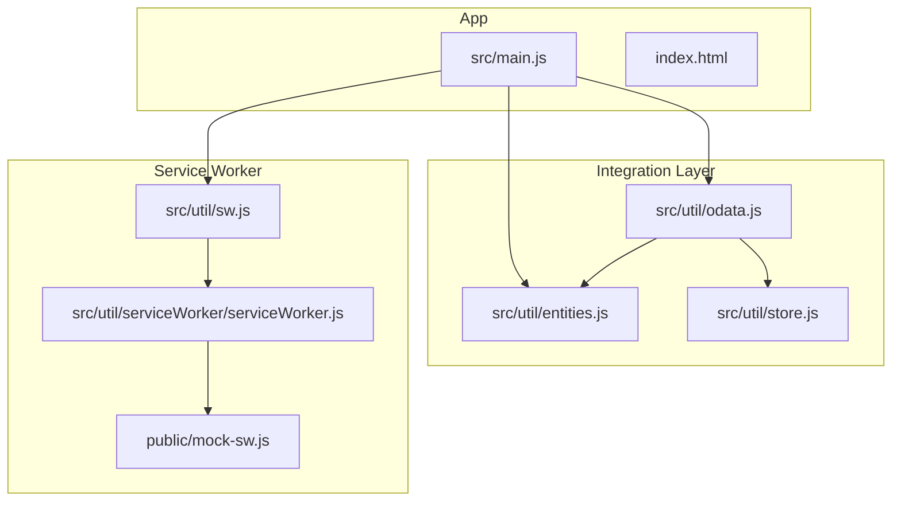
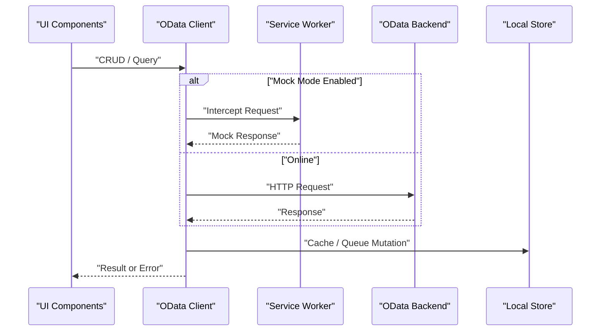
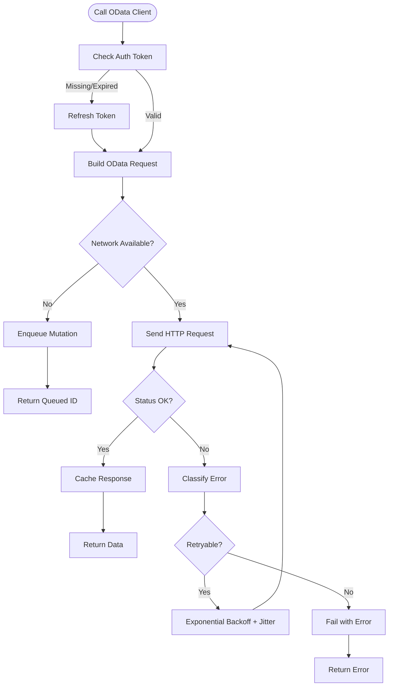
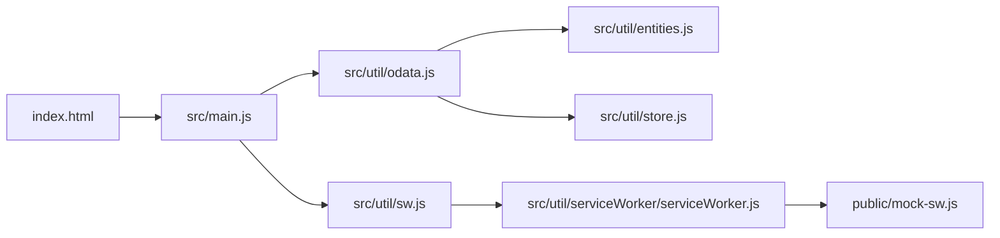

# API Integration Layer

<cite>
**Referenced Files in This Document**
- [odata.js](file://src/util/odata.js)
- [entities.js](file://src/util/entities.js)
- [store.js](file://src/util/store.js)
- [serviceWorker.js](file://src/util/serviceWorker/serviceWorker.js)
- [sw.js](file://src/util/sw.js)
- [mock-sw.js](file://public/mock-sw.js)
- [index.html](file://index.html)
- [main.js](file://src/main.js)
</cite>

## Table of Contents
1. [Introduction](#introduction)
2. [Project Structure](#project-structure)
3. [Core Components](#core-components)
4. [Architecture Overview](#architecture-overview)
5. [Detailed Component Analysis](#detailed-component-analysis)
6. [Dependency Analysis](#dependency-analysis)
7. [Performance Considerations](#performance-considerations)
8. [Troubleshooting Guide](#troubleshooting-guide)
9. [Conclusion](#conclusion)
10. [Appendices](#appendices)

## Introduction
This document describes the API integration layer with a focus on the OData client implementation, entity models, request/response handling, error management, authentication, retry policies, offline queueing, and testing strategies. It provides guidance for common operations such as CRUD, batch processing, and query filtering, along with performance optimization techniques and debugging approaches.

## Project Structure
The integration layer is primarily implemented under src/util and integrates with the service worker for caching and offline support. Key files include:
- OData client utilities
- Entity model definitions
- Local storage and persistence helpers
- Service worker registration and configuration
- Mock service worker for development/testing

**Diagram sources**
- [main.js](file://src/main.js)
- [index.html](file://index.html)
- [odata.js](file://src/util/odata.js)
- [entities.js](file://src/util/entities.js)
- [store.js](file://src/util/store.js)
- [sw.js](file://src/util/sw.js)
- [serviceWorker.js](file://src/util/serviceWorker/serviceWorker.js)
- [mock-sw.js](file://public/mock-sw.js)

**Section sources**
- [main.js](file://src/main.js)
- [index.html](file://index.html)
- [odata.js](file://src/util/odata.js)
- [entities.js](file://src/util/entities.js)
- [store.js](file://src/util/store.js)
- [sw.js](file://src/util/sw.js)
- [serviceWorker.js](file://src/util/serviceWorker/serviceWorker.js)
- [mock-sw.js](file://public/mock-sw.js)

## Core Components
- OData Client: Encapsulates HTTP interactions with an OData backend, including connection setup, request building, response parsing, and error handling.
- Entity Models: Define the shape of data exchanged with the backend (e.g., entities, navigation properties).
- Persistence Store: Provides local storage abstractions used by the client for caching and offline queuing.
- Service Worker Utilities: Manage registration, lifecycle, and mock mode to intercept network requests during development.

Key responsibilities:
- Connection configuration: base URL, headers, credentials, timeouts
- Request/response handling: GET/POST/PUT/PATCH/DELETE, batching, pagination
- Error management: network errors, HTTP status codes, validation failures
- Offline queue: persist pending mutations and replay when online
- Authentication: token injection and refresh flows
- Retry policy: exponential backoff and jitter for transient failures

**Section sources**
- [odata.js](file://src/util/odata.js)
- [entities.js](file://src/util/entities.js)
- [store.js](file://src/util/store.js)
- [sw.js](file://src/util/sw.js)
- [serviceWorker.js](file://src/util/serviceWorker/serviceWorker.js)

## Architecture Overview
The integration layer sits between UI components and the backend OData service. The service worker can intercept requests to serve cached responses or mock payloads. The OData client uses the store for persistence and applies retry and error-handling logic.

**Diagram sources**
- [odata.js](file://src/util/odata.js)
- [sw.js](file://src/util/sw.js)
- [serviceWorker.js](file://src/util/serviceWorker/serviceWorker.js)
- [mock-sw.js](file://public/mock-sw.js)
- [store.js](file://src/util/store.js)

## Detailed Component Analysis

### OData Client
Responsibilities:
- Build OData URLs with $filter, $select, $orderby, $top, $skip, $expand
- Execute HTTP methods (GET, POST, PUT, PATCH, DELETE)
- Handle retries with exponential backoff and jitter
- Parse and normalize responses
- Persist failed writes to an offline queue
- Inject authentication headers and manage tokens

Connection configuration:
- Base URL and endpoint prefixes
- Default headers (Content-Type, Accept, Authorization)
- Timeout and retry settings
- Feature flags (batch, offline queue, cache)

Request/response handling:
- Serialize payloads for non-GET methods
- Normalize OData metadata and entity shapes
- Support batch requests where applicable

Error management:
- Distinguish network vs. server errors
- Map HTTP status codes to domain errors
- Surface actionable messages to callers

Authentication mechanisms:
- Bearer token injection from secure storage
- Token refresh flow before sending requests
- Handling 401/403 responses and re-authentication

Retry policies:
- Configurable max attempts and backoff strategy
- Idempotency checks for safe retries
- Circuit breaker behavior for persistent failures

Offline queue management:
- Queue mutations locally when offline
- Replay queued operations when connectivity restored
- Deduplicate and conflict resolution strategies

Common operations examples:
- Create: POST to entity set with payload
- Read: GET with filters and selects
- Update: PATCH/PUT to resource
- Delete: DELETE by key
- Batch: Combine multiple operations in one request
- Query filtering: Use $filter and $search

**Diagram sources**
- [odata.js](file://src/util/odata.js)
- [store.js](file://src/util/store.js)

**Section sources**
- [odata.js](file://src/util/odata.js)
- [store.js](file://src/util/store.js)

### Entity Models and Data Structures
Purpose:
- Provide consistent types for entities exchanged with the backend
- Describe keys, navigation properties, and computed fields
- Aid in serialization/deserialization and validation

Typical structure:
- Entity sets and singletons
- Keys and primary identifiers
- Navigation properties for relationships
- Metadata-driven field mapping

Usage patterns:
- Define models once and reuse across views
- Validate payloads before sending
- Map backend responses to normalized structures

**Section sources**
- [entities.js](file://src/util/entities.js)

### Persistence Store
Responsibilities:
- Wrap localStorage/sessionStorage APIs
- Provide typed get/set/remove operations
- Support transactional updates for queues
- Offer change listeners for reactive updates

Offline queue:
- Append-only log of mutations
- Ordered replay with idempotency keys
- Conflict detection and resolution hooks

**Section sources**
- [store.js](file://src/util/store.js)

### Service Worker Integration
Registration and lifecycle:
- Register SW at app startup
- Handle install/activate events
- Manage cache versions and migrations

Interception:
- Intercept fetch events
- Serve cached or mock responses
- Forward to network when needed

Mock mode:
- Enable/disable via feature flag
- Route specific endpoints to mock payloads
- Simulate latency and errors for testing

**Section sources**
- [sw.js](file://src/util/sw.js)
- [serviceWorker.js](file://src/util/serviceWorker/serviceWorker.js)
- [mock-sw.js](file://public/mock-sw.js)

## Dependency Analysis
High-level dependencies:
- main.js initializes the app and registers the service worker
- index.html includes the application entry point
- odata.js depends on entities.js for model definitions and store.js for persistence
- sw.js and serviceWorker.js coordinate SW registration and interception
- mock-sw.js provides test fixtures and behaviors

**Diagram sources**
- [main.js](file://src/main.js)
- [index.html](file://index.html)
- [odata.js](file://src/util/odata.js)
- [entities.js](file://src/util/entities.js)
- [store.js](file://src/util/store.js)
- [sw.js](file://src/util/sw.js)
- [serviceWorker.js](file://src/util/serviceWorker/serviceWorker.js)
- [mock-sw.js](file://public/mock-sw.js)

**Section sources**
- [main.js](file://src/main.js)
- [index.html](file://index.html)
- [odata.js](file://src/util/odata.js)
- [entities.js](file://src/util/entities.js)
- [store.js](file://src/util/store.js)
- [sw.js](file://src/util/sw.js)
- [serviceWorker.js](file://src/util/serviceWorker/serviceWorker.js)
- [mock-sw.js](file://public/mock-sw.js)

## Performance Considerations
- Prefer selective queries using $select to reduce payload size
- Use $top/$skip for pagination instead of loading entire datasets
- Leverage $expand judiciously; prefer separate calls for heavy navigations
- Implement request deduplication to avoid redundant network calls
- Apply caching at the client and service worker layers
- Batch related writes to minimize round trips
- Tune retry backoff parameters based on observed failure rates
- Debounce rapid successive mutations to prevent queue bloat

[No sources needed since this section provides general guidance]

## Troubleshooting Guide
Debugging steps:
- Enable verbose logging in the OData client to inspect requests/responses
- Verify authentication headers and token validity
- Inspect service worker state and intercepted requests
- Review offline queue contents and replay logs
- Confirm entity model mappings match backend schema

Common issues:
- CORS errors: ensure backend allows required headers and origins
- 401/403: check token refresh flow and permissions
- 429/5xx: adjust retry policy and backoff parameters
- Stale cache: invalidate caches after schema changes
- Mock conflicts: disable mock mode when validating against live backend

Operational tips:
- Use dedicated dev environment variables for mock mode
- Add correlation IDs to requests for tracing
- Monitor queue depth and replay success rates

**Section sources**
- [odata.js](file://src/util/odata.js)
- [sw.js](file://src/util/sw.js)
- [serviceWorker.js](file://src/util/serviceWorker/serviceWorker.js)
- [mock-sw.js](file://public/mock-sw.js)
- [store.js](file://src/util/store.js)

## Conclusion
The integration layer provides a robust OData client with strong error handling, retry policies, offline queueing, and service worker-based caching and mocking. By leveraging entity models and a persistent store, it ensures reliable communication with backend systems while supporting efficient querying and batch operations. Following the performance and troubleshooting recommendations will help maintain stability and responsiveness in production environments.

[No sources needed since this section summarizes without analyzing specific files]

## Appendices

### API Operations Reference
- Create: POST to entity set with validated payload
- Read: GET with $filter, $select, $orderby, $top, $skip
- Update: PATCH/PUT to resource by key
- Delete: DELETE by key
- Batch: Combine multiple operations into a single request
- Query Filtering: Compose complex filters using supported operators

[No sources needed since this section provides general guidance]

### Authentication Mechanisms
- Bearer token injection from secure storage
- Automatic refresh before sending requests
- Handling 401/403 with re-authentication flow
- Scope-based authorization checks

[No sources needed since this section provides general guidance]

### Retry Policies
- Exponential backoff with configurable multiplier and jitter
- Max attempts and circuit breaker thresholds
- Idempotency enforcement for safe retries
- Fallback strategies for critical operations

[No sources needed since this section provides general guidance]

### Offline Queue Management
- Append-only mutation log with unique IDs
- Ordered replay upon connectivity restoration
- Conflict detection and resolution hooks
- Monitoring and alerting for queue growth

[No sources needed since this section provides general guidance]

### Mocking APIs for Development and Testing
- Enable mock mode via feature flag
- Route specific endpoints to predefined payloads
- Simulate latency and error conditions
- Validate client behavior against deterministic responses

**Section sources**
- [mock-sw.js](file://public/mock-sw.js)
- [serviceWorker.js](file://src/util/serviceWorker/serviceWorker.js)