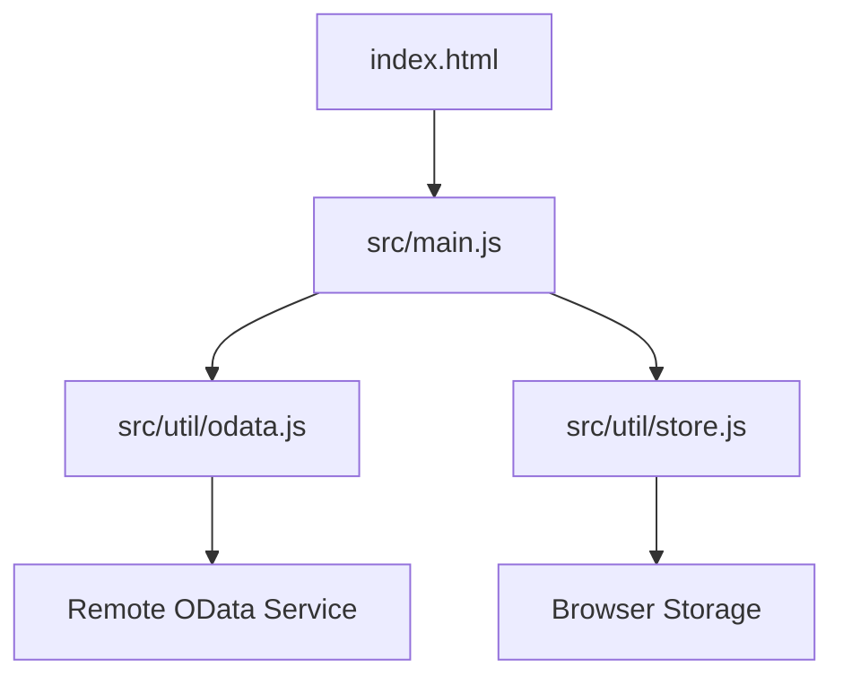
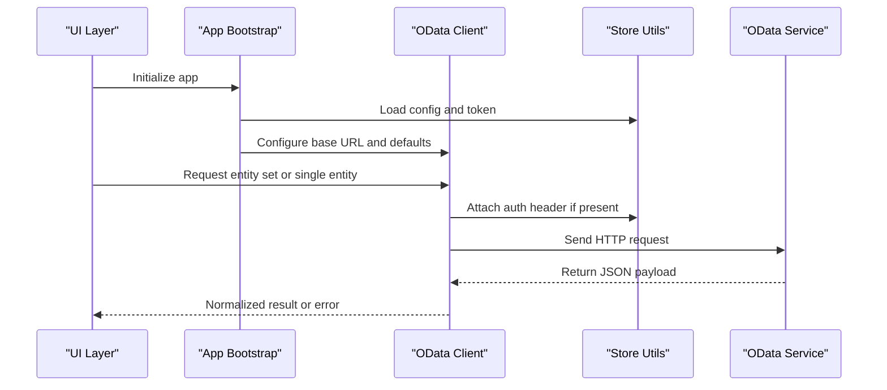
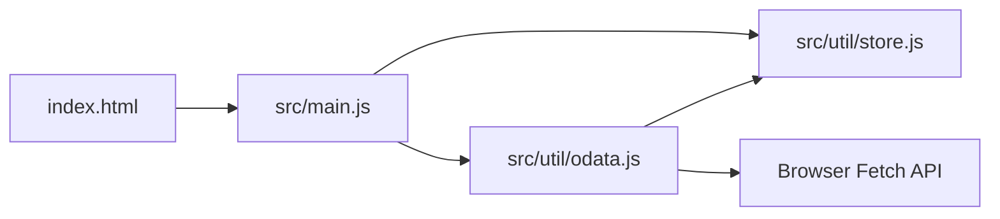

# API Integration

<cite>
**Referenced Files in This Document**
- [odata.js](file://src/util/odata.js)
- [store.js](file://src/util/store.js)
- [main.js](file://src/main.js)
- [index.html](file://index.html)
- [package.json](file://package.json)
</cite>

## Table of Contents
1. [Introduction](#introduction)
2. [Project Structure](#project-structure)
3. [Core Components](#core-components)
4. [Architecture Overview](#architecture-overview)
5. [Detailed Component Analysis](#detailed-component-analysis)
6. [Dependency Analysis](#dependency-analysis)
7. [Performance Considerations](#performance-considerations)
8. [Troubleshooting Guide](#troubleshooting-guide)
9. [Conclusion](#conclusion)
10. [Appendices](#appendices)

## Introduction
This document describes the backend integration layer for ahm-gr-scanner, focusing on the OData client implementation and how the application communicates with remote services. It covers request/response formats, authentication methods, error handling strategies, retry mechanisms, timeout configuration, batch operations, real-time updates, security considerations, rate limiting, versioning, and practical guidelines for integrating with the APIs.

The integration is implemented as a lightweight OData client utility that centralizes HTTP interactions, query building, and response normalization. The application uses this utility to perform CRUD operations, batch requests, and subscribe to change notifications where supported by the backend.

## Project Structure
The backend integration is primarily implemented under src/util and consumed by views and components. Key files:
- OData client utility: src/util/odata.js
- Local storage and state helpers: src/util/store.js
- Application bootstrap and initialization: src/main.js
- Entry HTML: index.html
- Dependencies and scripts: package.json

**Diagram sources**
- [index.html](file://index.html)
- [main.js](file://src/main.js)
- [odata.js](file://src/util/odata.js)
- [store.js](file://src/util/store.js)

**Section sources**
- [index.html](file://index.html)
- [main.js](file://src/main.js)
- [odata.js](file://src/util/odata.js)
- [store.js](file://src/util/store.js)
- [package.json](file://package.json)

## Core Components
- OData Client (src/util/odata.js): Provides functions to build OData queries, send HTTP requests, handle headers (including authentication), parse responses, and manage retries/timeouts.
- Store Utilities (src/util/store.js): Manages local persistence for tokens, settings, and cached entities; used by the OData client to persist credentials and cache responses when appropriate.
- Bootstrap (src/main.js): Initializes the app, loads configuration, sets up the OData client, and wires UI actions to API calls.

Responsibilities:
- Centralize all outbound network calls through the OData client.
- Normalize payloads and errors across different endpoints.
- Provide reusable helpers for common operations like list, get, create, update, delete, and batch.

**Section sources**
- [odata.js](file://src/util/odata.js)
- [store.js](file://src/util/store.js)
- [main.js](file://src/main.js)

## Architecture Overview
The integration follows a layered approach:
- Presentation layer (views/components) invokes business logic.
- Business logic calls the OData client for data access.
- OData client handles HTTP transport, headers, retries, timeouts, and response parsing.
- Store utilities provide persistent storage for tokens and caches.

**Diagram sources**
- [main.js](file://src/main.js)
- [odata.js](file://src/util/odata.js)
- [store.js](file://src/util/store.js)

## Detailed Component Analysis

### OData Client Implementation
The OData client encapsulates:
- Base URL configuration and default options (timeout, retries).
- Header management for Content-Type, Accept, and Authorization.
- Query string construction for $filter, $select, $orderby, $top, $skip, $expand, and $count.
- Batch request support using multipart/mixed where applicable.
- Response normalization and error mapping.
- Retry and backoff strategy for transient failures.

Key behaviors:
- Authentication: Supports bearer tokens and custom headers via store-backed configuration.
- Timeouts: Configurable per-request or global defaults.
- Retries: Exponential backoff with jitter for 5xx and network errors.
- Error handling: Converts HTTP status codes into typed errors with context.

Common operations:
- GET /EntitySet?$filter=...&$select=...
- GET /EntitySet(key)
- POST /EntitySet
- PATCH /EntitySet(key)
- DELETE /EntitySet(key)
- Batch: POST $batch with multiple operations

Examples of typical calls:
- List items with filtering and pagination
- Create an item and return created entity
- Update fields of an existing item
- Delete an item
- Batch create/update/delete in one request

Real-time updates:
- If the backend supports Server-Sent Events (SSE) or WebSocket-based change feeds, the client can subscribe to change events and push updates to the UI. Otherwise, polling intervals are configured at the app level.

Security considerations:
- Use HTTPS only.
- Store tokens securely and rotate them regularly.
- Avoid logging sensitive headers or payloads.
- Validate and sanitize inputs before sending.

Rate limiting:
- Respect server-provided headers (e.g., Retry-After, X-RateLimit-Remaining).
- Implement client-side throttling and queueing to avoid bursts.

Versioning:
- Prefer URI path versioning (/v1/...) or Accept header versioning.
- Keep backward compatibility and deprecation notices.

Batch operations:
- Group independent operations into a single batch request.
- Ensure idempotency for safe retries.
- Handle partial success responses and rollbacks where possible.

Timeouts and retries:
- Default timeout per request; override per call when needed.
- Retry on transient errors with exponential backoff and jitter.
- Fail fast on validation errors and 4xx responses.

Error handling strategies:
- Map HTTP statuses to user-friendly messages.
- Include correlation IDs for tracing.
- Surface actionable guidance (e.g., re-authentication prompts).

Client implementation guidelines:
- Always configure base URL and auth once during bootstrap.
- Use helper functions for repeated patterns (list, get, create, update, delete).
- Centralize error logging and metrics collection.
- Cache read-only data locally when appropriate.

Debugging approaches:
- Enable verbose logs for requests/responses in development.
- Capture network traces and correlate with server logs.
- Validate OData query strings against OpenAPI/OAS specs.
- Use feature flags to toggle retry/backoff behavior.

**Section sources**
- [odata.js](file://src/util/odata.js)
- [store.js](file://src/util/store.js)
- [main.js](file://src/main.js)

### Store Utilities
Responsibilities:
- Persist tokens, endpoint URLs, and feature flags.
- Provide getters/setters for configuration values.
- Offer simple caching for frequently accessed entities.

Integration points:
- OData client reads/writes tokens and settings from store.
- Views may directly use store for UI state and persisted preferences.

Best practices:
- Encrypt sensitive values when possible.
- Clear stale entries on logout or expiration.
- Provide migration helpers for schema changes.

**Section sources**
- [store.js](file://src/util/store.js)

### Bootstrap and Initialization
Responsibilities:
- Load configuration from environment or store.
- Initialize OData client with base URL, timeouts, and retry policies.
- Wire UI actions to API calls.

Initialization flow:
- Parse configuration.
- Set up store.
- Configure OData client.
- Start background tasks (polling/SSE) if enabled.

**Section sources**
- [main.js](file://src/main.js)
- [index.html](file://index.html)

## Dependency Analysis
High-level dependencies:
- index.html loads main.js.
- main.js initializes store and odata client.
- odata.js depends on browser fetch and store utilities.
- package.json defines dev/build tools and runtime dependencies.

**Diagram sources**
- [index.html](file://index.html)
- [main.js](file://src/main.js)
- [odata.js](file://src/util/odata.js)
- [store.js](file://src/util/store.js)

**Section sources**
- [package.json](file://package.json)
- [main.js](file://src/main.js)
- [odata.js](file://src/util/odata.js)
- [store.js](file://src/util/store.js)

## Performance Considerations
- Minimize payload size with $select and $expand judiciously.
- Use pagination ($top/$skip) for large lists.
- Cache immutable or rarely changing data locally.
- Debounce rapid UI-triggered requests.
- Prefer batch operations for multiple writes.
- Tune timeouts and retries based on network conditions.
- Monitor memory usage for long-running subscriptions.

[No sources needed since this section provides general guidance]

## Troubleshooting Guide
Common issues and resolutions:
- Authentication failures: Verify token presence, expiry, and scope; refresh tokens automatically if supported.
- CORS errors: Ensure proper Access-Control headers on the backend; configure proxy in development if needed.
- Timeout errors: Increase timeout for slow endpoints; investigate server load.
- Rate limiting: Implement client-side throttling; honor Retry-After headers.
- Partial batch failures: Inspect batch response parts; implement rollback or compensation logic.
- Real-time updates not received: Check SSE/WebSocket connectivity; verify event source URL and authentication.

Debugging steps:
- Enable detailed logs for requests/responses in development.
- Reproduce with minimal payloads and isolate failing operations.
- Compare working vs failing OData query strings.
- Correlate client correlation IDs with server logs.

**Section sources**
- [odata.js](file://src/util/odata.js)
- [store.js](file://src/util/store.js)
- [main.js](file://src/main.js)

## Conclusion
The backend integration layer centers around a robust OData client that standardizes HTTP interactions, authentication, retries, timeouts, and error handling. By following the guidelines here—especially around security, rate limiting, versioning, and debugging—you can reliably integrate with the backend services and maintain a responsive, resilient user experience.

[No sources needed since this section summarizes without analyzing specific files]

## Appendices

### API Reference Summary
- Authentication: Bearer token via Authorization header; token managed by store utilities.
- Versioning: Prefer URI path versioning (/v1/...).
- Common Methods:
  - GET /v1/EntitySet
  - GET /v1/EntitySet(key)
  - POST /v1/EntitySet
  - PATCH /v1/EntitySet(key)
  - DELETE /v1/EntitySet(key)
  - POST /v1/$batch
- Query Options: $filter, $select, $orderby, $top, $skip, $expand, $count.
- Real-time Updates: SSE or WebSocket-based change feed if supported by backend.

[No sources needed since this section provides general guidance]