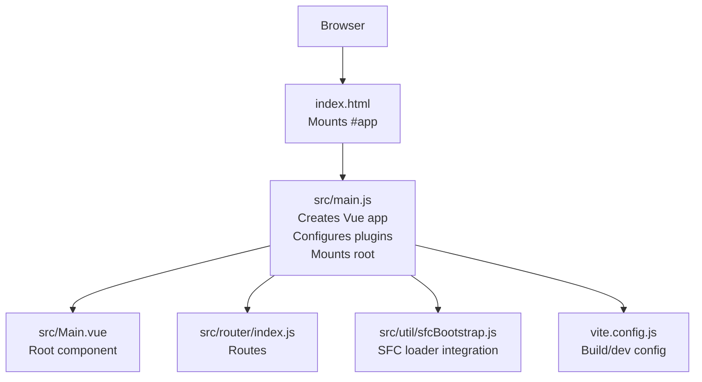
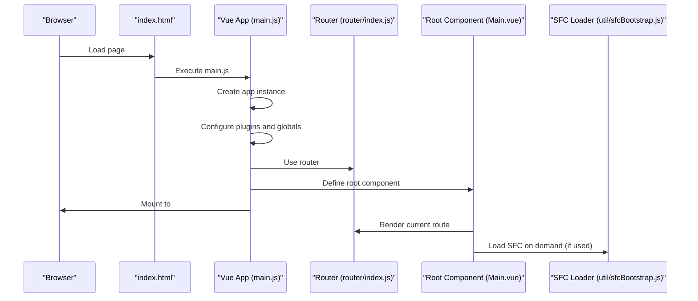
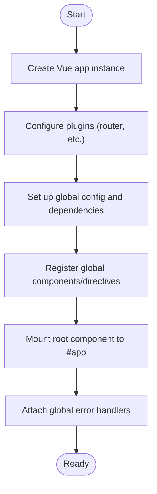
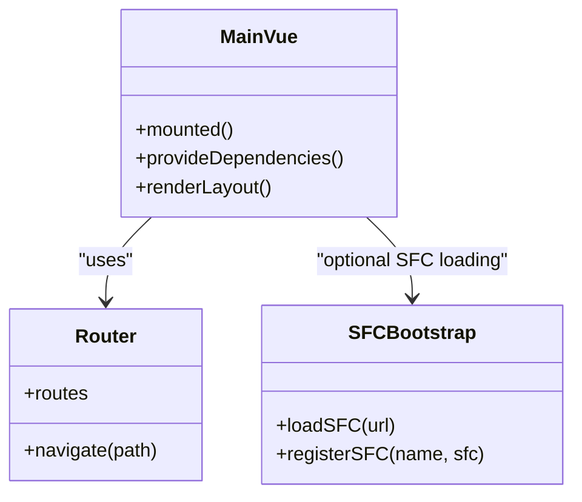
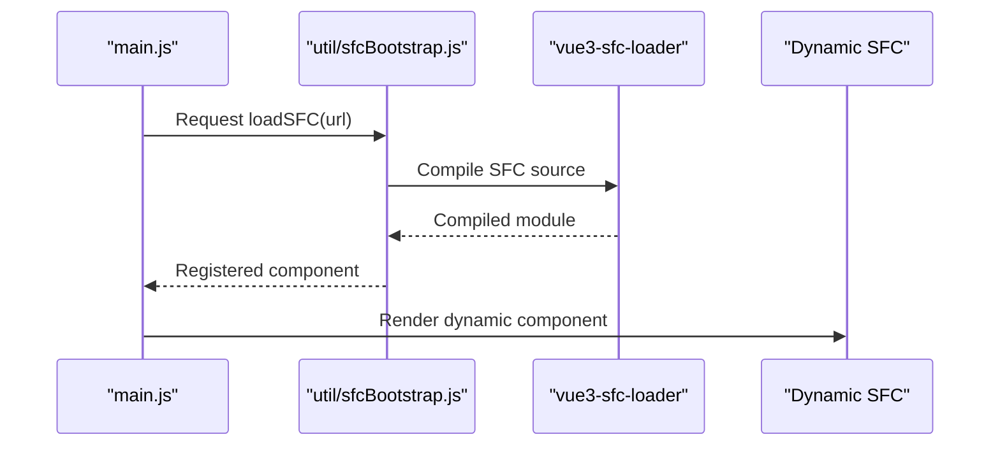
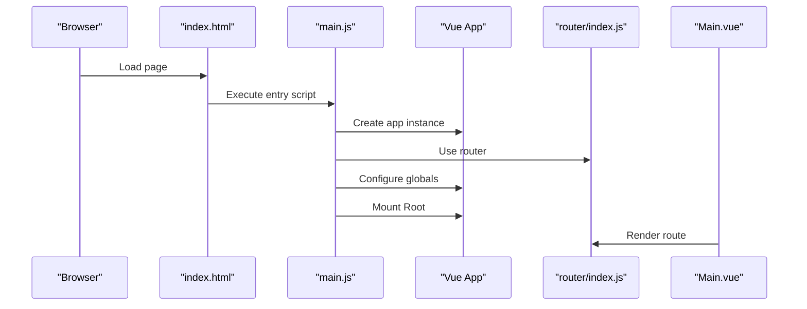
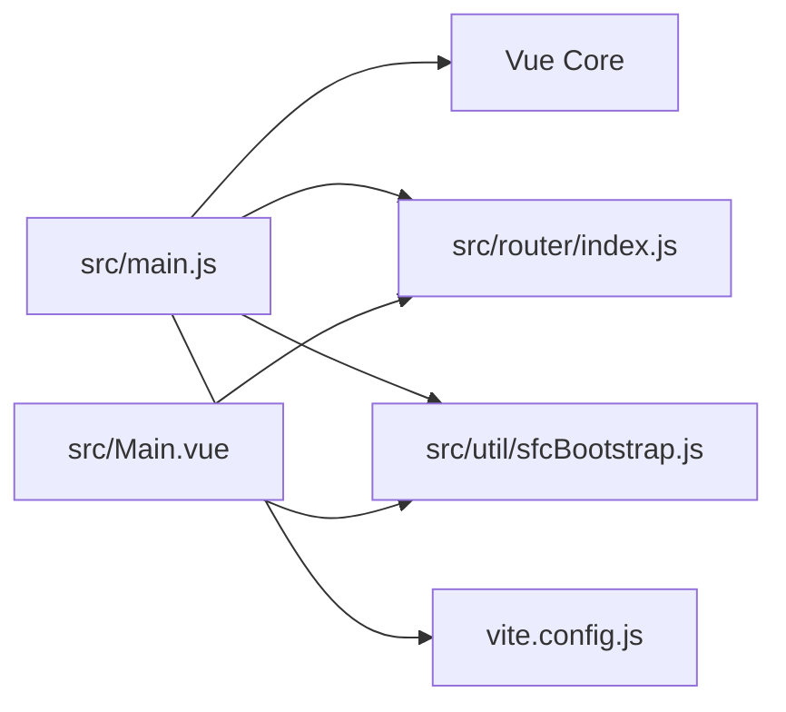

# Application Structure

<cite>
**Referenced Files in This Document**
- [main.js](file://src/main.js)
- [Main.vue](file://src/Main.vue)
- [index.html](file://index.html)
- [router/index.js](file://src/router/index.js)
- [util/sfcBootstrap.js](file://src/util/sfcBootstrap.js)
- [main.sfc.js](file://src/main.sfc.js)
- [vite.config.js](file://vite.config.js)
</cite>

## Table of Contents
1. [Introduction](#introduction)
2. [Project Structure](#project-structure)
3. [Core Components](#core-components)
4. [Architecture Overview](#architecture-overview)
5. [Detailed Component Analysis](#detailed-component-analysis)
6. [Dependency Analysis](#dependency-analysis)
7. [Performance Considerations](#performance-considerations)
8. [Troubleshooting Guide](#troubleshooting-guide)
9. [Conclusion](#conclusion)

## Introduction
This section documents the bootstrap and initialization of the ahm-gr-scanner Vue.js application. It explains how the runtime starts, how the Vue instance is configured, how the root component hierarchy is established, and how SFC (Single File Component) loading is integrated. It also covers dependency injection patterns, global configuration setup, error handling during boot, and the relationship between the main entry points and individual components.

## Project Structure
The application uses a conventional layout with:
- A browser entry HTML file that mounts the app into a DOM element.
- A JavaScript entry point that creates and configures the Vue application instance.
- A root component that composes top-level UI and routing.
- Optional SFC-based bootstrap for dynamic or remote component loading.
- Build-time configuration to support SFC compilation and development tooling.

**Diagram sources**
- [index.html](file://index.html)
- [main.js](file://src/main.js)
- [Main.vue](file://src/Main.vue)
- [router/index.js](file://src/router/index.js)
- [util/sfcBootstrap.js](file://src/util/sfcBootstrap.js)
- [vite.config.js](file://vite.config.js)

**Section sources**
- [index.html](file://index.html)
- [main.js](file://src/main.js)
- [Main.vue](file://src/Main.vue)
- [router/index.js](file://src/router/index.js)
- [util/sfcBootstrap.js](file://src/util/sfcBootstrap.js)
- [vite.config.js](file://vite.config.js)

## Core Components
- Entry point: The JavaScript entry initializes the Vue application, registers plugins, sets up global configuration, and mounts the root component into the DOM.
- Root component: The root component defines the top-level layout and integrates routing and shared UI elements.
- Router: Centralized route definitions that map URLs to view components.
- SFC Bootstrap: Utility to load and compile SFCs at runtime when needed.

Key responsibilities:
- Create and configure the Vue app instance.
- Register global directives, components, and utilities.
- Configure router and attach it to the app.
- Mount the root component into the document.
- Provide error boundaries and fallback behavior during startup.

**Section sources**
- [main.js](file://src/main.js)
- [Main.vue](file://src/Main.vue)
- [router/index.js](file://src/router/index.js)
- [util/sfcBootstrap.js](file://src/util/sfcBootstrap.js)

## Architecture Overview
The runtime architecture follows a standard Vue 3 pattern with optional SFC loading:

**Diagram sources**
- [index.html](file://index.html)
- [main.js](file://src/main.js)
- [router/index.js](file://src/router/index.js)
- [Main.vue](file://src/Main.vue)
- [util/sfcBootstrap.js](file://src/util/sfcBootstrap.js)

## Detailed Component Analysis

### Bootstrap Flow (main.js)
Responsibilities:
- Create the Vue application instance.
- Install and configure plugins (e.g., router).
- Set up global configuration and dependencies.
- Register global components/directives if needed.
- Mount the root component into the DOM.
- Handle early errors and provide user-friendly fallbacks.

Initialization flow:
1. Parse environment and build-time settings.
2. Instantiate the Vue app.
3. Configure router and attach to the app.
4. Register global utilities and SFC loader integration.
5. Mount the root component into the target container.
6. Attach global error handlers for unhandled promise rejections and component errors.

**Diagram sources**
- [main.js](file://src/main.js)
- [router/index.js](file://src/router/index.js)
- [util/sfcBootstrap.js](file://src/util/sfcBootstrap.js)

**Section sources**
- [main.js](file://src/main.js)
- [router/index.js](file://src/router/index.js)
- [util/sfcBootstrap.js](file://src/util/sfcBootstrap.js)

### Root Component (Main.vue)
Responsibilities:
- Compose the top-level layout.
- Integrate routing outlets and navigation.
- Provide shared state or context via dependency injection patterns (e.g., provide/inject or composables).
- Coordinate lifecycle events at the application level.

Relationship to other parts:
- Consumes routes defined in the router.
- May dynamically import or register child components.
- Can request SFCs through the SFC bootstrap utility when necessary.

**Diagram sources**
- [Main.vue](file://src/Main.vue)
- [router/index.js](file://src/router/index.js)
- [util/sfcBootstrap.js](file://src/util/sfcBootstrap.js)

**Section sources**
- [Main.vue](file://src/Main.vue)
- [router/index.js](file://src/router/index.js)
- [util/sfcBootstrap.js](file://src/util/sfcBootstrap.js)

### HTML Template Structure (index.html)
Responsibilities:
- Provide the root DOM container for mounting the Vue app.
- Include any required polyfills or base styles.
- Reference the compiled entry script.

Integration points:
- The entry script targets a specific container ID to mount the app.
- Global styles and scripts are loaded here to ensure availability before app initialization.

**Section sources**
- [index.html](file://index.html)

### SFC Loader Integration (util/sfcBootstrap.js and main.sfc.js)
Responsibilities:
- Provide a runtime mechanism to load and compile SFCs on demand.
- Expose helpers to register dynamically loaded components globally or locally.
- Integrate with the build system to enable SFC compilation in development and production.

Usage patterns:
- Lazy-load feature-specific SFCs to reduce initial bundle size.
- Register SFCs under stable names for consistent usage across the app.

**Diagram sources**
- [util/sfcBootstrap.js](file://src/util/sfcBootstrap.js)
- [main.sfc.js](file://src/main.sfc.js)

**Section sources**
- [util/sfcBootstrap.js](file://src/util/sfcBootstrap.js)
- [main.sfc.js](file://src/main.sfc.js)

### Dependency Injection Patterns
Patterns commonly used:
- Provide/Inject: Share services or configuration from parent components down the tree.
- Composables: Encapsulate reusable logic and state, consumed by multiple components.
- Global registry: Register utilities or services at app creation time for broad access.

Benefits:
- Decouples components from concrete implementations.
- Simplifies testing by allowing mock injections.
- Centralizes configuration and cross-cutting concerns.

**Section sources**
- [main.js](file://src/main.js)
- [Main.vue](file://src/Main.vue)

### Application Initialization Flow
End-to-end sequence:
1. Browser loads index.html and executes the entry script.
2. The entry script creates the Vue app instance and configures plugins.
3. Router is attached and routes are registered.
4. Global configuration and dependencies are set up.
5. Root component is mounted into the DOM.
6. Error handlers are installed to catch runtime issues.

**Diagram sources**
- [index.html](file://index.html)
- [main.js](file://src/main.js)
- [router/index.js](file://src/router/index.js)
- [Main.vue](file://src/Main.vue)

**Section sources**
- [index.html](file://index.html)
- [main.js](file://src/main.js)
- [router/index.js](file://src/router/index.js)
- [Main.vue](file://src/Main.vue)

## Dependency Analysis
High-level relationships:
- main.js depends on Vue core, router, and optional SFC bootstrap utilities.
- Main.vue depends on router and may depend on SFC bootstrap for dynamic features.
- vite.config.js influences how SFCs are compiled and served during development and production.

**Diagram sources**
- [main.js](file://src/main.js)
- [Main.vue](file://src/Main.vue)
- [router/index.js](file://src/router/index.js)
- [util/sfcBootstrap.js](file://src/util/sfcBootstrap.js)
- [vite.config.js](file://vite.config.js)

**Section sources**
- [main.js](file://src/main.js)
- [Main.vue](file://src/Main.vue)
- [router/index.js](file://src/router/index.js)
- [util/sfcBootstrap.js](file://src/util/sfcBootstrap.js)
- [vite.config.js](file://vite.config.js)

## Performance Considerations
- Prefer lazy-loading of heavy components and views to reduce initial payload.
- Use SFC bootstrap selectively for large or rarely used features.
- Keep global registrations minimal; prefer local imports where possible.
- Leverage build optimizations in the configuration to tree-shake unused code.

[No sources needed since this section provides general guidance]

## Troubleshooting Guide
Common issues and strategies:
- Mount failures: Ensure the DOM container exists before mounting and handle errors gracefully.
- Router misconfiguration: Verify route paths and component imports; check navigation guards if present.
- SFC loading errors: Validate URLs and network availability; add fallbacks and logging.
- Global dependency conflicts: Audit global registrations and avoid overwriting existing keys.

Error handling recommendations:
- Wrap critical initialization steps in try/catch blocks.
- Install global error handlers to capture unhandled exceptions and promise rejections.
- Provide user-facing fallbacks and logs for debugging.

**Section sources**
- [main.js](file://src/main.js)
- [util/sfcBootstrap.js](file://src/util/sfcBootstrap.js)

## Conclusion
The ahm-gr-scanner application follows a clear and extensible bootstrap pattern. The entry point configures the Vue instance, attaches the router, sets up global dependencies, and mounts the root component. Optional SFC loading enables dynamic feature composition while keeping the initial bundle lean. By adhering to dependency injection patterns and robust error handling, the application remains maintainable and performant.

[No sources needed since this section summarizes without analyzing specific files]