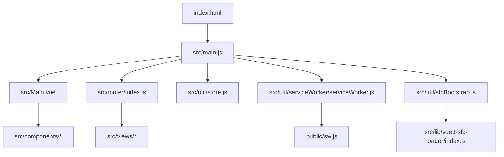
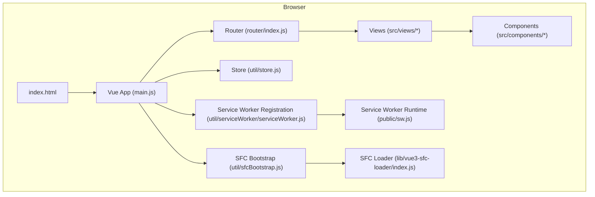
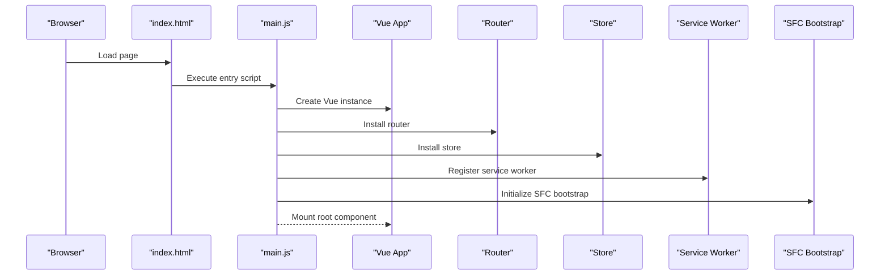
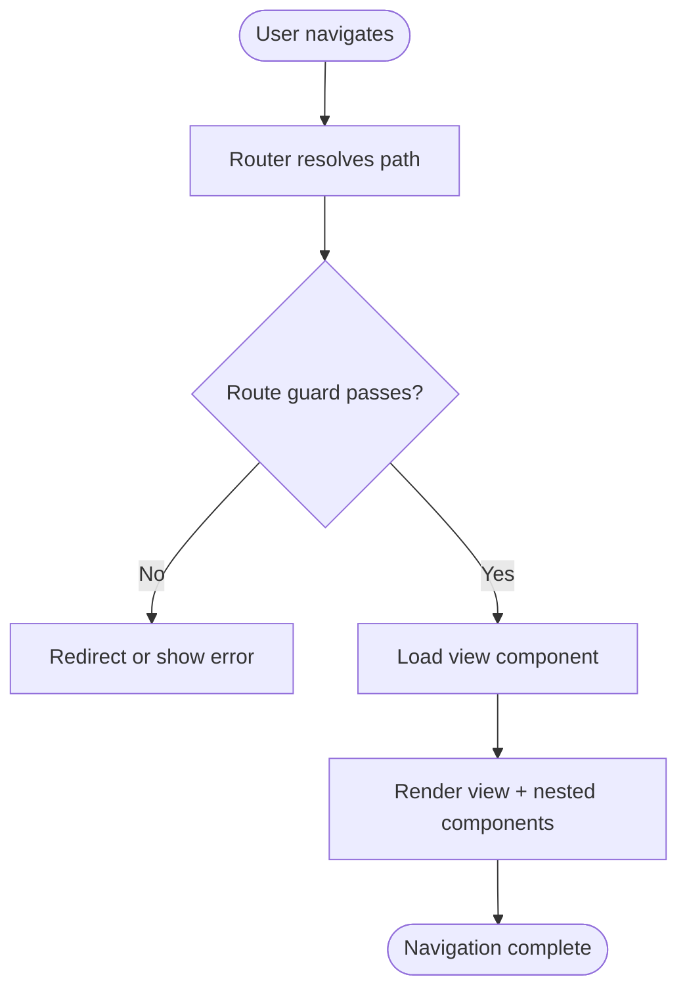
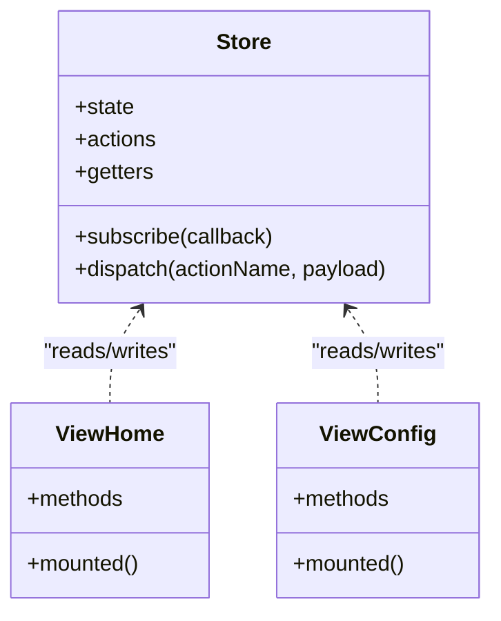
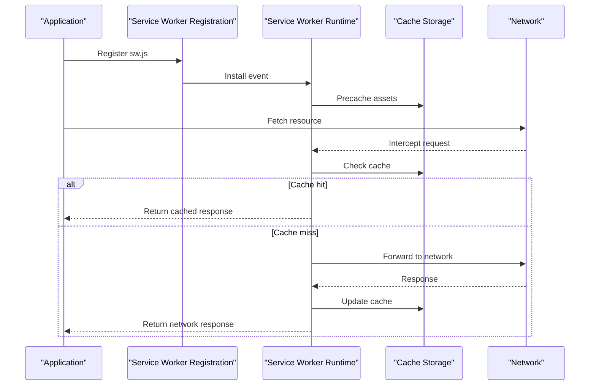
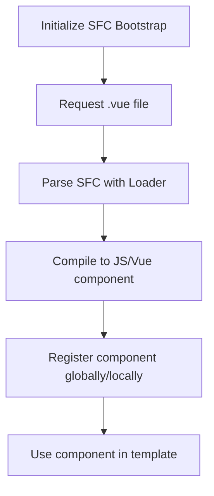
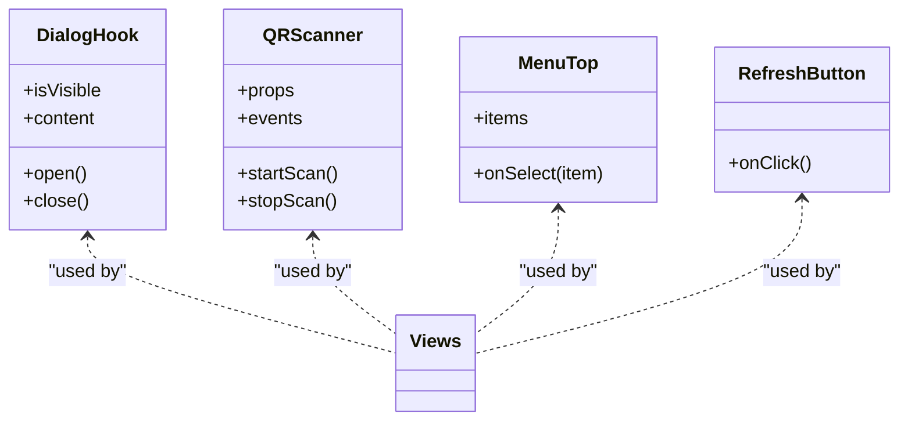
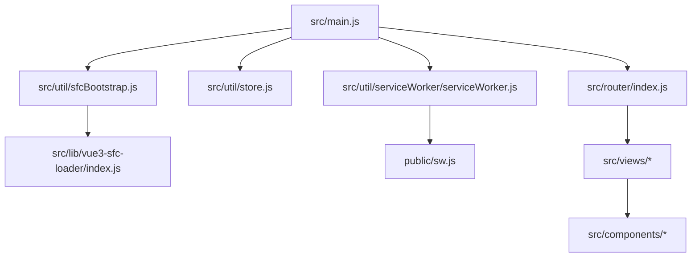

# Architecture & Design

<cite>
**Referenced Files in This Document**
- [index.html](file://index.html)
- [main.js](file://src/main.js)
- [Main.vue](file://src/Main.vue)
- [router/index.js](file://src/router/index.js)
- [util/store.js](file://src/util/store.js)
- [util/serviceWorker/serviceWorker.js](file://src/util/serviceWorker/serviceWorker.js)
- [public/sw.js](file://public/sw.js)
- [vite.config.js](file://vite.config.js)
- [lib/vue3-sfc-loader/index.js](file://src/lib/vue3-sfc-loader/index.js)
- [util/sfcBootstrap.js](file://src/util/sfcBootstrap.js)
- [components/dialog/useDialog.js](file://src/components/dialog/useDialog.js)
- [components/qrcode/scanner/index.vue](file://src/components/qrcode/scanner/index.vue)
- [views/home/index.vue](file://src/views/home/index.vue)
- [views/config/index.vue](file://src/views/config/index.vue)
</cite>

## Table of Contents
1. [Introduction](#introduction)
2. [Project Structure](#project-structure)
3. [Core Components](#core-components)
4. [Architecture Overview](#architecture-overview)
5. [Detailed Component Analysis](#detailed-component-analysis)
6. [Dependency Analysis](#dependency-analysis)
7. [Performance Considerations](#performance-considerations)
8. [Troubleshooting Guide](#troubleshooting-guide)
9. [Conclusion](#conclusion)
10. [Appendices](#appendices)

## Introduction
This document describes the architecture and design of the ahm-gr-scanner application. The app is a Vue 3 single-page application built with the Composition API, organized around a component-based structure and service-oriented patterns. It features:
- A client-side router for navigation between views
- Centralized state management via a lightweight store module
- Service Worker integration for offline capabilities and caching strategies
- Dynamic component loading using an SFC loader to bootstrap components at runtime
- Mobile-first responsive UI patterns

The goal is to provide both high-level architectural insight and code-level details to help developers understand system boundaries, data flows, integration points, and extension mechanisms.

## Project Structure
The project follows a feature-oriented layout under src/:
- Entry point and bootstrapping: main.js initializes the Vue app, registers plugins (router, store), and mounts the root component
- Routing: src/router/index.js defines routes mapping URLs to view components
- Views: src/views/* contains page-level components
- Shared components: src/components/* provides reusable UI pieces (dialogs, QR scanner/generator, menus, etc.)
- Utilities: src/util/* includes store, service worker helpers, SFC bootstrap, barcode utilities, and more
- Public assets: public/* includes static files like the production Service Worker manifest
- Build configuration: vite.config.js configures Vite build behavior and plugin usage

**Diagram sources**
- [index.html](file://index.html)
- [main.js](file://src/main.js)
- [Main.vue](file://src/Main.vue)
- [router/index.js](file://src/router/index.js)
- [util/store.js](file://src/util/store.js)
- [util/serviceWorker/serviceWorker.js](file://src/util/serviceWorker/serviceWorker.js)
- [public/sw.js](file://public/sw.js)
- [util/sfcBootstrap.js](file://src/util/sfcBootstrap.js)
- [lib/vue3-sfc-loader/index.js](file://src/lib/vue3-sfc-loader/index.js)

**Section sources**
- [index.html](file://index.html)
- [main.js](file://src/main.js)
- [vite.config.js](file://vite.config.js)

## Core Components
- Application shell: The root component renders the top-level layout and integrates routing outlets and global UI elements.
- Router: Declares route definitions and guards, mapping URL paths to view components.
- Store: Provides reactive state and actions used across views and components.
- Service Worker: Registers and manages caching, background sync, and offline fallbacks.
- SFC Bootstrap: Dynamically loads and compiles Single File Components at runtime using the SFC loader.

Key responsibilities:
- Routing controls navigation and view composition
- Store centralizes shared state and side effects
- Service Worker ensures resilience and performance through caching
- SFC loader enables dynamic component registration without pre-bundling

**Section sources**
- [main.js](file://src/main.js)
- [router/index.js](file://src/router/index.js)
- [util/store.js](file://src/util/store.js)
- [util/serviceWorker/serviceWorker.js](file://src/util/serviceWorker/serviceWorker.js)
- [util/sfcBootstrap.js](file://src/util/sfcBootstrap.js)
- [lib/vue3-sfc-loader/index.js](file://src/lib/vue3-sfc-loader/index.js)

## Architecture Overview
High-level architecture:
- Browser loads index.html which boots the Vue app via main.js
- main.js initializes Vue, installs router and store, and mounts the root component
- Router resolves routes to view components; views compose reusable components
- Store holds application state and exposes methods for mutation and retrieval
- Service Worker intercepts network requests to serve cached responses when offline
- SFC bootstrap dynamically loads components on demand

**Diagram sources**
- [index.html](file://index.html)
- [main.js](file://src/main.js)
- [router/index.js](file://src/router/index.js)
- [util/store.js](file://src/util/store.js)
- [util/serviceWorker/serviceWorker.js](file://src/util/serviceWorker/serviceWorker.js)
- [public/sw.js](file://public/sw.js)
- [util/sfcBootstrap.js](file://src/util/sfcBootstrap.js)
- [lib/vue3-sfc-loader/index.js](file://src/lib/vue3-sfc-loader/index.js)

## Detailed Component Analysis

### Application Shell and Bootstrapping
- The entry script initializes the Vue application, registers the router and store, and mounts the root component.
- The root component orchestrates the layout and integrates routing outlets and global UI elements.
- SFC bootstrap is invoked to enable dynamic component loading at runtime.

**Diagram sources**
- [index.html](file://index.html)
- [main.js](file://src/main.js)
- [router/index.js](file://src/router/index.js)
- [util/store.js](file://src/util/store.js)
- [util/serviceWorker/serviceWorker.js](file://src/util/serviceWorker/serviceWorker.js)
- [util/sfcBootstrap.js](file://src/util/sfcBootstrap.js)

**Section sources**
- [main.js](file://src/main.js)
- [Main.vue](file://src/Main.vue)
- [util/sfcBootstrap.js](file://src/util/sfcBootstrap.js)

### Routing System
- Routes are defined in the router module and map URL paths to view components.
- Navigation can be triggered programmatically or via declarative links within views.
- Route guards can be added to enforce authentication or data readiness before rendering views.

**Diagram sources**
- [router/index.js](file://src/router/index.js)
- [views/home/index.vue](file://src/views/home/index.vue)
- [views/config/index.vue](file://src/views/config/index.vue)

**Section sources**
- [router/index.js](file://src/router/index.js)
- [views/home/index.vue](file://src/views/home/index.vue)
- [views/config/index.vue](file://src/views/config/index.vue)

### State Management with Store
- The store module encapsulates reactive state and actions accessible from any component or view.
- Components subscribe to store state and dispatch actions to mutate state.
- Side effects (e.g., network calls) are handled within store actions to keep components focused on presentation.

**Diagram sources**
- [util/store.js](file://src/util/store.js)
- [views/home/index.vue](file://src/views/home/index.vue)
- [views/config/index.vue](file://src/views/config/index.vue)

**Section sources**
- [util/store.js](file://src/util/store.js)
- [views/home/index.vue](file://src/views/home/index.vue)
- [views/config/index.vue](file://src/views/config/index.vue)

### Service Worker Implementation
- The application registers a Service Worker during initialization to cache assets and handle offline scenarios.
- The runtime Service Worker defines caching strategies, precaching critical resources, and serving fallback pages when offline.
- Network interception allows the app to continue functioning without connectivity by returning cached responses.

**Diagram sources**
- [util/serviceWorker/serviceWorker.js](file://src/util/serviceWorker/serviceWorker.js)
- [public/sw.js](file://public/sw.js)

**Section sources**
- [util/serviceWorker/serviceWorker.js](file://src/util/serviceWorker/serviceWorker.js)
- [public/sw.js](file://public/sw.js)

### Dynamic Component Loading with SFC Loader
- The SFC bootstrap utility uses the vue3-sfc-loader to load and compile Single File Components at runtime.
- This enables dynamic registration of components without pre-bundling them into the initial bundle.
- Use cases include feature toggles, remote component hosting, and on-demand loading based on user interactions.

**Diagram sources**
- [util/sfcBootstrap.js](file://src/util/sfcBootstrap.js)
- [lib/vue3-sfc-loader/index.js](file://src/lib/vue3-sfc-loader/index.js)

**Section sources**
- [util/sfcBootstrap.js](file://src/util/sfcBootstrap.js)
- [lib/vue3-sfc-loader/index.js](file://src/lib/vue3-sfc-loader/index.js)

### Reusable Components
- Dialog system: A composable hook manages dialog state and lifecycle, enabling consistent modal behavior across views.
- QR Scanner: A dedicated component encapsulates camera access and scanning logic, exposing events and props for integration.
- Menus and buttons: Small, focused components that promote reusability and consistency.

**Diagram sources**
- [components/dialog/useDialog.js](file://src/components/dialog/useDialog.js)
- [components/qrcode/scanner/index.vue](file://src/components/qrcode/scanner/index.vue)
- [components/menutop/index.vue](file://src/components/menutop/index.vue)
- [components/refreshbutton/RefreshButton.vue](file://src/components/refreshbutton/RefreshButton.vue)

**Section sources**
- [components/dialog/useDialog.js](file://src/components/dialog/useDialog.js)
- [components/qrcode/scanner/index.vue](file://src/components/qrcode/scanner/index.vue)
- [components/menutop/index.vue](file://src/components/menutop/index.vue)
- [components/refreshbutton/RefreshButton.vue](file://src/components/refreshbutton/RefreshButton.vue)

## Dependency Analysis
The following diagram shows key dependencies among core modules:

**Diagram sources**
- [main.js](file://src/main.js)
- [router/index.js](file://src/router/index.js)
- [util/store.js](file://src/util/store.js)
- [util/serviceWorker/serviceWorker.js](file://src/util/serviceWorker/serviceWorker.js)
- [util/sfcBootstrap.js](file://src/util/sfcBootstrap.js)
- [lib/vue3-sfc-loader/index.js](file://src/lib/vue3-sfc-loader/index.js)
- [public/sw.js](file://public/sw.js)

**Section sources**
- [main.js](file://src/main.js)
- [router/index.js](file://src/router/index.js)
- [util/store.js](file://src/util/store.js)
- [util/serviceWorker/serviceWorker.js](file://src/util/serviceWorker/serviceWorker.js)
- [util/sfcBootstrap.js](file://src/util/sfcBootstrap.js)
- [lib/vue3-sfc-loader/index.js](file://src/lib/vue3-sfc-loader/index.js)
- [public/sw.js](file://public/sw.js)

## Performance Considerations
- Lazy loading: Prefer lazy-loading routes and components to reduce initial bundle size.
- Caching strategy: Configure Service Worker to cache only necessary assets and implement cache invalidation policies.
- Reactive updates: Minimize unnecessary re-renders by scoping reactive state and using computed properties judiciously.
- Mobile-first: Optimize images and styles for smaller screens; avoid heavy layouts on mobile devices.
- SFC loader usage: Use dynamic SFC loading sparingly; ensure network reliability and consider bundling frequently used components.

[No sources needed since this section provides general guidance]

## Troubleshooting Guide
Common issues and resolutions:
- Service Worker not registering: Verify the registration path and ensure the SW file is served correctly; check browser DevTools for errors.
- Offline fallback not working: Confirm precaching steps and cache keys; validate that the runtime SW returns cached responses for missing network hits.
- Dynamic component fails to load: Inspect network requests for the .vue file; ensure CORS and MIME types are correct; verify SFC loader configuration.
- Router navigation not updating: Ensure route definitions match expected paths and that guards do not block navigation unexpectedly.

**Section sources**
- [util/serviceWorker/serviceWorker.js](file://src/util/serviceWorker/serviceWorker.js)
- [public/sw.js](file://public/sw.js)
- [util/sfcBootstrap.js](file://src/util/sfcBootstrap.js)
- [lib/vue3-sfc-loader/index.js](file://src/lib/vue3-sfc-loader/index.js)
- [router/index.js](file://src/router/index.js)

## Conclusion
The ahm-gr-scanner application leverages Vue 3 with the Composition API, a clear component hierarchy, and service-oriented patterns to deliver a robust, modular SPA. The router organizes navigation, the store centralizes state, and the Service Worker enhances resilience and performance. Dynamic component loading via the SFC loader adds flexibility for runtime feature expansion. By adhering to mobile-first design principles and maintaining separation of concerns, the system remains extensible and maintainable.

[No sources needed since this section summarizes without analyzing specific files]

## Appendices
- Extension mechanisms:
  - Add new routes in the router module and corresponding views under src/views.
  - Introduce new store modules and integrate them into the root store.
  - Implement additional Service Worker strategies by extending the runtime SW.
  - Register new dynamic components via the SFC bootstrap utility.

[No sources needed since this section provides general guidance]