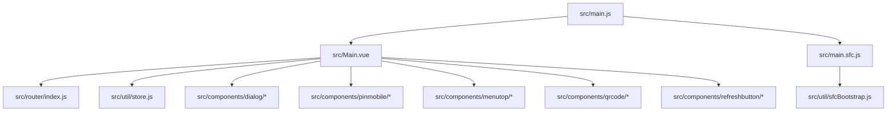
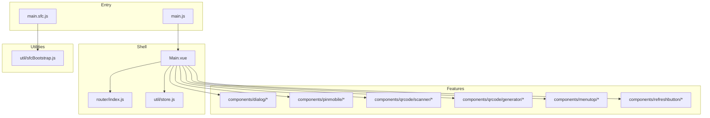
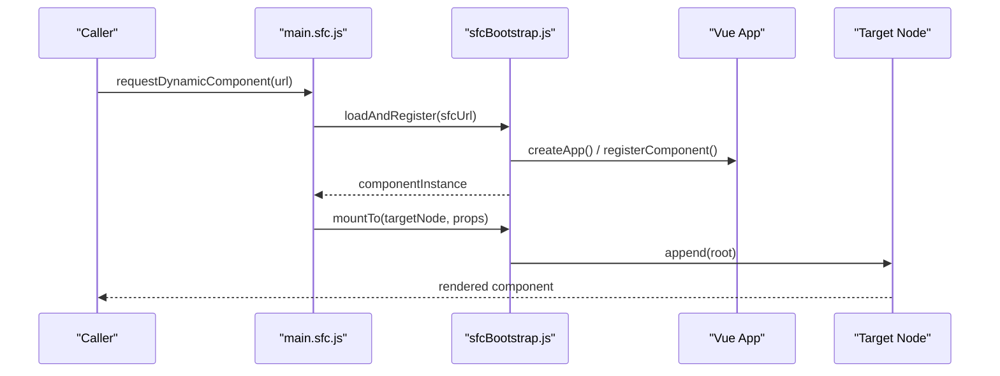
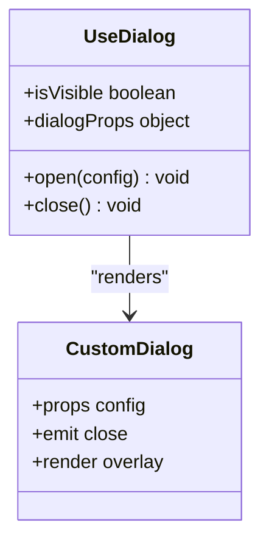
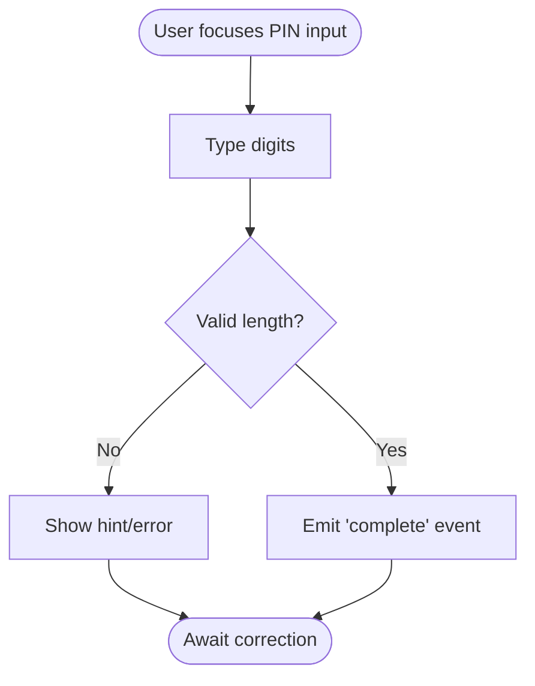
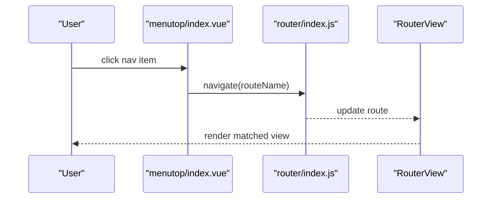
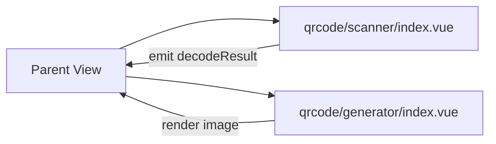

# Component Architecture

<cite>
**Referenced Files in This Document**
- [main.js](file://src/main.js)
- [Main.vue](file://src/Main.vue)
- [main.sfc.js](file://src/main.sfc.js)
- [sfcBootstrap.js](file://src/util/sfcBootstrap.js)
- [useDialog.js](file://src/components/dialog/useDialog.js)
- [CustomDialog.vue](file://src/components/dialog/CustomDialog.vue)
- [PinMobile.vue](file://src/components/pinmobile/PinMobile.vue)
- [index.vue (menutop)](file://src/components/menutop/index.vue)
- [index.vue (qrcode/scanner)](file://src/components/qrcode/scanner/index.vue)
- [index.vue (qrcode/generator)](file://src/components/qrcode/generator/index.vue)
- [RefreshButton.vue](file://src/components/refreshbutton/RefreshButton.vue)
- [router/index.js](file://src/router/index.js)
- [store.js](file://src/util/store.js)
</cite>

## Table of Contents
1. Introduction
2. Project Structure
3. Core Components
4. Architecture Overview
5. Detailed Component Analysis
6. Dependency Analysis
7. Performance Considerations
8. Troubleshooting Guide
9. Conclusion

## Introduction
This document explains the component architecture and design patterns in ahm-gr-scanner with a focus on:
- Component hierarchy and composition
- Reusable component patterns
- Dynamic Single File Component (SFC) loading via vue3-sfc-loader and sfcBootstrap utilities
- Dialog system implementation
- Mobile PIN input component
- Menu navigation patterns
- Prop interfaces, event handling, and slot usage
- Responsive design patterns and accessibility considerations
- Plugin architecture for dynamic loading and extension points

The goal is to provide both high-level architectural insight and practical guidance for extending and maintaining the application.

## Project Structure
At a high level, the application is organized by feature directories under src/components and src/views, with shared utilities in src/util and routing configuration in src/router. The entry point initializes the Vue application and integrates runtime SFC loading capabilities.

**Diagram sources**
- [main.js](file://src/main.js)
- [Main.vue](file://src/Main.vue)
- [main.sfc.js](file://src/main.sfc.js)
- [sfcBootstrap.js](file://src/util/sfcBootstrap.js)
- [router/index.js](file://src/router/index.js)
- [store.js](file://src/util/store.js)

**Section sources**
- [main.js](file://src/main.js)
- [Main.vue](file://src/Main.vue)
- [main.sfc.js](file://src/main.sfc.js)
- [sfcBootstrap.js](file://src/util/sfcBootstrap.js)
- [router/index.js](file://src/router/index.js)
- [store.js](file://src/util/store.js)

## Core Components
Key reusable components include:
- Dialog system: useDialog composable and CustomDialog container
- Mobile PIN input: PinMobile component
- QR code tools: scanner and generator components
- Top menu: menutop index component
- Refresh button: RefreshButton component

These components are composed within views and pages, often driven by router state and shared store data.

**Section sources**
- [useDialog.js](file://src/components/dialog/useDialog.js)
- [CustomDialog.vue](file://src/components/dialog/CustomDialog.vue)
- [PinMobile.vue](file://src/components/pinmobile/PinMobile.vue)
- [index.vue (qrcode/scanner)](file://src/components/qrcode/scanner/index.vue)
- [index.vue (qrcode/generator)](file://src/components/qrcode/generator/index.vue)
- [index.vue (menutop)](file://src/components/menutop/index.vue)
- [RefreshButton.vue](file://src/components/refreshbutton/RefreshButton.vue)

## Architecture Overview
The application follows a layered architecture:
- Entry layer: main.js bootstraps the app and registers runtime SFC loader
- App shell: Main.vue hosts router-view and global UI elements
- Routing: router/index.js defines routes and guards
- State: util/store.js provides reactive state across components
- Feature components: dialog, pinmobile, qrcode, menutop, refreshbutton
- Utilities: sfcBootstrap.js encapsulates vue3-sfc-loader integration

**Diagram sources**
- [main.js](file://src/main.js)
- [main.sfc.js](file://src/main.sfc.js)
- [Main.vue](file://src/Main.vue)
- [router/index.js](file://src/router/index.js)
- [store.js](file://src/util/store.js)
- [sfcBootstrap.js](file://src/util/sfcBootstrap.js)
- [useDialog.js](file://src/components/dialog/useDialog.js)
- [CustomDialog.vue](file://src/components/dialog/CustomDialog.vue)
- [PinMobile.vue](file://src/components/pinmobile/PinMobile.vue)
- [index.vue (qrcode/scanner)](file://src/components/qrcode/scanner/index.vue)
- [index.vue (qrcode/generator)](file://src/components/qrcode/generator/index.vue)
- [index.vue (menutop)](file://src/components/menutop/index.vue)
- [RefreshButton.vue](file://src/components/refreshbutton/RefreshButton.vue)

## Detailed Component Analysis

### Dynamic SFC Loading System (vue3-sfc-loader + sfcBootstrap)
The application supports runtime loading of Vue SFCs through vue3-sfc-loader, wrapped by sfcBootstrap utility functions. This enables plugin-like behavior where components can be fetched and mounted dynamically at runtime.

Key responsibilities:
- Load SFC source from URL or module path
- Compile and register the component into the Vue app instance
- Provide a bootstrap API to mount the loaded component into a target DOM node
- Manage lifecycle and cleanup when unmounting

**Diagram sources**
- [main.sfc.js](file://src/main.sfc.js)
- [sfcBootstrap.js](file://src/util/sfcBootstrap.js)

**Section sources**
- [main.sfc.js](file://src/main.sfc.js)
- [sfcBootstrap.js](file://src/util/sfcBootstrap.js)

### Dialog System Implementation
The dialog system uses a composable pattern (useDialog) to manage dialog state and a dedicated container component (CustomDialog) to render overlays.

Design highlights:
- useDialog exposes methods to open/close dialogs and pass props
- CustomDialog renders overlay content and handles backdrop interactions
- Composition allows multiple dialog instances with independent state
- Events propagate user actions back to callers

**Diagram sources**
- [useDialog.js](file://src/components/dialog/useDialog.js)
- [CustomDialog.vue](file://src/components/dialog/CustomDialog.vue)

**Section sources**
- [useDialog.js](file://src/components/dialog/useDialog.js)
- [CustomDialog.vue](file://src/components/dialog/CustomDialog.vue)

### Mobile PIN Input Component
PinMobile provides a mobile-friendly numeric input experience, typically used for PIN entry and setup flows.

Responsibilities:
- Accept and validate numeric input
- Emit events for completion and errors
- Support keyboard and touch interactions
- Integrate with parent forms or workflows

**Diagram sources**
- [PinMobile.vue](file://src/components/pinmobile/PinMobile.vue)

**Section sources**
- [PinMobile.vue](file://src/components/pinmobile/PinMobile.vue)

### Menu Navigation Patterns
The top menu component (menutop) coordinates navigation using the router. It presents primary actions and reflects active route state.

Patterns:
- Router-driven active states
- Event-based navigation triggers
- Composable layout slots for flexible header content

**Diagram sources**
- [index.vue (menutop)](file://src/components/menutop/index.vue)
- [router/index.js](file://src/router/index.js)

**Section sources**
- [index.vue (menutop)](file://src/components/menutop/index.vue)
- [router/index.js](file://src/router/index.js)

### QR Code Tools (Scanner and Generator)
Two complementary components handle QR code operations:
- Scanner: captures camera feed and decodes QR codes
- Generator: creates QR code images from input data

Integration:
- Scanner emits decoded results to parent components
- Generator accepts string payloads and renders output
- Both support responsive layouts and error states

**Diagram sources**
- [index.vue (qrcode/scanner)](file://src/components/qrcode/scanner/index.vue)
- [index.vue (qrcode/generator)](file://src/components/qrcode/generator/index.vue)

**Section sources**
- [index.vue (qrcode/scanner)](file://src/components/qrcode/scanner/index.vue)
- [index.vue (qrcode/generator)](file://src/components/qrcode/generator/index.vue)

### Refresh Button Component
RefreshButton encapsulates common refresh behavior, emitting events to trigger data reloads in parent views.

Usage:
- Bind to parent handlers for refresh actions
- Display loading indicators during async operations
- Provide accessible labels and keyboard support

**Section sources**
- [RefreshButton.vue](file://src/components/refreshbutton/RefreshButton.vue)

### App Shell and Global Integration
Main.vue serves as the root component, integrating router-view, global styles, and optional overlays. It also orchestrates initialization of shared services and plugins.

**Section sources**
- [Main.vue](file://src/Main.vue)

## Dependency Analysis
The following diagram shows key dependencies between core modules and components.

**Diagram sources**
- [main.js](file://src/main.js)
- [Main.vue](file://src/Main.vue)
- [main.sfc.js](file://src/main.sfc.js)
- [sfcBootstrap.js](file://src/util/sfcBootstrap.js)
- [router/index.js](file://src/router/index.js)
- [store.js](file://src/util/store.js)
- [useDialog.js](file://src/components/dialog/useDialog.js)
- [CustomDialog.vue](file://src/components/dialog/CustomDialog.vue)
- [PinMobile.vue](file://src/components/pinmobile/PinMobile.vue)
- [index.vue (menutop)](file://src/components/menutop/index.vue)
- [index.vue (qrcode/scanner)](file://src/components/qrcode/scanner/index.vue)
- [index.vue (qrcode/generator)](file://src/components/qrcode/generator/index.vue)
- [RefreshButton.vue](file://src/components/refreshbutton/RefreshButton.vue)

**Section sources**
- [main.js](file://src/main.js)
- [Main.vue](file://src/Main.vue)
- [main.sfc.js](file://src/main.sfc.js)
- [sfcBootstrap.js](file://src/util/sfcBootstrap.js)
- [router/index.js](file://src/router/index.js)
- [store.js](file://src/util/store.js)

## Performance Considerations
- Lazy-load heavy features: Prefer dynamic imports for non-critical components to reduce initial bundle size.
- Debounce user inputs: Apply debouncing for search or scan result processing to avoid excessive re-renders.
- Memoize computed values: Use computed properties and watchers judiciously to minimize recalculations.
- Optimize media streams: Stop camera streams when not visible; reuse resources across navigations.
- Minimize reflows: Batch DOM updates and avoid frequent style changes inside tight loops.
- Cache generated assets: For QR generation, cache outputs keyed by payload to prevent redundant work.

[No sources needed since this section provides general guidance]

## Troubleshooting Guide
Common issues and resolutions:
- Runtime SFC loading failures:
  - Verify network availability and CORS settings for remote SFC URLs
  - Ensure vue3-sfc-loader is correctly initialized in main.sfc.js
  - Check that sfcBootstrap mount targets exist in the DOM before mounting
- Dialog not closing:
  - Confirm emit handlers are bound and state transitions occur
  - Inspect backdrop click listeners and z-index stacking contexts
- PIN input validation errors:
  - Validate input length constraints and character restrictions
  - Ensure keyboard type is set appropriately for mobile devices
- QR scanner permissions:
  - Handle permission prompts gracefully and fallback to manual input if denied
- Router navigation glitches:
  - Verify route definitions and guard logic in router/index.js
  - Ensure active route classes reflect current location

**Section sources**
- [main.sfc.js](file://src/main.sfc.js)
- [sfcBootstrap.js](file://src/util/sfcBootstrap.js)
- [useDialog.js](file://src/components/dialog/useDialog.js)
- [CustomDialog.vue](file://src/components/dialog/CustomDialog.vue)
- [PinMobile.vue](file://src/components/pinmobile/PinMobile.vue)
- [index.vue (qrcode/scanner)](file://src/components/qrcode/scanner/index.vue)
- [router/index.js](file://src/router/index.js)

## Conclusion
The ahm-gr-scanner employs a modular, composable architecture centered around reusable components and a dynamic SFC loading system. The dialog system leverages composables for clean state management, while the PIN input and QR tools demonstrate focused, testable units. The router-driven navigation and shared store ensure consistent UX across views. By adhering to the patterns outlined here—prop/event contracts, slot composition, lazy loading, and accessibility best practices—the application remains extensible and maintainable.

[No sources needed since this section summarizes without analyzing specific files]