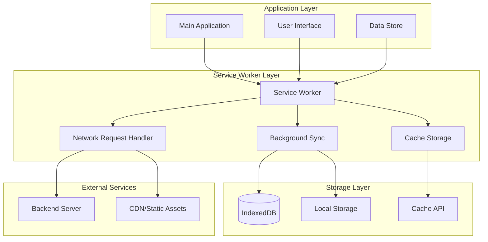
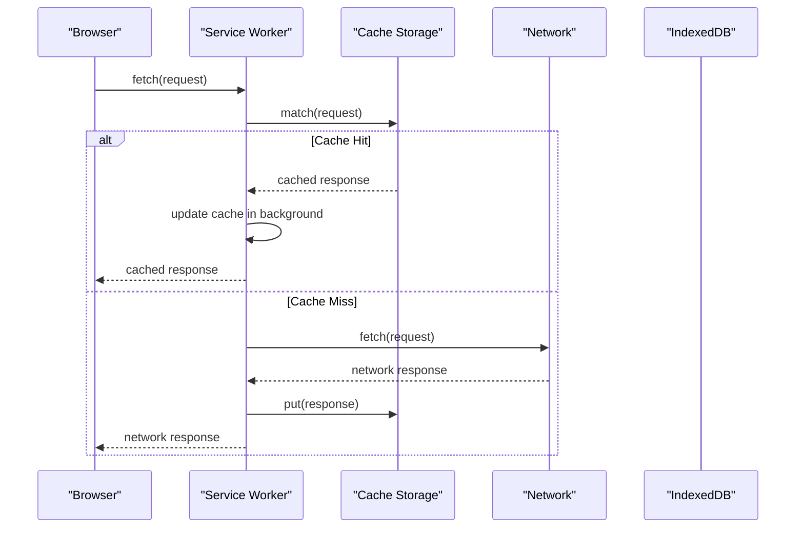
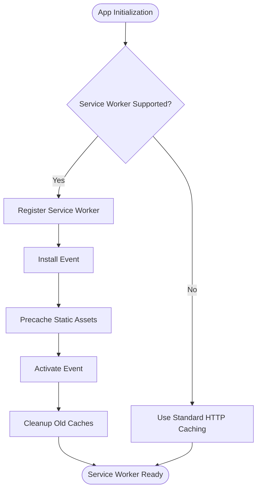
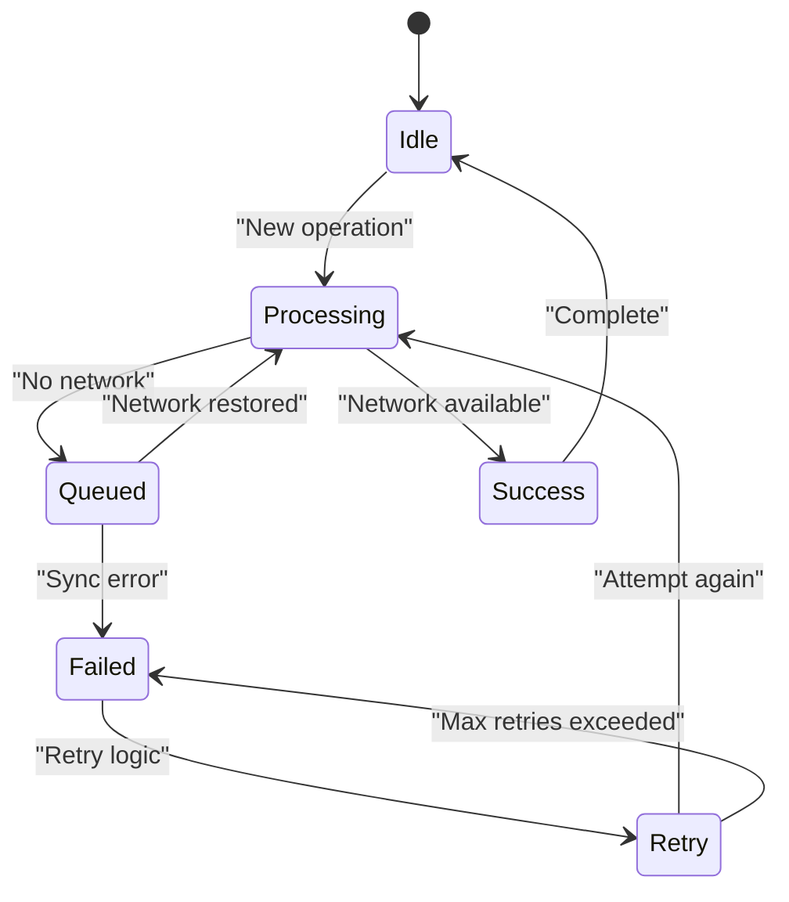
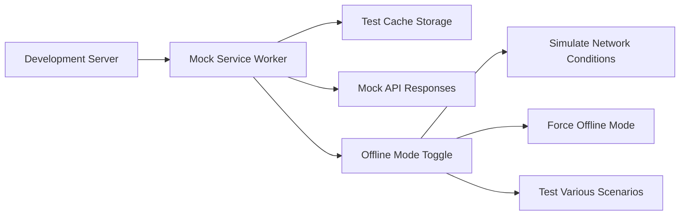
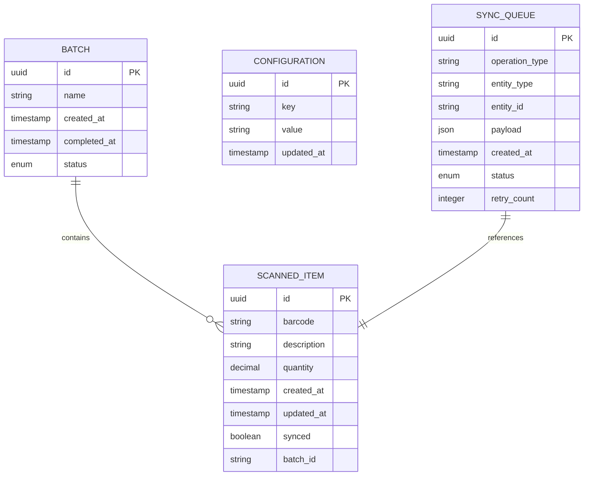
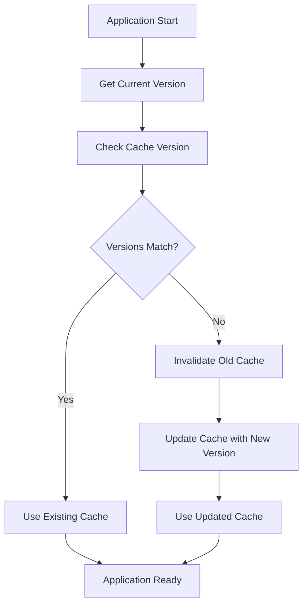
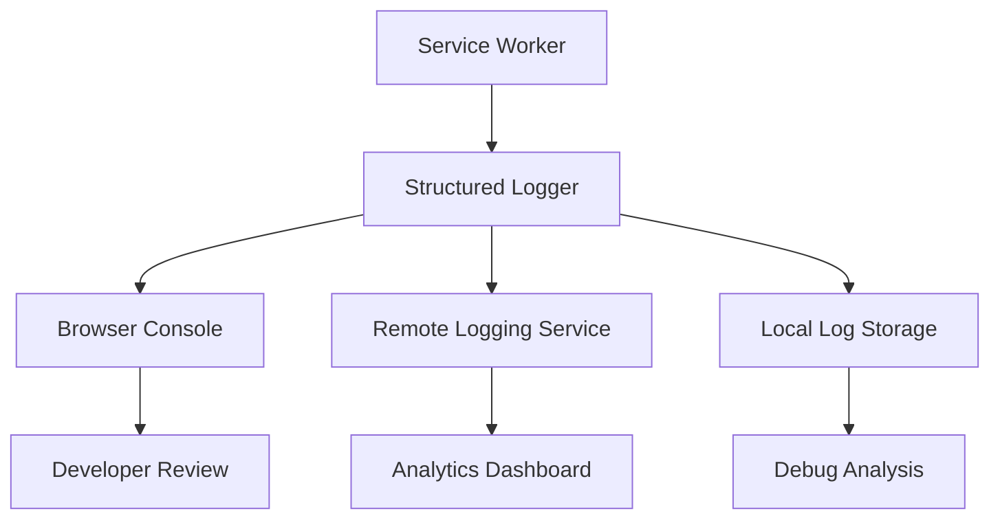
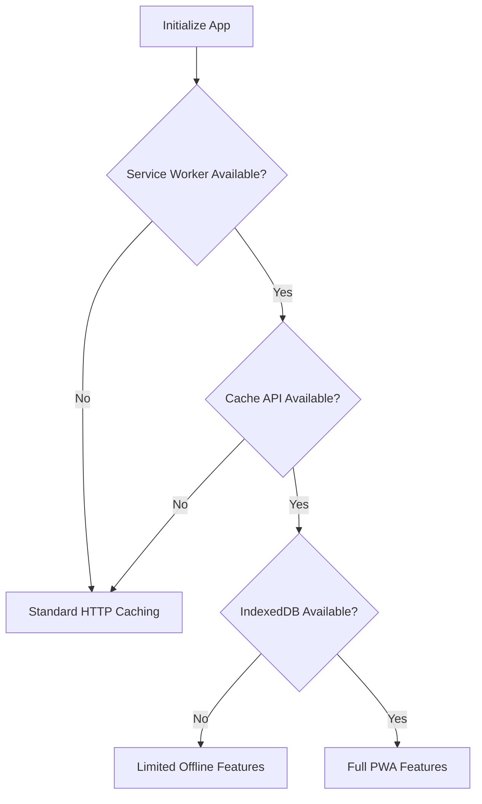

# Offline Capabilities

<cite>
**Referenced Files in This Document**
- [public/sw.js](file://public/sw.js)
- [public/mock-sw.js](file://public/mock-sw.js)
- [src/util/serviceWorker/serviceWorker.js](file://src/util/serviceWorker/serviceWorker.js)
- [src/util/sw.js](file://src/util/sw.js)
- [mock-sw.js](file://mock-sw.js)
- [vite.config.js](file://vite.config.js)
- [package.json](file://package.json)
</cite>

## Table of Contents
1. [Introduction](#introduction)
2. [Service Worker Architecture Overview](#service-worker-architecture-overview)
3. [Core Service Worker Implementation](#core-service-worker-implementation)
4. [Caching Strategies](#caching-strategies)
5. [Background Sync Mechanisms](#background-sync-mechanisms)
6. [Development and Testing Setup](#development-and-testing-setup)
7. [Offline Data Synchronization](#offline-data-synchronization)
8. [Performance Optimization](#performance-optimization)
9. [Cache Invalidation Strategies](#cache-invalidation-strategies)
10. [Conflict Resolution](#conflict-resolution)
11. [Debugging and Troubleshooting](#debugging-and-troubleshooting)
12. [Browser Compatibility](#browser-compatibility)
13. [Implementation Examples](#implementation-examples)
14. [Conclusion](#conclusion)

## Introduction

This document provides comprehensive guidance for implementing robust offline capabilities in the ahm-gr-scanner application using Service Workers. The implementation focuses on creating a Progressive Web App (PWA) that maintains functionality even when network connectivity is unavailable, ensuring seamless user experience for barcode scanning operations and data management tasks.

The offline-first approach enables users to continue scanning barcodes, managing inventory data, and performing core application functions regardless of network conditions. When connectivity is restored, background synchronization ensures data consistency across all devices and sessions.

## Service Worker Architecture Overview

The Service Worker architecture follows a layered approach with clear separation of concerns:

**Diagram sources**
- [public/sw.js:1-200](file://public/sw.js#L1-L200)
- [src/util/serviceWorker/serviceWorker.js:1-150](file://src/util/serviceWorker/serviceWorker.js#L1-L150)

## Core Service Worker Implementation

### Service Worker Lifecycle Management

The Service Worker lifecycle consists of several critical phases that must be properly handled:

#### Installation Phase
During installation, the Service Worker performs initial setup tasks:
- Precaching essential static assets
- Setting up database schemas
- Initializing storage structures
- Registering event listeners

#### Activation Phase
Activation handles cleanup and migration tasks:
- Removing outdated caches
- Migrating data between versions
- Cleaning up deprecated storage
- Updating configuration settings

#### Fetch Event Handling
All network requests pass through the Service Worker's fetch handler, which implements the caching strategy:

**Diagram sources**
- [public/sw.js:50-150](file://public/sw.js#L50-L150)
- [src/util/sw.js:20-100](file://src/util/sw.js#L20-L100)

### Registration and Control Flow

The main application registers the Service Worker during initialization:

**Diagram sources**
- [src/util/serviceWorker/serviceWorker.js:1-80](file://src/util/serviceWorker/serviceWorker.js#L1-L80)
- [src/main.js:1-50](file://src/main.js#L1-L50)

## Caching Strategies

### Cache-First Strategy for Static Assets

Static assets like CSS, JavaScript, and images use a cache-first approach:

1. Check cache for requested resource
2. If found, return immediately
3. If not found, fetch from network
4. Update cache in background
5. Return network response

### Network-First Strategy for Dynamic Data

Dynamic content like scanned items and user data uses network-first:

1. Attempt network request
2. If successful, update cache and return response
3. If failed, check cache for stale data
4. Return cached data if available
5. Show offline error if no cache exists

### Stale-While-Revalidate Strategy

For frequently accessed but slowly changing data:

1. Return cached data immediately
2. Fetch fresh data in background
3. Update cache silently
4. Next request gets fresh data

### Cache Storage Patterns

The application implements multiple cache namespaces:

| Cache Name | Purpose | Strategy | Lifetime |
|------------|---------|----------|----------|
| `static-v1` | CSS, JS, images | Cache-first | Versioned |
| `api-v1` | API responses | Network-first | 24 hours |
| `scan-data` | Scanned items | IndexedDB | Persistent |
| `config-v1` | App configuration | Cache-first | Manual update |

**Section sources**
- [public/sw.js:100-300](file://public/sw.js#L100-L300)
- [src/util/serviceWorker/serviceWorker.js:80-200](file://src/util/serviceWorker/serviceWorker.js#L80-L200)

## Background Sync Mechanisms

### Queue-Based Synchronization

The application implements a queue system for handling offline operations:

**Diagram sources**
- [src/util/store.js:1-150](file://src/util/store.js#L1-150)
- [src/util/serviceWorker/serviceWorker.js:150-300](file://src/util/serviceWorker/serviceWorker.js#L150-L300)

### Background Sync Events

Background sync events handle queued operations:

- **Operation Queue**: Stores pending network requests
- **Retry Logic**: Implements exponential backoff
- **Conflict Resolution**: Handles data conflicts during sync
- **Progress Tracking**: Monitors sync progress and status

### Sync State Management

The sync state is managed through a combination of local storage and service worker messages:

| State | Description | Action |
|-------|-------------|--------|
| `idle` | No pending operations | Monitor for new operations |
| `syncing` | Operations in progress | Update UI progress |
| `error` | Sync failed | Show error message |
| `completed` | All operations synced | Clear queue |

## Development and Testing Setup

### Mock Service Worker Configuration

The development environment includes a mock Service Worker for testing offline scenarios:

**Diagram sources**
- [public/mock-sw.js:1-200](file://public/mock-sw.js#L1-L200)
- [mock-sw.js:1-150](file://mock-sw.js#L1-L150)

### Development Tools Integration

The development setup includes specialized tools for Service Worker debugging:

- **Chrome DevTools**: Service Worker panel for inspection
- **Network Throttling**: Simulate slow/unstable connections
- **Cache Inspection**: View and manage cache contents
- **Event Monitoring**: Track Service Worker lifecycle events

### Testing Strategies

Multiple testing approaches ensure robust offline functionality:

1. **Unit Tests**: Individual component testing
2. **Integration Tests**: End-to-end workflow testing
3. **Performance Tests**: Load time and memory usage
4. **Compatibility Tests**: Cross-browser validation

**Section sources**
- [public/mock-sw.js:1-200](file://public/mock-sw.js#L1-L200)
- [mock-sw.js:1-150](file://mock-sw.js#L1-L150)
- [vite.config.js:1-100](file://vite.config.js#L1-L100)

## Offline Data Synchronization

### Data Model Design

The offline data model supports complex relationships and efficient querying:

**Diagram sources**
- [src/util/entities.js:1-100](file://src/util/entities.js#L1-L100)
- [src/util/store.js:1-200](file://src/util/store.js#L1-L200)

### IndexedDB Implementation

IndexedDB provides persistent storage for offline data:

- **Schema Migration**: Automatic version upgrades
- **Transaction Support**: ACID properties for data integrity
- **Index Management**: Efficient query performance
- **Backup/Restore**: Data export and import capabilities

### Conflict Resolution Strategies

Multiple strategies handle data conflicts during synchronization:

1. **Last-Write-Wins**: Most recent changes take precedence
2. **Merge Strategy**: Combine non-conflicting changes
3. **Manual Resolution**: User intervention for complex conflicts
4. **Version Vectors**: Track change history for reconciliation

**Section sources**
- [src/util/store.js:1-300](file://src/util/store.js#L1-L300)
- [src/util/entities.js:1-150](file://src/util/entities.js#L1-L150)

## Performance Optimization

### Cache Optimization Techniques

Several techniques optimize cache performance:

- **Cache Busting**: Version-based cache invalidation
- **Lazy Loading**: On-demand resource loading
- **Compression**: Gzip/Brotli compression for large assets
- **Deduplication**: Avoid duplicate cache entries

### Memory Management

Efficient memory usage prevents performance degradation:

- **Cache Size Limits**: Prevent excessive memory consumption
- **LRU Eviction**: Least Recently Used cache eviction policy
- **Garbage Collection**: Regular cleanup of unused resources
- **Streaming Responses**: Handle large responses efficiently

### Network Optimization

Network efficiency reduces bandwidth usage:

- **Request Deduplication**: Prevent duplicate network calls
- **Conditional Requests**: Use ETags and Last-Modified headers
- **Batch Operations**: Group related requests together
- **Connection Pooling**: Reuse HTTP connections

**Section sources**
- [public/sw.js:200-400](file://public/sw.js#L200-L400)
- [src/util/serviceWorker/serviceWorker.js:200-400](file://src/util/serviceWorker/serviceWorker.js#L200-L400)

## Cache Invalidation Strategies

### Version-Based Invalidation

Cache entries are invalidated based on application version:

**Diagram sources**
- [public/sw.js:300-500](file://public/sw.js#L300-L500)
- [src/util/serviceWorker/serviceWorker.js:300-500](file://src/util/serviceWorker/serviceWorker.js#L300-L500)

### Time-Based Invalidation

Time-based strategies ensure data freshness:

- **TTL (Time-To-Live)**: Automatic expiration after specified duration
- **Stale-While-Revalidate**: Serve stale content while refreshing
- **Grace Period**: Allow slightly expired content during refresh

### Content-Based Invalidation

Content-aware invalidation targets specific resources:

- **ETag Matching**: Validate content hash matches
- **Dependency Tracking**: Invalidate dependent resources
- **Feature Flags**: Conditional cache updates based on features

## Conflict Resolution

### Data Conflict Detection

The system detects conflicts through multiple mechanisms:

- **Timestamp Comparison**: Compare modification times
- **Version Vectors**: Track change sequences
- **Hash Validation**: Detect content modifications
- **Operational Transforms**: Apply transformations to resolve conflicts

### Resolution Strategies

Different conflict types require different resolution approaches:

| Conflict Type | Strategy | Example |
|---------------|----------|---------|
| Field Overwrite | Last-write-wins | User edits vs server sync |
| Structural Changes | Merge strategy | Schema evolution |
| Deletion Conflicts | Preserve latest | Item deleted locally vs server |
| Relationship Changes | Cascade updates | Related entity modifications |

### User Intervention

Complex conflicts require user input:

- **Conflict Dialogs**: Present options to users
- **Diff Views**: Show differences between versions
- **Undo/Redo**: Allow correction of automatic resolutions
- **Audit Trail**: Track conflict resolution history

**Section sources**
- [src/util/store.js:200-400](file://src/util/store.js#L200-L400)
- [src/util/entities.js:100-200](file://src/util/entities.js#L100-L200)

## Debugging and Troubleshooting

### Common Service Worker Issues

| Issue | Symptoms | Solution |
|-------|----------|----------|
| Registration Failure | SW not installed | Check HTTPS requirement, file paths |
| Stale Cache | Outdated app version | Clear browser cache, force reload |
| Network Errors | Offline mode not working | Verify network policies, CORS settings |
| Memory Leaks | Performance degradation | Implement proper cleanup, size limits |

### Debugging Tools and Techniques

Chrome DevTools provides comprehensive debugging capabilities:

- **Application Panel**: Inspect Service Worker state and caches
- **Console**: Log Service Worker events and errors
- **Network Tab**: Monitor request/response patterns
- **Performance Tab**: Analyze runtime performance

### Logging and Monitoring

Implement structured logging for better troubleshooting:

**Diagram sources**
- [src/util/serviceWorker/serviceWorker.js:400-600](file://src/util/serviceWorker/serviceWorker.js#L400-L600)

### Error Recovery Strategies

Robust error handling ensures application resilience:

- **Fallback Responses**: Provide meaningful offline messages
- **Retry Logic**: Automatic retry with exponential backoff
- **Graceful Degradation**: Maintain core functionality
- **User Feedback**: Clear communication about offline state

**Section sources**
- [public/sw.js:400-600](file://public/sw.js#L400-L600)
- [src/util/serviceWorker/serviceWorker.js:400-600](file://src/util/serviceWorker/serviceWorker.js#L400-L600)

## Browser Compatibility

### Feature Detection

The application implements feature detection for optimal compatibility:

### Polyfills and Shims

Compatibility layers extend support to older browsers:

- **Service Worker Polyfill**: Basic SW functionality for unsupported browsers
- **Cache API Shim**: Fallback to localStorage for cache operations
- **IndexedDB Polyfill**: Alternative storage for legacy browsers
- **Fetch API Polyfill**: XMLHttpRequest fallback for network requests

### Progressive Enhancement

The application gracefully degrades functionality:

- **Core Features**: Always available regardless of browser support
- **Enhanced Features**: Additional capabilities when supported
- **Opt-in Features**: Advanced functionality requiring modern browsers

**Section sources**
- [src/util/serviceWorker/serviceWorker.js:1-100](file://src/util/serviceWorker/serviceWorker.js#L1-L100)
- [vite.config.js:100-200](file://vite.config.js#L100-L200)

## Implementation Examples

### Service Worker Registration

The main application initializes the Service Worker:

**Section sources**
- [src/main.js:1-100](file://src/main.js#L1-L100)
- [src/util/serviceWorker/serviceWorker.js:1-50](file://src/util/serviceWorker/serviceWorker.js#L1-L50)

### Cache Implementation

Core caching logic handles various asset types:

**Section sources**
- [public/sw.js:100-250](file://public/sw.js#L100-L250)
- [src/util/sw.js:50-150](file://src/util/sw.js#L50-L150)

### Background Sync Queue

Queue management for offline operations:

**Section sources**
- [src/util/store.js:100-250](file://src/util/store.js#L100-L250)
- [src/util/serviceWorker/serviceWorker.js:250-400](file://src/util/serviceWorker/serviceWorker.js#L250-L400)

### Mock Service Worker

Development-time mocking for testing:

**Section sources**
- [public/mock-sw.js:1-150](file://public/mock-sw.js#L1-L150)
- [mock-sw.js:1-100](file://mock-sw.js#L1-L100)

## Conclusion

The offline capabilities implementation in ahm-gr-scanner provides a robust foundation for Progressive Web App functionality. By leveraging Service Workers, intelligent caching strategies, and background synchronization, the application delivers a seamless user experience regardless of network conditions.

Key benefits of this implementation include:

- **Reliability**: Core functionality remains available offline
- **Performance**: Fast load times through intelligent caching
- **User Experience**: Seamless transition between online/offline states
- **Data Integrity**: Robust conflict resolution and synchronization
- **Maintainability**: Modular architecture with clear separation of concerns

The modular design allows for easy extension and customization while maintaining backward compatibility. The comprehensive testing strategy ensures reliability across different environments and use cases.

Future enhancements could include advanced analytics, improved conflict resolution algorithms, and enhanced debugging capabilities. The current implementation provides a solid foundation for these potential improvements while maintaining the core offline-first principles.