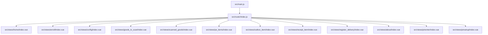
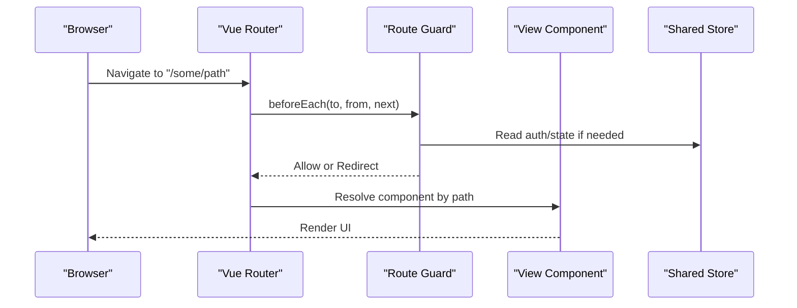
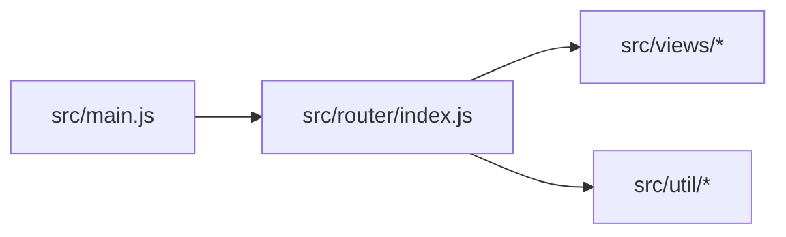

# Routing System

<cite>
**Referenced Files in This Document**
- [src/router/index.js](file://src/router/index.js)
- [src/main.js](file://src/main.js)
- [src/views/home/index.vue](file://src/views/home/index.vue)
- [src/views/enroll/index.vue](file://src/views/enroll/index.vue)
- [src/views/config/index.vue](file://src/views/config/index.vue)
- [src/views/goods_to_scan/index.vue](file://src/views/goods_to_scan/index.vue)
- [src/views/scanned_goods/index.vue](file://src/views/scanned_goods/index.vue)
- [src/views/po_items/index.vue](file://src/views/po_items/index.vue)
- [src/views/outbox_item/index.vue](file://src/views/outbox_item/index.vue)
- [src/views/receipt_item/index.vue](file://src/views/receipt_item/index.vue)
- [src/views/register_delivery/index.vue](file://src/views/register_delivery/index.vue)
- [src/views/about/index.vue](file://src/views/about/index.vue)
- [src/views/pinenter/index.vue](file://src/views/pinenter/index.vue)
- [src/views/pinsetup/index.vue](file://src/views/pinsetup/index.vue)
- [src/util/store.js](file://src/util/store.js)
</cite>

## Table of Contents
1. [Introduction](#introduction)
2. [Project Structure](#project-structure)
3. [Core Components](#core-components)
4. [Architecture Overview](#architecture-overview)
5. [Detailed Component Analysis](#detailed-component-analysis)
6. [Dependency Analysis](#dependency-analysis)
7. [Performance Considerations](#performance-considerations)
8. [Troubleshooting Guide](#troubleshooting-guide)
9. [Conclusion](#conclusion)
10. [Appendices](#appendices)

## Introduction
This document explains the routing system implementation in the ahm-gr-scanner application. It covers how Vue Router is configured, how routes are defined and mapped to views, navigation patterns across features (home, enrollment, configuration, scanning, inventory), route guards, dynamic routing, programmatic navigation, nested routing patterns, mobile-specific considerations, deep linking support, and navigation state management. The goal is to provide a clear, code-backed understanding of how navigation works end-to-end in this project.

## Project Structure
The routing setup follows a conventional structure:
- Central router configuration resides in src/router/index.js.
- Feature views are organized under src/views/<feature>/index.vue.
- Application bootstrap wires the router into the app in src/main.js.
- Shared utilities such as store or helpers live under src/util/.

**Diagram sources**
- [src/main.js](file://src/main.js)
- [src/router/index.js](file://src/router/index.js)
- [src/views/home/index.vue](file://src/views/home/index.vue)
- [src/views/enroll/index.vue](file://src/views/enroll/index.vue)
- [src/views/config/index.vue](file://src/views/config/index.vue)
- [src/views/goods_to_scan/index.vue](file://src/views/goods_to_scan/index.vue)
- [src/views/scanned_goods/index.vue](file://src/views/scanned_goods/index.vue)
- [src/views/po_items/index.vue](file://src/views/po_items/index.vue)
- [src/views/outbox_item/index.vue](file://src/views/outbox_item/index.vue)
- [src/views/receipt_item/index.vue](file://src/views/receipt_item/index.vue)
- [src/views/register_delivery/index.vue](file://src/views/register_delivery/index.vue)
- [src/views/about/index.vue](file://src/views/about/index.vue)
- [src/views/pinenter/index.vue](file://src/views/pinenter/index.vue)
- [src/views/pinsetup/index.vue](file://src/views/pinsetup/index.vue)

**Section sources**
- [src/router/index.js](file://src/router/index.js)
- [src/main.js](file://src/main.js)

## Core Components
- Router configuration: Centralized in src/router/index.js where routes are declared and any guards or meta flags are set.
- Views: Each feature has an index.vue under src/views/<feature>. These components render the UI for their respective routes.
- Bootstrap: src/main.js initializes the Vue app and mounts the router instance.

Key responsibilities:
- Route definitions map URL paths to view components.
- Navigation guards enforce access control and preconditions.
- Programmatic navigation is used within components to move between screens without direct user clicks.
- Dynamic segments enable passing parameters (for example, item IDs).
- Nested routes allow sub-views within a parent layout.

**Section sources**
- [src/router/index.js](file://src/router/index.js)
- [src/main.js](file://src/main.js)

## Architecture Overview
At runtime, the browser navigates to a path, the router resolves it to a component, and the view renders. Guards can intercept navigation to validate state or redirect.

[No sources needed since this diagram shows conceptual workflow, not actual code structure]

## Detailed Component Analysis

### Router Configuration and Route Map
- Location: src/router/index.js
- Responsibilities:
  - Define all top-level routes for features like home, enrollment, configuration, scanning, and inventory.
  - Optionally define nested routes for complex layouts.
  - Configure global or per-route guards.
  - Set up history mode and base path if required.

Typical route categories:
- Home: root landing page.
- Enrollment: onboarding or registration flows.
- Configuration: settings and preferences.
- Scanning: barcode/QR scanning workflows.
- Inventory: purchase orders, goods, receipts, outbox items, delivery registration.

Example route groups (conceptual):
- / -> Home
- /enroll -> Enrollment
- /config -> Configuration
- /scan -> Scanning entry point
- /goods -> Goods list/detail
- /po -> Purchase order items
- /receipts -> Receipt items
- /outbox -> Outbox items
- /delivery -> Register delivery
- /about -> About

**Section sources**
- [src/router/index.js](file://src/router/index.js)

### Route Guards and Access Control
- Global guard pattern: Use a beforeEnter or beforeEach hook to check authentication, PIN setup, or other prerequisites.
- Per-route guard: Use beforeEnter on specific routes that require validation.
- Common checks:
  - Is the user authenticated?
  - Has the PIN been configured?
  - Are required data structures initialized?

Redirect strategies:
- Redirect unauthenticated users to login or PIN setup.
- Redirect to error or fallback pages when resources are missing.

Programmatic navigation inside guards:
- Use router.push or router.replace to navigate based on guard decisions.

**Section sources**
- [src/router/index.js](file://src/router/index.js)

### Dynamic Routing and Parameters
- Use path parameters to pass identifiers (e.g., item ID, PO number).
- Example patterns:
  - /goods/:id
  - /po/:poId/items
  - /receipts/:receiptId
- In views, read params via the route object and fetch related data.

Best practices:
- Validate incoming params in the view or service layer.
- Provide loading states while fetching data.
- Handle invalid or missing IDs gracefully.

**Section sources**
- [src/router/index.js](file://src/router/index.js)

### Programmatic Navigation Patterns
Common scenarios:
- After successful scan, push to a detail or confirmation screen.
- On form submission, replace current route to prevent back-navigation loops.
- On logout or PIN reset, redirect to appropriate entry points.

Implementation tips:
- Prefer router.replace for one-way transitions.
- Use router.push with query parameters for shareable links.
- Debounce rapid navigation to avoid stack growth.

**Section sources**
- [src/router/index.js](file://src/router/index.js)

### Nested Routing Patterns
Useful for:
- Parent layouts with shared headers/footers.
- Sub-tabs or drill-down lists (e.g., PO items under a selected PO).

Structure:
- Parent route defines a layout component with <router-view>.
- Child routes render into the parent’s outlet.

Benefits:
- Reusable layout logic.
- Clear separation of concerns between parent and child views.

**Section sources**
- [src/router/index.js](file://src/router/index.js)

### Feature Routes and Their Views
Below are the primary feature routes and their corresponding view files.

- Home
  - Path: /
  - View: [src/views/home/index.vue](file://src/views/home/index.vue)
  - Purpose: Landing page and quick actions.

- Enrollment
  - Path: /enroll
  - View: [src/views/enroll/index.vue](file://src/views/enroll/index.vue)
  - Purpose: User onboarding or device enrollment flow.

- Configuration
  - Path: /config
  - View: [src/views/config/index.vue](file://src/views/config/index.vue)
  - Purpose: App settings and integrations.

- Scanning Entry
  - Path: /scan
  - View: [src/views/goods_to_scan/index.vue](file://src/views/goods_to_scan/index.vue)
  - Purpose: Start scanning goods; may include camera permissions and scanner controls.

- Scanned Goods List
  - Path: /scanned-goods
  - View: [src/views/scanned_goods/index.vue](file://src/views/scanned_goods/index.vue)
  - Purpose: Review scanned items, edit quantities, confirm batch.

- Purchase Order Items
  - Path: /po-items
  - View: [src/views/po_items/index.vue](file://src/views/po_items/index.vue)
  - Purpose: Browse and manage PO line items.

- Outbox Item
  - Path: /outbox-item
  - View: [src/views/outbox_item/index.vue](file://src/views/outbox_item/index.vue)
  - Purpose: Inspect or resend outbox entries.

- Receipt Item
  - Path: /receipt-item
  - View: [src/views/receipt_item/index.vue](file://src/views/receipt_item/index.vue)
  - Purpose: View receipt details and actions.

- Register Delivery
  - Path: /register-delivery
  - View: [src/views/register_delivery/index.vue](file://src/views/register_delivery/index.vue)
  - Purpose: Initiate or complete delivery registration.

- About
  - Path: /about
  - View: [src/views/about/index.vue](file://src/views/about/index.vue)
  - Purpose: Static information about the app.

- PIN Entry
  - Path: /pin-enter
  - View: [src/views/pinenter/index.vue](file://src/views/pinenter/index.vue)
  - Purpose: Enter PIN for secure access.

- PIN Setup
  - Path: /pin-setup
  - View: [src/views/pinsetup/index.vue](file://src/views/pinsetup/index.vue)
  - Purpose: Configure or change PIN.

Note: Paths above reflect common conventions aligned with the feature names. Confirm exact paths in the router configuration file.

**Section sources**
- [src/views/home/index.vue](file://src/views/home/index.vue)
- [src/views/enroll/index.vue](file://src/views/enroll/index.vue)
- [src/views/config/index.vue](file://src/views/config/index.vue)
- [src/views/goods_to_scan/index.vue](file://src/views/goods_to_scan/index.vue)
- [src/views/scanned_goods/index.vue](file://src/views/scanned_goods/index.vue)
- [src/views/po_items/index.vue](file://src/views/po_items/index.vue)
- [src/views/outbox_item/index.vue](file://src/views/outbox_item/index.vue)
- [src/views/receipt_item/index.vue](file://src/views/receipt_item/index.vue)
- [src/views/register_delivery/index.vue](file://src/views/register_delivery/index.vue)
- [src/views/about/index.vue](file://src/views/about/index.vue)
- [src/views/pinenter/index.vue](file://src/views/pinenter/index.vue)
- [src/views/pinsetup/index.vue](file://src/views/pinsetup/index.vue)

### Mobile-Specific Routing Considerations
- History mode vs hash mode:
  - Hash mode avoids server configuration but changes URLs.
  - History mode provides clean URLs and better deep linking; ensure server rewrites are configured.
- Back button behavior:
  - Avoid pushing multiple identical routes; use replace when appropriate.
  - Ensure destructive actions warn before leaving.
- Keyboard and focus:
  - When navigating to scanner or input-heavy views, auto-focus inputs and handle virtual keyboard interactions.
- Orientation and viewport:
  - Keep route transitions smooth and avoid heavy computations during navigation.

Deep Linking Support
- Use query parameters for shareable links (e.g., /goods?id=123).
- Persist last visited route to resume after authentication or PIN setup.
- Validate deep link parameters and show friendly errors if invalid.

Navigation State Management
- Keep minimal state in route params/query; prefer centralized store for large datasets.
- Use route meta fields for non-UI flags (e.g., requiresAuth).
- Reset transient state on route leave using lifecycle hooks.

**Section sources**
- [src/router/index.js](file://src/router/index.js)
- [src/util/store.js](file://src/util/store.js)

### Best Practices Observed in the Codebase
- Centralize route definitions in a single file for maintainability.
- Group related routes and use consistent naming conventions.
- Apply guards at the route level to enforce security and business rules.
- Prefer programmatic navigation for controlled flows (e.g., post-scan confirmation).
- Use nested routes for reusable layouts and drill-down experiences.
- Keep route payloads small; offload heavy data to services and store.

[No sources needed since this section summarizes general guidance]

## Dependency Analysis
The router depends on:
- Vue Router library (bundled via lib/vue-router or npm dependency).
- View components under src/views.
- Optional shared utilities (store, services) accessed from guards or views.

**Diagram sources**
- [src/router/index.js](file://src/router/index.js)
- [src/main.js](file://src/main.js)
- [src/util/store.js](file://src/util/store.js)

**Section sources**
- [src/router/index.js](file://src/router/index.js)
- [src/main.js](file://src/main.js)
- [src/util/store.js](file://src/util/store.js)

## Performance Considerations
- Lazy-load route components to reduce initial bundle size.
- Defer heavy operations until after navigation completes.
- Avoid unnecessary re-renders by keeping route state minimal and leveraging keep-alive for frequently revisited views.
- Use replace instead of push for one-way transitions to prevent navigation stack bloat.

[No sources needed since this section provides general guidance]

## Troubleshooting Guide
Common issues and resolutions:
- 404 on refresh with history mode:
  - Ensure server redirects all routes to index.html.
- Guards blocking navigation:
  - Verify authentication/PIN state initialization and guard conditions.
- Deep links not working:
  - Check query parameter parsing and route matching.
- Excessive back-stack:
  - Replace routes for final steps; avoid repeated pushes.
- Stale state after navigation:
  - Reset or persist state appropriately in route enter/leave hooks.

**Section sources**
- [src/router/index.js](file://src/router/index.js)

## Conclusion
The routing system in ahm-gr-scanner is centered around a clear, maintainable router configuration with well-organized feature views. It supports guards for access control, dynamic parameters for data-driven navigation, and programmatic navigation for controlled flows. By following the patterns outlined here—consistent route grouping, robust guards, thoughtful use of nested routes, and mobile-friendly navigation—you can extend and evolve the application’s navigation with confidence.

[No sources needed since this section summarizes without analyzing specific files]

## Appendices

### Quick Reference: Feature Routes and Views
- Home: [src/views/home/index.vue](file://src/views/home/index.vue)
- Enrollment: [src/views/enroll/index.vue](file://src/views/enroll/index.vue)
- Configuration: [src/views/config/index.vue](file://src/views/config/index.vue)
- Scan Entry: [src/views/goods_to_scan/index.vue](file://src/views/goods_to_scan/index.vue)
- Scanned Goods: [src/views/scanned_goods/index.vue](file://src/views/scanned_goods/index.vue)
- PO Items: [src/views/po_items/index.vue](file://src/views/po_items/index.vue)
- Outbox Item: [src/views/outbox_item/index.vue](file://src/views/outbox_item/index.vue)
- Receipt Item: [src/views/receipt_item/index.vue](file://src/views/receipt_item/index.vue)
- Register Delivery: [src/views/register_delivery/index.vue](file://src/views/register_delivery/index.vue)
- About: [src/views/about/index.vue](file://src/views/about/index.vue)
- PIN Entry: [src/views/pinenter/index.vue](file://src/views/pinenter/index.vue)
- PIN Setup: [src/views/pinsetup/index.vue](file://src/views/pinsetup/index.vue)

[No sources needed since this section lists references already cited above]