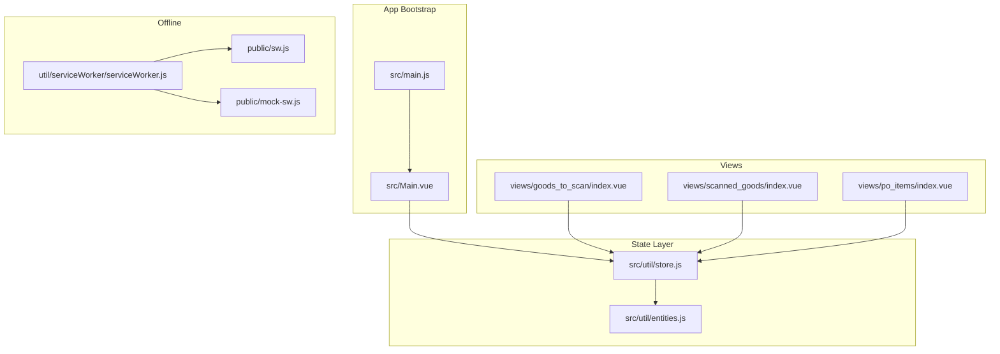
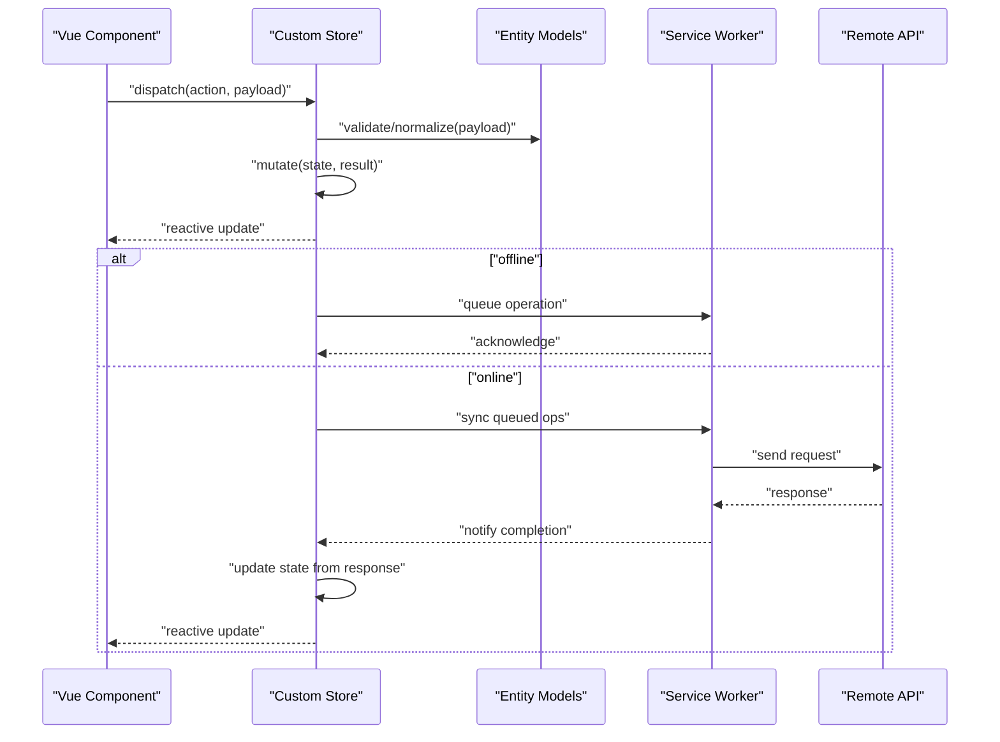
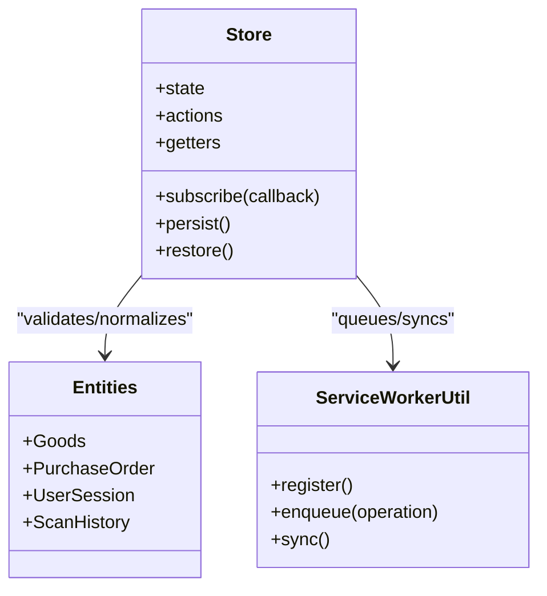
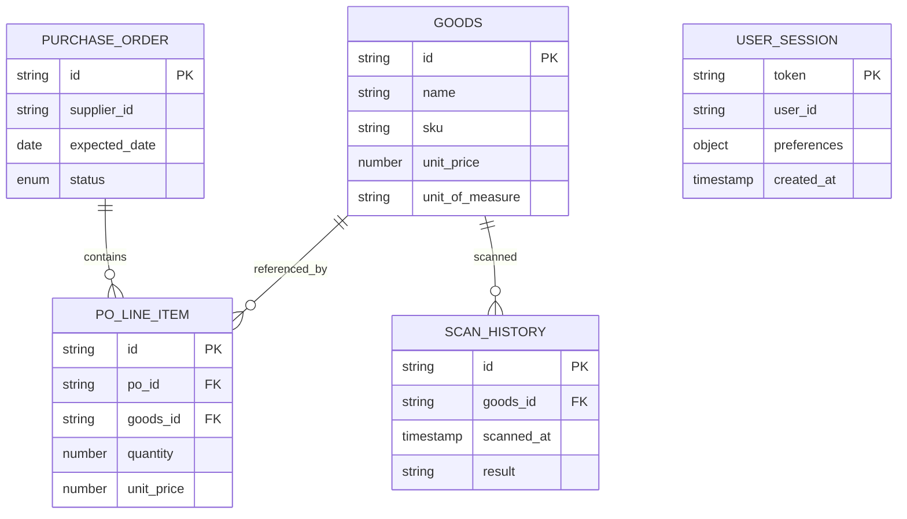
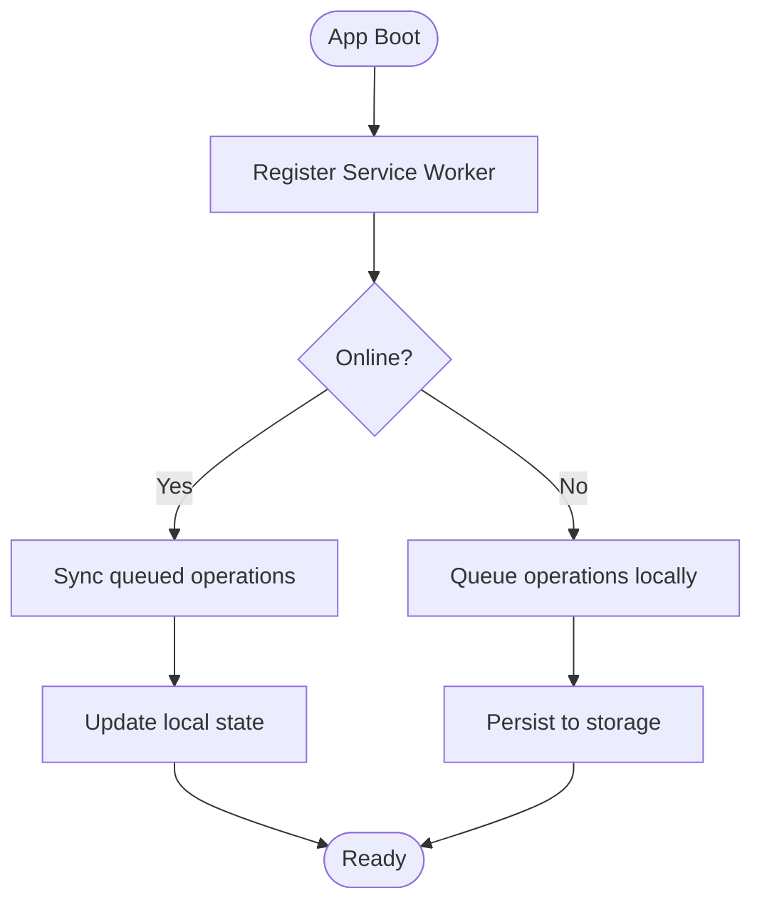
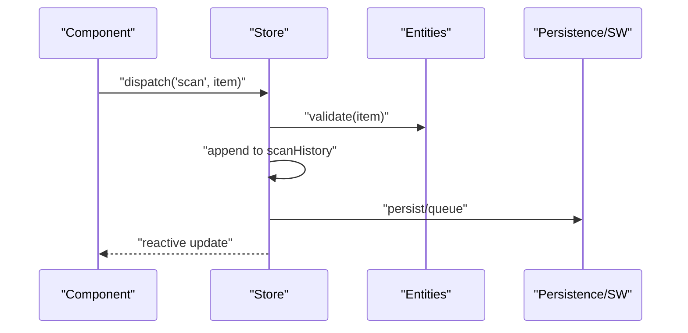
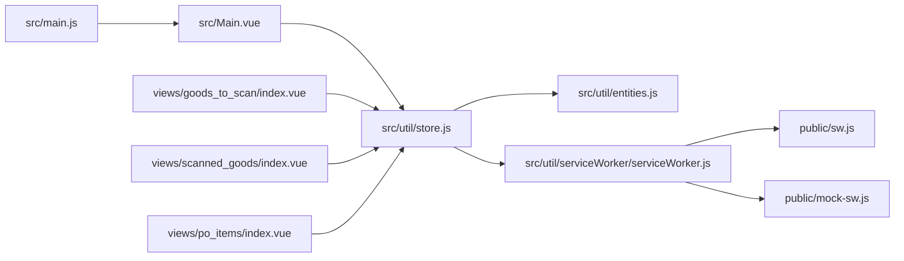

# State Management

<cite>
**Referenced Files in This Document**
- [store.js](file://src/util/store.js)
- [entities.js](file://src/util/entities.js)
- [serviceWorker.js](file://src/util/serviceWorker/serviceWorker.js)
- [sw.js](file://public/sw.js)
- [mock-sw.js](file://public/mock-sw.js)
- [main.js](file://src/main.js)
- [Main.vue](file://src/Main.vue)
- [index.vue (goods_to_scan)](file://src/views/goods_to_scan/index.vue)
- [index.vue (scanned_goods)](file://src/views/scanned_goods/index.vue)
- [index.vue (po_items)](file://src/views/po_items/index.vue)
</cite>

## Table of Contents
1. [Introduction](#introduction)
2. [Project Structure](#project-structure)
3. [Core Components](#core-components)
4. [Architecture Overview](#architecture-overview)
5. [Detailed Component Analysis](#detailed-component-analysis)
6. [Dependency Analysis](#dependency-analysis)
7. [Performance Considerations](#performance-considerations)
8. [Troubleshooting Guide](#troubleshooting-guide)
9. [Conclusion](#conclusion)
10. [Appendices](#appendices)

## Introduction
This document explains the state management architecture of ahm-gr-scanner, focusing on:
- The custom store implementation and reactive data patterns using Vue 3 Composition API
- Entity models for goods, purchase orders, user sessions, and scan history
- Data flow between components and the store
- Offline data synchronization via Service Workers
- Persistence strategies, validation, and error handling
- Practical examples of mutations, computed properties, and reactive updates

The goal is to provide both a high-level overview and code-level details so that developers can understand how state flows through the application and how offline capabilities are implemented.

## Project Structure
State-related files are primarily located under src/util and public:
- Store and entities: src/util/store.js, src/util/entities.js
- Service Worker integration: src/util/serviceWorker/serviceWorker.js, public/sw.js, public/mock-sw.js
- App bootstrap and root component: src/main.js, src/Main.vue
- Feature views that consume the store: src/views/goods_to_scan/index.vue, src/views/scanned_goods/index.vue, src/views/po_items/index.vue

**Diagram sources**
- [main.js](file://src/main.js)
- [Main.vue](file://src/Main.vue)
- [store.js](file://src/util/store.js)
- [entities.js](file://src/util/entities.js)
- [serviceWorker.js](file://src/util/serviceWorker/serviceWorker.js)
- [sw.js](file://public/sw.js)
- [mock-sw.js](file://public/mock-sw.js)
- [index.vue (goods_to_scan)](file://src/views/goods_to_scan/index.vue)
- [index.vue (scanned_goods)](file://src/views/scanned_goods/index.vue)
- [index.vue (po_items)](file://src/views/po_items/index.vue)

**Section sources**
- [main.js](file://src/main.js)
- [Main.vue](file://src/Main.vue)
- [store.js](file://src/util/store.js)
- [entities.js](file://src/util/entities.js)
- [serviceWorker.js](file://src/util/serviceWorker/serviceWorker.js)
- [sw.js](file://public/sw.js)
- [mock-sw.js](file://public/mock-sw.js)
- [index.vue (goods_to_scan)](file://src/views/goods_to_scan/index.vue)
- [index.vue (scanned_goods)](file://src/views/scanned_goods/index.vue)
- [index.vue (po_items)](file://src/views/po_items/index.vue)

## Core Components
- Custom Store (store.js): Implements a centralized reactive store with actions, getters, and persistence hooks. It exposes methods to mutate state and subscribe to changes.
- Entities (entities.js): Defines canonical data structures for domain objects such as Goods, Purchase Orders, User Sessions, and Scan History. These models guide validation and normalization.
- Service Worker Integration (serviceWorker.js, sw.js, mock-sw.js): Provides offline caching and background sync utilities. The app registers the SW and uses it to persist queued operations when offline.

Key responsibilities:
- Centralized state shape and lifecycle
- Reactive updates consumed by Vue components
- Normalization and validation against entity schemas
- Offline queueing and synchronization with backend

**Section sources**
- [store.js](file://src/util/store.js)
- [entities.js](file://src/util/entities.js)
- [serviceWorker.js](file://src/util/serviceWorker/serviceWorker.js)
- [sw.js](file://public/sw.js)
- [mock-sw.js](file://public/mock-sw.js)

## Architecture Overview
The state layer sits between UI components and offline/network layers. Components dispatch actions to the store; the store mutates normalized state and persists relevant slices. When online, the store synchronizes queued operations via the Service Worker.

**Diagram sources**
- [store.js](file://src/util/store.js)
- [entities.js](file://src/util/entities.js)
- [serviceWorker.js](file://src/util/serviceWorker/serviceWorker.js)
- [sw.js](file://public/sw.js)

## Detailed Component Analysis

### Store Implementation (store.js)
Responsibilities:
- Exposes reactive state and actions
- Provides subscription mechanism for components
- Handles persistence (e.g., localStorage or IndexedDB)
- Integrates with Service Worker for offline queueing and sync

Typical patterns:
- Actions encapsulate business logic and side effects
- Getters compute derived values
- Subscribers notify components of changes
- Persistence hooks serialize/deserialize state slices

**Diagram sources**
- [store.js](file://src/util/store.js)
- [entities.js](file://src/util/entities.js)
- [serviceWorker.js](file://src/util/serviceWorker/serviceWorker.js)

**Section sources**
- [store.js](file://src/util/store.js)

### Entity Models (entities.js)
Defines canonical shapes used across the app:
- Goods: product identifiers, descriptions, units, pricing metadata
- Purchase Order: header info, line items, status, timestamps
- User Session: authentication tokens, preferences, locale
- Scan History: per-scan records with timestamps and results

Validation and normalization:
- Ensure required fields exist
- Normalize IDs and references
- Enforce constraints (e.g., non-negative quantities)

**Diagram sources**
- [entities.js](file://src/util/entities.js)

**Section sources**
- [entities.js](file://src/util/entities.js)

### Service Worker Integration (serviceWorker.js, sw.js, mock-sw.js)
Integration points:
- Registration and lifecycle management
- Message passing between app and SW
- Background sync and cache strategies
- Mock SW for development/testing

**Diagram sources**
- [serviceWorker.js](file://src/util/serviceWorker/serviceWorker.js)
- [sw.js](file://public/sw.js)
- [mock-sw.js](file://public/mock-sw.js)

**Section sources**
- [serviceWorker.js](file://src/util/serviceWorker/serviceWorker.js)
- [sw.js](file://public/sw.js)
- [mock-sw.js](file://public/mock-sw.js)

### Component-to-Store Data Flow Patterns
Common patterns observed in feature views:
- Dispatch actions to add/update/remove entities
- Subscribe to store changes to re-render lists and summaries
- Use computed properties to derive filtered or aggregated views

Examples:
- Scanning flow: component dispatches a scan action, store validates and appends to scan history, UI updates immediately
- Goods list: component subscribes to goods slice, displays normalized entries
- Purchase order creation: component dispatches create PO action, store persists and queues sync if offline

**Diagram sources**
- [store.js](file://src/util/store.js)
- [entities.js](file://src/util/entities.js)
- [serviceWorker.js](file://src/util/serviceWorker/serviceWorker.js)
- [index.vue (goods_to_scan)](file://src/views/goods_to_scan/index.vue)
- [index.vue (scanned_goods)](file://src/views/scanned_goods/index.vue)
- [index.vue (po_items)](file://src/views/po_items/index.vue)

**Section sources**
- [index.vue (goods_to_scan)](file://src/views/goods_to_scan/index.vue)
- [index.vue (scanned_goods)](file://src/views/scanned_goods/index.vue)
- [index.vue (po_items)](file://src/views/po_items/index.vue)
- [store.js](file://src/util/store.js)
- [entities.js](file://src/util/entities.js)
- [serviceWorker.js](file://src/util/serviceWorker/serviceWorker.js)

## Dependency Analysis
High-level dependencies:
- Views depend on the store for state and actions
- Store depends on entities for validation and normalization
- Store depends on service worker utilities for offline queueing and sync
- App bootstrap initializes the store and registers the service worker

**Diagram sources**
- [main.js](file://src/main.js)
- [Main.vue](file://src/Main.vue)
- [store.js](file://src/util/store.js)
- [entities.js](file://src/util/entities.js)
- [serviceWorker.js](file://src/util/serviceWorker/serviceWorker.js)
- [sw.js](file://public/sw.js)
- [mock-sw.js](file://public/mock-sw.js)
- [index.vue (goods_to_scan)](file://src/views/goods_to_scan/index.vue)
- [index.vue (scanned_goods)](file://src/views/scanned_goods/index.vue)
- [index.vue (po_items)](file://src/views/po_items/index.vue)

**Section sources**
- [main.js](file://src/main.js)
- [Main.vue](file://src/Main.vue)
- [store.js](file://src/util/store.js)
- [entities.js](file://src/util/entities.js)
- [serviceWorker.js](file://src/util/serviceWorker/serviceWorker.js)
- [sw.js](file://public/sw.js)
- [mock-sw.js](file://public/mock-sw.js)
- [index.vue (goods_to_scan)](file://src/views/goods_to_scan/index.vue)
- [index.vue (scanned_goods)](file://src/views/scanned_goods/index.vue)
- [index.vue (po_items)](file://src/views/po_items/index.vue)

## Performance Considerations
- Prefer normalized state to avoid duplication and reduce reconciliation cost
- Batch mutations where possible to minimize re-renders
- Use computed properties for derived data instead of recomputing in templates
- Debounce heavy operations (e.g., large scans) before dispatching to the store
- Keep persisted payloads minimal; only persist necessary slices
- Leverage Service Worker caches for static assets and repeated requests

[No sources needed since this section provides general guidance]

## Troubleshooting Guide
Common issues and checks:
- Store not updating: ensure components subscribe to store changes and actions commit mutations correctly
- Offline sync failures: verify SW registration and message passing; check queue persistence and retry logic
- Validation errors: confirm entity schemas match incoming payloads; log invalid fields for debugging
- Memory leaks: unsubscribe from store subscribers on component teardown

**Section sources**
- [store.js](file://src/util/store.js)
- [serviceWorker.js](file://src/util/serviceWorker/serviceWorker.js)
- [entities.js](file://src/util/entities.js)

## Conclusion
The ahm-gr-scanner’s state management centers around a custom store that normalizes and persists domain entities while integrating with Service Workers for offline support. By adhering to clear entity models and consistent mutation patterns, the app achieves predictable state transitions, efficient reactivity, and robust offline behavior.

[No sources needed since this section summarizes without analyzing specific files]

## Appendices

### Practical Examples (paths only)
- Mutating state: see store actions that append to scan history and update goods lists
- Computed properties: derive filtered goods or summary counts in components
- Reactive updates: observe store subscriptions in view components

**Section sources**
- [store.js](file://src/util/store.js)
- [index.vue (goods_to_scan)](file://src/views/goods_to_scan/index.vue)
- [index.vue (scanned_goods)](file://src/views/scanned_goods/index.vue)
- [index.vue (po_items)](file://src/views/po_items/index.vue)