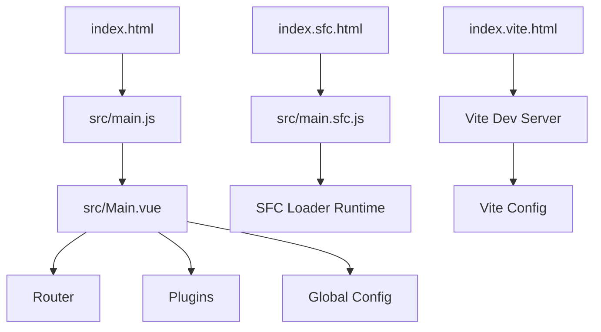
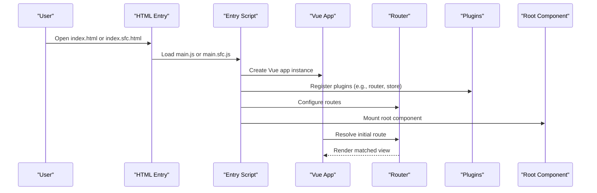
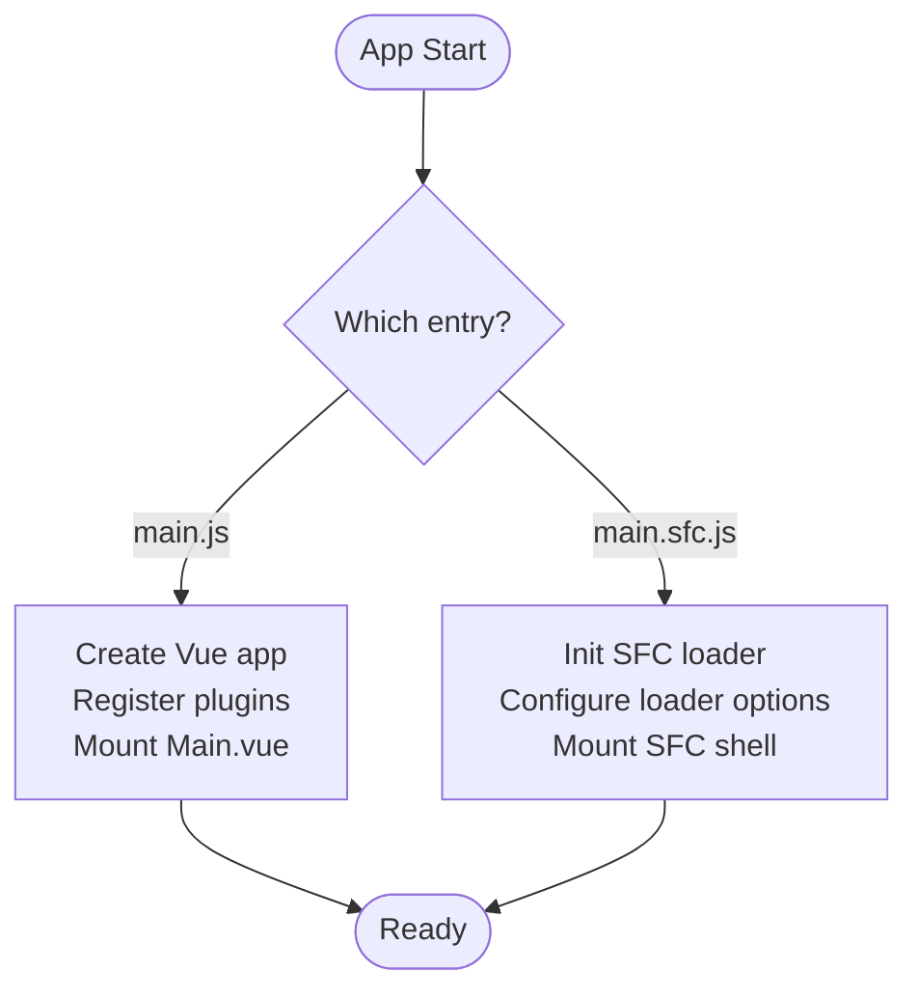
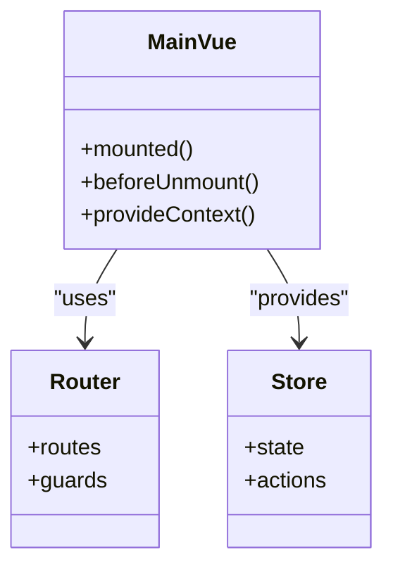
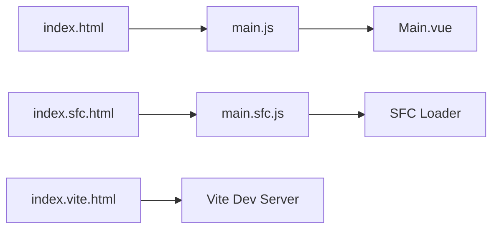
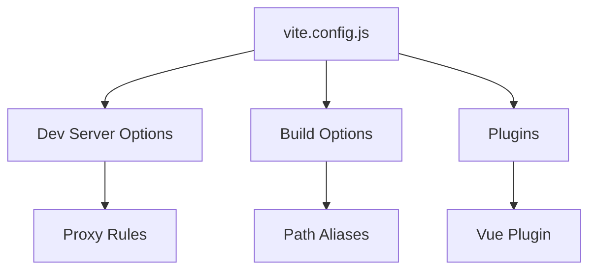
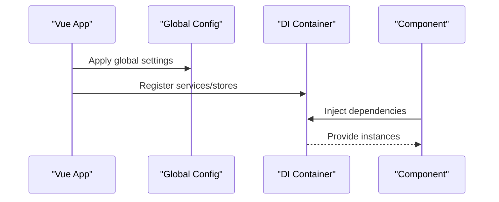
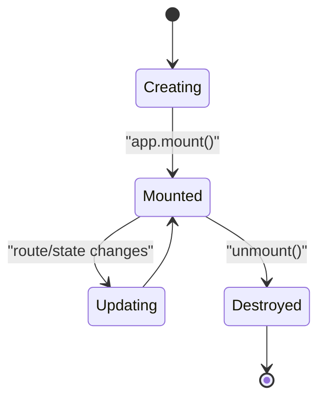
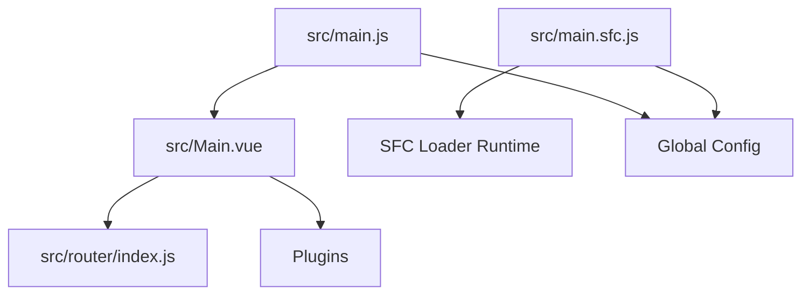

# Application Structure & Bootstrap

<cite>
**Referenced Files in This Document**
- [src/main.js](file://src/main.js)
- [src/main.sfc.js](file://src/main.sfc.js)
- [src/Main.vue](file://src/Main.vue)
- [vite.config.js](file://vite.config.js)
- [index.html](file://index.html)
- [index.sfc.html](file://index.sfc.html)
- [index.vite.html](file://index.vite.html)
- [package.json](file://package.json)
</cite>

## Table of Contents
1. [Introduction](#introduction)
2. [Project Structure](#project-structure)
3. [Core Components](#core-components)
4. [Architecture Overview](#architecture-overview)
5. [Detailed Component Analysis](#detailed-component-analysis)
6. [Dependency Analysis](#dependency-analysis)
7. [Performance Considerations](#performance-considerations)
8. [Troubleshooting Guide](#troubleshooting-guide)
9. [Conclusion](#conclusion)

## Introduction

This document explains the application's dual entry point architecture, Vue.js 3 initialization, plugin registration, global configuration, and the relationship between different HTML entry points. It also covers Vite build configuration, module loading strategies, dependency injection patterns, and lifecycle management.

## Project Structure

The application follows a feature-based organization under src/, with separate entry points for standard builds and SFC loading. Key directories include components, router, views, util, and lib. Build and runtime configurations are centralized in vite.config.js and package.json.

**Diagram sources**
- [index.html](file://index.html)
- [index.sfc.html](file://index.sfc.html)
- [index.vite.html](file://index.vite.html)
- [src/main.js](file://src/main.js)
- [src/main.sfc.js](file://src/main.sfc.js)
- [src/Main.vue](file://src/Main.vue)
- [vite.config.js](file://vite.config.js)

**Section sources**
- [package.json](file://package.json)
- [vite.config.js](file://vite.config.js)

## Core Components

- Dual entry points:
  - main.js: Standard production/development build entry that bootstraps the Vue app and mounts it into the DOM.
  - main.sfc.js: SFC loader entry used by index.sfc.html to dynamically load Single File Components at runtime.
- Root component:
  - Main.vue: Application shell providing layout, navigation, and root-level providers (router, stores, plugins).
- Router:
  - Centralized route definitions and guards under src/router/index.js.
- Utilities:
  - Shared helpers and bootstrapping utilities under src/util/.

Key responsibilities:
- main.js initializes the Vue app instance, registers plugins, applies global config, and mounts the root component.
- main.sfc.js sets up the SFC loader runtime and mounts an SFC-based shell or demo page.
- Main.vue composes top-level UI and provides context to child routes and components.

**Section sources**
- [src/main.js](file://src/main.js)
- [src/main.sfc.js](file://src/main.sfc.js)
- [src/Main.vue](file://src/Main.vue)

## Architecture Overview

The application supports two primary runtime modes:

- Standard mode (main.js):
  - Loaded via index.html.
  - Uses pre-bundled assets produced by Vite.
  - Mounts Main.vue as the root component.
- SFC mode (main.sfc.js):
  - Loaded via index.sfc.html.
  - Uses vue3-sfc-loader to fetch and compile .vue files at runtime.
  - Useful for development, demos, or dynamic loading scenarios.

**Diagram sources**
- [index.html](file://index.html)
- [index.sfc.html](file://index.sfc.html)
- [src/main.js](file://src/main.js)
- [src/main.sfc.js](file://src/main.sfc.js)
- [src/Main.vue](file://src/Main.vue)

## Detailed Component Analysis

### Dual Entry Points

- main.js (standard build)
  - Creates the Vue app instance.
  - Registers global plugins and directives.
  - Applies global configuration (e.g., theme, API base URL).
  - Mounts the root component into the DOM element defined in index.html.
- main.sfc.js (SFC loader)
  - Initializes the SFC loader runtime.
  - Configures loader options (e.g., module resolution, cache).
  - Mounts an SFC-based shell or demo page into the DOM element defined in index.sfc.html.

**Diagram sources**
- [src/main.js](file://src/main.js)
- [src/main.sfc.js](file://src/main.sfc.js)

**Section sources**
- [src/main.js](file://src/main.js)
- [src/main.sfc.js](file://src/main.sfc.js)

### Root Component: Main.vue

Main.vue acts as the application shell:
- Provides layout scaffolding (header, sidebar, content area).
- Integrates routing outlet for views.
- Hosts global state providers and shared services.
- May register global styles and error boundaries.

**Diagram sources**
- [src/Main.vue](file://src/Main.vue)
- [src/router/index.js](file://src/router/index.js)

**Section sources**
- [src/Main.vue](file://src/Main.vue)

### HTML Entry Points and Use Cases

- index.html
  - Targets the standard build.
  - Loads the bundled script from main.js.
  - Suitable for production and typical development workflows.
- index.sfc.html
  - Targets the SFC loader runtime.
  - Loads main.sfc.js and mounts an SDF-based shell.
  - Useful for live SFC editing, demos, or server-rendered SFC previews.
- index.vite.html
  - Used by Vite’s dev server for hot-reloadable development.
  - Typically includes Vite client and dev-time scripts.

**Diagram sources**
- [index.html](file://index.html)
- [index.sfc.html](file://index.sfc.html)
- [index.vite.html](file://index.vite.html)
- [src/main.js](file://src/main.js)
- [src/main.sfc.js](file://src/main.sfc.js)

**Section sources**
- [index.html](file://index.html)
- [index.sfc.html](file://index.sfc.html)
- [index.vite.html](file://index.vite.html)

### Vite Configuration and Development Server

- vite.config.js
  - Defines build targets, aliases, and optimization settings.
  - Configures dev server (port, proxy, open behavior).
  - Sets up plugins (e.g., Vue, SFC loader integration if needed).
- Environment setup
  - Environment variables are loaded per mode (dev/prod).
  - Base path and asset handling are configured for deployment.

**Diagram sources**
- [vite.config.js](file://vite.config.js)

**Section sources**
- [vite.config.js](file://vite.config.js)

### Module Loading Strategies and Dependency Injection

- Module loading
  - Standard build uses static imports resolved by Vite; lazy-loaded routes use dynamic imports for code splitting.
  - SFC mode uses vue3-sfc-loader to fetch and compile .vue files on demand.
- Dependency injection
  - Global configuration is applied via app.config or custom provider functions.
  - Services and stores are registered once during app creation and injected into components via composition APIs or context.

**Diagram sources**
- [src/main.js](file://src/main.js)
- [src/main.sfc.js](file://src/main.sfc.js)

**Section sources**
- [src/main.js](file://src/main.js)
- [src/main.sfc.js](file://src/main.sfc.js)

### Application Lifecycle Management

- Initialization
  - Create app instance, register plugins, configure router and stores.
- Mounting
  - Mount root component into the appropriate DOM node.
- Cleanup
  - Unmount on navigation away or before unload to release resources.

**Diagram sources**
- [src/main.js](file://src/main.js)
- [src/main.sfc.js](file://src/main.sfc.js)

**Section sources**
- [src/main.js](file://src/main.js)
- [src/main.sfc.js](file://src/main.sfc.js)

## Dependency Analysis

High-level relationships among core modules:

**Diagram sources**
- [src/main.js](file://src/main.js)
- [src/main.sfc.js](file://src/main.sfc.js)
- [src/Main.vue](file://src/Main.vue)
- [src/router/index.js](file://src/router/index.js)

**Section sources**
- [src/main.js](file://src/main.js)
- [src/main.sfc.js](file://src/main.sfc.js)
- [src/Main.vue](file://src/Main.vue)
- [src/router/index.js](file://src/router/index.js)

## Performance Considerations

- Prefer static imports for critical paths; use dynamic imports for route-level code splitting.
- Keep the root bundle lean by deferring non-critical plugins until after mount.
- In SFC mode, leverage loader caching and limit concurrent SFC requests to avoid network bottlenecks.
- Configure Vite optimizeDeps and build.rollupOptions for faster cold starts and smaller bundles.

[No sources needed since this section provides general guidance]

## Troubleshooting Guide

Common issues and checks:
- Wrong DOM target: Ensure the entry script mounts into the correct container ID present in the corresponding HTML file.
- SFC loader not found: Verify vue3-sfc-loader is installed and configured in main.sfc.js.
- Route not rendering: Confirm routes are registered and the router outlet exists in Main.vue.
- Dev server not opening: Check vite.config.js port and open settings.

**Section sources**
- [index.html](file://index.html)
- [index.sfc.html](file://index.sfc.html)
- [src/main.js](file://src/main.js)
- [src/main.sfc.js](file://src/main.sfc.js)
- [src/Main.vue](file://src/Main.vue)
- [vite.config.js](file://vite.config.js)

## Conclusion

The application employs a dual entry point strategy to support both standard builds and dynamic SFC loading. main.js handles the conventional Vue app bootstrap, while main.sfc.js enables runtime SFC compilation through vue3-sfc-loader. Main.vue serves as the application shell, integrating routing, plugins, and global configuration. Vite config centralizes development and build behaviors, and the three HTML entries tailor the runtime experience for production, SFC demos, and development.

[No sources needed since this section summarizes without analyzing specific files]