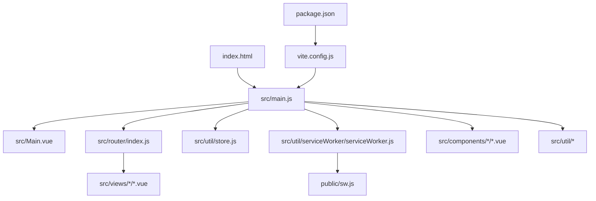
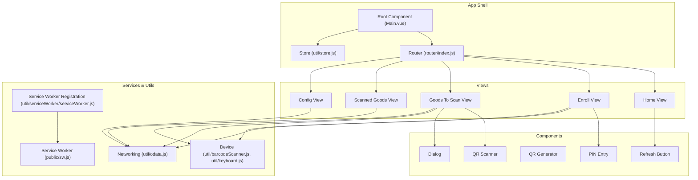
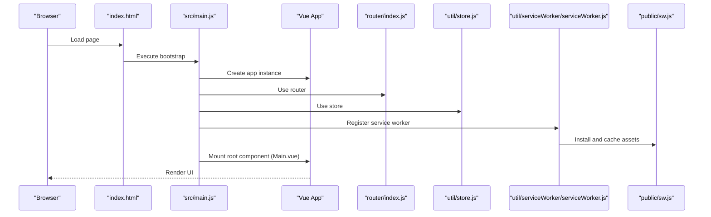
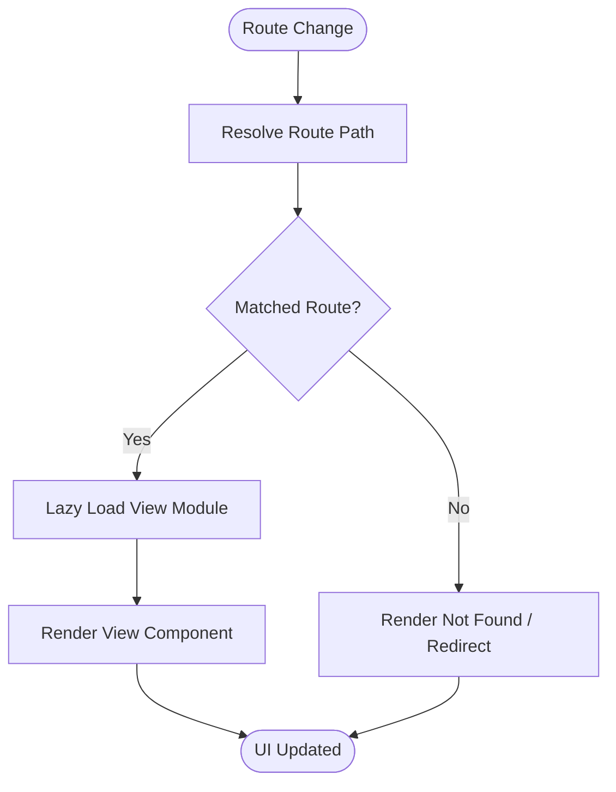
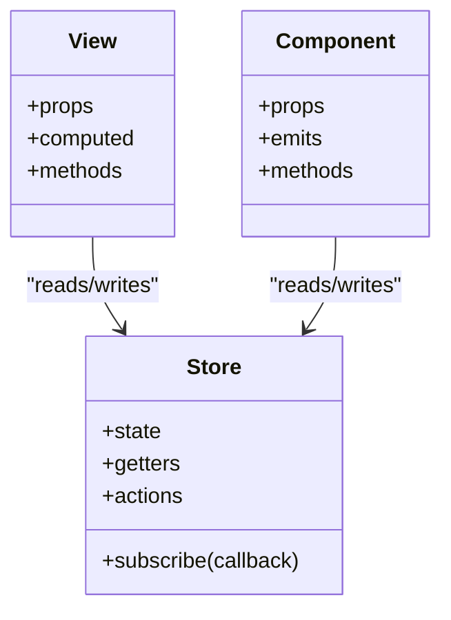
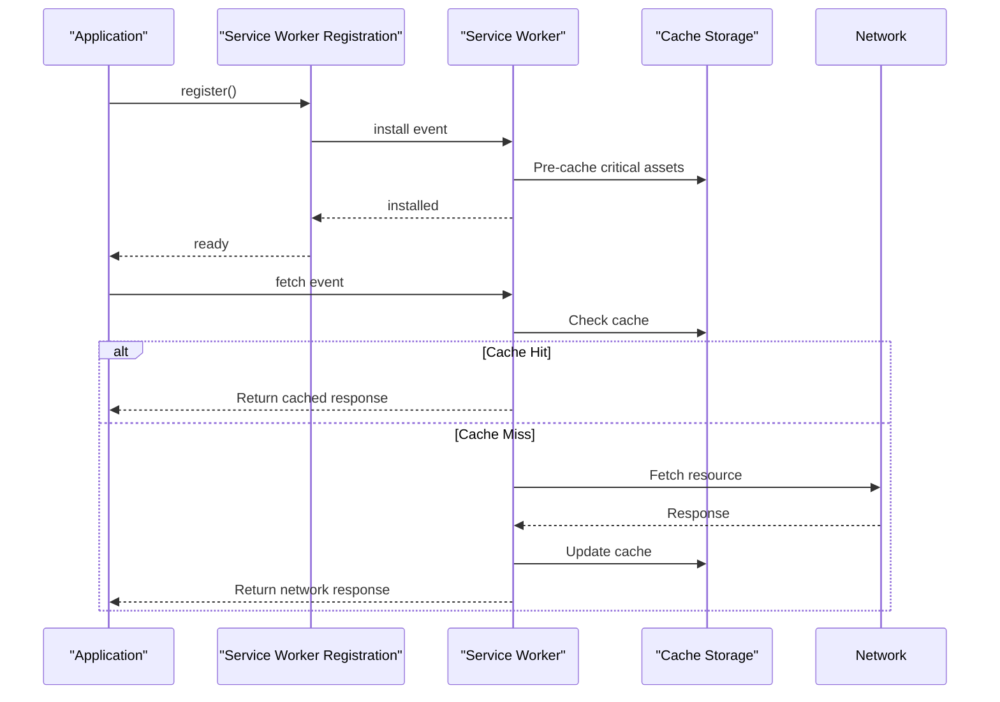
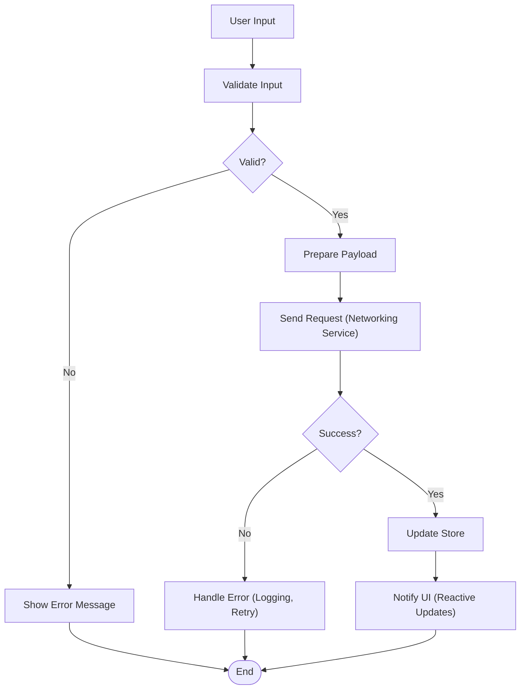
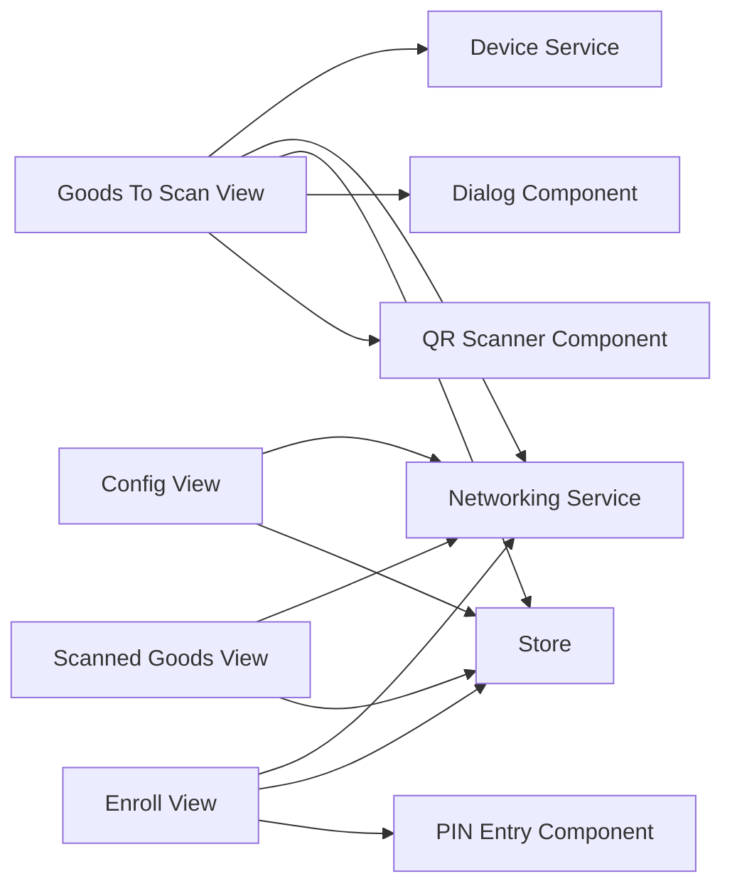
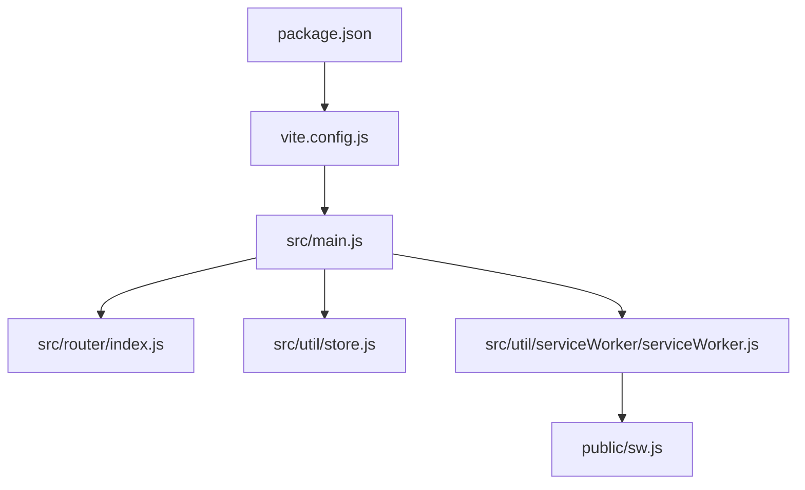

# Architecture Overview

<cite>
**Referenced Files in This Document**
- [index.html](file://index.html)
- [main.js](file://src/main.js)
- [Main.vue](file://src/Main.vue)
- [router/index.js](file://src/router/index.js)
- [util/store.js](file://src/util/store.js)
- [util/serviceWorker/serviceWorker.js](file://src/util/serviceWorker/serviceWorker.js)
- [public/sw.js](file://public/sw.js)
- [vite.config.js](file://vite.config.js)
- [package.json](file://package.json)
</cite>

## Table of Contents
1. [Introduction](#introduction)
2. [Project Structure](#project-structure)
3. [Core Components](#core-components)
4. [Architecture Overview](#architecture-overview)
5. [Detailed Component Analysis](#detailed-component-analysis)
6. [Dependency Analysis](#dependency-analysis)
7. [Performance Considerations](#performance-considerations)
8. [Troubleshooting Guide](#troubleshooting-guide)
9. [Conclusion](#conclusion)

## Introduction
This document describes the architecture of the AHM GR Scanner system, a Vue 3-based application designed for scanning and managing goods receipt operations. It explains the component-based design using Vue 3 Single File Components (SFCs), the MVVM pattern implementation, modular service-oriented design, bootstrap process, routing with lazy-loaded views, centralized state management, and Service Worker integration for offline capabilities. It also outlines separation of concerns across views, components, utilities, and services, along with data flow patterns from user input to backend synchronization and cross-cutting concerns such as error handling, logging, and performance optimization.

## Project Structure
The project follows a feature-oriented layout:
- src/views: Feature pages implemented as Vue SFCs
- src/components: Reusable UI components (dialogs, QR code scanner/generator, PIN entry, refresh button)
- src/lib: Bundled third-party libraries (Vue, Vue Router, QR code generator, HTML5 QR scanner)
- src/router: Application routes
- src/util: Shared utilities including store, service worker helpers, barcode scanning helpers, OData client, keyboard utilities, and SFC bootstrap helpers
- public: Static assets including Service Worker files
- scripts: Build and deployment helper scripts
- vite.config.js: Vite build configuration
- index.html: Entry HTML that bootstraps the app

**Diagram sources**
- [index.html:1-200](file://index.html#L1-L200)
- [main.js:1-200](file://src/main.js#L1-L200)
- [Main.vue:1-200](file://src/Main.vue#L1-L200)
- [router/index.js:1-200](file://src/router/index.js#L1-L200)
- [store.js:1-200](file://src/util/store.js#L1-L200)
- [serviceWorker.js:1-200](file://src/util/serviceWorker/serviceWorker.js#L1-L200)
- [sw.js:1-200](file://public/sw.js#L1-L200)
- [vite.config.js:1-200](file://vite.config.js#L1-L200)
- [package.json:1-200](file://package.json#L1-L200)

**Section sources**
- [index.html:1-200](file://index.html#L1-L200)
- [main.js:1-200](file://src/main.js#L1-L200)
- [Main.vue:1-200](file://src/Main.vue#L1-L200)
- [router/index.js:1-200](file://src/router/index.js#L1-L200)
- [store.js:1-200](file://src/util/store.js#L1-L200)
- [serviceWorker.js:1-200](file://src/util/serviceWorker/serviceWorker.js#L1-L200)
- [sw.js:1-200](file://public/sw.js#L1-L200)
- [vite.config.js:1-200](file://vite.config.js#L1-L200)
- [package.json:1-200](file://package.json#L1-L200)

## Core Components
- Application shell: The root component renders the navigation and view outlet, providing the top-level MVVM context.
- Views: Feature-specific pages (e.g., home, enroll, goods_to_scan, scanned_goods, config). Each view encapsulates business logic for its domain and composes reusable components.
- Components: Small, focused UI elements like dialog, QR code scanner/generator, PIN entry, and refresh button. They expose props/events and rely on shared services for behavior.
- Utilities: Centralized modules for state (store), networking (OData), device features (barcode scanner, keyboard), and runtime helpers (SFC bootstrap).
- Services: Network and device abstraction layers used by components and views to perform side effects (scanning, HTTP requests, storage).

Key responsibilities:
- Views orchestrate user flows and coordinate between components and services.
- Components manage presentation and local interactions.
- Utilities provide shared functionality and global state.
- Services abstract external systems (backend APIs, hardware scanners).

**Section sources**
- [Main.vue:1-200](file://src/Main.vue#L1-L200)
- [router/index.js:1-200](file://src/router/index.js#L1-L200)
- [store.js:1-200](file://src/util/store.js#L1-L200)
- [serviceWorker.js:1-200](file://src/util/serviceWorker/serviceWorker.js#L1-L200)

## Architecture Overview
The system is built around a component-based architecture with Vue 3 SFCs implementing the MVVM pattern:
- Model: Data models and state managed via a centralized store utility.
- View: Vue templates in views and components.
- ViewModel: Vue reactive state and computed properties within SFCs.

Modular service-oriented design separates concerns:
- Networking service layer handles OData communication.
- Device service layer wraps barcode scanning and keyboard events.
- Store module centralizes application state and persistence.
- Service Worker provides caching and offline support.

Bootstrap process:
- index.html loads the application bundle.
- main.js initializes Vue, router, store, and registers the root component.
- Router defines lazy-loaded routes to views.
- Service Worker is registered for offline capabilities.

**Diagram sources**
- [Main.vue:1-200](file://src/Main.vue#L1-L200)
- [router/index.js:1-200](file://src/router/index.js#L1-L200)
- [store.js:1-200](file://src/util/store.js#L1-L200)
- [serviceWorker.js:1-200](file://src/util/serviceWorker/serviceWorker.js#L1-L200)
- [sw.js:1-200](file://public/sw.js#L1-L200)

## Detailed Component Analysis

### Bootstrap and Initialization Flow
The application starts from index.html, which loads the bundled JavaScript. The main initialization script sets up Vue, registers plugins (router, store), mounts the root component, and registers the Service Worker.

**Diagram sources**
- [index.html:1-200](file://index.html#L1-L200)
- [main.js:1-200](file://src/main.js#L1-L200)
- [router/index.js:1-200](file://src/router/index.js#L1-L200)
- [store.js:1-200](file://src/util/store.js#L1-L200)
- [serviceWorker.js:1-200](file://src/util/serviceWorker/serviceWorker.js#L1-L200)
- [sw.js:1-200](file://public/sw.js#L1-L200)

**Section sources**
- [index.html:1-200](file://index.html#L1-L200)
- [main.js:1-200](file://src/main.js#L1-L200)
- [router/index.js:1-200](file://src/router/index.js#L1-L200)
- [store.js:1-200](file://src/util/store.js#L1-L200)
- [serviceWorker.js:1-200](file://src/util/serviceWorker/serviceWorker.js#L1-L200)
- [sw.js:1-200](file://public/sw.js#L1-L200)

### Routing Architecture with Lazy-Loaded Views
Routes are defined centrally and map to feature views. Lazy loading ensures only necessary code is loaded per route.

**Diagram sources**
- [router/index.js:1-200](file://src/router/index.js#L1-L200)

**Section sources**
- [router/index.js:1-200](file://src/router/index.js#L1-L200)

### Centralized State Management
State is centralized in a store module. Views and components read/write state through the store, ensuring consistent data across the application.

**Diagram sources**
- [store.js:1-200](file://src/util/store.js#L1-L200)

**Section sources**
- [store.js:1-200](file://src/util/store.js#L1-L200)

### Service Worker Integration for Offline Capabilities
The application registers a Service Worker to cache assets and enable offline access. The registration helper manages installation and update cycles.

**Diagram sources**
- [serviceWorker.js:1-200](file://src/util/serviceWorker/serviceWorker.js#L1-L200)
- [sw.js:1-200](file://public/sw.js#L1-L200)

**Section sources**
- [serviceWorker.js:1-200](file://src/util/serviceWorker/serviceWorker.js#L1-L200)
- [sw.js:1-200](file://public/sw.js#L1-L200)

### Data Flow Patterns: User Input to Backend Synchronization
User interactions trigger validation and then synchronize with the backend via the networking service.

**Diagram sources**
- [store.js:1-200](file://src/util/store.js#L1-L200)

**Section sources**
- [store.js:1-200](file://src/util/store.js#L1-L200)

### Component Interaction Diagrams
High-level interactions among core components and services:

**Diagram sources**
- [router/index.js:1-200](file://src/router/index.js#L1-L200)
- [store.js:1-200](file://src/util/store.js#L1-L200)

**Section sources**
- [router/index.js:1-200](file://src/router/index.js#L1-L200)
- [store.js:1-200](file://src/util/store.js#L1-L200)

## Dependency Analysis
The application depends on Vue 3, Vue Router, and various utilities. Vite configures bundling and development server settings. Package dependencies define runtime requirements.

**Diagram sources**
- [package.json:1-200](file://package.json#L1-L200)
- [vite.config.js:1-200](file://vite.config.js#L1-L200)
- [main.js:1-200](file://src/main.js#L1-L200)
- [router/index.js:1-200](file://src/router/index.js#L1-L200)
- [store.js:1-200](file://src/util/store.js#L1-L200)
- [serviceWorker.js:1-200](file://src/util/serviceWorker/serviceWorker.js#L1-L200)
- [sw.js:1-200](file://public/sw.js#L1-L200)

**Section sources**
- [package.json:1-200](file://package.json#L1-L200)
- [vite.config.js:1-200](file://vite.config.js#L1-L200)
- [main.js:1-200](file://src/main.js#L1-L200)
- [router/index.js:1-200](file://src/router/index.js#L1-L200)
- [store.js:1-200](file://src/util/store.js#L1-L200)
- [serviceWorker.js:1-200](file://src/util/serviceWorker/serviceWorker.js#L1-L200)
- [sw.js:1-200](file://public/sw.js#L1-L200)

## Performance Considerations
- Lazy-loading routes reduces initial bundle size and improves startup time.
- Component composition keeps UI logic small and testable.
- Centralized store minimizes redundant state duplication and enables efficient updates.
- Service Worker caching reduces network latency and supports offline usage.
- Prefer lightweight utilities and avoid heavy synchronous operations in render paths.

[No sources needed since this section provides general guidance]

## Troubleshooting Guide
Common issues and strategies:
- Service Worker not registering or updating: Verify registration path and ensure sw.js is served correctly; check browser dev tools for SW status and cache contents.
- Offline mode not working: Confirm pre-caching steps during install and fetch handler logic; validate network fallback behavior.
- State inconsistencies: Ensure all mutations go through the store actions; add logging around state changes to trace updates.
- Network errors: Implement retry logic and user-friendly error messages; log request/response details for debugging.

**Section sources**
- [serviceWorker.js:1-200](file://src/util/serviceWorker/serviceWorker.js#L1-L200)
- [sw.js:1-200](file://public/sw.js#L1-L200)
- [store.js:1-200](file://src/util/store.js#L1-L200)

## Conclusion
The AHM GR Scanner leverages a modern Vue 3 component-based architecture with clear separation of concerns, centralized state management, and robust offline support via Service Workers. The modular service-oriented design facilitates maintainability and scalability, while lazy-loaded routing optimizes performance. By adhering to MVVM principles and structured data flows, the system delivers a responsive and reliable user experience for goods receipt scanning operations.

[No sources needed since this section summarizes without analyzing specific files]