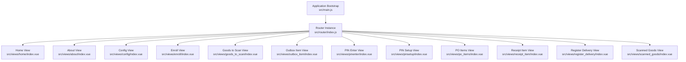
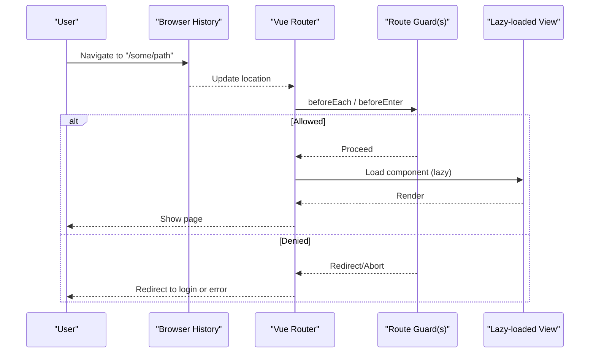
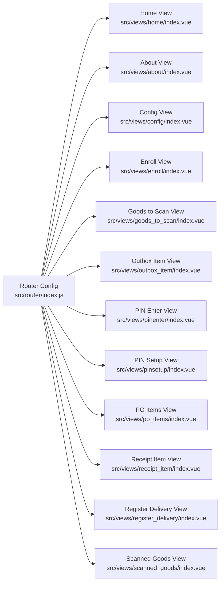

# Routing & Navigation System

<cite>
**Referenced Files in This Document**
- [src/router/index.js](file://src/router/index.js)
- [src/main.js](file://src/main.js)
- [src/views/home/index.vue](file://src/views/home/index.vue)
- [src/views/about/index.vue](file://src/views/about/index.vue)
- [src/views/config/index.vue](file://src/views/config/index.vue)
- [src/views/enroll/index.vue](file://src/views/enroll/index.vue)
- [src/views/goods_to_scan/index.vue](file://src/views/goods_to_scan/index.vue)
- [src/views/outbox_item/index.vue](file://src/views/outbox_item/index.vue)
- [src/views/pinenter/index.vue](file://src/views/pinenter/index.vue)
- [src/views/pinsetup/index.vue](file://src/views/pinsetup/index.vue)
- [src/views/po_items/index.vue](file://src/views/po_items/index.vue)
- [src/views/receipt_item/index.vue](file://src/views/receipt_item/index.vue)
- [src/views/register_delivery/index.vue](file://src/views/register_delivery/index.vue)
- [src/views/scanned_goods/index.vue](file://src/views/scanned_goods/index.vue)
</cite>

## Table of Contents
1. [Introduction](#introduction)
2. [Project Structure](#project-structure)
3. [Core Components](#core-components)
4. [Architecture Overview](#architecture-overview)
5. [Detailed Component Analysis](#detailed-component-analysis)
6. [Dependency Analysis](#dependency-analysis)
7. [Performance Considerations](#performance-considerations)
8. [Troubleshooting Guide](#troubleshooting-guide)
9. [Conclusion](#conclusion)
10. [Appendices](#appendices)

## Introduction
This document explains the routing and navigation system implemented with Vue Router. It covers route configuration, lazy-loaded view components, parameter handling, query string management, programmatic navigation, transitions, authentication guards for protected routes, deep linking, and browser history integration. It also provides guidance on adding new routes and implementing navigation flows aligned with business workflows.

## Project Structure
The routing layer is centralized under src/router, while feature-based views are organized under src/views/<feature>/index.vue. The router is initialized and mounted in the application bootstrap file.

**Diagram sources**
- [src/main.js](file://src/main.js)
- [src/router/index.js](file://src/router/index.js)
- [src/views/home/index.vue](file://src/views/home/index.vue)
- [src/views/about/index.vue](file://src/views/about/index.vue)
- [src/views/config/index.vue](file://src/views/config/index.vue)
- [src/views/enroll/index.vue](file://src/views/enroll/index.vue)
- [src/views/goods_to_scan/index.vue](file://src/views/goods_to_scan/index.vue)
- [src/views/outbox_item/index.vue](file://src/views/outbox_item/index.vue)
- [src/views/pinenter/index.vue](file://src/views/pinenter/index.vue)
- [src/views/pinsetup/index.vue](file://src/views/pinsetup/index.vue)
- [src/views/po_items/index.vue](file://src/views/po_items/index.vue)
- [src/views/receipt_item/index.vue](file://src/views/receipt_item/index.vue)
- [src/views/register_delivery/index.vue](file://src/views/register_delivery/index.vue)
- [src/views/scanned_goods/index.vue](file://src/views/scanned_goods/index.vue)

**Section sources**
- [src/router/index.js](file://src/router/index.js)
- [src/main.js](file://src/main.js)

## Core Components
- Router instance: Created and configured in the router module. It defines routes, optional guards, and transition settings.
- Views: Feature modules located under src/views/<feature>/index.vue. Each view is a single-file component representing a page or screen.
- Application bootstrap: Initializes the Vue app and mounts the router.

Key responsibilities:
- Route definitions map URL paths to lazy-loaded view components.
- Optional global or per-route guards control access (e.g., authentication).
- Transitions define visual behavior when navigating between routes.
- Query parameters and dynamic segments are consumed by views via the router API.

**Section sources**
- [src/router/index.js](file://src/router/index.js)
- [src/main.js](file://src/main.js)

## Architecture Overview
The routing architecture follows a simple, scalable pattern:
- Centralized router configuration.
- Lazy-loaded views per feature.
- Optional guards for protected routes.
- Consistent navigation patterns across the app.

[No diagram sources needed since this diagram shows conceptual workflow, not actual code structure]

## Detailed Component Analysis

### Router Configuration and Patterns
- Route definitions: Map paths to lazy-loaded view components using dynamic imports.
- Parameter handling: Use dynamic segments (e.g., :id) and read them in views via the router API.
- Query strings: Read and write query parameters through the router API; they persist in the URL and support deep linking.
- Guards: Implement global or per-route guards to protect sensitive routes (e.g., require authentication).
- Transitions: Configure enter/leave transitions for smooth navigation.
- History mode: Use HTML5 history mode for clean URLs and proper deep linking.

Best practices:
- Keep route definitions grouped by feature.
- Prefer lazy loading for large views to improve initial load time.
- Centralize guard logic for consistent authorization checks.
- Normalize query parameters and validate inputs in views.

**Section sources**
- [src/router/index.js](file://src/router/index.js)

### Lazy-Loaded Views Organization
Views are organized by feature under src/views/<feature>/index.vue. Each feature folder contains its own view component, promoting modularity and maintainability.

Examples of feature folders:
- home
- about
- config
- enroll
- goods_to_scan
- outbox_item
- pinenter
- pinsetup
- po_items
- receipt_item
- register_delivery
- scanned_goods

Benefits:
- Clear separation of concerns.
- Easy to add new features without cluttering shared code.
- Improved performance via lazy loading.

**Section sources**
- [src/views/home/index.vue](file://src/views/home/index.vue)
- [src/views/about/index.vue](file://src/views/about/index.vue)
- [src/views/config/index.vue](file://src/views/config/index.vue)
- [src/views/enroll/index.vue](file://src/views/enroll/index.vue)
- [src/views/goods_to_scan/index.vue](file://src/views/goods_to_scan/index.vue)
- [src/views/outbox_item/index.vue](file://src/views/outbox_item/index.vue)
- [src/views/pinenter/index.vue](file://src/views/pinenter/index.vue)
- [src/views/pinsetup/index.vue](file://src/views/pinsetup/index.vue)
- [src/views/po_items/index.vue](file://src/views/po_items/index.vue)
- [src/views/receipt_item/index.vue](file://src/views/receipt_item/index.vue)
- [src/views/register_delivery/index.vue](file://src/views/register_delivery/index.vue)
- [src/views/scanned_goods/index.vue](file://src/views/scanned_goods/index.vue)

### Authentication Guards for Protected Routes
Use route-level or global guards to enforce authentication:
- Global guard: Check user session/token before allowing navigation to protected routes.
- Per-route guard: Define beforeEnter for specific sensitive routes.
- Redirect unauthenticated users to a login route.
- Persist auth state in a store or secure storage and reference it within guards.

Typical flow:
- On navigation, guard verifies credentials.
- If valid, proceed to load the target view.
- If invalid, redirect to login or show an error.

**Section sources**
- [src/router/index.js](file://src/router/index.js)

### Programmatic Navigation and Transitions
Programmatic navigation:
- Use router.push, router.replace, or router.go to navigate programmatically from components or guards.
- Pass params and query objects to construct URLs dynamically.
- Handle navigation errors and fallbacks gracefully.

Transitions:
- Define enter/leave transitions at the router level or per-route.
- Combine with CSS transitions for smooth UX.
- Ensure transitions do not block critical user actions.

Navigation state management:
- Keep navigation-related state (e.g., last visited route, pending actions) in a lightweight store if needed.
- Avoid storing heavy data in route meta; prefer stores or component state.

**Section sources**
- [src/router/index.js](file://src/router/index.js)

### Deep Linking and Browser History Integration
- Enable HTML5 history mode for clean URLs and reliable deep links.
- Ensure server or static hosting supports fallback to index.html for SPA routes.
- Validate that all public routes resolve correctly when accessed directly.
- Preserve query parameters and hash fragments during navigation.

**Section sources**
- [src/router/index.js](file://src/router/index.js)

### Adding New Routes and Implementing Navigation Flows
Steps to add a new route:
1. Create a new feature folder under src/views/<new-feature>/index.vue.
2. Add a route definition in the router configuration pointing to the new view.
3. Optionally configure route-level guards or meta fields for permissions.
4. Implement transitions if required for the new flow.
5. Test deep linking and programmatic navigation to the new route.
6. Verify that query parameters and dynamic segments work as expected.

Guidance for navigation flows:
- Group related routes under a common prefix (e.g., /enroll/*).
- Use named routes for clarity and maintainability.
- Keep navigation logic close to where it’s used (components or guards).
- Provide clear feedback for failed navigations (e.g., redirects, toasts).

**Section sources**
- [src/router/index.js](file://src/router/index.js)
- [src/views/home/index.vue](file://src/views/home/index.vue)

## Dependency Analysis
The router depends on:
- Vue Router library (imported in the router module).
- Feature views (lazy-loaded components).
- Optional authentication utilities or stores referenced by guards.

**Diagram sources**
- [src/router/index.js](file://src/router/index.js)
- [src/views/home/index.vue](file://src/views/home/index.vue)
- [src/views/about/index.vue](file://src/views/about/index.vue)
- [src/views/config/index.vue](file://src/views/config/index.vue)
- [src/views/enroll/index.vue](file://src/views/enroll/index.vue)
- [src/views/goods_to_scan/index.vue](file://src/views/goods_to_scan/index.vue)
- [src/views/outbox_item/index.vue](file://src/views/outbox_item/index.vue)
- [src/views/pinenter/index.vue](file://src/views/pinenter/index.vue)
- [src/views/pinsetup/index.vue](file://src/views/pinsetup/index.vue)
- [src/views/po_items/index.vue](file://src/views/po_items/index.vue)
- [src/views/receipt_item/index.vue](file://src/views/receipt_item/index.vue)
- [src/views/register_delivery/index.vue](file://src/views/register_delivery/index.vue)
- [src/views/scanned_goods/index.vue](file://src/views/scanned_goods/index.vue)

**Section sources**
- [src/router/index.js](file://src/router/index.js)

## Performance Considerations
- Lazy-load views to reduce initial bundle size.
- Avoid heavy computations in route guards; cache results when possible.
- Use keep-alive sparingly and only for frequently revisited views.
- Monitor navigation timing and identify slow-loading routes.
- Prefer shallow navigation (replace vs push) when appropriate to avoid unnecessary history entries.

[No sources needed since this section provides general guidance]

## Troubleshooting Guide
Common issues and resolutions:
- Blank page on refresh: Ensure HTML5 history mode is enabled and server fallback is configured.
- 404 on direct link: Verify route definitions match the requested path and that catch-all routes are handled.
- Guards blocking navigation: Review guard logic for incorrect auth checks or missing tokens.
- Query parameters lost: Confirm that navigation calls pass query objects and that views read them correctly.
- Transitions not firing: Check transition names and ensure they are applied at the correct level.

Debugging tips:
- Log navigation events in guards to trace decision points.
- Inspect the current route object in views to verify params and query values.
- Use browser dev tools to monitor network requests triggered by lazy-loaded views.

**Section sources**
- [src/router/index.js](file://src/router/index.js)

## Conclusion
The routing and navigation system is structured around a centralized router configuration with lazy-loaded, feature-based views. It supports parameter handling, query strings, programmatic navigation, transitions, and authentication guards. By following the guidelines for adding routes and managing navigation flows, teams can maintain a scalable and performant navigation experience.

[No sources needed since this section summarizes without analyzing specific files]

## Appendices

### Quick Reference: Navigation Patterns
- Declarative navigation: Use router-link in templates.
- Programmatic navigation: Use router.push/replace/go from components or guards.
- Dynamic segments: Access via route params in views.
- Query parameters: Read/write via route.query in views.
- Named routes: Prefer named routes for readability and resilience.

[No sources needed since this section provides general guidance]