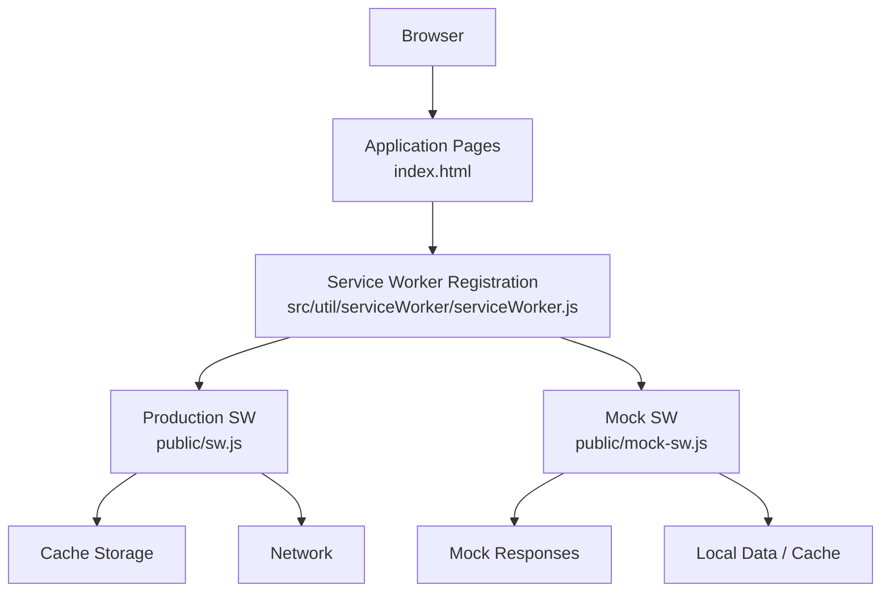
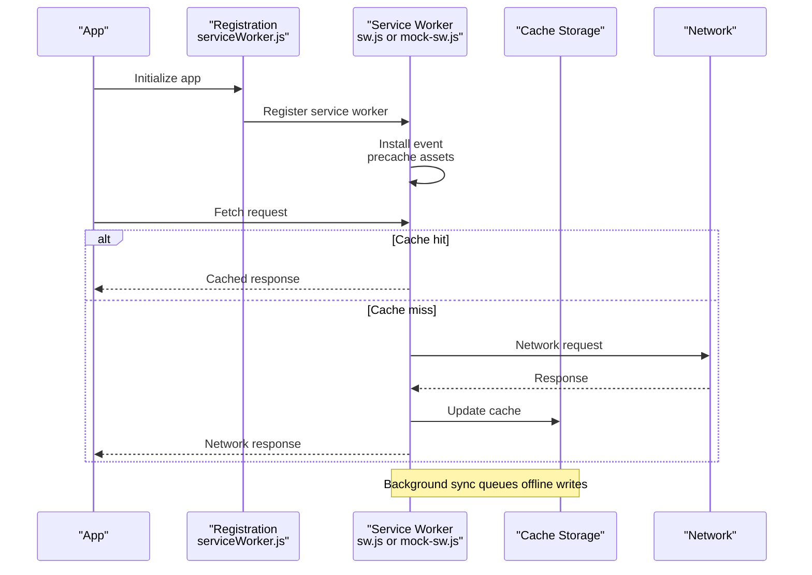
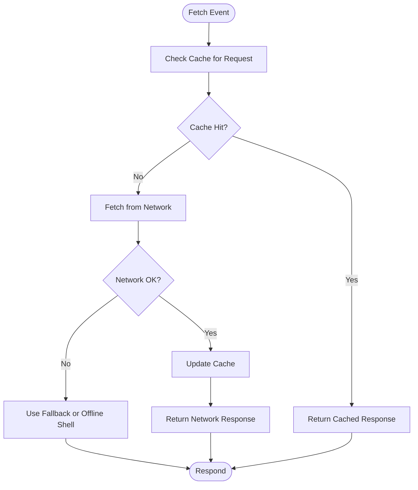
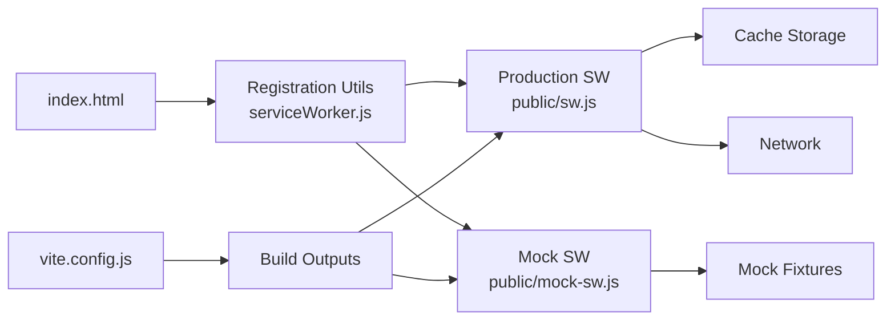

# Service Worker & Offline Architecture

<cite>
**Referenced Files in This Document**
- [public/sw.js](file://public/sw.js)
- [public/mock-sw.js](file://public/mock-sw.js)
- [src/util/serviceWorker/serviceWorker.js](file://src/util/serviceWorker/serviceWorker.js)
- [src/util/serviceWorker/README.md](file://src/util/serviceWorker/README.md)
- [src/util/sw.js](file://src/util/sw.js)
- [index.html](file://index.html)
- [vite.config.js](file://vite.config.js)
</cite>

## Table of Contents
1. [Introduction](#introduction)
2. [Project Structure](#project-structure)
3. [Core Components](#core-components)
4. [Architecture Overview](#architecture-overview)
5. [Detailed Component Analysis](#detailed-component-analysis)
6. [Dependency Analysis](#dependency-analysis)
7. [Performance Considerations](#performance-considerations)
8. [Troubleshooting Guide](#troubleshooting-guide)
9. [Conclusion](#conclusion)
10. [Appendices](#appendices)

## Introduction
This document explains the offline-first architecture and service worker implementation for the application. It covers the service worker lifecycle, caching strategies, background synchronization mechanisms, network request interception, cache invalidation policies, offline data queue management, performance optimizations, error handling, and guidance for extending functionality and debugging offline behavior. It also clarifies the differences between production and mock service workers and when each is used.

## Project Structure
The project organizes service worker assets and utilities across dedicated locations:
- Production service worker asset: public/sw.js
- Mock service worker asset: public/mock-sw.js
- Client-side registration and utility helpers: src/util/serviceWorker/serviceWorker.js and src/util/serviceWorker/README.md
- Legacy or alternate SW helper: src/util/sw.js
- Application entry points that may register the service worker: index.html and related HTML files
- Build configuration influencing service worker behavior: vite.config.js

**Diagram sources**
- [index.html](file://index.html)
- [src/util/serviceWorker/serviceWorker.js](file://src/util/serviceWorker/serviceWorker.js)
- [public/sw.js](file://public/sw.js)
- [public/mock-sw.js](file://public/mock-sw.js)

**Section sources**
- [index.html](file://index.html)
- [src/util/serviceWorker/serviceWorker.js](file://src/util/serviceWorker/serviceWorker.js)
- [public/sw.js](file://public/sw.js)
- [public/mock-sw.js](file://public/mock-sw.js)
- [src/util/sw.js](file://src/util/sw.js)
- [vite.config.js](file://vite.config.js)

## Core Components
- Production service worker (public/sw.js): Implements runtime caching, navigation fallbacks, background sync, and cache invalidation policies for a robust offline-first experience.
- Mock service worker (public/mock-sw.js): Provides deterministic responses for development and testing without relying on live networks.
- Client-side registration and utilities (src/util/serviceWorker/serviceWorker.js): Registers the appropriate service worker, exposes APIs to interact with caches, and manages background sync tasks.
- Alternate SW helper (src/util/sw.js): Contains legacy or auxiliary logic for service worker interactions.

Key responsibilities:
- Intercept fetch events and respond from cache when available, falling back to network otherwise.
- Preload critical resources during install to improve cold start performance.
- Queue outbound requests when offline and synchronize them later using Background Sync.
- Invalidate stale caches based on versioning or TTL policies.
- Provide consistent offline UX via navigation fallbacks.

**Section sources**
- [public/sw.js](file://public/sw.js)
- [public/mock-sw.js](file://public/mock-sw.js)
- [src/util/serviceWorker/serviceWorker.js](file://src/util/serviceWorker/serviceWorker.js)
- [src/util/serviceWorker/README.md](file://src/util/serviceWorker/README.md)
- [src/util/sw.js](file://src/util/sw.js)

## Architecture Overview
The offline-first architecture centers around a service worker that sits between the browser and the network. The client registers the service worker at startup. Depending on environment, either the production or mock service worker is activated. The production SW implements caching and background sync; the mock SW returns predefined responses for repeatable tests.

**Diagram sources**
- [src/util/serviceWorker/serviceWorker.js](file://src/util/serviceWorker/serviceWorker.js)
- [public/sw.js](file://public/sw.js)
- [public/mock-sw.js](file://public/mock-sw.js)

## Detailed Component Analysis

### Production Service Worker (public/sw.js)
Responsibilities:
- Lifecycle hooks: install, activate, fetch, message, sync.
- Precaching static assets during install for fast offline loads.
- Runtime caching strategies for API calls and media assets.
- Navigation fallback to an offline shell page.
- Cache versioning and cleanup on activation.
- Background sync to retry failed writes when connectivity returns.

Caching strategies:
- Stale-while-revalidate for frequently changing resources.
- Cache-first for static assets.
- Network-first for authoritative data with short TTL.

Cache invalidation:
- Versioned cache names to ensure atomic updates.
- Delete old caches during activation.
- Optional TTL-based invalidation for API responses.

Background synchronization:
- Queue outbound mutations when offline.
- Retry with exponential backoff upon reconnect.
- Deduplicate identical requests to avoid redundant writes.

Error handling:
- Graceful fallbacks for missing cache entries.
- Return cached content when network fails.
- Log errors and surface user-friendly messages.

**Diagram sources**
- [public/sw.js](file://public/sw.js)

**Section sources**
- [public/sw.js](file://public/sw.js)

### Mock Service Worker (public/mock-sw.js)
Purpose:
- Provide deterministic responses for development and automated tests.
- Simulate network latency and failures to validate offline behavior.
- Serve local fixtures and mock endpoints without hitting the real backend.

Behavior:
- Intercepts specific routes and returns canned responses.
- Ignores or proxies other requests depending on configuration.
- Supports toggling failure modes and delays.

When to use:
- Local development and CI environments where network access is unreliable or undesirable.
- Testing edge cases like timeouts, partial responses, and server errors.

**Section sources**
- [public/mock-sw.js](file://public/mock-sw.js)

### Client-Side Registration and Utilities (src/util/serviceWorker/serviceWorker.js)
Responsibilities:
- Detect environment and register either production or mock service worker.
- Expose methods to update caches, clear caches, and trigger sync.
- Manage background sync task registration and retries.
- Notify UI about online/offline status and sync progress.

Integration points:
- Called early in application bootstrap to ensure SW is active before first navigation.
- Provides APIs consumed by views and components to enqueue operations for background sync.

**Section sources**
- [src/util/serviceWorker/serviceWorker.js](file://src/util/serviceWorker/serviceWorker.js)
- [src/util/serviceWorker/README.md](file://src/util/serviceWorker/README.md)

### Alternate SW Helper (src/util/sw.js)
Role:
- Contains legacy or auxiliary logic for service worker interactions.
- May provide compatibility shims or simplified APIs for older browsers.

Usage:
- Import only if required by existing code paths.
- Prefer modern registration utilities in new features.

**Section sources**
- [src/util/sw.js](file://src/util/sw.js)

### Entry Points and Configuration
- index.html: Bootstraps the application and may include initial registration logic or rely on the utility module to register the service worker.
- vite.config.js: Controls build outputs and can influence how service worker assets are served and versioned.

**Section sources**
- [index.html](file://index.html)
- [vite.config.js](file://vite.config.js)

## Dependency Analysis
The following diagram shows how the client interacts with the service worker and caches, and how the build configuration affects asset delivery.

**Diagram sources**
- [index.html](file://index.html)
- [src/util/serviceWorker/serviceWorker.js](file://src/util/serviceWorker/serviceWorker.js)
- [public/sw.js](file://public/sw.js)
- [public/mock-sw.js](file://public/mock-sw.js)
- [vite.config.js](file://vite.config.js)

**Section sources**
- [index.html](file://index.html)
- [src/util/serviceWorker/serviceWorker.js](file://src/util/serviceWorker/serviceWorker.js)
- [public/sw.js](file://public/sw.js)
- [public/mock-sw.js](file://public/mock-sw.js)
- [vite.config.js](file://vite.config.js)

## Performance Considerations
- Precache critical assets during install to reduce time-to-interactive on cold starts.
- Use cache-first for immutable static assets and stale-while-revalidate for dynamic content.
- Implement cache versioning to avoid mixed-content issues and enable atomic updates.
- Limit cache sizes and prune outdated entries to prevent storage bloat.
- Batch background sync operations to minimize network overhead.
- Avoid large payloads in cache; prefer pagination and incremental updates.
- Use HTTP caching headers alongside service worker caching for optimal performance.

[No sources needed since this section provides general guidance]

## Troubleshooting Guide
Common issues and resolutions:
- Service worker not updating: Clear caches and force reload; verify activation cleanup removes old caches.
- Stale data after deployment: Ensure cache keys include version hashes; invalidate caches on activation.
- Background sync not firing: Check browser support and permissions; confirm sync task registration and retry logic.
- Mock SW interfering in production: Verify environment detection logic to register the correct SW.
- Offline UX broken: Confirm navigation fallback is present and accessible in cache.

Debugging tips:
- Use browser DevTools to inspect service worker state, caches, and network requests.
- Add logging in fetch and sync handlers to trace decision paths.
- Test both online and offline scenarios, including simulated network failures.
- Validate cache contents and TTL behaviors under different conditions.

**Section sources**
- [public/sw.js](file://public/sw.js)
- [public/mock-sw.js](file://public/mock-sw.js)
- [src/util/serviceWorker/serviceWorker.js](file://src/util/serviceWorker/serviceWorker.js)

## Conclusion
The offline-first architecture leverages a production service worker for resilient caching, background synchronization, and graceful degradation, while a mock service worker enables reliable development and testing. By combining intelligent caching strategies, cache invalidation policies, and robust error handling, the application delivers a consistent offline experience. Extending functionality involves adding new cache strategies, refining sync queues, and ensuring proper lifecycle management.

[No sources needed since this section summarizes without analyzing specific files]

## Appendices

### Extending Service Worker Functionality
- Add new precached assets during install for faster load times.
- Introduce additional runtime caching strategies per route pattern.
- Enhance background sync with priority queues and deduplication.
- Implement feature flags to toggle caching behaviors at runtime.

### Debugging Offline Behavior
- Inspect service worker installation and activation logs.
- Monitor cache growth and eviction patterns.
- Simulate various network conditions to validate fallbacks.
- Use console messaging from the service worker to correlate UI actions with SW decisions.

[No sources needed since this section provides general guidance]