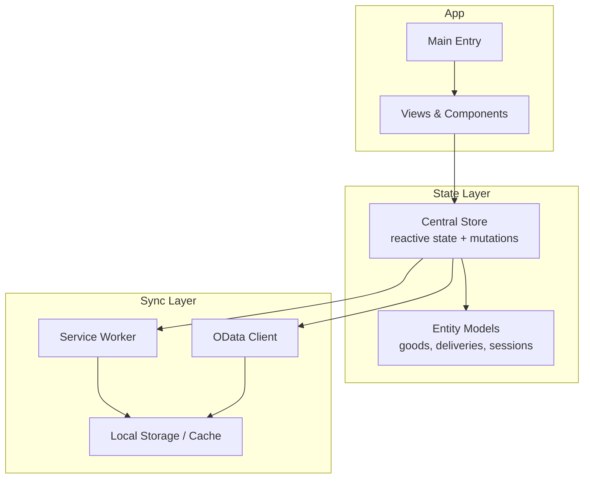
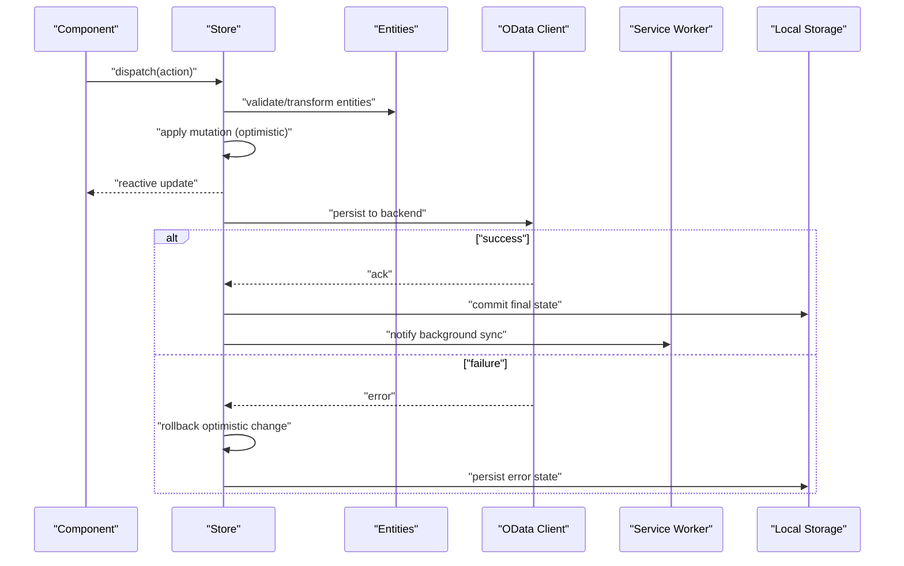
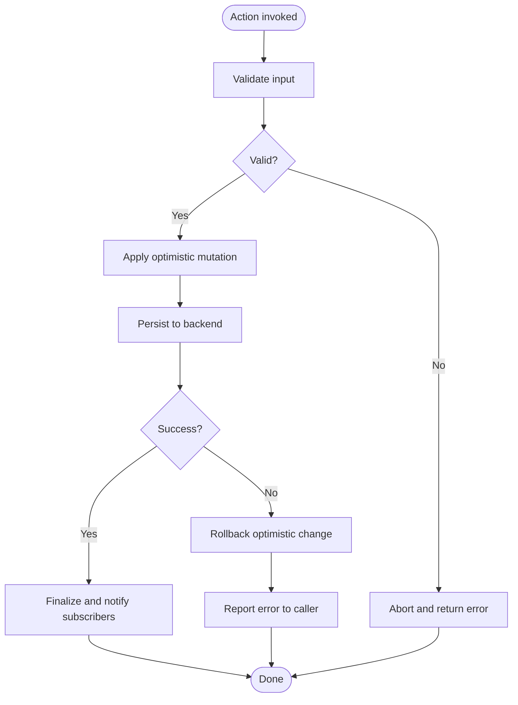
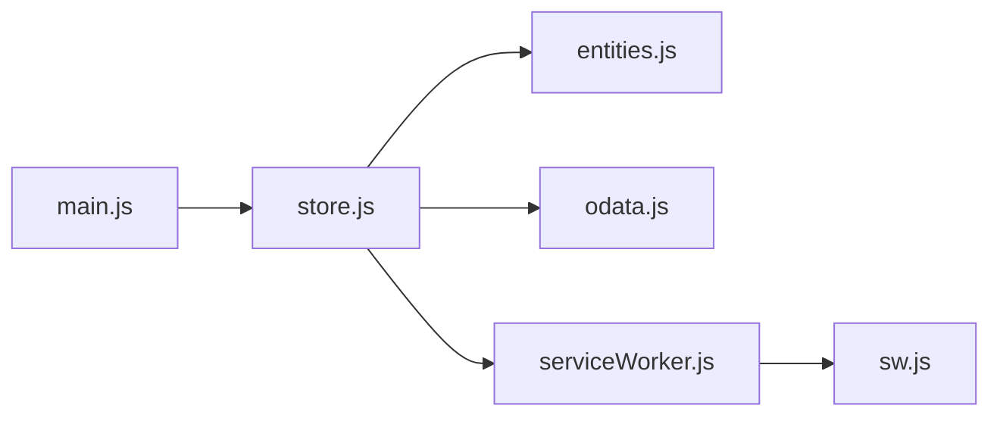

# State Management Architecture

<cite>
**Referenced Files in This Document**
- [store.js](file://src/util/store.js)
- [entities.js](file://src/util/entities.js)
- [serviceWorker.js](file://src/util/serviceWorker/serviceWorker.js)
- [sw.js](file://public/sw.js)
- [main.js](file://src/main.js)
- [odata.js](file://src/util/odata.js)
</cite>

## Table of Contents
1. [Introduction](#introduction)
2. [Project Structure](#project-structure)
3. [Core Components](#core-components)
4. [Architecture Overview](#architecture-overview)
5. [Detailed Component Analysis](#detailed-component-analysis)
6. [Dependency Analysis](#dependency-analysis)
7. [Performance Considerations](#performance-considerations)
8. [Troubleshooting Guide](#troubleshooting-guide)
9. [Conclusion](#conclusion)

## Introduction

This document describes the centralized state management system used across the application. It explains how reactive data patterns are applied, how components communicate through shared state, and how state is persisted locally and synchronized with backend services. It also covers entity models, optimistic updates, conflict resolution, and integration with service workers for offline support and background synchronization.

## Project Structure

The state management layer is implemented under src/util and integrates with views and components via reactive stores and computed properties. Key areas include:
- Centralized store and reactivity utilities
- Entity definitions and domain modeling
- Data synchronization helpers (e.g., OData client)
- Service worker registration and lifecycle hooks for persistence and sync

[No sources needed since this diagram shows conceptual workflow, not actual code structure]

## Core Components

- Central Store: Provides a single source of truth using reactive primitives. Exposes getters (computed), actions (mutations), and subscriptions for cross-component communication.
- Entity Models: Typed structures representing business domains such as goods, deliveries, and user sessions. These models define relationships and validation rules.
- Sync Utilities: Helpers for reading/writing to local storage and coordinating with the service worker for background tasks.
- Backend Integration: A thin client over OData endpoints for CRUD operations, retries, and conflict handling.

Key responsibilities:
- Reactive state updates and derived values
- Cross-component eventing via store subscriptions
- Persistence to local storage
- Optimistic UI updates with rollback on failure
- Conflict detection and resolution strategies
- Background sync via service worker

**Section sources**
- [store.js:1-200](file://src/util/store.js#L1-L200)
- [entities.js:1-200](file://src/util/entities.js#L1-L200)
- [odata.js:1-200](file://src/util/odata.js#L1-L200)
- [serviceWorker.js:1-200](file://src/util/serviceWorker/serviceWorker.js#L1-L200)
- [sw.js:1-200](file://public/sw.js#L1-L200)

## Architecture Overview

The system follows a unidirectional data flow:
- Components dispatch actions to the store
- Store applies mutations to update reactive state
- Derived state (getters/computed) reflects changes automatically
- Side effects (network calls, persistence) run within actions or watchers
- Service worker persists cache and performs background sync

**Diagram sources**
- [store.js:1-200](file://src/util/store.js#L1-L200)
- [odata.js:1-200](file://src/util/odata.js#L1-L200)
- [serviceWorker.js:1-200](file://src/util/serviceWorker/serviceWorker.js#L1-L200)
- [sw.js:1-200](file://public/sw.js#L1-L200)

## Detailed Component Analysis

### Central Store

Responsibilities:
- Maintain reactive state for all domains
- Provide actions for mutations and side effects
- Expose computed getters for derived data
- Subscribe/unsubscribe listeners for cross-component updates
- Coordinate persistence and sync

Patterns:
- Use reactive objects for state
- Encapsulate mutations inside actions
- Derive read-only views via computed/getters
- Implement optimistic updates with rollback paths
- Emit events or use subscribers for cross-component communication

Example flows:
- Create an entity: validate -> optimistic update -> persist -> finalize or rollback
- Read-only queries: filter/sort via computed getters without mutating state
- Cross-component updates: subscribe to specific slices of state

**Section sources**
- [store.js:1-200](file://src/util/store.js#L1-L200)

### Entity Models

Domains:
- Goods: product identifiers, attributes, inventory counts, timestamps
- Deliveries: shipment metadata, items, status, routing info
- User Sessions: authentication tokens, preferences, last-sync time

Relationships:
- Delivery contains multiple Goods
- Session references current user context and last known server version for conflict resolution

Validation:
- Required fields, type checks, referential integrity between entities

Normalization:
- Prefer normalized structures to avoid duplication and simplify updates

**Section sources**
- [entities.js:1-200](file://src/util/entities.js#L1-L200)

### Data Synchronization (OData)

Capabilities:
- CRUD operations against OData endpoints
- Query composition (filter, select, expand)
- Pagination and incremental sync
- Retry with exponential backoff
- Conflict detection via server versions or timestamps

Conflict Resolution Strategies:
- Last-write-wins with server authority
- Field-level merge where applicable
- Queue local changes and reconcile after successful sync

**Section sources**
- [odata.js:1-200](file://src/util/odata.js#L1-L200)

### Service Worker Integration

Roles:
- Register and manage lifecycle (install, activate, fetch, message)
- Persist critical state to durable caches
- Perform background sync when online
- Intercept requests to serve cached responses when offline

Offline Strategy:
- Cache-first for reads
- Network-first for writes with queued retries
- Stale-while-revalidate for frequently changing data

Background Sync:
- Queue failed mutations and retry on connectivity
- Notify app of sync completion via messages

**Section sources**
- [serviceWorker.js:1-200](file://src/util/serviceWorker/serviceWorker.js#L1-L200)
- [sw.js:1-200](file://public/sw.js#L1-L200)

### Example Workflows

#### State Mutation Flow (Optimistic Update)

**Diagram sources**
- [store.js:1-200](file://src/util/store.js#L1-L200)
- [odata.js:1-200](file://src/util/odata.js#L1-L200)

#### Computed Property Example
- Derived list of pending deliveries filtered by status and sorted by due date
- Aggregated totals for scanned goods grouped by delivery

**Section sources**
- [store.js:1-200](file://src/util/store.js#L1-L200)

#### Cross-Component Communication
- Components subscribe to store slices
- Actions emit notifications for UI updates
- Dialogs and toasts react to store changes

**Section sources**
- [store.js:1-200](file://src/util/store.js#L1-L200)

## Dependency Analysis

**Diagram sources**
- [main.js:1-200](file://src/main.js#L1-L200)
- [store.js:1-200](file://src/util/store.js#L1-L200)
- [entities.js:1-200](file://src/util/entities.js#L1-L200)
- [odata.js:1-200](file://src/util/odata.js#L1-L200)
- [serviceWorker.js:1-200](file://src/util/serviceWorker/serviceWorker.js#L1-L200)
- [sw.js:1-200](file://public/sw.js#L1-L200)

**Section sources**
- [main.js:1-200](file://src/main.js#L1-L200)
- [store.js:1-200](file://src/util/store.js#L1-L200)
- [entities.js:1-200](file://src/util/entities.js#L1-L200)
- [odata.js:1-200](file://src/util/odata.js#L1-L200)
- [serviceWorker.js:1-200](file://src/util/serviceWorker/serviceWorker.js#L1-L200)
- [sw.js:1-200](file://public/sw.js#L1-L200)

## Performance Considerations

- Normalize entities to reduce duplication and improve update locality
- Use computed getters for expensive derivations; memoize where possible
- Batch mutations to minimize reactivity churn
- Debounce frequent inputs before dispatching actions
- Limit subscription scopes to relevant state slices
- Prefer pagination and incremental sync for large datasets
- Cache aggressively for read-heavy flows; invalidate on write

[No sources needed since this section provides general guidance]

## Troubleshooting Guide

Common issues and resolutions:
- Stale UI after network failure: ensure rollback logic runs and subscribers are notified
- Duplicate entries: verify normalization keys and idempotent mutations
- Sync conflicts: inspect server version/timestamp fields and apply merge strategy
- Offline writes failing silently: check queue and retry policies in service worker
- Memory leaks: unsubscribe listeners on component teardown

Operational tips:
- Log action payloads and results around mutations
- Add metrics for sync success/failure rates
- Use feature flags to toggle optimistic updates during rollout

**Section sources**
- [store.js:1-200](file://src/util/store.js#L1-L200)
- [odata.js:1-200](file://src/util/odata.js#L1-L200)
- [serviceWorker.js:1-200](file://src/util/serviceWorker/serviceWorker.js#L1-L200)
- [sw.js:1-200](file://public/sw.js#L1-L200)

## Conclusion

The centralized state management system leverages reactive patterns to deliver consistent, up-to-date UI while supporting offline-first workflows. By combining normalized entity models, optimistic updates, robust conflict resolution, and service worker-backed persistence, the application achieves resilience and performance at scale.

[No sources needed since this section summarizes without analyzing specific files]