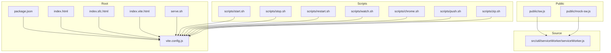
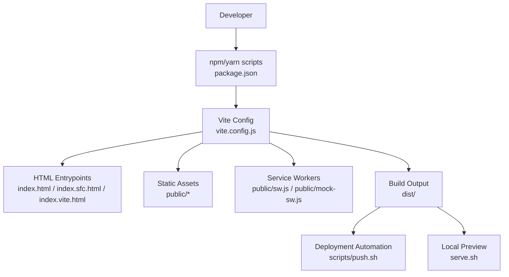
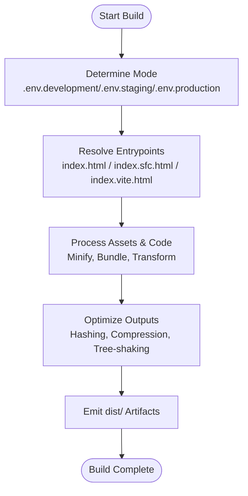
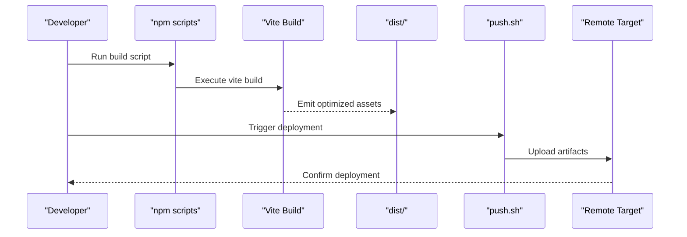
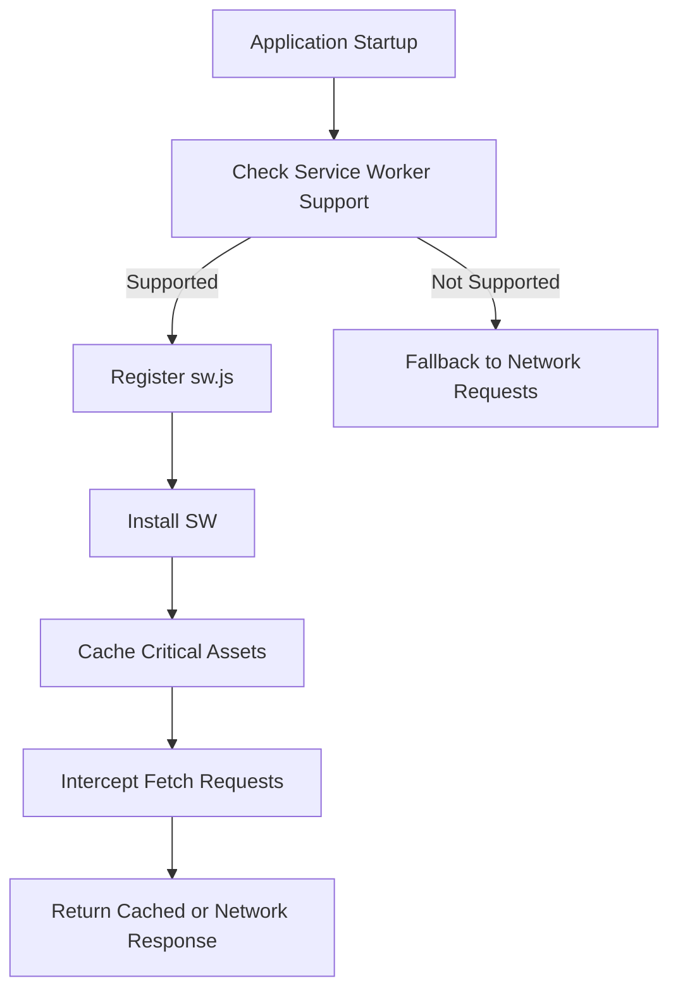
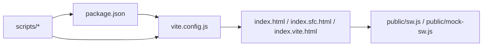

# Build and Deployment

<cite>
**Referenced Files in This Document**
- [vite.config.js](file://vite.config.js)
- [package.json](file://package.json)
- [index.html](file://index.html)
- [index.sfc.html](file://index.sfc.html)
- [index.vite.html](file://index.vite.html)
- [scripts/start.sh](file://scripts/start.sh)
- [scripts/stop.sh](file://scripts/stop.sh)
- [scripts/restart.sh](file://scripts/restart.sh)
- [scripts/watch.sh](file://scripts/watch.sh)
- [scripts/chrome.sh](file://scripts/chrome.sh)
- [scripts/push.sh](file://scripts/push.sh)
- [scripts/zip.sh](file://scripts/zip.sh)
- [serve.sh](file://serve.sh)
- [public/sw.js](file://public/sw.js)
- [public/mock-sw.js](file://public/mock-sw.js)
- [src/util/serviceWorker/serviceWorker.js](file://src/util/serviceWorker/serviceWorker.js)
</cite>

## Table of Contents
1. [Introduction](#introduction)
2. [Project Structure](#project-structure)
3. [Core Components](#core-components)
4. [Architecture Overview](#architecture-overview)
5. [Detailed Component Analysis](#detailed-component-analysis)
6. [Dependency Analysis](#dependency-analysis)
7. [Performance Considerations](#performance-considerations)
8. [Troubleshooting Guide](#troubleshooting-guide)
9. [Conclusion](#conclusion)
10. [Appendices](#appendices)

## Introduction
This document provides comprehensive build and deployment guidance for the project, focusing on Vite configuration, build targets and output formats, environment-specific settings, deployment automation, CI/CD setup, versioning and release management, performance optimization (bundle analysis, code splitting, asset compression), security considerations for production, and monitoring setup. It is intended for developers and operators who need to build, optimize, and deploy the application reliably across environments.

## Project Structure
The repository follows a standard Vite-based structure with:
- A root Vite configuration file that defines build behavior and optimizations.
- Multiple HTML entry points for different modes (standard, SFC bootstrap, and Vite preview).
- Shell scripts for local development, packaging, and deployment tasks.
- Public assets including service worker files.
- Source code organized by features and utilities.

**Diagram sources**
- [vite.config.js](file://vite.config.js)
- [package.json](file://package.json)
- [index.html](file://index.html)
- [index.sfc.html](file://index.sfc.html)
- [index.vite.html](file://index.vite.html)
- [serve.sh](file://serve.sh)
- [scripts/start.sh](file://scripts/start.sh)
- [scripts/stop.sh](file://scripts/stop.sh)
- [scripts/restart.sh](file://scripts/restart.sh)
- [scripts/watch.sh](file://scripts/watch.sh)
- [scripts/chrome.sh](file://scripts/chrome.sh)
- [scripts/push.sh](file://scripts/push.sh)
- [scripts/zip.sh](file://scripts/zip.sh)
- [public/sw.js](file://public/sw.js)
- [public/mock-sw.js](file://public/mock-sw.js)
- [src/util/serviceWorker/serviceWorker.js](file://src/util/serviceWorker/serviceWorker.js)

**Section sources**
- [vite.config.js](file://vite.config.js)
- [package.json](file://package.json)
- [index.html](file://index.html)
- [index.sfc.html](file://index.sfc.html)
- [index.vite.html](file://index.vite.html)
- [serve.sh](file://serve.sh)
- [scripts/start.sh](file://scripts/start.sh)
- [scripts/stop.sh](file://scripts/stop.sh)
- [scripts/restart.sh](file://scripts/restart.sh)
- [scripts/watch.sh](file://scripts/watch.sh)
- [scripts/chrome.sh](file://scripts/chrome.sh)
- [scripts/push.sh](file://scripts/push.sh)
- [scripts/zip.sh](file://scripts/zip.sh)
- [public/sw.js](file://public/sw.js)
- [public/mock-sw.js](file://public/mock-sw.js)
- [src/util/serviceWorker/serviceWorker.js](file://src/util/serviceWorker/serviceWorker.js)

## Core Components
- Vite Configuration: Centralizes build options, plugins, environment variables, and output behavior.
- Entry Points: Multiple HTML files support different runtime modes (standard, SFC bootstrap, Vite preview).
- Scripts: Local dev server, watch mode, browser launch helpers, packaging, and deployment automation.
- Service Workers: Static and mock service workers for caching strategies and offline capabilities.

Key responsibilities:
- Define build targets, minification, sourcemaps, and asset handling.
- Provide environment-specific overrides via .env files and CLI flags.
- Automate common workflows through shell scripts.
- Integrate service workers for improved performance and resilience.

**Section sources**
- [vite.config.js](file://vite.config.js)
- [index.html](file://index.html)
- [index.sfc.html](file://index.sfc.html)
- [index.vite.html](file://index.vite.html)
- [scripts/start.sh](file://scripts/start.sh)
- [scripts/watch.sh](file://scripts/watch.sh)
- [scripts/chrome.sh](file://scripts/chrome.sh)
- [scripts/zip.sh](file://scripts/zip.sh)
- [scripts/push.sh](file://scripts/push.sh)
- [public/sw.js](file://public/sw.js)
- [public/mock-sw.js](file://public/mock-sw.js)
- [src/util/serviceWorker/serviceWorker.js](file://src/util/serviceWorker/serviceWorker.js)

## Architecture Overview
The build and deployment architecture centers around Vite as the bundler and optimizer, with shell scripts orchestrating local development and deployment tasks. The service workers enhance runtime performance and reliability.

**Diagram sources**
- [package.json](file://package.json)
- [vite.config.js](file://vite.config.js)
- [index.html](file://index.html)
- [index.sfc.html](file://index.sfc.html)
- [index.vite.html](file://index.vite.html)
- [public/sw.js](file://public/sw.js)
- [public/mock-sw.js](file://public/mock-sw.js)
- [scripts/push.sh](file://scripts/push.sh)
- [serve.sh](file://serve.sh)

## Detailed Component Analysis

### Vite Configuration and Build Targets
- Build targets and format:
  - Configure target browsers and module formats to balance compatibility and performance.
  - Use library mode if distributing reusable modules; otherwise use app mode for single-page apps.
- Environment-specific settings:
  - Load .env files based on mode (development, staging, production).
  - Expose process.env-like variables to the client via import.meta.env.
- Asset handling:
  - Inline small assets (images, icons) to reduce requests.
  - Hash filenames for cache busting and long-term caching.
- Minification and sourcemaps:
  - Enable minification in production builds.
  - Generate sourcemaps for debugging in production when needed.
- Plugins and extensions:
  - Add plugins for Vue SFC, TypeScript, or other frameworks as required.
  - Integrate bundle analysis plugin for size insights.

**Diagram sources**
- [vite.config.js](file://vite.config.js)
- [index.html](file://index.html)
- [index.sfc.html](file://index.sfc.html)
- [index.vite.html](file://index.vite.html)

**Section sources**
- [vite.config.js](file://vite.config.js)
- [index.html](file://index.html)
- [index.sfc.html](file://index.sfc.html)
- [index.vite.html](file://index.vite.html)

### Environment Variables and Runtime Configuration
- Development vs Production:
  - Use .env.development for local defaults.
  - Use .env.production for production defaults.
  - Override per-environment using .env.[mode] files.
- Client access:
  - Access variables via import.meta.env.VITE_*.
  - Avoid exposing secrets; only expose safe values.
- Example usage patterns:
  - API base URLs, feature flags, analytics keys.

**Section sources**
- [vite.config.js](file://vite.config.js)

### Build Scripts and Automation
- Local development:
  - Start dev server with hot reload.
  - Launch browser automatically for quick iteration.
- Packaging:
  - Create distributable archives for distribution.
- Deployment:
  - Push built artifacts to remote servers or storage.
- Preview:
  - Serve static output locally for verification.

**Diagram sources**
- [package.json](file://package.json)
- [vite.config.js](file://vite.config.js)
- [scripts/push.sh](file://scripts/push.sh)

**Section sources**
- [scripts/start.sh](file://scripts/start.sh)
- [scripts/stop.sh](file://scripts/stop.sh)
- [scripts/restart.sh](file://scripts/restart.sh)
- [scripts/watch.sh](file://scripts/watch.sh)
- [scripts/chrome.sh](file://scripts/chrome.sh)
- [scripts/zip.sh](file://scripts/zip.sh)
- [scripts/push.sh](file://scripts/push.sh)
- [serve.sh](file://serve.sh)
- [package.json](file://package.json)

### Service Worker Integration
- Purpose:
  - Cache critical assets for faster load times and offline availability.
  - Improve resilience under poor network conditions.
- Files:
  - Static service worker for production.
  - Mock service worker for development/testing.
- Registration:
  - Register from application entry or utility module.

**Diagram sources**
- [public/sw.js](file://public/sw.js)
- [public/mock-sw.js](file://public/mock-sw.js)
- [src/util/serviceWorker/serviceWorker.js](file://src/util/serviceWorker/serviceWorker.js)

**Section sources**
- [public/sw.js](file://public/sw.js)
- [public/mock-sw.js](file://public/mock-sw.js)
- [src/util/serviceWorker/serviceWorker.js](file://src/util/serviceWorker/serviceWorker.js)

## Dependency Analysis
- Internal dependencies:
  - HTML entrypoints depend on Vite configuration for processing.
  - Scripts orchestrate Vite commands and post-build actions.
- External dependencies:
  - Node.js runtime and package manager.
  - Optional tools for deployment (e.g., SSH, SCP, rsync) invoked by push.sh.

**Diagram sources**
- [package.json](file://package.json)
- [vite.config.js](file://vite.config.js)
- [index.html](file://index.html)
- [index.sfc.html](file://index.sfc.html)
- [index.vite.html](file://index.vite.html)
- [public/sw.js](file://public/sw.js)
- [public/mock-sw.js](file://public/mock-sw.js)
- [scripts/start.sh](file://scripts/start.sh)
- [scripts/stop.sh](file://scripts/stop.sh)
- [scripts/restart.sh](file://scripts/restart.sh)
- [scripts/watch.sh](file://scripts/watch.sh)
- [scripts/chrome.sh](file://scripts/chrome.sh)
- [scripts/zip.sh](file://scripts/zip.sh)
- [scripts/push.sh](file://scripts/push.sh)

**Section sources**
- [package.json](file://package.json)
- [vite.config.js](file://vite.config.js)
- [index.html](file://index.html)
- [index.sfc.html](file://index.sfc.html)
- [index.vite.html](file://index.vite.html)
- [public/sw.js](file://public/sw.js)
- [public/mock-sw.js](file://public/mock-sw.js)
- [scripts/start.sh](file://scripts/start.sh)
- [scripts/stop.sh](file://scripts/stop.sh)
- [scripts/restart.sh](file://scripts/restart.sh)
- [scripts/watch.sh](file://scripts/watch.sh)
- [scripts/chrome.sh](file://scripts/chrome.sh)
- [scripts/zip.sh](file://scripts/zip.sh)
- [scripts/push.sh](file://scripts/push.sh)

## Performance Considerations
- Bundle analysis:
  - Integrate a bundle analyzer plugin to identify large dependencies and optimize imports.
- Code splitting:
  - Leverage dynamic imports to split routes and heavy components into separate chunks.
  - Ensure route-level lazy loading to reduce initial payload.
- Asset compression:
  - Enable gzip or Brotli compression at the web server level.
  - Configure Vite to compress outputs where applicable.
- Caching strategy:
  - Use hashed filenames for long-term caching.
  - Implement aggressive caching for static assets and rely on service workers for runtime caching.
- Image and font optimization:
  - Prefer modern formats (WebP, AVIF) and provide fallbacks.
  - Use responsive images and font-display strategies.

[No sources needed since this section provides general guidance]

## Troubleshooting Guide
- Build failures:
  - Verify Node.js version compatibility and reinstall dependencies if necessary.
  - Check environment variables and ensure required .env files exist.
- Missing assets:
  - Confirm asset paths are correct and referenced from the proper entrypoint.
  - Validate that public assets are copied correctly during build.
- Service worker issues:
  - Clear browser cache and unregister old service workers.
  - Use the mock service worker in development to isolate issues.
- Deployment problems:
  - Inspect push.sh logs for authentication or connectivity errors.
  - Validate permissions and target directory accessibility.

**Section sources**
- [scripts/push.sh](file://scripts/push.sh)
- [public/sw.js](file://public/sw.js)
- [public/mock-sw.js](file://public/mock-sw.js)

## Conclusion
This guide outlines how to configure Vite for optimal builds, manage environment-specific settings, automate deployment, and implement performance and security best practices. By following these recommendations, teams can achieve reliable, fast, and secure deployments across development, staging, and production environments.

[No sources needed since this section summarizes without analyzing specific files]

## Appendices

### CI/CD Pipeline Setup
- Stages:
  - Install dependencies.
  - Lint and test (if applicable).
  - Build with appropriate mode and environment variables.
  - Analyze bundle size.
  - Deploy artifacts to target environment.
- Secrets management:
  - Store sensitive variables in CI/CD secret stores.
  - Never commit secrets to the repository.
- Artifact retention:
  - Keep build artifacts for rollback and auditing.

[No sources needed since this section provides general guidance]

### Versioning and Release Management
- Semantic versioning:
  - Use MAJOR.MINOR.PATCH conventions.
- Tagging and changelogs:
  - Tag releases in Git and maintain a changelog.
- Rollback strategy:
  - Maintain previous versions and switch traffic back on failure.

[No sources needed since this section provides general guidance]

### Security Considerations for Production
- Content Security Policy:
  - Enforce strict CSP headers to mitigate XSS risks.
- HTTPS-only:
  - Require HTTPS and enforce HSTS.
- Secure headers:
  - Set X-Content-Type-Options, X-Frame-Options, Referrer-Policy.
- Dependency scanning:
  - Regularly audit dependencies for vulnerabilities.
- Least privilege:
  - Limit deployment credentials and restrict access to production resources.

[No sources needed since this section provides general guidance]

### Monitoring and Observability
- Frontend error tracking:
  - Integrate error reporting libraries and capture unhandled exceptions.
- Performance metrics:
  - Track Core Web Vitals and custom KPIs.
- Uptime and health checks:
  - Implement health endpoints and monitor availability.

[No sources needed since this section provides general guidance]