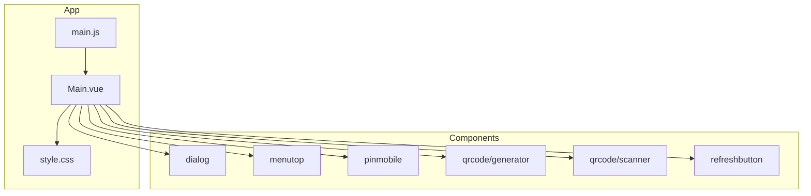
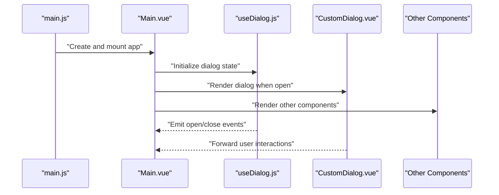
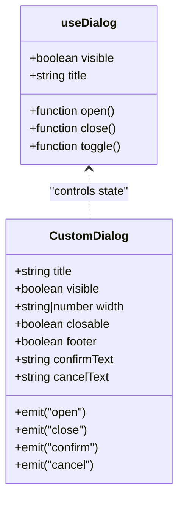
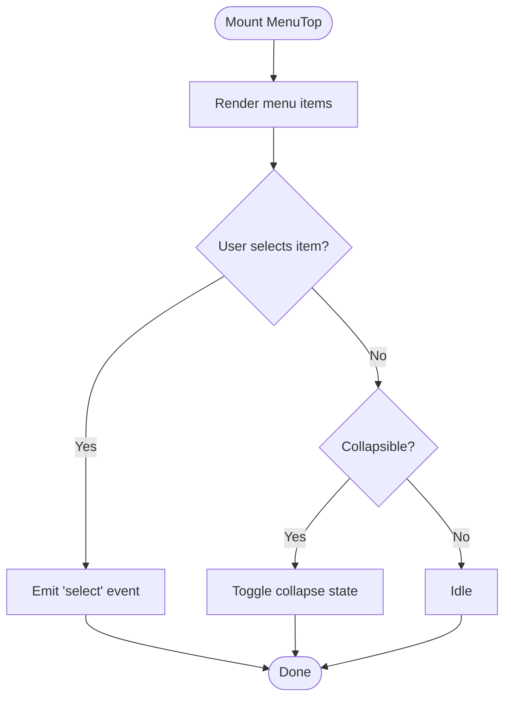
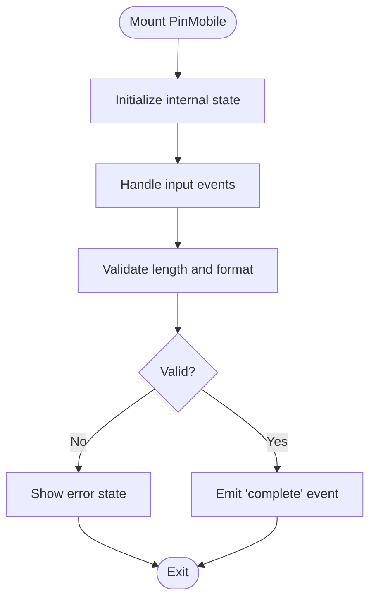
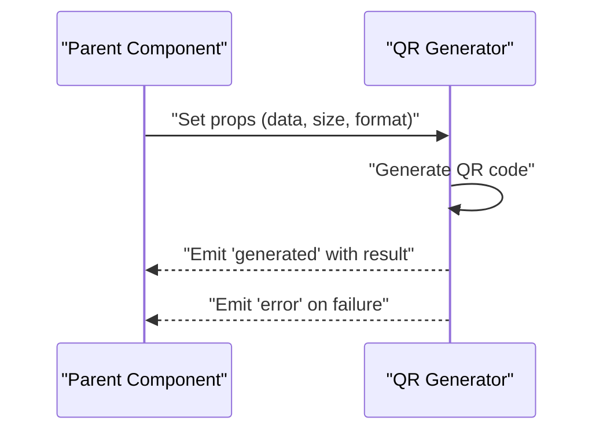
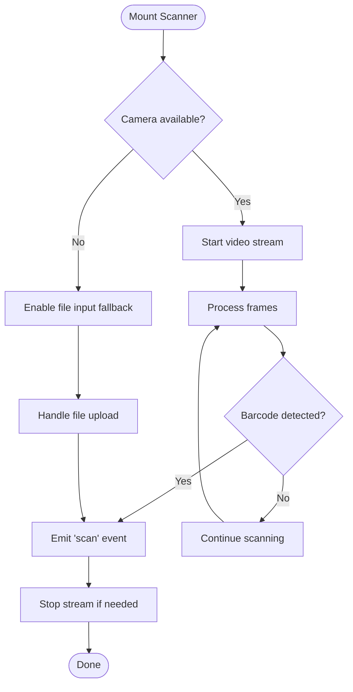
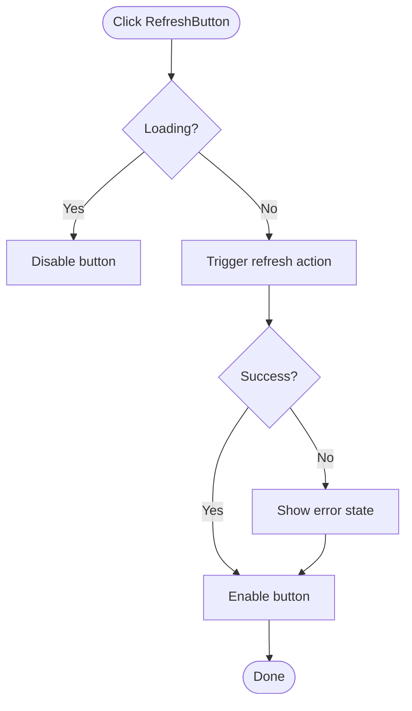
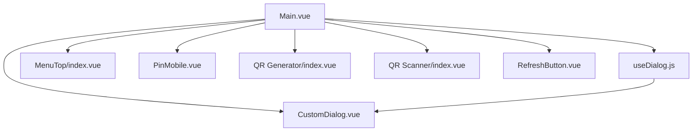

# Component Library

<cite>
**Referenced Files in This Document**
- [CustomDialog.vue](file://src/components/dialog/CustomDialog.vue)
- [useDialog.js](file://src/components/dialog/useDialog.js)
- [README.md](file://src/components/dialog/README.md)
- [index.vue](file://src/components/menutop/index.vue)
- [PinMobile.vue](file://src/components/pinmobile/PinMobile.vue)
- [README.md](file://src/components/pinmobile/README.md)
- [index.vue](file://src/components/qrcode/generator/index.vue)
- [index.vue](file://src/components/qrcode/scanner/index.vue)
- [RefreshButton.vue](file://src/components/refreshbutton/RefreshButton.vue)
- [README.md](file://src/components/refreshbutton/README.md)
- [Main.vue](file://src/Main.vue)
- [main.js](file://src/main.js)
- [style.css](file://src/style.css)
</cite>

## Table of Contents
1. [Introduction](#introduction)
2. [Project Structure](#project-structure)
3. [Core Components](#core-components)
4. [Architecture Overview](#architecture-overview)
5. [Detailed Component Analysis](#detailed-component-analysis)
6. [Dependency Analysis](#dependency-analysis)
7. [Performance Considerations](#performance-considerations)
8. [Troubleshooting Guide](#troubleshooting-guide)
9. [Conclusion](#conclusion)
10. [Appendices](#appendices)

## Introduction
This document describes the reusable component library implemented in this project. It focuses on the UI components under src/components, their APIs (props, events, slots), configuration options, lifecycle behavior, styling customization, accessibility considerations, and best practices for composition and extension. It also provides guidance for responsive design and cross-browser compatibility.

The library includes:
- Dialog management with a composable hook
- A top menu bar component
- A PIN entry mobile input component
- QR code generator and scanner components
- A refresh button component

These components are designed to be lightweight, composable, and easy to integrate into Vue 3 applications.

## Project Structure
The component library is organized by feature directories under src/components. Each component typically includes its implementation file and an optional README describing usage and configuration.

**Diagram sources**
- [Main.vue](file://src/Main.vue)
- [main.js](file://src/main.js)
- [style.css](file://src/style.css)
- [CustomDialog.vue](file://src/components/dialog/CustomDialog.vue)
- [useDialog.js](file://src/components/dialog/useDialog.js)
- [index.vue](file://src/components/menutop/index.vue)
- [PinMobile.vue](file://src/components/pinmobile/PinMobile.vue)
- [index.vue](file://src/components/qrcode/generator/index.vue)
- [index.vue](file://src/components/qrcode/scanner/index.vue)
- [RefreshButton.vue](file://src/components/refreshbutton/RefreshButton.vue)

**Section sources**
- [Main.vue](file://src/Main.vue)
- [main.js](file://src/main.js)
- [style.css](file://src/style.css)

## Core Components
This section summarizes each component’s purpose and API surface. For detailed props, events, and slots, see the Detailed Component Analysis.

- Dialog: Provides modal dialog rendering and lifecycle via a composable hook.
- MenuTop: Renders a top-level navigation/menu area.
- PinMobile: Mobile-friendly numeric PIN input with validation and feedback.
- QR Code Generator: Generates QR codes from provided data.
- QR Code Scanner: Scans QR/barcodes using device camera or file input.
- RefreshButton: A simple action button to trigger refresh operations.

**Section sources**
- [CustomDialog.vue](file://src/components/dialog/CustomDialog.vue)
- [useDialog.js](file://src/components/dialog/useDialog.js)
- [README.md](file://src/components/dialog/README.md)
- [index.vue](file://src/components/menutop/index.vue)
- [PinMobile.vue](file://src/components/pinmobile/PinMobile.vue)
- [README.md](file://src/components/pinmobile/README.md)
- [index.vue](file://src/components/qrcode/generator/index.vue)
- [index.vue](file://src/components/qrcode/scanner/index.vue)
- [RefreshButton.vue](file://src/components/refreshbutton/RefreshButton.vue)
- [README.md](file://src/components/refreshbutton/README.md)

## Architecture Overview
The application bootstraps via main.js, mounts Main.vue, which composes the reusable components. Global styles are applied through style.css. The dialog system uses a composable pattern to manage state and lifecycle across components.

**Diagram sources**
- [main.js](file://src/main.js)
- [Main.vue](file://src/Main.vue)
- [useDialog.js](file://src/components/dialog/useDialog.js)
- [CustomDialog.vue](file://src/components/dialog/CustomDialog.vue)

## Detailed Component Analysis

### Dialog System (useDialog + CustomDialog)
The dialog system separates state management (composable) from presentation (component). This enables consistent dialog behavior across the app.

- Props (CustomDialog):
  - title: string
  - visible: boolean
  - width: string | number
  - closable: boolean
  - footer: boolean
  - confirmText: string
  - cancelText: string
- Events:
  - open
  - close
  - confirm
  - cancel
- Slots:
  - default: dialog body content
  - footer: custom footer actions
- Configuration Options:
  - backdropClickToClose: boolean
  - keyboardDismiss: boolean
  - focusTrap: boolean
- Lifecycle:
  - On open: trap focus, prevent background scroll
  - On close: restore focus, release scroll lock
- Accessibility:
  - role="dialog", aria-modal="true"
  - aria-labelledby bound to title slot
  - Escape key dismisses if enabled
  - Focus management on open/close
- Styling:
  - CSS variables for overlay opacity, border radius, spacing
  - Responsive width breakpoints based on viewport
- Composition Patterns:
  - Use useDialog composable to control visibility and actions
  - Compose multiple dialogs by managing separate states
- Extensibility:
  - Provide custom footer slot for complex actions
  - Override CSS variables for theme variants
  - Extend composable to add confirmation flows

**Diagram sources**
- [useDialog.js](file://src/components/dialog/useDialog.js)
- [CustomDialog.vue](file://src/components/dialog/CustomDialog.vue)

**Section sources**
- [useDialog.js](file://src/components/dialog/useDialog.js)
- [CustomDialog.vue](file://src/components/dialog/CustomDialog.vue)
- [README.md](file://src/components/dialog/README.md)

### MenuTop Component
A top-level menu/navigation component suitable for header areas.

- Props:
  - items: array of menu item objects
  - activeId: string | number
  - mode: "horizontal" | "vertical"
  - collapsible: boolean
- Events:
  - select(item)
  - collapse(state)
- Slots:
  - logo: brand/logo area
  - actions: right-side actions
  - item: custom item renderer
- Accessibility:
  - role="navigation"
  - aria-current for active item
  - Keyboard navigation with arrow keys
- Styling:
  - CSS variables for colors, spacing, typography
  - Responsive layout collapses to hamburger on small screens
- Composition:
  - Combine with router links for SPA navigation
  - Nest submenus via nested items structure

**Diagram sources**
- [index.vue](file://src/components/menutop/index.vue)

**Section sources**
- [index.vue](file://src/components/menutop/index.vue)

### PinMobile Component
A mobile-focused numeric PIN input with validation and feedback.

- Props:
  - length: number
  - value: string | number
  - placeholder: string
  - disabled: boolean
  - autofocus: boolean
  - mask: boolean
  - error: boolean
  - success: boolean
- Events:
  - input(value)
  - complete(value)
  - error(message)
- Slots:
  - prefix: icon before input
  - suffix: icon after input
  - error: custom error message
- Accessibility:
  - aria-label for screen readers
  - aria-invalid when error is true
  - Live region updates for completion status
- Styling:
  - CSS variables for input size, border color, focus ring
  - Large tap targets for mobile
- Validation:
  - Numeric-only input
  - Length-based completion
  - Error/success visual states
- Composition:
  - Integrate with forms or standalone flows
  - Pair with confirmation steps

**Diagram sources**
- [PinMobile.vue](file://src/components/pinmobile/PinMobile.vue)

**Section sources**
- [PinMobile.vue](file://src/components/pinmobile/PinMobile.vue)
- [README.md](file://src/components/pinmobile/README.md)

### QR Code Generator Component
Generates QR codes from provided data.

- Props:
  - data: string
  - size: number
  - color: string
  - bgColor: string
  - format: "svg" | "canvas" | "image"
  - margin: number
- Events:
  - generated(qrData)
  - error(message)
- Slots:
  - fallback: custom fallback UI when generation fails
- Accessibility:
  - alt text for image output
  - aria-live for dynamic updates
- Styling:
  - CSS variables for container padding and borders
  - Responsive sizing via props
- Performance:
  - Debounced regeneration on prop changes
  - Caching of generated QR data

**Diagram sources**
- [index.vue](file://src/components/qrcode/generator/index.vue)

**Section sources**
- [index.vue](file://src/components/qrcode/generator/index.vue)

### QR Code Scanner Component
Scans QR/barcodes using device camera or file upload.

- Props:
  - formats: array of supported formats
  - videoConstraints: object
  - showControls: boolean
  - onError: function
  - onScan: function
- Events:
  - scan(result)
  - error(message)
  - stop()
- Slots:
  - preview: custom video preview
  - controls: custom scanning controls
- Accessibility:
  - aria-labels for controls
  - Keyboard shortcuts for start/stop
- Browser Compatibility:
  - Requires HTTPS for camera access
  - Graceful fallback to file input when camera unavailable
- Performance:
  - Throttled frame processing
  - Early exit on successful scan

**Diagram sources**
- [index.vue](file://src/components/qrcode/scanner/index.vue)

**Section sources**
- [index.vue](file://src/components/qrcode/scanner/index.vue)

### RefreshButton Component
A simple action button to trigger refresh operations.

- Props:
  - loading: boolean
  - disabled: boolean
  - label: string
  - icon: string
  - variant: "primary" | "secondary" | "ghost"
- Events:
  - click(event)
- Slots:
  - default: custom content
  - spinner: custom loading indicator
- Accessibility:
  - aria-busy when loading
  - aria-disabled when disabled
  - Keyboard support with Enter/Space
- Styling:
  - CSS variables for colors, spacing, border radius
  - Hover/focus states for accessibility
- Composition:
  - Wrap async operations with loading state
  - Combine with retry logic patterns

**Diagram sources**
- [RefreshButton.vue](file://src/components/refreshbutton/RefreshButton.vue)

**Section sources**
- [RefreshButton.vue](file://src/components/refreshbutton/RefreshButton.vue)
- [README.md](file://src/components/refreshbutton/README.md)

## Dependency Analysis
The components have minimal external dependencies and rely on Vue 3 reactivity. The dialog system uses a composable pattern to share state without tight coupling.

**Diagram sources**
- [Main.vue](file://src/Main.vue)
- [CustomDialog.vue](file://src/components/dialog/CustomDialog.vue)
- [useDialog.js](file://src/components/dialog/useDialog.js)
- [index.vue](file://src/components/menutop/index.vue)
- [PinMobile.vue](file://src/components/pinmobile/PinMobile.vue)
- [index.vue](file://src/components/qrcode/generator/index.vue)
- [index.vue](file://src/components/qrcode/scanner/index.vue)
- [RefreshButton.vue](file://src/components/refreshbutton/RefreshButton.vue)

**Section sources**
- [Main.vue](file://src/Main.vue)
- [useDialog.js](file://src/components/dialog/useDialog.js)
- [CustomDialog.vue](file://src/components/dialog/CustomDialog.vue)
- [index.vue](file://src/components/menutop/index.vue)
- [PinMobile.vue](file://src/components/pinmobile/PinMobile.vue)
- [index.vue](file://src/components/qrcode/generator/index.vue)
- [index.vue](file://src/components/qrcode/scanner/index.vue)
- [RefreshButton.vue](file://src/components/refreshbutton/RefreshButton.vue)

## Performance Considerations
- Debounce heavy computations (e.g., QR generation) to avoid unnecessary recalculations.
- Throttle camera frame processing in the scanner to reduce CPU usage.
- Use lazy loading for non-critical components where possible.
- Prefer CSS variables for theming to minimize reflows.
- Avoid deep reactivity on large objects; use shallow refs when appropriate.

[No sources needed since this section provides general guidance]

## Troubleshooting Guide
Common issues and resolutions:
- Dialog not closing: Ensure the composable’s close method is called and that backdrop click and keyboard dismissal are enabled.
- Camera permission denied: Verify HTTPS context and prompt user to allow camera access.
- PIN input not completing: Check length prop and ensure numeric-only input is enforced.
- QR generation errors: Validate input data format and check browser capabilities for canvas/SVG.
- Refresh button stuck in loading: Confirm async operation completes and resets loading state.

**Section sources**
- [useDialog.js](file://src/components/dialog/useDialog.js)
- [CustomDialog.vue](file://src/components/dialog/CustomDialog.vue)
- [PinMobile.vue](file://src/components/pinmobile/PinMobile.vue)
- [index.vue](file://src/components/qrcode/generator/index.vue)
- [index.vue](file://src/components/qrcode/scanner/index.vue)
- [RefreshButton.vue](file://src/components/refreshbutton/RefreshButton.vue)

## Conclusion
The component library provides a cohesive set of reusable UI elements built with Vue 3. By following the documented APIs, composition patterns, and accessibility guidelines, teams can maintain consistency, improve productivity, and deliver accessible, responsive experiences across devices and browsers.

[No sources needed since this section summarizes without analyzing specific files]

## Appendices

### Styling Customization
- Use CSS variables exposed by components to override colors, spacing, and typography.
- Apply global overrides in style.css for consistent theming.
- Prefer utility classes over inline styles for maintainability.

**Section sources**
- [style.css](file://src/style.css)

### Responsive Design Guidelines
- Use flexible layouts and media queries to adapt to different screen sizes.
- Ensure touch targets meet minimum size requirements for mobile.
- Test components on various devices and orientations.

[No sources needed since this section provides general guidance]

### Cross-Browser Compatibility
- Verify camera APIs availability and provide fallbacks.
- Test SVG/canvas rendering differences across browsers.
- Use polyfills only when necessary and document dependencies.

[No sources needed since this section provides general guidance]