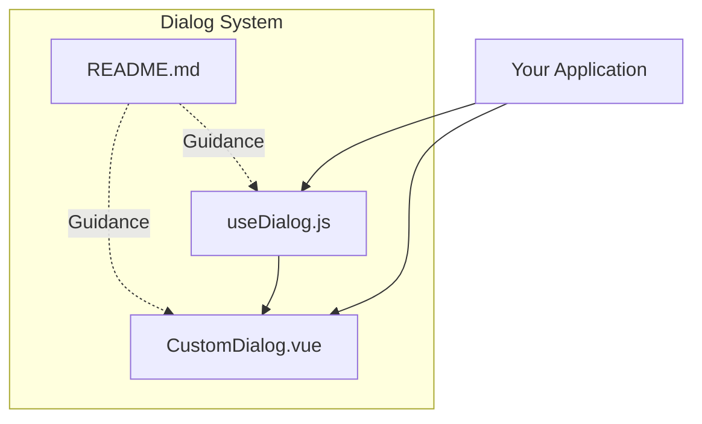
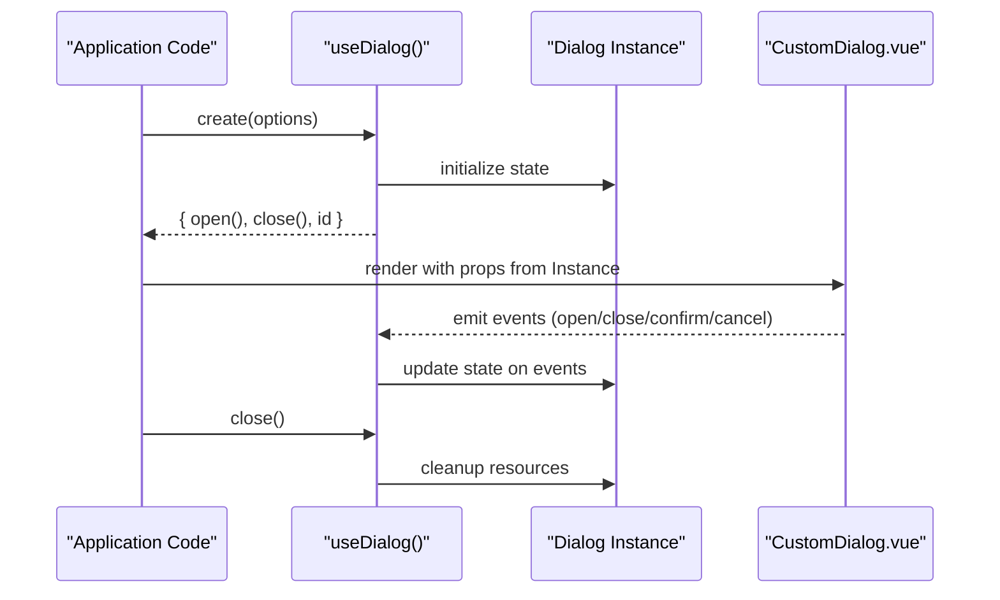
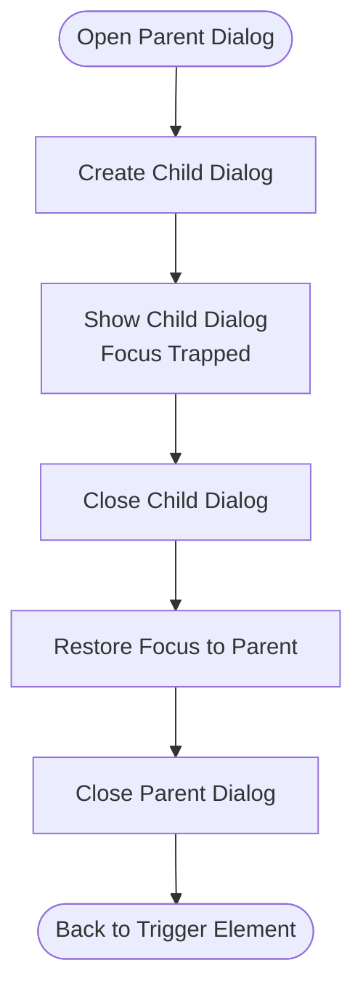
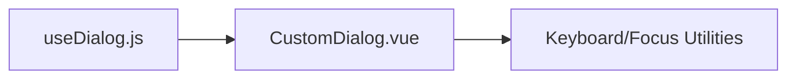

# Dialog System

<cite>
**Referenced Files in This Document**
- [CustomDialog.vue](file://src/components/dialog/CustomDialog.vue)
- [useDialog.js](file://src/components/dialog/useDialog.js)
- [README.md](file://src/components/dialog/README.md)
</cite>

## Table of Contents
1. [Introduction](#introduction)
2. [Project Structure](#project-structure)
3. [Core Components](#core-components)
4. [Architecture Overview](#architecture-overview)
5. [Detailed Component Analysis](#detailed-component-analysis)
6. [Dependency Analysis](#dependency-analysis)
7. [Performance Considerations](#performance-considerations)
8. [Troubleshooting Guide](#troubleshooting-guide)
9. [Conclusion](#conclusion)

## Introduction
This document describes the dialog system component, focusing on:
- CustomDialog Vue component: props, events, slots, and configuration options
- useDialog composable for programmatic dialog management
- Usage patterns for common dialog types (confirmation, alert, custom content)
- Lifecycle methods, positioning, styling customization
- Accessibility features including keyboard navigation and screen reader support
- Patterns for nested dialogs and stacking behavior

## Project Structure
The dialog system is implemented under src/components/dialog with a clear separation between UI (CustomDialog.vue) and programmatic API (useDialog.js). A README provides additional guidance.

**Diagram sources**
- [CustomDialog.vue](file://src/components/dialog/CustomDialog.vue)
- [useDialog.js](file://src/components/dialog/useDialog.js)
- [README.md](file://src/components/dialog/README.md)

**Section sources**
- [CustomDialog.vue](file://src/components/dialog/CustomDialog.vue)
- [useDialog.js](file://src/components/dialog/useDialog.js)
- [README.md](file://src/components/dialog/README.md)

## Core Components
- CustomDialog: The visual dialog component that renders modal overlays, handles focus trapping, keyboard interactions, and exposes slots for flexible content.
- useDialog: A composable that manages dialog state and lifecycle programmatically, enabling creation, opening, closing, and cleanup of dialogs without manual DOM manipulation.

Key responsibilities:
- CustomDialog: Rendering, accessibility attributes, event forwarding, slot composition, positioning, and styling hooks.
- useDialog: State management, instance tracking, z-index stacking, focus management coordination, and lifecycle callbacks.

**Section sources**
- [CustomDialog.vue](file://src/components/dialog/CustomDialog.vue)
- [useDialog.js](file://src/components/dialog/useDialog.js)

## Architecture Overview
The dialog system follows a composable-driven architecture where useDialog orchestrates dialog instances and CustomDialog renders each instance. This separation allows declarative usage via the component and imperative usage via the composable.

**Diagram sources**
- [useDialog.js](file://src/components/dialog/useDialog.js)
- [CustomDialog.vue](file://src/components/dialog/CustomDialog.vue)

## Detailed Component Analysis

### CustomDialog.vue
CustomDialog is the presentation layer for dialogs. It typically includes:
- Props for controlling visibility, title, actions, and layout
- Slots for header, body, footer, and custom content areas
- Events for user interactions such as confirm, cancel, and close
- Positioning and styling hooks to adapt to different contexts
- Accessibility attributes for screen readers and keyboard navigation

Common props (names may vary by implementation):
- visible or modelValue: controls dialog visibility
- title: sets the dialog heading text
- width, maxWidth: controls dialog size constraints
- position: alignment or placement strategy
- overlay: toggles backdrop presence
- closable: whether the user can dismiss via backdrop or escape key
- draggable: enables drag-to-move behavior
- zIndex: overrides default stacking order

Slots:
- header: custom header content
- default or body: main dialog content
- footer: action buttons or custom footer content

Events:
- open: emitted when the dialog becomes visible
- close: emitted when the dialog is dismissed
- confirm: emitted when a primary action is triggered
- cancel: emitted when a secondary action is triggered

Accessibility:
- aria-modal, role="dialog", aria-labelledby pointing to the title element
- Focus trap within the dialog while open
- Escape key closes the dialog if allowed
- Screen reader announcements for dynamic changes

Positioning and Styling:
- CSS classes or data attributes for theme and variant customization
- Inline styles or CSS variables for dynamic positioning
- Support for responsive layouts and mobile-friendly behaviors

Lifecycle integration:
- Mounted/unmounted hooks to manage focus and event listeners
- Watchers on props to react to visibility changes

**Section sources**
- [CustomDialog.vue](file://src/components/dialog/CustomDialog.vue)

### useDialog.js
useDialog provides a programmatic API to manage dialogs:
- create(options): returns an instance with open(), close(), and metadata
- open(): shows the dialog and focuses the first focusable element
- close(result?): hides the dialog and optionally passes a result
- destroy(): cleans up listeners and references

Options typically include:
- template or component: reference to the dialog component or template
- props: initial props passed to the dialog
- events: handlers for dialog events
- position: placement strategy
- zIndex: stacking order override
- onOpen/onClose: lifecycle callbacks

Stacking and nesting:
- Maintains a stack of active dialogs
- Automatically increments z-index for nested dialogs
- Ensures focus remains within the topmost dialog

Error handling:
- Guards against duplicate instances
- Safe cleanup on unmount to prevent memory leaks

**Section sources**
- [useDialog.js](file://src/components/dialog/useDialog.js)

### Usage Examples

#### Confirmation Dialog
Use cases:
- Ask users to confirm destructive actions
- Provide primary and secondary actions

Pattern:
- Create a dialog instance with useDialog
- Pass props for title, message, and action labels
- Handle confirm/cancel events to perform actions

**Section sources**
- [useDialog.js](file://src/components/dialog/useDialog.js)
- [CustomDialog.vue](file://src/components/dialog/CustomDialog.vue)

#### Alert Dialog
Use cases:
- Display important information to users
- Require acknowledgment before proceeding

Pattern:
- Create a dialog instance with useDialog
- Set closable to false if mandatory acknowledgment is required
- Use a single primary action button

**Section sources**
- [useDialog.js](file://src/components/dialog/useDialog.js)
- [CustomDialog.vue](file://src/components/dialog/CustomDialog.vue)

#### Custom Content Dialog
Use cases:
- Render complex forms, tables, or media inside a dialog
- Compose multiple components within the dialog body

Pattern:
- Use the default/body slot to inject custom content
- Bind form state and validation within the slot scope
- Emit confirm/cancel events based on user interactions

**Section sources**
- [CustomDialog.vue](file://src/components/dialog/CustomDialog.vue)

### Lifecycle Methods
- onOpen: invoked after the dialog becomes visible; useful for autofocus or analytics
- onClose: invoked before the dialog is hidden; useful for cleanup or confirmation prompts
- onDestroy: invoked after the dialog is removed; ensures resource release

These callbacks are provided through useDialog options and can be used to coordinate with other application logic.

**Section sources**
- [useDialog.js](file://src/components/dialog/useDialog.js)

### Positioning Options
- center: centers the dialog horizontally and vertically
- top/bottom/left/right: aligns the dialog to edges
- custom: applies explicit offsets or transforms
- responsive: adapts positioning based on viewport size

Positioning can be controlled via props or options passed to useDialog.create.

**Section sources**
- [CustomDialog.vue](file://src/components/dialog/CustomDialog.vue)
- [useDialog.js](file://src/components/dialog/useDialog.js)

### Styling Customization
- CSS classes: apply theme-specific classes to customize appearance
- CSS variables: override colors, spacing, and typography
- Inline styles: adjust width, height, and margins dynamically
- Slot-based composition: replace header/footer with branded content

**Section sources**
- [CustomDialog.vue](file://src/components/dialog/CustomDialog.vue)

### Accessibility Features
- Keyboard navigation:
  - Tab/Shift+Tab cycles focus within the dialog
  - Escape key closes the dialog when allowed
  - Arrow keys navigate within specialized widgets if present
- Screen reader support:
  - role="dialog" and aria-modal ensure proper announcement
  - aria-labelledby links to the dialog title
  - aria-describedby can describe dialog purpose
- Focus management:
  - Focus is trapped inside the dialog while open
  - Focus returns to the trigger element upon close

**Section sources**
- [CustomDialog.vue](file://src/components/dialog/CustomDialog.vue)

### Nested Dialogs and Stacking Behavior
- Nesting pattern:
  - Open a new dialog from within an existing one using useDialog.create
  - Ensure the parent dialog remains accessible but not interactive
- Stacking behavior:
  - Each new dialog increments z-index automatically
  - Focus is managed per-instance to keep the topmost dialog active
  - Closing a dialog restores focus to its opener

**Diagram sources**
- [useDialog.js](file://src/components/dialog/useDialog.js)
- [CustomDialog.vue](file://src/components/dialog/CustomDialog.vue)

**Section sources**
- [useDialog.js](file://src/components/dialog/useDialog.js)
- [CustomDialog.vue](file://src/components/dialog/CustomDialog.vue)

## Dependency Analysis
The dialog system has minimal external dependencies and emphasizes internal cohesion:
- useDialog depends on CustomDialog for rendering
- CustomDialog may depend on utility modules for keyboard handling and focus management
- Both components avoid tight coupling with application code, promoting reusability

**Diagram sources**
- [useDialog.js](file://src/components/dialog/useDialog.js)
- [CustomDialog.vue](file://src/components/dialog/CustomDialog.vue)

**Section sources**
- [useDialog.js](file://src/components/dialog/useDialog.js)
- [CustomDialog.vue](file://src/components/dialog/CustomDialog.vue)

## Performance Considerations
- Lazy mounting: mount dialog content only when opened to reduce initial load
- Efficient updates: minimize re-renders by leveraging reactive state judiciously
- Event listener cleanup: ensure all listeners are removed on close to prevent leaks
- Z-index management: avoid excessive recalculations by batching style updates

[No sources needed since this section provides general guidance]

## Troubleshooting Guide
Common issues and resolutions:
- Dialog not receiving focus:
  - Verify focus trap is enabled and the first focusable element exists
  - Check that the dialog is mounted and visible before focusing
- Escape key does not close:
  - Ensure closable is true and the escape handler is attached
- Nested dialogs lose focus:
  - Confirm z-index stacking is correct and focus is restored on close
- Memory leaks:
  - Ensure destroy is called and event listeners are cleaned up

**Section sources**
- [useDialog.js](file://src/components/dialog/useDialog.js)
- [CustomDialog.vue](file://src/components/dialog/CustomDialog.vue)

## Conclusion
The dialog system combines a flexible UI component with a powerful composable API. CustomDialog offers rich customization and strong accessibility, while useDialog simplifies programmatic control and supports advanced scenarios like nested dialogs. By following the patterns and guidelines outlined here, you can build consistent, accessible, and maintainable dialog experiences across your application.