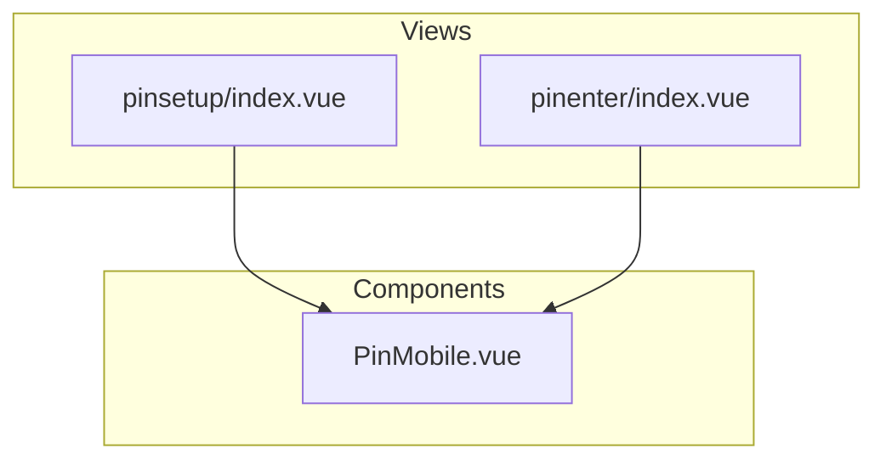
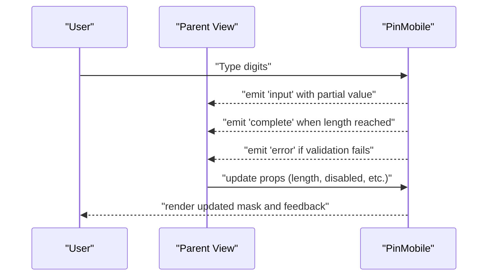
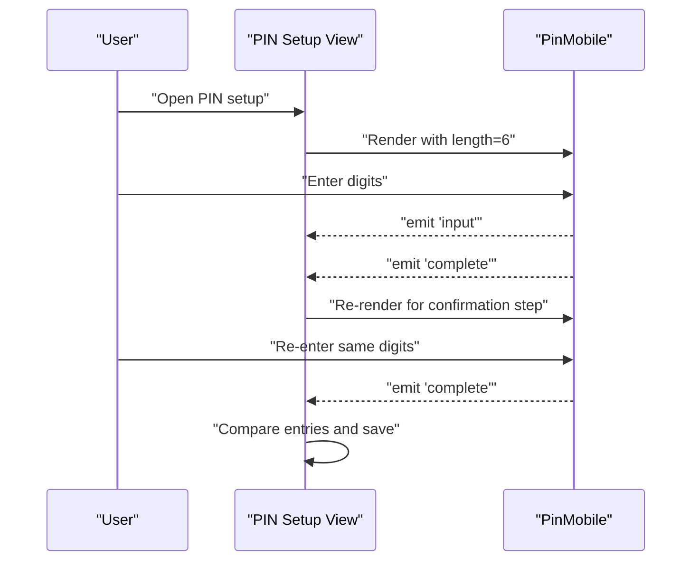
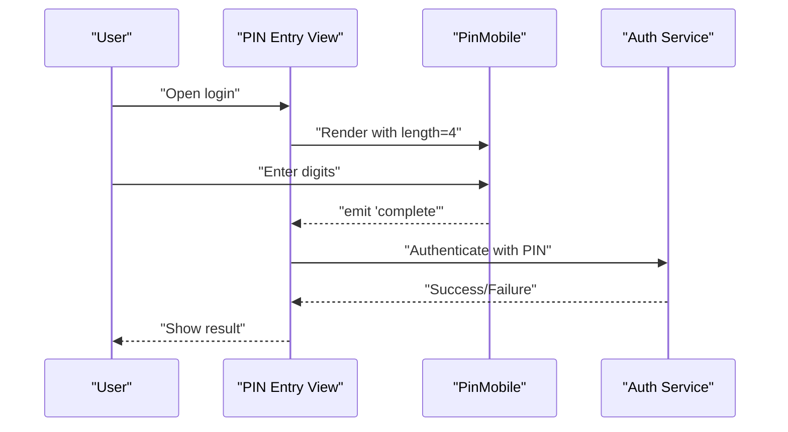
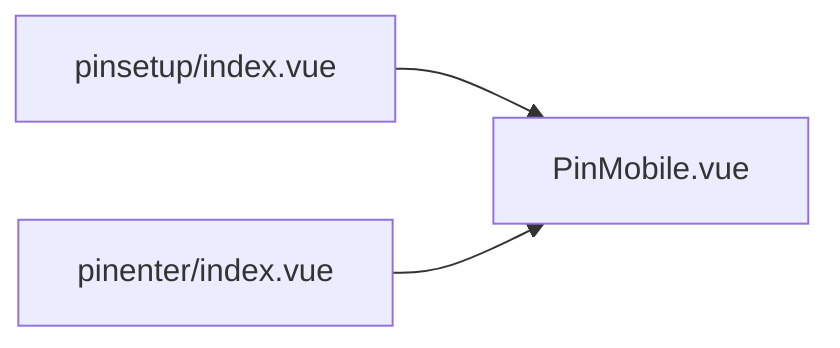

# PIN Input Component

<cite>
**Referenced Files in This Document**
- [PinMobile.vue](file://src/components/pinmobile/PinMobile.vue)
- [README.md](file://src/components/pinmobile/README.md)
- [index.vue](file://src/views/pinenter/index.vue)
- [index.vue](file://src/views/pinsetup/index.vue)
</cite>

## Table of Contents
1. [Introduction](#introduction)
2. [Project Structure](#project-structure)
3. [Core Components](#core-components)
4. [Architecture Overview](#architecture-overview)
5. [Detailed Component Analysis](#detailed-component-analysis)
6. [Dependency Analysis](#dependency-analysis)
7. [Performance Considerations](#performance-considerations)
8. [Troubleshooting Guide](#troubleshooting-guide)
9. [Conclusion](#conclusion)
10. [Appendices](#appendices)

## Introduction
This document describes the secure mobile PIN input component designed for safe and accessible PIN entry on mobile devices. It focuses on the PinMobile component, its configuration via props, event handling for completion and validation errors, styling options, accessibility features, keyboard support, and mobile-optimized touch interactions. It also provides usage examples for PIN setup flows and authentication screens, along with security considerations and best practices for secure input patterns.

## Project Structure
The PIN input functionality is implemented as a reusable Vue component and consumed by dedicated views for PIN setup and PIN entry. The relevant files are:
- PinMobile component implementation and documentation
- PIN setup view
- PIN entry (authentication) view

**Diagram sources**
- [PinMobile.vue](file://src/components/pinmobile/PinMobile.vue)
- [index.vue](file://src/views/pinsetup/index.vue)
- [index.vue](file://src/views/pinenter/index.vue)

**Section sources**
- [PinMobile.vue](file://src/components/pinmobile/PinMobile.vue)
- [README.md](file://src/components/pinmobile/README.md)
- [index.vue](file://src/views/pinsetup/index.vue)
- [index.vue](file://src/views/pinenter/index.vue)

## Core Components
- PinMobile: A mobile-optimized PIN input component that renders masked digits, manages local input state, validates length, emits events on completion or error, and supports customization via props and slots.

Key responsibilities:
- Render a fixed number of digit placeholders based on configured length
- Accept numeric input from virtual keyboards and physical keyboards
- Validate input against rules (e.g., minimum length, allowed characters)
- Emit events when the PIN is complete or invalid
- Provide styling hooks for theme and layout customization
- Ensure accessibility through labels, roles, and focus management

**Section sources**
- [PinMobile.vue](file://src/components/pinmobile/PinMobile.vue)
- [README.md](file://src/components/pinmobile/README.md)

## Architecture Overview
At a high level, parent views control business logic and user flow while delegating input capture to PinMobile. PinMobile remains stateless beyond its internal input buffer and exposes a simple event-driven interface.

**Diagram sources**
- [PinMobile.vue](file://src/components/pinmobile/PinMobile.vue)
- [index.vue](file://src/views/pinenter/index.vue)
- [index.vue](file://src/views/pinsetup/index.vue)

## Detailed Component Analysis

### Props
Configure behavior and appearance using props. Typical properties include:
- length: Number of digits expected
- placeholder: Text shown before any input
- disabled: Whether input is blocked
- readonly: Prevents editing but allows focus and screen reader access
- maskChar: Character used to mask entered digits
- autofocus: Automatically focus the input on mount
- label: Accessible label for the input group
- aria-describedby: ID of an element describing help text or instructions
- customClass: CSS class string for container styling
- inputClass: CSS class string for the underlying input element
- dotSize: Visual size of each digit indicator
- gap: Spacing between digit indicators
- color: Primary color for active states and focus rings
- borderColor: Border color for inactive/focus states
- borderRadius: Corner radius for digit indicators
- fontSize: Font size for digit indicators
- fontFamily: Font family for digit indicators
- textAlign: Alignment of digit indicators
- maxLength: Enforced maximum length (should match length)
- minLength: Minimum required length for validation
- allowBackspace: Whether backspace deletes previous digits
- preventPaste: Disables paste to reduce risk of accidental pasting
- inputMode: Hint for mobile virtual keyboard (numeric)
- pattern: Regex pattern for allowed characters (e.g., digits only)
- validateOnInput: Enable real-time validation feedback
- errorText: Custom message displayed on validation failure
- successText: Optional confirmation message after successful completion

Notes:
- If length is not provided, default behavior may be defined within the component; ensure it is explicitly set for predictable UX.
- When both minLength and maxLength are set, they should align with length to avoid conflicting validation.

**Section sources**
- [PinMobile.vue](file://src/components/pinmobile/PinMobile.vue)
- [README.md](file://src/components/pinmobile/README.md)

### Events
PinMobile emits events to communicate state changes to the parent view:
- input: Emitted with the current partial value as the user types
- complete: Emitted when the entered PIN reaches the configured length
- error: Emitted when validation fails (e.g., wrong length or disallowed characters)
- blur: Emitted when the input loses focus
- focus: Emitted when the input gains focus

Recommended handling:
- On input: Update UI state such as progress or enable/disable actions
- On complete: Trigger authentication or confirm PIN setup
- On error: Show inline messages and keep focus on the input

**Section sources**
- [PinMobile.vue](file://src/components/pinmobile/PinMobile.vue)

### Slots and Scoping
- Default slot: Allows injecting custom content inside the component container (e.g., help text or buttons)
- Scoped slot: Exposes current input state (value, isValid, isComplete) to render custom indicators or messages

Use cases:
- Display a dynamic hint based on validity
- Render a custom “Confirm” button enabled only when valid

**Section sources**
- [PinMobile.vue](file://src/components/pinmobile/PinMobile.vue)

### Styling Options
Styling can be applied via:
- CSS classes through customClass and inputClass
- Theme variables via props like color, borderColor, borderRadius, fontSize, fontFamily
- Layout props like dotSize and gap to adjust visual density
- Inline styles passed down to the underlying input element where appropriate

Best practices:
- Keep contrast ratios sufficient for readability
- Ensure focus rings are visible for keyboard users
- Avoid overly small dot sizes on low-resolution displays

**Section sources**
- [PinMobile.vue](file://src/components/pinmobile/PinMobile.vue)

### Accessibility Features
- Semantic role and aria attributes for screen readers
- Label association via label prop and aria-describedby for instructions
- Focus management to move focus into the input on mount when autofocus is true
- Keyboard navigation: Arrow keys to move between digit positions, Backspace/Delete to clear, Enter to submit when applicable
- Mobile-friendly input mode to trigger numeric keypad
- Announcements for validation errors and completion status

**Section sources**
- [PinMobile.vue](file://src/components/pinmobile/PinMobile.vue)

### Keyboard Support
- Numeric keypad on mobile via inputMode
- Physical keyboard: Digits accepted, non-digits ignored based on pattern
- Navigation: Left/Right arrows move between digit positions
- Editing: Backspace/Delete removes previous digit; typing replaces current position
- Submission: Enter triggers completion handler if valid

**Section sources**
- [PinMobile.vue](file://src/components/pinmobile/PinMobile.vue)

### Mobile-Optimized Touch Interactions
- Large tap targets for digit indicators
- Immediate visual feedback on press
- Optimized input field placement to avoid OS keyboard overlap
- Reduced animation duration for smoother transitions

**Section sources**
- [PinMobile.vue](file://src/components/pinmobile/PinMobile.vue)

### Usage Examples

#### PIN Setup Flow
In a PIN setup view, use PinMobile to collect a new PIN twice and compare them:
- First pass: Collect and store the proposed PIN
- Second pass: Confirm the PIN matches the first entry
- Show validation errors if lengths differ or characters are invalid
- Proceed to save once confirmed

**Diagram sources**
- [index.vue](file://src/views/pinsetup/index.vue)
- [PinMobile.vue](file://src/components/pinmobile/PinMobile.vue)

**Section sources**
- [index.vue](file://src/views/pinsetup/index.vue)
- [PinMobile.vue](file://src/components/pinmobile/PinMobile.vue)

#### Authentication Screen
In an authentication view, use PinMobile to accept the user’s PIN:
- On complete, call authentication API
- Handle success and error responses
- Provide retry guidance on failure

**Diagram sources**
- [index.vue](file://src/views/pinenter/index.vue)
- [PinMobile.vue](file://src/components/pinmobile/PinMobile.vue)

**Section sources**
- [index.vue](file://src/views/pinenter/index.vue)
- [PinMobile.vue](file://src/components/pinmobile/PinMobile.vue)

### Security Considerations and Best Practices
- Do not log PIN values or emit them in analytics
- Clear input buffers on unmount and hide masks immediately after processing
- Use HTTPS for all network requests involving PINs
- Implement rate limiting and account lockout policies at the server side
- Prefer short-lived sessions and re-authentication for sensitive actions
- Avoid storing PINs in localStorage/sessionStorage; use secure storage mechanisms if needed
- Mask input visually and prevent screenshots where possible on mobile platforms
- Validate inputs client-side for UX, but enforce strict validation server-side
- Consider adding a timeout to auto-clear the input after inactivity

[No sources needed since this section provides general guidance]

## Dependency Analysis
PinMobile is a self-contained component with minimal external dependencies. Parent views depend on it for input capture and validation feedback.

**Diagram sources**
- [index.vue](file://src/views/pinsetup/index.vue)
- [index.vue](file://src/views/pinenter/index.vue)
- [PinMobile.vue](file://src/components/pinmobile/PinMobile.vue)

**Section sources**
- [index.vue](file://src/views/pinsetup/index.vue)
- [index.vue](file://src/views/pinenter/index.vue)
- [PinMobile.vue](file://src/components/pinmobile/PinMobile.vue)

## Performance Considerations
- Keep rendering lightweight by avoiding heavy computations during input
- Debounce expensive operations triggered by input events
- Minimize reflows by batching style updates
- Use CSS transforms for animations instead of layout-affecting properties
- Avoid unnecessary watchers; rely on events for state synchronization

[No sources needed since this section provides general guidance]

## Troubleshooting Guide
Common issues and resolutions:
- Input does not accept digits: Verify pattern and inputMode props; ensure numeric input is allowed
- Validation errors persist: Check minLength/maxLength alignment with length; review validateOnInput behavior
- Focus not moving to input: Confirm autofocus is enabled and no modal overlays block focus
- Screen reader not announcing: Ensure label and aria-describedby are set correctly
- Paste not working: If preventPaste is true, disable it only if necessary and add manual validation

**Section sources**
- [PinMobile.vue](file://src/components/pinmobile/PinMobile.vue)

## Conclusion
The PinMobile component provides a secure, accessible, and mobile-friendly PIN input experience. By configuring props, handling events, and following security best practices, developers can implement robust PIN setup and authentication flows with consistent UX across devices.

[No sources needed since this section summarizes without analyzing specific files]

## Appendices

### Quick Reference: Props, Events, and Slots
- Props: length, placeholder, disabled, readonly, maskChar, autofocus, label, aria-describedby, customClass, inputClass, dotSize, gap, color, borderColor, borderRadius, fontSize, fontFamily, textAlign, maxLength, minLength, allowBackspace, preventPaste, inputMode, pattern, validateOnInput, errorText, successText
- Events: input, complete, error, blur, focus
- Slots: default, scoped (exposing value, isValid, isComplete)

**Section sources**
- [PinMobile.vue](file://src/components/pinmobile/PinMobile.vue)
- [README.md](file://src/components/pinmobile/README.md)