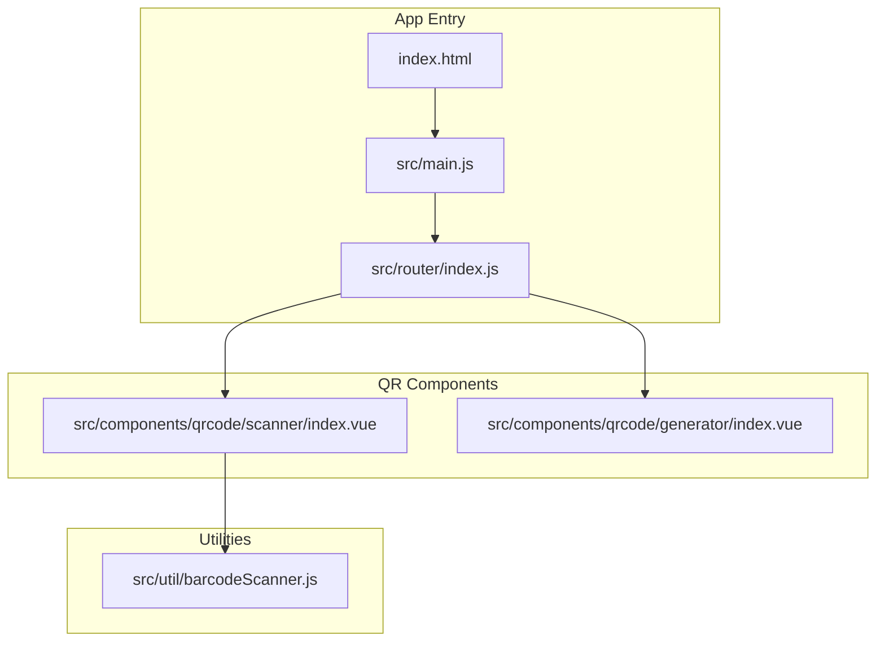
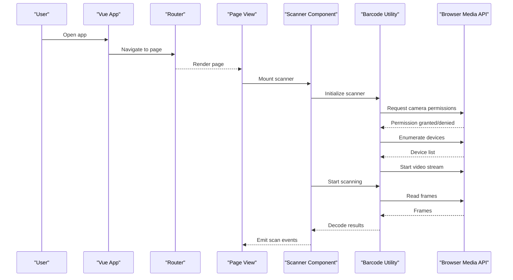
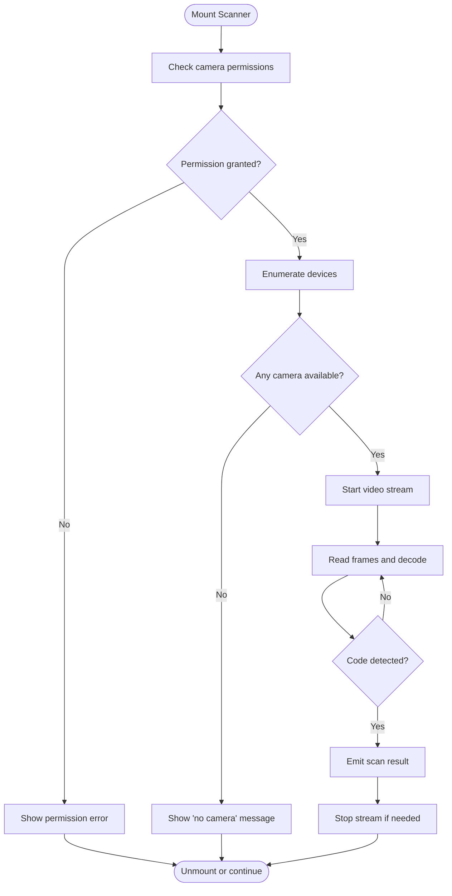
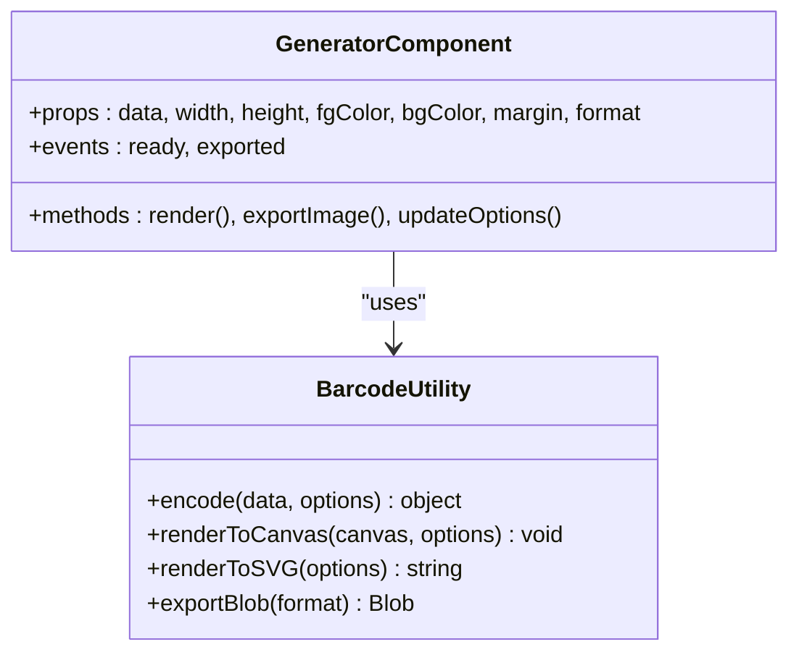
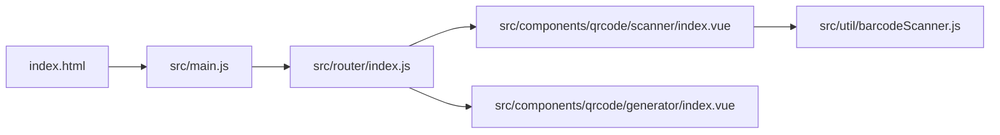

# QR Code Components

<cite>
**Referenced Files in This Document**
- [index.vue](file://src/components/qrcode/scanner/index.vue)
- [index.vue](file://src/components/qrcode/generator/index.vue)
- [barcodeScanner.js](file://src/util/barcodeScanner.js)
- [index.html](file://index.html)
- [main.js](file://src/main.js)
- [index.js](file://src/router/index.js)
</cite>

## Table of Contents
1. [Introduction](#introduction)
2. [Project Structure](#project-structure)
3. [Core Components](#core-components)
4. [Architecture Overview](#architecture-overview)
5. [Detailed Component Analysis](#detailed-component-analysis)
6. [Dependency Analysis](#dependency-analysis)
7. [Performance Considerations](#performance-considerations)
8. [Troubleshooting Guide](#troubleshooting-guide)
9. [Conclusion](#conclusion)

## Introduction
This document provides comprehensive documentation for the QR code components, including both scanner and generator functionality. It covers camera integration, supported barcode formats, real-time detection capabilities, error handling, configuration options, output formats, customization settings, implementation examples, performance optimization techniques, browser compatibility considerations, mobile-specific behaviors, and troubleshooting guidance for camera permissions and scanning issues.

## Project Structure
The QR code features are implemented as Vue components under src/components/qrcode with a shared utility for scanning logic:
- Scanner component: src/components/qrcode/scanner/index.vue
- Generator component: src/components/qrcode/generator/index.vue
- Barcode scanning utility: src/util/barcodeScanner.js
- Application entry points and routing: index.html, src/main.js, src/router/index.js

**Diagram sources**
- [index.html](file://index.html)
- [main.js](file://src/main.js)
- [index.js](file://src/router/index.js)
- [index.vue](file://src/components/qrcode/scanner/index.vue)
- [index.vue](file://src/components/qrcode/generator/index.vue)
- [barcodeScanner.js](file://src/util/barcodeScanner.js)

**Section sources**
- [index.html](file://index.html)
- [main.js](file://src/main.js)
- [index.js](file://src/router/index.js)
- [index.vue](file://src/components/qrcode/scanner/index.vue)
- [index.vue](file://src/components/qrcode/generator/index.vue)
- [barcodeScanner.js](file://src/util/barcodeScanner.js)

## Core Components
- Scanner component (src/components/qrcode/scanner/index.vue): Provides camera-based scanning with real-time detection, format selection, and event callbacks for successful scans and errors.
- Generator component (src/components/qrcode/generator/index.vue): Renders QR codes from input data with configurable size, color, margin, and output formats.
- Barcode utility (src/util/barcodeScanner.js): Encapsulates scanning logic, device enumeration, permission handling, and result processing.

Key responsibilities:
- Scanner: Camera access, stream management, frame analysis, decoding, UI feedback, and error reporting.
- Generator: Data encoding, canvas/SVG rendering, export utilities, and styling options.
- Utility: Cross-cutting concerns such as permission prompts, device selection, and decoding configuration.

**Section sources**
- [index.vue](file://src/components/qrcode/scanner/index.vue)
- [index.vue](file://src/components/qrcode/generator/index.vue)
- [barcodeScanner.js](file://src/util/barcodeScanner.js)

## Architecture Overview
The application bootstraps via index.html and src/main.js, which initializes Vue and registers routes. The router directs users to pages that include the QR scanner or generator components. The scanner component integrates with the barcode utility to manage camera streams and decode frames. The generator component renders QR images using configured options.

**Diagram sources**
- [index.html](file://index.html)
- [main.js](file://src/main.js)
- [index.js](file://src/router/index.js)
- [index.vue](file://src/components/qrcode/scanner/index.vue)
- [barcodeScanner.js](file://src/util/barcodeScanner.js)

## Detailed Component Analysis

### Scanner Component
Responsibilities:
- Camera integration and stream lifecycle management
- Real-time detection loop
- Supported barcode format configuration
- Error handling and user feedback
- Event emission for successful scans

Implementation highlights:
- Uses the barcode utility to request permissions, enumerate devices, and start/stop the camera stream.
- Configures supported formats through the utility’s configuration interface.
- Emits events for scan success and errors; parent views can subscribe to handle business logic.
- Manages UI states such as loading, active scanning, and error messages.

Supported formats:
- The component delegates format selection to the barcode utility. Typical QR-capable libraries support QR Code and common 1D barcodes; verify the library used by the utility for exact format lists.

Real-time detection:
- The scanner reads frames from the live video stream and decodes them continuously until a valid code is found or scanning is stopped.

Error handling:
- Handles permission denied, no camera available, stream errors, and decoding failures.
- Exposes user-friendly messages and allows retry flows.

Common use case: Product scanning
- Parent view mounts the scanner, listens for scan events, validates product IDs, and updates inventory UI accordingly.

**Diagram sources**
- [index.vue](file://src/components/qrcode/scanner/index.vue)
- [barcodeScanner.js](file://src/util/barcodeScanner.js)

**Section sources**
- [index.vue](file://src/components/qrcode/scanner/index.vue)
- [barcodeScanner.js](file://src/util/barcodeScanner.js)

### Generator Component
Responsibilities:
- Accepts input data and configuration options
- Renders QR code to canvas or SVG
- Supports export/download in multiple formats
- Applies customization settings (size, colors, margins, quiet zone)

Configuration options:
- Input data string
- Output width/height
- Color foreground/background
- Margin/quiet zone
- Output format (canvas, SVG, PNG, JPEG)
- Error correction level (if supported by underlying library)

Output formats:
- Canvas element for immediate display
- SVG string for scalable rendering
- Image blob for download (PNG/JPEG)

Customization settings:
- Size scaling
- Colors and contrast
- Margins for readability
- Optional logo overlay (if implemented)

Common use case: Generate QR for product details
- Parent view collects product info, passes it to the generator, and offers download or share actions.

**Diagram sources**
- [index.vue](file://src/components/qrcode/generator/index.vue)
- [barcodeScanner.js](file://src/util/barcodeScanner.js)

**Section sources**
- [index.vue](file://src/components/qrcode/generator/index.vue)
- [barcodeScanner.js](file://src/util/barcodeScanner.js)

### Barcode Utility
Responsibilities:
- Centralizes camera permission requests and device enumeration
- Starts/stops media streams
- Decodes frames into QR/barcode results
- Provides configuration for supported formats and decoding options

Integration points:
- Called by the scanner component to manage camera lifecycle
- May be reused by other parts of the app requiring scanning

Error handling:
- Normalizes browser errors (e.g., NotAllowedError, NotFoundError)
- Returns structured error objects for consistent UI handling

**Section sources**
- [barcodeScanner.js](file://src/util/barcodeScanner.js)

## Dependency Analysis
High-level dependencies:
- index.html loads the application bundle.
- main.js initializes Vue and configures plugins.
- router/index.js defines routes that mount pages containing the QR components.
- scanner/index.vue depends on util/barcodeScanner.js for camera and decoding.
- generator/index.vue uses an internal or external QR generation library to render outputs.

**Diagram sources**
- [index.html](file://index.html)
- [main.js](file://src/main.js)
- [index.js](file://src/router/index.js)
- [index.vue](file://src/components/qrcode/scanner/index.vue)
- [index.vue](file://src/components/qrcode/generator/index.vue)
- [barcodeScanner.js](file://src/util/barcodeScanner.js)

**Section sources**
- [index.html](file://index.html)
- [main.js](file://src/main.js)
- [index.js](file://src/router/index.js)
- [index.vue](file://src/components/qrcode/scanner/index.vue)
- [index.vue](file://src/components/qrcode/generator/index.vue)
- [barcodeScanner.js](file://src/util/barcodeScanner.js)

## Performance Considerations
- Limit frame sampling rate: Avoid decoding every frame; sample at intervals to reduce CPU usage.
- Use appropriate resolution: Lower camera resolution improves performance on low-end devices.
- Optimize format selection: Restrict supported formats to only those needed to speed up decoding.
- Debounce scan results: Prevent duplicate triggers when multiple codes are detected rapidly.
- Reuse canvases and buffers: Minimize allocations during continuous scanning.
- Offload heavy work: If generating complex QR codes, consider Web Workers for large payloads.
- Lazy load components: Load scanner/generator only when needed to reduce initial bundle size.

[No sources needed since this section provides general guidance]

## Troubleshooting Guide
Camera permissions:
- Ensure HTTPS context; browsers require secure origins for camera access.
- Prompt users explicitly before starting scanning; handle permission denial gracefully.
- Provide a “Retry” flow after permission changes.

No camera available:
- Enumerate devices and show a clear message if none are found.
- Allow switching cameras on mobile devices (front/back).

Scanning issues:
- Improve lighting and focus; provide visual guidance overlays.
- Adjust supported formats and decoding thresholds.
- Reduce resolution or frame rate if performance degrades.

Generator issues:
- Validate input data length and character set.
- Choose appropriate error correction level for robustness.
- Export to correct format and ensure cross-browser compatibility for downloads.

Mobile-specific behaviors:
- Respect orientation changes; adjust layout and camera constraints.
- Handle back button navigation carefully to stop streams and release resources.
- Test on iOS Safari and Android Chrome for differences in autoplay and permissions.

**Section sources**
- [index.vue](file://src/components/qrcode/scanner/index.vue)
- [index.vue](file://src/components/qrcode/generator/index.vue)
- [barcodeScanner.js](file://src/util/barcodeScanner.js)

## Conclusion
The QR code components provide a cohesive solution for scanning and generating QR codes within a Vue application. The scanner leverages a dedicated utility for robust camera integration and decoding, while the generator offers flexible configuration and export options. By following the performance tips and troubleshooting steps outlined here, you can deliver a reliable experience across desktop and mobile browsers.