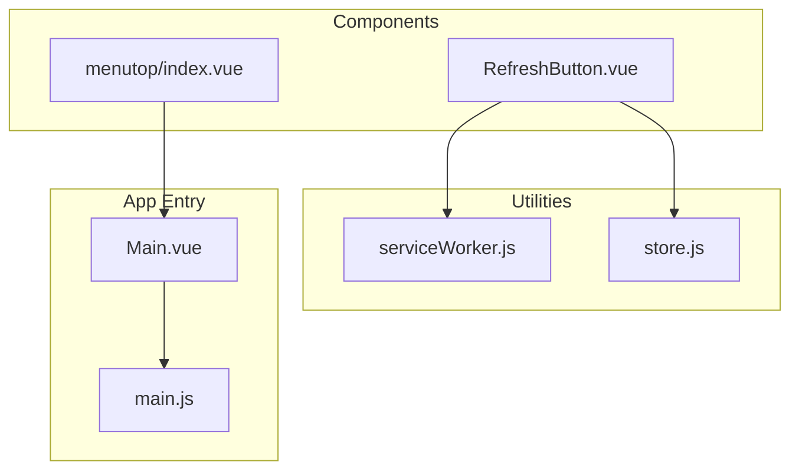
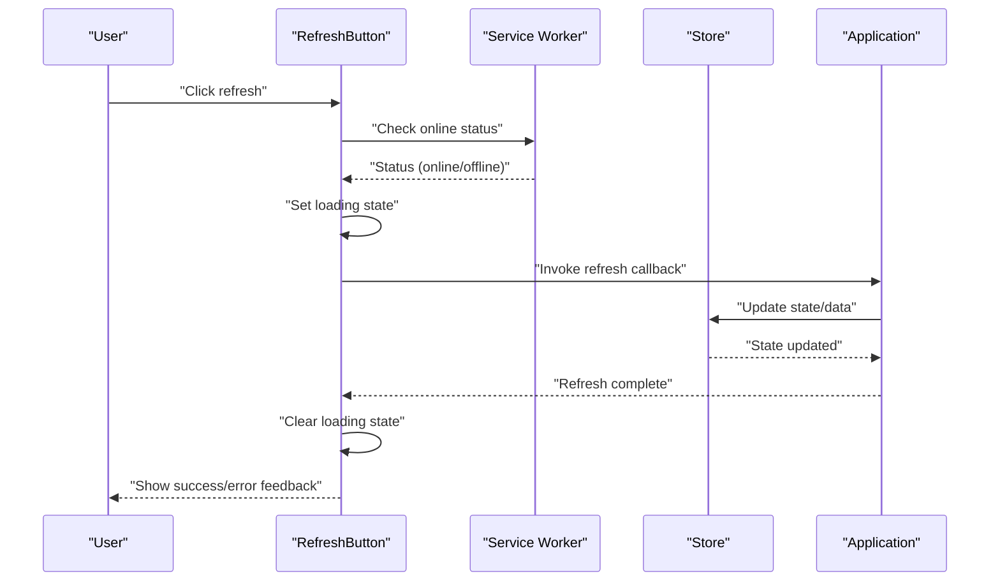
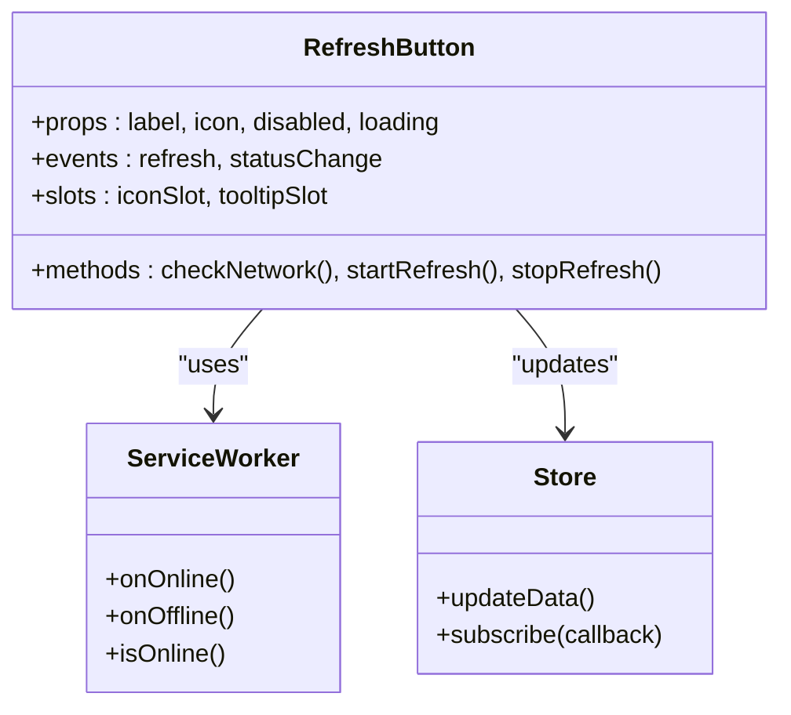
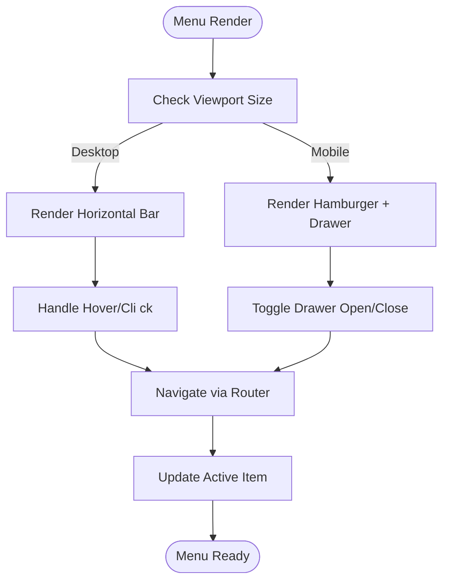
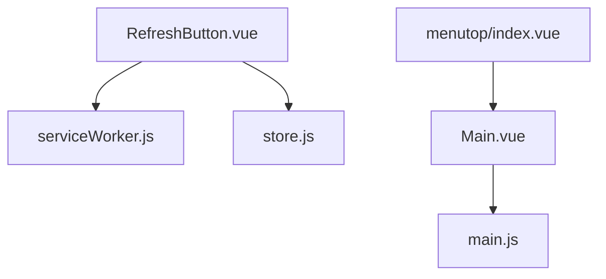

# UI Utility Components

<cite>
**Referenced Files in This Document**
- [RefreshButton.vue](file://src/components/refreshbutton/RefreshButton.vue)
- [README.md](file://src/components/refreshbutton/README.md)
- [index.vue](file://src/components/menutop/index.vue)
- [store.js](file://src/util/store.js)
- [serviceWorker.js](file://src/util/serviceWorker/serviceWorker.js)
- [Main.vue](file://src/Main.vue)
- [main.js](file://src/main.js)
</cite>

## Table of Contents
1. [Introduction](#introduction)
2. [Project Structure](#project-structure)
3. [Core Components](#core-components)
4. [Architecture Overview](#architecture-overview)
5. [Detailed Component Analysis](#detailed-component-analysis)
6. [Dependency Analysis](#dependency-analysis)
7. [Performance Considerations](#performance-considerations)
8. [Troubleshooting Guide](#troubleshooting-guide)
9. [Conclusion](#conclusion)
10. [Appendices](#appendices)

## Introduction
This document provides comprehensive documentation for utility UI components, focusing on the RefreshButton and top menu components. It explains network status awareness, loading states, customization options, navigation structure, responsive behavior, integration patterns, styling, accessibility, and guidelines for extending these components to create custom variants.

## Project Structure
The relevant components are located under src/components:
- RefreshButton component: src/components/refreshbutton/
- Top menu component: src/components/menutop/

**Diagram sources**
- [RefreshButton.vue](file://src/components/refreshbutton/RefreshButton.vue)
- [index.vue](file://src/components/menutop/index.vue)
- [serviceWorker.js](file://src/util/serviceWorker/serviceWorker.js)
- [store.js](file://src/util/store.js)
- [Main.vue](file://src/Main.vue)
- [main.js](file://src/main.js)

**Section sources**
- [RefreshButton.vue](file://src/components/refreshbutton/RefreshButton.vue)
- [index.vue](file://src/components/menutop/index.vue)
- [serviceWorker.js](file://src/util/serviceWorker/serviceWorker.js)
- [store.js](file://src/util/store.js)
- [Main.vue](file://src/Main.vue)
- [main.js](file://src/main.js)

## Core Components
- RefreshButton: A button that reflects online/offline status and can trigger data refresh operations. It supports loading states and is designed to integrate with service workers and application state stores.
- Top Menu: A navigation component providing a structured menu with responsive behavior suitable for desktop and mobile layouts.

Key responsibilities:
- RefreshButton: Display network status, manage loading feedback, and invoke refresh callbacks or actions.
- Top Menu: Render navigation items, handle active states, and adapt layout based on viewport size.

**Section sources**
- [RefreshButton.vue](file://src/components/refreshbutton/RefreshButton.vue)
- [README.md](file://src/components/refreshbutton/README.md)
- [index.vue](file://src/components/menutop/index.vue)

## Architecture Overview
The RefreshButton integrates with the service worker for network status and optional store updates. The top menu integrates with the main application shell for navigation and routing.

**Diagram sources**
- [RefreshButton.vue](file://src/components/refreshbutton/RefreshButton.vue)
- [serviceWorker.js](file://src/util/serviceWorker/serviceWorker.js)
- [store.js](file://src/util/store.js)
- [Main.vue](file://src/Main.vue)

## Detailed Component Analysis

### RefreshButton Component
Responsibilities:
- Network status awareness: Reflects online/offline state using service worker events.
- Loading states: Provides visual feedback during refresh operations.
- Customization: Supports props for labels, icons, colors, and event hooks.
- Accessibility: Includes semantic roles, keyboard support, and screen reader-friendly text.

Integration points:
- Service worker for network status.
- Application store for state synchronization.
- Parent component for refresh action handling.

Common usage patterns:
- Inline refresh within a page header.
- Floating action button for global refresh.
- Conditional visibility based on offline mode.

Styling customization:
- CSS variables or theme classes for color and size.
- Slot-based icon replacement.
- Responsive sizing via utility classes.

Accessibility features:
- aria-label and role attributes.
- Focus management and keyboard activation.
- Live region announcements for loading and completion.

Extensibility guidelines:
- Create variant props for different contexts (e.g., mini, outlined).
- Provide composable functions for network-aware logic.
- Use slots for flexible content injection.

**Diagram sources**
- [RefreshButton.vue](file://src/components/refreshbutton/RefreshButton.vue)
- [serviceWorker.js](file://src/util/serviceWorker/serviceWorker.js)
- [store.js](file://src/util/store.js)

**Section sources**
- [RefreshButton.vue](file://src/components/refreshbutton/RefreshButton.vue)
- [README.md](file://src/components/refreshbutton/README.md)
- [serviceWorker.js](file://src/util/serviceWorker/serviceWorker.js)
- [store.js](file://src/util/store.js)

### Top Menu Component
Responsibilities:
- Navigation structure: Renders a hierarchical menu with active item highlighting.
- Responsive behavior: Collapses into a hamburger menu on small screens.
- Integration patterns: Works with router for navigation and parent app for layout.

Navigation structure:
- Primary items at the top level.
- Submenus for grouped actions.
- Active state driven by current route or store.

Responsive behavior:
- Desktop: Horizontal bar with hover/click interactions.
- Mobile: Drawer or dropdown triggered by toggle button.

Integration patterns:
- Router integration for programmatic navigation.
- Store integration for user context and permissions.
- Theme integration for consistent styling.

Accessibility features:
- Semantic nav element and list structure.
- Keyboard navigation with arrow keys and focus trapping.
- ARIA attributes for expanded/collapsed states.

Extensibility guidelines:
- Provide slot for logo or branding.
- Support dynamic menu items from store or API.
- Offer variant props for compact or full-width modes.

**Diagram sources**
- [index.vue](file://src/components/menutop/index.vue)
- [Main.vue](file://src/Main.vue)

**Section sources**
- [index.vue](file://src/components/menutop/index.vue)
- [Main.vue](file://src/Main.vue)

## Dependency Analysis
The RefreshButton depends on service worker events for network status and may update the application store. The top menu depends on routing and potentially store state for active items.

**Diagram sources**
- [RefreshButton.vue](file://src/components/refreshbutton/RefreshButton.vue)
- [serviceWorker.js](file://src/util/serviceWorker/serviceWorker.js)
- [store.js](file://src/util/store.js)
- [index.vue](file://src/components/menutop/index.vue)
- [Main.vue](file://src/Main.vue)
- [main.js](file://src/main.js)

**Section sources**
- [RefreshButton.vue](file://src/components/refreshbutton/RefreshButton.vue)
- [serviceWorker.js](file://src/util/serviceWorker/serviceWorker.js)
- [store.js](file://src/util/store.js)
- [index.vue](file://src/components/menutop/index.vue)
- [Main.vue](file://src/Main.vue)
- [main.js](file://src/main.js)

## Performance Considerations
- Debounce refresh triggers to avoid excessive network calls.
- Cache network status checks and reuse results where appropriate.
- Lazy-load menu items if dynamically generated to reduce initial render time.
- Minimize re-renders by memoizing computed values and avoiding unnecessary prop changes.

[No sources needed since this section provides general guidance]

## Troubleshooting Guide
Common issues and resolutions:
- Refresh not updating: Ensure the refresh callback is properly bound and the store subscription is active.
- Offline indicator not showing: Verify service worker registration and event listeners.
- Menu not responding: Check router configuration and active item computation.
- Accessibility problems: Confirm ARIA attributes and keyboard handlers are present.

Debugging tips:
- Log network status transitions and refresh lifecycle events.
- Inspect DOM for correct ARIA roles and labels.
- Use browser dev tools to monitor store updates and route changes.

**Section sources**
- [RefreshButton.vue](file://src/components/refreshbutton/RefreshButton.vue)
- [serviceWorker.js](file://src/util/serviceWorker/serviceWorker.js)
- [store.js](file://src/util/store.js)
- [index.vue](file://src/components/menutop/index.vue)

## Conclusion
The RefreshButton and top menu components provide robust, accessible, and customizable utilities for common UI patterns. By following the integration and extension guidelines, developers can tailor these components to meet diverse application needs while maintaining consistency and performance.

[No sources needed since this section summarizes without analyzing specific files]

## Appendices

### Usage Examples
- Basic refresh button with default behavior.
- Customized refresh button with icon and tooltip.
- Top menu integrated with router for navigation.
- Responsive menu with drawer on mobile.

[No sources needed since this section provides general guidance]

### Styling Customization
- Define CSS variables for theme colors and sizes.
- Override component styles via scoped classes.
- Use utility classes for spacing and layout adjustments.

[No sources needed since this section provides general guidance]

### Accessibility Checklist
- Semantic HTML elements used.
- ARIA attributes set correctly.
- Keyboard navigation supported.
- Screen reader announcements implemented.

[No sources needed since this section provides general guidance]