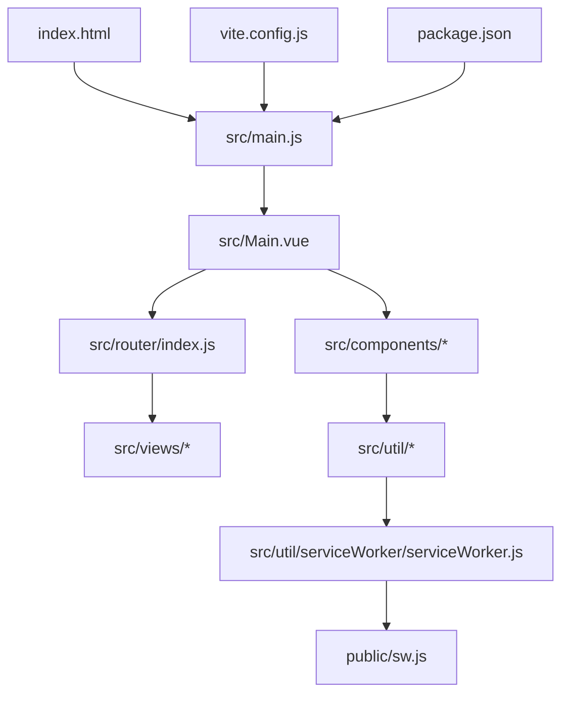
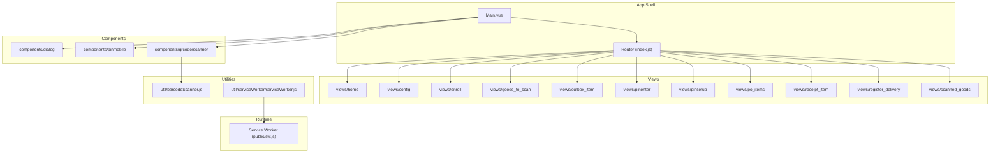
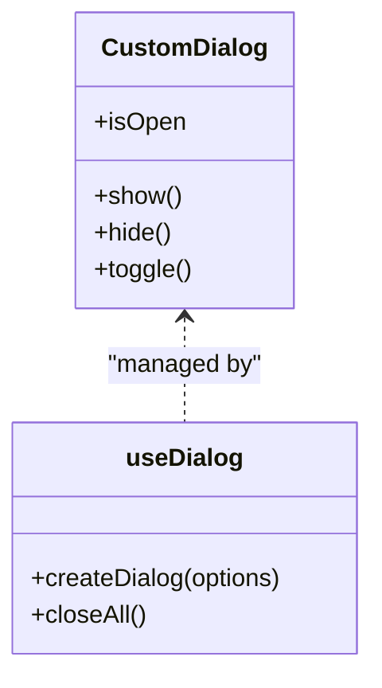
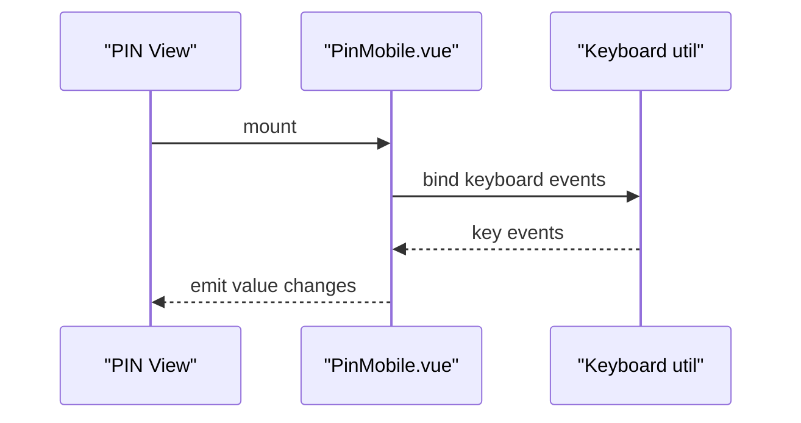
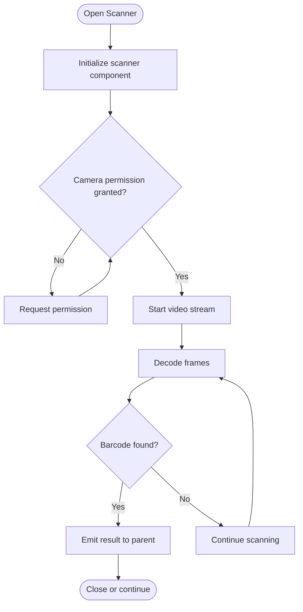

# Contributing Guidelines

<cite>
**Referenced Files in This Document**
- [README.md](file://README.md)
- [package.json](file://package.json)
- [vite.config.js](file://vite.config.js)
- [src/main.js](file://src/main.js)
- [src/Main.vue](file://src/Main.vue)
- [src/router/index.js](file://src/router/index.js)
- [src/components/dialog/CustomDialog.vue](file://src/components/dialog/CustomDialog.vue)
- [src/components/dialog/useDialog.js](file://src/components/dialog/useDialog.js)
- [src/components/pinmobile/PinMobile.vue](file://src/components/pinmobile/PinMobile.vue)
- [src/components/qrcode/scanner/index.vue](file://src/components/qrcode/scanner/index.vue)
- [src/util/barcodeScanner.js](file://src/util/barcodeScanner.js)
- [src/util/serviceWorker/serviceWorker.js](file://src/util/serviceWorker/serviceWorker.js)
- [public/sw.js](file://public/sw.js)
- [scripts/start.sh](file://scripts/start.sh)
- [scripts/watch.sh](file://scripts/watch.sh)
- [scripts/restart.sh](file://scripts/restart.sh)
- [scripts/stop.sh](file://scripts/stop.sh)
- [scripts/chrome.sh](file://scripts/chrome.sh)
- [scripts/push.sh](file://scripts/push.sh)
- [scripts/zip.sh](file://scripts/zip.sh)
</cite>

## Table of Contents
1. [Introduction](#introduction)
2. [Project Structure](#project-structure)
3. [Core Components](#core-components)
4. [Architecture Overview](#architecture-overview)
5. [Detailed Component Analysis](#detailed-component-analysis)
6. [Development Workflow](#development-workflow)
7. [Code Style and Quality](#code-style-and-quality)
8. [Testing and Quality Assurance](#testing-and-quality-assurance)
9. [Performance Considerations](#performance-considerations)
10. [Accessibility Requirements](#accessibility-requirements)
11. [Adding New Features and Components](#adding-new-features-and-components)
12. [Documentation Guidelines](#documentation-guidelines)
13. [Review Process and Pull Requests](#review-process-and-pull-requests)
14. [Reporting Bugs and Requesting Features](#reporting-bugs-and-requesting-features)
15. [Community Engagement](#community-engagement)
16. [Troubleshooting Guide](#troubleshooting-guide)
17. [Conclusion](#conclusion)

## Introduction
This document provides comprehensive contributing guidelines for the AHM GR Scanner project. It explains how to set up your development environment, follow branch and commit conventions, write and review code, add new components and features, ensure quality and accessibility, and engage with the community. The goal is to make contributions efficient, consistent, and high-quality.

## Project Structure
The project is a Vue 3 application built with Vite. Key areas include:
- Application entry points and configuration
- Vue components organized by feature
- Utilities for scanning, routing, store, and service worker integration
- Scripts for local development and deployment
- Public assets including service worker files

**Diagram sources**
- [src/main.js](file://src/main.js)
- [src/Main.vue](file://src/Main.vue)
- [src/router/index.js](file://src/router/index.js)
- [vite.config.js](file://vite.config.js)
- [package.json](file://package.json)
- [src/util/serviceWorker/serviceWorker.js](file://src/util/serviceWorker/serviceWorker.js)
- [public/sw.js](file://public/sw.js)

**Section sources**
- [README.md](file://README.md)
- [package.json](file://package.json)
- [vite.config.js](file://vite.config.js)
- [src/main.js](file://src/main.js)
- [src/Main.vue](file://src/Main.vue)
- [src/router/index.js](file://src/router/index.js)

## Core Components
- Main application shell and bootstrapping
- Router-based view navigation
- Reusable UI components (dialog, PIN input, QR scanner)
- Utility modules for barcode scanning and service worker management

Key responsibilities:
- Entry point initializes the app and mounts the root component
- Router defines page routes and navigational structure
- Dialog system encapsulates modal behavior and state
- PIN mobile component handles numeric input flows
- QR scanner integrates camera-based scanning utilities

**Section sources**
- [src/main.js](file://src/main.js)
- [src/Main.vue](file://src/Main.vue)
- [src/router/index.js](file://src/router/index.js)
- [src/components/dialog/CustomDialog.vue](file://src/components/dialog/CustomDialog.vue)
- [src/components/dialog/useDialog.js](file://src/components/dialog/useDialog.js)
- [src/components/pinmobile/PinMobile.vue](file://src/components/pinmobile/PinMobile.vue)
- [src/components/qrcode/scanner/index.vue](file://src/components/qrcode/scanner/index.vue)
- [src/util/barcodeScanner.js](file://src/util/barcodeScanner.js)
- [src/util/serviceWorker/serviceWorker.js](file://src/util/serviceWorker/serviceWorker.js)

## Architecture Overview
High-level architecture shows client-side Vue app with router-driven views, reusable components, utility services, and optional service worker support.

**Diagram sources**
- [src/Main.vue](file://src/Main.vue)
- [src/router/index.js](file://src/router/index.js)
- [src/components/dialog/CustomDialog.vue](file://src/components/dialog/CustomDialog.vue)
- [src/components/pinmobile/PinMobile.vue](file://src/components/pinmobile/PinMobile.vue)
- [src/components/qrcode/scanner/index.vue](file://src/components/qrcode/scanner/index.vue)
- [src/util/barcodeScanner.js](file://src/util/barcodeScanner.js)
- [src/util/serviceWorker/serviceWorker.js](file://src/util/serviceWorker/serviceWorker.js)
- [public/sw.js](file://public/sw.js)

## Detailed Component Analysis

### Dialog System
Encapsulates dialog lifecycle and state via a composable pattern.

**Diagram sources**
- [src/components/dialog/CustomDialog.vue](file://src/components/dialog/CustomDialog.vue)
- [src/components/dialog/useDialog.js](file://src/components/dialog/useDialog.js)

**Section sources**
- [src/components/dialog/CustomDialog.vue](file://src/components/dialog/CustomDialog.vue)
- [src/components/dialog/useDialog.js](file://src/components/dialog/useDialog.js)

### PIN Mobile Input
Provides a focused numeric input experience for PIN entry flows.

**Diagram sources**
- [src/components/pinmobile/PinMobile.vue](file://src/components/pinmobile/PinMobile.vue)
- [src/util/keyboard.js](file://src/util/keyboard.js)

**Section sources**
- [src/components/pinmobile/PinMobile.vue](file://src/components/pinmobile/PinMobile.vue)
- [src/util/keyboard.js](file://src/util/keyboard.js)

### QR Code Scanner Integration
Integrates camera-based scanning through a dedicated component and utility.

**Diagram sources**
- [src/components/qrcode/scanner/index.vue](file://src/components/qrcode/scanner/index.vue)
- [src/util/barcodeScanner.js](file://src/util/barcodeScanner.js)

**Section sources**
- [src/components/qrcode/scanner/index.vue](file://src/components/qrcode/scanner/index.vue)
- [src/util/barcodeScanner.js](file://src/util/barcodeScanner.js)

## Development Workflow

### Branch Management
- Use descriptive branch names following the pattern: type/description
- Types include: feature/, fix/, refactor/, docs/, chore/
- Keep branches small and focused; merge frequently into main after passing checks

### Commit Message Conventions
- Use imperative mood and concise subject lines
- Separate subject from body with a blank line
- Reference related issues where applicable
- Example format:
  - type(scope): short description
  - body explaining what and why

### Local Development
- Install dependencies using the package manager defined in the project
- Start the dev server using provided scripts
- Use watch mode for live reload during development
- Restart or stop the server as needed

**Section sources**
- [package.json](file://package.json)
- [scripts/start.sh](file://scripts/start.sh)
- [scripts/watch.sh](file://scripts/watch.sh)
- [scripts/restart.sh](file://scripts/restart.sh)
- [scripts/stop.sh](file://scripts/stop.sh)

## Code Style and Quality

### Formatting and Linting
- Follow consistent indentation and spacing across JavaScript and Vue files
- Prefer single quotes for strings unless template literals are required
- Use meaningful variable and function names; avoid abbreviations
- Keep functions small and focused; extract logic into utilities when reused
- Organize imports logically; group third-party, internal, and relative imports

### Vue-Specific Guidelines
- Use composition API patterns consistently
- Prefer composables for shared logic (e.g., dialog management)
- Keep templates readable; split complex logic into methods/composables
- Use props and emits explicitly; avoid implicit coupling

### Service Worker Usage
- Register and manage service workers via utilities
- Ensure graceful fallbacks if registration fails
- Keep cache strategies simple and testable

**Section sources**
- [src/components/dialog/useDialog.js](file://src/components/dialog/useDialog.js)
- [src/util/serviceWorker/serviceWorker.js](file://src/util/serviceWorker/serviceWorker.js)
- [public/sw.js](file://public/sw.js)

## Testing and Quality Assurance
- Write unit tests for critical utilities and composables
- Add integration tests for user flows involving scanning and PIN entry
- Validate browser compatibility and permissions handling
- Perform manual testing on target devices for camera access and performance
- Use linters and formatters to enforce consistency before committing

[No sources needed since this section provides general guidance]

## Performance Considerations
- Lazy-load heavy components and routes where possible
- Minimize re-renders by keeping component state minimal and localized
- Debounce or throttle frequent events (e.g., camera frame processing)
- Avoid unnecessary DOM manipulations; leverage Vue’s reactivity efficiently
- Monitor memory usage during extended scanning sessions

[No sources needed since this section provides general guidance]

## Accessibility Requirements
- Provide descriptive alt text for images and icons
- Ensure keyboard navigability and focus management for dialogs and modals
- Use semantic HTML elements and ARIA attributes where appropriate
- Maintain sufficient color contrast and scalable text
- Test screen reader compatibility for key flows

[No sources needed since this section provides general guidance]

## Adding New Features and Components
- Create a new branch under feature/your-feature-name
- Implement the feature within src/components or src/views as appropriate
- Update routing in src/router/index.js if adding new pages
- Integrate utilities in src/util for shared functionality
- Add documentation in the relevant README under src/components or docs
- Submit a pull request with clear descriptions and screenshots/videos if applicable

**Section sources**
- [src/router/index.js](file://src/router/index.js)
- [src/components/dialog/README.md](file://src/components/dialog/README.md)
- [src/components/pinmobile/README.md](file://src/components/pinmobile/README.md)
- [src/components/refreshbutton/README.md](file://src/components/refreshbutton/README.md)

## Documentation Guidelines
- Keep README files updated for each component and feature
- Include usage examples, props, events, and integration notes
- Document configuration options and environment variables
- Provide troubleshooting tips and known limitations
- Use diagrams sparingly but effectively to clarify complex flows

**Section sources**
- [src/components/dialog/README.md](file://src/components/dialog/README.md)
- [src/components/pinmobile/README.md](file://src/components/pinmobile/README.md)
- [src/components/refreshbutton/README.md](file://src/components/refreshbutton/README.md)
- [src/util/serviceWorker/README.md](file://src/util/serviceWorker/README.md)

## Review Process and Pull Requests
- Open a pull request against the main branch
- Ensure all checks pass (linting, formatting, tests)
- Provide a clear description of changes and rationale
- Link related issues and include screenshots or videos for UI changes
- Address reviewer feedback promptly and keep PRs focused
- Squash commits for clean history when requested

[No sources needed since this section provides general guidance]

## Reporting Bugs and Requesting Features
- Use the issue tracker to report bugs with steps to reproduce and expected behavior
- Include environment details (browser, device, OS)
- For feature requests, describe the problem, proposed solution, and benefits
- Label issues appropriately and respond to maintainers’ questions

[No sources needed since this section provides general guidance]

## Community Engagement
- Be respectful and inclusive in discussions
- Help others by answering questions and reviewing PRs
- Share knowledge through documentation improvements and examples
- Follow project governance and contribution policies

[No sources needed since this section provides general guidance]

## Troubleshooting Guide
Common issues and resolutions:
- Dev server not starting: verify Node version and reinstall dependencies
- Camera permission denied: ensure HTTPS context and prompt users correctly
- Service worker not registering: check network conditions and console errors
- Build failures: validate configuration in vite.config.js and package scripts

Useful scripts:
- Start development server
- Watch mode for live reload
- Restart or stop server processes
- Launch Chrome with specific flags for debugging
- Package artifacts for distribution

**Section sources**
- [scripts/start.sh](file://scripts/start.sh)
- [scripts/watch.sh](file://scripts/watch.sh)
- [scripts/restart.sh](file://scripts/restart.sh)
- [scripts/stop.sh](file://scripts/stop.sh)
- [scripts/chrome.sh](file://scripts/chrome.sh)
- [scripts/push.sh](file://scripts/push.sh)
- [scripts/zip.sh](file://scripts/zip.sh)
- [vite.config.js](file://vite.config.js)
- [package.json](file://package.json)

## Conclusion
Thank you for contributing to AHM GR Scanner. By following these guidelines, you help ensure a smooth development experience, high-quality code, and a welcoming community. Please reach out with questions and suggestions—collaboration makes the project better for everyone.