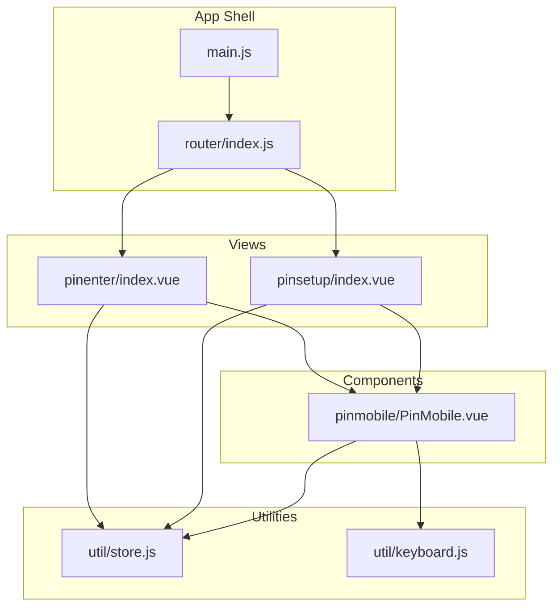
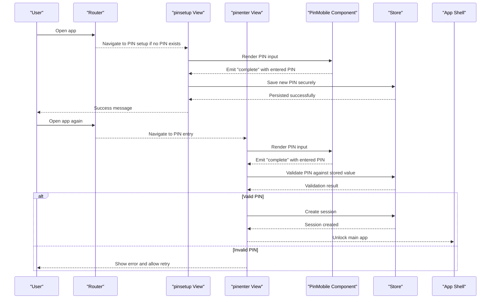
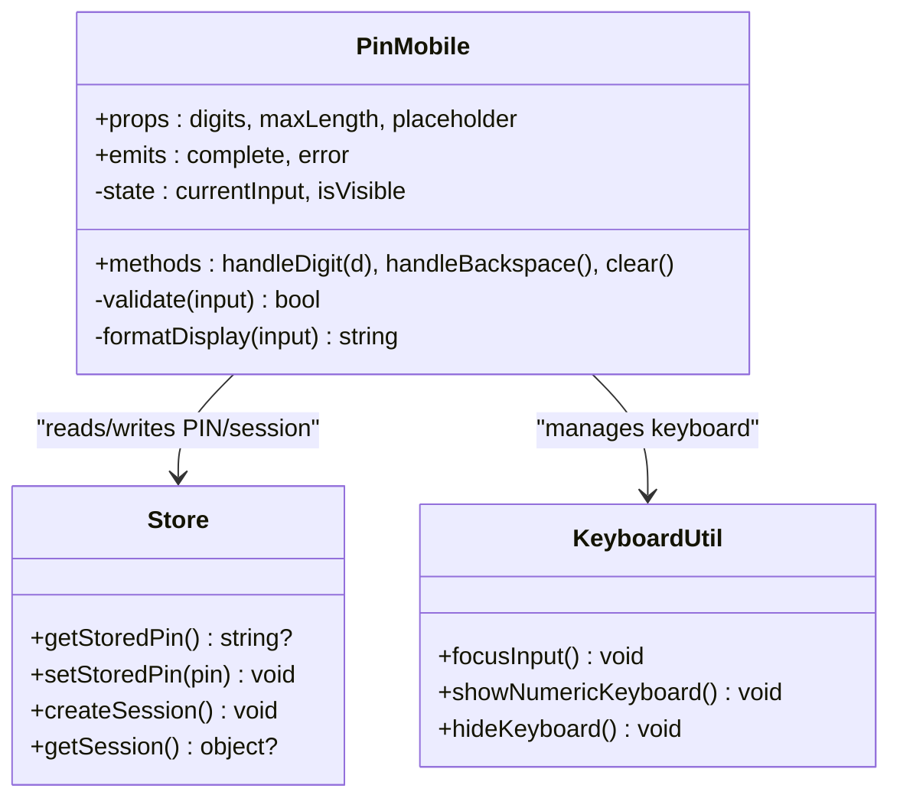
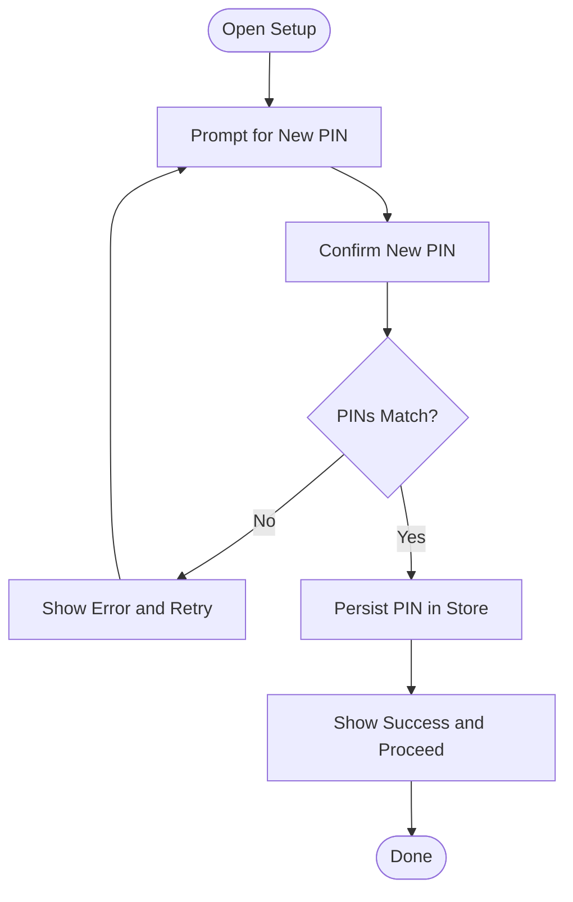
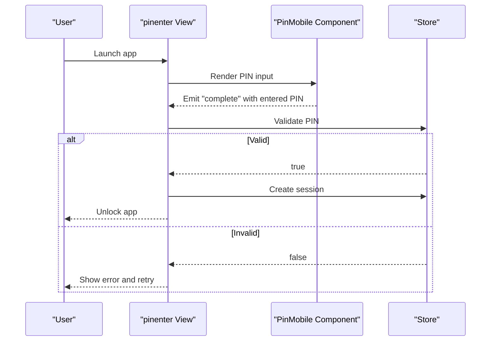
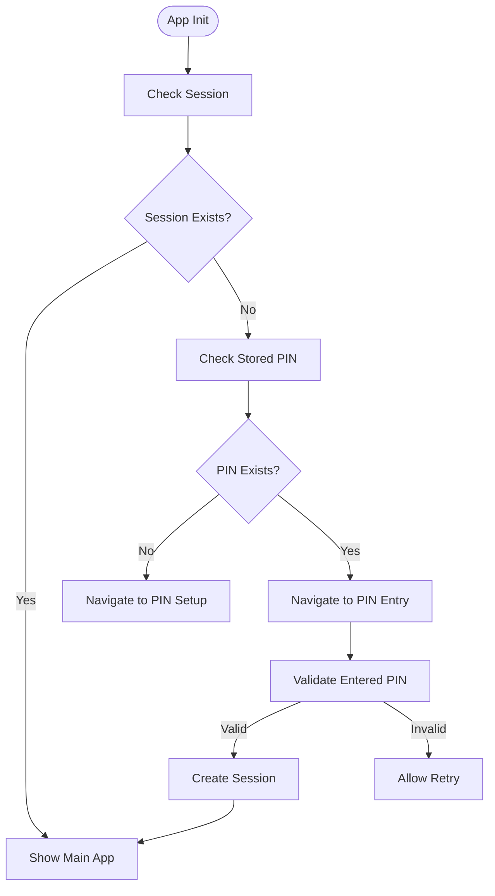
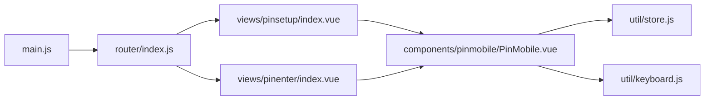

# Authentication System

<cite>
**Referenced Files in This Document**
- [PinMobile.vue](file://src/components/pinmobile/PinMobile.vue)
- [README.md](file://src/components/pinmobile/README.md)
- [index.vue](file://src/views/pinenter/index.vue)
- [index.vue](file://src/views/pinsetup/index.vue)
- [store.js](file://src/util/store.js)
- [keyboard.js](file://src/util/keyboard.js)
- [main.js](file://src/main.js)
- [router/index.js](file://src/router/index.js)
</cite>

## Table of Contents
1. [Introduction](#introduction)
2. [Project Structure](#project-structure)
3. [Core Components](#core-components)
4. [Architecture Overview](#architecture-overview)
5. [Detailed Component Analysis](#detailed-component-analysis)
6. [Dependency Analysis](#dependency-analysis)
7. [Performance Considerations](#performance-considerations)
8. [Troubleshooting Guide](#troubleshooting-guide)
9. [Conclusion](#conclusion)

## Introduction
This document explains the PIN-based authentication system, including setup and validation workflows, session management, security considerations, and mobile-specific UX patterns. It focuses on the PinMobile component, PIN entry interfaces, and integration with the application store for persistence and state synchronization.

## Project Structure
The PIN authentication spans a small set of focused components and utilities:
- UI components for PIN entry and setup
- A reusable PinMobile component for consistent input behavior
- Store integration for persistence and session state
- Keyboard utilities for mobile input optimization
- Routing to guide users through setup and login flows

**Diagram sources**
- [PinMobile.vue](file://src/components/pinmobile/PinMobile.vue)
- [README.md](file://src/components/pinmobile/README.md)
- [index.vue](file://src/views/pinenter/index.vue)
- [index.vue](file://src/views/pinsetup/index.vue)
- [store.js](file://src/util/store.js)
- [keyboard.js](file://src/util/keyboard.js)
- [main.js](file://src/main.js)
- [router/index.js](file://src/router/index.js)

**Section sources**
- [PinMobile.vue](file://src/components/pinmobile/PinMobile.vue)
- [README.md](file://src/components/pinmobile/README.md)
- [index.vue](file://src/views/pinenter/index.vue)
- [index.vue](file://src/views/pinsetup/index.vue)
- [store.js](file://src/util/store.js)
- [keyboard.js](file://src/util/keyboard.js)
- [main.js](file://src/main.js)
- [router/index.js](file://src/router/index.js)

## Core Components
- PinMobile: Reusable PIN input component providing masked entry, numeric-only constraints, touch-friendly controls, and keyboard hints. Emits events for completion and errors.
- pinsetup view: Guides first-time users through creating and confirming a PIN; persists the PIN securely via the store.
- pinenter view: Handles login by prompting for the PIN, validating against stored credentials, and managing session state.

Key responsibilities:
- Input handling and validation (length, format)
- Error feedback for incorrect attempts
- Session creation and persistence
- Mobile UX optimizations (touch targets, virtual keyboard behavior)

**Section sources**
- [PinMobile.vue](file://src/components/pinmobile/PinMobile.vue)
- [README.md](file://src/components/pinmobile/README.md)
- [index.vue](file://src/views/pinenter/index.vue)
- [index.vue](file://src/views/pinsetup/index.vue)
- [store.js](file://src/util/store.js)
- [keyboard.js](file://src/util/keyboard.js)

## Architecture Overview
The authentication flow is driven by views that orchestrate the PinMobile component and coordinate with the store for persistence and session state.

**Diagram sources**
- [index.vue](file://src/views/pinenter/index.vue)
- [index.vue](file://src/views/pinsetup/index.vue)
- [PinMobile.vue](file://src/components/pinmobile/PinMobile.vue)
- [store.js](file://src/util/store.js)
- [router/index.js](file://src/router/index.js)
- [main.js](file://src/main.js)

## Detailed Component Analysis

### PinMobile Component
Purpose:
- Provide a consistent, accessible, and mobile-friendly PIN input experience.
- Enforce numeric-only input, fixed length, and masking.
- Emit structured events for completion and errors.

Behavior highlights:
- Numeric-only constraint and mask display
- Touch-friendly digit buttons and backspace
- Optional hint to show/hide last digit
- Keyboard focus management and virtual keyboard hints
- Event emission on completion or invalid input

Integration points:
- Consumed by both setup and enter views
- Uses store for persistence operations when needed
- Leverages keyboard utility for mobile input optimization

**Diagram sources**
- [PinMobile.vue](file://src/components/pinmobile/PinMobile.vue)
- [store.js](file://src/util/store.js)
- [keyboard.js](file://src/util/keyboard.js)

**Section sources**
- [PinMobile.vue](file://src/components/pinmobile/PinMobile.vue)
- [README.md](file://src/components/pinmobile/README.md)
- [store.js](file://src/util/store.js)
- [keyboard.js](file://src/util/keyboard.js)

### PIN Setup Workflow (pinsetup view)
Responsibilities:
- Prompt user to create a new PIN
- Confirm PIN to prevent typos
- Persist the PIN securely via the store
- Provide clear success/error feedback

Flow overview:
- First run detection and navigation to setup
- Two-step entry: initial PIN and confirmation
- Validation of match and length/format
- Secure storage and transition to main app

**Diagram sources**
- [index.vue](file://src/views/pinsetup/index.vue)
- [store.js](file://src/util/store.js)

**Section sources**
- [index.vue](file://src/views/pinsetup/index.vue)
- [store.js](file://src/util/store.js)

### PIN Entry and Validation (pinenter view)
Responsibilities:
- Prompt for existing PIN
- Validate against stored PIN
- Manage session state upon successful validation
- Handle incorrect attempts with appropriate feedback

Validation logic:
- Compare entered PIN with stored PIN
- On success, create session and unlock app
- On failure, show error and allow retry

**Diagram sources**
- [index.vue](file://src/views/pinenter/index.vue)
- [PinMobile.vue](file://src/components/pinmobile/PinMobile.vue)
- [store.js](file://src/util/store.js)

**Section sources**
- [index.vue](file://src/views/pinenter/index.vue)
- [PinMobile.vue](file://src/components/pinmobile/PinMobile.vue)
- [store.js](file://src/util/store.js)

### Session Management and Persistence
- Store provides methods to persist PIN and manage session state.
- Session creation occurs after successful PIN validation.
- Session retrieval determines whether to show setup, entry, or main app.

**Diagram sources**
- [store.js](file://src/util/store.js)
- [router/index.js](file://src/router/index.js)
- [main.js](file://src/main.js)

**Section sources**
- [store.js](file://src/util/store.js)
- [router/index.js](file://src/router/index.js)
- [main.js](file://src/main.js)

### Mobile-Specific Considerations
- Touch input optimization: large digit buttons, clear visual feedback, and easy backspace.
- Virtual keyboard handling: force numeric keypad where possible, auto-focus input fields, and dismiss keyboard after submission.
- Accessibility: screen reader labels, high contrast, and sufficient tap target sizes.
- Performance: minimal re-renders during input, efficient event handling.

**Section sources**
- [PinMobile.vue](file://src/components/pinmobile/PinMobile.vue)
- [keyboard.js](file://src/util/keyboard.js)

## Dependency Analysis
The following diagram shows how the core modules depend on each other:

**Diagram sources**
- [router/index.js](file://src/router/index.js)
- [index.vue](file://src/views/pinenter/index.vue)
- [index.vue](file://src/views/pinsetup/index.vue)
- [PinMobile.vue](file://src/components/pinmobile/PinMobile.vue)
- [store.js](file://src/util/store.js)
- [keyboard.js](file://src/util/keyboard.js)
- [main.js](file://src/main.js)

**Section sources**
- [router/index.js](file://src/router/index.js)
- [index.vue](file://src/views/pinenter/index.vue)
- [index.vue](file://src/views/pinsetup/index.vue)
- [PinMobile.vue](file://src/components/pinmobile/PinMobile.vue)
- [store.js](file://src/util/store.js)
- [keyboard.js](file://src/util/keyboard.js)
- [main.js](file://src/main.js)

## Performance Considerations
- Keep PinMobile lightweight: avoid heavy computations during keystroke events.
- Debounce or throttle any network calls triggered by PIN changes (if applicable).
- Minimize DOM updates by batching state changes within the component.
- Use efficient keyboard utilities to reduce layout thrashing on mobile devices.

[No sources needed since this section provides general guidance]

## Troubleshooting Guide
Common issues and resolutions:
- PIN not saved: verify store persistence methods are called after confirmation and check for errors in the setup view.
- Incorrect PIN repeatedly: ensure validation compares against the stored value and that session is not prematurely created.
- Keyboard not showing numeric keypad: confirm keyboard utility is invoked and input attributes enforce numeric mode.
- Session not persisting across reloads: verify session creation and retrieval logic in the store and router initialization.

**Section sources**
- [index.vue](file://src/views/pinsetup/index.vue)
- [index.vue](file://src/views/pinenter/index.vue)
- [store.js](file://src/util/store.js)
- [keyboard.js](file://src/util/keyboard.js)

## Conclusion
The PIN-based authentication system centers around a reusable PinMobile component, coordinated by dedicated setup and entry views, and backed by a store for persistence and session management. The design emphasizes mobile-friendly input, clear error handling, and secure session control. Following the documented flows and best practices will help maintain a robust and user-friendly authentication experience.