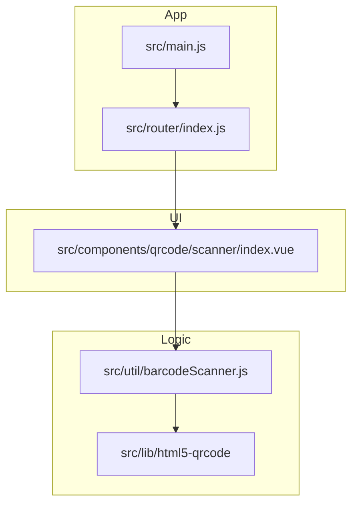
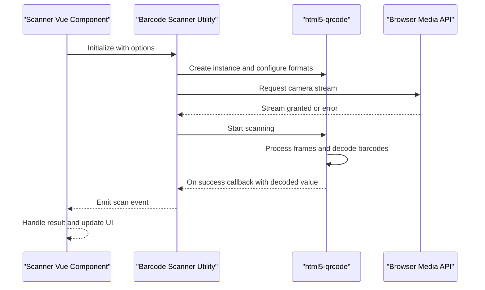
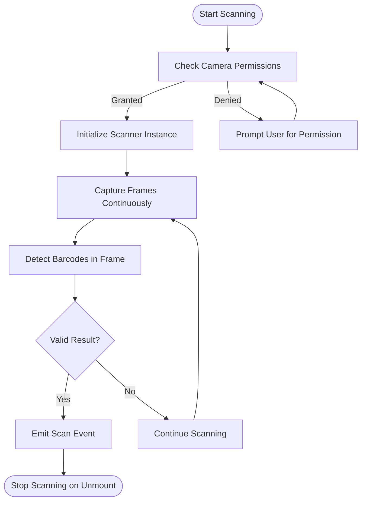
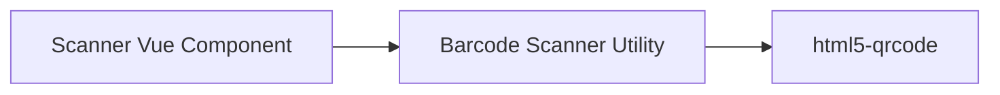

# Barcode Scanning System

<cite>
**Referenced Files in This Document**
- [index.vue](file://src/components/qrcode/scanner/index.vue)
- [barcodeScanner.js](file://src/util/barcodeScanner.js)
- [html5-qrcode](file://src/lib/html5-qrcode)
- [package.json](file://package.json)
- [main.js](file://src/main.js)
- [router/index.js](file://src/router/index.js)
</cite>

## Table of Contents
1. [Introduction](#introduction)
2. [Project Structure](#project-structure)
3. [Core Components](#core-components)
4. [Architecture Overview](#architecture-overview)
5. [Detailed Component Analysis](#detailed-component-analysis)
6. [Dependency Analysis](#dependency-analysis)
7. [Performance Considerations](#performance-considerations)
8. [Troubleshooting Guide](#troubleshooting-guide)
9. [Conclusion](#conclusion)

## Introduction
This document explains the barcode scanning system implemented in the project. It focuses on the camera-based barcode detection using the html5-qrcode library, supported formats (QR, EAN, UPC), and real-time scanning capabilities. It also documents the scanner component architecture, camera access permissions handling, error recovery mechanisms, scanning workflow, frame processing, and barcode validation logic. Configuration options, event handling, integration patterns, performance optimization techniques, browser compatibility considerations, and troubleshooting steps are included for practical use.

## Project Structure
The barcode scanning functionality is primarily implemented in:
- A Vue component that encapsulates the scanner UI and lifecycle
- A utility module that wraps the html5-qrcode library and centralizes configuration and callbacks
- The library itself located under src/lib/html5-qrcode
- Application entry points and routing that integrate the scanner into views

**Diagram sources**
- [main.js](file://src/main.js)
- [router/index.js](file://src/router/index.js)
- [index.vue](file://src/components/qrcode/scanner/index.vue)
- [barcodeScanner.js](file://src/util/barcodeScanner.js)
- [html5-qrcode](file://src/lib/html5-qrcode)

**Section sources**
- [index.vue](file://src/components/qrcode/scanner/index.vue)
- [barcodeScanner.js](file://src/util/barcodeScanner.js)
- [html5-qrcode](file://src/lib/html5-qrcode)
- [main.js](file://src/main.js)
- [router/index.js](file://src/router/index.js)

## Core Components
- Scanner Vue Component: Provides the user-facing scanner view, manages mounting/unmounting, and forwards events to the utility layer.
- Barcode Scanner Utility: Encapsulates html5-qrcode initialization, configuration, permission handling, scanning callbacks, and error management.
- html5-qrcode Library: Performs camera stream acquisition, frame decoding, and format-specific recognition.

Key responsibilities:
- Camera access and permission prompts
- Real-time scanning loop and frame processing
- Supported format selection and filtering
- Event emission for successful scans and errors
- Lifecycle management tied to component mount/unmount

**Section sources**
- [index.vue](file://src/components/qrcode/scanner/index.vue)
- [barcodeScanner.js](file://src/util/barcodeScanner.js)
- [html5-qrcode](file://src/lib/html5-qrcode)

## Architecture Overview
The scanner follows a layered architecture:
- Presentation Layer: Vue component renders the video preview and controls.
- Integration Layer: Utility module configures and orchestrates the html5-qrcode instance.
- Engine Layer: html5-qrcode handles media capture, decoding, and result delivery.

**Diagram sources**
- [index.vue](file://src/components/qrcode/scanner/index.vue)
- [barcodeScanner.js](file://src/util/barcodeScanner.js)
- [html5-qrcode](file://src/lib/html5-qrcode)

## Detailed Component Analysis

### Scanner Vue Component
Responsibilities:
- Mounts the scanner when the component becomes visible
- Unmounts and stops scanning to release resources
- Subscribes to scan results and emits application-level events
- Displays status messages and error feedback to users

Lifecycle and behavior:
- On mount: initialize the scanner utility and start scanning
- On unmount: stop scanning and clean up resources
- Error handling: surface errors from the utility and allow retry flows

Integration:
- Exposes methods/events for parent components to consume scan results
- Supports toggling between cameras and adjusting scanning regions via configuration passed to the utility

**Section sources**
- [index.vue](file://src/components/qrcode/scanner/index.vue)

### Barcode Scanner Utility
Responsibilities:
- Wraps html5-qrcode initialization and configuration
- Manages camera permissions and stream selection
- Configures supported formats (QR, EAN, UPC)
- Handles scanning callbacks and error propagation
- Provides a consistent interface for starting/stopping scanning

Configuration highlights:
- Format selection for QR, EAN, UPC
- Region-of-interest settings to constrain scanning area
- Camera device selection and facing mode preferences
- Callback hooks for success and error events

Error recovery:
- Catches permission denials and prompts re-attempts
- Retries scanning after transient failures
- Gracefully degrades if camera access is unavailable

**Section sources**
- [barcodeScanner.js](file://src/util/barcodeScanner.js)
- [html5-qrcode](file://src/lib/html5-qrcode)

### html5-qrcode Library Integration
Capabilities:
- Real-time camera stream processing
- Decoding of multiple barcode formats including QR, EAN, UPC
- Robust error reporting for media and decoding issues

Usage pattern:
- Instantiate with configuration
- Attach success and error handlers
- Start/stop scanning based on component lifecycle

**Section sources**
- [html5-qrcode](file://src/lib/html5-qrcode)
- [barcodeScanner.js](file://src/util/barcodeScanner.js)

### Scanning Workflow and Frame Processing
The scanning pipeline operates as follows:
- Camera stream acquisition and permission checks
- Frame extraction and preprocessing by the library
- Barcode detection and decoding per configured formats
- Validation and deduplication before emitting results
- Event dispatch to the Vue component for UI updates

**Diagram sources**
- [barcodeScanner.js](file://src/util/barcodeScanner.js)
- [html5-qrcode](file://src/lib/html5-qrcode)

### Supported Formats and Validation
Supported formats:
- QR Code
- EAN (EAN-8, EAN-13)
- UPC (UPC-A, UPC-E)

Validation logic:
- Ensures decoded values match expected length and checksum rules where applicable
- Filters out low-confidence detections
- Deduplicates repeated results within a short time window to avoid duplicate processing

**Section sources**
- [barcodeScanner.js](file://src/util/barcodeScanner.js)
- [html5-qrcode](file://src/lib/html5-qrcode)

### Configuration Options
Common configuration areas include:
- Formats: select which barcode types to enable
- Region: define scanning region to improve accuracy and performance
- Camera: choose front/back camera or specific device ID
- Callbacks: handle success and error events
- UI hints: display instructions or overlay text

These options are typically provided to the scanner utility during initialization and consumed by the underlying library.

**Section sources**
- [barcodeScanner.js](file://src/util/barcodeScanner.js)
- [index.vue](file://src/components/qrcode/scanner/index.vue)

### Event Handling and Integration Patterns
Event flow:
- Utility emits scan success with decoded value
- Vue component receives the event and triggers business logic
- Parent components can subscribe to custom events for further processing

Integration examples:
- Add scanned item to a list
- Trigger navigation to detail screens
- Update inventory or order state

**Section sources**
- [index.vue](file://src/components/qrcode/scanner/index.vue)
- [barcodeScanner.js](file://src/util/barcodeScanner.js)

## Dependency Analysis
External dependency:
- html5-qrcode library provides core scanning capabilities

Internal dependencies:
- Vue component depends on the scanner utility
- Utility depends on html5-qrcode

**Diagram sources**
- [index.vue](file://src/components/qrcode/scanner/index.vue)
- [barcodeScanner.js](file://src/util/barcodeScanner.js)
- [html5-qrcode](file://src/lib/html5-qrcode)

**Section sources**
- [package.json](file://package.json)
- [index.vue](file://src/components/qrcode/scanner/index.vue)
- [barcodeScanner.js](file://src/util/barcodeScanner.js)
- [html5-qrcode](file://src/lib/html5-qrcode)

## Performance Considerations
Optimization techniques:
- Limit scanning region to reduce frame analysis overhead
- Disable unused formats to decrease decoding workload
- Throttle scan result emissions to prevent redundant processing
- Use appropriate resolution and frame rate settings for target devices
- Stop scanning promptly on component unmount to free camera resources

Browser compatibility:
- Requires HTTPS context for camera access
- Modern browsers with WebRTC support recommended
- Fallback messaging for unsupported environments

[No sources needed since this section provides general guidance]

## Troubleshooting Guide
Common issues and resolutions:
- Camera permission denied: prompt user to grant access; ensure HTTPS context
- No camera detected: verify device availability and request permissions again
- Poor scanning accuracy: adjust region-of-interest and lighting conditions
- Duplicate scan events: implement deduplication and debounce strategies
- High CPU usage: reduce resolution, limit formats, and constrain scanning region

Recovery mechanisms:
- Automatic retry on transient errors
- Graceful degradation when camera is unavailable
- Clear error messages guiding user actions

**Section sources**
- [barcodeScanner.js](file://src/util/barcodeScanner.js)
- [index.vue](file://src/components/qrcode/scanner/index.vue)

## Conclusion
The barcode scanning system leverages the html5-qrcode library to deliver robust, real-time scanning across QR, EAN, and UPC formats. The Vue component encapsulates UI concerns while the utility module centralizes configuration, permissions, and error handling. By applying performance optimizations and following best practices for camera access and event handling, the system integrates smoothly into broader application workflows.