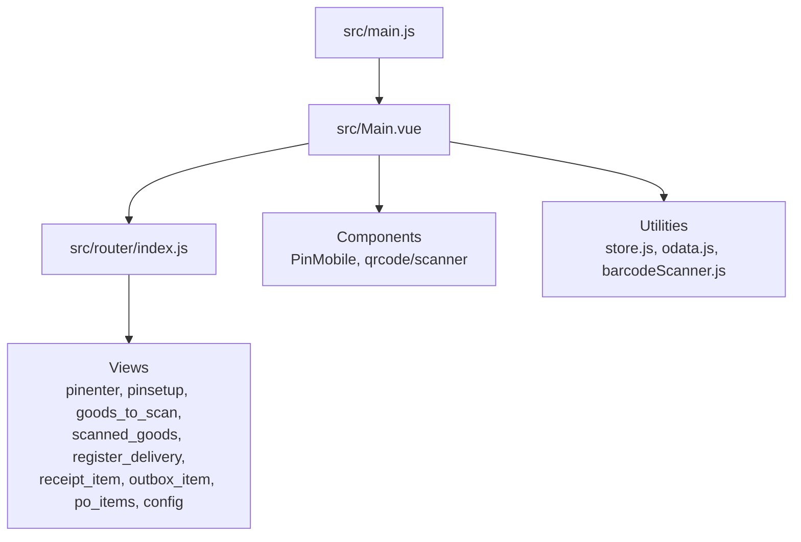
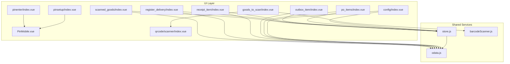
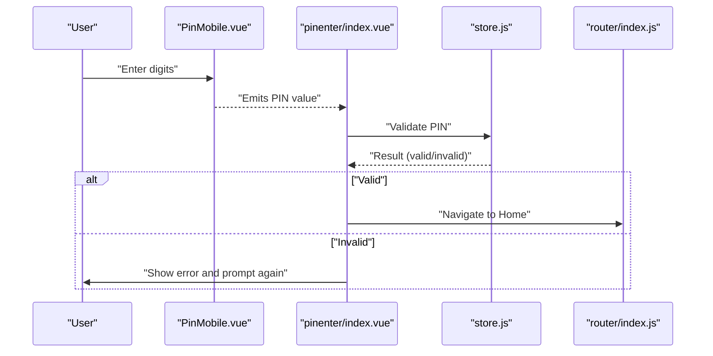
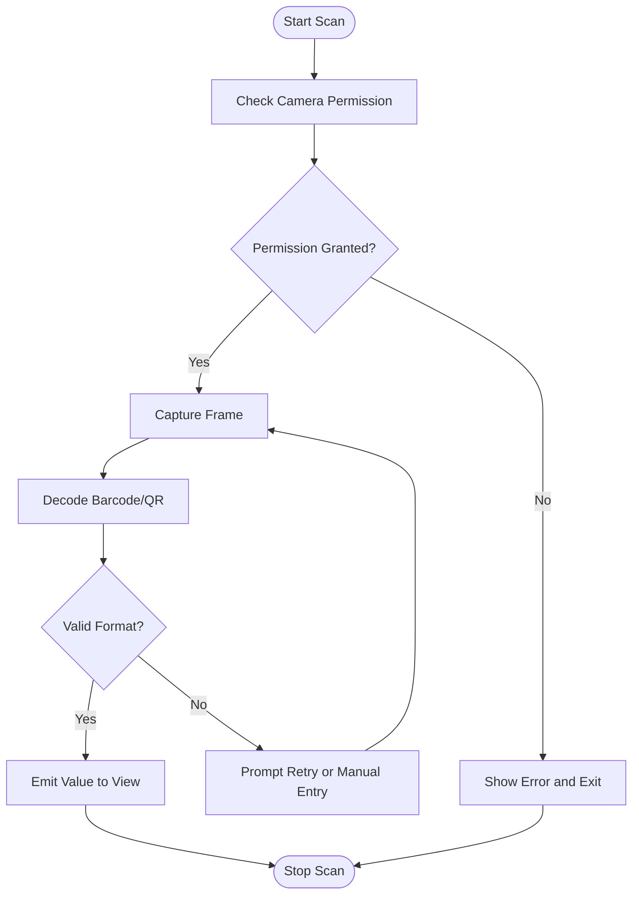
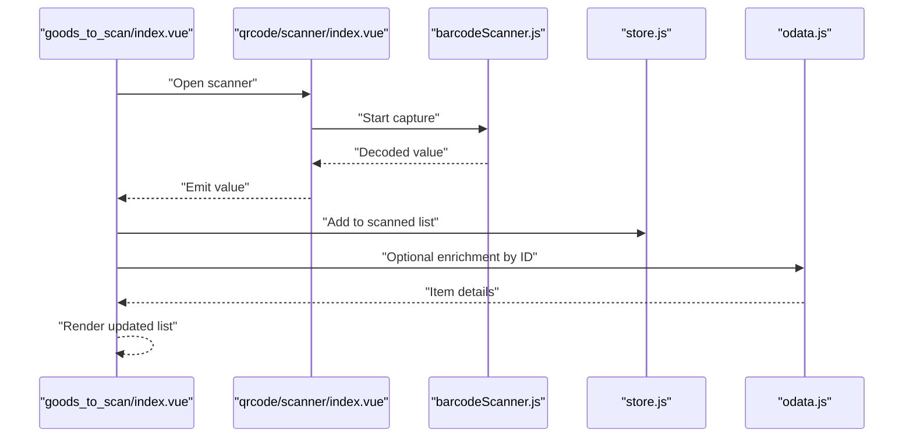
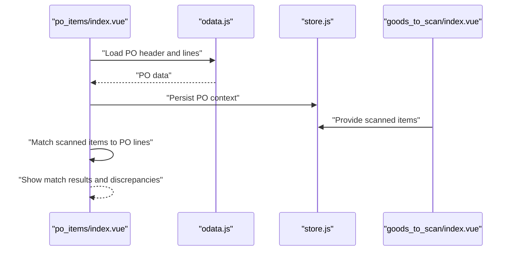
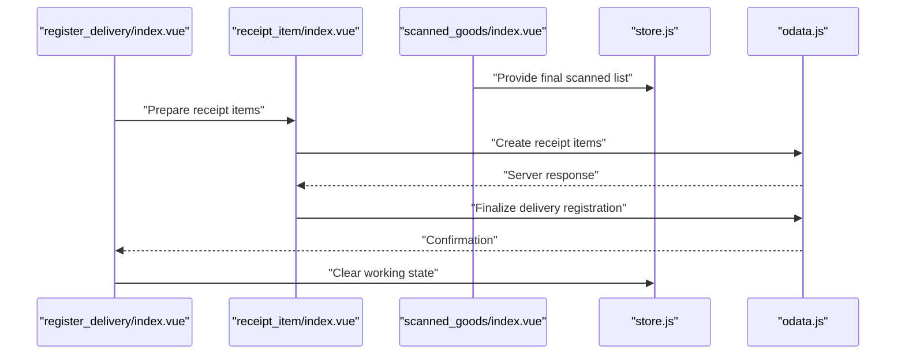
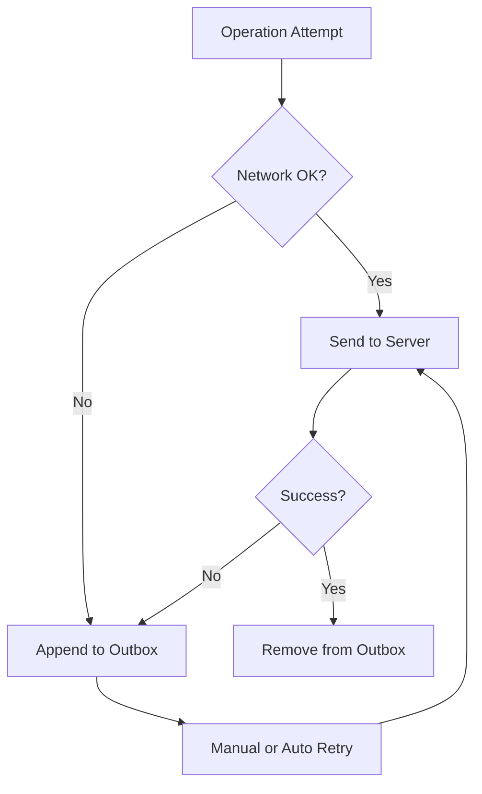
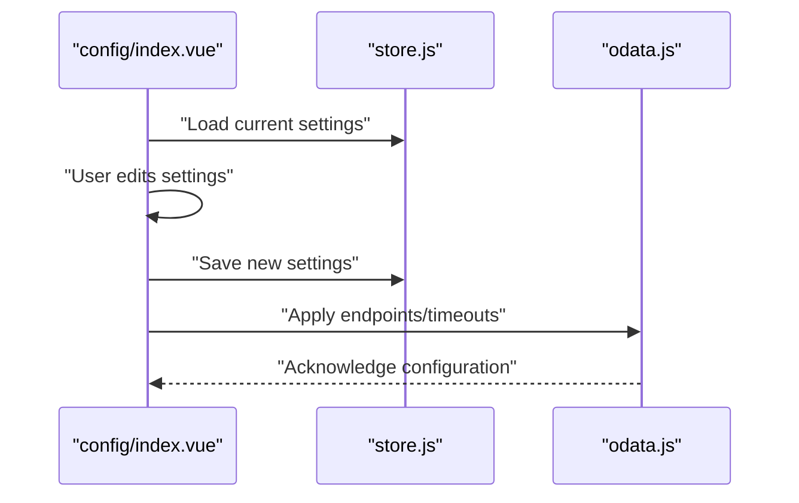
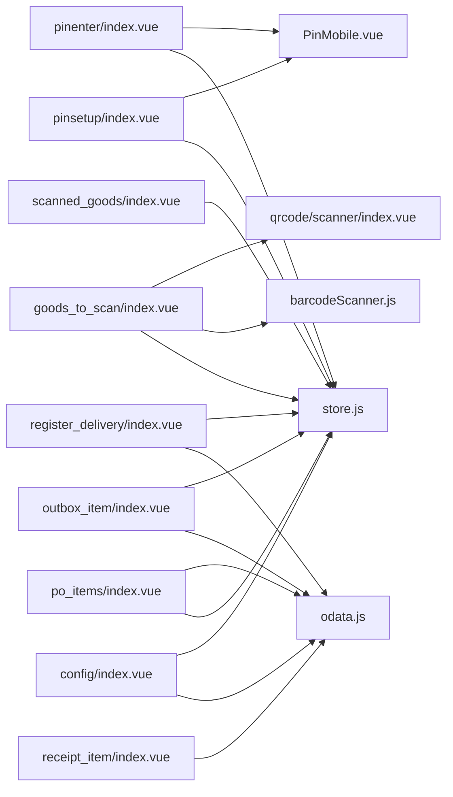

# Core Features

<cite>
**Referenced Files in This Document**
- [main.js](file://src/main.js)
- [Main.vue](file://src/Main.vue)
- [router/index.js](file://src/router/index.js)
- [util/store.js](file://src/util/store.js)
- [util/odata.js](file://src/util/odata.js)
- [util/barcodeScanner.js](file://src/util/barcodeScanner.js)
- [components/pinmobile/PinMobile.vue](file://src/components/pinmobile/PinMobile.vue)
- [views/pinenter/index.vue](file://src/views/pinenter/index.vue)
- [views/pinsetup/index.vue](file://src/views/pinsetup/index.vue)
- [components/qrcode/scanner/index.vue](file://src/components/qrcode/scanner/index.vue)
- [views/goods_to_scan/index.vue](file://src/views/goods_to_scan/index.vue)
- [views/scanned_goods/index.vue](file://src/views/scanned_goods/index.vue)
- [views/register_delivery/index.vue](file://src/views/register_delivery/index.vue)
- [views/receipt_item/index.vue](file://src/views/receipt_item/index.vue)
- [views/outbox_item/index.vue](file://src/views/outbox_item/index.vue)
- [views/po_items/index.vue](file://src/views/po_items/index.vue)
- [views/config/index.vue](file://src/views/config/index.vue)
</cite>

## Table of Contents
1. [Introduction](#introduction)
2. [Project Structure](#project-structure)
3. [Core Components](#core-components)
4. [Architecture Overview](#architecture-overview)
5. [Detailed Component Analysis](#detailed-component-analysis)
6. [Dependency Analysis](#dependency-analysis)
7. [Performance Considerations](#performance-considerations)
8. [Troubleshooting Guide](#troubleshooting-guide)
9. [Conclusion](#conclusion)

## Introduction
This document explains the core features of the ahm-gr-scanner application, focusing on:
- PIN authentication system for secure access and session control
- QR/barcode scanning module for item identification
- Inventory management views for scanned goods and delivery registration
- Purchase order processing flows
- Goods registration workflows from scan to receipt
It also covers user interaction patterns, data flow between modules, configuration options, error handling strategies, and user feedback mechanisms. Practical examples illustrate how these features work together to support inventory operations.

## Project Structure
The application is a Vue-based web app with modular views and reusable components. Key areas include:
- Application bootstrap and routing
- Global state store
- Utility services for OData integration and barcode scanning
- Feature-specific views (PIN entry/setup, scanning, goods, purchase orders, config)
- Reusable UI components (PIN pad, dialog, scanner)

**Diagram sources**
- [main.js](file://src/main.js)
- [Main.vue](file://src/Main.vue)
- [router/index.js](file://src/router/index.js)
- [util/store.js](file://src/util/store.js)
- [util/odata.js](file://src/util/odata.js)
- [util/barcodeScanner.js](file://src/util/barcodeScanner.js)
- [components/pinmobile/PinMobile.vue](file://src/components/pinmobile/PinMobile.vue)
- [components/qrcode/scanner/index.vue](file://src/components/qrcode/scanner/index.vue)
- [views/pinenter/index.vue](file://src/views/pinenter/index.vue)
- [views/pinsetup/index.vue](file://src/views/pinsetup/index.vue)
- [views/goods_to_scan/index.vue](file://src/views/goods_to_scan/index.vue)
- [views/scanned_goods/index.vue](file://src/views/scanned_goods/index.vue)
- [views/register_delivery/index.vue](file://src/views/register_delivery/index.vue)
- [views/receipt_item/index.vue](file://src/views/receipt_item/index.vue)
- [views/outbox_item/index.vue](file://src/views/outbox_item/index.vue)
- [views/po_items/index.vue](file://src/views/po_items/index.vue)
- [views/config/index.vue](file://src/views/config/index.vue)

**Section sources**
- [main.js](file://src/main.js)
- [Main.vue](file://src/Main.vue)
- [router/index.js](file://src/router/index.js)

## Core Components
- Application shell and routing: The main entry initializes the app and sets up routes for feature views.
- Global store: Centralized state for settings, current user/session, pending scans, and outbound queue.
- OData service: Encapsulates HTTP requests to backend services for entities like items, receipts, and purchase orders.
- Barcode scanner utility: Wraps camera and decoding logic for QR/barcode capture.
- PIN mobile component: Reusable PIN pad used across PIN entry and setup screens.
- Scanner component: Camera-based QR/barcode scanner view component.

Key responsibilities:
- Authentication gating via PIN
- Scanning input normalization and validation
- Data synchronization with backend via OData
- Local persistence for offline or retry scenarios
- User feedback through dialogs and status messages

**Section sources**
- [util/store.js](file://src/util/store.js)
- [util/odata.js](file://src/util/odata.js)
- [util/barcodeScanner.js](file://src/util/barcodeScanner.js)
- [components/pinmobile/PinMobile.vue](file://src/components/pinmobile/PinMobile.vue)
- [components/qrcode/scanner/index.vue](file://src/components/qrcode/scanner/index.vue)

## Architecture Overview
High-level architecture shows how views interact with shared utilities and components to implement end-to-end workflows.

**Diagram sources**
- [views/pinenter/index.vue](file://src/views/pinenter/index.vue)
- [views/pinsetup/index.vue](file://src/views/pinsetup/index.vue)
- [views/goods_to_scan/index.vue](file://src/views/goods_to_scan/index.vue)
- [views/scanned_goods/index.vue](file://src/views/scanned_goods/index.vue)
- [views/register_delivery/index.vue](file://src/views/register_delivery/index.vue)
- [views/receipt_item/index.vue](file://src/views/receipt_item/index.vue)
- [views/outbox_item/index.vue](file://src/views/outbox_item/index.vue)
- [views/po_items/index.vue](file://src/views/po_items/index.vue)
- [views/config/index.vue](file://src/views/config/index.vue)
- [components/pinmobile/PinMobile.vue](file://src/components/pinmobile/PinMobile.vue)
- [components/qrcode/scanner/index.vue](file://src/components/qrcode/scanner/index.vue)
- [util/store.js](file://src/util/store.js)
- [util/odata.js](file://src/util/odata.js)
- [util/barcodeScanner.js](file://src/util/barcodeScanner.js)

## Detailed Component Analysis

### PIN Authentication System
Purpose:
- Enforce PIN-based access control
- Allow initial PIN setup and change
- Maintain session state and guard protected routes

User interactions:
- Enter PIN on first launch or when session expires
- Set or change PIN during setup
- Receive immediate feedback for invalid attempts and success

Data flow:
- PinMobile component emits typed digits
- PIN entry view validates against stored PIN
- Store updates session state and navigates to home or setup

Error handling:
- Invalid PIN prompts re-entry
- Locked-out behavior after repeated failures (if implemented)
- Clear messages guide users

**Diagram sources**
- [components/pinmobile/PinMobile.vue](file://src/components/pinmobile/PinMobile.vue)
- [views/pinenter/index.vue](file://src/views/pinenter/index.vue)
- [util/store.js](file://src/util/store.js)
- [router/index.js](file://src/router/index.js)

**Section sources**
- [views/pinenter/index.vue](file://src/views/pinenter/index.vue)
- [views/pinsetup/index.vue](file://src/views/pinsetup/index.vue)
- [components/pinmobile/PinMobile.vue](file://src/components/pinmobile/PinMobile.vue)
- [util/store.js](file://src/util/store.js)

### QR/Barcode Scanning Module
Purpose:
- Capture QR/barcodes using device camera
- Normalize and validate decoded values
- Feed identifiers into downstream workflows

User interactions:
- Start/stop scanning
- Immediate visual/audio feedback on successful decode
- Manual fallback entry if needed

Data flow:
- Scanner component reads frames and decodes codes
- Decoded value emitted to owning view
- View normalizes input and proceeds to lookup or add to list

Error handling:
- Camera permission denied
- No code detected
- Invalid format handling

**Diagram sources**
- [components/qrcode/scanner/index.vue](file://src/components/qrcode/scanner/index.vue)
- [util/barcodeScanner.js](file://src/util/barcodeScanner.js)

**Section sources**
- [components/qrcode/scanner/index.vue](file://src/components/qrcode/scanner/index.vue)
- [util/barcodeScanner.js](file://src/util/barcodeScanner.js)

### Inventory Management: Scanned Goods
Purpose:
- Track items added by scanning
- Display scanned list with details
- Support removal and bulk actions

User interactions:
- Add items via scanner or manual entry
- Review scanned list
- Remove duplicates or incorrect entries

Data flow:
- Scanned value enters local list in store
- Optional enrichment via OData lookup
- List persists until submission or reset

Error handling:
- Duplicate detection
- Lookup failures handled gracefully

**Diagram sources**
- [views/goods_to_scan/index.vue](file://src/views/goods_to_scan/index.vue)
- [components/qrcode/scanner/index.vue](file://src/components/qrcode/scanner/index.vue)
- [util/barcodeScanner.js](file://src/util/barcodeScanner.js)
- [util/store.js](file://src/util/store.js)
- [util/odata.js](file://src/util/odata.js)

**Section sources**
- [views/goods_to_scan/index.vue](file://src/views/goods_to_scan/index.vue)
- [views/scanned_goods/index.vue](file://src/views/scanned_goods/index.vue)
- [util/store.js](file://src/util/store.js)
- [util/odata.js](file://src/util/odata.js)

### Purchase Order Processing
Purpose:
- Load and display purchase order items
- Associate scanned goods with PO lines
- Validate quantities and line matching

User interactions:
- Select or search PO
- View PO lines and quantities
- Confirm matches and adjust as needed

Data flow:
- Fetch PO header and lines via OData
- Map scanned IDs to PO lines
- Update local state for confirmation

Error handling:
- Network errors
- Missing PO or lines
- Quantity mismatches

**Diagram sources**
- [views/po_items/index.vue](file://src/views/po_items/index.vue)
- [util/odata.js](file://src/util/odata.js)
- [util/store.js](file://src/util/store.js)
- [views/goods_to_scan/index.vue](file://src/views/goods_to_scan/index.vue)

**Section sources**
- [views/po_items/index.vue](file://src/views/po_items/index.vue)
- [util/odata.js](file://src/util/odata.js)
- [util/store.js](file://src/util/store.js)

### Goods Registration Workflows
Purpose:
- Register delivered goods into the system
- Create receipt items and finalize delivery registration

User interactions:
- Choose delivery context
- Confirm scanned goods
- Submit receipt items

Data flow:
- Aggregate scanned goods
- Build receipt payloads
- Post to backend via OData
- Persist confirmation and clear working lists

Error handling:
- Validation errors before submit
- Server-side rejection with actionable messages
- Retry mechanism for failed submissions

**Diagram sources**
- [views/register_delivery/index.vue](file://src/views/register_delivery/index.vue)
- [views/receipt_item/index.vue](file://src/views/receipt_item/index.vue)
- [views/scanned_goods/index.vue](file://src/views/scanned_goods/index.vue)
- [util/store.js](file://src/util/store.js)
- [util/odata.js](file://src/util/odata.js)

**Section sources**
- [views/register_delivery/index.vue](file://src/views/register_delivery/index.vue)
- [views/receipt_item/index.vue](file://src/views/receipt_item/index.vue)
- [views/scanned_goods/index.vue](file://src/views/scanned_goods/index.vue)
- [util/store.js](file://src/util/store.js)
- [util/odata.js](file://src/util/odata.js)

### Outbox and Offline Handling
Purpose:
- Queue operations when offline or when server is unavailable
- Retry and sync when connectivity is restored

User interactions:
- See queued items
- Trigger manual retry
- Clear successfully sent items

Data flow:
- Failed operations appended to outbox
- Background or manual sync pushes items
- Success removes from outbox

Error handling:
- Conflict resolution guidance
- Clear status indicators per item

**Diagram sources**
- [views/outbox_item/index.vue](file://src/views/outbox_item/index.vue)
- [util/store.js](file://src/util/store.js)
- [util/odata.js](file://src/util/odata.js)

**Section sources**
- [views/outbox_item/index.vue](file://src/views/outbox_item/index.vue)
- [util/store.js](file://src/util/store.js)
- [util/odata.js](file://src/util/odata.js)

### Configuration Options
Purpose:
- Configure connection endpoints, timeouts, and feature flags
- Persist settings locally for reuse

User interactions:
- Edit settings in config view
- Save and apply changes
- Reset to defaults if needed

Data flow:
- Settings read/written via store
- OData service uses configured endpoints

Error handling:
- Validate inputs before saving
- Warn about incompatible combinations

**Diagram sources**
- [views/config/index.vue](file://src/views/config/index.vue)
- [util/store.js](file://src/util/store.js)
- [util/odata.js](file://src/util/odata.js)

**Section sources**
- [views/config/index.vue](file://src/views/config/index.vue)
- [util/store.js](file://src/util/store.js)
- [util/odata.js](file://src/util/odata.js)

## Dependency Analysis
Component and module dependencies are organized around shared services and reusable UI components. Views depend on store and OData for data operations; scanning depends on the scanner utility; PIN flows depend on the PIN component and store.

**Diagram sources**
- [views/pinenter/index.vue](file://src/views/pinenter/index.vue)
- [views/pinsetup/index.vue](file://src/views/pinsetup/index.vue)
- [components/pinmobile/PinMobile.vue](file://src/components/pinmobile/PinMobile.vue)
- [views/goods_to_scan/index.vue](file://src/views/goods_to_scan/index.vue)
- [components/qrcode/scanner/index.vue](file://src/components/qrcode/scanner/index.vue)
- [util/barcodeScanner.js](file://src/util/barcodeScanner.js)
- [util/store.js](file://src/util/store.js)
- [views/scanned_goods/index.vue](file://src/views/scanned_goods/index.vue)
- [views/register_delivery/index.vue](file://src/views/register_delivery/index.vue)
- [views/receipt_item/index.vue](file://src/views/receipt_item/index.vue)
- [views/outbox_item/index.vue](file://src/views/outbox_item/index.vue)
- [views/po_items/index.vue](file://src/views/po_items/index.vue)
- [views/config/index.vue](file://src/views/config/index.vue)
- [util/odata.js](file://src/util/odata.js)

**Section sources**
- [util/store.js](file://src/util/store.js)
- [util/odata.js](file://src/util/odata.js)
- [util/barcodeScanner.js](file://src/util/barcodeScanner.js)
- [components/pinmobile/PinMobile.vue](file://src/components/pinmobile/PinMobile.vue)
- [components/qrcode/scanner/index.vue](file://src/components/qrcode/scanner/index.vue)

## Performance Considerations
- Debounce rapid scans to avoid duplicate entries
- Batch OData requests where possible
- Use pagination for large PO or item lists
- Keep scanned lists lightweight; offload heavy computations to background tasks
- Cache frequently accessed reference data locally when appropriate

[No sources needed since this section provides general guidance]

## Troubleshooting Guide
Common issues and resolutions:
- Camera not available: Ensure permissions granted; fall back to manual entry
- Invalid barcode format: Prompt user to verify label and rescan
- Network errors: Check configuration endpoints; use outbox to retry later
- PIN lockouts: Follow on-screen instructions to reset via setup flow
- Stale data: Refresh lists and re-fetch from server

**Section sources**
- [util/barcodeScanner.js](file://src/util/barcodeScanner.js)
- [util/odata.js](file://src/util/odata.js)
- [util/store.js](file://src/util/store.js)
- [views/pinenter/index.vue](file://src/views/pinenter/index.vue)
- [views/pinsetup/index.vue](file://src/views/pinsetup/index.vue)

## Conclusion
The ahm-gr-scanner integrates PIN authentication, robust scanning, and end-to-end inventory workflows. Shared services centralize state and network operations, while modular views provide focused user experiences. Together, these features enable efficient goods registration, purchase order reconciliation, and reliable delivery processing with clear user feedback and resilient error handling.