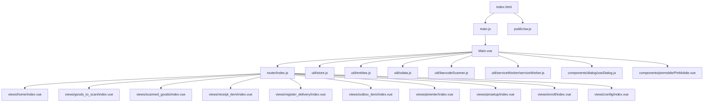
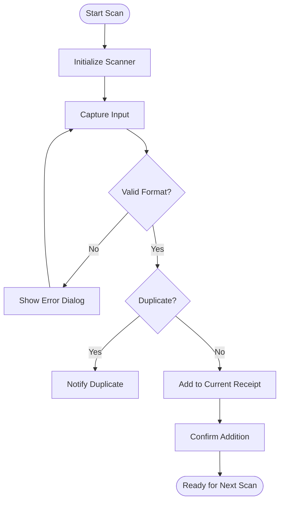
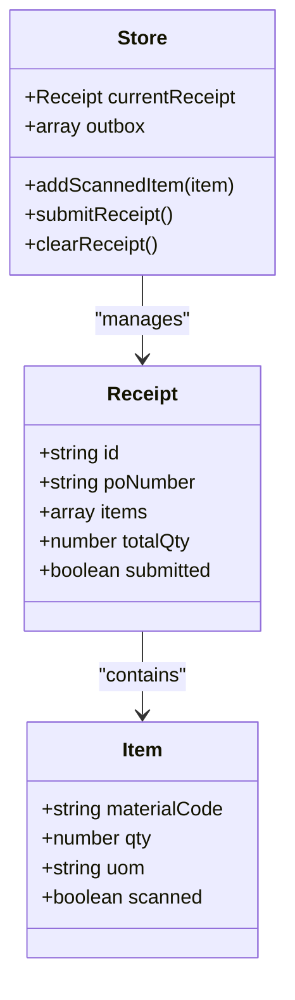
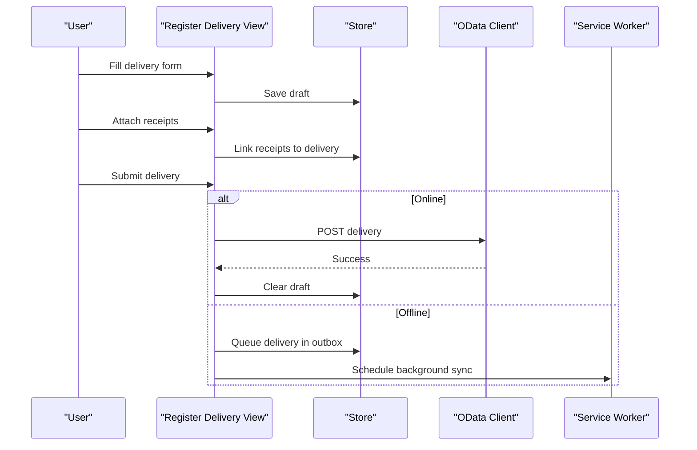
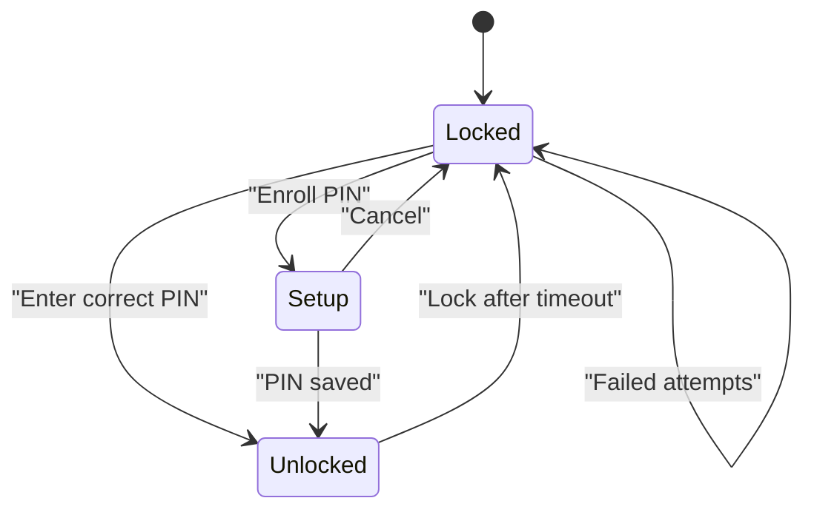
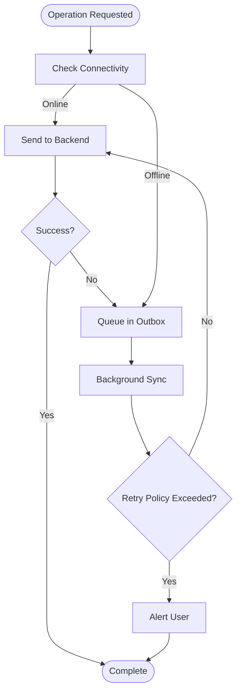
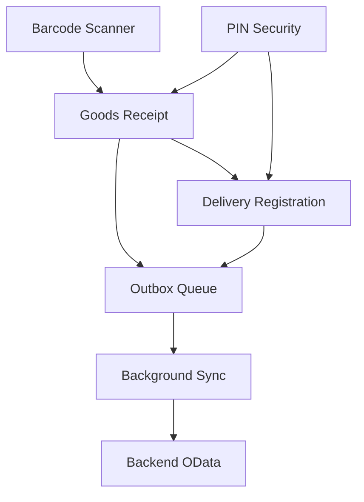
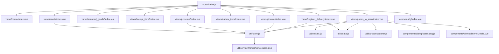

# Core Features

<cite>
**Referenced Files in This Document**
- [README.md](file://README.md)
- [index.html](file://index.html)
- [main.js](file://src/main.js)
- [Main.vue](file://src/Main.vue)
- [router/index.js](file://src/router/index.js)
- [util/store.js](file://src/util/store.js)
- [util/entities.js](file://src/util/entities.js)
- [util/odata.js](file://src/util/odata.js)
- [util/barcodeScanner.js](file://src/util/barcodeScanner.js)
- [util/serviceWorker/serviceWorker.js](file://src/util/serviceWorker/serviceWorker.js)
- [components/dialog/useDialog.js](file://src/components/dialog/useDialog.js)
- [components/pinmobile/PinMobile.vue](file://src/components/pinmobile/PinMobile.vue)
- [views/home/index.vue](file://src/views/home/index.vue)
- [views/goods_to_scan/index.vue](file://src/views/goods_to_scan/index.vue)
- [views/scanned_goods/index.vue](file://src/views/scanned_goods/index.vue)
- [views/receipt_item/index.vue](file://src/views/receipt_item/index.vue)
- [views/register_delivery/index.vue](file://src/views/register_delivery/index.vue)
- [views/outbox_item/index.vue](file://src/views/outbox_item/index.vue)
- [views/pinenter/index.vue](file://src/views/pinenter/index.vue)
- [views/pinsetup/index.vue](file://src/views/pinsetup/index.vue)
- [views/enroll/index.vue](file://src/views/enroll/index.vue)
- [views/config/index.vue](file://src/views/config/index.vue)
- [public/sw.js](file://public/sw.js)
</cite>

## Table of Contents
1. [Introduction](#introduction)
2. [Project Structure](#project-structure)
3. [Core Components](#core-components)
4. [Architecture Overview](#architecture-overview)
5. [Detailed Component Analysis](#detailed-component-analysis)
6. [Dependency Analysis](#dependency-analysis)
7. [Performance Considerations](#performance-considerations)
8. [Troubleshooting Guide](#troubleshooting-guide)
9. [Conclusion](#conclusion)

## Introduction
This document explains the core features of the AHM GR Scanner, focusing on barcode scanning, goods receipt management, delivery registration, PIN security, and offline capabilities. It describes user workflows, business logic, technical implementation, integration points, data models, state management, error handling, validation rules, and user feedback mechanisms. The goal is to make the system understandable for both technical and non-technical users involved in warehouse operations.

## Project Structure
The application is a Vue-based single-page app with:
- Views for each feature (home, scanning, receipts, deliveries, PIN entry/setup, outbox).
- Shared utilities for store, entities, OData client, barcode scanning, and service worker.
- Reusable components for dialogs and PIN input.
- Routing configuration that ties views together.

**Diagram sources**
- [index.html:1-200](file://index.html#L1-L200)
- [main.js:1-200](file://src/main.js#L1-L200)
- [Main.vue:1-200](file://src/Main.vue#L1-L200)
- [router/index.js:1-200](file://src/router/index.js#L1-L200)
- [util/store.js:1-200](file://src/util/store.js#L1-L200)
- [util/entities.js:1-200](file://src/util/entities.js#L1-L200)
- [util/odata.js:1-200](file://src/util/odata.js#L1-L200)
- [util/barcodeScanner.js:1-200](file://src/util/barcodeScanner.js#L1-L200)
- [util/serviceWorker/serviceWorker.js:1-200](file://src/util/serviceWorker/serviceWorker.js#L1-L200)
- [components/dialog/useDialog.js:1-200](file://src/components/dialog/useDialog.js#L1-L200)
- [components/pinmobile/PinMobile.vue:1-200](file://src/components/pinmobile/PinMobile.vue#L1-L200)
- [views/home/index.vue:1-200](file://src/views/home/index.vue#L1-L200)
- [views/goods_to_scan/index.vue:1-200](file://src/views/goods_to_scan/index.vue#L1-L200)
- [views/scanned_goods/index.vue:1-200](file://src/views/scanned_goods/index.vue#L1-L200)
- [views/receipt_item/index.vue:1-200](file://src/views/receipt_item/index.vue#L1-L200)
- [views/register_delivery/index.vue:1-200](file://src/views/register_delivery/index.vue#L1-L200)
- [views/outbox_item/index.vue:1-200](file://src/views/outbox_item/index.vue#L1-L200)
- [views/pinenter/index.vue:1-200](file://src/views/pinenter/index.vue#L1-L200)
- [views/pinsetup/index.vue:1-200](file://src/views/pinsetup/index.vue#L1-L200)
- [views/enroll/index.vue:1-200](file://src/views/enroll/index.vue#L1-L200)
- [views/config/index.vue:1-200](file://src/views/config/index.vue#L1-L200)
- [public/sw.js:1-200](file://public/sw.js#L1-L200)

**Section sources**
- [README.md:1-200](file://README.md#L1-L200)
- [index.html:1-200](file://index.html#L1-L200)
- [main.js:1-200](file://src/main.js#L1-L200)
- [Main.vue:1-200](file://src/Main.vue#L1-L200)
- [router/index.js:1-200](file://src/router/index.js#L1-L200)

## Core Components
- Store: Centralized reactive state for scanned items, receipts, deliveries, PIN status, and outbox queue.
- Entities: Data model definitions used across views and services.
- OData Client: HTTP communication layer for backend synchronization.
- Barcode Scanner: Utility to capture barcodes from camera or hardware scanner.
- Service Worker: Offline caching and background sync support.
- Dialogs: Reusable confirmation/info prompts.
- PIN Mobile: PIN pad component for secure access.

Key responsibilities:
- State persistence and cross-view consistency via the store.
- Validation and transformation of entity data before sending to backend.
- Robust error handling and retry strategies for network calls.
- Offline-first behavior with queued operations and eventual consistency.

**Section sources**
- [util/store.js:1-200](file://src/util/store.js#L1-L200)
- [util/entities.js:1-200](file://src/util/entities.js#L1-L200)
- [util/odata.js:1-200](file://src/util/odata.js#L1-L200)
- [util/barcodeScanner.js:1-200](file://src/util/barcodeScanner.js#L1-L200)
- [util/serviceWorker/serviceWorker.js:1-200](file://src/util/serviceWorker/serviceWorker.js#L1-L200)
- [components/dialog/useDialog.js:1-200](file://src/components/dialog/useDialog.js#L1-L200)
- [components/pinmobile/PinMobile.vue:1-200](file://src/components/pinmobile/PinMobile.vue#L1-L200)

## Architecture Overview
The app follows an offline-first architecture:
- Views render UI and orchestrate actions.
- Store holds application state and persists it locally.
- Utilities provide domain-specific functionality (scanning, OData, SW).
- Service Worker caches assets and supports background sync when online.

```mermaid
sequenceDiagram
participant User as "User"
participant View as "Goods To Scan View"
participant Store as "Store"
participant Scanner as "Barcode Scanner"
participant OData as "OData Client"
participant SW as "Service Worker"
User->>View : Open Goods Receipt screen
View->>Store : Initialize state
User->>Scanner : Scan barcode
Scanner-->>View : Barcode value
View->>Store : Add item to current receipt
View->>OData : Fetch PO details (if needed)
OData-->>View : PO items
View->>Store : Update receipt items
User->>View : Submit receipt
alt Online
View->>OData : POST receipt
OData-->>View : Success
View->>Store : Clear receipt
else Offline
View->>Store : Queue receipt in outbox
View->>SW : Register background sync
SW-->>View : Sync later
end
```

**Diagram sources**
- [views/goods_to_scan/index.vue:1-200](file://src/views/goods_to_scan/index.vue#L1-L200)
- [util/store.js:1-200](file://src/util/store.js#L1-L200)
- [util/barcodeScanner.js:1-200](file://src/util/barcodeScanner.js#L1-L200)
- [util/odata.js:1-200](file://src/util/odata.js#L1-L200)
- [util/serviceWorker/serviceWorker.js:1-200](file://src/util/serviceWorker/serviceWorker.js#L1-L200)
- [public/sw.js:1-200](file://public/sw.js#L1-L200)

## Detailed Component Analysis

### Barcode Scanning System
User workflow:
- Navigate to Goods To Scan view.
- Start camera or use hardware scanner.
- On successful scan, add item to current receipt.
- Review scanned list and proceed to submit.

Business logic:
- Validate scanned values against expected formats.
- Deduplicate scans within the same session.
- Enforce quantity limits per PO line if applicable.

Technical implementation:
- Barcode utility abstracts camera/hardware input.
- View listens to scan events and updates store.
- Errors are surfaced via dialog prompts.

**Diagram sources**
- [util/barcodeScanner.js:1-200](file://src/util/barcodeScanner.js#L1-L200)
- [views/goods_to_scan/index.vue:1-200](file://src/views/goods_to_scan/index.vue#L1-L200)
- [components/dialog/useDialog.js:1-200](file://src/components/dialog/useDialog.js#L1-L200)

**Section sources**
- [util/barcodeScanner.js:1-200](file://src/util/barcodeScanner.js#L1-L200)
- [views/goods_to_scan/index.vue:1-200](file://src/views/goods_to_scan/index.vue#L1-L200)
- [components/dialog/useDialog.js:1-200](file://src/components/dialog/useDialog.js#L1-L200)

### Goods Receipt Management
User workflow:
- Select or create a receipt.
- Add items by scanning or manual entry.
- Review totals and discrepancies.
- Submit receipt; if offline, queue for later sync.

Business logic:
- Maintain receipt state in store.
- Validate quantities and unit-of-measure conversions.
- Compute totals and flag exceptions.

Technical implementation:
- Store manages receipt lifecycle and persistence.
- OData client handles GET/POST operations.
- Outbox queue stores pending receipts until sync succeeds.

**Diagram sources**
- [util/entities.js:1-200](file://src/util/entities.js#L1-L200)
- [util/store.js:1-200](file://src/util/store.js#L1-L200)
- [views/goods_to_scan/index.vue:1-200](file://src/views/goods_to_scan/index.vue#L1-L200)
- [views/receipt_item/index.vue:1-200](file://src/views/receipt_item/index.vue#L1-L200)

**Section sources**
- [util/entities.js:1-200](file://src/util/entities.js#L1-L200)
- [util/store.js:1-200](file://src/util/store.js#L1-L200)
- [views/goods_to_scan/index.vue:1-200](file://src/views/goods_to_scan/index.vue#L1-L200)
- [views/receipt_item/index.vue:1-200](file://src/views/receipt_item/index.vue#L1-L200)

### Delivery Registration
User workflow:
- Enter delivery details (e.g., carrier, reference).
- Attach one or more receipts to the delivery.
- Submit delivery; if offline, queue for later sync.

Business logic:
- Validate delivery fields and required attachments.
- Ensure receipts are finalized before attaching.
- Track delivery status and sync results.

Technical implementation:
- Delivery creation uses OData client.
- Store maintains delivery draft and submission state.
- Outbox queue ensures eventual consistency.

**Diagram sources**
- [views/register_delivery/index.vue:1-200](file://src/views/register_delivery/index.vue#L1-L200)
- [util/store.js:1-200](file://src/util/store.js#L1-L200)
- [util/odata.js:1-200](file://src/util/odata.js#L1-L200)
- [util/serviceWorker/serviceWorker.js:1-200](file://src/util/serviceWorker/serviceWorker.js#L1-L200)

**Section sources**
- [views/register_delivery/index.vue:1-200](file://src/views/register_delivery/index.vue#L1-L200)
- [util/store.js:1-200](file://src/util/store.js#L1-L200)
- [util/odata.js:1-200](file://src/util/odata.js#L1-L200)
- [util/serviceWorker/serviceWorker.js:1-200](file://src/util/serviceWorker/serviceWorker.js#L1-L200)

### PIN Security System
User workflow:
- First-time setup: enroll and set a PIN.
- Subsequent sessions: enter PIN to unlock sensitive actions.
- Failed attempts trigger lockout or re-enrollment prompts.

Business logic:
- Securely store PIN hash locally.
- Enforce minimum length and complexity rules.
- Limit failed attempts and provide feedback.

Technical implementation:
- PIN pad component captures input.
- Store tracks PIN status and attempt counters.
- Dialogs inform users about errors and next steps.

**Diagram sources**
- [views/pinenter/index.vue:1-200](file://src/views/pinenter/index.vue#L1-L200)
- [views/pinsetup/index.vue:1-200](file://src/views/pinsetup/index.vue#L1-L200)
- [views/enroll/index.vue:1-200](file://src/views/enroll/index.vue#L1-L200)
- [components/pinmobile/PinMobile.vue:1-200](file://src/components/pinmobile/PinMobile.vue#L1-L200)
- [util/store.js:1-200](file://src/util/store.js#L1-L200)
- [components/dialog/useDialog.js:1-200](file://src/components/dialog/useDialog.js#L1-L200)

**Section sources**
- [views/pinenter/index.vue:1-200](file://src/views/pinenter/index.vue#L1-L200)
- [views/pinsetup/index.vue:1-200](file://src/views/pinsetup/index.vue#L1-L200)
- [views/enroll/index.vue:1-200](file://src/views/enroll/index.vue#L1-L200)
- [components/pinmobile/PinMobile.vue:1-200](file://src/components/pinmobile/PinMobile.vue#L1-L200)
- [util/store.js:1-200](file://src/util/store.js#L1-L200)
- [components/dialog/useDialog.js:1-200](file://src/components/dialog/useDialog.js#L1-L200)

### Offline Capabilities
User workflow:
- Continue scanning and creating receipts/deliveries without connectivity.
- App queues operations locally.
- When online, background sync pushes queued items.

Business logic:
- Idempotent operations to avoid duplicates.
- Conflict resolution strategy for concurrent changes.
- Retry policies with exponential backoff.

Technical implementation:
- Service Worker caches static assets and API responses where appropriate.
- Store persists outbox entries to local storage.
- Background sync triggers when connection is restored.

**Diagram sources**
- [util/serviceWorker/serviceWorker.js:1-200](file://src/util/serviceWorker/serviceWorker.js#L1-L200)
- [public/sw.js:1-200](file://public/sw.js#L1-L200)
- [util/store.js:1-200](file://src/util/store.js#L1-L200)
- [util/odata.js:1-200](file://src/util/odata.js#L1-L200)

**Section sources**
- [util/serviceWorker/serviceWorker.js:1-200](file://src/util/serviceWorker/serviceWorker.js#L1-L200)
- [public/sw.js:1-200](file://public/sw.js#L1-L200)
- [util/store.js:1-200](file://src/util/store.js#L1-L200)
- [util/odata.js:1-200](file://src/util/odata.js#L1-L200)

### Integration Points Between Features
- Barcode scanning feeds into goods receipt management.
- Goods receipts are attached to deliveries during registration.
- PIN security gates access to sensitive operations like submission.
- Offline queue integrates across all write operations (receipts, deliveries).
- Store acts as the central source of truth shared by all views.

**Diagram sources**
- [util/barcodeScanner.js:1-200](file://src/util/barcodeScanner.js#L1-L200)
- [views/goods_to_scan/index.vue:1-200](file://src/views/goods_to_scan/index.vue#L1-L200)
- [views/register_delivery/index.vue:1-200](file://src/views/register_delivery/index.vue#L1-L200)
- [views/pinenter/index.vue:1-200](file://src/views/pinenter/index.vue#L1-L200)
- [util/store.js:1-200](file://src/util/store.js#L1-L200)
- [util/odata.js:1-200](file://src/util/odata.js#L1-L200)
- [util/serviceWorker/serviceWorker.js:1-200](file://src/util/serviceWorker/serviceWorker.js#L1-L200)

**Section sources**
- [util/barcodeScanner.js:1-200](file://src/util/barcodeScanner.js#L1-L200)
- [views/goods_to_scan/index.vue:1-200](file://src/views/goods_to_scan/index.vue#L1-L200)
- [views/register_delivery/index.vue:1-200](file://src/views/register_delivery/index.vue#L1-L200)
- [views/pinenter/index.vue:1-200](file://src/views/pinenter/index.vue#L1-L200)
- [util/store.js:1-200](file://src/util/store.js#L1-L200)
- [util/odata.js:1-200](file://src/util/odata.js#L1-L200)
- [util/serviceWorker/serviceWorker.js:1-200](file://src/util/serviceWorker/serviceWorker.js#L1-L200)

## Dependency Analysis
High-level dependencies:
- Views depend on store, utilities, and reusable components.
- Store depends on entities and persistence helpers.
- OData client encapsulates HTTP interactions.
- Service Worker provides offline caching and background tasks.

**Diagram sources**
- [router/index.js:1-200](file://src/router/index.js#L1-L200)
- [views/home/index.vue:1-200](file://src/views/home/index.vue#L1-L200)
- [views/goods_to_scan/index.vue:1-200](file://src/views/goods_to_scan/index.vue#L1-L200)
- [views/scanned_goods/index.vue:1-200](file://src/views/scanned_goods/index.vue#L1-L200)
- [views/receipt_item/index.vue:1-200](file://src/views/receipt_item/index.vue#L1-L200)
- [views/register_delivery/index.vue:1-200](file://src/views/register_delivery/index.vue#L1-L200)
- [views/outbox_item/index.vue:1-200](file://src/views/outbox_item/index.vue#L1-L200)
- [views/pinenter/index.vue:1-200](file://src/views/pinenter/index.vue#L1-L200)
- [views/pinsetup/index.vue:1-200](file://src/views/pinsetup/index.vue#L1-L200)
- [views/enroll/index.vue:1-200](file://src/views/enroll/index.vue#L1-L200)
- [views/config/index.vue:1-200](file://src/views/config/index.vue#L1-L200)
- [util/store.js:1-200](file://src/util/store.js#L1-L200)
- [util/entities.js:1-200](file://src/util/entities.js#L1-L200)
- [util/odata.js:1-200](file://src/util/odata.js#L1-L200)
- [util/barcodeScanner.js:1-200](file://src/util/barcodeScanner.js#L1-L200)
- [util/serviceWorker/serviceWorker.js:1-200](file://src/util/serviceWorker/serviceWorker.js#L1-L200)
- [components/dialog/useDialog.js:1-200](file://src/components/dialog/useDialog.js#L1-L200)
- [components/pinmobile/PinMobile.vue:1-200](file://src/components/pinmobile/PinMobile.vue#L1-L200)

**Section sources**
- [router/index.js:1-200](file://src/router/index.js#L1-L200)
- [util/store.js:1-200](file://src/util/store.js#L1-L200)
- [util/entities.js:1-200](file://src/util/entities.js#L1-L200)
- [util/odata.js:1-200](file://src/util/odata.js#L1-L200)
- [util/barcodeScanner.js:1-200](file://src/util/barcodeScanner.js#L1-L200)
- [util/serviceWorker/serviceWorker.js:1-200](file://src/util/serviceWorker/serviceWorker.js#L1-L200)
- [components/dialog/useDialog.js:1-200](file://src/components/dialog/useDialog.js#L1-L200)
- [components/pinmobile/PinMobile.vue:1-200](file://src/components/pinmobile/PinMobile.vue#L1-L200)

## Performance Considerations
- Minimize re-renders by keeping store state granular and avoiding unnecessary updates.
- Debounce rapid barcode inputs to prevent duplicate processing.
- Use pagination or lazy loading for large lists (e.g., scanned goods).
- Cache frequently accessed read-only data via service worker where safe.
- Implement retry with backoff for network failures to reduce server load.

[No sources needed since this section provides general guidance]

## Troubleshooting Guide
Common issues and resolutions:
- Barcode not detected:
  - Verify camera permissions and lighting conditions.
  - Ensure format matches expected patterns.
  - Check scanner initialization logs.
- Submission fails offline:
  - Confirm outbox contains pending items.
  - Wait for background sync or manually retry.
- PIN lockouts:
  - Follow re-enrollment flow after max attempts.
  - Clear PIN cache only through authorized admin action.
- UI unresponsive:
  - Inspect store mutations for heavy operations.
  - Break long-running tasks into smaller chunks.

Operational checks:
- Verify service worker registration and cache status.
- Confirm OData endpoint reachability and credentials.
- Review dialog messages for actionable hints.

**Section sources**
- [util/barcodeScanner.js:1-200](file://src/util/barcodeScanner.js#L1-L200)
- [util/store.js:1-200](file://src/util/store.js#L1-L200)
- [util/odata.js:1-200](file://src/util/odata.js#L1-L200)
- [util/serviceWorker/serviceWorker.js:1-200](file://src/util/serviceWorker/serviceWorker.js#L1-L200)
- [components/dialog/useDialog.js:1-200](file://src/components/dialog/useDialog.js#L1-L200)

## Conclusion
The AHM GR Scanner provides an integrated, offline-capable solution for warehouse goods receipt and delivery operations. Its modular design separates concerns across views, store, and utilities, enabling robust barcode scanning, secure PIN access, and reliable background synchronization. By following the documented workflows and leveraging the outlined error handling and validation strategies, operators can maintain high throughput and data integrity even in challenging environments.