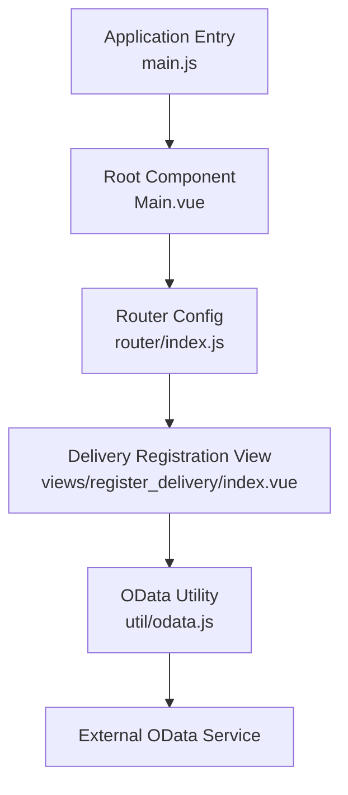
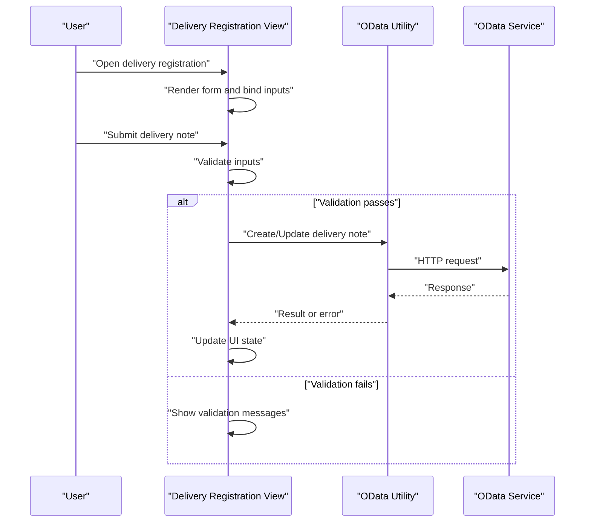
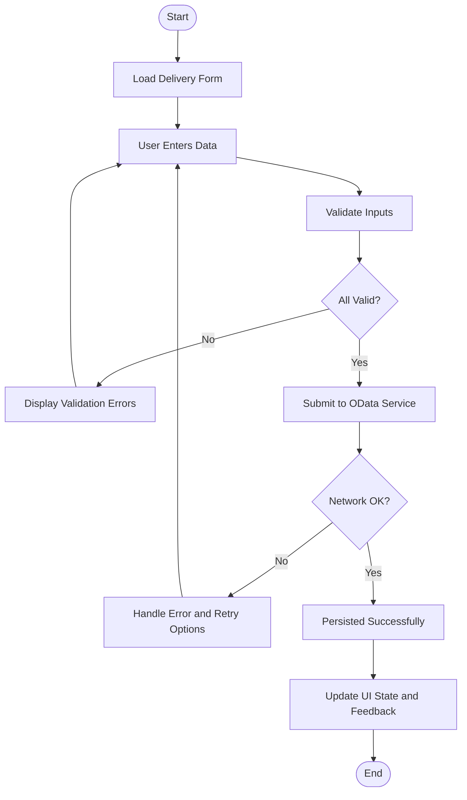
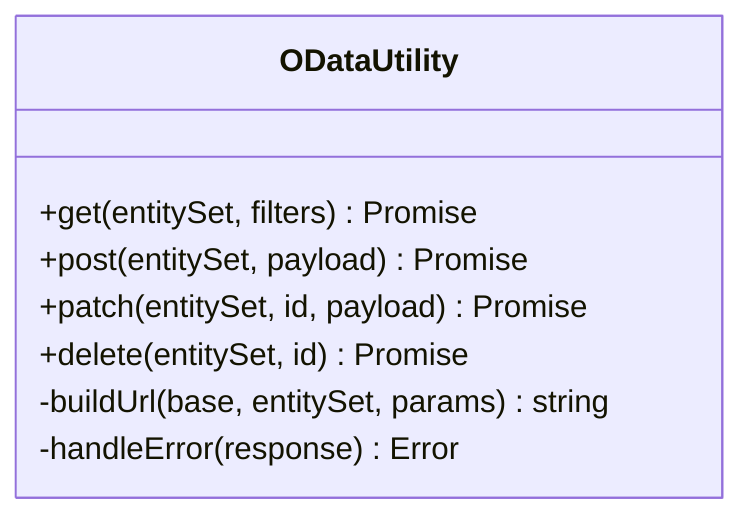
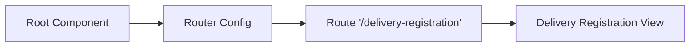
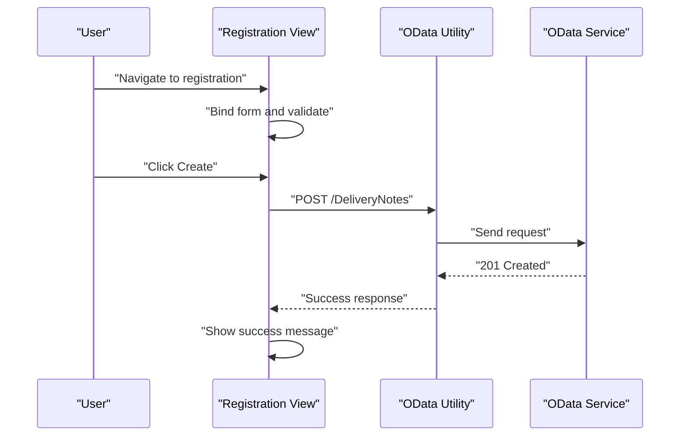
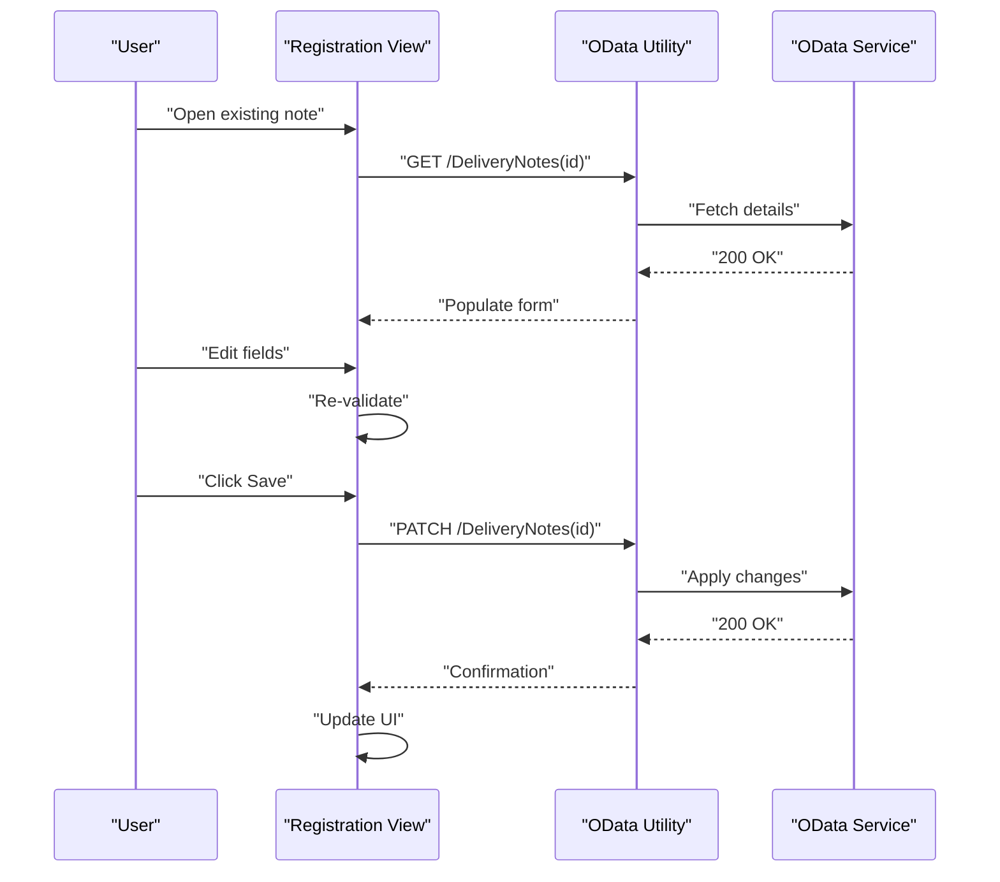
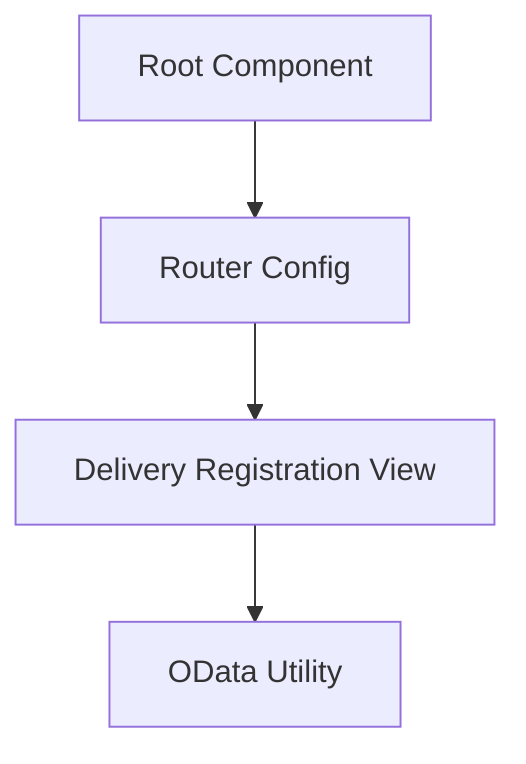

# Delivery Note Processing

<cite>
**Referenced Files in This Document**
- [register_delivery/index.vue](file://src/views/register_delivery/index.vue)
- [util/odata.js](file://src/util/odata.js)
- [router/index.js](file://src/router/index.js)
- [Main.vue](file://src/Main.vue)
- [main.js](file://src/main.js)
</cite>

## Table of Contents
1. [Introduction](#introduction)
2. [Project Structure](#project-structure)
3. [Core Components](#core-components)
4. [Architecture Overview](#architecture-overview)
5. [Detailed Component Analysis](#detailed-component-analysis)
6. [Dependency Analysis](#dependency-analysis)
7. [Performance Considerations](#performance-considerations)
8. [Troubleshooting Guide](#troubleshooting-guide)
9. [Conclusion](#conclusion)

## Introduction
This document explains the delivery note processing component, focusing on how delivery notes are created, validated, and managed within the system. It covers the delivery registration workflow, including data entry forms, validation rules, business logic, integration with external systems via OData APIs, error handling mechanisms, and status tracking. Examples illustrate creation and modification operations, common use cases, form validation, user input handling, and data persistence strategies.

## Project Structure
The delivery note functionality is implemented as a Vue-based view integrated into the application’s router and main entry points. The key files involved are:
- A dedicated view for registering deliveries
- An OData utility for interacting with backend services
- Router configuration to expose the delivery registration route
- Application bootstrap and root components

**Diagram sources**
- [main.js](file://src/main.js)
- [Main.vue](file://src/Main.vue)
- [router/index.js](file://src/router/index.js)
- [register_delivery/index.vue](file://src/views/register_delivery/index.vue)
- [util/odata.js](file://src/util/odata.js)

**Section sources**
- [main.js](file://src/main.js)
- [Main.vue](file://src/Main.vue)
- [router/index.js](file://src/router/index.js)
- [register_delivery/index.vue](file://src/views/register_delivery/index.vue)
- [util/odata.js](file://src/util/odata.js)

## Core Components
- Delivery Registration View: Provides the UI for creating and managing delivery notes, including form fields, validation feedback, and actions (create, update).
- OData Utility: Encapsulates HTTP interactions with the backend OData service, handling requests, responses, and errors.
- Router: Exposes the delivery registration route and navigates users to the appropriate view.
- Root and Entry: Initialize the app and mount the root component that hosts routing and views.

Key responsibilities:
- Capture user inputs for delivery note attributes
- Validate inputs before submission
- Persist data by calling OData endpoints
- Display success or error states to the user
- Support modifications to existing delivery notes

**Section sources**
- [register_delivery/index.vue](file://src/views/register_delivery/index.vue)
- [util/odata.js](file://src/util/odata.js)
- [router/index.js](file://src/router/index.js)
- [Main.vue](file://src/Main.vue)
- [main.js](file://src/main.js)

## Architecture Overview
The delivery note processing follows a client-side workflow where the view orchestrates user interactions, validates data, and delegates network calls to the OData utility. The backend exposes OData endpoints for creating and updating delivery notes.

**Diagram sources**
- [register_delivery/index.vue](file://src/views/register_delivery/index.vue)
- [util/odata.js](file://src/util/odata.js)

## Detailed Component Analysis

### Delivery Registration Workflow
The delivery registration workflow encompasses data entry, validation, submission, and feedback.

**Diagram sources**
- [register_delivery/index.vue](file://src/views/register_delivery/index.vue)
- [util/odata.js](file://src/util/odata.js)

#### Data Entry Forms
- Fields capture core delivery attributes such as identifiers, dates, quantities, and references.
- Binding ensures two-way synchronization between UI elements and internal model state.
- Real-time validation provides immediate feedback to guide correct input.

#### Validation Rules
- Required fields must be present and non-empty.
- Date fields must conform to expected formats and logical constraints (e.g., not in the past if required).
- Numeric fields enforce ranges and precision.
- Cross-field validations ensure consistency (e.g., total quantity matches sum of items).

#### Business Logic
- Before submission, the view aggregates and normalizes data.
- Duplicate checks may be performed locally or via backend queries.
- Status transitions are enforced (e.g., draft to submitted).

**Section sources**
- [register_delivery/index.vue](file://src/views/register_delivery/index.vue)

### OData Integration
The OData utility centralizes communication with the backend service.

- Request construction: Builds URLs, headers, and payloads according to OData conventions.
- Response handling: Parses successful responses and maps them to domain objects.
- Error handling: Captures network failures, server errors, and validation errors from the backend.

**Diagram sources**
- [util/odata.js](file://src/util/odata.js)

**Section sources**
- [util/odata.js](file://src/util/odata.js)

### Routing and Navigation
The router exposes the delivery registration route and integrates it into the application shell.

- Route definition maps a URL path to the delivery registration view.
- Navigation guards can enforce preconditions (e.g., authentication).
- The root component mounts the router and renders the active view.

**Diagram sources**
- [router/index.js](file://src/router/index.js)
- [Main.vue](file://src/Main.vue)

**Section sources**
- [router/index.js](file://src/router/index.js)
- [Main.vue](file://src/Main.vue)

### Example Operations

#### Create Delivery Note
- Steps:
  - Open the delivery registration view.
  - Fill in required fields and validate.
  - Submit the form to create a new delivery note.
  - Receive confirmation and update UI state.

**Diagram sources**
- [register_delivery/index.vue](file://src/views/register_delivery/index.vue)
- [util/odata.js](file://src/util/odata.js)

#### Modify Existing Delivery Note
- Steps:
  - Load an existing delivery note by ID.
  - Edit fields and re-validate.
  - Patch changes to persist updates.
  - Reflect updated values in the UI.

**Diagram sources**
- [register_delivery/index.vue](file://src/views/register_delivery/index.vue)
- [util/odata.js](file://src/util/odata.js)

### Common Use Cases
- Creating a new delivery note from scratch.
- Editing a draft delivery note before final submission.
- Resubmitting after correcting validation errors.
- Viewing status updates and history through UI feedback.

[No sources needed since this section summarizes general usage patterns]

## Dependency Analysis
The delivery note processing depends on the following relationships:
- The registration view depends on the OData utility for all backend interactions.
- The router config binds the view to a URL path.
- The root component initializes the application and mounts the router.

**Diagram sources**
- [register_delivery/index.vue](file://src/views/register_delivery/index.vue)
- [util/odata.js](file://src/util/odata.js)
- [router/index.js](file://src/router/index.js)
- [Main.vue](file://src/Main.vue)

**Section sources**
- [register_delivery/index.vue](file://src/views/register_delivery/index.vue)
- [util/odata.js](file://src/util/odata.js)
- [router/index.js](file://src/router/index.js)
- [Main.vue](file://src/Main.vue)

## Performance Considerations
- Minimize unnecessary re-renders by keeping form state localized and only updating when necessary.
- Debounce heavy validations or remote checks to reduce overhead.
- Cache frequently accessed reference data (e.g., product catalogs) to avoid repeated network calls.
- Use efficient pagination or filtering when loading related entities.
- Optimize payload sizes by sending only changed fields during updates.

[No sources needed since this section provides general guidance]

## Troubleshooting Guide
Common issues and resolutions:
- Network errors: Check connectivity, retry options, and inspect error responses from the OData utility.
- Validation failures: Review field-level error messages and ensure inputs meet required formats and constraints.
- Server errors: Inspect status codes and error payloads; log relevant context for debugging.
- State inconsistencies: Verify that UI state reflects backend responses and reset forms appropriately after errors.

Operational tips:
- Enable detailed logging around OData calls to trace request/response cycles.
- Provide clear user feedback for both success and failure scenarios.
- Implement graceful fallbacks for offline or degraded service conditions.

**Section sources**
- [util/odata.js](file://src/util/odata.js)
- [register_delivery/index.vue](file://src/views/register_delivery/index.vue)

## Conclusion
The delivery note processing component offers a structured approach to creating, validating, and managing delivery notes. By leveraging a dedicated view for user interactions, a robust OData utility for backend integration, and clear routing, the system supports reliable workflows for delivery registration and modification. Proper validation, error handling, and user feedback ensure a smooth experience while maintaining data integrity and operational efficiency.