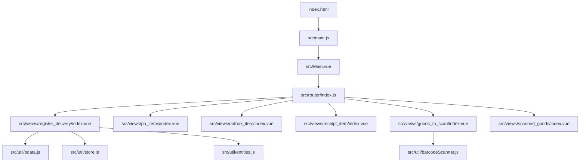
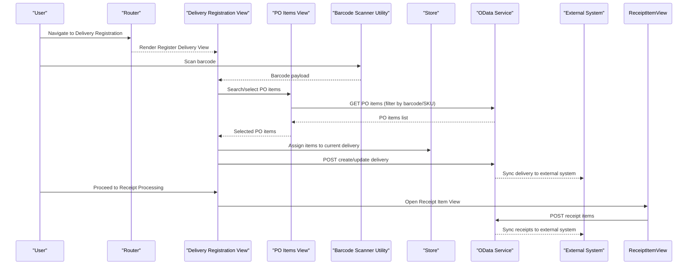
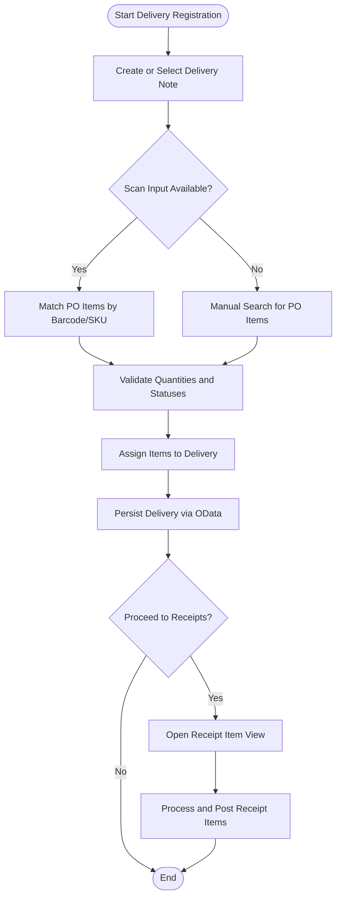
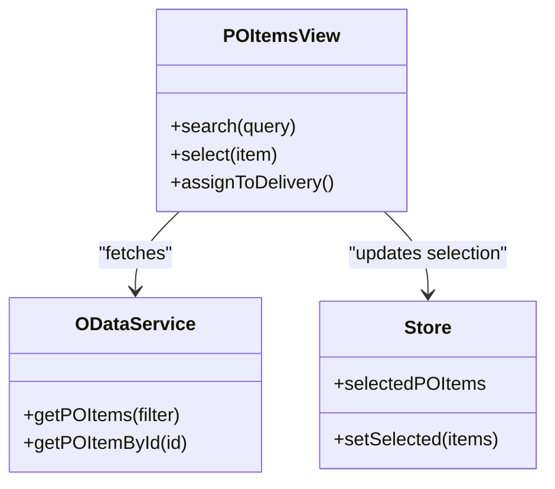
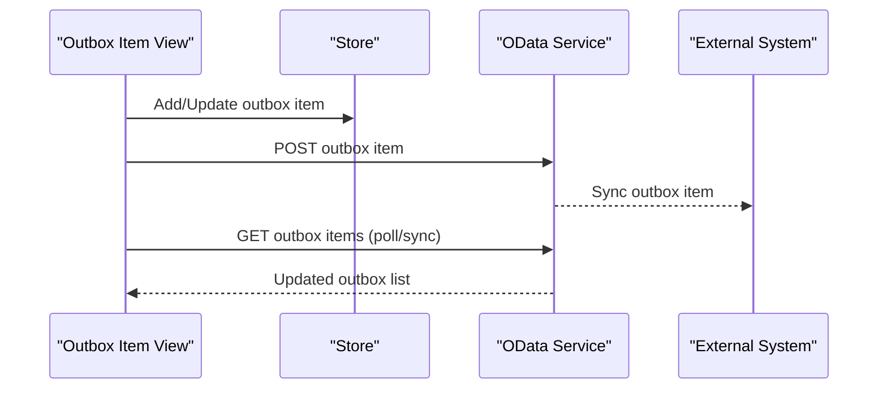
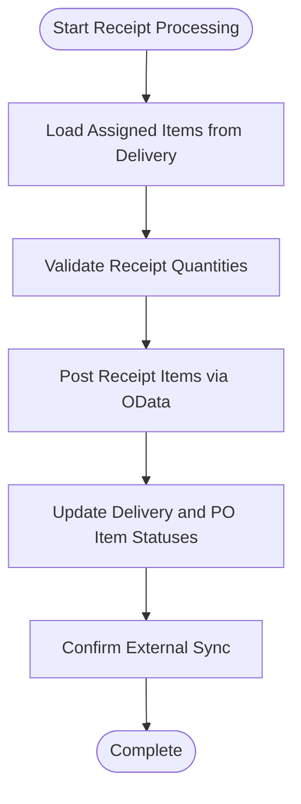
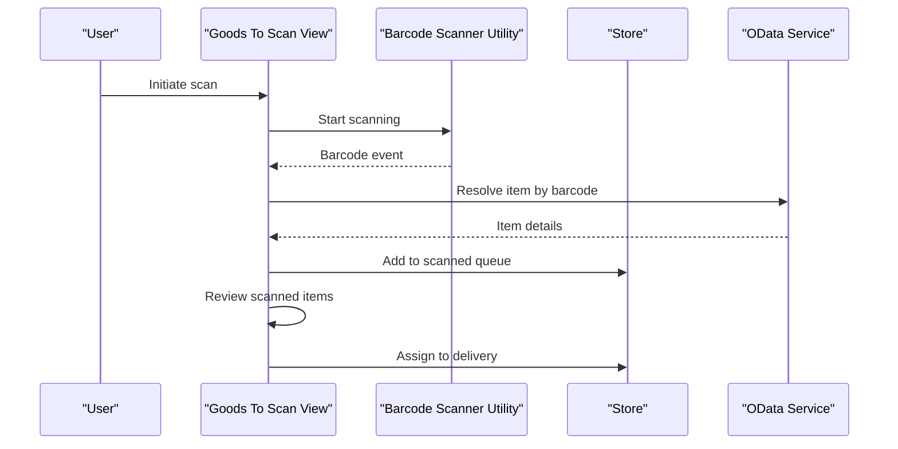
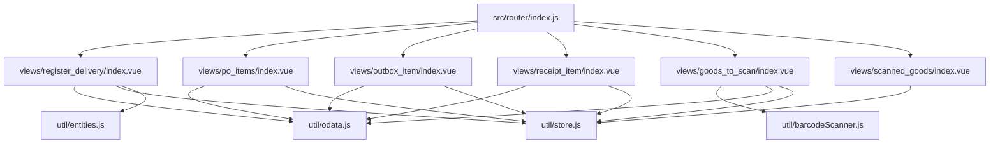

# Delivery Registration

<cite>
**Referenced Files in This Document**
- [index.html](file://index.html)
- [main.js](file://src/main.js)
- [Main.vue](file://src/Main.vue)
- [router/index.js](file://src/router/index.js)
- [register_delivery/index.vue](file://src/views/register_delivery/index.vue)
- [po_items/index.vue](file://src/views/po_items/index.vue)
- [outbox_item/index.vue](file://src/views/outbox_item/index.vue)
- [receipt_item/index.vue](file://src/views/receipt_item/index.vue)
- [goods_to_scan/index.vue](file://src/views/goods_to_scan/index.vue)
- [scanned_goods/index.vue](file://src/views/scanned_goods/index.vue)
- [util/odata.js](file://src/util/odata.js)
- [util/store.js](file://src/util/store.js)
- [util/entities.js](file://src/util/entities.js)
- [util/barcodeScanner.js](file://src/util/barcodeScanner.js)
</cite>

## Table of Contents
1. [Introduction](#introduction)
2. [Project Structure](#project-structure)
3. [Core Components](#core-components)
4. [Architecture Overview](#architecture-overview)
5. [Detailed Component Analysis](#detailed-component-analysis)
6. [Dependency Analysis](#dependency-analysis)
7. [Performance Considerations](#performance-considerations)
8. [Troubleshooting Guide](#troubleshooting-guide)
9. [Conclusion](#conclusion)

## Introduction
This document explains the delivery registration system implemented as a Vue-based web application. It focuses on:
- Delivery note processing workflow
- Purchase order (PO) item management
- Outbox item handling and integration with external systems
- Relationships between deliveries, PO items, and receipt items
- Data flow from delivery creation through item assignment to final receipt processing
- Business rules for validation, item matching, and status tracking
- Examples of operations, batch processing patterns, and integration points

The system is designed for warehouse or receiving operations where goods are scanned, matched against purchase orders, registered into deliveries, and ultimately converted into receipts.

## Project Structure
The application is organized by feature views under src/views, with shared utilities under src/util and routing configuration under src/router. Key areas relevant to delivery registration include:
- Views for registering deliveries, managing PO items, outbox items, receipt items, scanning goods, and reviewing scanned items
- Utilities for OData communication, state management, entity definitions, and barcode scanning
- Router that wires views to routes

**Diagram sources**
- [index.html](file://index.html)
- [main.js](file://src/main.js)
- [Main.vue](file://src/Main.vue)
- [router/index.js](file://src/router/index.js)
- [register_delivery/index.vue](file://src/views/register_delivery/index.vue)
- [po_items/index.vue](file://src/views/po_items/index.vue)
- [outbox_item/index.vue](file://src/views/outbox_item/index.vue)
- [receipt_item/index.vue](file://src/views/receipt_item/index.vue)
- [goods_to_scan/index.vue](file://src/views/goods_to_scan/index.vue)
- [scanned_goods/index.vue](file://src/views/scanned_goods/index.vue)
- [util/odata.js](file://src/util/odata.js)
- [util/store.js](file://src/util/store.js)
- [util/entities.js](file://src/util/entities.js)
- [util/barcodeScanner.js](file://src/util/barcodeScanner.js)

**Section sources**
- [index.html](file://index.html)
- [main.js](file://src/main.js)
- [Main.vue](file://src/Main.vue)
- [router/index.js](file://src/router/index.js)

## Core Components
- Delivery Registration View: Orchestrates creating a delivery note, selecting or searching PO items, assigning items to the delivery, and advancing to receipt processing.
- PO Items View: Displays available PO items, supports filtering/searching, and allows selection for assignment to a delivery.
- Outbox Item View: Manages outbound items prepared for dispatch; integrates with external systems via OData calls.
- Receipt Item View: Finalizes receipt entries based on assigned items and validates quantities and statuses.
- Goods To Scan / Scanned Goods Views: Provide scanning workflows and display scanned items for review and assignment.
- Utilities:
  - odata.js: Encapsulates HTTP requests to backend services using OData conventions.
  - store.js: Provides reactive state for UI and cross-view data sharing.
  - entities.js: Defines canonical data models used across views.
  - barcodeScanner.js: Wraps device camera and scanner APIs for barcode capture.

These components collaborate to implement end-to-end delivery registration and receipt processing.

**Section sources**
- [register_delivery/index.vue](file://src/views/register_delivery/index.vue)
- [po_items/index.vue](file://src/views/po_items/index.vue)
- [outbox_item/index.vue](file://src/views/outbox_item/index.vue)
- [receipt_item/index.vue](file://src/views/receipt_item/index.vue)
- [goods_to_scan/index.vue](file://src/views/goods_to_scan/index.vue)
- [scanned_goods/index.vue](file://src/views/scanned_goods/index.vue)
- [util/odata.js](file://src/util/odata.js)
- [util/store.js](file://src/util/store.js)
- [util/entities.js](file://src/util/entities.js)
- [util/barcodeScanner.js](file://src/util/barcodeScanner.js)

## Architecture Overview
At runtime, the router loads view components which interact with shared utilities. The delivery registration flow uses barcode scanning to identify goods, matches them to PO items, assigns them to a delivery, and then processes receipts. Outbox items are persisted and synchronized with external systems via OData.

**Diagram sources**
- [router/index.js](file://src/router/index.js)
- [register_delivery/index.vue](file://src/views/register_delivery/index.vue)
- [po_items/index.vue](file://src/views/po_items/index.vue)
- [receipt_item/index.vue](file://src/views/receipt_item/index.vue)
- [util/barcodeScanner.js](file://src/util/barcodeScanner.js)
- [util/store.js](file://src/util/store.js)
- [util/odata.js](file://src/util/odata.js)

## Detailed Component Analysis

### Delivery Registration Workflow
The delivery registration process begins with creating or selecting a delivery note, followed by item assignment and validation.

Key responsibilities:
- Capture input via barcode scanner or manual search
- Match items to PO records using identifiers
- Enforce business rules such as quantity limits and item status checks
- Persist delivery and synchronize with external systems
- Transition to receipt processing upon successful assignment

**Section sources**
- [register_delivery/index.vue](file://src/views/register_delivery/index.vue)
- [util/barcodeScanner.js](file://src/util/barcodeScanner.js)
- [util/odata.js](file://src/util/odata.js)
- [util/store.js](file://src/util/store.js)

### Purchase Order Item Management
The PO items view provides discovery and selection capabilities for items linked to a delivery.

Business rules typically enforced:
- Only active PO items can be selected
- Quantity remaining must be greater than zero
- Matching criteria include SKU, barcode, or PO line ID

**Section sources**
- [po_items/index.vue](file://src/views/po_items/index.vue)
- [util/odata.js](file://src/util/odata.js)
- [util/store.js](file://src/util/store.js)

### Outbox Item Handling and External Integration
Outbox items represent outbound goods prepared for dispatch. They are managed locally and synchronized with external systems.

Integration patterns:
- Use OData endpoints for CRUD operations on outbox items
- Implement retry and conflict resolution strategies for sync failures
- Maintain local state until confirmed by external system

**Section sources**
- [outbox_item/index.vue](file://src/views/outbox_item/index.vue)
- [util/odata.js](file://src/util/odata.js)
- [util/store.js](file://src/util/store.js)

### Receipt Item Processing
Receipt items finalize the inbound process by posting received quantities and updating inventory.

Validation rules:
- Received quantity cannot exceed ordered quantity
- Item must be assigned to a valid delivery
- Status transitions must comply with business policy

**Section sources**
- [receipt_item/index.vue](file://src/views/receipt_item/index.vue)
- [util/odata.js](file://src/util/odata.js)
- [util/store.js](file://src/util/store.js)

### Scanning and Assignment Flow
Scanning drives item identification and assignment to deliveries.

**Section sources**
- [goods_to_scan/index.vue](file://src/views/goods_to_scan/index.vue)
- [scanned_goods/index.vue](file://src/views/scanned_goods/index.vue)
- [util/barcodeScanner.js](file://src/util/barcodeScanner.js)
- [util/store.js](file://src/util/store.js)
- [util/odata.js](file://src/util/odata.js)

## Dependency Analysis
The following diagram shows how core modules depend on each other during delivery registration and related operations.

**Diagram sources**
- [router/index.js](file://src/router/index.js)
- [register_delivery/index.vue](file://src/views/register_delivery/index.vue)
- [po_items/index.vue](file://src/views/po_items/index.vue)
- [outbox_item/index.vue](file://src/views/outbox_item/index.vue)
- [receipt_item/index.vue](file://src/views/receipt_item/index.vue)
- [goods_to_scan/index.vue](file://src/views/goods_to_scan/index.vue)
- [scanned_goods/index.vue](file://src/views/scanned_goods/index.vue)
- [util/odata.js](file://src/util/odata.js)
- [util/store.js](file://src/util/store.js)
- [util/entities.js](file://src/util/entities.js)
- [util/barcodeScanner.js](file://src/util/barcodeScanner.js)

**Section sources**
- [router/index.js](file://src/router/index.js)
- [register_delivery/index.vue](file://src/views/register_delivery/index.vue)
- [po_items/index.vue](file://src/views/po_items/index.vue)
- [outbox_item/index.vue](file://src/views/outbox_item/index.vue)
- [receipt_item/index.vue](file://src/views/receipt_item/index.vue)
- [goods_to_scan/index.vue](file://src/views/goods_to_scan/index.vue)
- [scanned_goods/index.vue](file://src/views/scanned_goods/index.vue)
- [util/odata.js](file://src/util/odata.js)
- [util/store.js](file://src/util/store.js)
- [util/entities.js](file://src/util/entities.js)
- [util/barcodeScanner.js](file://src/util/barcodeScanner.js)

## Performance Considerations
- Minimize network round-trips by batching PO item queries and caching results in local store when appropriate.
- Debounce barcode events to avoid excessive lookups and UI updates.
- Use pagination or filtering on PO item lists to reduce payload sizes.
- Defer heavy computations (e.g., matching algorithms) to background tasks or Web Workers if needed.
- Optimize reactivity by updating only necessary store fields and avoiding deep watchers.

[No sources needed since this section provides general guidance]

## Troubleshooting Guide
Common issues and resolutions:
- Barcode not recognized:
  - Verify scanner permissions and camera access.
  - Ensure barcode format matches expected patterns.
  - Check error logs from the scanner utility.
- PO items not found:
  - Confirm filter parameters (SKU, barcode, PO line ID).
  - Validate connectivity to OData service and inspect response codes.
- Outbox sync failures:
  - Retry failed requests with exponential backoff.
  - Inspect conflict messages and reconcile local vs remote states.
- Receipt posting errors:
  - Validate quantities against ordered amounts.
  - Ensure delivery and item statuses allow receipt posting.

Operational tips:
- Enable detailed logging in development mode.
- Use store snapshots to compare before/after states during debugging.
- Test integration endpoints with mock responses to isolate frontend issues.

**Section sources**
- [util/barcodeScanner.js](file://src/util/barcodeScanner.js)
- [util/odata.js](file://src/util/odata.js)
- [util/store.js](file://src/util/store.js)

## Conclusion
The delivery registration system integrates scanning, PO item management, delivery assignment, and receipt processing within a cohesive Vue-based architecture. By leveraging shared utilities for OData communication, state management, and barcode scanning, the application maintains clear separation of concerns and extensibility. Adhering to the documented business rules and integration patterns ensures reliable operation and smooth synchronization with external systems.

[No sources needed since this section summarizes without analyzing specific files]