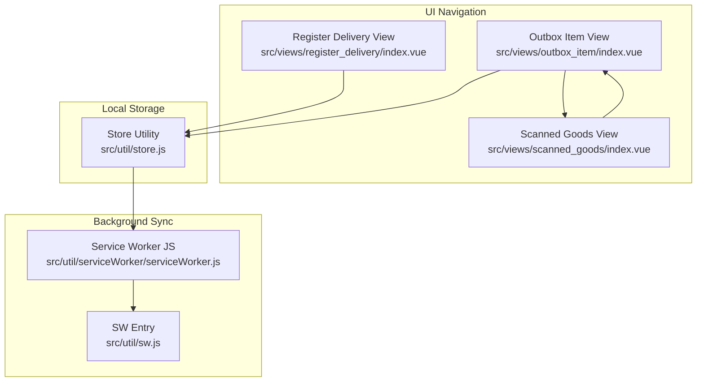
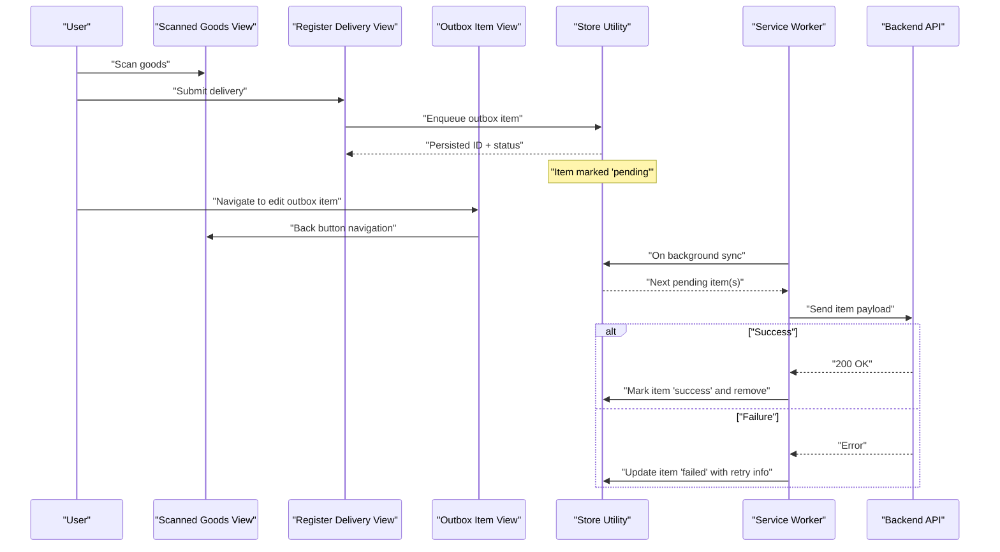
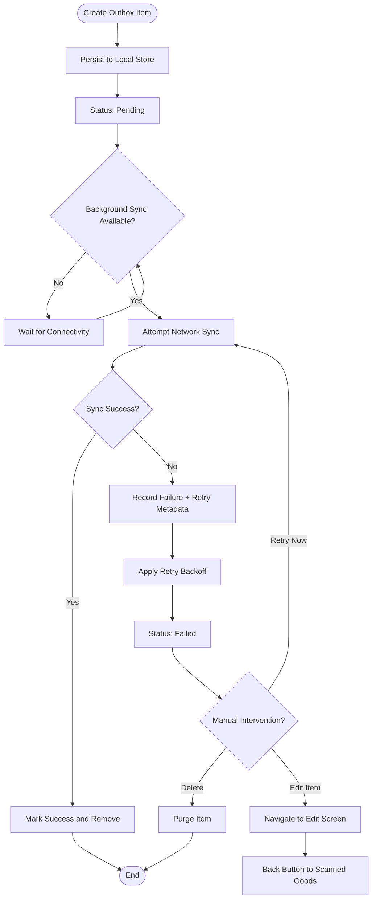
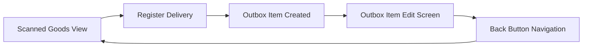
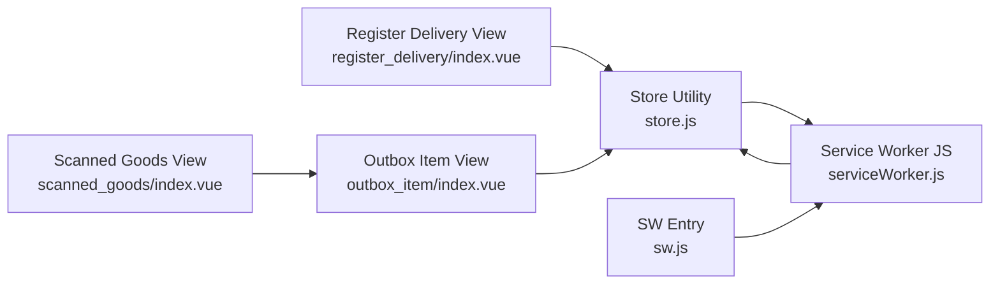

# Outbox Item Handling

<cite>
**Referenced Files in This Document**
- [outbox_item/index.vue](file://src/views/outbox_item/index.vue)
- [scanned_goods/index.vue](file://src/views/scanned_goods/index.vue)
- [register_delivery/index.vue](file://src/views/register_delivery/index.vue)
- [store.js](file://src/util/store.js)
- [serviceWorker.js](file://src/util/serviceWorker/serviceWorker.js)
- [sw.js](file://src/util/sw.js)
</cite>

## Update Summary
**Changes Made**
- Enhanced outbox item editing interface with improved navigation flow
- Added back button navigation capability from outbox item edit screen to scanned goods view
- Updated user interaction patterns for better workflow continuity

## Table of Contents
1. [Introduction](#introduction)
2. [Project Structure](#project-structure)
3. [Core Components](#core-components)
4. [Architecture Overview](#architecture-overview)
5. [Detailed Component Analysis](#detailed-component-analysis)
6. [Navigation Flow Enhancements](#navigation-flow-enhancements)
7. [Dependency Analysis](#dependency-analysis)
8. [Performance Considerations](#performance-considerations)
9. [Troubleshooting Guide](#troubleshooting-guide)
10. [Conclusion](#conclusion)

## Introduction
This document explains how outbox items are handled within the delivery registration system to support an offline-first architecture. Outbox items represent pending delivery operations that must be persisted locally and synchronized with a backend when connectivity is available. The system ensures reliable background synchronization, retry on failure, and clear status monitoring for operators. It also covers conflict resolution strategies, lifecycle management from creation to successful sync, and performance considerations for large queues.

**Updated** Enhanced user experience through improved navigation capabilities between outbox item editing and scanned goods views.

## Project Structure
The outbox feature spans UI views, local storage utilities, and service worker integration:
- Outbox item view for listing and managing pending items with enhanced navigation
- Scanned goods view as the primary destination for navigation flow
- Delivery registration flow that enqueues outbox items
- Local store utility for persistence and queue management
- Service worker integration for background sync triggers

**Diagram sources**
- [outbox_item/index.vue](file://src/views/outbox_item/index.vue)
- [scanned_goods/index.vue](file://src/views/scanned_goods/index.vue)
- [register_delivery/index.vue](file://src/views/register_delivery/index.vue)
- [store.js](file://src/util/store.js)
- [serviceWorker.js](file://src/util/serviceWorker/serviceWorker.js)
- [sw.js](file://src/util/sw.js)

**Section sources**
- [outbox_item/index.vue](file://src/views/outbox_item/index.vue)
- [scanned_goods/index.vue](file://src/views/scanned_goods/index.vue)
- [register_delivery/index.vue](file://src/views/register_delivery/index.vue)
- [store.js](file://src/util/store.js)
- [serviceWorker.js](file://src/util/serviceWorker/serviceWorker.js)
- [sw.js](file://src/util/sw.js)

## Core Components
- **Enhanced Outbox Item View**: Displays pending outbox items, allows manual retry or deletion, shows current status, and provides seamless navigation back to scanned goods view
- **Scanned Goods View**: Primary interface for scanning and managing goods, serves as navigation destination from outbox item editing
- Register Delivery Flow: Creates outbox items when registering deliveries, especially under offline conditions
- Store Utility: Persists outbox items, manages queue ordering, and exposes methods to enqueue, update, and purge items
- Service Worker Integration: Triggers background sync events and coordinates network requests when online

Key responsibilities:
- Enqueue new outbox items with stable IDs and metadata
- Persist items until successfully synced
- Update statuses (pending, syncing, success, failed)
- Retry failed items with backoff
- Purge completed items to free space
- **Enhanced**: Provide intuitive navigation flow between related views

**Section sources**
- [outbox_item/index.vue](file://src/views/outbox_item/index.vue)
- [scanned_goods/index.vue](file://src/views/scanned_goods/index.vue)
- [register_delivery/index.vue](file://src/views/register_delivery/index.vue)
- [store.js](file://src/util/store.js)
- [serviceWorker.js](file://src/util/serviceWorker/serviceWorker.js)
- [sw.js](file://src/util/sw.js)

## Architecture Overview
The outbox pattern decouples user actions from network operations. When a delivery is registered, the operation is recorded as an outbox item and persisted locally. A background process attempts to synchronize these items when connectivity is available. Successful sync removes or marks items as complete; failures trigger retries.

**Diagram sources**
- [scanned_goods/index.vue](file://src/views/scanned_goods/index.vue)
- [register_delivery/index.vue](file://src/views/register_delivery/index.vue)
- [outbox_item/index.vue](file://src/views/outbox_item/index.vue)
- [store.js](file://src/util/store.js)
- [serviceWorker.js](file://src/util/serviceWorker/serviceWorker.js)
- [sw.js](file://src/util/sw.js)

## Detailed Component Analysis

### Outbox Item Lifecycle
The lifecycle covers creation, persistence, background sync, retry, and completion.

**Diagram sources**
- [store.js](file://src/util/store.js)
- [serviceWorker.js](file://src/util/serviceWorker/serviceWorker.js)
- [outbox_item/index.vue](file://src/views/outbox_item/index.vue)
- [scanned_goods/index.vue](file://src/views/scanned_goods/index.vue)

**Section sources**
- [store.js](file://src/util/store.js)
- [serviceWorker.js](file://src/util/serviceWorker/serviceWorker.js)
- [outbox_item/index.vue](file://src/views/outbox_item/index.vue)
- [scanned_goods/index.vue](file://src/views/scanned_goods/index.vue)

### Outbox Queue Management
Responsibilities include:
- Enqueueing items with unique IDs and timestamps
- Ordering by creation time to ensure FIFO processing
- Updating statuses atomically
- Purging completed items to prevent unbounded growth
- Exposing query APIs for UI to list pending/failed items

Operational notes:
- Use stable IDs to avoid duplicates across retries
- Maintain minimal metadata (payload reference, error details, retry count)
- Batch fetch for background sync to reduce overhead

**Section sources**
- [store.js](file://src/util/store.js)

### Relationship Between Outbox Items and Delivery Operations
- Creation: When a delivery is registered, the system creates an outbox item containing the delivery payload and context.
- Persistence: The item is stored locally immediately, ensuring no data loss if the app closes.
- Sync: Background processes attempt to send the payload to the backend.
- Completion: On success, the item is removed; on failure, it remains with updated status and retry metadata.
- **Enhanced**: Improved navigation flow allows users to seamlessly move between outbox item editing and scanned goods views.

Examples:
- Creating an outbox item during delivery submission
- Monitoring item status in the outbox view
- Triggering manual retry from the outbox view
- **New**: Navigating back to scanned goods view after editing outbox items

**Section sources**
- [register_delivery/index.vue](file://src/views/register_delivery/index.vue)
- [outbox_item/index.vue](file://src/views/outbox_item/index.vue)
- [scanned_goods/index.vue](file://src/views/scanned_goods/index.vue)
- [store.js](file://src/util/store.js)

### Conflict Resolution Strategies
When the same delivery is created multiple times or conflicts occur:
- Idempotency: Use stable IDs so duplicate submissions are recognized and deduplicated by the backend.
- Last-write-wins vs. merge: Choose strategy based on business rules; typically, last-write-wins for simple updates, merge for complex payloads.
- Versioning: Include version or timestamp fields to detect stale updates.
- Operator guidance: Show conflict warnings in the UI and allow manual reconciliation.

**Section sources**
- [store.js](file://src/util/store.js)
- [outbox_item/index.vue](file://src/views/outbox_item/index.vue)

### Retry Mechanisms and Error Recovery
- Automatic retries: Background sync attempts with exponential backoff and jitter.
- Max retries: Cap retries to avoid infinite loops; escalate to manual intervention after threshold.
- Error categorization: Classify errors (network, server, validation) to tailor retry behavior.
- Recovery: Allow manual retry from the outbox view; provide detailed error messages.

**Section sources**
- [serviceWorker.js](file://src/util/serviceWorker/serviceWorker.js)
- [outbox_item/index.vue](file://src/views/outbox_item/index.vue)
- [store.js](file://src/util/store.js)

### Status Monitoring and Manual Intervention
- Statuses: pending, syncing, success, failed
- UI features: List items, filter by status, show error details, trigger manual retry, delete items
- Operational scenarios:
  - Bulk retry failed items
  - Delete corrupted items
  - Inspect payload and metadata for debugging
  - **Enhanced**: Seamless navigation between outbox item editing and scanned goods views

**Section sources**
- [outbox_item/index.vue](file://src/views/outbox_item/index.vue)
- [scanned_goods/index.vue](file://src/views/scanned_goods/index.vue)
- [store.js](file://src/util/store.js)

### Service Worker Integration for Background Sync
- Registration: App registers the service worker entry point.
- Events: Listen for background sync events to process queued items.
- Coordination: Request next batch from store, perform network calls, update store results.

**Section sources**
- [sw.js](file://src/util/sw.js)
- [serviceWorker.js](file://src/util/serviceWorker/serviceWorker.js)

## Navigation Flow Enhancements

### Enhanced User Interface Navigation
The outbox item editing interface now includes improved navigation capabilities that enhance the overall user experience:

**Key Improvements:**
- **Back Button Navigation**: Users can easily navigate back from the outbox item edit screen to the scanned goods view
- **Seamless Workflow**: Maintains context and state while switching between related views
- **Improved User Experience**: Reduces friction in the delivery registration workflow

**Diagram sources**
- [scanned_goods/index.vue](file://src/views/scanned_goods/index.vue)
- [register_delivery/index.vue](file://src/views/register_delivery/index.vue)
- [outbox_item/index.vue](file://src/views/outbox_item/index.vue)

### Navigation Implementation Details
The enhanced navigation system provides:
- Intuitive back button placement and functionality
- State preservation during navigation transitions
- Context-aware routing between related views
- Consistent user experience across different device types

**Section sources**
- [outbox_item/index.vue](file://src/views/outbox_item/index.vue)
- [scanned_goods/index.vue](file://src/views/scanned_goods/index.vue)

## Dependency Analysis
The following diagram maps dependencies between components involved in outbox handling:

**Diagram sources**
- [register_delivery/index.vue](file://src/views/register_delivery/index.vue)
- [outbox_item/index.vue](file://src/views/outbox_item/index.vue)
- [scanned_goods/index.vue](file://src/views/scanned_goods/index.vue)
- [store.js](file://src/util/store.js)
- [serviceWorker.js](file://src/util/serviceWorker/serviceWorker.js)
- [sw.js](file://src/util/sw.js)

**Section sources**
- [register_delivery/index.vue](file://src/views/register_delivery/index.vue)
- [outbox_item/index.vue](file://src/views/outbox_item/index.vue)
- [scanned_goods/index.vue](file://src/views/scanned_goods/index.vue)
- [store.js](file://src/util/store.js)
- [serviceWorker.js](file://src/util/serviceWorker/serviceWorker.js)
- [sw.js](file://src/util/sw.js)

## Performance Considerations
- Batch processing: Fetch and sync multiple items per background event to reduce overhead.
- Pagination: Limit queue reads to small windows to avoid memory spikes.
- Memory management: Purge completed items promptly; avoid retaining large payloads in memory.
- Indexing: Optimize queries by status and timestamp to speed up UI rendering and background processing.
- Throttling: Avoid excessive retries; use backoff and jitter to prevent thundering herds.
- Payload size: Compress or split large payloads; consider storing references instead of full objects.
- **Enhanced**: Efficient navigation state management to prevent memory leaks during view transitions.

## Troubleshooting Guide
Common issues and resolutions:
- Items stuck in pending: Check connectivity and background sync registration; verify service worker is active.
- Repeated failures: Inspect error details in the outbox view; validate payload format and backend availability.
- Duplicate submissions: Ensure idempotent IDs; confirm backend deduplication logic.
- Large queue performance: Purge completed items; implement pagination and batching.
- Manual intervention: Use outbox view to retry or delete problematic items; log relevant metadata for diagnostics.
- **New**: Navigation issues: Verify back button functionality between outbox item editing and scanned goods views; check router configuration and state management.

**Section sources**
- [outbox_item/index.vue](file://src/views/outbox_item/index.vue)
- [scanned_goods/index.vue](file://src/views/scanned_goods/index.vue)
- [serviceWorker.js](file://src/util/serviceWorker/serviceWorker.js)
- [store.js](file://src/util/store.js)

## Conclusion
Outbox items enable robust offline-first delivery registration by persisting operations locally and synchronizing them reliably in the background. Clear lifecycle management, retry mechanisms, and operator tools ensure resilience and maintainability. Proper queue management and performance tuning keep the system efficient even with large volumes of pending items. The enhanced navigation capabilities further improve the user experience by providing seamless transitions between related views, making the delivery registration workflow more intuitive and efficient.