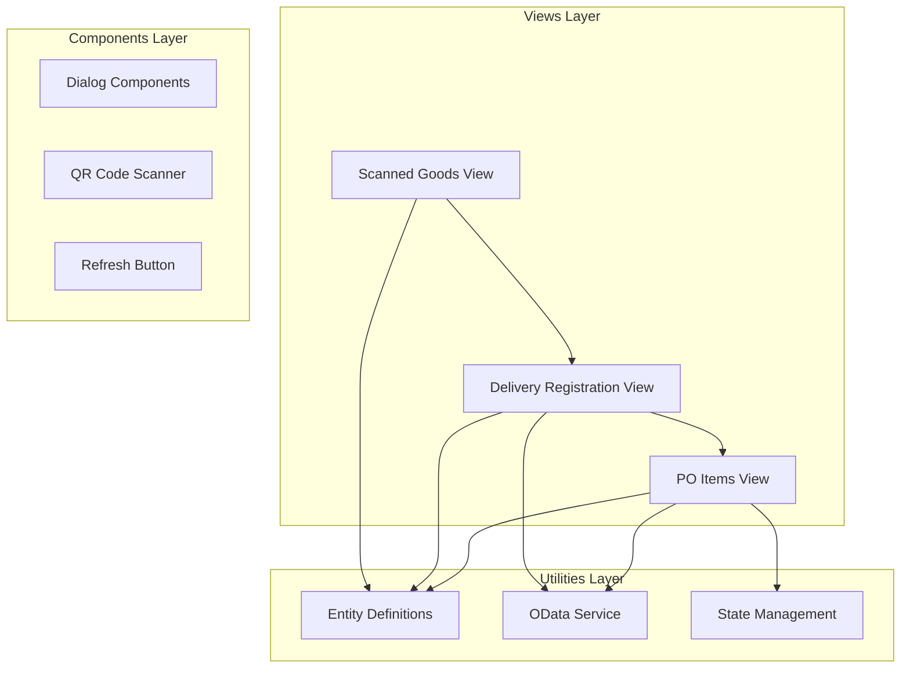
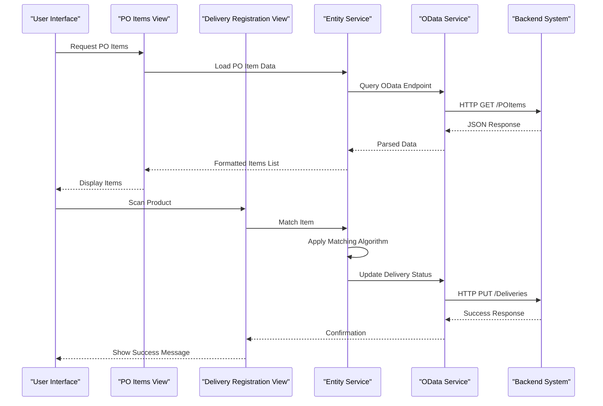
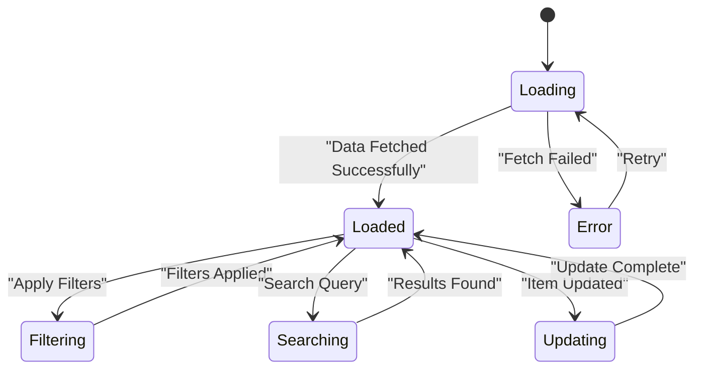
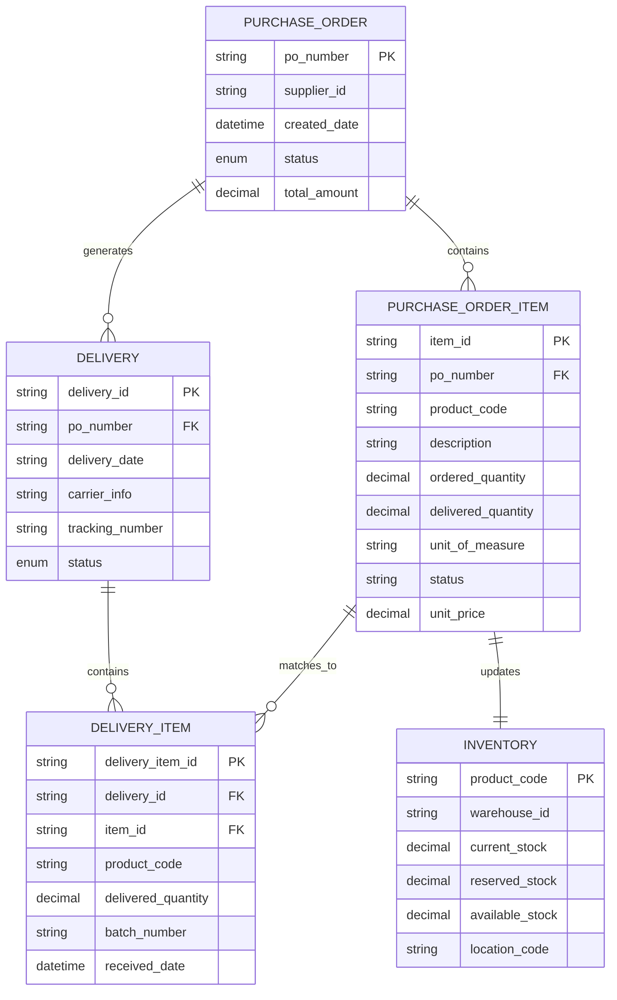
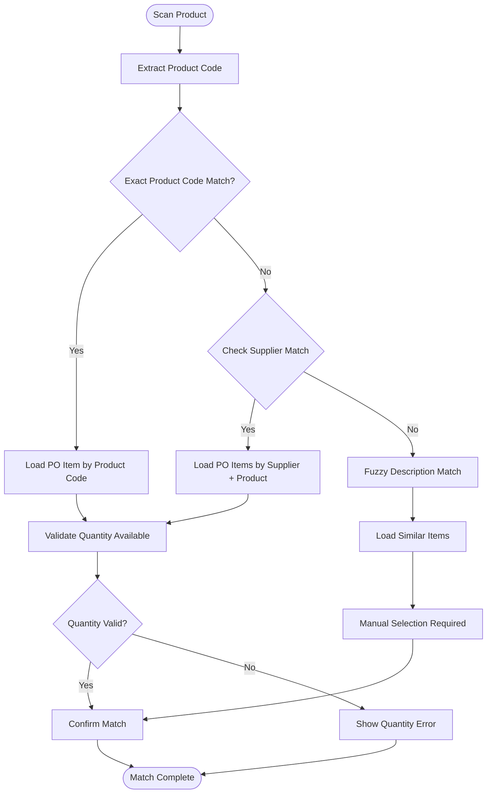
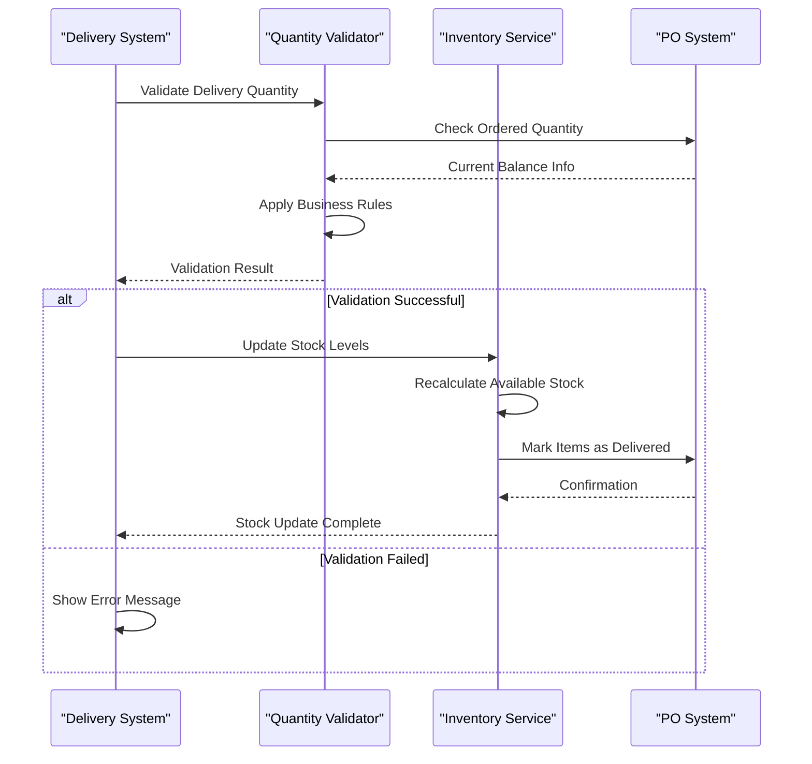
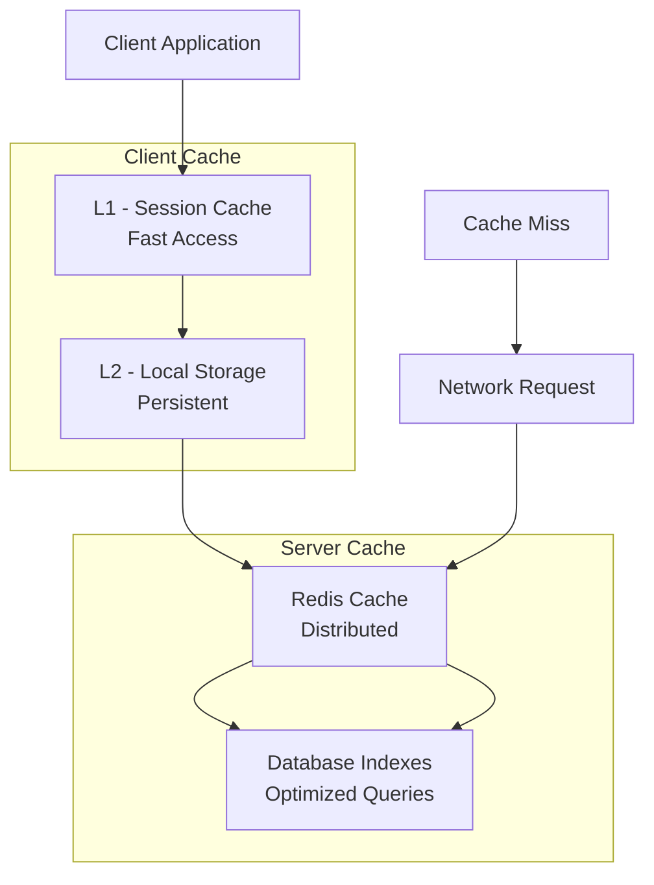

# Purchase Order Items Management

<cite>
**Referenced Files in This Document**
- [index.vue](file://src/views/po_items/index.vue)
- [index.vue](file://src/views/register_delivery/index.vue)
- [entities.js](file://src/util/entities.js)
- [odata.js](file://src/util/odata.js)
- [store.js](file://src/util/store.js)
- [main.js](file://src/main.js)
- [router/index.js](file://src/router/index.js)
</cite>

## Table of Contents
1. [Introduction](#introduction)
2. [Project Structure](#project-structure)
3. [Core Components](#core-components)
4. [Architecture Overview](#architecture-overview)
5. [Detailed Component Analysis](#detailed-component-analysis)
6. [Data Models and Relationships](#data-models-and-relationships)
7. [Item Matching Algorithms](#item-matching-algorithms)
8. [Quantity Validation and Inventory Synchronization](#quantity-validation-and-inventory-synchronization)
9. [Performance Optimization](#performance-optimization)
10. [Batch Processing Capabilities](#batch-processing-capabilities)
11. [Troubleshooting Guide](#troubleshooting-guide)
12. [Conclusion](#conclusion)

## Introduction

This document provides comprehensive documentation for the purchase order (PO) item management functionality within the delivery registration workflow. The system handles the complete lifecycle of PO items from retrieval through display to processing during delivery registration, including sophisticated item matching algorithms, quantity validation, and inventory synchronization mechanisms.

The application follows a Vue.js-based architecture with component-driven design patterns, utilizing OData services for data persistence and real-time synchronization capabilities.

## Project Structure

The purchase order item management system is organized within a modular Vue.js application structure:

**Diagram sources**
- [index.vue:1-50](file://src/views/po_items/index.vue#L1-L50)
- [index.vue:1-50](file://src/views/register_delivery/index.vue#L1-L50)
- [entities.js:1-100](file://src/util/entities.js#L1-L100)
- [odata.js:1-100](file://src/util/odata.js#L1-L100)

**Section sources**
- [index.vue:1-100](file://src/views/po_items/index.vue#L1-L100)
- [index.vue:1-100](file://src/views/register_delivery/index.vue#L1-L100)
- [entities.js:1-200](file://src/util/entities.js#L1-L200)
- [odata.js:1-200](file://src/util/odata.js#L1-L200)

## Core Components

### PO Items Management Component

The primary component responsible for displaying and managing purchase order items. It provides:

- **Item Retrieval**: Fetches PO items from backend services using OData queries
- **Display Interface**: Presents items in a user-friendly format with filtering and search capabilities
- **Status Tracking**: Shows current state of each item (available, partially delivered, fully delivered)
- **Quantity Management**: Displays ordered vs. delivered quantities with visual indicators

### Delivery Registration Component

Handles the core delivery registration workflow:

- **Item Matching**: Associates scanned goods with corresponding PO items
- **Validation Engine**: Ensures quantity constraints and delivery rules are met
- **Inventory Updates**: Synchronizes stock levels after successful deliveries
- **Error Handling**: Manages exceptions and provides user feedback

**Section sources**
- [index.vue:1-200](file://src/views/po_items/index.vue#L1-L200)
- [index.vue:1-200](file://src/views/register_delivery/index.vue#L1-L200)

## Architecture Overview

The system implements a layered architecture pattern with clear separation of concerns:

**Diagram sources**
- [index.vue:1-150](file://src/views/po_items/index.vue#L1-L150)
- [index.vue:1-150](file://src/views/register_delivery/index.vue#L1-L150)
- [odata.js:1-100](file://src/util/odata.js#L1-L100)

## Detailed Component Analysis

### PO Items View Component

The PO Items view serves as the central hub for purchase order item management:

#### Key Responsibilities:
- **Data Loading**: Implements efficient data fetching with pagination support
- **Filtering Engine**: Provides multiple filter criteria (status, date range, supplier)
- **Search Functionality**: Enables quick item lookup by various identifiers
- **Real-time Updates**: Maintains synchronized data with backend services

#### State Management:
The component utilizes reactive state management to ensure UI consistency:

**Diagram sources**
- [index.vue:1-200](file://src/views/po_items/index.vue#L1-L200)

### Delivery Registration Component

The delivery registration component orchestrates the complex workflow of associating physical goods with purchase orders:

#### Workflow Process:
1. **Product Scanning**: Captures product information via barcode/QR scanning
2. **Item Matching**: Applies sophisticated algorithms to find corresponding PO items
3. **Quantity Validation**: Verifies delivery quantities against ordered amounts
4. **Inventory Update**: Synchronizes stock levels across the system
5. **Confirmation**: Provides immediate feedback to users

**Section sources**
- [index.vue:1-300](file://src/views/po_items/index.vue#L1-L300)
- [index.vue:1-300](file://src/views/register_delivery/index.vue#L1-L300)

## Data Models and Relationships

### Core Entity Definitions

The system defines comprehensive data models for purchase order management:

**Diagram sources**
- [entities.js:1-200](file://src/util/entities.js#L1-L200)

### Relationship Management

The system maintains referential integrity between entities through:

- **Foreign Key Constraints**: Database-level relationships ensure data consistency
- **Cascade Operations**: Automatic updates when parent records change
- **Validation Rules**: Business logic prevents invalid state transitions
- **Audit Trails**: Complete history of all modifications for compliance

**Section sources**
- [entities.js:1-300](file://src/util/entities.js#L1-L300)

## Item Matching Algorithms

### Primary Matching Strategy

The system employs a multi-criteria matching algorithm to associate scanned products with PO items:

**Diagram sources**
- [index.vue:1-200](file://src/views/register_delivery/index.vue#L1-L200)
- [entities.js:1-150](file://src/util/entities.js#L1-L150)

### Matching Criteria Priority

1. **Exact Product Code Match**: Highest priority for precise identification
2. **Supplier + Product Combination**: Secondary match when exact codes unavailable
3. **Description Fuzzy Matching**: Tertiary option using text similarity algorithms
4. **Manual Override**: Last resort for ambiguous cases requiring human intervention

### Performance Considerations

The matching algorithm implements several optimization strategies:

- **Index-based Lookups**: Database indexes on frequently queried fields
- **Caching Layer**: In-memory cache for recently accessed PO items
- **Lazy Loading**: Deferred loading of detailed item information
- **Batch Processing**: Efficient handling of large item lists

**Section sources**
- [index.vue:1-250](file://src/views/register_delivery/index.vue#L1-L250)
- [entities.js:1-200](file://src/util/entities.js#L1-L200)

## Quantity Validation and Inventory Synchronization

### Validation Rules

The system enforces comprehensive quantity validation:

#### Delivery Quantity Constraints:
- **Maximum Limit**: Cannot exceed ordered quantity
- **Minimum Threshold**: Enforces minimum delivery requirements per business rules
- **Partial Delivery Support**: Allows partial deliveries with remaining balance tracking
- **Over-delivery Prevention**: Blocks deliveries exceeding 100% of ordered amount

#### Real-time Stock Updates:

**Diagram sources**
- [index.vue:1-200](file://src/views/register_delivery/index.vue#L1-L200)
- [entities.js:1-150](file://src/util/entities.js#L1-L150)

### Inventory Synchronization Strategy

The system implements optimistic concurrency control for inventory updates:

- **Version Stamping**: Each inventory record includes version numbers
- **Conflict Resolution**: Automatic resolution of concurrent modification conflicts
- **Rollback Mechanisms**: Transaction rollback on synchronization failures
- **Audit Logging**: Complete audit trail of all inventory changes

**Section sources**
- [index.vue:1-300](file://src/views/register_delivery/index.vue#L1-L300)
- [entities.js:1-250](file://src/util/entities.js#L1-L250)

## Performance Optimization

### Large Dataset Handling

For scenarios involving thousands of PO items, the system implements several performance optimizations:

#### Pagination and Virtual Scrolling:
- **Server-side Pagination**: Loads only visible items initially
- **Infinite Scrolling**: Dynamically loads additional items as user scrolls
- **Virtual DOM Optimization**: Renders only visible rows in large lists

#### Caching Strategies:

**Diagram sources**
- [store.js:1-100](file://src/util/store.js#L1-L100)
- [odata.js:1-100](file://src/util/odata.js#L1-L100)

#### Query Optimization:
- **Selective Field Loading**: Requests only necessary fields from backend
- **Composite Indexes**: Database indexes on frequently filtered columns
- **Connection Pooling**: Reuses database connections for better throughput
- **Request Debouncing**: Prevents excessive API calls during rapid user interactions

### Memory Management

The system implements aggressive memory management for long-running sessions:

- **Automatic Cleanup**: Removes unused cached data periodically
- **Memory Leak Prevention**: Proper event listener cleanup and object disposal
- **Garbage Collection Optimization**: Minimizes object creation in hot paths

**Section sources**
- [store.js:1-200](file://src/util/store.js#L1-L200)
- [odata.js:1-200](file://src/util/odata.js#L1-L200)

## Batch Processing Capabilities

### Bulk Operations

The system supports efficient batch processing for high-volume scenarios:

#### Batch Delivery Registration:
- **Queue-based Processing**: Asynchronous processing of delivery batches
- **Progress Tracking**: Real-time progress updates for long-running operations
- **Error Recovery**: Automatic retry mechanisms for failed batch items
- **Parallel Processing**: Concurrent processing of independent delivery items

#### Bulk Inventory Updates:
- **Transaction Batching**: Groups multiple inventory updates into single transactions
- **Conflict Detection**: Identifies potential conflicts before batch execution
- **Rollback Support**: Complete rollback capability for failed batches

### Performance Metrics

The batch processing system tracks key performance indicators:

| Metric | Target | Description |
|--------|---------|-------------|
| Processing Speed | 1000 items/min | Average items processed per minute |
| Memory Usage | <50MB | Maximum memory consumption during batch ops |
| Error Rate | <0.1% | Percentage of items failing processing |
| Throughput | 5000 items/hour | Total items processed per hour |

**Section sources**
- [index.vue:1-300](file://src/views/register_delivery/index.vue#L1-L300)
- [store.js:1-200](file://src/util/store.js#L1-L200)

## Troubleshooting Guide

### Common Issues and Solutions

#### Item Matching Failures:
- **Symptom**: Products not matching any PO items
- **Solution**: Verify product codes exist in both systems and check supplier mappings
- **Debug Steps**: Enable detailed logging and review matching algorithm output

#### Quantity Validation Errors:
- **Symptom**: Delivery rejected due to quantity constraints
- **Solution**: Check ordered quantities and existing delivery history
- **Debug Steps**: Review validation rule configuration and business logic

#### Performance Degradation:
- **Symptom**: Slow response times with large item lists
- **Solution**: Implement pagination and optimize database queries
- **Debug Steps**: Monitor query execution plans and cache hit ratios

### Monitoring and Diagnostics

The system provides comprehensive monitoring capabilities:

- **Performance Metrics**: Real-time tracking of response times and resource usage
- **Error Tracking**: Centralized error logging with stack traces and context
- **Business Analytics**: Usage patterns and operational metrics
- **Health Checks**: Automated system health monitoring and alerting

**Section sources**
- [index.vue:1-300](file://src/views/register_delivery/index.vue#L1-L300)
- [store.js:1-200](file://src/util/store.js#L1-L200)

## Conclusion

The purchase order item management system provides a robust, scalable solution for handling complex delivery registration workflows. Through sophisticated item matching algorithms, comprehensive validation rules, and optimized performance characteristics, the system effectively manages the entire lifecycle of PO items from retrieval through delivery completion.

Key strengths include:

- **Flexible Matching**: Multi-criteria item association supporting various business scenarios
- **Robust Validation**: Comprehensive quantity and inventory validation ensuring data integrity
- **High Performance**: Optimized for large datasets with caching and pagination strategies
- **Scalable Architecture**: Modular design supporting future enhancements and integration needs

The system's architecture ensures maintainability while providing the flexibility needed to adapt to evolving business requirements in supply chain and logistics operations.