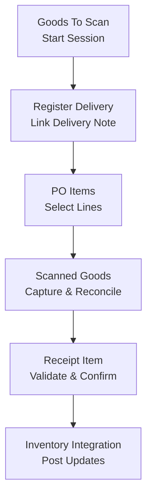
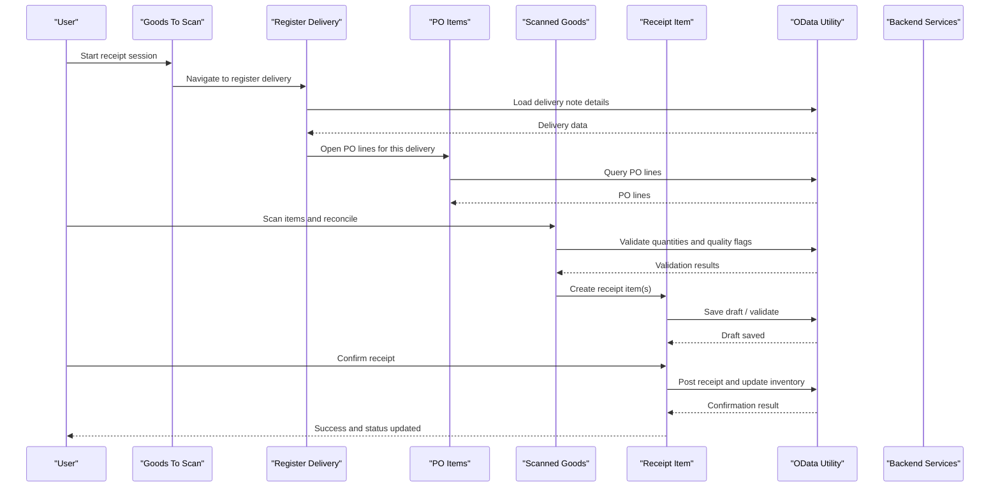
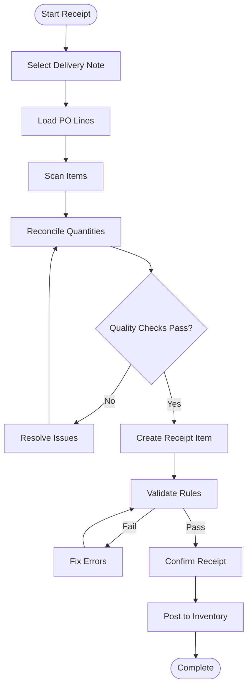
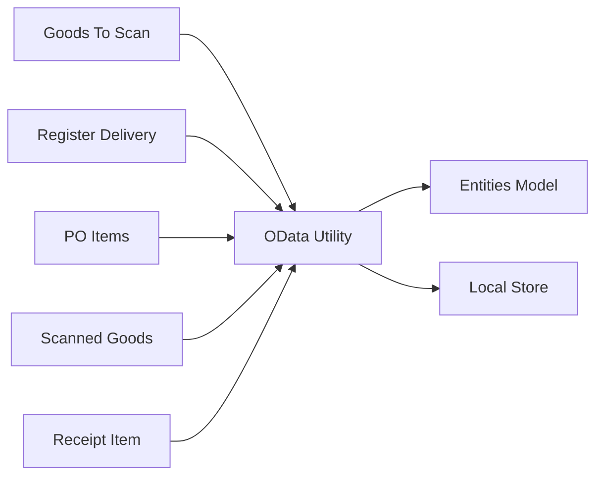

# Receipt Item Processing

<cite>
**Referenced Files in This Document**
- [receipt_item/index.vue](file://src/views/receipt_item/index.vue)
- [register_delivery/index.vue](file://src/views/register_delivery/index.vue)
- [goods_to_scan/index.vue](file://src/views/goods_to_scan/index.vue)
- [scanned_goods/index.vue](file://src/views/scanned_goods/index.vue)
- [po_items/index.vue](file://src/views/po_items/index.vue)
- [util/odata.js](file://src/util/odata.js)
- [util/store.js](file://src/util/store.js)
- [util/entities.js](file://src/util/entities.js)
- [router/index.js](file://src/router/index.js)
</cite>

## Table of Contents
1. [Introduction](#introduction)
2. [Project Structure](#project-structure)
3. [Core Components](#core-components)
4. [Architecture Overview](#architecture-overview)
5. [Detailed Component Analysis](#detailed-component-analysis)
6. [Dependency Analysis](#dependency-analysis)
7. [Performance Considerations](#performance-considerations)
8. [Troubleshooting Guide](#troubleshooting-guide)
9. [Conclusion](#conclusion)

## Introduction
This document explains the receipt item processing functionality within the goods receipt workflow. It covers how receipt items are created, validated, and finalized; how they integrate with delivery notes; quantity reconciliation and quality checks; confirmation and status updates; and integration points with inventory management systems. It also provides examples for creation, modification, and bulk operations, along with validation rules, error handling, and audit trail considerations.

## Project Structure
The application is a Vue-based frontend that orchestrates receipt workflows across several views:
- Goods-to-scan entry point to start a receipt session
- Delivery note registration and association
- PO item reference and line-level selection
- Scanned goods capture and reconciliation
- Receipt item detail view for finalization and confirmation

**Diagram sources**
- [goods_to_scan/index.vue](file://src/views/goods_to_scan/index.vue)
- [register_delivery/index.vue](file://src/views/register_delivery/index.vue)
- [po_items/index.vue](file://src/views/po_items/index.vue)
- [scanned_goods/index.vue](file://src/views/scanned_goods/index.vue)
- [receipt_item/index.vue](file://src/views/receipt_item/index.vue)

**Section sources**
- [router/index.js](file://src/router/index.js)

## Core Components
- Goods To Scan: Initializes a new receipt session and prepares context (e.g., delivery or purchase order identifiers).
- Register Delivery: Associates a delivery note with the current session and loads related lines.
- PO Items: Displays purchase order lines available for receipt and allows selection.
- Scanned Goods: Captures scanned items, validates against expected quantities, and reconciles differences.
- Receipt Item: Manages individual receipt item lifecycle—creation, validation, quality checks, confirmation, and posting.

Key responsibilities:
- Data binding and UI state for each step
- Validation rules enforcement
- Error display and recovery flows
- Navigation between steps
- Calling backend services via OData utilities

**Section sources**
- [goods_to_scan/index.vue](file://src/views/goods_to_scan/index.vue)
- [register_delivery/index.vue](file://src/views/register_delivery/index.vue)
- [po_items/index.vue](file://src/views/po_items/index.vue)
- [scanned_goods/index.vue](file://src/views/scanned_goods/index.vue)
- [receipt_item/index.vue](file://src/views/receipt_item/index.vue)

## Architecture Overview
The receipt workflow follows a linear process with branching for validations and confirmations. The frontend composes these steps using Vue components and communicates with backend services through an OData utility layer.

**Diagram sources**
- [goods_to_scan/index.vue](file://src/views/goods_to_scan/index.vue)
- [register_delivery/index.vue](file://src/views/register_delivery/index.vue)
- [po_items/index.vue](file://src/views/po_items/index.vue)
- [scanned_goods/index.vue](file://src/views/scanned_goods/index.vue)
- [receipt_item/index.vue](file://src/views/receipt_item/index.vue)
- [util/odata.js](file://src/util/odata.js)

## Detailed Component Analysis

### Goods To Scan
Purpose:
- Initialize a new receipt session
- Capture initial context such as delivery number or PO reference
- Provide navigation to subsequent steps

Key behaviors:
- Validates presence of required identifiers before proceeding
- Persists minimal session state for downstream views
- Handles errors when required inputs are missing

Validation rules:
- Required fields must be present
- Format checks for identifiers (e.g., delivery number pattern)

Error handling:
- Inline messages for missing inputs
- Prevents navigation until valid

Audit trail:
- Records session start timestamp and initiator

**Section sources**
- [goods_to_scan/index.vue](file://src/views/goods_to_scan/index.vue)

### Register Delivery
Purpose:
- Link a delivery note to the current session
- Load associated PO lines for receipt

Key behaviors:
- Fetches delivery note details from backend
- Populates PO lines list for selection
- Supports re-selection if multiple deliveries exist

Integration points:
- Uses OData utility to query delivery and PO entities
- Stores selected delivery context for later steps

Validation rules:
- Delivery note must exist and be open for receipt
- Associated PO lines must be loadable

Error handling:
- Displays network or entity not found errors
- Allows retry or cancellation

Audit trail:
- Logs delivery association event with timestamp

**Section sources**
- [register_delivery/index.vue](file://src/views/register_delivery/index.vue)
- [util/odata.js](file://src/util/odata.js)

### PO Items
Purpose:
- Display purchase order lines eligible for receipt
- Allow user to select specific lines and quantities

Key behaviors:
- Loads PO lines filtered by delivery context
- Shows remaining quantities and unit of measure
- Enables multi-line selection for batch processing

Validation rules:
- Line must be open and not fully received
- Quantity cannot exceed remaining open quantity

Error handling:
- Highlights invalid selections
- Provides guidance on maximum allowable quantities

Audit trail:
- Records line selections and changes

**Section sources**
- [po_items/index.vue](file://src/views/po_items/index.vue)
- [util/odata.js](file://src/util/odata.js)

### Scanned Goods
Purpose:
- Capture scanned items and reconcile against expected quantities
- Perform quality checks and flag exceptions

Key behaviors:
- Reads barcode input and maps to PO line
- Compares scanned quantity vs. expected
- Applies quality rules (e.g., damage flags, lot/expiry checks)
- Supports bulk scanning and batch submission

Reconciliation logic:
- Tracks per-line scanned totals
- Flags over-receipts, under-receipts, and mismatches
- Requires resolution before confirmation

Quality checks:
- Enforces mandatory quality attributes
- Blocks confirmation if critical quality issues exist

Validation rules:
- Scanned item must match a known PO line
- Quantities must be positive and within allowed tolerances
- Quality attributes must satisfy business rules

Error handling:
- Immediate feedback for scan failures
- Summarizes reconciliation discrepancies
- Guides user to correct or override where permitted

Audit trail:
- Logs each scan event, corrections, and overrides

**Section sources**
- [scanned_goods/index.vue](file://src/views/scanned_goods/index.vue)
- [util/odata.js](file://src/util/odata.js)

### Receipt Item
Purpose:
- Manage the lifecycle of a receipt item from creation to confirmation
- Persist drafts, validate, and post to inventory

Key behaviors:
- Creates receipt item records linked to PO lines and delivery note
- Saves draft state for partial work
- Performs pre-confirm validation (quantities, quality, compliance)
- Posts confirmed receipts and triggers inventory updates
- Updates status to reflect completion or pending actions

Status updates:
- Draft -> Validated -> Confirmed -> Posted
- Exception states for holds or rework

Integration points:
- Uses OData utility to create, update, and post receipt items
- Invokes inventory posting endpoints upon confirmation

Validation rules:
- All required fields populated
- Quantities reconcile with scanned goods
- Quality checks passed
- No outstanding exceptions

Error handling:
- Displays validation errors and prevents posting
- Supports rollback to draft after failed attempts

Audit trail:
- Maintains change history for all modifications
- Records confirmation timestamps and operator IDs

**Section sources**
- [receipt_item/index.vue](file://src/views/receipt_item/index.vue)
- [util/odata.js](file://src/util/odata.js)

### Conceptual Overview
The following conceptual flow summarizes end-to-end receipt item processing without mapping to specific files:

[No sources needed since this diagram shows conceptual workflow, not actual code structure]

## Dependency Analysis
The receipt workflow depends on shared utilities for data access and state management:

**Diagram sources**
- [util/odata.js](file://src/util/odata.js)
- [util/entities.js](file://src/util/entities.js)
- [util/store.js](file://src/util/store.js)

**Section sources**
- [util/odata.js](file://src/util/odata.js)
- [util/entities.js](file://src/util/entities.js)
- [util/store.js](file://src/util/store.js)

## Performance Considerations
- Batch operations: Prefer bulk scans and submissions to reduce round trips.
- Pagination and filtering: Use server-side filters for large PO lists to minimize payload size.
- Debounce inputs: Avoid excessive requests during rapid scanning by debouncing search inputs.
- Local caching: Cache static reference data (e.g., units of measure) locally to speed up repeated lookups.
- Optimistic UI: Show immediate feedback for non-critical actions while backgrounding persistence.

[No sources needed since this section provides general guidance]

## Troubleshooting Guide
Common issues and resolutions:
- Missing identifiers: Ensure delivery or PO references are provided before starting the session.
- Delivery not found: Verify delivery note exists and is open for receipt; retry loading.
- PO line mismatch: Confirm scanned item matches expected line; correct barcode or selection.
- Over-receipt: Reduce quantity to within remaining open quantity or request adjustment.
- Quality check failure: Complete mandatory quality attributes; resolve flagged exceptions.
- Posting failure: Review validation errors; revert to draft and correct before confirming again.

Operational tips:
- Use the local store to inspect current session state and identify missing fields.
- Check OData responses for detailed error messages and status codes.
- Maintain audit logs to trace user actions and system events for root cause analysis.

**Section sources**
- [util/store.js](file://src/util/store.js)
- [util/odata.js](file://src/util/odata.js)

## Conclusion
The receipt item processing workflow integrates delivery note registration, PO line selection, scanned goods capture, and receipt item finalization into a cohesive process. Robust validation, reconciliation, and quality checks ensure accuracy before posting to inventory. Clear status transitions and comprehensive audit trails support traceability and operational reliability. By leveraging batch operations and performance best practices, the system delivers efficient and dependable receipt processing.