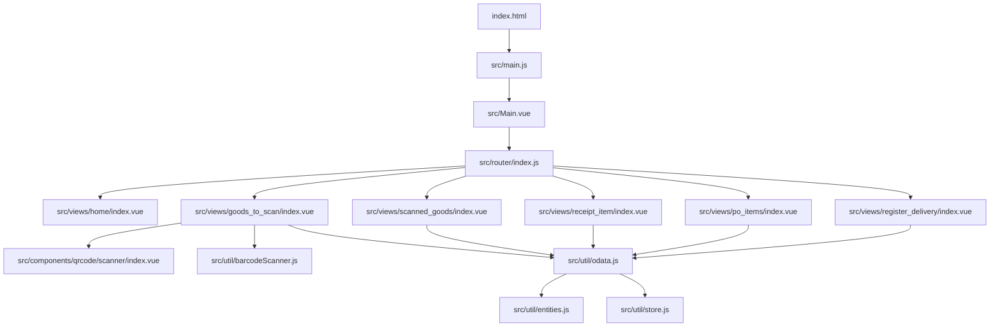
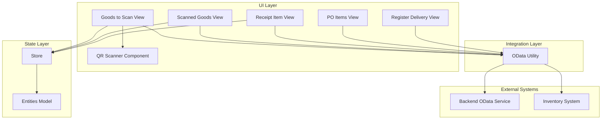
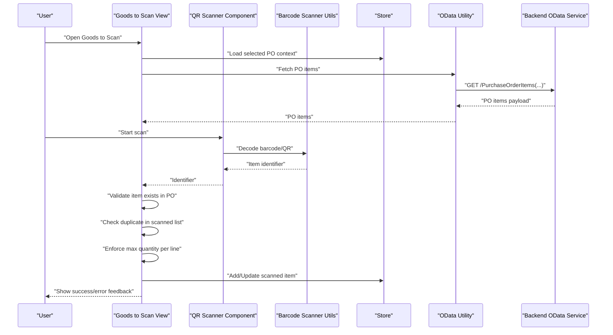
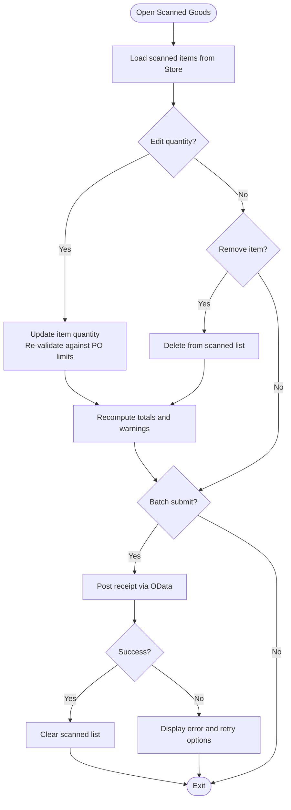
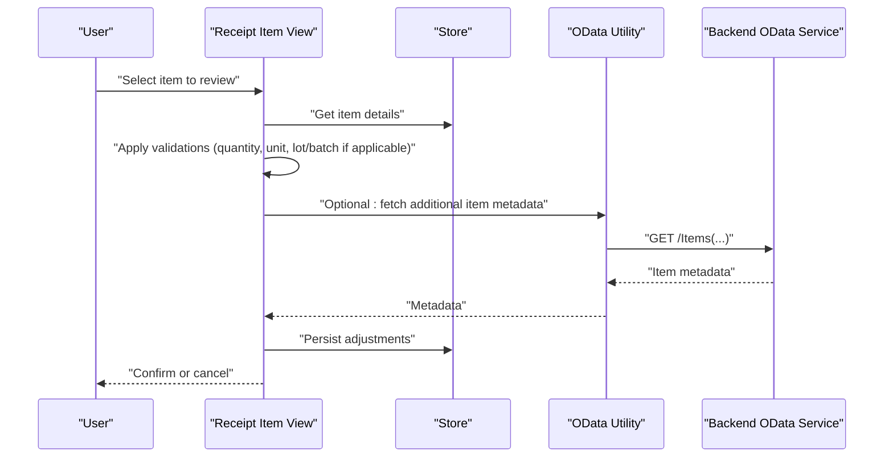
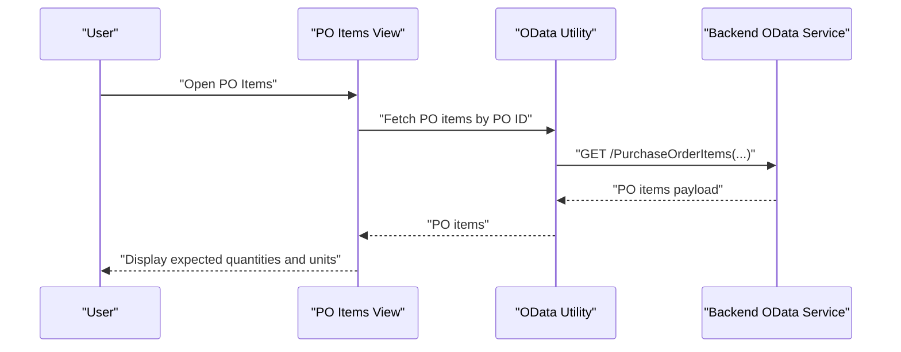
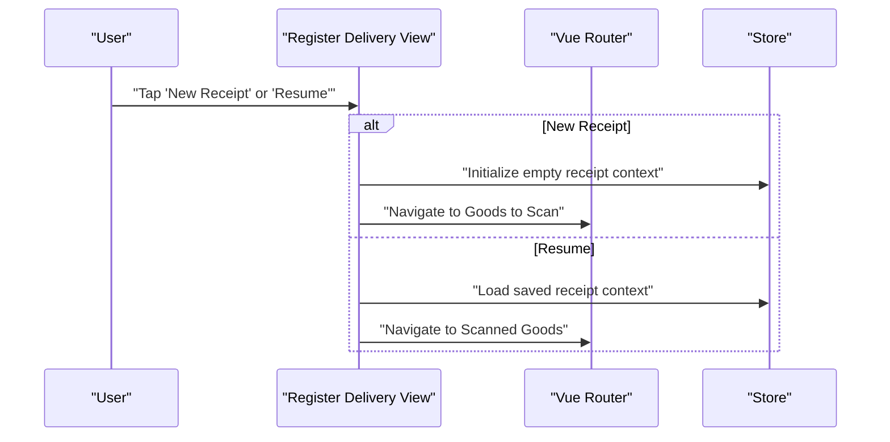
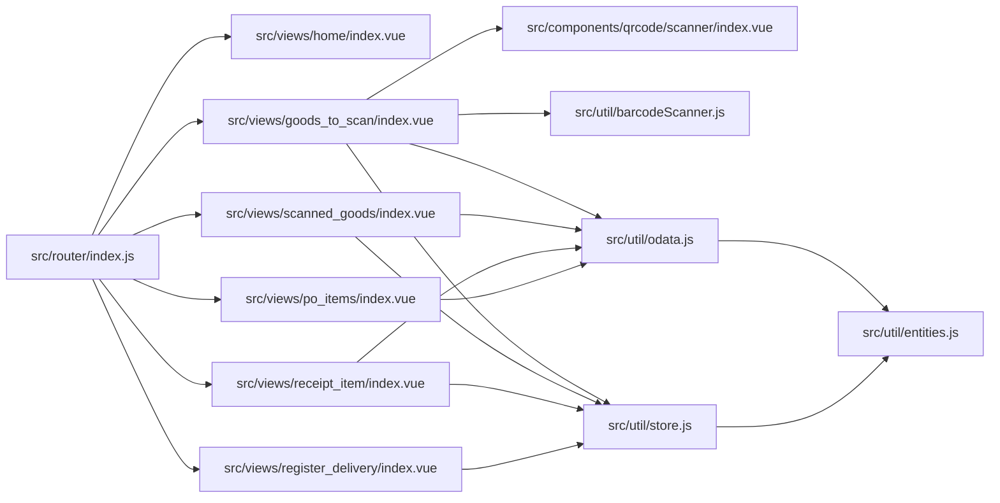

# Goods Receipt Management

<cite>
**Referenced Files in This Document**
- [README.md](file://README.md)
- [package.json](file://package.json)
- [vite.config.js](file://vite.config.js)
- [index.html](file://index.html)
- [src/main.js](file://src/main.js)
- [src/Main.vue](file://src/Main.vue)
- [src/router/index.js](file://src/router/index.js)
- [src/views/home/index.vue](file://src/views/home/index.vue)
- [src/views/goods_to_scan/index.vue](file://src/views/goods_to_scan/index.vue)
- [src/views/scanned_goods/index.vue](file://src/views/scanned_goods/index.vue)
- [src/views/receipt_item/index.vue](file://src/views/receipt_item/index.vue)
- [src/views/po_items/index.vue](file://src/views/po_items/index.vue)
- [src/views/register_delivery/index.vue](file://src/views/register_delivery/index.vue)
- [src/util/odata.js](file://src/util/odata.js)
- [src/util/entities.js](file://src/util/entities.js)
- [src/util/store.js](file://src/util/store.js)
- [src/components/qrcode/scanner/index.vue](file://src/components/qrcode/scanner/index.vue)
- [src/util/barcodeScanner.js](file://src/util/barcodeScanner.js)
</cite>

## Table of Contents
1. [Introduction](#introduction)
2. [Project Structure](#project-structure)
3. [Core Components](#core-components)
4. [Architecture Overview](#architecture-overview)
5. [Detailed Component Analysis](#detailed-component-analysis)
6. [Dependency Analysis](#dependency-analysis)
7. [Performance Considerations](#performance-considerations)
8. [Troubleshooting Guide](#troubleshooting-guide)
9. [Conclusion](#conclusion)
10. [Appendices](#appendices)

## Introduction
This document describes the goods receipt management system implemented in this repository. It covers the end-to-end workflow from goods arrival to inventory update, including item scanning, quantity validation, and receipt confirmation. It documents data models for goods items, scanned goods tracking, and receipt management; explains business rules for item validation, duplicate detection, and quantity calculations; outlines user interface workflows, form validations, and error handling scenarios; and provides examples of operations, batch processing capabilities, and integration with inventory systems through OData endpoints.

The application is a Vue 3-based web app that uses client-side routing, QR/barcode scanning components, and an OData utility layer to interact with backend services. The primary flows are:
- Select or create a purchase order (PO) context
- Scan items against PO lines
- Validate quantities and detect duplicates
- Confirm receipts and post updates via OData

[No sources needed since this section summarizes without analyzing specific files]

## Project Structure
The project follows a feature-oriented structure under src/views for UI screens and src/util for shared utilities. Key areas include:
- Views: Home, Goods to Scan, Scanned Goods, Receipt Item, PO Items, Register Delivery
- Utilities: OData client, entities model, store, barcode scanner
- Components: QR code scanner component used across views
- Routing: Centralized route definitions mapping URLs to view components

**Diagram sources**
- [index.html:1-200](file://index.html#L1-L200)
- [src/main.js:1-200](file://src/main.js#L1-L200)
- [src/Main.vue:1-200](file://src/Main.vue#L1-L200)
- [src/router/index.js:1-200](file://src/router/index.js#L1-L200)
- [src/views/home/index.vue:1-200](file://src/views/home/index.vue#L1-L200)
- [src/views/goods_to_scan/index.vue:1-200](file://src/views/goods_to_scan/index.vue#L1-L200)
- [src/views/scanned_goods/index.vue:1-200](file://src/views/scanned_goods/index.vue#L1-L200)
- [src/views/receipt_item/index.vue:1-200](file://src/views/receipt_item/index.vue#L1-L200)
- [src/views/po_items/index.vue:1-200](file://src/views/po_items/index.vue#L1-L200)
- [src/views/register_delivery/index.vue:1-200](file://src/views/register_delivery/index.vue#1-L200)
- [src/components/qrcode/scanner/index.vue:1-200](file://src/components/qrcode/scanner/index.vue#L1-L200)
- [src/util/barcodeScanner.js:1-200](file://src/util/barcodeScanner.js#L1-L200)
- [src/util/odata.js:1-200](file://src/util/odata.js#L1-L200)
- [src/util/entities.js:1-200](file://src/util/entities.js#L1-L200)
- [src/util/store.js:1-200](file://src/util/store.js#L1-L200)

**Section sources**
- [README.md:1-200](file://README.md#L1-L200)
- [package.json:1-200](file://package.json#L1-L200)
- [vite.config.js:1-200](file://vite.config.js#L1-L200)
- [index.html:1-200](file://index.html#L1-L200)
- [src/main.js:1-200](file://src/main.js#L1-L200)
- [src/Main.vue:1-200](file://src/Main.vue#L1-L200)
- [src/router/index.js:1-200](file://src/router/index.js#L1-L200)

## Core Components
- Goods to Scan View: Orchestrates scanning, displays current PO context, shows scanned items list, and exposes confirm actions.
- Scanned Goods View: Displays aggregated scanned items, supports editing quantities, removing entries, and batch operations.
- Receipt Item View: Focuses on a single item’s details and adjustments before final confirmation.
- PO Items View: Lists expected items from the selected PO to guide validation during scanning.
- Register Delivery View: Provides entry points to start a new receipt session or select an existing one.
- OData Utility: Encapsulates HTTP requests to backend OData services for reading POs, posting receipts, and querying inventory.
- Entities Model: Defines canonical data structures for goods items, scanned goods, and receipts.
- Store: Manages local state such as selected PO, scanned items, and pending receipts.
- Barcode Scanner Utilities and QR Scanner Component: Provide device camera access and decode barcodes/QR codes into item identifiers.

Key responsibilities:
- Input capture: barcode/QR decoding and manual input fallback
- Validation: item existence, quantity limits, duplicate detection
- State management: maintain scanned items and receipt drafts
- Integration: call OData endpoints to read POs and post receipts

**Section sources**
- [src/views/goods_to_scan/index.vue:1-200](file://src/views/goods_to_scan/index.vue#L1-L200)
- [src/views/scanned_goods/index.vue:1-200](file://src/views/scanned_goods/index.vue#L1-L200)
- [src/views/receipt_item/index.vue:1-200](file://src/views/receipt_item/index.vue#L1-L200)
- [src/views/po_items/index.vue:1-200](file://src/views/po_items/index.vue#L1-L200)
- [src/views/register_delivery/index.vue:1-200](file://src/views/register_delivery/index.vue#L1-L200)
- [src/util/odata.js:1-200](file://src/util/odata.js#L1-L200)
- [src/util/entities.js:1-200](file://src/util/entities.js#L1-L200)
- [src/util/store.js:1-200](file://src/util/store.js#L1-L200)
- [src/components/qrcode/scanner/index.vue:1-200](file://src/components/qrcode/scanner/index.vue#L1-L200)
- [src/util/barcodeScanner.js:1-200](file://src/util/barcodeScanner.js#L1-L200)

## Architecture Overview
The system is a client-first Vue application with clear separation between UI, state, and integration layers.

**Diagram sources**
- [src/views/goods_to_scan/index.vue:1-200](file://src/views/goods_to_scan/index.vue#L1-L200)
- [src/views/scanned_goods/index.vue:1-200](file://src/views/scanned_goods/index.vue#L1-L200)
- [src/views/receipt_item/index.vue:1-200](file://src/views/receipt_item/index.vue#L1-L200)
- [src/views/po_items/index.vue:1-200](file://src/views/po_items/index.vue#L1-L200)
- [src/views/register_delivery/index.vue:1-200](file://src/views/register_delivery/index.vue#L1-L200)
- [src/components/qrcode/scanner/index.vue:1-200](file://src/components/qrcode/scanner/index.vue#L1-L200)
- [src/util/store.js:1-200](file://src/util/store.js#L1-L200)
- [src/util/entities.js:1-200](file://src/util/entities.js#L1-L200)
- [src/util/odata.js:1-200](file://src/util/odata.js#L1-L200)

## Detailed Component Analysis

### Goods to Scan Workflow
This flow captures items via barcode/QR, validates them against the selected PO, prevents duplicates, enforces quantity limits, and prepares items for confirmation.

**Diagram sources**
- [src/views/goods_to_scan/index.vue:1-200](file://src/views/goods_to_scan/index.vue#L1-L200)
- [src/components/qrcode/scanner/index.vue:1-200](file://src/components/qrcode/scanner/index.vue#L1-L200)
- [src/util/barcodeScanner.js:1-200](file://src/util/barcodeScanner.js#L1-L200)
- [src/util/store.js:1-200](file://src/util/store.js#L1-L200)
- [src/util/odata.js:1-200](file://src/util/odata.js#L1-L200)

**Section sources**
- [src/views/goods_to_scan/index.vue:1-200](file://src/views/goods_to_scan/index.vue#L1-L200)
- [src/components/qrcode/scanner/index.vue:1-200](file://src/components/qrcode/scanner/index.vue#L1-L200)
- [src/util/barcodeScanner.js:1-200](file://src/util/barcodeScanner.js#L1-L200)
- [src/util/odata.js:1-200](file://src/util/odata.js#L1-L200)
- [src/util/store.js:1-200](file://src/util/store.js#L1-L200)

### Scanned Goods Aggregation and Batch Operations
The Scanned Goods view aggregates all scanned items, allows edits, removals, and batch submission.

**Diagram sources**
- [src/views/scanned_goods/index.vue:1-200](file://src/views/scanned_goods/index.vue#L1-L200)
- [src/util/store.js:1-200](file://src/util/store.js#L1-L200)
- [src/util/odata.js:1-200](file://src/util/odata.js#L1-L200)

**Section sources**
- [src/views/scanned_goods/index.vue:1-200](file://src/views/scanned_goods/index.vue#L1-L200)
- [src/util/store.js:1-200](file://src/util/store.js#L1-L200)
- [src/util/odata.js:1-200](file://src/util/odata.js#L1-L200)

### Receipt Item Detail Flow
The Receipt Item view focuses on a single item’s details and adjustments prior to confirmation.

**Diagram sources**
- [src/views/receipt_item/index.vue:1-200](file://src/views/receipt_item/index.vue#L1-L200)
- [src/util/store.js:1-200](file://src/util/store.js#L1-L200)
- [src/util/odata.js:1-200](file://src/util/odata.js#L1-L200)

**Section sources**
- [src/views/receipt_item/index.vue:1-200](file://src/views/receipt_item/index.vue#L1-L200)
- [src/util/store.js:1-200](file://src/util/store.js#L1-L200)
- [src/util/odata.js:1-200](file://src/util/odata.js#L1-L200)

### PO Items Reference
The PO Items view lists expected items to guide validation during scanning and to highlight discrepancies.

**Diagram sources**
- [src/views/po_items/index.vue:1-200](file://src/views/po_items/index.vue#L1-L200)
- [src/util/odata.js:1-200](file://src/util/odata.js#L1-L200)

**Section sources**
- [src/views/po_items/index.vue:1-200](file://src/views/po_items/index.vue#L1-L200)
- [src/util/odata.js:1-200](file://src/util/odata.js#L1-L200)

### Register Delivery Entry Point
The Register Delivery view provides navigation to start a new receipt session or resume an existing one.

**Diagram sources**
- [src/views/register_delivery/index.vue:1-200](file://src/views/register_delivery/index.vue#L1-L200)
- [src/util/store.js:1-200](file://src/util/store.js#L1-L200)
- [src/router/index.js:1-200](file://src/router/index.js#L1-L200)

**Section sources**
- [src/views/register_delivery/index.vue:1-200](file://src/views/register_delivery/index.vue#L1-L200)
- [src/util/store.js:1-200](file://src/util/store.js#L1-L200)
- [src/router/index.js:1-200](file://src/router/index.js#L1-L200)

### Data Models
Canonical data structures used across the system:

- Goods Item
  - Fields: identifier (e.g., material number), description, unit of measure, expected quantity, received quantity, status flags
  - Purpose: Represents a line item in a PO and its receipt progress

- Scanned Goods Tracking
  - Fields: item identifier, scanned timestamp, operator/session id, quantity added, source (barcode/QR/manual), validation result
  - Purpose: Tracks each scan event and maintains auditability

- Receipt Management
  - Fields: receipt ID, PO ID, creation timestamp, status (draft/submitted), total items, total quantities, posted flag
  - Purpose: Groups scanned items into a cohesive receipt operation

These models are defined and referenced in the entities and store modules.

**Section sources**
- [src/util/entities.js:1-200](file://src/util/entities.js#L1-L200)
- [src/util/store.js:1-200](file://src/util/store.js#L1-L200)

### Business Rules
- Item Validation
  - Ensure the scanned identifier matches an active PO line
  - Verify unit of measure compatibility
  - Check lot/batch constraints if applicable

- Duplicate Detection
  - Prevent adding the same item identifier twice within the same receipt unless explicitly allowed
  - Merge duplicate scans by incrementing quantity when permitted

- Quantity Calculations
  - Enforce maximum quantity per PO line
  - Compute running totals and remaining quantities
  - Round or convert quantities according to UOM rules

- Confirmation and Posting
  - Require all mandatory fields and validations to pass
  - Post receipt via OData and update local state upon success

**Section sources**
- [src/views/goods_to_scan/index.vue:1-200](file://src/views/goods_to_scan/index.vue#L1-L200)
- [src/views/scanned_goods/index.vue:1-200](file://src/views/scanned_goods/index.vue#L1-L200)
- [src/util/entities.js:1-200](file://src/util/entities.js#L1-L200)
- [src/util/store.js:1-200](file://src/util/store.js#L1-L200)
- [src/util/odata.js:1-200](file://src/util/odata.js#L1-L200)

### User Interface Workflows and Form Validations
- Goods to Scan
  - Real-time feedback on scan results
  - Inline errors for invalid/duplicate items
  - Visual indicators for over-receipt warnings

- Scanned Goods
  - Editable quantity fields with immediate revalidation
  - Batch submit button with confirmation dialog
  - Summary panel showing totals and exceptions

- Receipt Item
  - Focused form for item-level adjustments
  - Mandatory field checks and format validations
  - Save draft and continue later support

- PO Items
  - Read-only reference table with expected vs received columns
  - Highlighted discrepancies for quick attention

**Section sources**
- [src/views/goods_to_scan/index.vue:1-200](file://src/views/goods_to_scan/index.vue#L1-L200)
- [src/views/scanned_goods/index.vue:1-200](file://src/views/scanned_goods/index.vue#L1-L200)
- [src/views/receipt_item/index.vue:1-200](file://src/views/receipt_item/index.vue#L1-L200)
- [src/views/po_items/index.vue:1-200](file://src/views/po_items/index.vue#L1-L200)

### Error Handling Scenarios
- Network failures during OData calls
  - Retry mechanism with exponential backoff
  - User-friendly messages and offline queueing where supported

- Validation errors
  - Immediate inline feedback with actionable guidance
  - Blocking submission until resolved

- Duplicate scans
  - Prompt user to merge or reject duplicates
  - Maintain audit trail of decisions

- Over-receipt conditions
  - Warning banners and optional override with justification

**Section sources**
- [src/util/odata.js:1-200](file://src/util/odata.js#L1-L200)
- [src/views/goods_to_scan/index.vue:1-200](file://src/views/goods_to_scan/index.vue#L1-L200)
- [src/views/scanned_goods/index.vue:1-200](file://src/views/scanned_goods/index.vue#L1-L200)

### Examples of Goods Receipt Operations
- Single-item scan and confirm
  - Open Goods to Scan, scan item, verify quantity, add to list, then submit via Scanned Goods

- Multi-item batch processing
  - Scan multiple items, review in Scanned Goods, adjust quantities, then batch submit

- Resume interrupted receipt
  - Use Register Delivery to resume previous draft and continue scanning

- Inventory integration
  - After successful posting, inventory levels reflect updated quantities via backend OData responses

[No sources needed since this section provides general usage examples]

### Integration with Inventory Systems via OData
- Reading POs and item metadata
  - GET requests to PO and item endpoints to populate reference data

- Posting receipts
  - POST requests to receipt endpoints with aggregated scanned items

- Querying inventory status
  - Optional GET requests to check current stock levels pre/post receipt

- Error propagation
  - OData error codes mapped to user-facing messages and recovery steps

**Section sources**
- [src/util/odata.js:1-200](file://src/util/odata.js#L1-L200)

## Dependency Analysis
The following diagram highlights key dependencies among core modules and external integrations.

**Diagram sources**
- [src/router/index.js:1-200](file://src/router/index.js#L1-L200)
- [src/views/home/index.vue:1-200](file://src/views/home/index.vue#L1-L200)
- [src/views/goods_to_scan/index.vue:1-200](file://src/views/goods_to_scan/index.vue#L1-L200)
- [src/views/scanned_goods/index.vue:1-200](file://src/views/scanned_goods/index.vue#L1-L200)
- [src/views/receipt_item/index.vue:1-200](file://src/views/receipt_item/index.vue#L1-L200)
- [src/views/po_items/index.vue:1-200](file://src/views/po_items/index.vue#L1-L200)
- [src/views/register_delivery/index.vue:1-200](file://src/views/register_delivery/index.vue#L1-L200)
- [src/components/qrcode/scanner/index.vue:1-200](file://src/components/qrcode/scanner/index.vue#L1-L200)
- [src/util/barcodeScanner.js:1-200](file://src/util/barcodeScanner.js#L1-L200)
- [src/util/store.js:1-200](file://src/util/store.js#L1-L200)
- [src/util/odata.js:1-200](file://src/util/odata.js#L1-L200)
- [src/util/entities.js:1-200](file://src/util/entities.js#L1-L200)

**Section sources**
- [src/router/index.js:1-200](file://src/router/index.js#L1-L200)
- [src/views/goods_to_scan/index.vue:1-200](file://src/views/goods_to_scan/index.vue#L1-L200)
- [src/views/scanned_goods/index.vue:1-200](file://src/views/scanned_goods/index.vue#L1-L200)
- [src/views/receipt_item/index.vue:1-200](file://src/views/receipt_item/index.vue#L1-L200)
- [src/views/po_items/index.vue:1-200](file://src/views/po_items/index.vue#L1-L200)
- [src/views/register_delivery/index.vue:1-200](file://src/views/register_delivery/index.vue#L1-L200)
- [src/util/odata.js:1-200](file://src/util/odata.js#L1-L200)
- [src/util/entities.js:1-200](file://src/util/entities.js#L1-L200)
- [src/util/store.js:1-200](file://src/util/store.js#L1-L200)

## Performance Considerations
- Minimize network calls by caching PO items locally during a session
- Debounce rapid scans to avoid redundant validations
- Batch submissions to reduce server load
- Lazy-load heavy components like QR scanner only when needed
- Optimize rendering by using keyed lists and avoiding unnecessary re-renders

[No sources needed since this section provides general guidance]

## Troubleshooting Guide
- Scanning issues
  - Ensure camera permissions are granted
  - Verify lighting and focus for reliable decoding
  - Fall back to manual input if scanning fails

- OData connectivity problems
  - Check endpoint URLs and authentication configuration
  - Inspect network logs for HTTP status codes and error payloads
  - Implement retry logic and user prompts for retries

- Validation conflicts
  - Review PO line constraints and UOM settings
  - Resolve duplicates by merging or rejecting scans
  - Adjust quantities to meet maximum limits

- State inconsistencies
  - Reset receipt context if necessary
  - Clear local cache and reload PO data
  - Verify store synchronization after posting

**Section sources**
- [src/util/barcodeScanner.js:1-200](file://src/util/barcodeScanner.js#L1-L200)
- [src/components/qrcode/scanner/index.vue:1-200](file://src/components/qrcode/scanner/index.vue#L1-L200)
- [src/util/odata.js:1-200](file://src/util/odata.js#L1-L200)
- [src/util/store.js:1-200](file://src/util/store.js#L1-L200)

## Conclusion
The goods receipt management system provides a robust, user-friendly workflow for scanning, validating, and confirming goods receipts. It integrates seamlessly with backend OData services to keep inventory accurate and auditable. By adhering to the documented business rules and leveraging the provided UI patterns, operators can efficiently manage receipts, handle edge cases, and maintain high data integrity.

[No sources needed since this section summarizes without analyzing specific files]

## Appendices
- Installation and setup instructions are available in the project README and package configuration.
- Build and development scripts are configured via Vite and npm scripts.

**Section sources**
- [README.md:1-200](file://README.md#L1-L200)
- [package.json:1-200](file://package.json#L1-L200)
- [vite.config.js:1-200](file://vite.config.js#L1-L200)