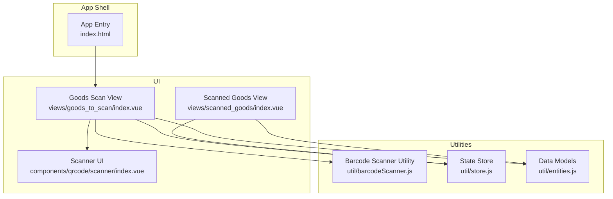
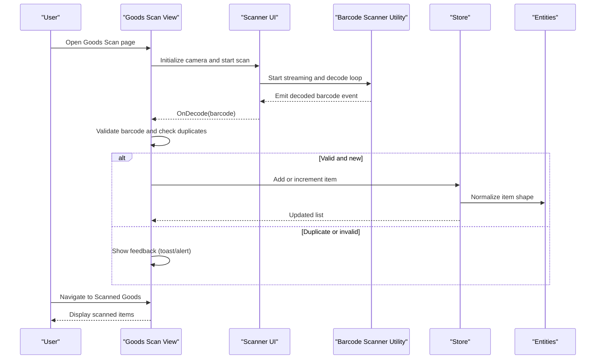
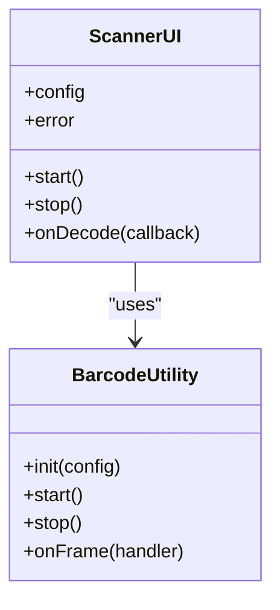
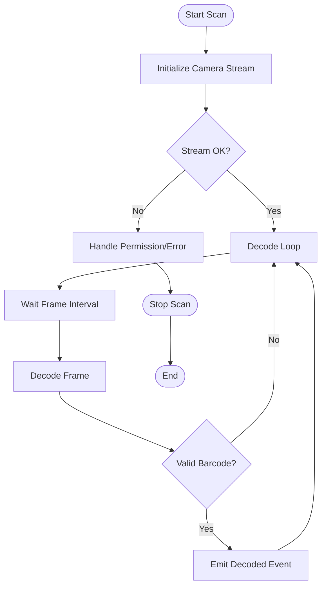
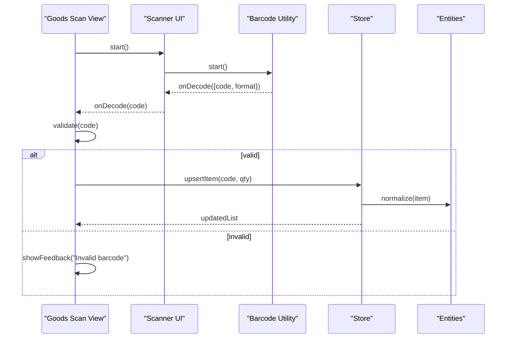
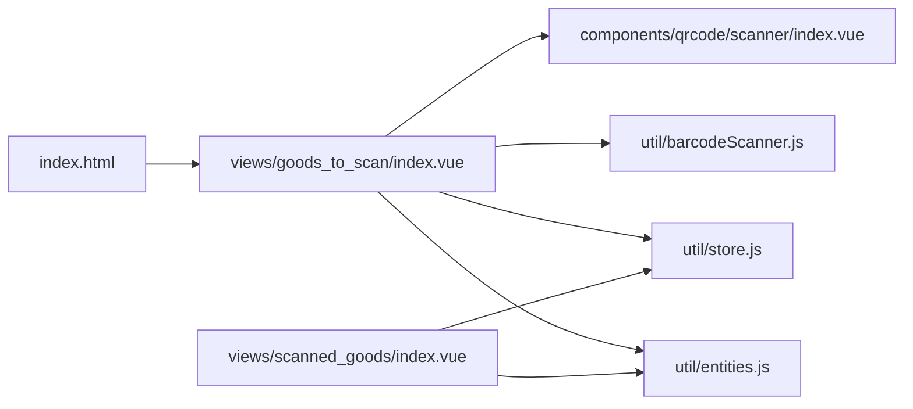

# Goods Scanning Workflow

<cite>
**Referenced Files in This Document**
- [index.vue](file://src/components/qrcode/scanner/index.vue)
- [barcodeScanner.js](file://src/util/barcodeScanner.js)
- [index.vue](file://src/views/goods_to_scan/index.vue)
- [index.vue](file://src/views/scanned_goods/index.vue)
- [index.vue](file://src/components/qrcode/generator/index.vue)
- [store.js](file://src/util/store.js)
- [entities.js](file://src/util/entities.js)
- [index.html](file://index.html)
</cite>

## Table of Contents
1. [Introduction](#introduction)
2. [Project Structure](#project-structure)
3. [Core Components](#core-components)
4. [Architecture Overview](#architecture-overview)
5. [Detailed Component Analysis](#detailed-component-analysis)
6. [Dependency Analysis](#dependency-analysis)
7. [Performance Considerations](#performance-considerations)
8. [Troubleshooting Guide](#troubleshooting-guide)
9. [Conclusion](#conclusion)

## Introduction
This document describes the goods scanning workflow component, focusing on the real-time barcode scanning interface, camera integration, and scan result processing. It explains scanner configuration options, supported barcode formats, error handling mechanisms, and the user interaction flow from initiating a scan to displaying results. It also covers validation, duplicate detection, quantity input handling, performance optimization for continuous scanning, and battery usage considerations on mobile devices.

## Project Structure
The goods scanning feature is implemented as a Vue-based web application with:
- A dedicated scanner UI component that renders the camera feed and overlay controls.
- A utility module that encapsulates barcode decoding logic and device camera access.
- View pages that orchestrate scanning workflows, manage scanned items state, and present results.
- Supporting utilities for data models and persistent storage.

**Diagram sources**
- [index.vue](file://src/components/qrcode/scanner/index.vue)
- [barcodeScanner.js](file://src/util/barcodeScanner.js)
- [index.vue](file://src/views/goods_to_scan/index.vue)
- [index.vue](file://src/views/scanned_goods/index.vue)
- [store.js](file://src/util/store.js)
- [entities.js](file://src/util/entities.js)
- [index.html](file://index.html)

**Section sources**
- [index.vue](file://src/components/qrcode/scanner/index.vue)
- [barcodeScanner.js](file://src/util/barcodeScanner.js)
- [index.vue](file://src/views/goods_to_scan/index.vue)
- [index.vue](file://src/views/scanned_goods/index.vue)
- [store.js](file://src/util/store.js)
- [entities.js](file://src/util/entities.js)
- [index.html](file://index.html)

## Core Components
- Scanner UI Component
  - Renders the live camera preview and provides start/stop controls.
  - Emits decoded barcode events to the parent view for processing.
  - Handles camera permission prompts and error states (e.g., no camera, denied permissions).
- Barcode Scanner Utility
  - Encapsulates camera stream acquisition and barcode decoding.
  - Exposes configuration options such as target format selection, frame interval, and region-of-interest cropping.
  - Normalizes decode results into a consistent shape for downstream processing.
- Goods Scan View
  - Orchestrates the scanning session lifecycle.
  - Manages item deduplication, quantity updates, and validation rules.
  - Persists scanned items via the store and navigates to the summary view.
- Scanned Goods View
  - Displays the list of scanned items with quantities and allows edits or removals.
  - Provides actions to submit or clear the batch.

**Section sources**
- [index.vue](file://src/components/qrcode/scanner/index.vue)
- [barcodeScanner.js](file://src/util/barcodeScanner.js)
- [index.vue](file://src/views/goods_to_scan/index.vue)
- [index.vue](file://src/views/scanned_goods/index.vue)
- [store.js](file://src/util/store.js)
- [entities.js](file://src/util/entities.js)

## Architecture Overview
The scanning workflow follows a layered architecture:
- Presentation Layer: Vue components render the UI and handle user interactions.
- Service Layer: The barcode utility abstracts camera and decoding operations.
- State Layer: The store persists scanned items and exposes reactive APIs.
- Data Layer: Entities define the canonical structure of scanned items.

**Diagram sources**
- [index.vue](file://src/views/goods_to_scan/index.vue)
- [index.vue](file://src/components/qrcode/scanner/index.vue)
- [barcodeScanner.js](file://src/util/barcodeScanner.js)
- [store.js](file://src/util/store.js)
- [entities.js](file://src/util/entities.js)

## Detailed Component Analysis

### Scanner UI Component
Responsibilities:
- Manage camera permissions and stream lifecycle.
- Render video preview and overlay controls.
- Forward decode events to the parent view.

Key behaviors:
- Start/Stop scanning toggles the underlying decoder loop.
- Error states surface friendly messages when camera access fails.
- Optional region-of-interest can be configured to improve accuracy and performance.

**Diagram sources**
- [index.vue](file://src/components/qrcode/scanner/index.vue)
- [barcodeScanner.js](file://src/util/barcodeScanner.js)

**Section sources**
- [index.vue](file://src/components/qrcode/scanner/index.vue)
- [barcodeScanner.js](file://src/util/barcodeScanner.js)

### Barcode Scanner Utility
Responsibilities:
- Access the device camera and create a readable stream.
- Decode frames at a configurable interval to balance accuracy and performance.
- Support multiple barcode formats via configuration.
- Normalize results into a standard object shape.

Configuration options:
- Formats: array of supported symbologies (e.g., EAN-13, UPC-A, Code 128, QR Code).
- Frame interval: milliseconds between decode attempts.
- Region of interest: x, y, width, height normalized to [0..1] to focus scanning area.
- Facing mode: user vs environment camera preference.
- Resolution hints: preferred width/height for camera constraints.

Supported formats:
- Common linear barcodes: EAN-13, UPC-A, Code 128, Code 39, ITF, Codabar.
- 2D codes: QR Code, Data Matrix, Aztec.
- Note: Actual availability depends on the underlying decoding library and browser capabilities.

Error handling:
- Camera permission denied: prompt user to allow access and retry.
- No camera found: show guidance to connect an external camera or use a different device.
- Decode failures: continue scanning without interrupting the session; log warnings for diagnostics.

**Diagram sources**
- [barcodeScanner.js](file://src/util/barcodeScanner.js)

**Section sources**
- [barcodeScanner.js](file://src/util/barcodeScanner.js)

### Goods Scan View
Responsibilities:
- Orchestrate scanning sessions and integrate with the scanner UI.
- Implement validation rules for scanned barcodes.
- Detect duplicates and update quantities accordingly.
- Persist changes to the store and navigate to the summary view.

Validation examples:
- Ensure barcode matches expected length and checksum rules.
- Reject unsupported or malformed codes with user feedback.

Duplicate detection:
- Compare incoming barcode against existing items by identifier.
- If duplicate exists, increment quantity instead of adding a new row.

Quantity input handling:
- Provide inline editing for quantity with min/max constraints.
- Prevent negative values and enforce integer increments.

**Diagram sources**
- [index.vue](file://src/views/goods_to_scan/index.vue)
- [index.vue](file://src/components/qrcode/scanner/index.vue)
- [barcodeScanner.js](file://src/util/barcodeScanner.js)
- [store.js](file://src/util/store.js)
- [entities.js](file://src/util/entities.js)

**Section sources**
- [index.vue](file://src/views/goods_to_scan/index.vue)
- [store.js](file://src/util/store.js)
- [entities.js](file://src/util/entities.js)

### Scanned Goods View
Responsibilities:
- Present the current batch of scanned items with quantities.
- Allow editing quantities and removing items.
- Provide actions to submit or clear the batch.

Interactions:
- Edit quantity triggers validation and re-renders totals.
- Remove item updates the store and recalculates summaries.

**Section sources**
- [index.vue](file://src/views/scanned_goods/index.vue)
- [store.js](file://src/util/store.js)
- [entities.js](file://src/util/entities.js)

### QR Code Generator (Supporting Feature)
While not part of the scanning path, the generator component can produce scannable codes for testing and labeling workflows.

**Section sources**
- [index.vue](file://src/components/qrcode/generator/index.vue)

## Dependency Analysis
The goods scanning workflow relies on a small set of cohesive modules:
- The scanner UI depends on the barcode utility for camera and decoding.
- Views depend on the store for persistence and entities for normalization.
- The app shell initializes the router and mounts the root component.

**Diagram sources**
- [index.html](file://index.html)
- [index.vue](file://src/views/goods_to_scan/index.vue)
- [index.vue](file://src/components/qrcode/scanner/index.vue)
- [barcodeScanner.js](file://src/util/barcodeScanner.js)
- [store.js](file://src/util/store.js)
- [entities.js](file://src/util/entities.js)

**Section sources**
- [index.html](file://index.html)
- [index.vue](file://src/views/goods_to_scan/index.vue)
- [index.vue](file://src/components/qrcode/scanner/index.vue)
- [barcodeScanner.js](file://src/util/barcodeScanner.js)
- [store.js](file://src/util/store.js)
- [entities.js](file://src/util/entities.js)

## Performance Considerations
Continuous scanning performance:
- Frame interval tuning: Increase the interval to reduce CPU load on low-end devices; decrease it for faster responsiveness on high-performance devices.
- Region of interest: Limit the scanning area to reduce decode workload and improve accuracy.
- Format filtering: Enable only required formats to minimize decoding overhead.
- Debounce rapid scans: Avoid duplicate processing by debouncing decode events within the view layer.

Battery usage on mobile:
- Prefer rear camera (environment-facing) for better lighting and autofocus.
- Reduce screen brightness while scanning and avoid unnecessary animations.
- Pause scanning when the view is hidden or inactive.
- Use hardware-accelerated decoding where available and fall back gracefully.

Memory management:
- Stop the camera stream when leaving the scanning view to release resources.
- Clear any timers and event listeners to prevent leaks.

[No sources needed since this section provides general guidance]

## Troubleshooting Guide
Common issues and resolutions:
- Camera permission denied
  - Prompt the user to grant camera access and retry initialization.
  - Provide a link to system settings if automatic permission cannot be granted.
- No camera detected
  - Inform the user to connect an external camera or use a different device.
  - Offer manual entry fallback for critical operations.
- Poor scan accuracy
  - Adjust region of interest to center the barcode.
  - Improve lighting and ensure the barcode is clean and undamaged.
  - Narrow supported formats to those actually used.
- High CPU or battery drain
  - Increase frame interval and disable unused formats.
  - Ensure the camera stream is stopped when not actively scanning.

Diagnostic tips:
- Log decode errors and camera errors with context (device model, OS version).
- Capture last known frame metadata (resolution, facing mode) for reproduction.

**Section sources**
- [index.vue](file://src/components/qrcode/scanner/index.vue)
- [barcodeScanner.js](file://src/util/barcodeScanner.js)
- [index.vue](file://src/views/goods_to_scan/index.vue)

## Conclusion
The goods scanning workflow integrates a responsive scanner UI with a robust barcode utility to deliver reliable real-time scanning. By configuring formats, frame intervals, and regions of interest, teams can optimize for accuracy and performance across diverse devices. Validation, duplicate detection, and quantity handling ensure data integrity, while thoughtful error handling and performance practices provide a smooth experience for warehouse and retail operators.