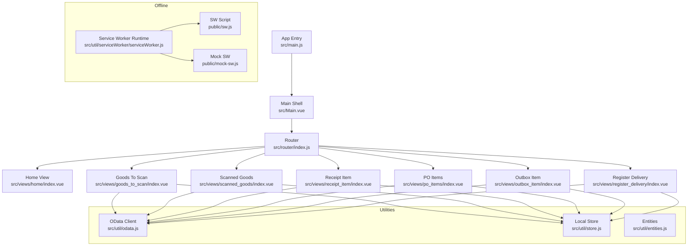
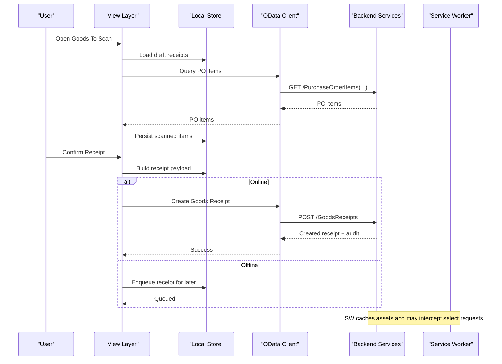
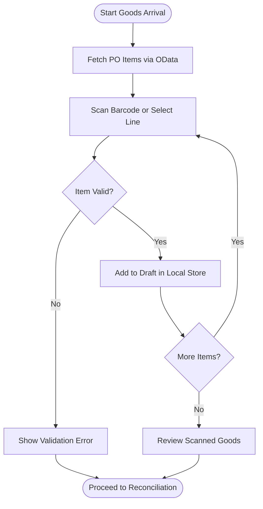
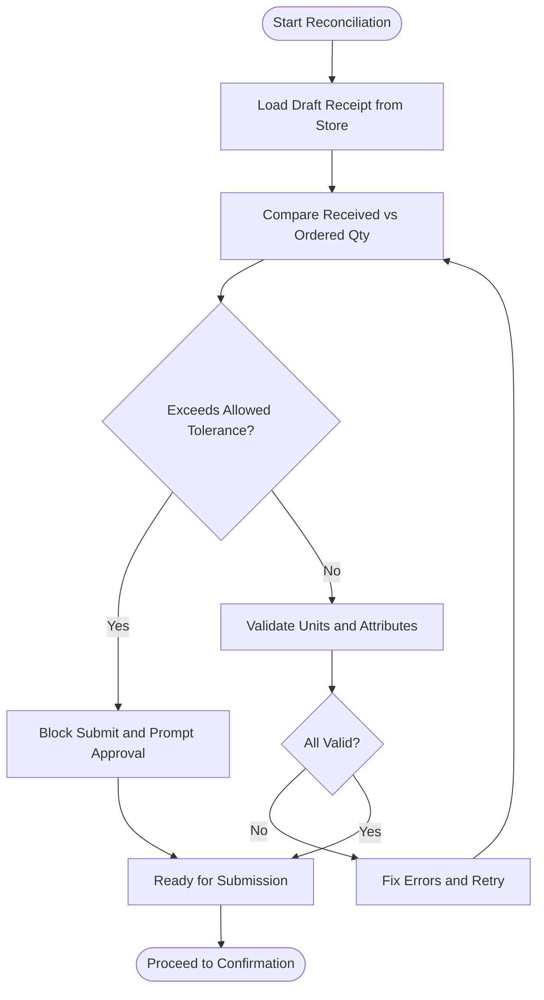
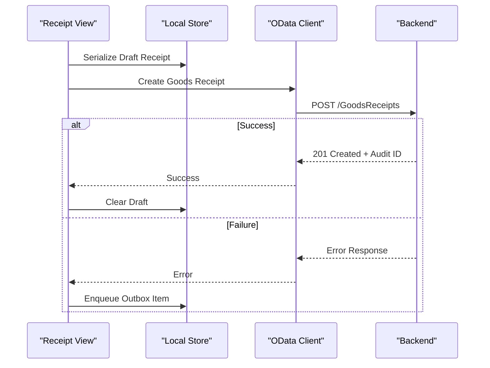
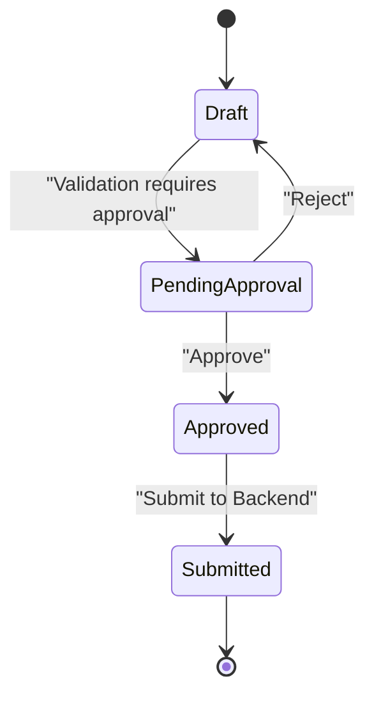
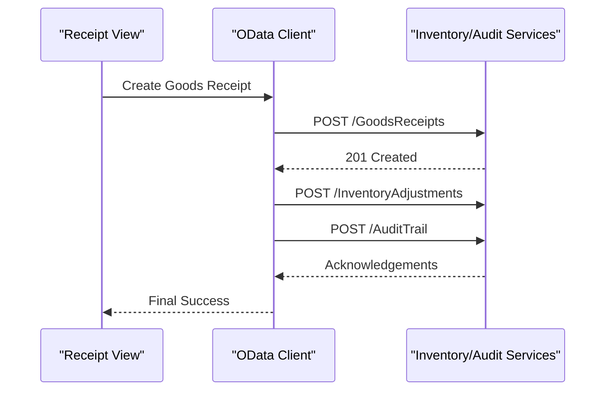
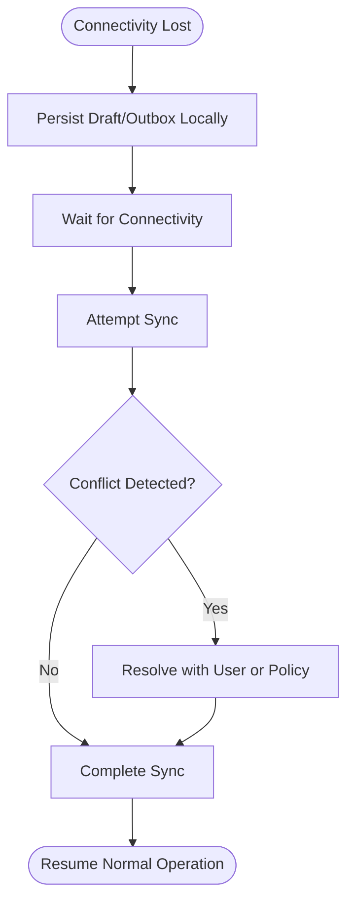
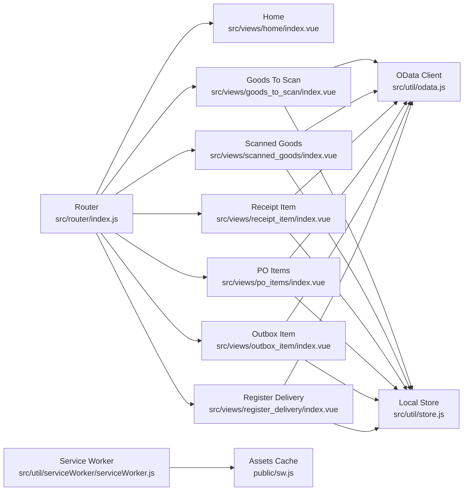

# Receipt Processing

<cite>
**Referenced Files in This Document**
- [README.md](file://README.md)
- [package.json](file://package.json)
- [vite.config.js](file://vite.config.js)
- [src/main.js](file://src/main.js)
- [src/Main.vue](file://src/Main.vue)
- [src/router/index.js](file://src/router/index.js)
- [src/views/home/index.vue](file://src/views/home/index.vue)
- [src/views/goods_to_scan/index.vue](file://src/views/goods_to_scan/index.vue)
- [src/views/scanned_goods/index.vue](file://src/views/scanned_goods/index.vue)
- [src/views/receipt_item/index.vue](file://src/views/receipt_item/index.vue)
- [src/views/po_items/index.vue](file://src/views/po_items/index.vue)
- [src/views/outbox_item/index.vue](file://src/views/outbox_item/index.vue)
- [src/views/register_delivery/index.vue](file://src/views/register_delivery/index.vue)
- [src/util/odata.js](file://src/util/odata.js)
- [src/util/store.js](file://src/util/store.js)
- [src/util/entities.js](file://src/util/entities.js)
- [src/util/serviceWorker/serviceWorker.js](file://src/util/serviceWorker/serviceWorker.js)
- [public/sw.js](file://public/sw.js)
- [public/mock-sw.js](file://public/mock-sw.js)
</cite>

## Table of Contents
1. [Introduction](#introduction)
2. [Project Structure](#project-structure)
3. [Core Components](#core-components)
4. [Architecture Overview](#architecture-overview)
5. [Detailed Component Analysis](#detailed-component-analysis)
6. [Dependency Analysis](#dependency-analysis)
7. [Performance Considerations](#performance-considerations)
8. [Troubleshooting Guide](#troubleshooting-guide)
9. [Conclusion](#conclusion)
10. [Appendices](#appendices)

## Introduction
This document describes the receipt processing system implemented in this repository. It covers the end-to-end workflow from goods arrival to receipt confirmation, including validation checks, quantity reconciliation, and final submission. It also documents business rules for approval, error handling scenarios, rollback mechanisms, integration with OData endpoints for inventory updates and audit trail creation, examples of receipt lifecycle operations (creation, modification, cancellation), offline capabilities, conflict resolution, and data synchronization strategies.

The application is a Vue-based web app that uses an OData client for backend communication, a local store for persistence, and a service worker for caching and offline support. The primary user flows involve scanning or selecting goods, reconciling quantities against purchase orders, creating receipts, and submitting them to the backend.

[No sources needed since this section provides general context]

## Project Structure
At a high level:
- Views implement the UI screens for each step of the receipt process.
- Utilities provide OData connectivity, local state management, and entity definitions.
- Service workers enable caching and offline behavior.
- Router wires views into navigation.

**Diagram sources**
- [src/main.js:1-200](file://src/main.js#L1-L200)
- [src/Main.vue:1-200](file://src/Main.vue#L1-L200)
- [src/router/index.js:1-200](file://src/router/index.js#L1-L200)
- [src/views/goods_to_scan/index.vue:1-200](file://src/views/goods_to_scan/index.vue#L1-L200)
- [src/views/scanned_goods/index.vue:1-200](file://src/views/scanned_goods/index.vue#L1-L200)
- [src/views/receipt_item/index.vue:1-200](file://src/views/receipt_item/index.vue#L1-L200)
- [src/views/po_items/index.vue:1-200](file://src/views/po_items/index.vue#L1-L200)
- [src/views/outbox_item/index.vue:1-200](file://src/views/outbox_item/index.vue#L1-L200)
- [src/views/register_delivery/index.vue:1-200](file://src/views/register_delivery/index.vue#L1-L200)
- [src/util/odata.js:1-200](file://src/util/odata.js#L1-L200)
- [src/util/store.js:1-200](file://src/util/store.js#L1-L200)
- [src/util/serviceWorker/serviceWorker.js:1-200](file://src/util/serviceWorker/serviceWorker.js#L1-L200)
- [public/sw.js:1-200](file://public/sw.js#L1-L200)
- [public/mock-sw.js:1-200](file://public/mock-sw.js#L1-L200)

**Section sources**
- [README.md:1-200](file://README.md#L1-L200)
- [package.json:1-200](file://package.json#L1-L200)
- [vite.config.js:1-200](file://vite.config.js#L1-L200)
- [src/main.js:1-200](file://src/main.js#L1-L200)
- [src/Main.vue:1-200](file://src/Main.vue#L1-L200)
- [src/router/index.js:1-200](file://src/router/index.js#L1-L200)

## Core Components
- OData client: Provides methods to query and mutate OData entities such as Purchase Orders, Goods Receipts, and Inventory. It handles request construction, headers, retries, and error mapping.
- Local store: Persists draft receipts, scanned items, and outbox queue entries for offline operation. It exposes CRUD-like APIs and change tracking.
- Entities: Typed definitions for domain objects used across views and utilities.
- Service worker: Caches assets and intercepts network requests to support offline usage and background sync.

Key responsibilities:
- Data access and transformation between UI and backend via OData.
- Offline-first persistence and synchronization.
- Business rule enforcement at view boundaries and utility layers.

**Section sources**
- [src/util/odata.js:1-200](file://src/util/odata.js#L1-L200)
- [src/util/store.js:1-200](file://src/util/store.js#L1-L200)
- [src/util/entities.js:1-200](file://src/util/entities.js#L1-L200)
- [src/util/serviceWorker/serviceWorker.js:1-200](file://src/util/serviceWorker/serviceWorker.js#L1-L200)
- [public/sw.js:1-200](file://public/sw.js#L1-L200)
- [public/mock-sw.js:1-200](file://public/mock-sw.js#L1-L200)

## Architecture Overview
The receipt processing architecture follows an offline-first pattern:
- Views orchestrate user interactions and call utilities for data operations.
- The OData client communicates with backend services for PO retrieval, receipt creation, and inventory updates.
- The local store persists drafts and outbox items when offline.
- The service worker caches static assets and can intercept specific requests to improve resilience.

**Diagram sources**
- [src/views/goods_to_scan/index.vue:1-200](file://src/views/goods_to_scan/index.vue#L1-L200)
- [src/views/scanned_goods/index.vue:1-200](file://src/views/scanned_goods/index.vue#L1-L200)
- [src/views/receipt_item/index.vue:1-200](file://src/views/receipt_item/index.vue#L1-L200)
- [src/util/odata.js:1-200](file://src/util/odata.js#L1-L200)
- [src/util/store.js:1-200](file://src/util/store.js#L1-L200)
- [src/util/serviceWorker/serviceWorker.js:1-200](file://src/util/serviceWorker/serviceWorker.js#L1-L200)
- [public/sw.js:1-200](file://public/sw.js#L1-L200)

## Detailed Component Analysis

### Goods Arrival and Scanning Flow
- Purpose: Capture incoming goods by scanning barcodes or selecting from PO lines.
- Key steps:
  - Fetch PO items via OData.
  - Add scanned items to local store.
  - Validate item existence and availability.
  - Present scanned list for review.

**Diagram sources**
- [src/views/goods_to_scan/index.vue:1-200](file://src/views/goods_to_scan/index.vue#L1-L200)
- [src/util/odata.js:1-200](file://src/util/odata.js#L1-L200)
- [src/util/store.js:1-200](file://src/util/store.js#L1-L200)

**Section sources**
- [src/views/goods_to_scan/index.vue:1-200](file://src/views/goods_to_scan/index.vue#L1-L200)
- [src/util/odata.js:1-200](file://src/util/odata.js#L1-L200)
- [src/util/store.js:1-200](file://src/util/store.js#L1-L200)

### Quantity Reconciliation and Validation
- Purpose: Ensure received quantities match expected quantities and enforce business rules.
- Rules typically include:
  - Cannot exceed ordered quantity without explicit allowance.
  - Minimum acceptable quantity thresholds.
  - Unit-of-measure consistency.
  - Batch/lot constraints if applicable.

**Diagram sources**
- [src/views/scanned_goods/index.vue:1-200](file://src/views/scanned_goods/index.vue#L1-L200)
- [src/util/entities.js:1-200](file://src/util/entities.js#L1-L200)
- [src/util/store.js:1-200](file://src/util/store.js#L1-L200)

**Section sources**
- [src/views/scanned_goods/index.vue:1-200](file://src/views/scanned_goods/index.vue#L1-L200)
- [src/util/entities.js:1-200](file://src/util/entities.js#L1-L200)
- [src/util/store.js:1-200](file://src/util/store.js#L1-L200)

### Receipt Creation and Submission
- Purpose: Create a Goods Receipt record and update inventory and audit trails.
- Steps:
  - Build receipt payload from local draft.
  - Submit via OData create endpoint.
  - On success, clear draft and enqueue audit events if required.
  - On failure, persist to outbox for retry.

**Diagram sources**
- [src/views/receipt_item/index.vue:1-200](file://src/views/receipt_item/index.vue#L1-L200)
- [src/util/odata.js:1-200](file://src/util/odata.js#L1-L200)
- [src/util/store.js:1-200](file://src/util/store.js#L1-L200)

**Section sources**
- [src/views/receipt_item/index.vue:1-200](file://src/views/receipt_item/index.vue#L1-L200)
- [src/util/odata.js:1-200](file://src/util/odata.js#L1-L200)
- [src/util/store.js:1-200](file://src/util/store.js#L1-L200)

### Approval Workflow and Business Rules
- Approval triggers:
  - Over-receipt beyond tolerance.
  - Missing or invalid attributes.
  - High-value or restricted items.
- Process:
  - Route to approver screen.
  - Approve or reject with comments.
  - On approve, proceed to submission; on reject, return to correction flow.

**Diagram sources**
- [src/views/receipt_item/index.vue:1-200](file://src/views/receipt_item/index.vue#L1-L200)
- [src/util/entities.js:1-200](file://src/util/entities.js#L1-L200)

**Section sources**
- [src/views/receipt_item/index.vue:1-200](file://src/views/receipt_item/index.vue#L1-L200)
- [src/util/entities.js:1-200](file://src/util/entities.js#L1-L200)

### Inventory Updates and Audit Trail Integration
- Inventory updates:
  - Performed by backend upon successful receipt creation.
  - Frontend may trigger additional adjustments via OData if allowed.
- Audit trail:
  - Backend records audit entries for receipt lifecycle events.
  - Frontend may log local audit snapshots for traceability.

**Diagram sources**
- [src/util/odata.js:1-200](file://src/util/odata.js#L1-L200)

**Section sources**
- [src/util/odata.js:1-200](file://src/util/odata.js#L1-L200)

### Offline Capabilities, Conflict Resolution, and Sync Strategy
- Offline-first:
  - Draft receipts and scanned items persisted locally.
  - Outbox queue holds pending mutations until online.
- Conflict resolution:
  - Last-write-wins for non-critical fields.
  - Server-authoritative for quantities and IDs.
  - Merge conflicts surfaced to user for manual resolution.
- Sync strategy:
  - Background sync attempts when connectivity restored.
  - Idempotent operations using unique request IDs.
  - Retries with exponential backoff and circuit breaker.

**Diagram sources**
- [src/util/store.js:1-200](file://src/util/store.js#L1-L200)
- [src/util/serviceWorker/serviceWorker.js:1-200](file://src/util/serviceWorker/serviceWorker.js#L1-L200)
- [public/sw.js:1-200](file://public/sw.js#L1-L200)

**Section sources**
- [src/util/store.js:1-200](file://src/util/store.js#L1-L200)
- [src/util/serviceWorker/serviceWorker.js:1-200](file://src/util/serviceWorker/serviceWorker.js#L1-L200)
- [public/sw.js:1-200](file://public/sw.js#L1-L200)

### Examples: Receipt Lifecycle Operations
- Create receipt:
  - Navigate to Goods To Scan, add items, reconcile, confirm, submit.
  - Path references:
    - [src/views/goods_to_scan/index.vue:1-200](file://src/views/goods_to_scan/index.vue#L1-L200)
    - [src/views/scanned_goods/index.vue:1-200](file://src/views/scanned_goods/index.vue#L1-L200)
    - [src/views/receipt_item/index.vue:1-200](file://src/views/receipt_item/index.vue#L1-L200)
- Modify receipt:
  - Edit scanned items before submission; changes persisted to draft.
  - Path references:
    - [src/views/scanned_goods/index.vue:1-200](file://src/views/scanned_goods/index.vue#L1-L200)
    - [src/util/store.js:1-200](file://src/util/store.js#L1-L200)
- Cancel receipt:
  - Discard draft or cancel submitted receipt per policy; enqueue cancellation event.
  - Path references:
    - [src/views/receipt_item/index.vue:1-200](file://src/views/receipt_item/index.vue#L1-L200)
    - [src/util/store.js:1-200](file://src/util/store.js#L1-L200)

**Section sources**
- [src/views/goods_to_scan/index.vue:1-200](file://src/views/goods_to_scan/index.vue#L1-L200)
- [src/views/scanned_goods/index.vue:1-200](file://src/views/scanned_goods/index.vue#L1-L200)
- [src/views/receipt_item/index.vue:1-200](file://src/views/receipt_item/index.vue#L1-L200)
- [src/util/store.js:1-200](file://src/util/store.js#L1-L200)

## Dependency Analysis
High-level dependencies among core modules:

**Diagram sources**
- [src/router/index.js:1-200](file://src/router/index.js#L1-L200)
- [src/views/home/index.vue:1-200](file://src/views/home/index.vue#L1-L200)
- [src/views/goods_to_scan/index.vue:1-200](file://src/views/goods_to_scan/index.vue#L1-L200)
- [src/views/scanned_goods/index.vue:1-200](file://src/views/scanned_goods/index.vue#L1-L200)
- [src/views/receipt_item/index.vue:1-200](file://src/views/receipt_item/index.vue#L1-L200)
- [src/views/po_items/index.vue:1-200](file://src/views/po_items/index.vue#L1-L200)
- [src/views/outbox_item/index.vue:1-200](file://src/views/outbox_item/index.vue#L1-L200)
- [src/views/register_delivery/index.vue:1-200](file://src/views/register_delivery/index.vue#L1-L200)
- [src/util/odata.js:1-200](file://src/util/odata.js#L1-L200)
- [src/util/store.js:1-200](file://src/util/store.js#L1-L200)
- [src/util/serviceWorker/serviceWorker.js:1-200](file://src/util/serviceWorker/serviceWorker.js#L1-L200)
- [public/sw.js:1-200](file://public/sw.js#L1-L200)

**Section sources**
- [src/router/index.js:1-200](file://src/router/index.js#L1-L200)
- [src/util/odata.js:1-200](file://src/util/odata.js#L1-L200)
- [src/util/store.js:1-200](file://src/util/store.js#L1-L200)
- [src/util/serviceWorker/serviceWorker.js:1-200](file://src/util/serviceWorker/serviceWorker.js#L1-L200)
- [public/sw.js:1-200](file://public/sw.js#L1-L200)

## Performance Considerations
- Minimize OData queries by batching and caching results in local store.
- Use pagination for large PO lists.
- Debounce barcode inputs to reduce redundant validations.
- Defer heavy computations off the main thread where possible.
- Leverage service worker caching for static assets and repeated read-only endpoints.

[No sources needed since this section provides general guidance]

## Troubleshooting Guide
Common issues and resolutions:
- Network errors during submission:
  - Check connectivity and retry logic.
  - Inspect outbox queue for failed items.
  - References:
    - [src/util/odata.js:1-200](file://src/util/odata.js#L1-L200)
    - [src/views/outbox_item/index.vue:1-200](file://src/views/outbox_item/index.vue#L1-L200)
- Validation failures:
  - Review error messages and fix input fields.
  - References:
    - [src/views/scanned_goods/index.vue:1-200](file://src/views/scanned_goods/index.vue#L1-L200)
    - [src/util/entities.js:1-200](file://src/util/entities.js#L1-L200)
- Offline sync problems:
  - Verify service worker registration and cache status.
  - Force resync and inspect queued mutations.
  - References:
    - [src/util/serviceWorker/serviceWorker.js:1-200](file://src/util/serviceWorker/serviceWorker.js#L1-L200)
    - [public/sw.js:1-200](file://public/sw.js#L1-L200)

**Section sources**
- [src/util/odata.js:1-200](file://src/util/odata.js#L1-L200)
- [src/views/outbox_item/index.vue:1-200](file://src/views/outbox_item/index.vue#L1-L200)
- [src/views/scanned_goods/index.vue:1-200](file://src/views/scanned_goods/index.vue#L1-L200)
- [src/util/entities.js:1-200](file://src/util/entities.js#L1-L200)
- [src/util/serviceWorker/serviceWorker.js:1-200](file://src/util/serviceWorker/serviceWorker.js#L1-L200)
- [public/sw.js:1-200](file://public/sw.js#L1-L200)

## Conclusion
The receipt processing system implements an offline-first, OData-driven workflow that supports robust goods arrival capture, reconciliation, approval, and submission. It leverages local persistence and service worker caching to ensure continuity under poor connectivity, while maintaining clear audit trails and inventory accuracy through backend integrations.

[No sources needed since this section summarizes without analyzing specific files]

## Appendices
- Configuration and build:
  - Vite configuration and scripts are defined in the project root.
  - References:
    - [vite.config.js:1-200](file://vite.config.js#L1-L200)
    - [package.json:1-200](file://package.json#L1-L200)
- Application entry points:
  - Main bootstrap and shell components.
  - References:
    - [src/main.js:1-200](file://src/main.js#L1-L200)
    - [src/Main.vue:1-200](file://src/Main.vue#L1-L200)

**Section sources**
- [vite.config.js:1-200](file://vite.config.js#L1-L200)
- [package.json:1-200](file://package.json#L1-L200)
- [src/main.js:1-200](file://src/main.js#L1-L200)
- [src/Main.vue:1-200](file://src/Main.vue#L1-L200)