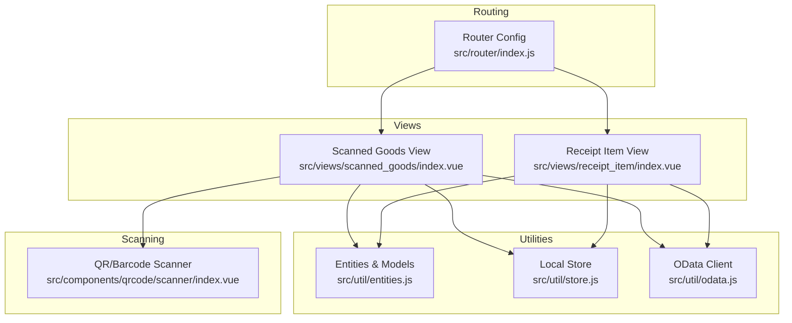
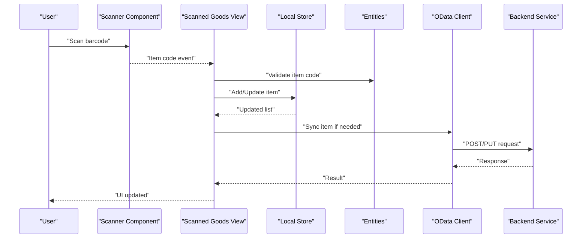
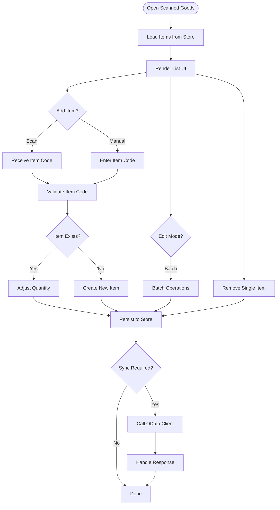
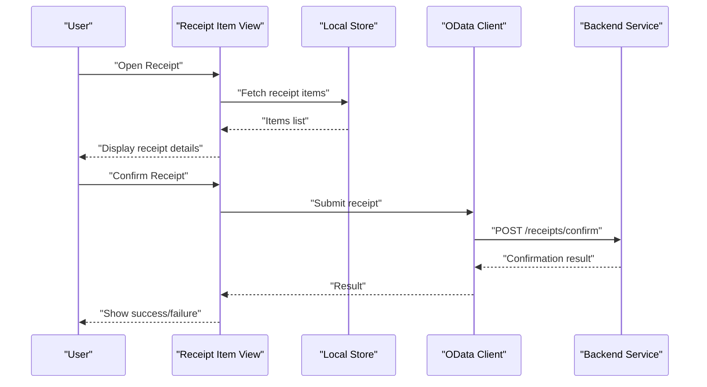
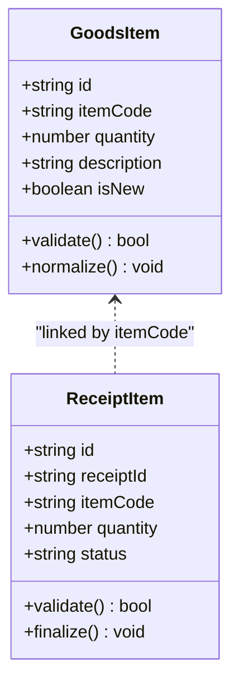
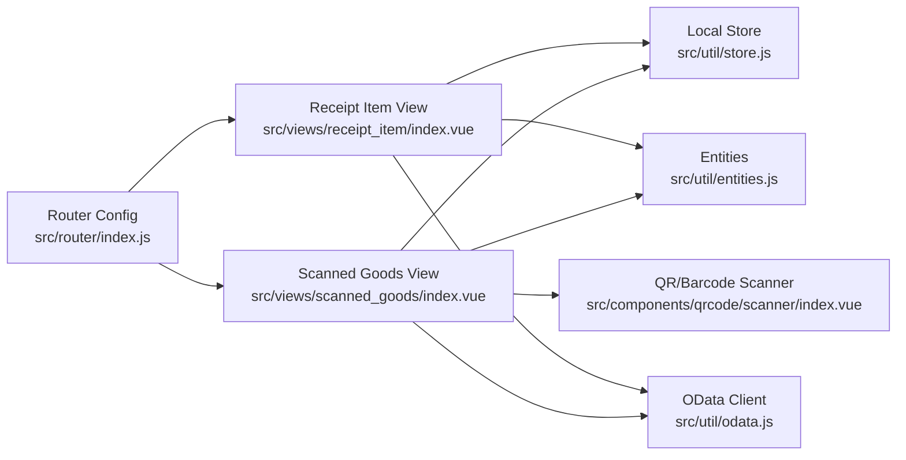

# Scanned Goods Management

<cite>
**Referenced Files in This Document**
- [src/views/scanned_goods/index.vue](file://src/views/scanned_goods/index.vue)
- [src/views/receipt_item/index.vue](file://src/views/receipt_item/index.vue)
- [src/util/entities.js](file://src/util/entities.js)
- [src/util/store.js](file://src/util/store.js)
- [src/util/odata.js](file://src/util/odata.js)
- [src/router/index.js](file://src/router/index.js)
- [src/components/qrcode/scanner/index.vue](file://src/components/qrcode/scanner/index.vue)
- [src/lib/html5-qrcode/README.md](file://src/lib/html5-qrcode/README.md)
</cite>

## Table of Contents
1. [Introduction](#introduction)
2. [Project Structure](#project-structure)
3. [Core Components](#core-components)
4. [Architecture Overview](#architecture-overview)
5. [Detailed Component Analysis](#detailed-component-analysis)
6. [Dependency Analysis](#dependency-analysis)
7. [Performance Considerations](#performance-considerations)
8. [Troubleshooting Guide](#troubleshooting-guide)
9. [Conclusion](#conclusion)

## Introduction
This document describes the scanned goods management system, focusing on how scanned items are displayed and manipulated, including quantity adjustments, item removal, and batch operations. It explains the data models for goods items and receipt items, their relationships, validation rules for quantities and item codes, and business constraints. It also covers editing workflows, status tracking, integration with receipt confirmation, and strategies for data persistence and synchronization with backend systems.

## Project Structure
The scanned goods feature is implemented as a Vue-based single-page application with modular views and utilities:
- Views:
  - Scanned goods list view for displaying and managing scanned items
  - Receipt item view for confirming receipts and finalizing batches
- Utilities:
  - Data models and entity definitions
  - Local store for client-side state and persistence
  - OData client for backend communication
- Routing:
  - Navigation between scanned goods and receipt flows
- Barcode scanning:
  - QR/barcode scanner component integrated into the UI

**Diagram sources**
- [src/views/scanned_goods/index.vue](file://src/views/scanned_goods/index.vue)
- [src/views/receipt_item/index.vue](file://src/views/receipt_item/index.vue)
- [src/util/entities.js](file://src/util/entities.js)
- [src/util/store.js](file://src/util/store.js)
- [src/util/odata.js](file://src/util/odata.js)
- [src/router/index.js](file://src/router/index.js)
- [src/components/qrcode/scanner/index.vue](file://src/components/qrcode/scanner/index.vue)

**Section sources**
- [src/views/scanned_goods/index.vue](file://src/views/scanned_goods/index.vue)
- [src/views/receipt_item/index.vue](file://src/views/receipt_item/index.vue)
- [src/util/entities.js](file://src/util/entities.js)
- [src/util/store.js](file://src/util/store.js)
- [src/util/odata.js](file://src/util/odata.js)
- [src/router/index.js](file://src/router/index.js)
- [src/components/qrcode/scanner/index.vue](file://src/components/qrcode/scanner/index.vue)

## Core Components
- Scanned Goods View
  - Displays the current list of scanned items
  - Supports adding new items via barcode scan or manual entry
  - Provides inline editing for quantities and item attributes
  - Enables removal of individual items and batch actions (e.g., clear all)
  - Integrates with local store to persist changes across sessions
  - Calls OData client to sync with backend when required
- Receipt Item View
  - Presents items associated with a specific receipt
  - Allows final review and confirmation of receipt
  - Triggers backend submission upon user confirmation
  - Updates status fields to reflect completion
- Entities & Models
  - Defines core types for goods items and receipt items
  - Encapsulates validation rules for quantities and identifiers
  - Exposes helper methods for normalization and formatting
- Local Store
  - Manages in-memory state and optional persistence
  - Provides CRUD operations for scanned items
  - Emits events for reactive updates
- OData Client
  - Wraps HTTP requests to backend services
  - Handles error responses and retries where applicable
  - Normalizes payloads for consistent consumption

**Section sources**
- [src/views/scanned_goods/index.vue](file://src/views/scanned_goods/index.vue)
- [src/views/receipt_item/index.vue](file://src/views/receipt_item/index.vue)
- [src/util/entities.js](file://src/util/entities.js)
- [src/util/store.js](file://src/util/store.js)
- [src/util/odata.js](file://src/util/odata.js)

## Architecture Overview
The system follows a layered architecture:
- Presentation Layer: Vue views render UI and handle user interactions
- State Layer: Local store maintains client-side state and persistence
- Domain Layer: Entities define data structures and validation logic
- Integration Layer: OData client communicates with backend services
- Input Layer: QR/Barcode scanner captures item codes and triggers flows

**Diagram sources**
- [src/components/qrcode/scanner/index.vue](file://src/components/qrcode/scanner/index.vue)
- [src/views/scanned_goods/index.vue](file://src/views/scanned_goods/index.vue)
- [src/util/entities.js](file://src/util/entities.js)
- [src/util/store.js](file://src/util/store.js)
- [src/util/odata.js](file://src/util/odata.js)

## Detailed Component Analysis

### Scanned Goods View
Responsibilities:
- Display scanned items in a table or list
- Provide controls for quantity adjustment (+/-), edit mode, and delete
- Support batch operations such as clearing selected items or resetting the list
- Integrate with scanner component to add items by code
- Persist changes locally and optionally sync with backend

Key behaviors:
- Quantity adjustments enforce minimums and maximums defined in entities
- Duplicate detection prevents adding the same item code multiple times unless allowed by configuration
- Batch selection enables multi-item deletion or bulk quantity updates
- Status indicators show pending vs. synced states

**Diagram sources**
- [src/views/scanned_goods/index.vue](file://src/views/scanned_goods/index.vue)
- [src/util/entities.js](file://src/util/entities.js)
- [src/util/store.js](file://src/util/store.js)
- [src/util/odata.js](file://src/util/odata.js)

**Section sources**
- [src/views/scanned_goods/index.vue](file://src/views/scanned_goods/index.vue)

### Receipt Item View
Responsibilities:
- Present items linked to a specific receipt
- Allow final review and edits before confirmation
- Submit receipt to backend and update status
- Provide feedback on success or failure

Key behaviors:
- Read-only mode after confirmation to prevent accidental changes
- Summary totals and counts for verification
- Error handling displays actionable messages

**Diagram sources**
- [src/views/receipt_item/index.vue](file://src/views/receipt_item/index.vue)
- [src/util/store.js](file://src/util/store.js)
- [src/util/odata.js](file://src/util/odata.js)

**Section sources**
- [src/views/receipt_item/index.vue](file://src/views/receipt_item/index.vue)

### Entities & Models
Responsibilities:
- Define data structures for goods items and receipt items
- Implement validation rules for quantities, item codes, and business constraints
- Provide normalization helpers for consistent data handling

Validation highlights:
- Item code format checks (alphanumeric, length limits)
- Quantity bounds (minimum zero, maximum caps)
- Required fields for receipt linkage
- Business constraints such as unique item codes per receipt

**Diagram sources**
- [src/util/entities.js](file://src/util/entities.js)

**Section sources**
- [src/util/entities.js](file://src/util/entities.js)

### Local Store
Responsibilities:
- Maintain in-memory state for scanned items
- Persist state to storage (e.g., localStorage) for resilience
- Provide APIs for add, update, remove, and batch operations
- Emit events for reactive UI updates

Persistence strategy:
- Auto-save on mutations
- Merge conflicts resolved by timestamp or versioning
- Clear-on-confirm behavior for completed receipts

**Section sources**
- [src/util/store.js](file://src/util/store.js)

### OData Client
Responsibilities:
- Wrap HTTP calls to backend endpoints
- Serialize/deserialize payloads according to OData conventions
- Handle errors, retries, and timeouts
- Normalize responses for consumption by views

Integration points:
- Sync scanned items to backend
- Confirm receipts and update statuses
- Fetch reference data (e.g., item catalogs)

**Section sources**
- [src/util/odata.js](file://src/util/odata.js)

### QR/Barcode Scanner
Responsibilities:
- Capture barcode/QR input
- Emit item code events to the scanned goods view
- Provide fallback for manual entry

Usage:
- Integrated into scanned goods view for hands-free operation
- Compatible with mobile devices and external scanners

**Section sources**
- [src/components/qrcode/scanner/index.vue](file://src/components/qrcode/scanner/index.vue)
- [src/lib/html5-qrcode/README.md](file://src/lib/html5-qrcode/README.md)

## Dependency Analysis
The scanned goods module depends on routing, store, entities, OData client, and scanner components. The following diagram shows key dependencies:

**Diagram sources**
- [src/router/index.js](file://src/router/index.js)
- [src/views/scanned_goods/index.vue](file://src/views/scanned_goods/index.vue)
- [src/views/receipt_item/index.vue](file://src/views/receipt_item/index.vue)
- [src/util/store.js](file://src/util/store.js)
- [src/util/entities.js](file://src/util/entities.js)
- [src/util/odata.js](file://src/util/odata.js)
- [src/components/qrcode/scanner/index.vue](file://src/components/qrcode/scanner/index.vue)

**Section sources**
- [src/router/index.js](file://src/router/index.js)
- [src/views/scanned_goods/index.vue](file://src/views/scanned_goods/index.vue)
- [src/views/receipt_item/index.vue](file://src/views/receipt_item/index.vue)
- [src/util/store.js](file://src/util/store.js)
- [src/util/entities.js](file://src/util/entities.js)
- [src/util/odata.js](file://src/util/odata.js)
- [src/components/qrcode/scanner/index.vue](file://src/components/qrcode/scanner/index.vue)

## Performance Considerations
- Debounce rapid scans to avoid redundant adds
- Use virtualized lists for large item sets
- Batch network requests when syncing multiple items
- Minimize re-renders by leveraging store events and computed properties
- Cache reference data fetched via OData client

[No sources needed since this section provides general guidance]

## Troubleshooting Guide
Common issues and resolutions:
- Validation failures for item codes
  - Check format and length constraints in entities
  - Ensure scanner emits correct codes without extra characters
- Quantity out-of-bounds errors
  - Verify min/max values and adjust inputs accordingly
- Sync failures with backend
  - Inspect OData client error handling and retry policies
  - Confirm network connectivity and endpoint availability
- Persistence inconsistencies
  - Review store merge logic and timestamps
  - Clear local state if corrupted and reload

**Section sources**
- [src/util/entities.js](file://src/util/entities.js)
- [src/util/odata.js](file://src/util/odata.js)
- [src/util/store.js](file://src/util/store.js)

## Conclusion
The scanned goods management system provides a robust workflow for capturing, validating, editing, and confirming scanned items. It integrates seamlessly with local persistence and backend services through an OData client, ensuring reliable synchronization and status tracking. By adhering to defined validation rules and leveraging batch operations, users can efficiently manage large volumes of scanned goods while maintaining data integrity.