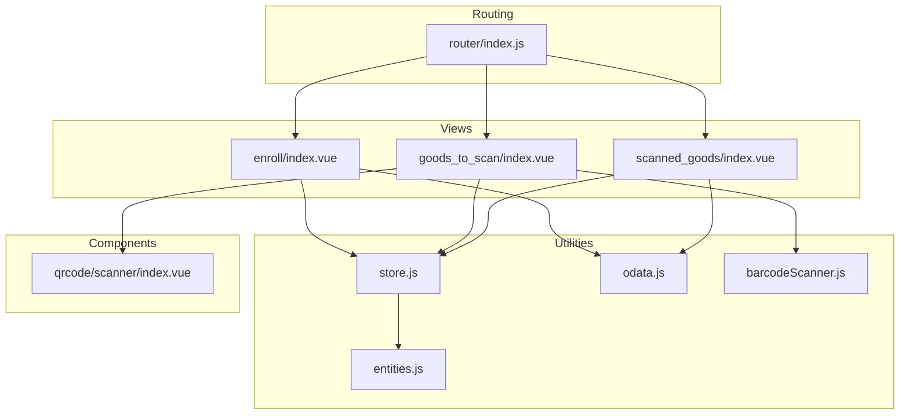
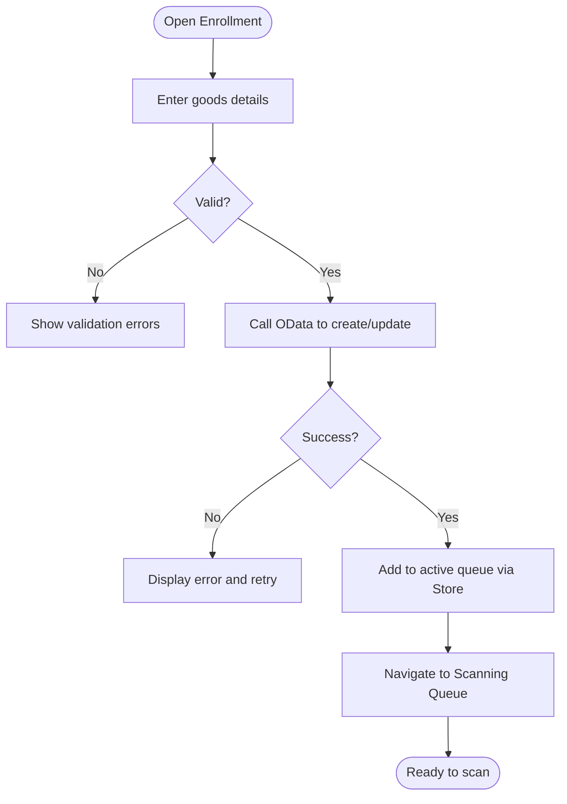
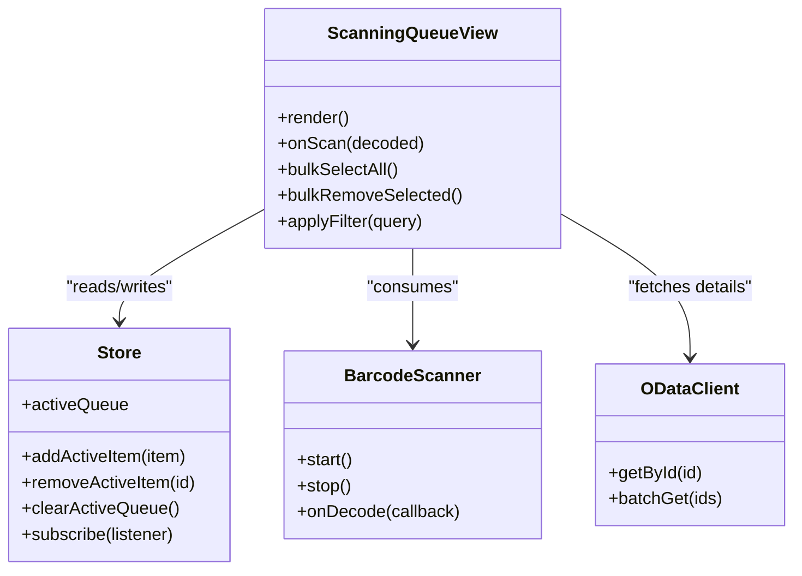
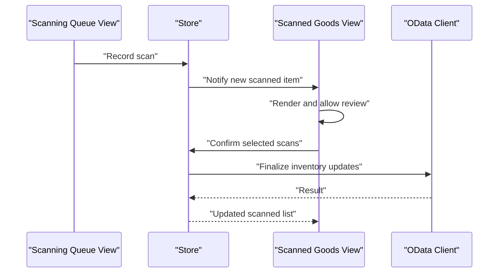
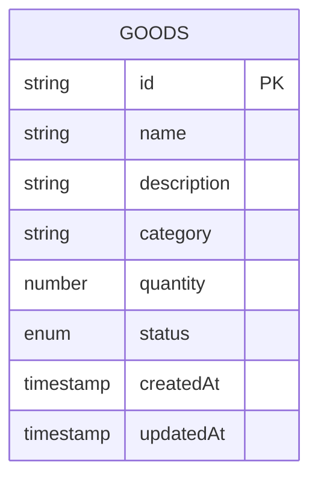
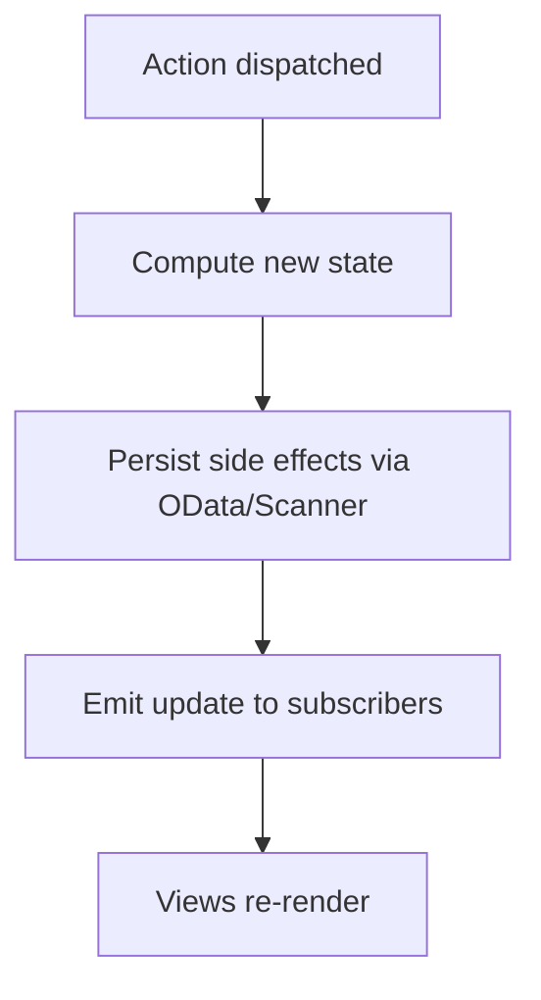
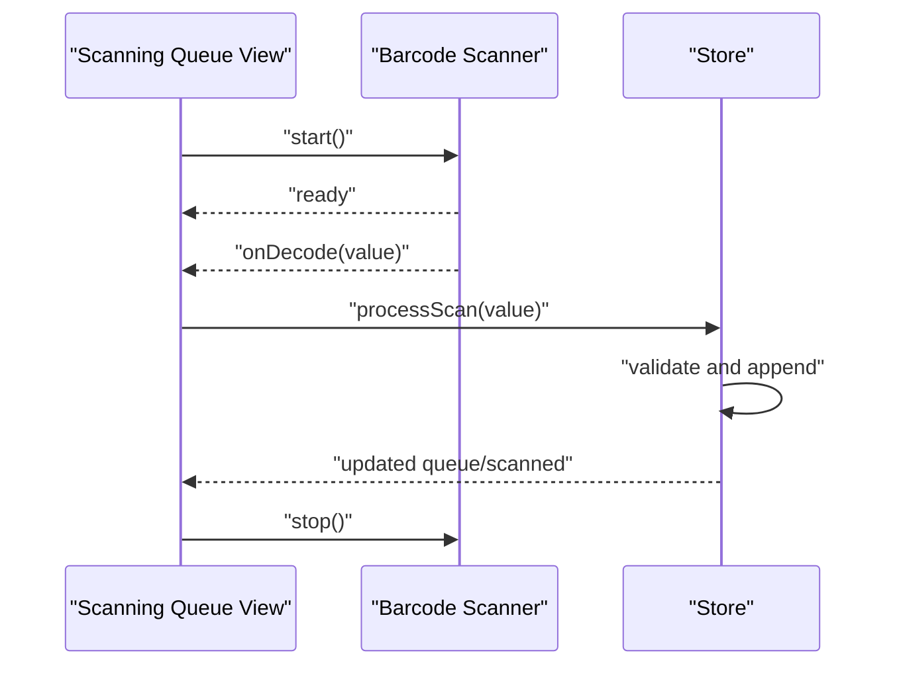
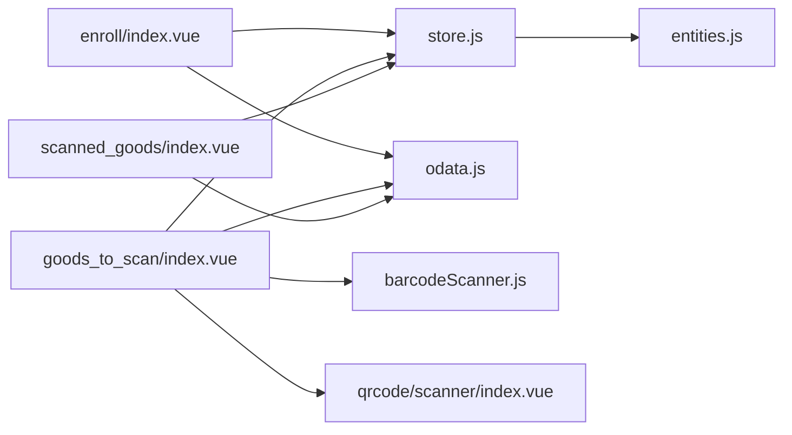

# Inventory Management

<cite>
**Referenced Files in This Document**
- [src/views/enroll/index.vue](file://src/views/enroll/index.vue)
- [src/views/goods_to_scan/index.vue](file://src/views/goods_to_scan/index.vue)
- [src/views/scanned_goods/index.vue](file://src/views/scanned_goods/index.vue)
- [src/util/entities.js](file://src/util/entities.js)
- [src/util/store.js](file://src/util/store.js)
- [src/router/index.js](file://src/router/index.js)
- [src/components/qrcode/scanner/index.vue](file://src/components/qrcode/scanner/index.vue)
- [src/util/barcodeScanner.js](file://src/util/barcodeScanner.js)
- [src/util/odata.js](file://src/util/odata.js)
</cite>

## Table of Contents
1. [Introduction](#introduction)
2. [Project Structure](#project-structure)
3. [Core Components](#core-components)
4. [Architecture Overview](#architecture-overview)
5. [Detailed Component Analysis](#detailed-component-analysis)
6. [Dependency Analysis](#dependency-analysis)
7. [Performance Considerations](#performance-considerations)
8. [Troubleshooting Guide](#troubleshooting-guide)
9. [Conclusion](#conclusion)

## Introduction
This document describes the inventory management system with a focus on:
- Goods enrollment workflow
- Active scanning queue management
- Scanned goods tracking and synchronization
- Entity models for goods data
- State management patterns and view synchronization
- End-to-end flow from registration to final inventory updates
- Bulk operations, search and filtering capabilities
- Integration with the scanning module

The system is organized around three primary views:
- Enrollment view for registering new goods
- Active scanning queue view for managing items ready to be scanned
- Scanned goods view for reviewing and confirming scanned items

State is managed centrally and synchronized across views using a lightweight store pattern. Data persistence and backend integration are handled via utility modules.

## Project Structure
Key directories and files relevant to inventory management:
- Views:
  - Enrollment: src/views/enroll/index.vue
  - Active scanning queue: src/views/goods_to_scan/index.vue
  - Scanned goods: src/views/scanned_goods/index.vue
- Utilities:
  - Entities model: src/util/entities.js
  - Store (state): src/util/store.js
  - OData client: src/util/odata.js
  - Barcode scanner utilities: src/util/barcodeScanner.js
- Components:
  - QR code scanner component: src/components/qrcode/scanner/index.vue
- Routing:
  - Router configuration: src/router/index.js



**Diagram sources**
- [src/views/enroll/index.vue](file://src/views/enroll/index.vue)
- [src/views/goods_to_scan/index.vue](file://src/views/goods_to_scan/index.vue)
- [src/views/scanned_goods/index.vue](file://src/views/scanned_goods/index.vue)
- [src/util/entities.js](file://src/util/entities.js)
- [src/util/store.js](file://src/util/store.js)
- [src/util/odata.js](file://src/util/odata.js)
- [src/util/barcodeScanner.js](file://src/util/barcodeScanner.js)
- [src/components/qrcode/scanner/index.vue](file://src/components/qrcode/scanner/index.vue)
- [src/router/index.js](file://src/router/index.js)

**Section sources**
- [src/views/enroll/index.vue](file://src/views/enroll/index.vue)
- [src/views/goods_to_scan/index.vue](file://src/views/goods_to_scan/index.vue)
- [src/views/scanned_goods/index.vue](file://src/views/scanned_goods/index.vue)
- [src/util/entities.js](file://src/util/entities.js)
- [src/util/store.js](file://src/util/store.js)
- [src/util/odata.js](file://src/util/odata.js)
- [src/util/barcodeScanner.js](file://src/util/barcodeScanner.js)
- [src/components/qrcode/scanner/index.vue](file://src/components/qrcode/scanner/index.vue)
- [src/router/index.js](file://src/router/index.js)

## Core Components
- Goods enrollment view: Provides UI and logic for creating or updating goods records and adding them to the active scanning queue.
- Active scanning queue view: Displays items pending scan, supports bulk actions, search/filtering, and integrates with the barcode scanner.
- Scanned goods view: Shows items that have been successfully scanned, allows review, correction, and confirmation before finalizing inventory updates.
- Entities model: Defines canonical structures for goods and related entities used across views and services.
- Store: Centralized state container holding queues, scanned items, filters, and UI state; exposes methods to mutate and subscribe to changes.
- OData client: Encapsulates HTTP interactions with backend services for CRUD operations and queries.
- Barcode scanner utilities: Wraps device/browser scanning APIs and emits decoded values to consumers.
- QR code scanner component: Reusable UI component for capturing QR/barcode input within the scanning queue view.

**Section sources**
- [src/views/enroll/index.vue](file://src/views/enroll/index.vue)
- [src/views/goods_to_scan/index.vue](file://src/views/goods_to_scan/index.vue)
- [src/views/scanned_goods/index.vue](file://src/views/scanned_goods/index.vue)
- [src/util/entities.js](file://src/util/entities.js)
- [src/util/store.js](file://src/util/store.js)
- [src/util/odata.js](file://src/util/odata.js)
- [src/util/barcodeScanner.js](file://src/util/barcodeScanner.js)
- [src/components/qrcode/scanner/index.vue](file://src/components/qrcode/scanner/index.vue)

## Architecture Overview
The system follows a unidirectional data flow:
- User actions in views trigger store mutations.
- Store updates entity collections and persists changes via the OData client when necessary.
- The scanning module emits decoded codes into the store’s scanning pipeline.
- Views subscribe to store slices and re-render automatically.

```mermaid
sequenceDiagram
participant User as "User"
participant Enroll as "Enrollment View"
participant Queue as "Scanning Queue View"
participant Scanner as "Barcode Scanner"
participant Store as "Store"
participant OData as "OData Client"
participant Backend as "Backend Service"
User->>Enroll : "Register goods"
Enroll->>OData : "Create/Update goods"
OData-->>Enroll : "Persisted record"
Enroll->>Store : "Add to active queue"
Note over Enroll,Store : "Goods added to queue"
User->>Queue : "Start scanning"
Queue->>Scanner : "Enable scanner"
Scanner-->>Queue : "Decoded value"
Queue->>Store : "Record scan"
Store->>Store : "Validate and deduplicate"
Store->>OData : "Fetch details if needed"
OData-->>Store : "Goods metadata"
Store->>Store : "Append to scanned list"
User->>Queue : "Bulk confirm"
Queue->>Store : "Confirm selected scans"
Store->>OData : "Sync final inventory"
OData-->>Store : "Confirmation result"
Store-->>Queue : "Updated state"
Store-->>Enroll : "Queue updated"
Store-->>Scanned as "Scanned Goods View"
```

**Diagram sources**
- [src/views/enroll/index.vue](file://src/views/enroll/index.vue)
- [src/views/goods_to_scan/index.vue](file://src/views/goods_to_scan/index.vue)
- [src/views/scanned_goods/index.vue](file://src/views/scanned_goods/index.vue)
- [src/util/store.js](file://src/util/store.js)
- [src/util/odata.js](file://src/util/odata.js)
- [src/util/barcodeScanner.js](file://src/util/barcodeScanner.js)

## Detailed Component Analysis

### Goods Enrollment Workflow
Purpose:
- Create or update goods records
- Add newly registered goods to the active scanning queue
- Provide feedback on success/failure

Key responsibilities:
- Form handling and validation
- Calling the OData client to persist goods
- Dispatching store actions to enqueue goods
- Navigating to scanning queue after successful registration



**Diagram sources**
- [src/views/enroll/index.vue](file://src/views/enroll/index.vue)
- [src/util/odata.js](file://src/util/odata.js)
- [src/util/store.js](file://src/util/store.js)

**Section sources**
- [src/views/enroll/index.vue](file://src/views/enroll/index.vue)
- [src/util/odata.js](file://src/util/odata.js)
- [src/util/store.js](file://src/util/store.js)

### Active Scanning Queue Management
Purpose:
- Maintain a list of goods awaiting scan
- Support bulk selection, removal, and clearing
- Integrate with the barcode scanner to capture inputs
- Search and filter items in the queue

Key responsibilities:
- Subscribe to queue state from the store
- Render queue items with status indicators
- Handle scanner events and push results into the store
- Provide bulk operations (select all, deselect, remove selected)
- Apply text-based search and filters (e.g., by ID, name)



**Diagram sources**
- [src/views/goods_to_scan/index.vue](file://src/views/goods_to_scan/index.vue)
- [src/util/store.js](file://src/util/store.js)
- [src/util/barcodeScanner.js](file://src/util/barcodeScanner.js)
- [src/util/odata.js](file://src/util/odata.js)

**Section sources**
- [src/views/goods_to_scan/index.vue](file://src/views/goods_to_scan/index.vue)
- [src/util/store.js](file://src/util/store.js)
- [src/util/barcodeScanner.js](file://src/util/barcodeScanner.js)
- [src/util/odata.js](file://src/util/odata.js)

### Scanned Goods Tracking
Purpose:
- Track items successfully scanned
- Allow review, correction, and confirmation
- Finalize inventory updates

Key responsibilities:
- Display scanned items with timestamps and source info
- Support undo/cancel of individual scans
- Confirm batch scans to persist final inventory changes
- Synchronize with backend via OData client



**Diagram sources**
- [src/views/goods_to_scan/index.vue](file://src/views/goods_to_scan/index.vue)
- [src/views/scanned_goods/index.vue](file://src/views/scanned_goods/index.vue)
- [src/util/store.js](file://src/util/store.js)
- [src/util/odata.js](file://src/util/odata.js)

**Section sources**
- [src/views/scanned_goods/index.vue](file://src/views/scanned_goods/index.vue)
- [src/util/store.js](file://src/util/store.js)
- [src/util/odata.js](file://src/util/odata.js)

### Entity Models
The entities module defines canonical structures for goods and related data used throughout the application. Typical fields include identifiers, descriptive attributes, and status flags. Views and services rely on these models to ensure consistent data shapes.



**Diagram sources**
- [src/util/entities.js](file://src/util/entities.js)

**Section sources**
- [src/util/entities.js](file://src/util/entities.js)

### State Management Patterns
The store centralizes state for:
- Active scanning queue
- Scanned goods list
- Filters and search queries
- UI flags (e.g., scanning enabled/disabled)

Patterns:
- Immutable updates: Actions return new state snapshots
- Subscriptions: Views subscribe to specific slices and re-render on change
- Side effects: Store delegates I/O to OData client and scanner utilities
- Deduplication: Prevent duplicate entries in queue and scanned lists



**Diagram sources**
- [src/util/store.js](file://src/util/store.js)

**Section sources**
- [src/util/store.js](file://src/util/store.js)

### Integration with Scanning Module
The scanning module provides:
- Device/browser access to camera and decoding
- Event-driven delivery of decoded values
- Error handling for permission and hardware issues

Integration points:
- Scanning queue view starts/stops scanner lifecycle
- Decoded values are validated against entities and enqueued or appended to scanned list
- Fallbacks for manual entry when scanning fails



**Diagram sources**
- [src/views/goods_to_scan/index.vue](file://src/views/goods_to_scan/index.vue)
- [src/util/barcodeScanner.js](file://src/util/barcodeScanner.js)
- [src/util/store.js](file://src/util/store.js)

**Section sources**
- [src/views/goods_to_scan/index.vue](file://src/views/goods_to_scan/index.vue)
- [src/util/barcodeScanner.js](file://src/util/barcodeScanner.js)
- [src/util/store.js](file://src/util/store.js)

### Search and Filtering Capabilities
- Text search across queue and scanned lists by ID, name, or other searchable fields
- Filter toggles for status, category, or time range
- Debounced input to reduce re-renders and network calls
- Clear/reset controls for quick navigation

Implementation highlights:
- Store maintains query and filter state
- Derived views compute filtered lists efficiently
- Bulk operations respect current filters

**Section sources**
- [src/views/goods_to_scan/index.vue](file://src/views/goods_to_scan/index.vue)
- [src/views/scanned_goods/index.vue](file://src/views/scanned_goods/index.vue)
- [src/util/store.js](file://src/util/store.js)

### Bulk Operations
Common bulk actions:
- Select all / Deselect all
- Remove selected from queue
- Confirm selected scans
- Clear entire queue or scanned list

Safety measures:
- Confirmation dialogs for destructive actions
- Undo support where applicable
- Batch API calls via OData client to minimize round trips

**Section sources**
- [src/views/goods_to_scan/index.vue](file://src/views/goods_to_scan/index.vue)
- [src/views/scanned_goods/index.vue](file://src/views/scanned_goods/index.vue)
- [src/util/odata.js](file://src/util/odata.js)

## Dependency Analysis
High-level dependencies among core components:



**Diagram sources**
- [src/views/enroll/index.vue](file://src/views/enroll/index.vue)
- [src/views/goods_to_scan/index.vue](file://src/views/goods_to_scan/index.vue)
- [src/views/scanned_goods/index.vue](file://src/views/scanned_goods/index.vue)
- [src/util/store.js](file://src/util/store.js)
- [src/util/odata.js](file://src/util/odata.js)
- [src/util/barcodeScanner.js](file://src/util/barcodeScanner.js)
- [src/components/qrcode/scanner/index.vue](file://src/components/qrcode/scanner/index.vue)
- [src/util/entities.js](file://src/util/entities.js)

**Section sources**
- [src/views/enroll/index.vue](file://src/views/enroll/index.vue)
- [src/views/goods_to_scan/index.vue](file://src/views/goods_to_scan/index.vue)
- [src/views/scanned_goods/index.vue](file://src/views/scanned_goods/index.vue)
- [src/util/store.js](file://src/util/store.js)
- [src/util/odata.js](file://src/util/odata.js)
- [src/util/barcodeScanner.js](file://src/util/barcodeScanner.js)
- [src/components/qrcode/scanner/index.vue](file://src/components/qrcode/scanner/index.vue)
- [src/util/entities.js](file://src/util/entities.js)

## Performance Considerations
- Minimize re-renders by subscribing to specific store slices rather than the entire state.
- Use debouncing for search inputs to avoid excessive filtering computations.
- Prefer batch requests via OData client for bulk confirmations.
- Avoid redundant lookups by caching frequently accessed goods metadata locally in the store.
- Limit the size of rendered lists by virtualization or pagination when dealing with large datasets.

[No sources needed since this section provides general guidance]

## Troubleshooting Guide
Common issues and resolutions:
- Scanner permissions denied: Ensure camera permissions are granted; provide fallback manual entry.
- Duplicate scans: Verify deduplication logic in the store and unique constraints in entities.
- Network failures during persistence: Implement retries and user-friendly error messages; allow offline queuing if applicable.
- Stale UI state: Confirm that views subscribe correctly and that store emits updates after mutations.
- Slow performance with large lists: Apply pagination/virtualization and optimize derived computations.

**Section sources**
- [src/util/barcodeScanner.js](file://src/util/barcodeScanner.js)
- [src/util/store.js](file://src/util/store.js)
- [src/util/odata.js](file://src/util/odata.js)

## Conclusion
The inventory management system provides a clear, modular architecture centered on a store-driven state model. Goods enrollment feeds the active scanning queue, which integrates seamlessly with the scanning module to capture and track items. Scanned goods are reviewed and confirmed to finalize inventory updates. Robust search, filtering, and bulk operations enhance usability, while the OData client ensures reliable backend synchronization. Following the patterns outlined here will help maintain consistency, performance, and scalability as the system evolves.