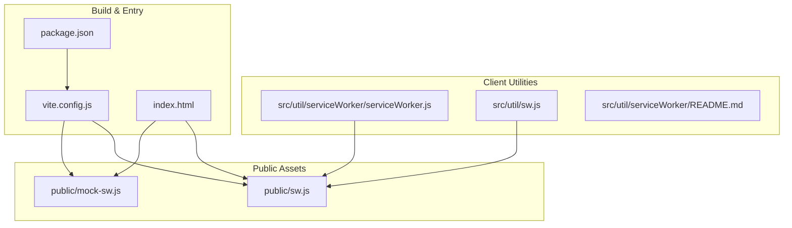
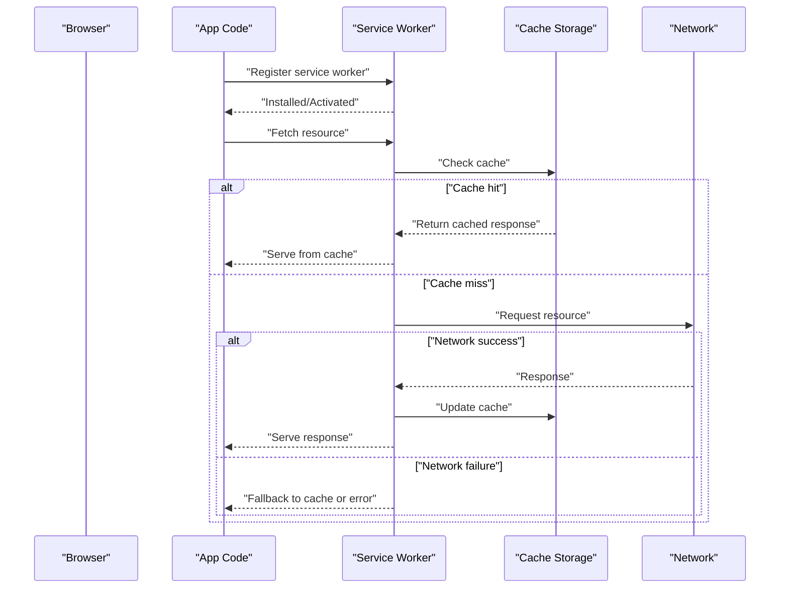
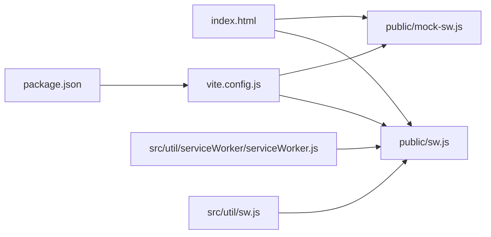
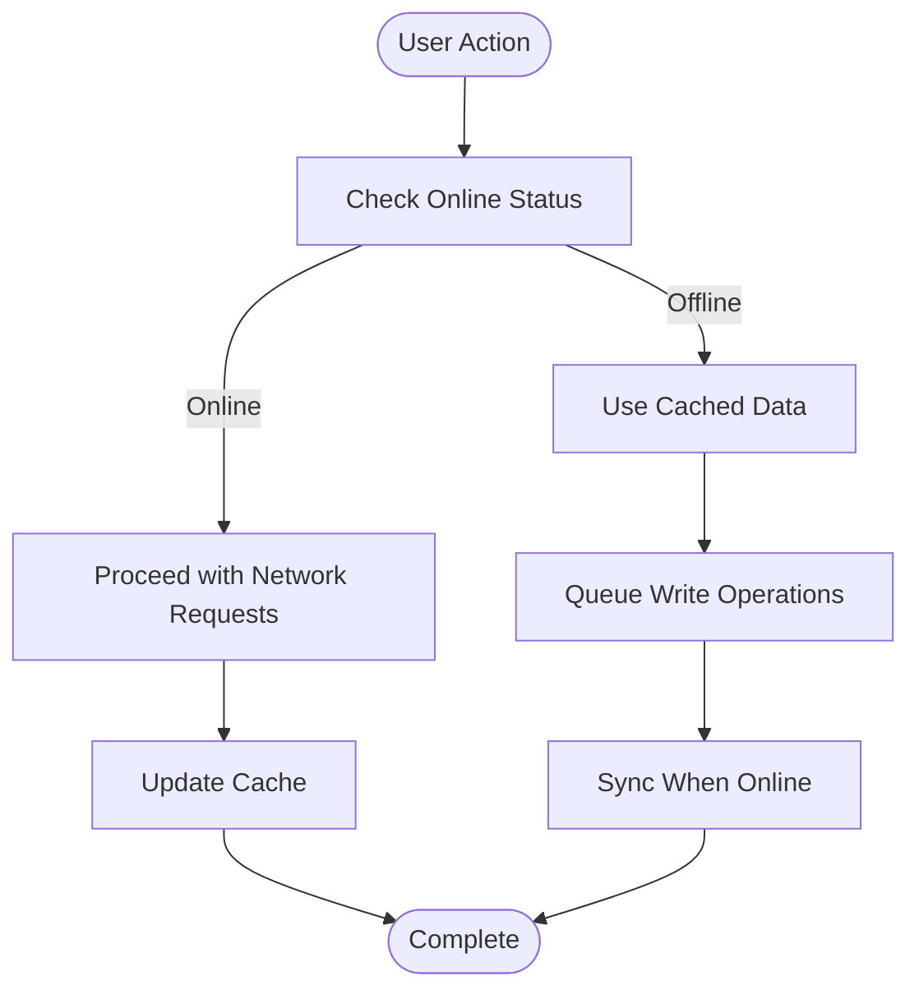

# Offline Capabilities

<cite>
**Referenced Files in This Document**
- [public/sw.js](file://public/sw.js)
- [public/mock-sw.js](file://public/mock-sw.js)
- [src/util/serviceWorker/serviceWorker.js](file://src/util/serviceWorker/serviceWorker.js)
- [src/util/serviceWorker/README.md](file://src/util/serviceWorker/README.md)
- [src/util/sw.js](file://src/util/sw.js)
- [vite.config.js](file://vite.config.js)
- [index.html](file://index.html)
- [package.json](file://package.json)
</cite>

## Table of Contents
1. [Introduction](#introduction)
2. [Project Structure](#project-structure)
3. [Core Components](#core-components)
4. [Architecture Overview](#architecture-overview)
5. [Detailed Component Analysis](#detailed-component-analysis)
6. [Dependency Analysis](#dependency-analysis)
7. [Performance Considerations](#performance-considerations)
8. [Troubleshooting Guide](#troubleshooting-guide)
9. [Conclusion](#conclusion)
10. [Appendices](#appendices)

## Introduction
This document explains the offline capabilities and Progressive Web App (PWA) features implemented in the project. It focuses on the service worker implementation, caching strategies, background synchronization mechanisms, offline data persistence, cache policies, network request interception, development versus production configurations, mock service worker usage, and debugging techniques. It also provides examples of offline-first patterns and data synchronization strategies tailored for warehouse environments with unreliable connectivity.

## Project Structure
The offline and PWA-related code is organized across public assets and utility modules:
- Service workers are provided under public/ for runtime behavior and mocking.
- Client-side registration and utilities live under src/util/serviceWorker/.
- Build-time configuration and HTML manifest references are defined at the project root.

**Diagram sources**
- [public/sw.js](file://public/sw.js)
- [public/mock-sw.js](file://public/mock-sw.js)
- [src/util/serviceWorker/serviceWorker.js](file://src/util/serviceWorker/serviceWorker.js)
- [src/util/serviceWorker/README.md](file://src/util/serviceWorker/README.md)
- [src/util/sw.js](file://src/util/sw.js)
- [vite.config.js](file://vite.config.js)
- [index.html](file://index.html)
- [package.json](file://package.json)

**Section sources**
- [public/sw.js](file://public/sw.js)
- [public/mock-sw.js](file://public/mock-sw.js)
- [src/util/serviceWorker/serviceWorker.js](file://src/util/serviceWorker/serviceWorker.js)
- [src/util/serviceWorker/README.md](file://src/util/serviceWorker/README.md)
- [src/util/sw.js](file://src/util/sw.js)
- [vite.config.js](file://vite.config.js)
- [index.html](file://index.html)
- [package.json](file://package.json)

## Core Components
- Runtime service worker: Handles caching, network interception, and background sync events.
- Mock service worker: Provides offline-first responses during development or testing.
- Client-side registration and helpers: Registers the service worker and exposes utilities to interact with caches and background tasks.
- Build configuration: Controls which service worker file is served and how it is referenced by the app.
- Application entry: Includes any necessary links or scripts to enable PWA behaviors.

Key responsibilities:
- Cache static assets and API responses according to policy.
- Intercept fetch requests and serve cached content when offline.
- Queue and synchronize outbox items when connectivity returns.
- Provide a consistent user experience regardless of network conditions.

**Section sources**
- [public/sw.js](file://public/sw.js)
- [public/mock-sw.js](file://public/mock-sw.js)
- [src/util/serviceWorker/serviceWorker.js](file://src/util/serviceWorker/serviceWorker.js)
- [src/util/serviceWorker/README.md](file://src/util/serviceWorker/README.md)
- [src/util/sw.js](file://src/util/sw.js)
- [vite.config.js](file://vite.config.js)
- [index.html](file://index.html)

## Architecture Overview
The offline architecture follows an offline-first pattern:
- The client registers a service worker that controls navigation and fetch events.
- Static resources are precached on install; dynamic resources are cached per strategy.
- Network failures trigger fallbacks from cache or queued operations.
- Background sync ensures eventual consistency for write operations.

**Diagram sources**
- [public/sw.js](file://public/sw.js)
- [src/util/serviceWorker/serviceWorker.js](file://src/util/serviceWorker/serviceWorker.js)
- [src/util/sw.js](file://src/util/sw.js)

## Detailed Component Analysis

### Service Worker Implementation
Responsibilities:
- Install phase: Precache critical shell assets to ensure offline availability.
- Activate phase: Clean up outdated caches and migrate storage if needed.
- Fetch phase: Intercept requests and apply caching strategies based on resource type.
- Background Sync: Process queued operations when connectivity is restored.

Caching strategies:
- Stale-while-revalidate for frequently changing data.
- Cache-first for static assets.
- Network-first for authoritative data with fallback to cache.

Background synchronization:
- Enqueue write operations locally when offline.
- Use background sync to retry and reconcile with the server when online.

Interception points:
- Navigation requests for SPA routing.
- API calls for data reads/writes.
- Asset requests for images, fonts, and scripts.

**Section sources**
- [public/sw.js](file://public/sw.js)

### Client-Side Registration and Utilities
Functions:
- Register the service worker with appropriate scope and options.
- Listen for updates and prompt users to refresh when a new version is available.
- Expose helpers to add items to the outbox queue and trigger sync.

Integration:
- Called early in application bootstrap to ensure the service worker is active before user interactions.
- Provides UI hooks to show offline status and retry actions.

**Section sources**
- [src/util/serviceWorker/serviceWorker.js](file://src/util/serviceWorker/serviceWorker.js)
- [src/util/sw.js](file://src/util/sw.js)
- [src/util/serviceWorker/README.md](file://src/util/serviceWorker/README.md)

### Development vs Production Configurations
Development:
- Uses a mock service worker to simulate offline behavior and API responses without a backend.
- Enables faster iteration and deterministic testing of offline flows.

Production:
- Uses the real service worker for caching and background sync.
- Optimizes cache sizes and update strategies for reliability.

Configuration points:
- Build tooling selects the correct service worker file.
- Environment flags control whether to register the mock or real worker.

**Section sources**
- [public/mock-sw.js](file://public/mock-sw.js)
- [public/sw.js](file://public/sw.js)
- [vite.config.js](file://vite.config.js)
- [package.json](file://package.json)

### Mock Service Worker Usage
Purpose:
- Provide deterministic offline responses for routes and APIs.
- Simulate latency and errors to validate resilience.

Usage:
- Enable during development via build flags or environment variables.
- Disable in production builds to avoid serving mocked responses.

**Section sources**
- [public/mock-sw.js](file://public/mock-sw.js)
- [vite.config.js](file://vite.config.js)
- [package.json](file://package.json)

### Debugging Techniques
- Inspect service worker lifecycle in browser DevTools.
- Monitor cache storage contents and clear caches when needed.
- Log fetch events and background sync attempts.
- Use the mock service worker to reproduce issues deterministically.

Operational tips:
- Force reload after service worker updates.
- Validate that precache includes all required assets.
- Ensure background sync jobs are retried and idempotent.

**Section sources**
- [src/util/serviceWorker/README.md](file://src/util/serviceWorker/README.md)
- [public/mock-sw.js](file://public/mock-sw.js)
- [public/sw.js](file://public/sw.js)

### Offline Data Persistence Approach
- Outbox pattern: Persist pending writes locally until successful sync.
- Local storage or IndexedDB for structured data and large payloads.
- Conflict resolution strategies for concurrent edits.

Synchronization strategies:
- Batched retries with exponential backoff.
- Idempotent operations to prevent duplicates.
- Versioning or timestamps to resolve conflicts.

**Section sources**
- [src/util/serviceWorker/serviceWorker.js](file://src/util/serviceWorker/serviceWorker.js)
- [src/util/sw.js](file://src/util/sw.js)

### Cache Policies and Network Interception
Policies:
- Static assets: Cache-first with long TTL and versioned filenames.
- API reads: Stale-while-revalidate to balance freshness and performance.
- API writes: Queue locally and sync when online.

Interception:
- Route-based rules for different endpoints.
- Fallback pages for navigation failures.
- Error handling to maintain UX even when services are unavailable.

**Section sources**
- [public/sw.js](file://public/sw.js)

### Offline-First Patterns and Examples
Patterns:
- Shell caching for instant load on subsequent visits.
- Graceful degradation when data is stale.
- User feedback for offline state and retry actions.

Examples:
- Scanning workflows continue offline; results are queued and synced later.
- Configuration screens read from cache when network is down.
- Reports display last-known data with a “refresh” action.

**Section sources**
- [src/util/serviceWorker/serviceWorker.js](file://src/util/serviceWorker/serviceWorker.js)
- [src/util/sw.js](file://src/util/sw.js)

## Dependency Analysis
The following diagram shows how components depend on each other to provide offline functionality.

**Diagram sources**
- [index.html](file://index.html)
- [public/sw.js](file://public/sw.js)
- [public/mock-sw.js](file://public/mock-sw.js)
- [vite.config.js](file://vite.config.js)
- [package.json](file://package.json)
- [src/util/serviceWorker/serviceWorker.js](file://src/util/serviceWorker/serviceWorker.js)
- [src/util/sw.js](file://src/util/sw.js)

**Section sources**
- [index.html](file://index.html)
- [public/sw.js](file://public/sw.js)
- [public/mock-sw.js](file://public/mock-sw.js)
- [vite.config.js](file://vite.config.js)
- [package.json](file://package.json)
- [src/util/serviceWorker/serviceWorker.js](file://src/util/serviceWorker/serviceWorker.js)
- [src/util/sw.js](file://src/util/sw.js)

## Performance Considerations
- Minimize cache size by pruning old entries and limiting number of versions.
- Use HTTP headers wisely to complement service worker caching.
- Avoid blocking the main thread; perform heavy work in the service worker.
- Prefer streaming responses for large payloads where possible.
- Implement efficient conflict resolution to reduce rework.

[No sources needed since this section provides general guidance]

## Troubleshooting Guide
Common issues:
- Service worker not updating: Clear caches and force reload.
- Stale data appearing: Verify revalidation logic and cache keys.
- Background sync failing: Check network availability and endpoint health.
- Mock responses in production: Ensure environment flags are set correctly.

Diagnostic steps:
- Inspect service worker registration and lifecycle events.
- Review cache storage and delete problematic entries.
- Reproduce with mock service worker to isolate issues.
- Add logging around fetch and sync handlers.

**Section sources**
- [src/util/serviceWorker/README.md](file://src/util/serviceWorker/README.md)
- [public/mock-sw.js](file://public/mock-sw.js)
- [public/sw.js](file://public/sw.js)

## Conclusion
The project implements a robust offline-first architecture using a service worker with strategic caching, network interception, and background synchronization. By separating development and production configurations and providing a mock service worker, teams can develop and test reliably under offline conditions. For warehouse environments with intermittent connectivity, these patterns ensure continuity of operations, improved performance, and a resilient user experience.

[No sources needed since this section summarizes without analyzing specific files]

## Appendices

### A. Offline-First Flowchart

[No sources needed since this diagram shows conceptual workflow, not actual code structure]