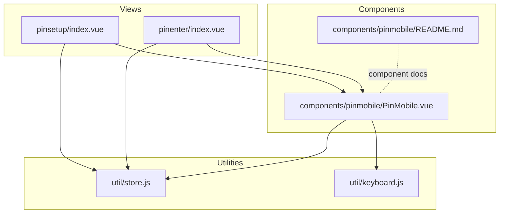
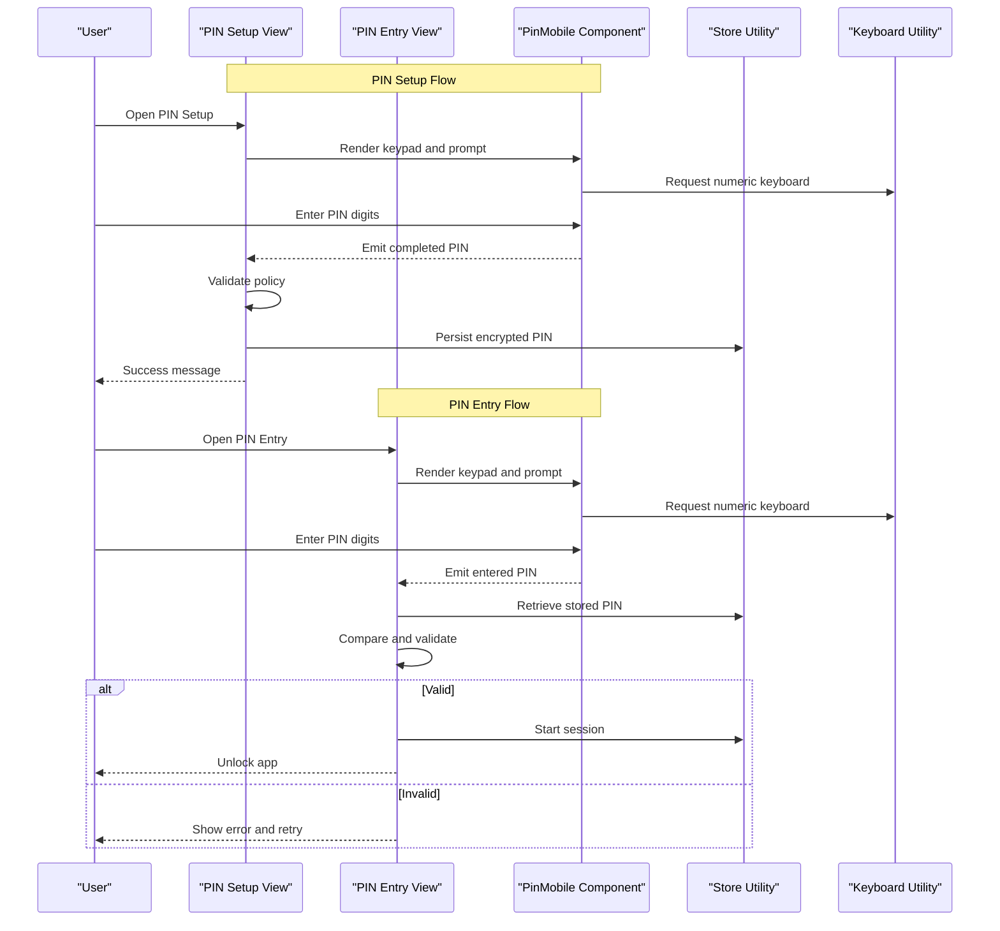
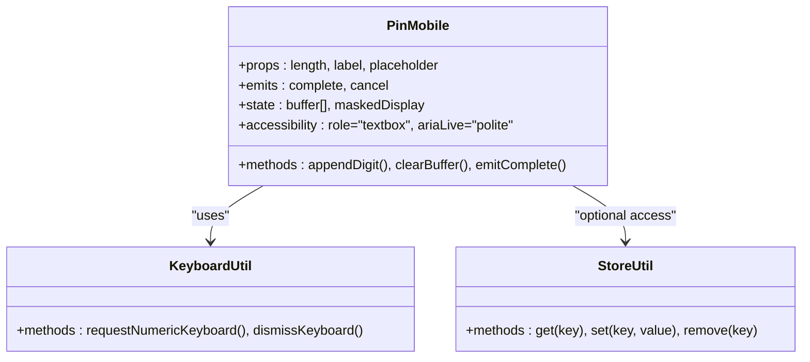
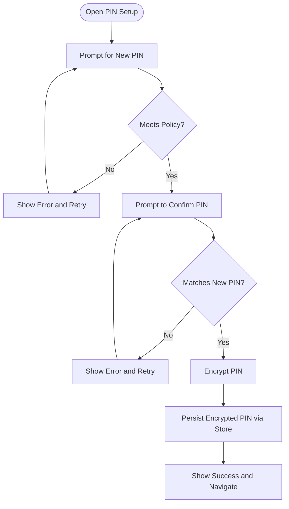
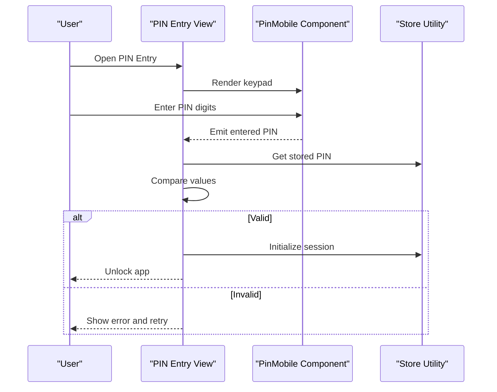
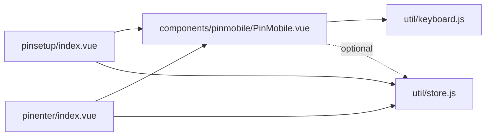

# PIN Security System

<cite>
**Referenced Files in This Document**
- [PinMobile.vue](file://src/components/pinmobile/PinMobile.vue)
- [README.md](file://src/components/pinmobile/README.md)
- [index.vue](file://src/views/pinsetup/index.vue)
- [index.vue](file://src/views/pinenter/index.vue)
- [store.js](file://src/util/store.js)
- [keyboard.js](file://src/util/keyboard.js)
</cite>

## Table of Contents
1. [Introduction](#introduction)
2. [Project Structure](#project-structure)
3. [Core Components](#core-components)
4. [Architecture Overview](#architecture-overview)
5. [Detailed Component Analysis](#detailed-component-analysis)
6. [Dependency Analysis](#dependency-analysis)
7. [Performance Considerations](#performance-considerations)
8. [Troubleshooting Guide](#troubleshooting-guide)
9. [Conclusion](#conclusion)
10. [Appendices](#appendices)

## Introduction
This document describes the PIN security system implemented in the application. It covers PIN setup, configuration, entry validation, session management, secure storage mechanisms, encryption approaches, and authentication flow. It also documents the PinMobile component implementation, keyboard handling, accessibility features, security best practices, PIN policy enforcement, and session timeout handling. Examples include typical PIN setup workflows, validation rules, and integration with the application’s state management system.

## Project Structure
The PIN-related functionality is primarily implemented across:
- A reusable PIN input component (PinMobile) for capturing digits and managing UI interactions
- Views for PIN setup and PIN entry
- Utilities for local state persistence and keyboard integration
- Optional README documentation for the PIN component

**Diagram sources**
- [index.vue](file://src/views/pinsetup/index.vue)
- [index.vue](file://src/views/pinenter/index.vue)
- [PinMobile.vue](file://src/components/pinmobile/PinMobile.vue)
- [README.md](file://src/components/pinmobile/README.md)
- [store.js](file://src/util/store.js)
- [keyboard.js](file://src/util/keyboard.js)

**Section sources**
- [PinMobile.vue](file://src/components/pinmobile/PinMobile.vue)
- [README.md](file://src/components/pinmobile/README.md)
- [index.vue](file://src/views/pinsetup/index.vue)
- [index.vue](file://src/views/pinenter/index.vue)
- [store.js](file://src/util/store.js)
- [keyboard.js](file://src/util/keyboard.js)

## Core Components
- PinMobile component: Provides a mobile-friendly numeric keypad for PIN capture, manages input state, emits events on completion, and integrates with keyboard utilities and store for persistence.
- PIN Setup view: Guides users through creating and confirming a new PIN; enforces policy constraints and persists the PIN securely.
- PIN Entry view: Validates user-entered PIN against stored credentials and controls session state upon success or failure.
- Store utility: Centralizes persistent state for PIN and session information.
- Keyboard utility: Bridges native keyboard behavior to the component for improved UX on mobile devices.

Key responsibilities:
- Input capture and masking
- Validation rules (length, format, strength)
- Secure storage and optional encryption
- Session lifecycle and timeouts
- Accessibility attributes and labels

**Section sources**
- [PinMobile.vue](file://src/components/pinmobile/PinMobile.vue)
- [index.vue](file://src/views/pinsetup/index.vue)
- [index.vue](file://src/views/pinenter/index.vue)
- [store.js](file://src/util/store.js)
- [keyboard.js](file://src/util/keyboard.js)

## Architecture Overview
The PIN system follows a layered approach:
- Presentation layer: Views orchestrate flows (setup and entry).
- Component layer: PinMobile encapsulates input logic and UI.
- Utility layer: Store and keyboard utilities provide cross-cutting concerns.

**Diagram sources**
- [index.vue](file://src/views/pinsetup/index.vue)
- [index.vue](file://src/views/pinenter/index.vue)
- [PinMobile.vue](file://src/components/pinmobile/PinMobile.vue)
- [store.js](file://src/util/store.js)
- [keyboard.js](file://src/util/keyboard.js)

## Detailed Component Analysis

### PinMobile Component
Responsibilities:
- Renders a numeric keypad tailored for mobile devices
- Manages internal digit buffer and masked display
- Emits completion events when the required length is reached
- Integrates with keyboard utility to request numeric input
- Supports accessibility attributes (labels, roles, aria-live regions)

Input lifecycle:
- Focus triggers numeric keyboard via keyboard utility
- Each keypress appends a digit and updates masked display
- On reaching configured length, emits a completion event with the raw PIN
- Clears buffer on cancel/back actions

Accessibility:
- Uses appropriate ARIA roles and live regions for screen readers
- Provides descriptive labels for prompts and errors

Integration points:
- Emits events consumed by views
- Reads/writes minimal transient state locally
- Optionally interacts with store for immediate feedback or logging

**Diagram sources**
- [PinMobile.vue](file://src/components/pinmobile/PinMobile.vue)
- [keyboard.js](file://src/util/keyboard.js)
- [store.js](file://src/util/store.js)

**Section sources**
- [PinMobile.vue](file://src/components/pinmobile/PinMobile.vue)
- [README.md](file://src/components/pinmobile/README.md)
- [keyboard.js](file://src/util/keyboard.js)
- [store.js](file://src/util/store.js)

### PIN Setup View
Responsibilities:
- Guides users through creating a new PIN and confirming it
- Enforces policy rules (minimum length, complexity if applicable)
- Persists the PIN securely using the store utility
- Handles errors and retries gracefully

Workflow:
- Prompt user to enter a new PIN
- Validate against policy
- Prompt to confirm the PIN
- If confirmed, encrypt and persist via store
- Provide feedback and navigation

**Diagram sources**
- [index.vue](file://src/views/pinsetup/index.vue)
- [store.js](file://src/util/store.js)

**Section sources**
- [index.vue](file://src/views/pinsetup/index.vue)
- [store.js](file://src/util/store.js)

### PIN Entry View
Responsibilities:
- Validates user-entered PIN against stored credential
- Controls session state upon successful authentication
- Handles invalid attempts and lockout policies if implemented

Authentication flow:
- Prompt user to enter PIN
- Retrieve stored PIN from store
- Compare entered PIN with stored value
- On success, initialize session and unlock protected routes
- On failure, show error and allow retry

**Diagram sources**
- [index.vue](file://src/views/pinenter/index.vue)
- [PinMobile.vue](file://src/components/pinmobile/PinMobile.vue)
- [store.js](file://src/util/store.js)

**Section sources**
- [index.vue](file://src/views/pinenter/index.vue)
- [PinMobile.vue](file://src/components/pinmobile/PinMobile.vue)
- [store.js](file://src/util/store.js)

### Store Utility
Responsibilities:
- Provides a centralized interface for persistent storage
- May implement encryption before writing sensitive data
- Offers methods to get, set, and remove keys

Security considerations:
- Avoid storing plaintext PINs
- Use strong encryption algorithms and secure key management
- Clear sensitive data on logout or app termination

**Section sources**
- [store.js](file://src/util/store.js)

### Keyboard Utility
Responsibilities:
- Requests numeric keyboard on mobile devices
- Dismisses keyboard when needed
- Ensures consistent input behavior across platforms

**Section sources**
- [keyboard.js](file://src/util/keyboard.js)

## Dependency Analysis
The following diagram shows how components and utilities depend on each other within the PIN subsystem.

**Diagram sources**
- [index.vue](file://src/views/pinsetup/index.vue)
- [index.vue](file://src/views/pinenter/index.vue)
- [PinMobile.vue](file://src/components/pinmobile/PinMobile.vue)
- [store.js](file://src/util/store.js)
- [keyboard.js](file://src/util/keyboard.js)

**Section sources**
- [index.vue](file://src/views/pinsetup/index.vue)
- [index.vue](file://src/views/pinenter/index.vue)
- [PinMobile.vue](file://src/components/pinmobile/PinMobile.vue)
- [store.js](file://src/util/store.js)
- [keyboard.js](file://src/util/keyboard.js)

## Performance Considerations
- Minimize re-renders in PinMobile by batching digit updates and avoiding unnecessary state changes.
- Debounce heavy operations such as encryption or hashing to prevent UI jank during rapid input.
- Cache decrypted values only in memory during active sessions and clear them promptly.
- Prefer lightweight validation checks at input time to reduce back-and-forth with storage.

[No sources needed since this section provides general guidance]

## Troubleshooting Guide
Common issues and resolutions:
- Numeric keyboard not appearing: Verify keyboard utility integration and ensure focus is properly managed on the input area.
- PIN not persisting: Check store utility methods and permissions; ensure encryption succeeds before write.
- Authentication failures: Confirm that stored PIN matches expected format and that comparison logic handles edge cases.
- Accessibility problems: Ensure ARIA attributes are present and screen reader announcements occur on state changes.

**Section sources**
- [PinMobile.vue](file://src/components/pinmobile/PinMobile.vue)
- [store.js](file://src/util/store.js)
- [keyboard.js](file://src/util/keyboard.js)

## Conclusion
The PIN security system combines a focused input component with robust views for setup and entry, backed by a store utility for secure persistence and a keyboard utility for optimal mobile UX. By enforcing policy rules, employing secure storage and encryption, and integrating with session management, the system provides a solid foundation for protecting sensitive application areas. Following the recommended best practices will further strengthen security posture and user experience.

[No sources needed since this section summarizes without analyzing specific files]

## Appendices

### Security Best Practices
- Never store plaintext PINs; always encrypt before persistence.
- Use strong, modern encryption algorithms and secure key derivation.
- Implement rate limiting and account lockout after repeated failures.
- Clear sensitive buffers and tokens from memory immediately after use.
- Enforce minimum PIN length and complexity requirements.
- Log security events without recording sensitive data.

[No sources needed since this section provides general guidance]

### PIN Policy Enforcement
- Minimum length requirement
- Optional complexity rules (e.g., no all-same digits)
- Confirmation matching during setup
- Immediate feedback on invalid entries

**Section sources**
- [index.vue](file://src/views/pinsetup/index.vue)
- [index.vue](file://src/views/pinenter/index.vue)

### Session Timeout Handling
- Initialize session upon successful PIN validation
- Track last activity timestamp
- Invalidate session after inactivity threshold
- Require re-authentication on session expiry

**Section sources**
- [store.js](file://src/util/store.js)
- [index.vue](file://src/views/pinenter/index.vue)

### Integration with State Management
- Use store utility to persist PIN and session flags
- Keep transient UI state local to components where possible
- Emit events from PinMobile to decouple views from input details
- Centralize authentication decisions in views based on store state

**Section sources**
- [store.js](file://src/util/store.js)
- [PinMobile.vue](file://src/components/pinmobile/PinMobile.vue)
- [index.vue](file://src/views/pinenter/index.vue)