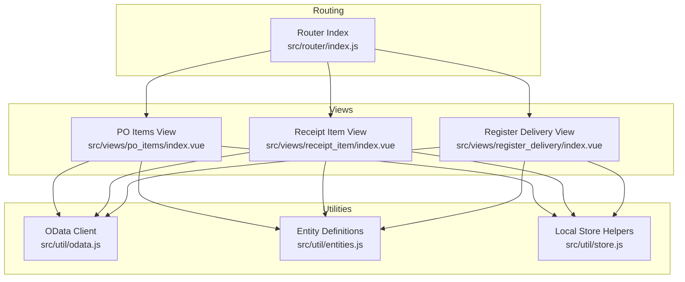
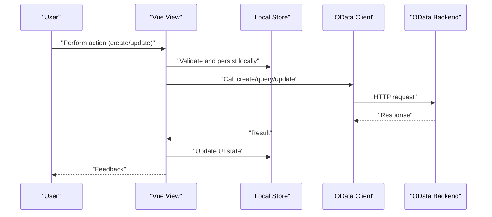
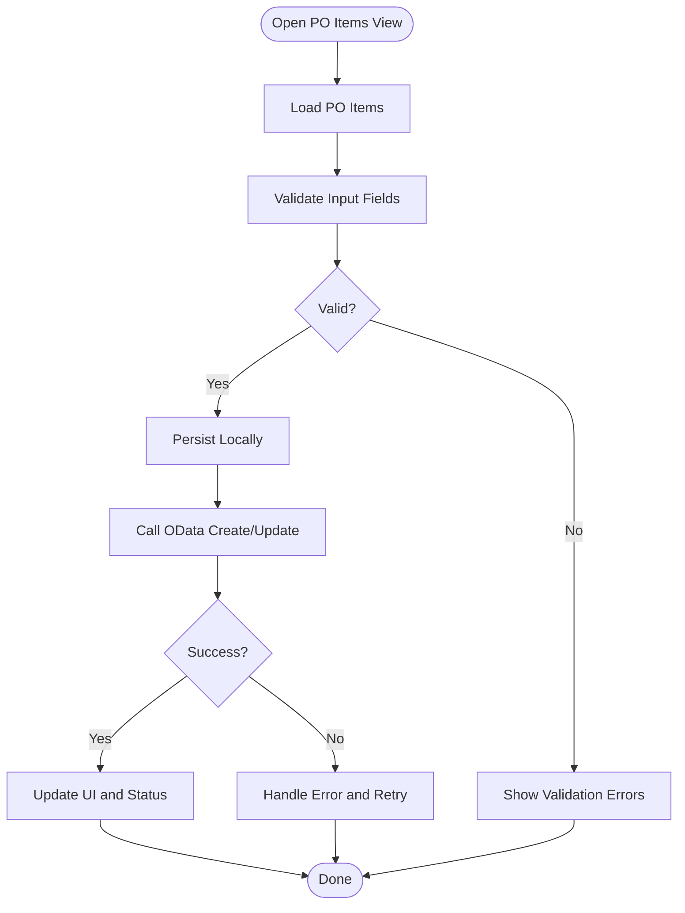
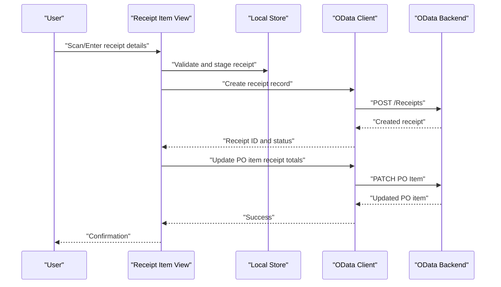
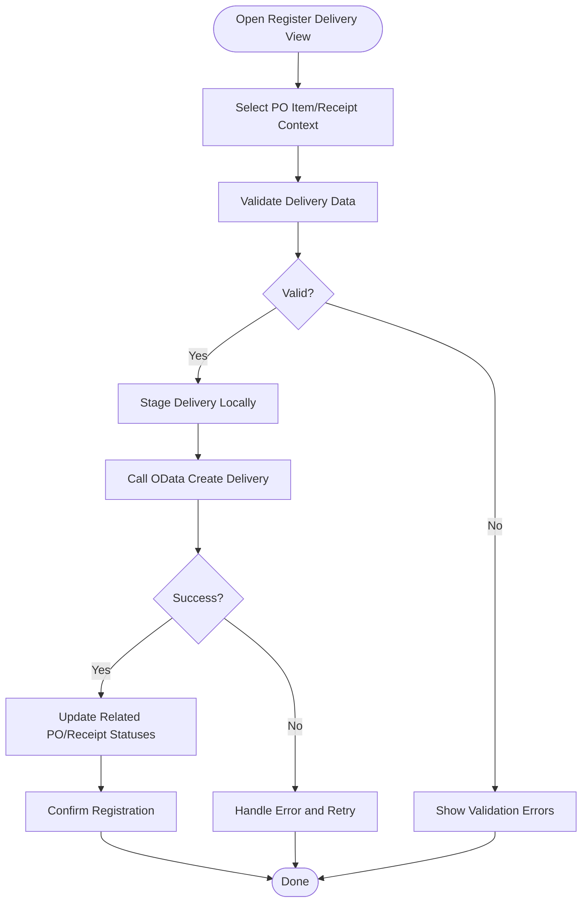
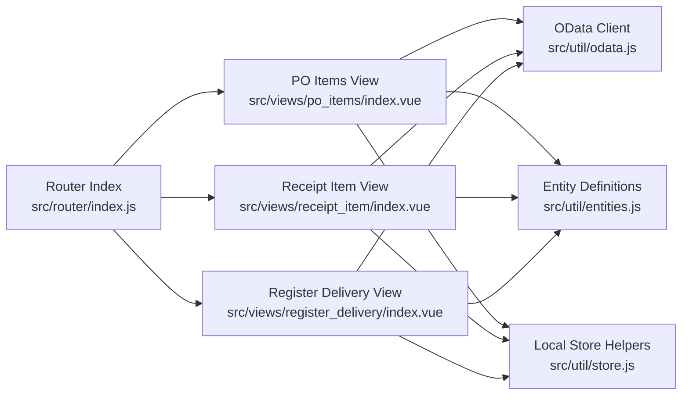

# Purchase Order Processing

<cite>
**Referenced Files in This Document**
- [index.vue](file://src/views/po_items/index.vue)
- [index.vue](file://src/views/receipt_item/index.vue)
- [index.vue](file://src/views/register_delivery/index.vue)
- [odata.js](file://src/util/odata.js)
- [entities.js](file://src/util/entities.js)
- [store.js](file://src/util/store.js)
- [router/index.js](file://src/router/index.js)
</cite>

## Table of Contents
1. [Introduction](#introduction)
2. [Project Structure](#project-structure)
3. [Core Components](#core-components)
4. [Architecture Overview](#architecture-overview)
5. [Detailed Component Analysis](#detailed-component-analysis)
6. [Dependency Analysis](#dependency-analysis)
7. [Performance Considerations](#performance-considerations)
8. [Troubleshooting Guide](#troubleshooting-guide)
9. [Conclusion](#conclusion)

## Introduction
This document explains the purchase order processing system with a focus on:
- PO item management
- Receipt processing workflows
- Delivery registration procedures
- OData integration for backend communication
- Data validation rules and status tracking mechanisms
- Relationships between PO items, receipts, and deliveries, including data flow and business logic
- Practical examples for creating POs, processing receipts, registering deliveries, and handling order status changes

The system is implemented as a Vue-based frontend application that communicates with an OData backend to manage purchase orders, receipts, and deliveries.

## Project Structure
The relevant parts of the project are organized by feature views and shared utilities:
- Feature views:
  - PO items view
  - Receipt item view
  - Register delivery view
- Shared utilities:
  - OData client wrapper
  - Entity definitions
  - Local store helpers
- Routing configuration

**Diagram sources**
- [index.vue](file://src/views/po_items/index.vue)
- [index.vue](file://src/views/receipt_item/index.vue)
- [index.vue](file://src/views/register_delivery/index.vue)
- [odata.js](file://src/util/odata.js)
- [entities.js](file://src/util/entities.js)
- [store.js](file://src/util/store.js)
- [router/index.js](file://src/router/index.js)

**Section sources**
- [index.vue](file://src/views/po_items/index.vue)
- [index.vue](file://src/views/receipt_item/index.vue)
- [index.vue](file://src/views/register_delivery/index.vue)
- [odata.js](file://src/util/odata.js)
- [entities.js](file://src/util/entities.js)
- [store.js](file://src/util/store.js)
- [router/index.js](file://src/router/index.js)

## Core Components
- PO Items View: Displays and manages purchase order items, supports creation and updates, and triggers downstream receipt and delivery flows.
- Receipt Item View: Processes goods receipts against PO items, validates quantities and statuses, and updates backend records via OData.
- Register Delivery View: Registers deliveries linked to receipts or PO items, enforces business rules, and persists changes through OData.
- OData Client: Provides typed methods for querying and mutating OData entities (e.g., purchase orders, items, receipts, deliveries).
- Entities: Defines entity shapes and field constraints used across views.
- Store: Manages local state and persistence for offline-friendly operations and UI state.

Key responsibilities:
- Data binding and validation at the UI layer
- Business rule enforcement before OData calls
- Error handling and user feedback
- Status transitions and auditability

**Section sources**
- [index.vue](file://src/views/po_items/index.vue)
- [index.vue](file://src/views/receipt_item/index.vue)
- [index.vue](file://src/views/register_delivery/index.vue)
- [odata.js](file://src/util/odata.js)
- [entities.js](file://src/util/entities.js)
- [store.js](file://src/util/store.js)

## Architecture Overview
The system follows a layered architecture:
- Presentation Layer: Vue views for PO items, receipts, and deliveries
- Integration Layer: OData client for backend communication
- Domain Layer: Entity definitions and business rules
- State Layer: Local store for UI and temporary data

**Diagram sources**
- [index.vue](file://src/views/po_items/index.vue)
- [index.vue](file://src/views/receipt_item/index.vue)
- [index.vue](file://src/views/register_delivery/index.vue)
- [odata.js](file://src/util/odata.js)
- [store.js](file://src/util/store.js)

## Detailed Component Analysis

### PO Items Management
Responsibilities:
- List and filter PO items
- Create new PO entries and line items
- Update existing PO items
- Enforce validation rules (e.g., required fields, quantity limits)
- Trigger receipt and delivery workflows from PO context

Business rules:
- Required fields must be present before submission
- Quantities must be positive and within allowed ranges
- Status transitions must follow allowed states

Status tracking:
- Tracks current PO item status and history
- Updates status after successful OData mutations

**Diagram sources**
- [index.vue](file://src/views/po_items/index.vue)
- [odata.js](file://src/util/odata.js)
- [entities.js](file://src/util/entities.js)
- [store.js](file://src/util/store.js)

**Section sources**
- [index.vue](file://src/views/po_items/index.vue)
- [odata.js](file://src/util/odata.js)
- [entities.js](file://src/util/entities.js)
- [store.js](file://src/util/store.js)

### Receipt Processing Workflow
Responsibilities:
- Associate receipts with PO items
- Validate receipt quantities and conditions
- Update PO item statuses upon successful receipt
- Persist receipt records via OData

Business rules:
- Receipt quantity cannot exceed remaining open quantity on PO item
- Receipt date must be valid and not in the future
- Mandatory receipt attributes must be provided

Status tracking:
- Receipt status transitions (e.g., created, posted)
- PO item partial/full receipt indicators

**Diagram sources**
- [index.vue](file://src/views/receipt_item/index.vue)
- [odata.js](file://src/util/odata.js)
- [entities.js](file://src/util/entities.js)
- [store.js](file://src/util/store.js)

**Section sources**
- [index.vue](file://src/views/receipt_item/index.vue)
- [odata.js](file://src/util/odata.js)
- [entities.js](file://src/util/entities.js)
- [store.js](file://src/util/store.js)

### Delivery Registration Procedure
Responsibilities:
- Register deliveries linked to receipts or PO items
- Validate delivery information (dates, quantities, locations)
- Update related PO item and receipt statuses
- Persist delivery records via OData

Business rules:
- Delivery quantity must align with receipt and PO item constraints
- Delivery date must be valid
- Required delivery attributes must be provided

Status tracking:
- Delivery status transitions (e.g., registered, confirmed)
- Propagation of status changes to PO items and receipts

**Diagram sources**
- [index.vue](file://src/views/register_delivery/index.vue)
- [odata.js](file://src/util/odata.js)
- [entities.js](file://src/util/entities.js)
- [store.js](file://src/util/store.js)

**Section sources**
- [index.vue](file://src/views/register_delivery/index.vue)
- [odata.js](file://src/util/odata.js)
- [entities.js](file://src/util/entities.js)
- [store.js](file://src/util/store.js)

### OData Integration
Responsibilities:
- Provide typed methods for CRUD operations on PO items, receipts, and deliveries
- Handle HTTP requests, retries, and error mapping
- Normalize responses into entity structures defined in entities

Integration points:
- Base URL and authentication configuration
- Query filters and expand options for efficient data retrieval
- Batch operations where supported by backend

Error handling:
- Network errors mapped to user-friendly messages
- Validation errors surfaced to UI forms
- Retry strategies for transient failures

**Section sources**
- [odata.js](file://src/util/odata.js)
- [entities.js](file://src/util/entities.js)

### Data Validation Rules
Common rules:
- Required fields enforced before submission
- Numeric fields validated for positivity and range
- Date fields validated for correctness and business constraints
- Cross-field validations (e.g., receipt quantity vs. remaining PO quantity)

Validation strategy:
- Immediate inline validation for better UX
- Pre-submission validation to prevent invalid payloads
- Server-side validation fallback with detailed error reporting

**Section sources**
- [index.vue](file://src/views/po_items/index.vue)
- [index.vue](file://src/views/receipt_item/index.vue)
- [index.vue](file://src/views/register_delivery/index.vue)
- [entities.js](file://src/util/entities.js)

### Status Tracking Mechanisms
Mechanisms:
- Local state mirrors backend status for responsiveness
- Status transitions guarded by business rules
- Audit trail maintained for critical actions (creation, posting, confirmation)

Transitions:
- PO item: draft -> open -> partially received -> fully received -> closed
- Receipt: created -> posted -> cancelled
- Delivery: registered -> confirmed -> delivered

**Section sources**
- [index.vue](file://src/views/po_items/index.vue)
- [index.vue](file://src/views/receipt_item/index.vue)
- [index.vue](file://src/views/register_delivery/index.vue)
- [store.js](file://src/util/store.js)

## Dependency Analysis
The following diagram shows how views depend on shared utilities and routing:

**Diagram sources**
- [router/index.js](file://src/router/index.js)
- [index.vue](file://src/views/po_items/index.vue)
- [index.vue](file://src/views/receipt_item/index.vue)
- [index.vue](file://src/views/register_delivery/index.vue)
- [odata.js](file://src/util/odata.js)
- [entities.js](file://src/util/entities.js)
- [store.js](file://src/util/store.js)

**Section sources**
- [router/index.js](file://src/router/index.js)
- [index.vue](file://src/views/po_items/index.vue)
- [index.vue](file://src/views/receipt_item/index.vue)
- [index.vue](file://src/views/register_delivery/index.vue)
- [odata.js](file://src/util/odata.js)
- [entities.js](file://src/util/entities.js)
- [store.js](file://src/util/store.js)

## Performance Considerations
- Use query filters and expand options to minimize payload sizes
- Debounce search inputs to reduce OData calls
- Cache frequently accessed reference data locally when appropriate
- Implement optimistic UI updates with rollback on failure
- Avoid unnecessary re-renders by keeping component state minimal and derived

[No sources needed since this section provides general guidance]

## Troubleshooting Guide
Common issues and resolutions:
- Network errors: Check connectivity, retry with backoff, and surface clear messages
- Validation errors: Inspect form fields and cross-field constraints; log detailed server errors
- Status mismatch: Re-sync with backend and reconcile local state
- Missing required fields: Highlight missing inputs and provide guidance

Diagnostic steps:
- Verify OData endpoint configuration and credentials
- Inspect request/response payloads for anomalies
- Review local store state for inconsistencies
- Check router navigation to ensure correct view context

**Section sources**
- [odata.js](file://src/util/odata.js)
- [store.js](file://src/util/store.js)
- [index.vue](file://src/views/po_items/index.vue)
- [index.vue](file://src/views/receipt_item/index.vue)
- [index.vue](file://src/views/register_delivery/index.vue)

## Conclusion
The purchase order processing system integrates PO item management, receipt processing, and delivery registration through a cohesive Vue-based frontend backed by OData services. Robust validation, clear status tracking, and well-defined relationships between PO items, receipts, and deliveries ensure reliable end-to-end workflows. The modular structure promotes maintainability and scalability while providing a responsive user experience.

[No sources needed since this section summarizes without analyzing specific files]