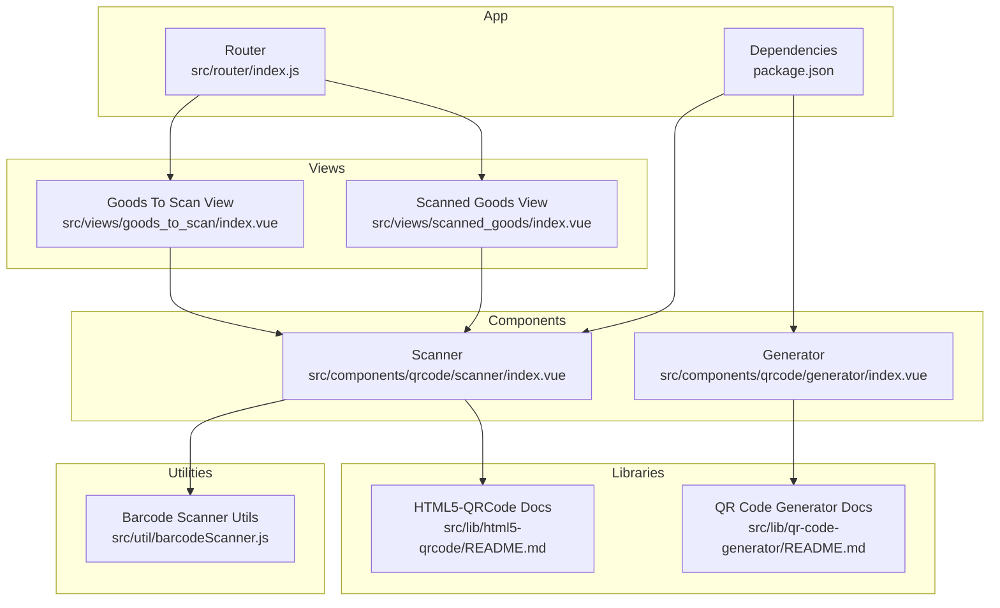
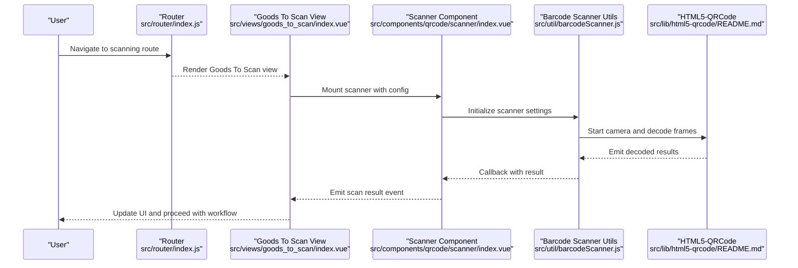
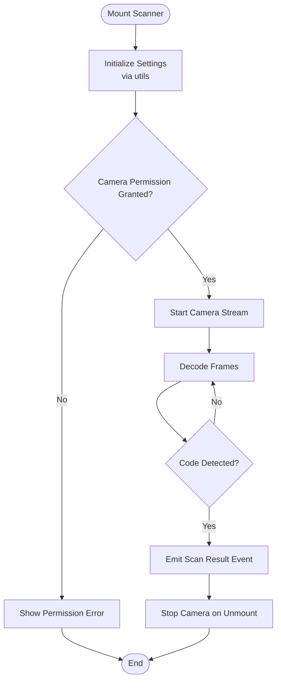
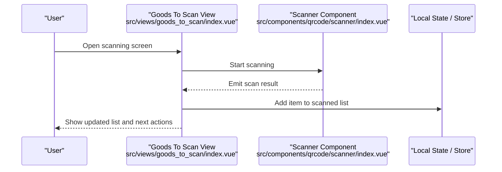
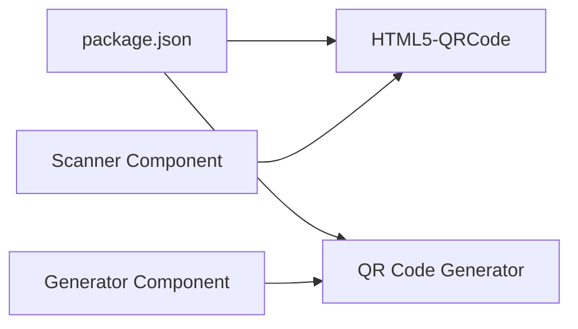

# Scanning Module

<cite>
**Referenced Files in This Document**
- [src/components/qrcode/scanner/index.vue](file://src/components/qrcode/scanner/index.vue)
- [src/components/qrcode/generator/index.vue](file://src/components/qrcode/generator/index.vue)
- [src/lib/html5-qrcode/README.md](file://src/lib/html5-qrcode/README.md)
- [src/lib/qr-code-generator/README.md](file://src/lib/qr-code-generator/README.md)
- [src/util/barcodeScanner.js](file://src/util/barcodeScanner.js)
- [src/views/goods_to_scan/index.vue](file://src/views/goods_to_scan/index.vue)
- [src/views/scanned_goods/index.vue](file://src/views/scanned_goods/index.vue)
- [src/router/index.js](file://src/router/index.js)
- [package.json](file://package.json)
</cite>

## Table of Contents
1. [Introduction](#introduction)
2. [Project Structure](#project-structure)
3. [Core Components](#core-components)
4. [Architecture Overview](#architecture-overview)
5. [Detailed Component Analysis](#detailed-component-analysis)
6. [Dependency Analysis](#dependency-analysis)
7. [Performance Considerations](#performance-considerations)
8. [Troubleshooting Guide](#troubleshooting-guide)
9. [Conclusion](#conclusion)
10. [Appendices](#appendices)

## Introduction
This document describes the QR code and barcode scanning module, focusing on:
- Scanner component implementation using HTML5-QRCode for real-time camera-based scanning
- QR code generation capabilities
- Configuration options for different scan types (QR codes and barcodes)
- Error handling for camera permissions and device compatibility
- Performance optimization techniques
- Customization of scan regions
- Handling scan results and integration with inventory workflows

The module is implemented as Vue components and utilities that integrate with the application’s routing and views to support end-to-end scanning flows.

## Project Structure
The scanning functionality is organized under dedicated directories and files:
- Scanner component: src/components/qrcode/scanner/index.vue
- Generator component: src/components/qrcode/generator/index.vue
- Utility helper: src/util/barcodeScanner.js
- Library documentation: src/lib/html5-qrcode/README.md and src/lib/qr-code-generator/README.md
- Views integrating scanning: src/views/goods_to_scan/index.vue and src/views/scanned_goods/index.vue
- Routing configuration: src/router/index.js
- Dependencies: package.json

**Diagram sources**
- [src/components/qrcode/scanner/index.vue](file://src/components/qrcode/scanner/index.vue)
- [src/components/qrcode/generator/index.vue](file://src/components/qrcode/generator/index.vue)
- [src/util/barcodeScanner.js](file://src/util/barcodeScanner.js)
- [src/lib/html5-qrcode/README.md](file://src/lib/html5-qrcode/README.md)
- [src/lib/qr-code-generator/README.md](file://src/lib/qr-code-generator/README.md)
- [src/views/goods_to_scan/index.vue](file://src/views/goods_to_scan/index.vue)
- [src/views/scanned_goods/index.vue](file://src/views/scanned_goods/index.vue)
- [src/router/index.js](file://src/router/index.js)
- [package.json](file://package.json)

**Section sources**
- [src/components/qrcode/scanner/index.vue](file://src/components/qrcode/scanner/index.vue)
- [src/components/qrcode/generator/index.vue](file://src/components/qrcode/generator/index.vue)
- [src/util/barcodeScanner.js](file://src/util/barcodeScanner.js)
- [src/lib/html5-qrcode/README.md](file://src/lib/html5-qrcode/README.md)
- [src/lib/qr-code-generator/README.md](file://src/lib/qr-code-generator/README.md)
- [src/views/goods_to_scan/index.vue](file://src/views/goods_to_scan/index.vue)
- [src/views/scanned_goods/index.vue](file://src/views/scanned_goods/index.vue)
- [src/router/index.js](file://src/router/index.js)
- [package.json](file://package.json)

## Core Components
- Scanner component: Provides real-time camera scanning for QR codes and barcodes using HTML5-QRCode. It manages camera access, region selection, and result callbacks.
- Generator component: Generates QR codes from input data and renders them for display or download.
- Barcode scanner utility: Encapsulates common logic for configuring scan types, handling errors, and formatting results.

Key responsibilities:
- Camera initialization and permission handling
- Configuring supported formats (QR codes and various barcode symbologies)
- Real-time decoding and event-driven result delivery
- Region-of-interest customization
- Error reporting and recovery strategies

**Section sources**
- [src/components/qrcode/scanner/index.vue](file://src/components/qrcode/scanner/index.vue)
- [src/components/qrcode/generator/index.vue](file://src/components/qrcode/generator/index.vue)
- [src/util/barcodeScanner.js](file://src/util/barcodeScanner.js)

## Architecture Overview
The scanning architecture integrates a reusable scanner component with application views and utilities. The router exposes scanning-related routes, while views orchestrate user interactions and business workflows.

**Diagram sources**
- [src/router/index.js](file://src/router/index.js)
- [src/views/goods_to_scan/index.vue](file://src/views/goods_to_scan/index.vue)
- [src/components/qrcode/scanner/index.vue](file://src/components/qrcode/scanner/index.vue)
- [src/util/barcodeScanner.js](file://src/util/barcodeScanner.js)
- [src/lib/html5-qrcode/README.md](file://src/lib/html5-qrcode/README.md)

## Detailed Component Analysis

### Scanner Component
The scanner component encapsulates the full lifecycle of camera-based scanning:
- Initialization: Requests camera access, selects device if needed, and starts decoding
- Configuration: Supports enabling/disabling QR codes and specific barcode formats
- Region control: Allows defining a rectangular region to limit scanning area
- Result handling: Emits events when a valid code is detected
- Error management: Handles permission denials, unsupported devices, and runtime failures

**Diagram sources**
- [src/components/qrcode/scanner/index.vue](file://src/components/qrcode/scanner/index.vue)
- [src/util/barcodeScanner.js](file://src/util/barcodeScanner.js)
- [src/lib/html5-qrcode/README.md](file://src/lib/html5-qrcode/README.md)

Configuration highlights:
- Enable/disable QR code scanning
- Enable/disable barcode scanning and select specific symbologies
- Define scan region (top-left coordinates, width, height)
- Choose facing mode (user or environment camera)
- Set frame processing interval to balance performance and accuracy

Integration points:
- Emits scan results to parent views
- Exposes methods to start/stop scanning
- Accepts props for format toggles and region settings

**Section sources**
- [src/components/qrcode/scanner/index.vue](file://src/components/qrcode/scanner/index.vue)
- [src/util/barcodeScanner.js](file://src/util/barcodeScanner.js)

### Generator Component
The generator component creates QR codes from provided text or structured data:
- Input validation and encoding
- Rendering output to canvas or image element
- Optional download/export functionality

Use cases:
- Generating labels for items
- Creating shareable links or identifiers
- Printing QR codes for packaging

**Section sources**
- [src/components/qrcode/generator/index.vue](file://src/components/qrcode/generator/index.vue)
- [src/lib/qr-code-generator/README.md](file://src/lib/qr-code-generator/README.md)

### Barcode Scanner Utility
The utility centralizes configuration and error handling for scanning:
- Format selection (QR codes and barcode types)
- Region-of-interest setup
- Device capability checks
- Consistent error messages and fallbacks

It provides a consistent interface for both the scanner component and any direct usage patterns.

**Section sources**
- [src/util/barcodeScanner.js](file://src/util/barcodeScanner.js)

### Integration with Inventory Workflows
Typical flow:
- User navigates to the goods scanning view
- Scanner component mounts and requests camera access
- On successful detection, the view updates the scanned list and proceeds to confirm or submit
- Errors are surfaced to the user with actionable guidance

**Diagram sources**
- [src/views/goods_to_scan/index.vue](file://src/views/goods_to_scan/index.vue)
- [src/components/qrcode/scanner/index.vue](file://src/components/qrcode/scanner/index.vue)

**Section sources**
- [src/views/goods_to_scan/index.vue](file://src/views/goods_to_scan/index.vue)
- [src/views/scanned_goods/index.vue](file://src/views/scanned_goods/index.vue)
- [src/router/index.js](file://src/router/index.js)

## Dependency Analysis
External libraries and their roles:
- HTML5-QRCode: Provides real-time QR and barcode decoding via the browser’s MediaDevices API
- QR Code Generator: Renders QR codes from input data

**Diagram sources**
- [package.json](file://package.json)
- [src/components/qrcode/scanner/index.vue](file://src/components/qrcode/scanner/index.vue)
- [src/components/qrcode/generator/index.vue](file://src/components/qrcode/generator/index.vue)

**Section sources**
- [package.json](file://package.json)
- [src/lib/html5-qrcode/README.md](file://src/lib/html5-qrcode/README.md)
- [src/lib/qr-code-generator/README.md](file://src/lib/qr-code-generator/README.md)

## Performance Considerations
- Frame rate and interval: Adjust frame processing interval to reduce CPU usage on lower-end devices
- Region-of-interest: Limiting the scan region reduces decoding workload and improves speed
- Format selection: Disable unused formats to minimize decoding overhead
- Camera constraints: Prefer higher resolution only when necessary; use appropriate facing mode
- Debouncing results: Avoid duplicate processing by debouncing rapid successive detections
- Memory management: Stop camera streams promptly on unmount or navigation away

[No sources needed since this section provides general guidance]

## Troubleshooting Guide
Common issues and resolutions:
- Camera permission denied: Ensure HTTPS context and prompt users to allow camera access
- No camera found: Check device capabilities and provide fallback instructions
- Poor scanning performance: Reduce region size, disable unnecessary formats, and adjust frame interval
- Inconsistent results: Improve lighting, stabilize device, and ensure scannable code quality
- Generation failures: Validate input data length and encoding requirements

Operational tips:
- Provide clear error messages and retry controls
- Log detailed diagnostics for camera initialization and decoding errors
- Offer manual entry fallback when scanning fails repeatedly

**Section sources**
- [src/util/barcodeScanner.js](file://src/util/barcodeScanner.js)
- [src/components/qrcode/scanner/index.vue](file://src/components/qrcode/scanner/index.vue)

## Conclusion
The scanning module delivers robust QR and barcode scanning with flexible configuration, strong error handling, and performance tuning options. The scanner and generator components integrate cleanly into the application’s views and routing, enabling efficient inventory workflows and label generation.

[No sources needed since this section summarizes without analyzing specific files]

## Appendices

### Configuration Options Reference
- Scan types:
  - Enable QR code scanning
  - Enable barcode scanning and select specific symbologies
- Region-of-interest:
  - Top-left x and y coordinates
  - Width and height of the scan rectangle
- Camera behavior:
  - Facing mode (user or environment)
  - Resolution and frame interval
- Error handling:
  - Permission prompts and fallback messaging
  - Retry and stop controls

**Section sources**
- [src/components/qrcode/scanner/index.vue](file://src/components/qrcode/scanner/index.vue)
- [src/util/barcodeScanner.js](file://src/util/barcodeScanner.js)

### Example Usage Patterns
- Customize scan region:
  - Pass region props to the scanner component to restrict scanning area
- Handle scan results:
  - Listen for emitted events in the parent view and update state accordingly
- Integrate with inventory:
  - On successful scan, add items to a local list and enable submission actions

**Section sources**
- [src/views/goods_to_scan/index.vue](file://src/views/goods_to_scan/index.vue)
- [src/views/scanned_goods/index.vue](file://src/views/scanned_goods/index.vue)