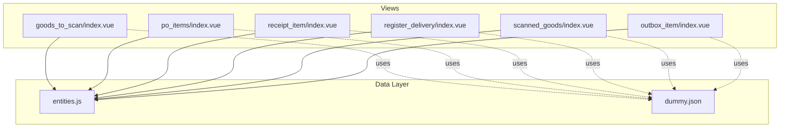
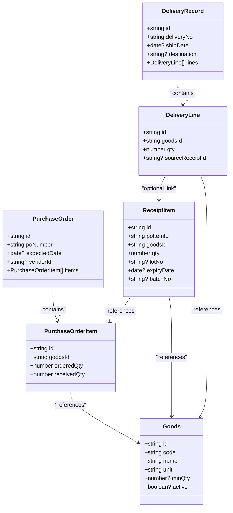
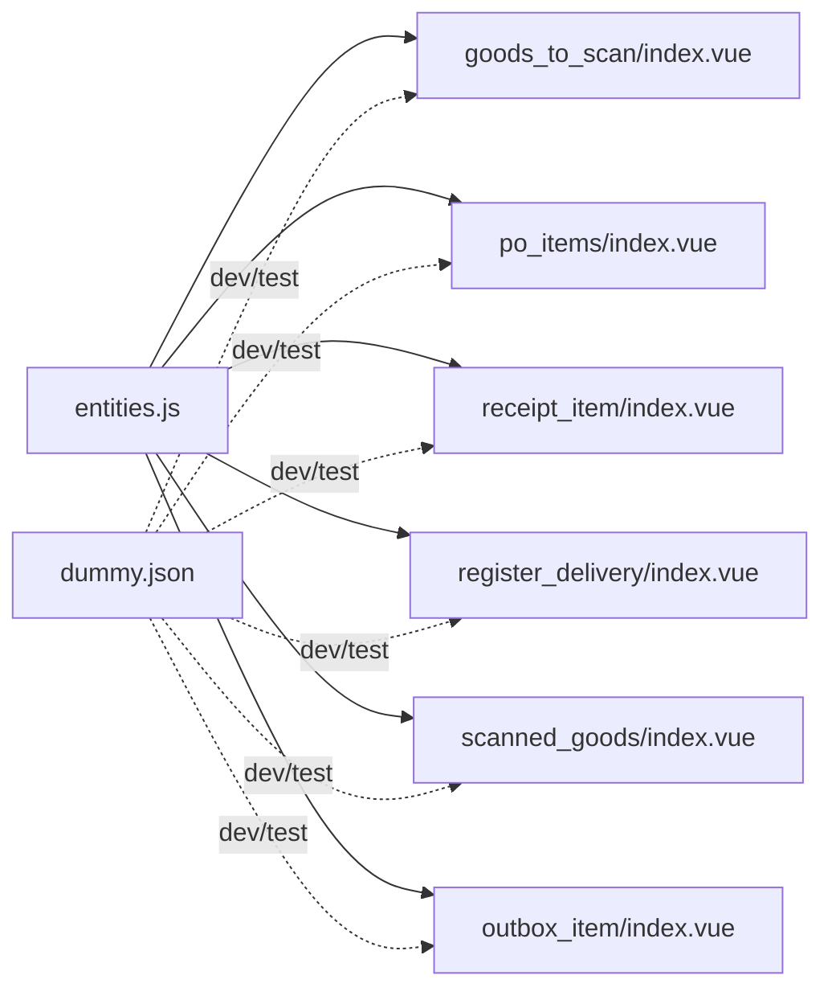
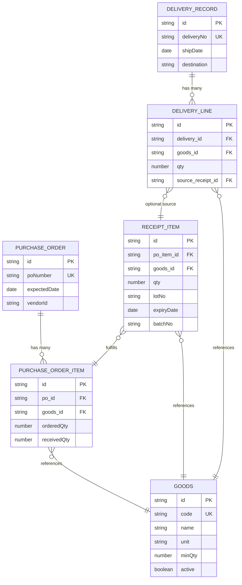

# Data Models & Entities

<cite>
**Referenced Files in This Document**
- [entities.js](file://src/util/entities.js)
- [dummy.json](file://src/util/dummy.json)
- [goods_to_scan/index.vue](file://src/views/goods_to_scan/index.vue)
- [po_items/index.vue](file://src/views/po_items/index.vue)
- [receipt_item/index.vue](file://src/views/receipt_item/index.vue)
- [register_delivery/index.vue](file://src/views/register_delivery/index.vue)
- [scanned_goods/index.vue](file://src/views/scanned_goods/index.vue)
- [outbox_item/index.vue](file://src/views/outbox_item/index.vue)
</cite>

## Table of Contents
1. [Introduction](#introduction)
2. [Project Structure](#project-structure)
3. [Core Components](#core-components)
4. [Architecture Overview](#architecture-overview)
5. [Detailed Component Analysis](#detailed-component-analysis)
6. [Dependency Analysis](#dependency-analysis)
7. [Performance Considerations](#performance-considerations)
8. [Troubleshooting Guide](#troubleshooting-guide)
9. [Conclusion](#conclusion)
10. [Appendices](#appendices)

## Introduction
This document describes the data models and entities used by the ahm-gr-scanner application, focusing on Goods, Purchase Orders, Receipt Items, and Delivery records. It explains field specifications, data types, validation rules, relationships, and how dummy data supports development and testing. It also includes schema diagrams, sample structures, transformation patterns, and guidance for enforcing business rules and integrity constraints.

## Project Structure
The data model is primarily defined in a central module and consumed across multiple views that implement scanning, receipting, and delivery workflows. The key files are:
- Entity definitions and helpers: src/util/entities.js
- Dummy dataset for local development/testing: src/util/dummy.json
- Views that create, validate, and persist entities:
  - Goods scanning and selection: src/views/goods_to_scan/index.vue
  - Purchase Order items: src/views/po_items/index.vue
  - Receipt item entry: src/views/receipt_item/index.vue
  - Delivery registration: src/views/register_delivery/index.vue
  - Scanned goods list: src/views/scanned_goods/index.vue
  - Outbox item (sync queue): src/views/outbox_item/index.vue

**Diagram sources**
- [entities.js](file://src/util/entities.js)
- [dummy.json](file://src/util/dummy.json)
- [goods_to_scan/index.vue](file://src/views/goods_to_scan/index.vue)
- [po_items/index.vue](file://src/views/po_items/index.vue)
- [receipt_item/index.vue](file://src/views/receipt_item/index.vue)
- [register_delivery/index.vue](file://src/views/register_delivery/index.vue)
- [scanned_goods/index.vue](file://src/views/scanned_goods/index.vue)
- [outbox_item/index.vue](file://src/views/outbox_item/index.vue)

**Section sources**
- [entities.js](file://src/util/entities.js)
- [dummy.json](file://src/util/dummy.json)
- [goods_to_scan/index.vue](file://src/views/goods_to_scan/index.vue)
- [po_items/index.vue](file://src/views/po_items/index.vue)
- [receipt_item/index.vue](file://src/views/receipt_item/index.vue)
- [register_delivery/index.vue](file://src/views/register_delivery/index.vue)
- [scanned_goods/index.vue](file://src/views/scanned_goods/index.vue)
- [outbox_item/index.vue](file://src/views/outbox_item/index.vue)

## Core Components
This section documents the core entity models and their roles:
- Goods: Master product catalog with identifiers, descriptions, units, and optional attributes. Used as reference during scanning and receipting.
- Purchase Orders: Procurement orders containing header-level metadata and line items referencing Goods.
- Receipt Items: Line-level entries capturing received quantities, batch/lot info, and links to Goods and Purchase Orders.
- Delivery Records: Shipment headers and associated lines describing outbound deliveries and their linkage to receipts or purchase orders.

Key responsibilities:
- Centralized type and validation definitions in entities.js
- Consistent shape of objects across views
- Deterministic mapping from scanned inputs to persisted records
- Stable keys for linking related entities

**Section sources**
- [entities.js](file://src/util/entities.js)

## Architecture Overview
At runtime, views read from entities.js to construct and validate domain objects. During development, dummy.json provides realistic datasets to drive UI flows without backend connectivity.

**Diagram sources**
- [entities.js](file://src/util/entities.js)

## Detailed Component Analysis

### Goods Model
Purpose:
- Represents master product information referenced by purchase orders, receipts, and deliveries.

Field specifications:
- id: string; unique identifier for the good.
- code: string; external/product code.
- name: string; human-readable description.
- unit: string; measurement unit (e.g., each, box).
- minQty: number (optional); minimum order quantity if applicable.
- active: boolean (optional); indicates whether the good is currently available.

Validation rules:
- id must be non-empty and unique within the dataset.
- code and name must be non-empty strings.
- unit must be a recognized unit value.
- minQty, when present, must be greater than zero.
- active defaults to true if omitted.

Relationships:
- Referenced by PurchaseOrderItem via goodsId.
- Referenced by ReceiptItem via goodsId.
- Referenced by DeliveryLine via goodsId.

Sample structure:
- See [entities.js](file://src/util/entities.js) for the canonical shape and examples.

**Section sources**
- [entities.js](file://src/util/entities.js)

### Purchase Orders and Purchase Order Items
Purpose:
- Capture procurement intent and track per-item ordering and receiving status.

Field specifications:
- PurchaseOrder
  - id: string; unique identifier.
  - poNumber: string; business-facing purchase order number.
  - expectedDate: date (optional); planned arrival date.
  - vendorId: string (optional); supplier identifier.
  - items: array of PurchaseOrderItem.
- PurchaseOrderItem
  - id: string; unique identifier for the line.
  - goodsId: string; foreign key to Goods.
  - orderedQty: number; total quantity ordered.
  - receivedQty: number; cumulative quantity received so far.

Validation rules:
- id and poNumber must be non-empty.
- orderedQty must be positive.
- receivedQty must be non-negative and cannot exceed orderedQty.
- goodsId must reference an existing Goods record.

Relationships:
- One-to-many with PurchaseOrderItem.
- Many-to-one with Goods through goodsId.

Sample structure:
- See [entities.js](file://src/util/entities.js) for the canonical shape and examples.

**Section sources**
- [entities.js](file://src/util/entities.js)

### Receipt Items
Purpose:
- Record actual received quantities against purchase order lines, including traceability fields such as lot/batch/expiry.

Field specifications:
- id: string; unique identifier.
- poItemId: string; references the specific PurchaseOrderItem being fulfilled.
- goodsId: string; references Goods for auditability.
- qty: number; quantity received in this receipt line.
- lotNo: string (optional); lot identification.
- expiryDate: date (optional); expiration date if applicable.
- batchNo: string (optional); internal batch identifier.

Validation rules:
- id, poItemId, goodsId, and qty are required.
- qty must be positive.
- poItemId must exist and belong to a valid PurchaseOrder.
- goodsId must match the goodsId of the referenced PurchaseOrderItem.
- If lotNo or batchNo are provided, they must be non-empty strings.
- expiryDate, if provided, must be a valid date.

Business rules:
- Cumulative receivedQty across all ReceiptItems for a given PurchaseOrderItem must not exceed orderedQty.
- Receipts should be linked to the correct PurchaseOrderItem to maintain traceability.

Sample structure:
- See [entities.js](file://src/util/entities.js) for the canonical shape and examples.

**Section sources**
- [entities.js](file://src/util/entities.js)

### Delivery Records and Lines
Purpose:
- Represent outbound shipments, optionally sourced from receipts, with line-level detail.

Field specifications:
- DeliveryRecord
  - id: string; unique identifier.
  - deliveryNo: string; business-facing delivery number.
  - shipDate: date (optional); shipping date.
  - destination: string (optional); delivery destination.
  - lines: array of DeliveryLine.
- DeliveryLine
  - id: string; unique identifier for the line.
  - goodsId: string; references Goods.
  - qty: number; quantity shipped.
  - sourceReceiptId: string (optional); links back to a ReceiptItem if applicable.

Validation rules:
- id and deliveryNo are required.
- qty must be positive.
- goodsId must reference an existing Goods record.
- If sourceReceiptId is provided, it must reference a valid ReceiptItem.

Business rules:
- When sourceReceiptId is set, the shipped qty should not exceed the remaining unshipped quantity from the linked receipt.
- Delivery lines may aggregate multiple receipts or split across multiple deliveries.

Sample structure:
- See [entities.js](file://src/util/entities.js) for the canonical shape and examples.

**Section sources**
- [entities.js](file://src/util/entities.js)

### Dummy Data Structure and Usage
Purpose:
- Provide realistic sample data for Goods, Purchase Orders, Receipt Items, and Deliveries to enable offline development and testing.

Structure overview:
- A top-level object containing arrays for each entity type.
- Each array contains multiple records following the shapes defined in entities.js.
- IDs are consistent across records to demonstrate relationships.

Role in development and testing:
- Enables UI flows without backend calls.
- Supports end-to-end scenarios like scanning goods, creating receipts, and registering deliveries.
- Facilitates regression tests and manual QA using stable datasets.

Where to find:
- [dummy.json](file://src/util/dummy.json)

**Section sources**
- [dummy.json](file://src/util/dummy.json)

### Data Transformation Patterns
Common transformations observed across views:
- Scanning to Goods lookup:
  - Input: barcode or code from scanner.
  - Process: search Goods by code or id.
  - Output: selected Goods record for further processing.
- Creating a Receipt Item:
  - Input: user-entered qty and optional lot/batch/expiry.
  - Process: validate against PurchaseOrderItem limits and Goods reference.
  - Output: new ReceiptItem ready for persistence.
- Registering a Delivery:
  - Input: shipment details and line selections.
  - Process: build DeliveryRecord with lines; optionally link to ReceiptItem.
  - Output: DeliveryRecord ready for sync.

These patterns ensure consistent data shaping before storage or synchronization.

**Section sources**
- [goods_to_scan/index.vue](file://src/views/goods_to_scan/index.vue)
- [receipt_item/index.vue](file://src/views/receipt_item/index.vue)
- [register_delivery/index.vue](file://src/views/register_delivery/index.vue)

## Dependency Analysis
The following diagram shows how views depend on the central entity definitions and how dummy data can be used as a fallback source.

**Diagram sources**
- [entities.js](file://src/util/entities.js)
- [dummy.json](file://src/util/dummy.json)
- [goods_to_scan/index.vue](file://src/views/goods_to_scan/index.vue)
- [po_items/index.vue](file://src/views/po_items/index.vue)
- [receipt_item/index.vue](file://src/views/receipt_item/index.vue)
- [register_delivery/index.vue](file://src/views/register_delivery/index.vue)
- [scanned_goods/index.vue](file://src/views/scanned_goods/index.vue)
- [outbox_item/index.vue](file://src/views/outbox_item/index.vue)

**Section sources**
- [entities.js](file://src/util/entities.js)
- [dummy.json](file://src/util/dummy.json)
- [goods_to_scan/index.vue](file://src/views/goods_to_scan/index.vue)
- [po_items/index.vue](file://src/views/po_items/index.vue)
- [receipt_item/index.vue](file://src/views/receipt_item/index.vue)
- [register_delivery/index.vue](file://src/views/register_delivery/index.vue)
- [scanned_goods/index.vue](file://src/views/scanned_goods/index.vue)
- [outbox_item/index.vue](file://src/views/outbox_item/index.vue)

## Performance Considerations
- Keep entity definitions centralized to avoid duplication and reduce memory overhead.
- Prefer lookups by id where possible to minimize linear scans over large datasets.
- Use pagination or virtualization in lists (e.g., scanned goods) to improve rendering performance.
- Avoid unnecessary re-renders by keeping state minimal and immutable updates.

[No sources needed since this section provides general guidance]

## Troubleshooting Guide
Common issues and checks:
- Missing or invalid references:
  - Ensure goodsId values exist in Goods.
  - Verify poItemId exists and belongs to a valid PurchaseOrder.
- Quantity violations:
  - Check that receivedQty does not exceed orderedQty.
  - Validate that receipt qty is positive and within allowed ranges.
- Duplicate identifiers:
  - Confirm uniqueness of ids across entities.
- Date validations:
  - Ensure expiryDate and shipDate are valid dates when provided.

Recommended debugging steps:
- Inspect the current state in the relevant view file.
- Compare against the canonical shapes in entities.js.
- Use dummy.json to reproduce issues with known-good data.

**Section sources**
- [entities.js](file://src/util/entities.js)
- [dummy.json](file://src/util/dummy.json)

## Conclusion
The ahm-gr-scanner’s data model centers around four primary entities: Goods, Purchase Orders (with items), Receipt Items, and Delivery Records (with lines). Centralized definitions in entities.js enforce consistent shapes and validation rules, while dummy.json accelerates development and testing. Views implement domain-specific flows that transform user input into validated entities, maintaining referential integrity and business constraints throughout the process.

[No sources needed since this section summarizes without analyzing specific files]

## Appendices

### Schema Diagram

**Diagram sources**
- [entities.js](file://src/util/entities.js)