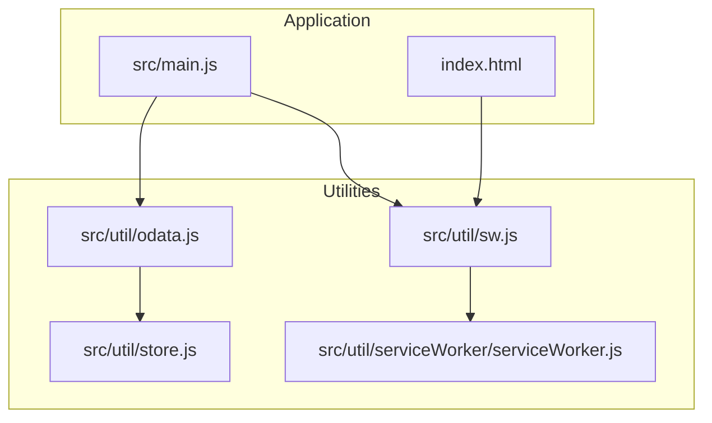
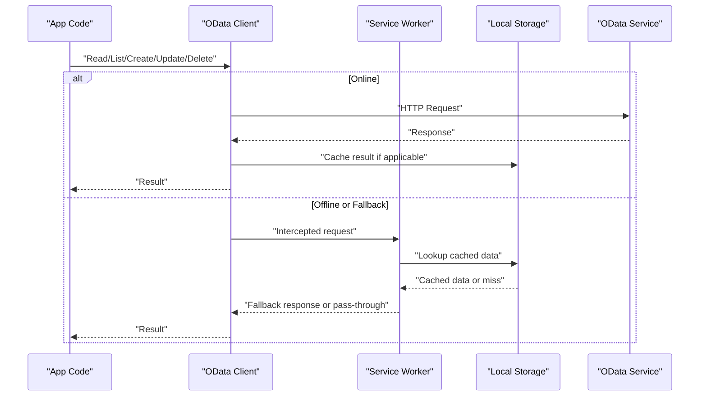
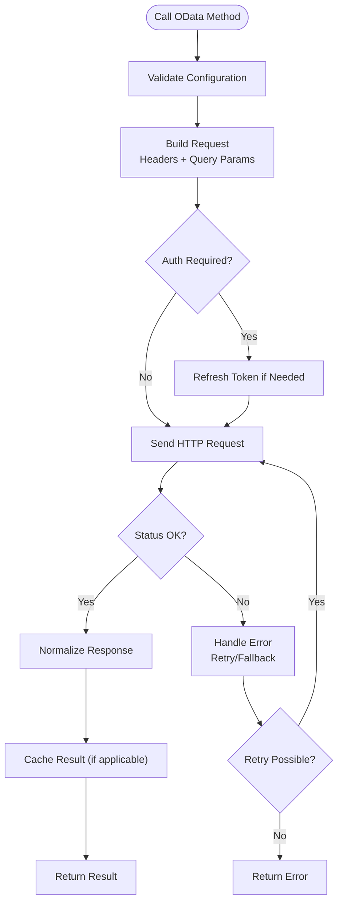
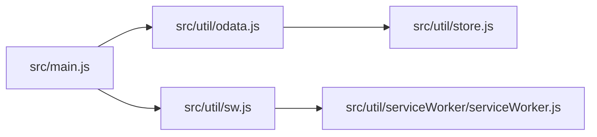

# OData Integration

<cite>
**Referenced Files in This Document**
- [odata.js](file://src/util/odata.js)
- [store.js](file://src/util/store.js)
- [serviceWorker.js](file://src/util/serviceWorker/serviceWorker.js)
- [sw.js](file://src/util/sw.js)
- [index.html](file://index.html)
- [main.js](file://src/main.js)
</cite>

## Table of Contents
1. [Introduction](#introduction)
2. [Project Structure](#project-structure)
3. [Core Components](#core-components)
4. [Architecture Overview](#architecture-overview)
5. [Detailed Component Analysis](#detailed-component-analysis)
6. [Dependency Analysis](#dependency-analysis)
7. [Performance Considerations](#performance-considerations)
8. [Troubleshooting Guide](#troubleshooting-guide)
9. [Conclusion](#conclusion)
10. [Appendices](#appendices)

## Introduction
This document explains how the ahm-gr-scanner application integrates with OData services. It focuses on the OData client implementation, connection configuration, request and response handling, error management, supported operations (CRUD), query building patterns, filtering capabilities, authentication mechanisms, session management, offline sync strategies, batch operations, conflict resolution, performance optimization, caching strategies, and debugging techniques for OData communications.

## Project Structure
The OData integration is primarily implemented under src/util/odata.js and interacts with local storage via src/util/store.js. Offline capabilities are provided by service workers located at src/util/serviceWorker/serviceWorker.js and src/util/sw.js. The main application entry points include index.html and src/main.js.

**Diagram sources**
- [main.js](file://src/main.js)
- [index.html](file://index.html)
- [odata.js](file://src/util/odata.js)
- [store.js](file://src/util/store.js)
- [sw.js](file://src/util/sw.js)
- [serviceWorker.js](file://src/util/serviceWorker/serviceWorker.js)

**Section sources**
- [odata.js](file://src/util/odata.js)
- [store.js](file://src/util/store.js)
- [serviceWorker.js](file://src/util/serviceWorker/serviceWorker.js)
- [sw.js](file://src/util/sw.js)
- [index.html](file://index.html)
- [main.js](file://src/main.js)

## Core Components
- OData Client: Central module that encapsulates HTTP communication to OData endpoints, including configuration, request/response processing, and error handling.
- Local Storage Adapter: Provides a simple key-value store used for caching and offline persistence.
- Service Worker Utilities: Register and manage service workers to intercept network requests and enable offline behavior.

Key responsibilities:
- Connection configuration: base URL, headers, timeouts, retry policies.
- Request/response handling: serialization, pagination, metadata parsing.
- Error management: network errors, server errors, retries, and fallbacks.
- Query building: $filter, $select, $orderby, $skip, $top, $expand.
- Authentication/session: token injection and refresh flows.
- Offline sync: queueing mutations and reconciling when online.

**Section sources**
- [odata.js](file://src/util/odata.js)
- [store.js](file://src/util/store.js)
- [serviceWorker.js](file://src/util/serviceWorker/serviceWorker.js)
- [sw.js](file://src/util/sw.js)

## Architecture Overview
The OData client communicates with remote OData services over HTTP(S). It leverages the browser’s fetch API and can be augmented by a service worker for caching and offline support. Local storage is used for persisting entities and queued mutations.

**Diagram sources**
- [odata.js](file://src/util/odata.js)
- [serviceWorker.js](file://src/util/serviceWorker/serviceWorker.js)
- [sw.js](file://src/util/sw.js)
- [store.js](file://src/util/store.js)

## Detailed Component Analysis

### OData Client Implementation (odata.js)
Responsibilities:
- Configuration: base URL, default headers, timeout, retry settings.
- CRUD operations: methods for GET, POST, PUT/PATCH, DELETE.
- Query builder: helpers to construct $filter, $select, $orderby, $skip, $top, $expand.
- Response normalization: handle OData payloads, metadata, and pagination links.
- Error handling: categorize network vs server errors, implement retries and backoff.
- Caching: read-through cache for list queries; write-behind for mutations.
- Batch support: group multiple operations into a single batch request.

Operational flow highlights:
- Read operations may use cache-first strategy with background refresh.
- Write operations queue changes locally and reconcile when online.
- Authentication tokens are attached to outgoing requests and refreshed as needed.

**Diagram sources**
- [odata.js](file://src/util/odata.js)

**Section sources**
- [odata.js](file://src/util/odata.js)

### Local Storage Adapter (store.js)
Responsibilities:
- Provide synchronous get/set/remove APIs for keys.
- Serialize/deserialize JSON objects.
- Support versioning and migration hooks for schema evolution.
- Back up critical state for recovery.

Usage patterns:
- Cache OData responses keyed by normalized query strings.
- Persist outbox items for offline mutations.
- Maintain session metadata such as token expiry.

**Section sources**
- [store.js](file://src/util/store.js)

### Service Worker Utilities (serviceWorker.js, sw.js)
Responsibilities:
- Register and update the service worker from the app.
- Intercept fetch events to serve cached responses or route to network.
- Implement cache policies per endpoint type (e.g., stale-while-revalidate for lists).
- Queue failed writes and replay them when connectivity returns.

Integration points:
- App registers the service worker during bootstrap.
- OData client delegates certain reads to the service worker for offline resilience.

**Section sources**
- [serviceWorker.js](file://src/util/serviceWorker/serviceWorker.js)
- [sw.js](file://src/util/sw.js)

### Application Bootstrap (index.html, main.js)
Responsibilities:
- Initialize core modules and register service worker.
- Configure OData client with environment-specific settings.
- Set up global error handlers and logging.

**Section sources**
- [index.html](file://index.html)
- [main.js](file://src/main.js)

## Dependency Analysis
High-level dependencies:
- odata.js depends on store.js for caching and persistence.
- sw.js and serviceWorker.js coordinate to provide offline capabilities.
- main.js orchestrates initialization and wiring of components.

**Diagram sources**
- [main.js](file://src/main.js)
- [odata.js](file://src/util/odata.js)
- [store.js](file://src/util/store.js)
- [sw.js](file://src/util/sw.js)
- [serviceWorker.js](file://src/util/serviceWorker/serviceWorker.js)

**Section sources**
- [main.js](file://src/main.js)
- [odata.js](file://src/util/odata.js)
- [store.js](file://src/util/store.js)
- [sw.js](file://src/util/sw.js)
- [serviceWorker.js](file://src/util/serviceWorker/serviceWorker.js)

## Performance Considerations
- Use $select to limit fields returned by the server.
- Apply $filter and $orderby on the server side to reduce payload size.
- Paginate large datasets using $skip/$top or cursor-based approaches if supported.
- Enable ETag/If-None-Match for conditional GETs to minimize bandwidth.
- Cache frequently accessed entities with short TTLs; invalidate on writes.
- Batch related mutations to reduce round trips.
- Debounce rapid successive reads to avoid thundering herd.
- Prefer HTTP/2 and gzip compression where available.

[No sources needed since this section provides general guidance]

## Troubleshooting Guide
Common issues and resolutions:
- Network errors: verify connectivity, check CORS, inspect proxy/firewall rules.
- Authentication failures: ensure token refresh logic runs before requests; validate expiry.
- Pagination anomalies: confirm $skip/$top usage and total count handling.
- Cache inconsistencies: clear specific caches or force refresh after mutations.
- Service worker not updating: hard-refresh or unregister old worker; check registration scope.
- Batch failures: isolate failing operation within the batch; log request IDs.

Debugging techniques:
- Log outgoing requests and incoming responses with correlation IDs.
- Inspect cache keys and TTLs for correctness.
- Use browser dev tools to monitor network and service worker activity.
- Add feature flags to toggle verbose logging in production.

**Section sources**
- [odata.js](file://src/util/odata.js)
- [serviceWorker.js](file://src/util/serviceWorker/serviceWorker.js)
- [sw.js](file://src/util/sw.js)
- [store.js](file://src/util/store.js)

## Conclusion
The OData integration in ahm-gr-scanner centers around a robust client in odata.js, backed by local storage and service workers for caching and offline support. By following the recommended patterns for query construction, authentication, batching, and error handling, developers can build reliable, performant integrations with OData services while maintaining a smooth user experience under varying network conditions.

[No sources needed since this section summarizes without analyzing specific files]

## Appendices

### Supported OData Operations
- Create: POST to entity set.
- Read: GET entity or collection; supports $filter, $select, $orderby, $skip, $top, $expand.
- Update: PATCH/PUT to entity; leverage ETags for optimistic concurrency.
- Delete: DELETE entity.
- Batch: Group multiple operations in a single request.

[No sources needed since this section provides general guidance]

### Authentication and Session Management
- Attach Authorization header with bearer token.
- Refresh tokens before expiration; retry failed requests post-refresh.
- Persist minimal session metadata in local storage.

[No sources needed since this section provides general guidance]

### Offline Sync Strategies
- Read-through cache for list queries with background refresh.
- Write-behind queue for mutations; reconcile when online.
- Conflict resolution: last-write-wins or server-driven merge based on ETag/version.

[No sources needed since this section provides general guidance]

### Example Patterns (descriptive)
- List with filter and select: apply $filter and $select to narrow results.
- Expand navigation properties: use $expand to fetch related entities.
- Batch create/update: group independent operations to reduce latency.
- Conflict resolution: compare server version with local version; prompt user or auto-resolve.

[No sources needed since this section provides general guidance]