# State Management

<cite>
**Referenced Files in This Document**
- [store.js](file://src/util/store.js)
- [main.js](file://src/main.js)
- [Main.vue](file://src/Main.vue)
- [index.vue (home)](file://src/views/home/index.vue)
- [index.vue (config)](file://src/views/config/index.vue)
- [index.vue (enroll)](file://src/views/enroll/index.vue)
- [index.vue (goods_to_scan)](file://src/views/goods_to_scan/index.vue)
- [index.vue (scanned_goods)](file://src/views/scanned_goods/index.vue)
- [index.vue (outbox_item)](file://src/views/outbox_item/index.vue)
- [index.vue (po_items)](file://src/views/po_items/index.vue)
- [index.vue (receipt_item)](file://src/views/receipt_item/index.vue)
- [index.vue (register_delivery)](file://src/views/register_delivery/index.vue)
- [index.vue (pinenter)](file://src/views/pinenter/index.vue)
- [index.vue (pinsetup)](file://src/views/pinsetup/index.vue)
- [index.vue (about)](file://src/views/about/index.vue)
</cite>

## Table of Contents
1. [Introduction](#introduction)
2. [Project Structure](#project-structure)
3. [Core Components](#core-components)
4. [Architecture Overview](#architecture-overview)
5. [Detailed Component Analysis](#detailed-component-analysis)
6. [Dependency Analysis](#dependency-analysis)
7. [Performance Considerations](#performance-considerations)
8. [Troubleshooting Guide](#troubleshooting-guide)
9. [Conclusion](#conclusion)

## Introduction
This document explains the state management approach used by the ahm-gr-scanner application, focusing on the store implementation and how components interact with it. It covers reactive state patterns, data binding mechanisms, component state synchronization, available actions, getters, and mutations. It also documents persistence strategies, performance optimization techniques, common operations, error handling patterns, debugging approaches, lifecycle considerations, and memory management.

## Project Structure
The state management is centered around a single store module located under src/util/store.js. The application bootstraps this store during initialization and exposes it to Vue components for reading and updating state. Views across the app consume the store to reflect UI state and trigger business logic via actions.

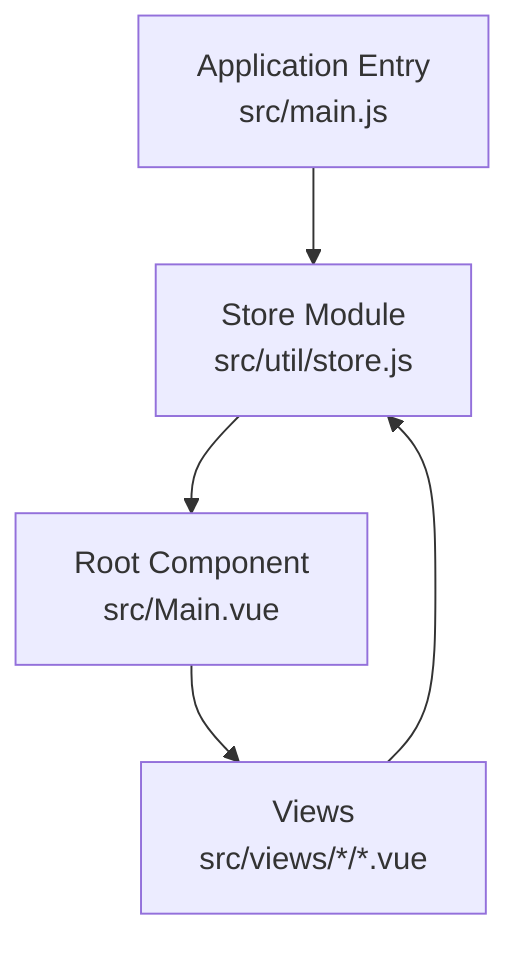

**Diagram sources**
- [main.js](file://src/main.js)
- [store.js](file://src/util/store.js)
- [Main.vue](file://src/Main.vue)

**Section sources**
- [store.js](file://src/util/store.js)
- [main.js](file://src/main.js)
- [Main.vue](file://src/Main.vue)

## Core Components
- Store module: Provides reactive state, actions, getters, and mutations. It is the single source of truth for application-wide data.
- Application bootstrap: Initializes the store and makes it available to the root component and its descendants.
- View components: Read from the store for display and dispatch actions to mutate state.

Key responsibilities:
- Reactive state: Centralized state object that triggers reactivity when updated.
- Actions: Encapsulate asynchronous or synchronous logic that results in state changes.
- Getters: Derived state computed from the store’s state.
- Mutations: Synchronous updates to the state.

How components interact:
- Components subscribe to reactive state fields to update the UI automatically.
- Components call actions to perform side effects and commit mutations.
- Getters are used to compute derived values without duplicating logic.

State persistence:
- The store may persist selected state slices to browser storage to survive reloads.
- Persistence typically loads initial state on startup and saves after mutations.

Error handling:
- Actions should catch errors and update the store with safe fallbacks or error messages.
- UI components can read error flags/messages from the store to inform users.

Debugging:
- Use console logging around key actions/mutations to trace state transitions.
- Inspect the store instance at runtime to verify current state and recent changes.

Lifecycle and memory:
- Initialize only necessary state to reduce memory footprint.
- Clean up subscriptions or timers if the store holds references to DOM or external resources.

**Section sources**
- [store.js](file://src/util/store.js)
- [main.js](file://src/main.js)
- [Main.vue](file://src/Main.vue)

## Architecture Overview
The store acts as a centralized hub. Components read from it and dispatch actions. Getters provide derived data. Mutations ensure predictable state updates. Persistence bridges the store with browser storage.

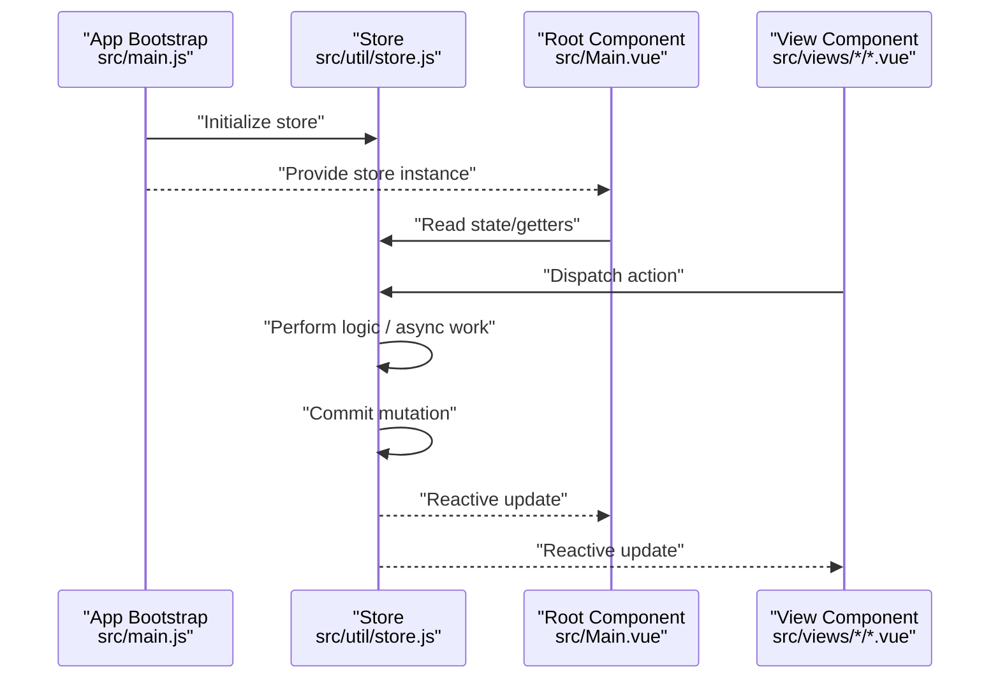

**Diagram sources**
- [main.js](file://src/main.js)
- [store.js](file://src/util/store.js)
- [Main.vue](file://src/Main.vue)

## Detailed Component Analysis

### Store Implementation Patterns
- Reactive state: The store exposes a reactive object whose properties are observed by components. Updates to these properties trigger UI refreshes.
- Data binding: Components bind directly to store properties for one-way data flow; two-way binding is achieved by calling actions that update the store.
- Component synchronization: Because all components share the same store instance, changes propagate consistently across the app.

Actions, getters, and mutations:
- Actions encapsulate business logic and may be asynchronous. They coordinate multiple mutations and side effects.
- Getters compute derived values based on the current state.
- Mutations are synchronous functions that apply direct changes to the state.

Persistence strategy:
- On initialization, the store may load persisted values from browser storage into the default state.
- After relevant mutations, the store persists the changed state back to storage.

Common operations:
- Reading state: Access store properties directly in templates or computed-like bindings.
- Updating state: Dispatch actions that eventually commit mutations.
- Deriving state: Use getters to compute filtered or transformed views of the state.

Error handling:
- Actions wrap potentially failing operations in try/catch blocks and set error-related state fields.
- Components render error messages based on store error flags.

Debugging:
- Log action invocations and mutation commits.
- Inspect the store instance to verify state shape and recent updates.

Lifecycle and memory:
- Avoid storing large objects unnecessarily.
- Clear references to DOM elements or event listeners when they are no longer needed.

**Section sources**
- [store.js](file://src/util/store.js)

### Example: Home View Interaction
The home view reads global configuration and status from the store and provides navigation to other features. It may dispatch actions to initialize or refresh data.

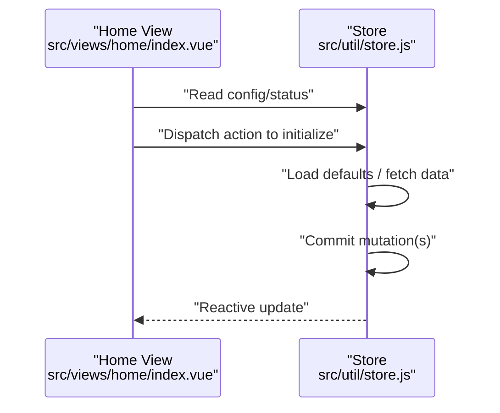

**Diagram sources**
- [index.vue (home)](file://src/views/home/index.vue)
- [store.js](file://src/util/store.js)

**Section sources**
- [index.vue (home)](file://src/views/home/index.vue)
- [store.js](file://src/util/store.js)

### Example: Configuration View
The configuration view allows users to modify settings. Changes are dispatched as actions and committed as mutations, then persisted.

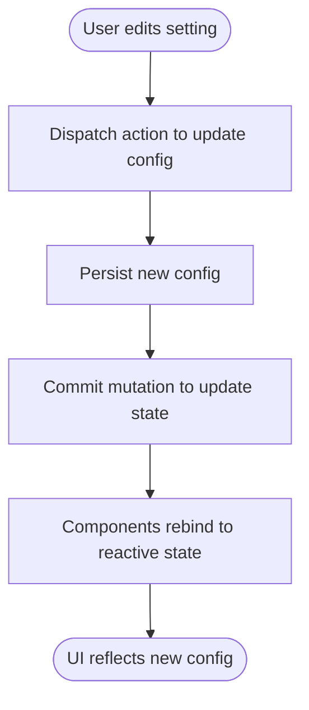

**Diagram sources**
- [index.vue (config)](file://src/views/config/index.vue)
- [store.js](file://src/util/store.js)

**Section sources**
- [index.vue (config)](file://src/views/config/index.vue)
- [store.js](file://src/util/store.js)

### Example: Enroll Flow
The enroll flow uses the store to track enrollment progress and results. Actions orchestrate steps and update state accordingly.

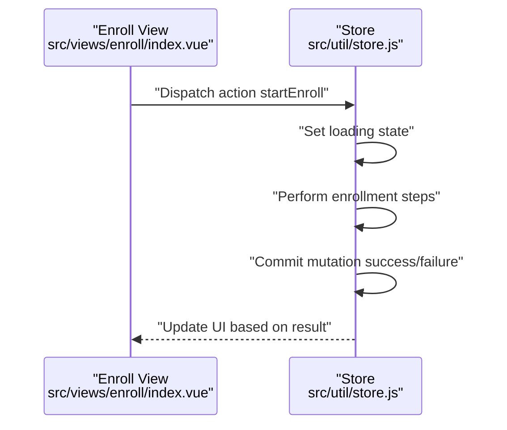

**Diagram sources**
- [index.vue (enroll)](file://src/views/enroll/index.vue)
- [store.js](file://src/util/store.js)

**Section sources**
- [index.vue (enroll)](file://src/views/enroll/index.vue)
- [store.js](file://src/util/store.js)

### Example: Goods Scanning Workflow
Scanning involves capturing input, updating scanned items, and preparing them for submission. The store coordinates item lists and scanning state.

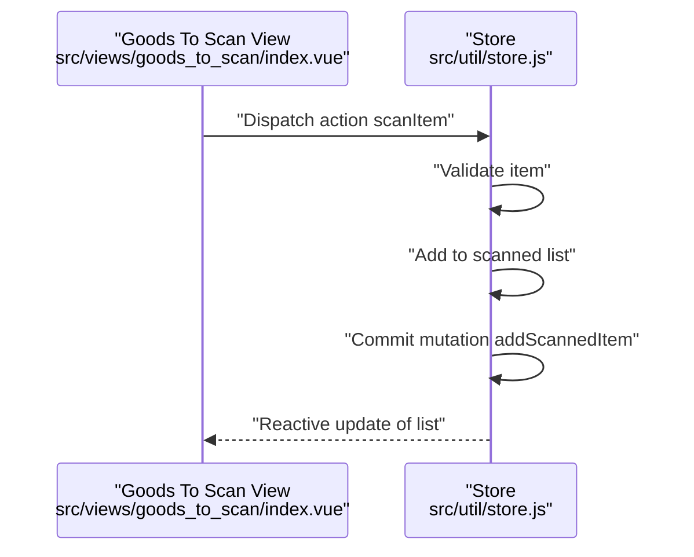

**Diagram sources**
- [index.vue (goods_to_scan)](file://src/views/goods_to_scan/index.vue)
- [store.js](file://src/util/store.js)

**Section sources**
- [index.vue (goods_to_scan)](file://src/views/goods_to_scan/index.vue)
- [store.js](file://src/util/store.js)

### Example: Scanned Goods Review
The review view displays the accumulated scanned goods and allows finalization. It reads derived state via getters and dispatches actions to finalize.

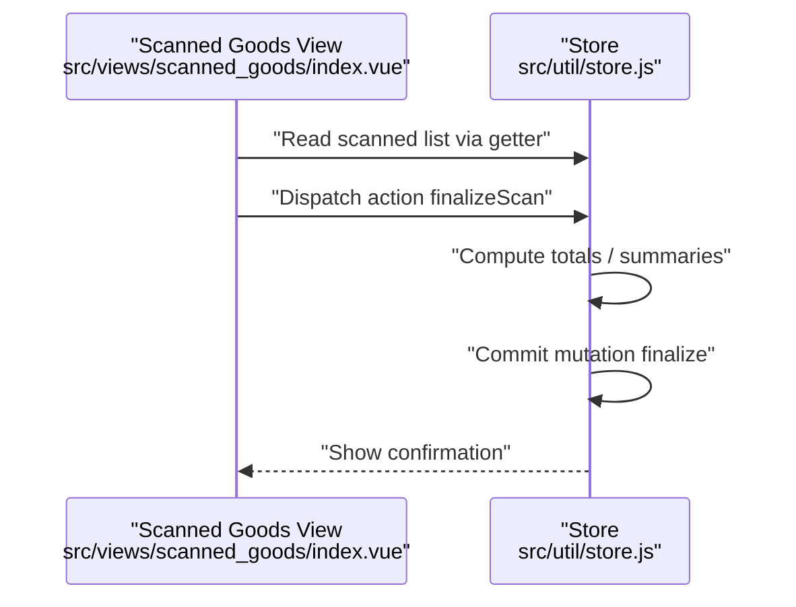

**Diagram sources**
- [index.vue (scanned_goods)](file://src/views/scanned_goods/index.vue)
- [store.js](file://src/util/store.js)

**Section sources**
- [index.vue (scanned_goods)](file://src/views/scanned_goods/index.vue)
- [store.js](file://src/util/store.js)

### Example: Outbox Item Operations
Outbox item operations involve selecting, editing, and submitting items. The store maintains outbox state and handles persistence.

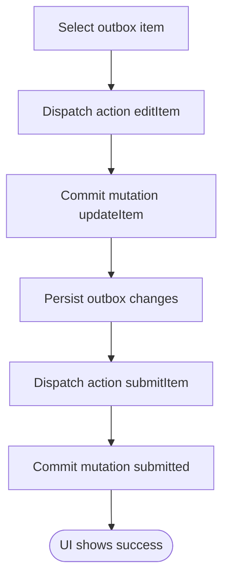

**Diagram sources**
- [index.vue (outbox_item)](file://src/views/outbox_item/index.vue)
- [store.js](file://src/util/store.js)

**Section sources**
- [index.vue (outbox_item)](file://src/views/outbox_item/index.vue)
- [store.js](file://src/util/store.js)

### Example: Purchase Order Items
PO items are managed through the store to keep lists synchronized across views. Actions handle adding, removing, and validating items.

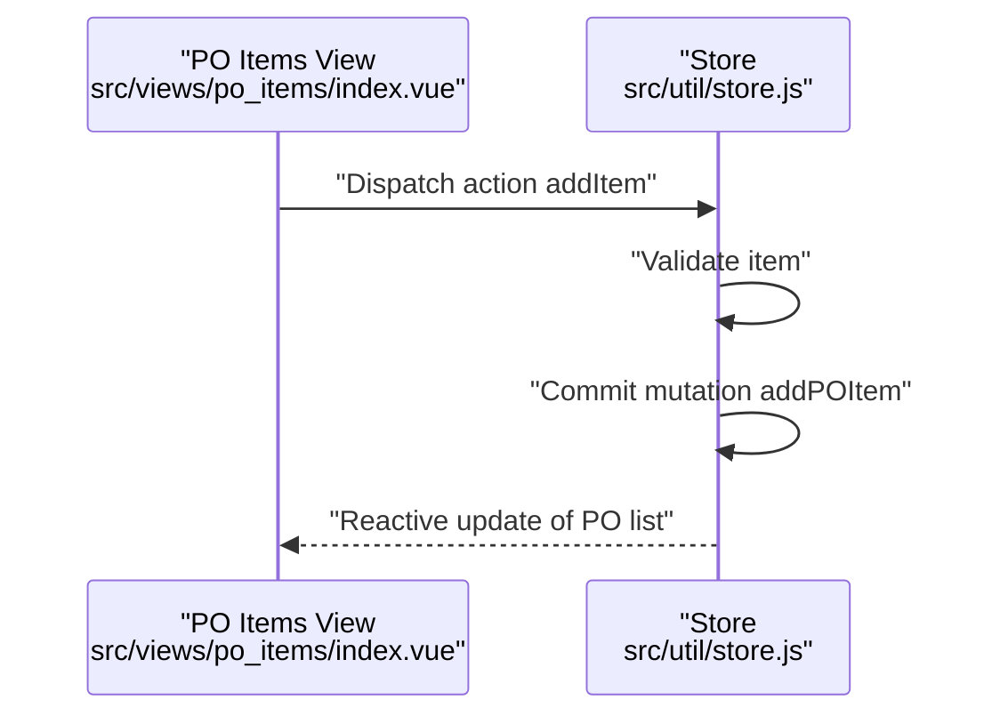

**Diagram sources**
- [index.vue (po_items)](file://src/views/po_items/index.vue)
- [store.js](file://src/util/store.js)

**Section sources**
- [index.vue (po_items)](file://src/views/po_items/index.vue)
- [store.js](file://src/util/store.js)

### Example: Receipt Item Processing
Receipt items are processed similarly to PO items, with validation and persistence handled by the store.

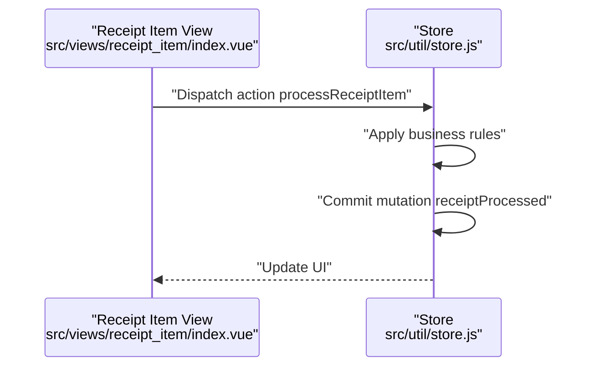

**Diagram sources**
- [index.vue (receipt_item)](file://src/views/receipt_item/index.vue)
- [store.js](file://src/util/store.js)

**Section sources**
- [index.vue (receipt_item)](file://src/views/receipt_item/index.vue)
- [store.js](file://src/util/store.js)

### Example: Register Delivery
Delivery registration involves coordinating multiple pieces of data. The store centralizes delivery state and orchestrates submission.

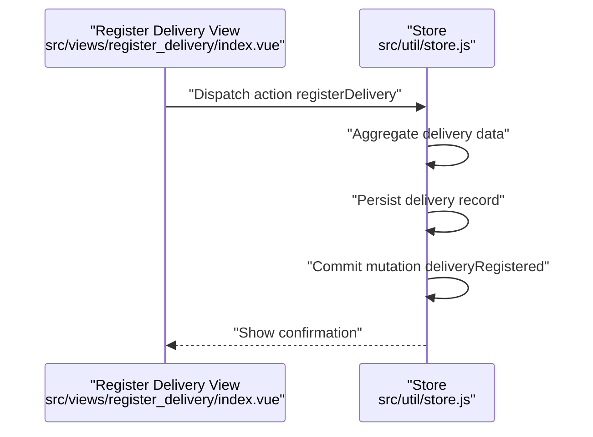

**Diagram sources**
- [index.vue (register_delivery)](file://src/views/register_delivery/index.vue)
- [store.js](file://src/util/store.js)

**Section sources**
- [index.vue (register_delivery)](file://src/util/store.js)

### Example: PIN Entry and Setup
PIN entry and setup flows rely on the store to manage PIN state securely and persist changes.

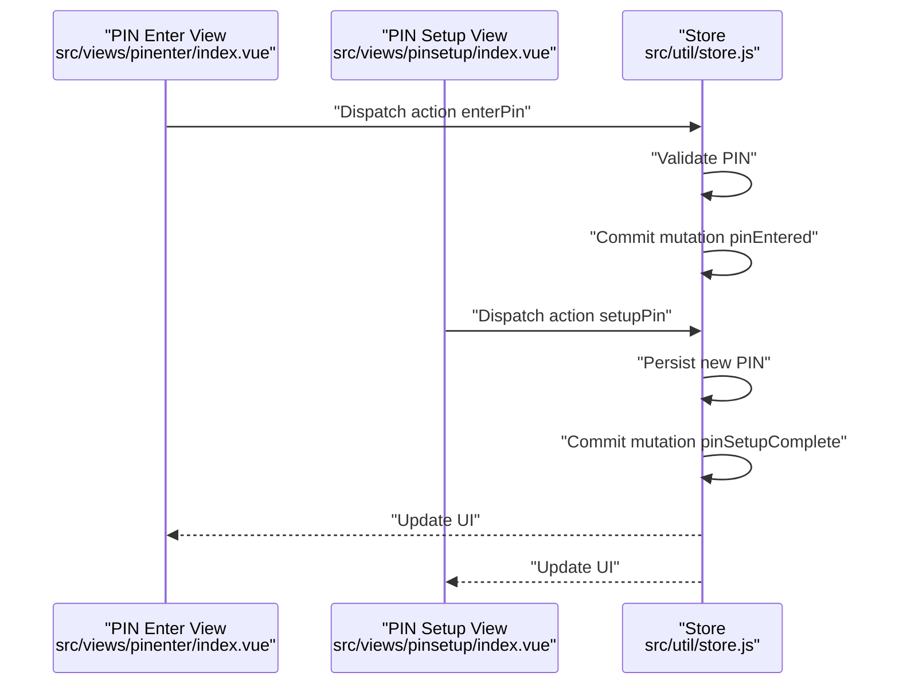

**Diagram sources**
- [index.vue (pinenter)](file://src/views/pinenter/index.vue)
- [index.vue (pinsetup)](file://src/views/pinsetup/index.vue)
- [store.js](file://src/util/store.js)

**Section sources**
- [index.vue (pinenter)](file://src/views/pinenter/index.vue)
- [index.vue (pinsetup)](file://src/views/pinsetup/index.vue)
- [store.js](file://src/util/store.js)

### Conceptual Overview
The store enforces a unidirectional data flow: components dispatch actions, actions perform logic and commit mutations, mutations update reactive state, and components reactively re-render. Getters provide derived data without duplicating computation. Persistence ensures state survives reloads.

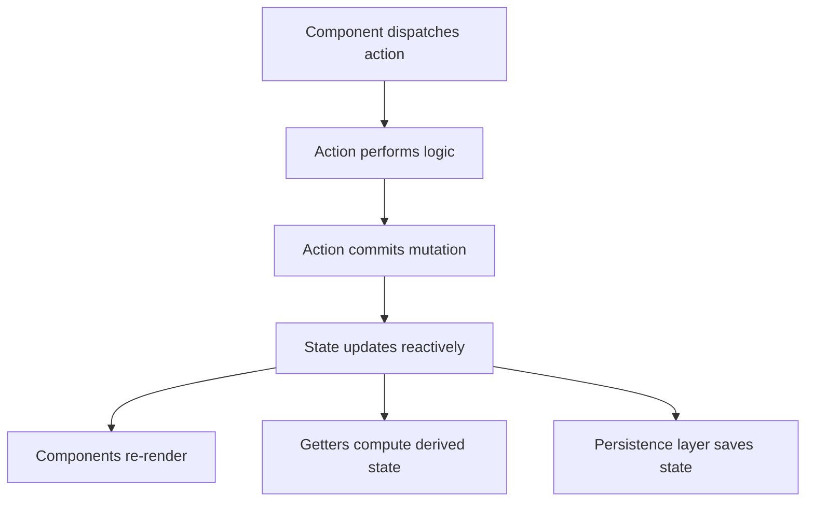

[No sources needed since this diagram shows conceptual workflow, not actual code structure]

## Dependency Analysis
The store is imported and initialized at application bootstrap and consumed by the root component and various views. The dependency graph highlights the central role of the store.

```mermaid
graph TB
MainJS["src/main.js"] --> StoreJS["src/util/store.js"]
MainVue["src/Main.vue"] --> StoreJS
Home["src/views/home/index.vue"] --> StoreJS
Config["src/views/config/index.vue"] --> StoreJS
Enroll["src/views/enroll/index.vue"] --> StoreJS
GoodsToScan["src/views/goods_to_scan/index.vue"] --> StoreJS
ScannedGoods["src/views/scanned_goods/index.vue"] --> StoreJS
OutboxItem["src/views/outbox_item/index.vue"] --> StoreJS
POItems["src/views/po_items/index.vue"] --> StoreJS
ReceiptItem["src/views/receipt_item/index.vue"] --> StoreJS
RegisterDelivery["src/views/register_delivery/index.vue"] --> StoreJS
PinEnter["src/views/pinenter/index.vue"] --> StoreJS
PinSetup["src/views/pinsetup/index.vue"] --> StoreJS
About["src/views/about/index.vue"] --> StoreJS
```

**Diagram sources**
- [main.js](file://src/main.js)
- [store.js](file://src/util/store.js)
- [Main.vue](file://src/Main.vue)
- [index.vue (home)](file://src/views/home/index.vue)
- [index.vue (config)](file://src/views/config/index.vue)
- [index.vue (enroll)](file://src/views/enroll/index.vue)
- [index.vue (goods_to_scan)](file://src/views/goods_to_scan/index.vue)
- [index.vue (scanned_goods)](file://src/views/scanned_goods/index.vue)
- [index.vue (outbox_item)](file://src/views/outbox_item/index.vue)
- [index.vue (po_items)](file://src/views/po_items/index.vue)
- [index.vue (receipt_item)](file://src/views/receipt_item/index.vue)
- [index.vue (register_delivery)](file://src/views/register_delivery/index.vue)
- [index.vue (pinenter)](file://src/views/pinenter/index.vue)
- [index.vue (pinsetup)](file://src/views/pinsetup/index.vue)
- [index.vue (about)](file://src/views/about/index.vue)

**Section sources**
- [main.js](file://src/main.js)
- [store.js](file://src/util/store.js)
- [Main.vue](file://src/Main.vue)

## Performance Considerations
- Keep state minimal: Only include necessary fields to reduce memory usage and reactivity overhead.
- Prefer getters for derived data: Compute once and reuse across components.
- Batch mutations: Group related updates to minimize re-renders.
- Debounce frequent updates: For high-frequency inputs (e.g., scanning), debounce actions before committing mutations.
- Avoid deep reactivity on large objects: Use shallow structures or split state into smaller modules if needed.
- Lazy initialization: Load heavy state only when required by specific views.

[No sources needed since this section provides general guidance]

## Troubleshooting Guide
Common issues and resolutions:
- State not updating in UI: Ensure you are dispatching actions and committing mutations rather than mutating state directly. Verify that components are bound to reactive properties.
- Errors during actions: Wrap asynchronous operations in try/catch within actions and set error flags in state. Render error messages in components based on these flags.
- Persistence failures: Check browser storage availability and permissions. Handle exceptions when reading/writing storage and fall back to default state.
- Memory leaks: Remove references to DOM nodes or external resources from the store. Avoid retaining large arrays indefinitely.

Debugging tips:
- Log action names and payloads when dispatched.
- Log mutation names and resulting state snapshots.
- Inspect the store instance at runtime to confirm expected state shape.

**Section sources**
- [store.js](file://src/util/store.js)

## Conclusion
The ahm-gr-scanner application employs a centralized store pattern with reactive state, actions, getters, and mutations. Components interact with the store to read state and dispatch actions, ensuring consistent UI updates and predictable state transitions. Persistence bridges the store with browser storage, while careful attention to performance, error handling, and memory management keeps the application responsive and robust.