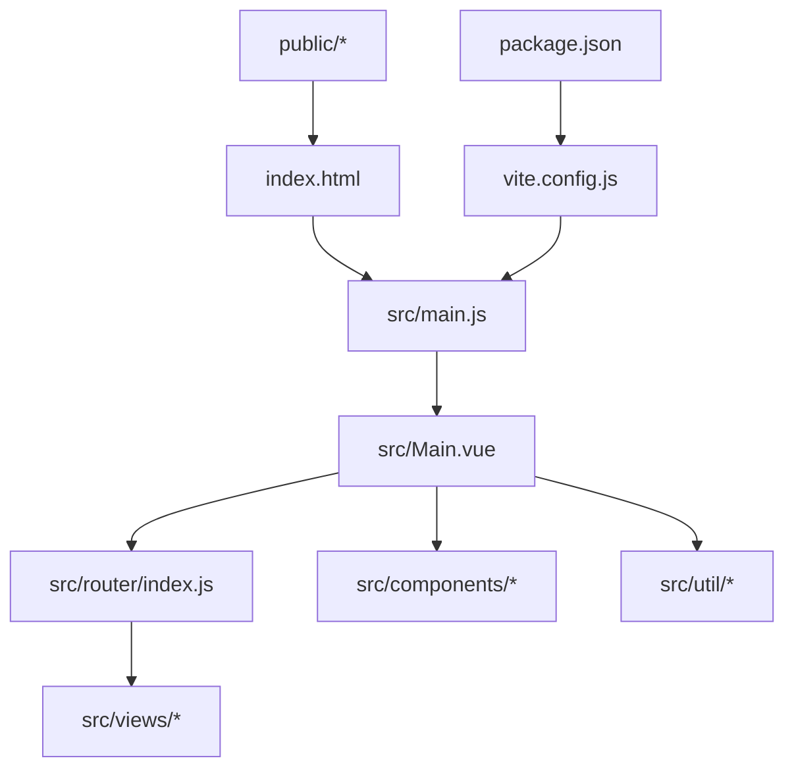
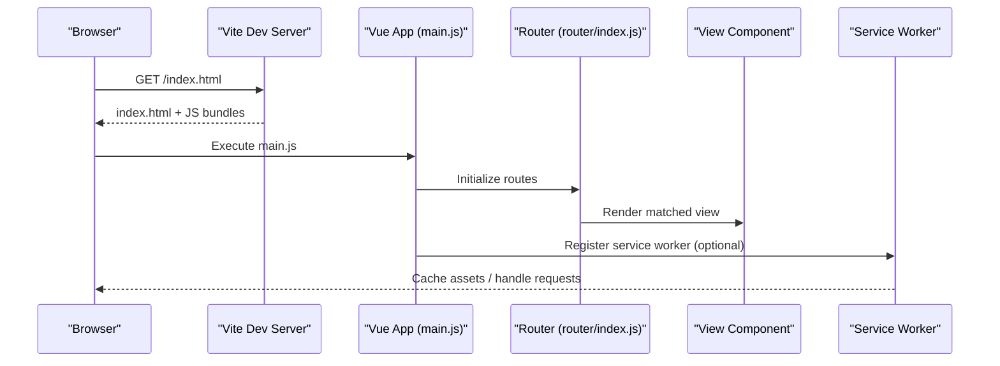
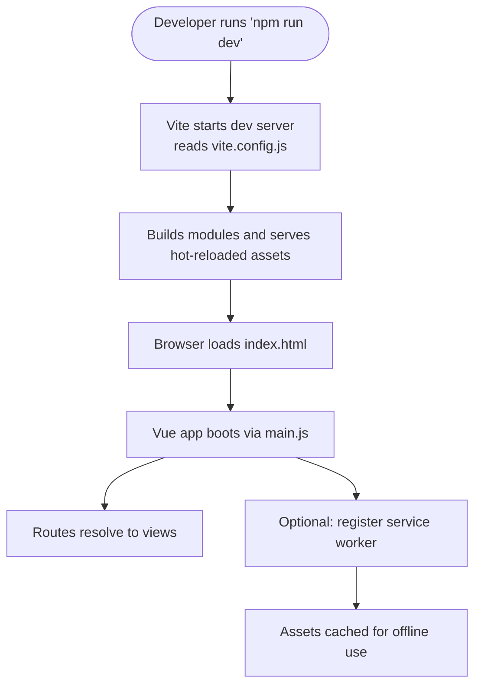
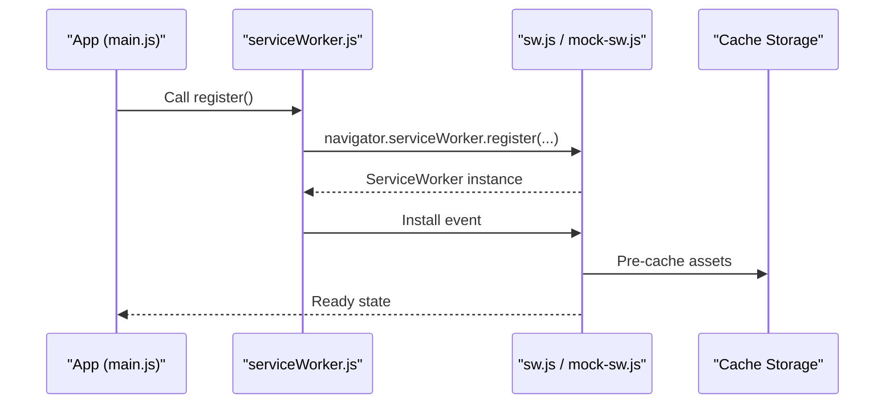
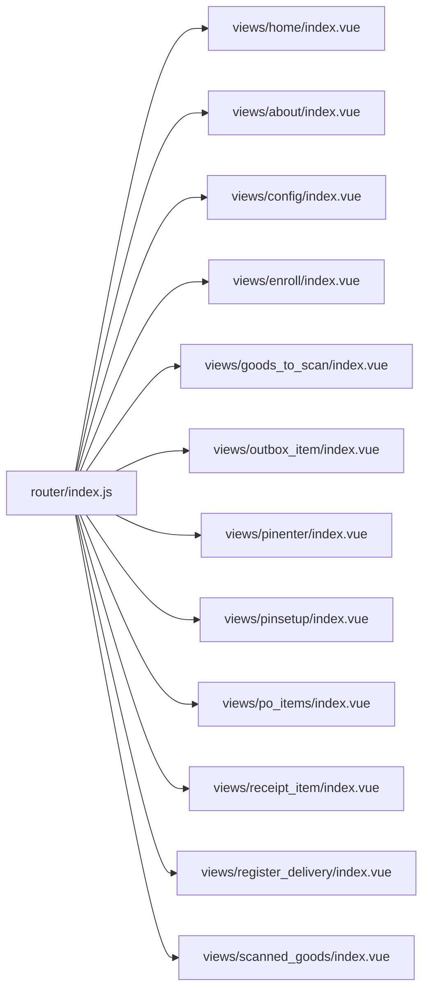
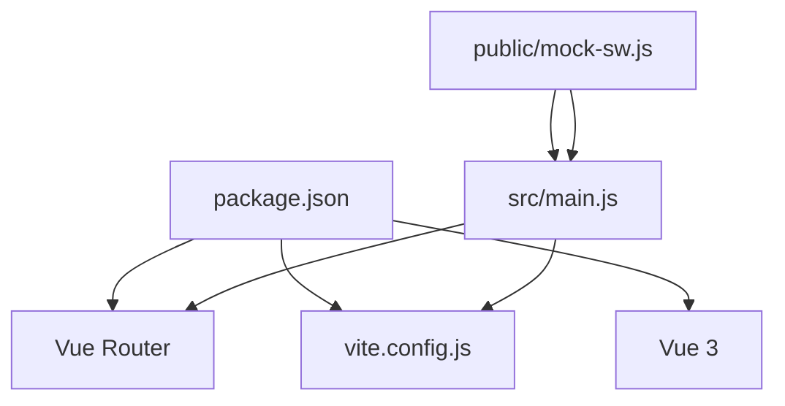

# Development Guide

<cite>
**Referenced Files in This Document**
- [package.json](file://package.json)
- [vite.config.js](file://vite.config.js)
- [index.html](file://index.html)
- [src/main.js](file://src/main.js)
- [src/Main.vue](file://src/Main.vue)
- [src/router/index.js](file://src/router/index.js)
- [scripts/start.sh](file://scripts/start.sh)
- [scripts/watch.sh](file://scripts/watch.sh)
- [scripts/stop.sh](file://scripts/stop.sh)
- [scripts/restart.sh](file://scripts/restart.sh)
- [scripts/chrome.sh](file://scripts/chrome.sh)
- [scripts/push.sh](file://scripts/push.sh)
- [scripts/zip.sh](file://scripts/zip.sh)
- [serve.sh](file://serve.sh)
- [src/util/serviceWorker/serviceWorker.js](file://src/util/serviceWorker/serviceWorker.js)
- [public/sw.js](file://public/sw.js)
- [public/mock-sw.js](file://public/mock-sw.js)
</cite>

## Table of Contents
1. [Introduction](#introduction)
2. [Project Structure](#project-structure)
3. [Core Components](#core-components)
4. [Architecture Overview](#architecture-overview)
5. [Detailed Component Analysis](#detailed-component-analysis)
6. [Dependency Analysis](#dependency-analysis)
7. [Performance Considerations](#performance-considerations)
8. [Troubleshooting Guide](#troubleshooting-guide)
9. [Conclusion](#conclusion)
10. [Appendices](#appendices)

## Introduction
This guide explains how to develop, build, test, and deploy ahm-gr-scanner. It covers the development workflow with Vite, project structure conventions, coding standards, component patterns, testing strategies, debugging techniques, performance profiling, script utilities, environment configuration, and deployment processes. The goal is to help contributors work efficiently and maintain code quality across the project.

## Project Structure
The project follows a modern Vue 3 + Vite setup with a clear separation between application source code, public assets, scripts for automation, and documentation.

- src: Application source code
  - components: Reusable UI components organized by feature
  - views: Page-level components (routes)
  - router: Client-side routing configuration
  - util: Shared utilities and helpers
  - lib: Vendored or local libraries used by the app
  - main.js: Application bootstrap entry point
  - Main.vue: Root component
  - style.css: Global styles
- public: Static assets served as-is (e.g., service workers)
- scripts: Shell utilities for dev server, watching, packaging, and deployment
- docs: Documentation site or static output
- index.html: Primary HTML entry for development builds
- vite.config.js: Vite configuration
- package.json: Dependencies and npm scripts

**Diagram sources**
- [index.html](file://index.html)
- [src/main.js](file://src/main.js)
- [src/Main.vue](file://src/Main.vue)
- [src/router/index.js](file://src/router/index.js)
- [vite.config.js](file://vite.config.js)
- [package.json](file://package.json)

**Section sources**
- [package.json](file://package.json)
- [vite.config.js](file://vite.config.js)
- [index.html](file://index.html)
- [src/main.js](file://src/main.js)
- [src/Main.vue](file://src/Main.vue)
- [src/router/index.js](file://src/router/index.js)

## Core Components
- Entry points
  - index.html: Loads the application bundle during development.
  - src/main.js: Bootstraps the Vue application and mounts it into the DOM.
  - src/Main.vue: Root component that composes top-level layout and navigation.
- Routing
  - src/router/index.js: Defines routes and maps them to view components under src/views.
- Service Workers
  - public/sw.js and public/mock-sw.js: Production and mock service worker files.
  - src/util/serviceWorker/serviceWorker.js: Utility to register/manage service workers from the app.

Key responsibilities:
- Initialization: Load dependencies, configure plugins, mount root component.
- Navigation: Route definitions drive page rendering.
- Offline/PWA: Service workers provide caching and offline capabilities.

**Section sources**
- [index.html](file://index.html)
- [src/main.js](file://src/main.js)
- [src/Main.vue](file://src/Main.vue)
- [src/router/index.js](file://src/router/index.js)
- [public/sw.js](file://public/sw.js)
- [public/mock-sw.js](file://public/mock-sw.js)
- [src/util/serviceWorker/serviceWorker.js](file://src/util/serviceWorker/serviceWorker.js)

## Architecture Overview
The application uses a client-side architecture with Vue 3 and Vite. The browser loads index.html, which includes the Vite dev server or production bundle. The app initializes via main.js, sets up routing, and renders views based on the current route. Service workers can be registered to enable offline features.

**Diagram sources**
- [index.html](file://index.html)
- [src/main.js](file://src/main.js)
- [src/router/index.js](file://src/router/index.js)
- [public/sw.js](file://public/sw.js)
- [src/util/serviceWorker/serviceWorker.js](file://src/util/serviceWorker/serviceWorker.js)

## Detailed Component Analysis

### Build System and Scripts
- Vite Configuration
  - vite.config.js defines the development server, build targets, plugins, and optimization settings.
- NPM Scripts
  - package.json contains commands for starting the dev server, building, previewing, and other tasks.
- Shell Utilities
  - scripts/start.sh, scripts/watch.sh, scripts/stop.sh, scripts/restart.sh automate common workflows.
  - scripts/chrome.sh launches Chrome for quick testing.
  - scripts/push.sh and scripts/zip.sh support packaging and deployment.
  - serve.sh provides an alternative static server option.

Development workflow:
- Start dev server: Use npm script or start.sh.
- Watch mode: Use watch.sh for incremental rebuilds.
- Stop server: Use stop.sh to cleanly terminate processes.
- Restart server: Use restart.sh to reload changes.
- Launch browser: Use chrome.sh to open the app in Chrome.
- Package: Use zip.sh to create distributable archives.
- Deploy: Use push.sh to upload artifacts.

**Diagram sources**
- [package.json](file://package.json)
- [vite.config.js](file://vite.config.js)
- [index.html](file://index.html)
- [src/main.js](file://src/main.js)
- [src/router/index.js](file://src/router/index.js)
- [public/sw.js](file://public/sw.js)
- [src/util/serviceWorker/serviceWorker.js](file://src/util/serviceWorker/serviceWorker.js)

**Section sources**
- [package.json](file://package.json)
- [vite.config.js](file://vite.config.js)
- [scripts/start.sh](file://scripts/start.sh)
- [scripts/watch.sh](file://scripts/watch.sh)
- [scripts/stop.sh](file://scripts/stop.sh)
- [scripts/restart.sh](file://scripts/restart.sh)
- [scripts/chrome.sh](file://scripts/chrome.sh)
- [scripts/push.sh](file://scripts/push.sh)
- [scripts/zip.sh](file://scripts/zip.sh)
- [serve.sh](file://serve.sh)

### Service Worker Integration
- Registration utility
  - src/util/serviceWorker/serviceWorker.js provides functions to register and manage service workers.
- Assets
  - public/sw.js: Production service worker file.
  - public/mock-sw.js: Mock service worker for development/testing.

Typical flow:
- App bootstraps and conditionally registers the service worker.
- Service worker caches critical assets and intercepts network requests.
- During development, mock-sw.js can simulate behavior without full PWA setup.

**Diagram sources**
- [src/util/serviceWorker/serviceWorker.js](file://src/util/serviceWorker/serviceWorker.js)
- [public/sw.js](file://public/sw.js)
- [public/mock-sw.js](file://public/mock-sw.js)
- [src/main.js](file://src/main.js)

**Section sources**
- [src/util/serviceWorker/serviceWorker.js](file://src/util/serviceWorker/serviceWorker.js)
- [public/sw.js](file://public/sw.js)
- [public/mock-sw.js](file://public/mock-sw.js)

### Routing and Views
- Router configuration
  - src/router/index.js defines route paths and maps them to view components.
- Views
  - src/views/* contain page-level components for each route.

Best practices:
- Keep route definitions centralized and descriptive.
- Lazy-load heavy views when possible to reduce initial bundle size.
- Maintain consistent naming conventions for routes and view files.

**Diagram sources**
- [src/router/index.js](file://src/router/index.js)
- [src/views/home/index.vue](file://src/views/home/index.vue)
- [src/views/about/index.vue](file://src/views/about/index.vue)
- [src/views/config/index.vue](file://src/views/config/index.vue)
- [src/views/enroll/index.vue](file://src/views/enroll/index.vue)
- [src/views/goods_to_scan/index.vue](file://src/views/goods_to_scan/index.vue)
- [src/views/outbox_item/index.vue](file://src/views/outbox_item/index.vue)
- [src/views/pinenter/index.vue](file://src/views/pinenter/index.vue)
- [src/views/pinsetup/index.vue](file://src/views/pinsetup/index.vue)
- [src/views/po_items/index.vue](file://src/views/po_items/index.vue)
- [src/views/receipt_item/index.vue](file://src/views/receipt_item/index.vue)
- [src/views/register_delivery/index.vue](file://src/views/register_delivery/index.vue)
- [src/views/scanned_goods/index.vue](file://src/views/scanned_goods/index.vue)

**Section sources**
- [src/router/index.js](file://src/router/index.js)
- [src/views/home/index.vue](file://src/views/home/index.vue)
- [src/views/about/index.vue](file://src/views/about/index.vue)
- [src/views/config/index.vue](file://src/views/config/index.vue)
- [src/views/enroll/index.vue](file://src/views/enroll/index.vue)
- [src/views/goods_to_scan/index.vue](file://src/views/goods_to_scan/index.vue)
- [src/views/outbox_item/index.vue](file://src/views/outbox_item/index.vue)
- [src/views/pinenter/index.vue](file://src/views/pinenter/index.vue)
- [src/views/pinsetup/index.vue](file://src/views/pinsetup/index.vue)
- [src/views/po_items/index.vue](file://src/views/po_items/index.vue)
- [src/views/receipt_item/index.vue](file://src/views/receipt_item/index.vue)
- [src/views/register_delivery/index.vue](file://src/views/register_delivery/index.vue)
- [src/views/scanned_goods/index.vue](file://src/views/scanned_goods/index.vue)

### Components and Utilities
- Components
  - src/components/*: Feature-based folders for reusable UI elements (e.g., dialog, qrcode, pinmobile).
  - Each component folder may include README.md for usage notes and helper modules (e.g., useDialog.js).
- Utilities
  - src/util/*: Shared logic such as store management, keyboard handling, OData helpers, SFC bootstrap, and barcode scanning.

Guidelines:
- Keep components small and focused; prefer composition over monolithic components.
- Place shared logic in util modules and import where needed.
- Document component APIs and props in README files within component folders.

**Section sources**
- [src/components/dialog/CustomDialog.vue](file://src/components/dialog/CustomDialog.vue)
- [src/components/dialog/useDialog.js](file://src/components/dialog/useDialog.js)
- [src/components/qrcode/scanner/index.vue](file://src/components/qrcode/scanner/index.vue)
- [src/components/pinmobile/PinMobile.vue](file://src/components/pinmobile/PinMobile.vue)
- [src/util/store.js](file://src/util/store.js)
- [src/util/keyboard.js](file://src/util/keyboard.js)
- [src/util/odata.js](file://src/util/odata.js)
- [src/util/sfcBootstrap.js](file://src/util/sfcBootstrap.js)
- [src/util/barcodeScanner.js](file://src/util/barcodeScanner.js)

## Dependency Analysis
- Runtime dependencies
  - Vue 3 and Vue Router are core runtime dependencies defined in package.json.
- Build-time tooling
  - Vite is configured in vite.config.js and drives the development server and build pipeline.
- Public assets
  - Service worker files in public/ are served directly and referenced by the app.

**Diagram sources**
- [package.json](file://package.json)
- [vite.config.js](file://vite.config.js)
- [src/main.js](file://src/main.js)
- [public/sw.js](file://public/sw.js)
- [public/mock-sw.js](file://public/mock-sw.js)

**Section sources**
- [package.json](file://package.json)
- [vite.config.js](file://vite.config.js)
- [src/main.js](file://src/main.js)
- [public/sw.js](file://public/sw.js)
- [public/mock-sw.js](file://public/mock-sw.js)

## Performance Considerations
- Code splitting and lazy loading
  - Use dynamic imports for heavy views to reduce initial load time.
- Asset optimization
  - Configure Vite to optimize images and fonts; leverage caching headers in production.
- Service worker caching
  - Strategically cache critical assets and API responses to improve offline performance.
- Bundle analysis
  - Use Vite’s built-in tools or third-party plugins to analyze bundle sizes and identify large dependencies.
- Memory and CPU profiling
  - Use browser developer tools to profile long tasks, memory leaks, and render performance.

[No sources needed since this section provides general guidance]

## Troubleshooting Guide
Common issues and resolutions:
- Dev server not starting
  - Ensure Node.js version matches requirements in package.json.
  - Check port conflicts and adjust Vite config if necessary.
- Hot reload not working
  - Verify Vite middleware and WebSocket connections in browser dev tools.
- Service worker not registering
  - Confirm correct path to sw.js and that it is served from the root.
  - Clear cache and unregister old service workers in browser dev tools.
- Build errors
  - Review console logs for missing dependencies or syntax errors.
  - Run dependency installation again and ensure vite.config.js is valid.

Debugging tips:
- Use browser Network tab to inspect requests and caching behavior.
- Use Console for logging and error tracking.
- Use Performance tab to capture timelines and identify bottlenecks.
- Use Sources tab to set breakpoints in Vue components and utility modules.

**Section sources**
- [vite.config.js](file://vite.config.js)
- [public/sw.js](file://public/sw.js)
- [src/util/serviceWorker/serviceWorker.js](file://src/util/serviceWorker/serviceWorker.js)

## Conclusion
This guide outlines the development workflow, build system, project structure, and best practices for contributing to ahm-gr-scanner. By following these conventions and leveraging Vite’s fast development experience, you can add features efficiently, maintain high code quality, and deliver performant applications.

[No sources needed since this section summarizes without analyzing specific files]

## Appendices

### Development Workflow Checklist
- Install dependencies using npm.
- Start the dev server with npm script or scripts/start.sh.
- Use watch mode for incremental builds when needed.
- Test locally in Chrome using scripts/chrome.sh.
- Stop or restart the server using provided scripts.
- Build for production and review bundle sizes.
- Package artifacts with scripts/zip.sh and deploy via scripts/push.sh.

**Section sources**
- [package.json](file://package.json)
- [scripts/start.sh](file://scripts/start.sh)
- [scripts/watch.sh](file://scripts/watch.sh)
- [scripts/stop.sh](file://scripts/stop.sh)
- [scripts/restart.sh](file://scripts/restart.sh)
- [scripts/chrome.sh](file://scripts/chrome.sh)
- [scripts/zip.sh](file://scripts/zip.sh)
- [scripts/push.sh](file://scripts/push.sh)

### Environment Configuration Guidelines
- Use environment variables for configuration values (API endpoints, feature flags).
- Reference env variables in Vite config and app code consistently.
- Provide defaults for development and override for staging/production.
- Validate required variables at startup and fail fast with clear messages.

[No sources needed since this section provides general guidance]

### Adding New Features
- Create a new view under src/views/<feature>/index.vue.
- Add a route in src/router/index.js mapping to the new view.
- Implement reusable logic in src/util/* and import as needed.
- Write unit tests for critical utilities and integration tests for key flows.
- Update component READMEs and document any new props/events.

**Section sources**
- [src/router/index.js](file://src/router/index.js)
- [src/util/store.js](file://src/util/store.js)
- [src/util/keyboard.js](file://src/util/keyboard.js)
- [src/util/odata.js](file://src/util/odata.js)
- [src/util/sfcBootstrap.js](file://src/util/sfcBootstrap.js)
- [src/util/barcodeScanner.js](file://src/util/barcodeScanner.js)

### Testing Strategies
- Unit tests for utilities and composables (e.g., store, keyboard, odata helpers).
- Component tests for complex UI interactions (e.g., dialog, QR scanner).
- End-to-end tests for critical user journeys (e.g., enrollment, scanning).
- Mock service workers for offline scenarios during tests.

[No sources needed since this section provides general guidance]

### Deployment Processes
- Build production assets using Vite.
- Serve static files via a web server or CDN.
- Ensure service worker files are deployed and accessible at expected paths.
- Configure caching headers and HTTPS for optimal performance and security.

**Section sources**
- [vite.config.js](file://vite.config.js)
- [public/sw.js](file://public/sw.js)
- [serve.sh](file://serve.sh)