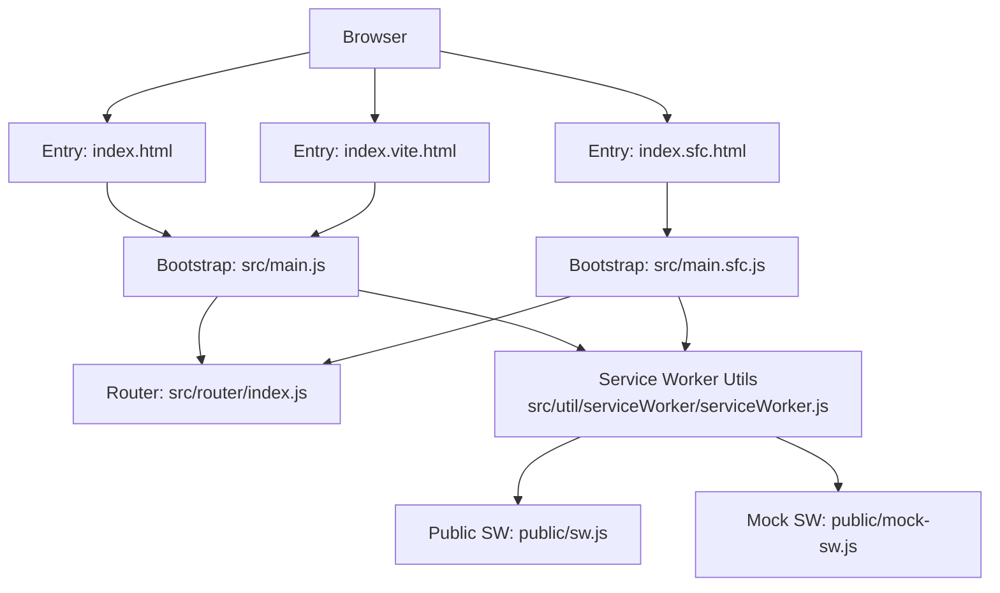
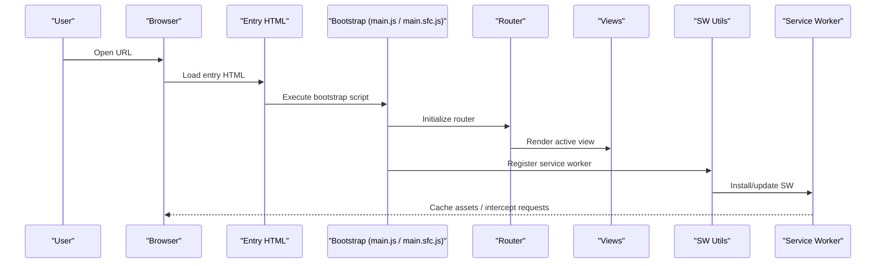
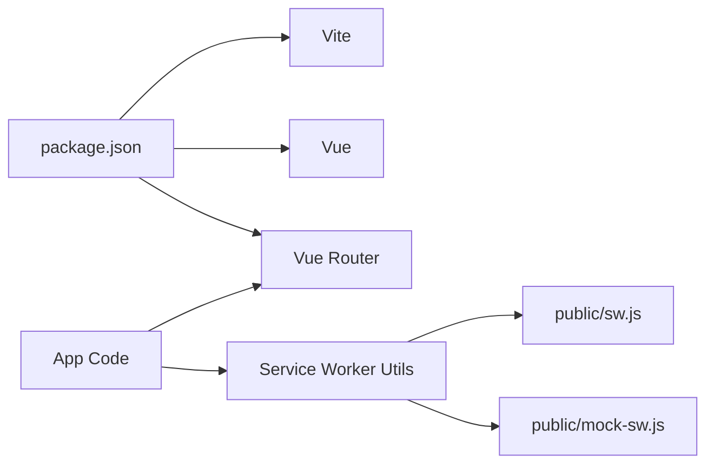

# Getting Started

<cite>
**Referenced Files in This Document**
- [README.md](file://README.md)
- [package.json](file://package.json)
- [vite.config.js](file://vite.config.js)
- [index.html](file://index.html)
- [index.sfc.html](file://index.sfc.html)
- [index.vite.html](file://index.vite.html)
- [src/main.js](file://src/main.js)
- [src/main.sfc.js](file://src/main.sfc.js)
- [src/router/index.js](file://src/router/index.js)
- [src/util/serviceWorker/serviceWorker.js](file://src/util/serviceWorker/serviceWorker.js)
- [public/sw.js](file://public/sw.js)
- [public/mock-sw.js](file://public/mock-sw.js)
- [scripts/start.sh](file://scripts/start.sh)
- [scripts/watch.sh](file://scripts/watch.sh)
- [scripts/restart.sh](file://scripts/restart.sh)
- [scripts/stop.sh](file://scripts/stop.sh)
- [scripts/chrome.sh](file://scripts/chrome.sh)
- [serve.sh](file://serve.sh)
</cite>

## Table of Contents
1. [Introduction](#introduction)
2. [Project Structure](#project-structure)
3. [Core Components](#core-components)
4. [Architecture Overview](#architecture-overview)
5. [Detailed Component Analysis](#detailed-component-analysis)
6. [Dependency Analysis](#dependency-analysis)
7. [Performance Considerations](#performance-considerations)
8. [Troubleshooting Guide](#troubleshooting-guide)
9. [Conclusion](#conclusion)
10. [Appendices](#appendices)

## Introduction
This guide helps you set up and run the AHM GR Scanner project locally. You will learn how to install dependencies, choose an entry point (index.html, index.sfc.html, or index.vite.html), start the development server, build for production, and configure service workers and browser permissions for camera access. The instructions are beginner-friendly and include step-by-step commands and practical examples.

## Project Structure
The project is a Vue-based web application with multiple entry points and a Vite configuration. Key areas:
- Entry points: index.html, index.sfc.html, index.vite.html
- Application bootstrap: src/main.js and src/main.sfc.js
- Routing: src/router/index.js
- Service worker utilities: src/util/serviceWorker/serviceWorker.js and public sw files
- Build tooling: vite.config.js
- Scripts: npm scripts in package.json and shell helpers under scripts/

**Diagram sources**
- [index.html](file://index.html)
- [index.sfc.html](file://index.sfc.html)
- [index.vite.html](file://index.vite.html)
- [src/main.js](file://src/main.js)
- [src/main.sfc.js](file://src/main.sfc.js)
- [src/router/index.js](file://src/router/index.js)
- [src/util/serviceWorker/serviceWorker.js](file://src/util/serviceWorker/serviceWorker.js)
- [public/sw.js](file://public/sw.js)
- [public/mock-sw.js](file://public/mock-sw.js)

**Section sources**
- [README.md](file://README.md)
- [package.json](file://package.json)
- [vite.config.js](file://vite.config.js)
- [index.html](file://index.html)
- [index.sfc.html](file://index.sfc.html)
- [index.vite.html](file://index.vite.html)
- [src/main.js](file://src/main.js)
- [src/main.sfc.js](file://src/main.sfc.js)
- [src/router/index.js](file://src/router/index.js)
- [src/util/serviceWorker/serviceWorker.js](file://src/util/serviceWorker/serviceWorker.js)
- [public/sw.js](file://public/sw.js)
- [public/mock-sw.js](file://public/mock-sw.js)

## Core Components
- Entry points
  - index.html: Standard HTML entry that bootstraps the app via main.js.
  - index.sfc.html: SFC-focused entry that uses main.sfc.js for Single File Component loading.
  - index.vite.html: Vite-oriented entry for development workflows.
- Bootstrappers
  - src/main.js: Initializes the Vue app and routes.
  - src/main.sfc.js: Loads and initializes SFC-based components.
- Router
  - src/router/index.js: Defines navigation between views.
- Service Worker Utilities
  - src/util/serviceWorker/serviceWorker.js: Helpers to register and manage service workers.
  - public/sw.js: Production-ready service worker file.
  - public/mock-sw.js: Mock service worker for offline or testing scenarios.

**Section sources**
- [index.html](file://index.html)
- [index.sfc.html](file://index.sfc.html)
- [index.vite.html](file://index.vite.html)
- [src/main.js](file://src/main.js)
- [src/main.sfc.js](file://src/main.sfc.js)
- [src/router/index.js](file://src/router/index.js)
- [src/util/serviceWorker/serviceWorker.js](file://src/util/serviceWorker/serviceWorker.js)
- [public/sw.js](file://public/sw.js)
- [public/mock-sw.js](file://public/mock-sw.js)

## Architecture Overview
High-level flow from browser to application logic and service workers:

**Diagram sources**
- [index.html](file://index.html)
- [index.sfc.html](file://index.sfc.html)
- [index.vite.html](file://index.vite.html)
- [src/main.js](file://src/main.js)
- [src/main.sfc.js](file://src/main.sfc.js)
- [src/router/index.js](file://src/router/index.js)
- [src/util/serviceWorker/serviceWorker.js](file://src/util/serviceWorker/serviceWorker.js)
- [public/sw.js](file://public/sw.js)

## Detailed Component Analysis

### Installation and Environment Setup
- Prerequisites
  - Node.js: Use a recent LTS version compatible with Vite and Vue. Check your package manager’s Node requirement if specified in the repository.
  - Package manager: npm or yarn.
- Clone and enter the project directory.
- Install dependencies:
  - Using npm: run the install command defined in the project.
  - Using yarn: run the equivalent yarn install command.
- Verify installation by listing available scripts:
  - npm: list scripts
  - yarn: list scripts

What this does:
- Downloads all runtime and dev dependencies declared in the project manifest.
- Prepares the local environment for building and running the app.

**Section sources**
- [package.json](file://package.json)

### Running the Application

#### Development Server
- Start the Vite development server using the provided npm script.
- Alternatively, use the shell helper:
  - Run the start script located under scripts/.
- For hot reloading during development, use the watch script.

Notes:
- The development server serves the selected entry point based on which HTML file you open or which script targets it.
- If you need to restart the server quickly, use the restart script.

**Section sources**
- [package.json](file://package.json)
- [scripts/start.sh](file://scripts/start.sh)
- [scripts/watch.sh](file://scripts/watch.sh)
- [scripts/restart.sh](file://scripts/restart.sh)

#### Production Builds
- Build the app for production using the build script defined in the project manifest.
- After building, serve the generated output using a static file server or your preferred hosting method.

Tip:
- The serve.sh helper can be used to quickly serve the built artifacts locally for preview.

**Section sources**
- [package.json](file://package.json)
- [serve.sh](file://serve.sh)

### Choosing an Entry Point
- index.html
  - Standard entry; boots the app via src/main.js.
- index.sfc.html
  - SFC-focused entry; boots the app via src/main.sfc.js.
- index.vite.html
  - Vite-oriented entry; typically used during development.

How to choose:
- Use index.html for general usage.
- Use index.sfc.html when working with Single File Components directly.
- Use index.vite.html for Vite-specific development flows.

**Section sources**
- [index.html](file://index.html)
- [index.sfc.html](file://index.sfc.html)
- [index.vite.html](file://index.vite.html)
- [src/main.js](file://src/main.js)
- [src/main.sfc.js](file://src/main.sfc.js)

### Available NPM Scripts and Shell Commands
- Common scripts (names may vary depending on package.json):
  - install: Installs dependencies.
  - dev: Starts the development server.
  - build: Creates a production build.
  - preview: Serves the production build locally.
- Shell helpers:
  - start.sh: Starts the dev server.
  - watch.sh: Runs in watch mode for live reload.
  - restart.sh: Restarts the dev server.
  - stop.sh: Stops any running dev server process.
  - chrome.sh: Launches Chrome with flags suitable for local development (e.g., camera permissions).
  - zip.sh: Packages artifacts.

Usage examples:
- npm run dev
- ./scripts/start.sh
- ./scripts/chrome.sh http://localhost:port

**Section sources**
- [package.json](file://package.json)
- [scripts/start.sh](file://scripts/start.sh)
- [scripts/watch.sh](file://scripts/watch.sh)
- [scripts/restart.sh](file://scripts/restart.sh)
- [scripts/stop.sh](file://scripts/stop.sh)
- [scripts/chrome.sh](file://scripts/chrome.sh)
- [scripts/zip.sh](file://scripts/zip.sh)

### First-Run Configuration

#### Service Worker Setup
- The app includes service worker utilities and public SW files.
- During development, ensure the dev server serves the correct SW path.
- In production, verify that public/sw.js is included in the build output and registered by the app.

Steps:
- Confirm registration occurs at app startup through the service worker utilities.
- For testing without a real SW, use the mock service worker (public/mock-sw.js) if supported by your entry point.

**Section sources**
- [src/util/serviceWorker/serviceWorker.js](file://src/util/serviceWorker/serviceWorker.js)
- [public/sw.js](file://public/sw.js)
- [public/mock-sw.js](file://public/mock-sw.js)

#### Browser Permissions for Camera Access
- The scanner requires camera access. Ensure:
  - The site is served over HTTPS or localhost.
  - The browser prompts for camera permission and you allow it.
- If needed, launch Chrome with appropriate flags using the provided script to streamline local testing.

**Section sources**
- [scripts/chrome.sh](file://scripts/chrome.sh)

## Dependency Analysis
The project depends on:
- Vite for development and building.
- Vue and related libraries for UI and routing.
- QR code scanning libraries (bundled under src/lib/html5-qrcode and others).
- Service worker utilities for caching and offline behavior.

**Diagram sources**
- [package.json](file://package.json)
- [src/util/serviceWorker/serviceWorker.js](file://src/util/serviceWorker/serviceWorker.js)
- [public/sw.js](file://public/sw.js)
- [public/mock-sw.js](file://public/mock-sw.js)

**Section sources**
- [package.json](file://package.json)
- [vite.config.js](file://vite.config.js)

## Performance Considerations
- Prefer production builds for deployment to benefit from optimizations.
- Use the development server only for local work due to its interactive features.
- Keep service worker caches minimal and targeted to reduce bandwidth and storage usage.
- Avoid heavy synchronous operations in the main thread to keep the UI responsive.

[No sources needed since this section provides general guidance]

## Troubleshooting Guide
- Dependencies fail to install
  - Ensure Node.js version meets project requirements.
  - Clear the node_modules and reinstall.
- Dev server does not start
  - Check for port conflicts and try stopping existing processes using the stop script.
  - Restart using the restart script.
- Camera not accessible
  - Serve over HTTPS or localhost.
  - Allow camera permissions in the browser prompt.
  - Use the Chrome launcher script to preconfigure flags for local development.
- Service worker issues
  - Verify the SW file paths and registration in the app.
  - Try the mock service worker for offline testing.
- Build errors
  - Reinstall dependencies and rebuild.
  - Review error messages for missing plugins or incompatible versions.

**Section sources**
- [scripts/stop.sh](file://scripts/stop.sh)
- [scripts/restart.sh](file://scripts/restart.sh)
- [scripts/chrome.sh](file://scripts/chrome.sh)
- [src/util/serviceWorker/serviceWorker.js](file://src/util/serviceWorker/serviceWorker.js)
- [public/mock-sw.js](file://public/mock-sw.js)

## Conclusion
You now have the essentials to install, configure, and run the AHM GR Scanner locally. Choose the appropriate entry point for your workflow, leverage the provided npm scripts and shell helpers, and ensure service workers and camera permissions are configured correctly. Refer to the troubleshooting section if you encounter common setup issues.

[No sources needed since this section summarizes without analyzing specific files]

## Appendices

### Quick Start Checklist
- Install Node.js and a package manager.
- Install dependencies.
- Start the development server.
- Open the desired entry page in the browser.
- Allow camera permissions when prompted.
- Optionally, register the service worker for offline support.

[No sources needed since this section provides general guidance]