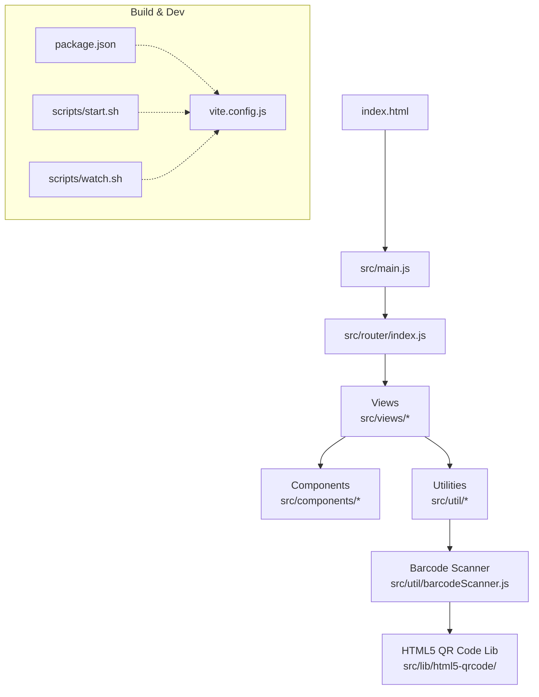
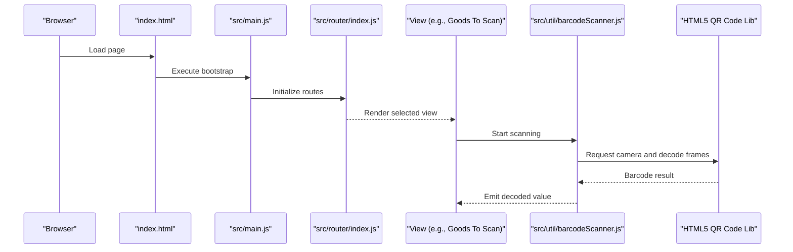
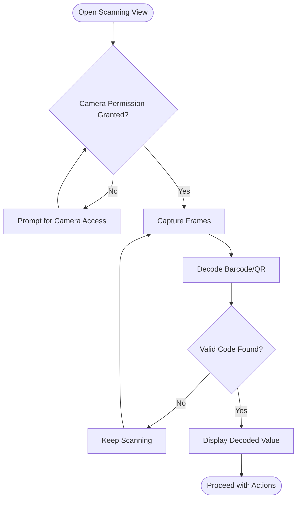
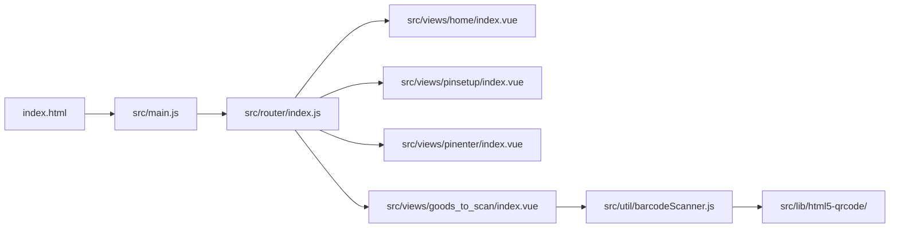
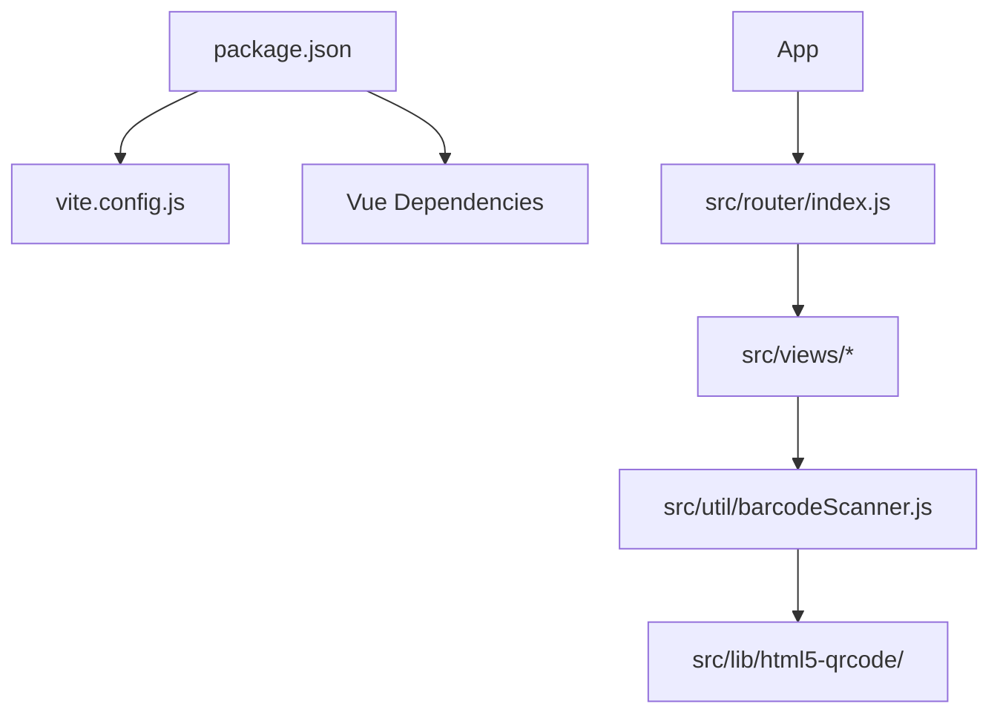

# Getting Started

<cite>
**Referenced Files in This Document**
- [README.md](file://README.md)
- [package.json](file://package.json)
- [vite.config.js](file://vite.config.js)
- [index.html](file://index.html)
- [src/main.js](file://src/main.js)
- [src/router/index.js](file://src/router/index.js)
- [src/views/pinsetup/index.vue](file://src/views/pinsetup/index.vue)
- [src/views/pinenter/index.vue](file://src/views/pinenter/index.vue)
- [src/components/pinmobile/PinMobile.vue](file://src/components/pinmobile/PinMobile.vue)
- [src/views/home/index.vue](file://src/views/home/index.vue)
- [src/views/goods_to_scan/index.vue](file://src/views/goods_to_scan/index.vue)
- [src/util/barcodeScanner.js](file://src/util/barcodeScanner.js)
- [src/lib/html5-qrcode/](file://src/lib/html5-qrcode/)
- [scripts/start.sh](file://scripts/start.sh)
- [scripts/watch.sh](file://scripts/watch.sh)
</cite>

## Table of Contents
1. Introduction
2. Project Structure
3. Core Components
4. Architecture Overview
5. Detailed Component Analysis
6. Dependency Analysis
7. Performance Considerations
8. Troubleshooting Guide
9. Conclusion

## Introduction
This guide helps you set up the development environment and run the ahm-gr-scanner application for the first time. You will install dependencies, start the Vite development server, configure initial settings, create a PIN, and perform your first scan. The instructions are beginner-friendly with clear commands and expected outputs.

## Project Structure
The project is a Vue-based web app built with Vite. Key areas:
- Configuration and build: package.json, vite.config.js
- Entry points: index.html, src/main.js
- Routing: src/router/index.js
- Views (pages): src/views/*
- Reusable UI components: src/components/*
- Utilities and libraries: src/util/*, src/lib/*
- Scripts for convenience: scripts/*

**Diagram sources**
- [index.html](file://index.html)
- [src/main.js](file://src/main.js)
- [src/router/index.js](file://src/router/index.js)
- [src/util/barcodeScanner.js](file://src/util/barcodeScanner.js)
- [src/lib/html5-qrcode/](file://src/lib/html5-qrcode/)
- [package.json](file://package.json)
- [vite.config.js](file://vite.config.js)
- [scripts/start.sh](file://scripts/start.sh)
- [scripts/watch.sh](file://scripts/watch.sh)

**Section sources**
- [README.md](file://README.md)
- [package.json](file://package.json)
- [vite.config.js](file://vite.config.js)
- [index.html](file://index.html)
- [src/main.js](file://src/main.js)
- [src/router/index.js](file://src/router/index.js)

## Core Components
- Application entrypoint initializes the router and mounts the app.
- Router maps URLs to views such as home, pin setup, pin entry, goods scanning, and more.
- Pin setup and entry flows allow creating and entering a PIN before accessing core features.
- Scanning uses a barcode scanner utility backed by an HTML5 QR code library.

Key responsibilities:
- src/main.js: Bootstraps the app and router.
- src/router/index.js: Defines routes for views.
- src/views/pinsetup/index.vue: First-time PIN creation flow.
- src/views/pinenter/index.vue: PIN verification on subsequent visits.
- src/views/home/index.vue: Main dashboard after authentication.
- src/views/goods_to_scan/index.vue: Primary scanning workflow.
- src/util/barcodeScanner.js: Encapsulates camera access and decoding logic.
- src/lib/html5-qrcode/: Underlying scanning library integration.

**Section sources**
- [src/main.js](file://src/main.js)
- [src/router/index.js](file://src/router/index.js)
- [src/views/pinsetup/index.vue](file://src/views/pinsetup/index.vue)
- [src/views/pinenter/index.vue](file://src/views/pinenter/index.vue)
- [src/views/home/index.vue](file://src/views/home/index.vue)
- [src/views/goods_to_scan/index.vue](file://src/views/goods_to_scan/index.vue)
- [src/util/barcodeScanner.js](file://src/util/barcodeScanner.js)
- [src/lib/html5-qrcode/](file://src/lib/html5-qrcode/)

## Architecture Overview
High-level flow from browser to views and scanning:

**Diagram sources**
- [index.html](file://index.html)
- [src/main.js](file://src/main.js)
- [src/router/index.js](file://src/router/index.js)
- [src/views/goods_to_scan/index.vue](file://src/views/goods_to_scan/index.vue)
- [src/util/barcodeScanner.js](file://src/util/barcodeScanner.js)
- [src/lib/html5-qrcode/](file://src/lib/html5-qrcode/)

## Detailed Component Analysis

### Development Environment Setup
- Prerequisites
  - Node.js and npm installed. Verify with:
    - node --version
    - npm --version
- Install dependencies
  - Run: npm install
  - Expected output: installation progress ending with a success message and a lock file update.
- Start the development server
  - Option A: Use the provided script
    - Run: bash scripts/start.sh
  - Option B: Use Vite directly
    - Run: npx vite
  - Expected output: local dev server URL (for example, http://localhost:5173). Open this URL in your browser.
- Hot reload during development
  - Run: bash scripts/watch.sh or use the default Vite watch mode when starting the server.
  - Expected behavior: saving files triggers automatic refresh in the browser.

Notes:
- If you prefer running via npm scripts, check package.json for available scripts and run them with npm run <script>.
- The Vite configuration is defined in vite.config.js; adjust if needed for your environment.

**Section sources**
- [package.json](file://package.json)
- [vite.config.js](file://vite.config.js)
- [scripts/start.sh](file://scripts/start.sh)
- [scripts/watch.sh](file://scripts/watch.sh)

### Initial Configuration
- First launch
  - Open the dev server URL in your browser.
  - If no PIN exists, you will be guided to create one using the PIN setup view.
- Create a PIN
  - Navigate to the PIN setup view (automatically redirected if needed).
  - Follow the prompts to define and confirm your PIN.
  - After successful creation, you can proceed to the main app.
- Enter PIN on subsequent visits
  - On next load, you will be prompted to enter the PIN you created.

Tip:
- Ensure your browser allows camera permissions when you reach the scanning view.

**Section sources**
- [src/views/pinsetup/index.vue](file://src/views/pinsetup/index.vue)
- [src/views/pinenter/index.vue](file://src/views/pinenter/index.vue)
- [src/views/home/index.vue](file://src/views/home/index.vue)

### Basic Scanning Workflow
- Navigate to the scanning view
  - From the home view, select the option to scan goods.
- Grant camera permission
  - When prompted, allow camera access in your browser.
- Start scanning
  - Point your device camera at a barcode or QR code.
  - The scanner will capture and decode the code automatically.
- Review results
  - Decoded values appear in the scanning interface for further actions.

**Diagram sources**
- [src/views/goods_to_scan/index.vue](file://src/views/goods_to_scan/index.vue)
- [src/util/barcodeScanner.js](file://src/util/barcodeScanner.js)
- [src/lib/html5-qrcode/](file://src/lib/html5-qrcode/)

**Section sources**
- [src/views/goods_to_scan/index.vue](file://src/views/goods_to_scan/index.vue)
- [src/util/barcodeScanner.js](file://src/util/barcodeScanner.js)
- [src/lib/html5-qrcode/](file://src/lib/html5-qrcode/)

### Navigating the Codebase
- Entry point
  - index.html loads the application bundle.
  - src/main.js initializes the app and router.
- Routing
  - src/router/index.js defines routes that map to views under src/views/.
- Views
  - Each feature is a folder under src/views/ containing its own index.vue.
- Components
  - Reusable UI elements live under src/components/. For example, PIN input components and dialog utilities.
- Utilities
  - Shared logic resides in src/util/, including the barcode scanner and store helpers.
- Libraries
  - Third-party or vendored libraries are placed under src/lib/.

**Diagram sources**
- [index.html](file://index.html)
- [src/main.js](file://src/main.js)
- [src/router/index.js](file://src/router/index.js)
- [src/views/home/index.vue](file://src/views/home/index.vue)
- [src/views/pinsetup/index.vue](file://src/views/pinsetup/index.vue)
- [src/views/pinenter/index.vue](file://src/views/pinenter/index.vue)
- [src/views/goods_to_scan/index.vue](file://src/views/goods_to_scan/index.vue)
- [src/util/barcodeScanner.js](file://src/util/barcodeScanner.js)
- [src/lib/html5-qrcode/](file://src/lib/html5-qrcode/)

**Section sources**
- [index.html](file://index.html)
- [src/main.js](file://src/main.js)
- [src/router/index.js](file://src/router/index.js)
- [src/views/home/index.vue](file://src/views/home/index.vue)
- [src/views/pinsetup/index.vue](file://src/views/pinsetup/index.vue)
- [src/views/pinenter/index.vue](file://src/views/pinenter/index.vue)
- [src/views/goods_to_scan/index.vue](file://src/views/goods_to_scan/index.vue)
- [src/util/barcodeScanner.js](file://src/util/barcodeScanner.js)
- [src/lib/html5-qrcode/](file://src/lib/html5-qrcode/)

## Dependency Analysis
- Build tooling
  - Vite is used for development and building. Configuration is in vite.config.js.
- Runtime dependencies
  - Vue and related packages are declared in package.json.
- Scanning stack
  - Barcode scanning relies on src/util/barcodeScanner.js and the HTML5 QR code library under src/lib/html5-qrcode/.

**Diagram sources**
- [package.json](file://package.json)
- [vite.config.js](file://vite.config.js)
- [src/router/index.js](file://src/router/index.js)
- [src/util/barcodeScanner.js](file://src/util/barcodeScanner.js)
- [src/lib/html5-qrcode/](file://src/lib/html5-qrcode/)

**Section sources**
- [package.json](file://package.json)
- [vite.config.js](file://vite.config.js)
- [src/router/index.js](file://src/router/index.js)
- [src/util/barcodeScanner.js](file://src/util/barcodeScanner.js)
- [src/lib/html5-qrcode/](file://src/lib/html5-qrcode/)

## Performance Considerations
- Keep the dev server running with hot module replacement enabled for fast feedback loops.
- Avoid heavy synchronous operations in the scanning loop; offload processing where possible.
- Limit concurrent camera streams to a single active stream to reduce resource usage.
- Prefer lazy loading of non-critical views to improve initial load time.

[No sources needed since this section provides general guidance]

## Troubleshooting Guide
- Cannot find Node.js or npm
  - Install Node.js LTS from the official site and verify versions with node --version and npm --version.
- npm install fails
  - Clear cache and reinstall:
    - npm cache clean --force
    - rm -rf node_modules package-lock.json
    - npm install
  - Check for proxy or registry issues if behind corporate networks.
- Dev server does not start
  - Ensure port availability (default Vite port). If occupied, change the port in vite.config.js or stop the process using it.
  - Try running directly with npx vite to see detailed errors.
- Camera permission denied
  - Allow camera access when prompted. If blocked, open browser settings and enable camera permissions for localhost or your dev URL.
  - Some browsers require HTTPS for camera access. For local development, ensure you are using http://localhost or https://localhost depending on your setup.
- Scanning does not detect codes
  - Improve lighting and focus; hold the code steady.
  - Ensure the code type is supported by the underlying library.
  - Restart the scanning component if the stream becomes unresponsive.
- PIN setup issues
  - Clear local storage if stuck in a bad state and reload the page to retry setup.
  - Confirm that the PIN meets any required length/format constraints shown in the UI.

**Section sources**
- [vite.config.js](file://vite.config.js)
- [src/views/pinsetup/index.vue](file://src/views/pinsetup/index.vue)
- [src/views/pinenter/index.vue](file://src/views/pinenter/index.vue)
- [src/util/barcodeScanner.js](file://src/util/barcodeScanner.js)

## Conclusion
You now have the essentials to set up, run, and explore the ahm-gr-scanner application. Start the dev server, create your PIN, and try scanning. Refer to the troubleshooting section if you encounter common issues. As you become comfortable, dive into the codebase structure and extend features as needed.