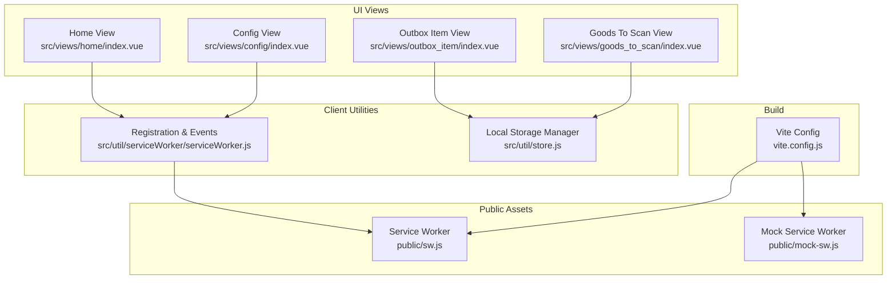
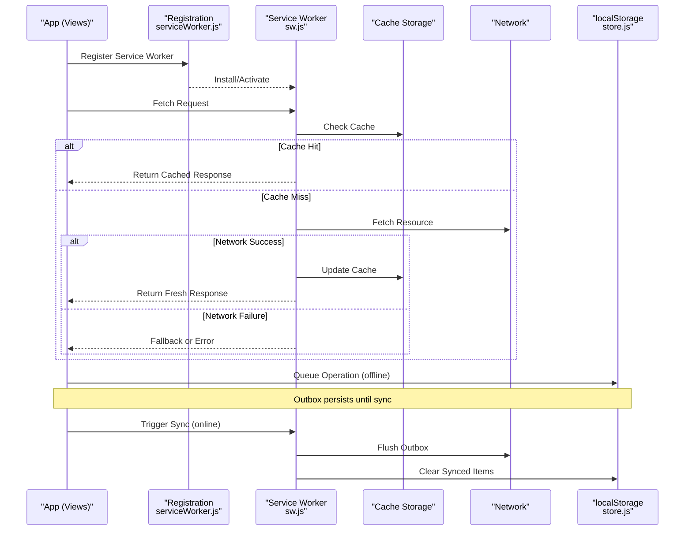
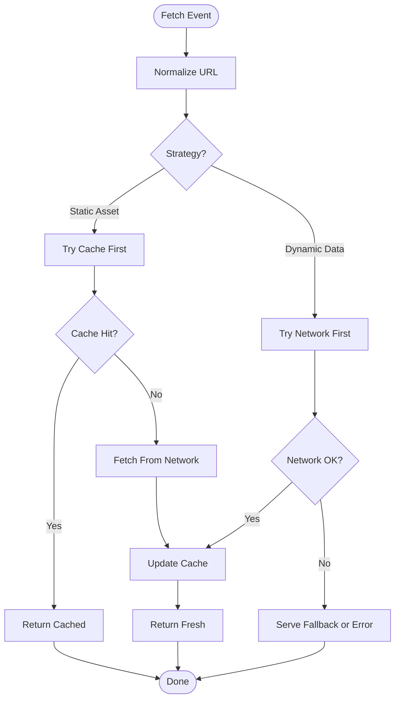
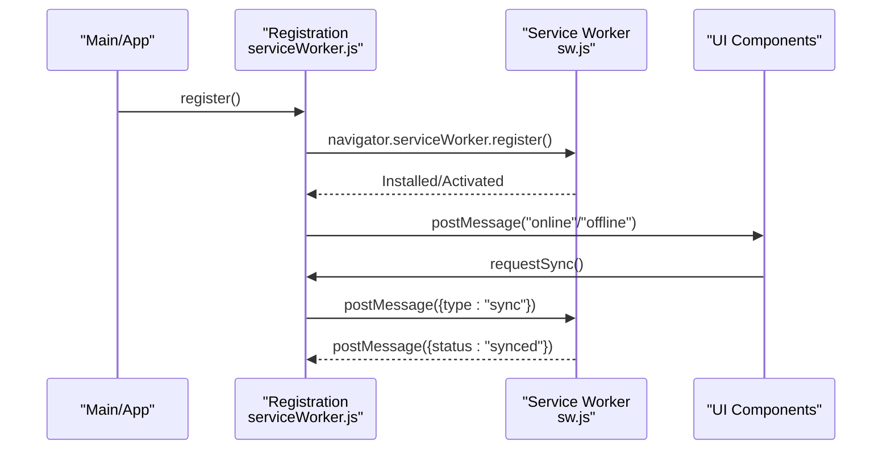
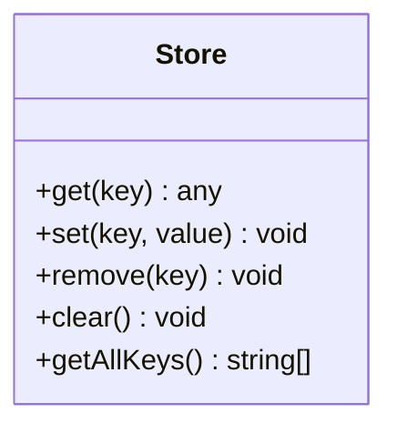
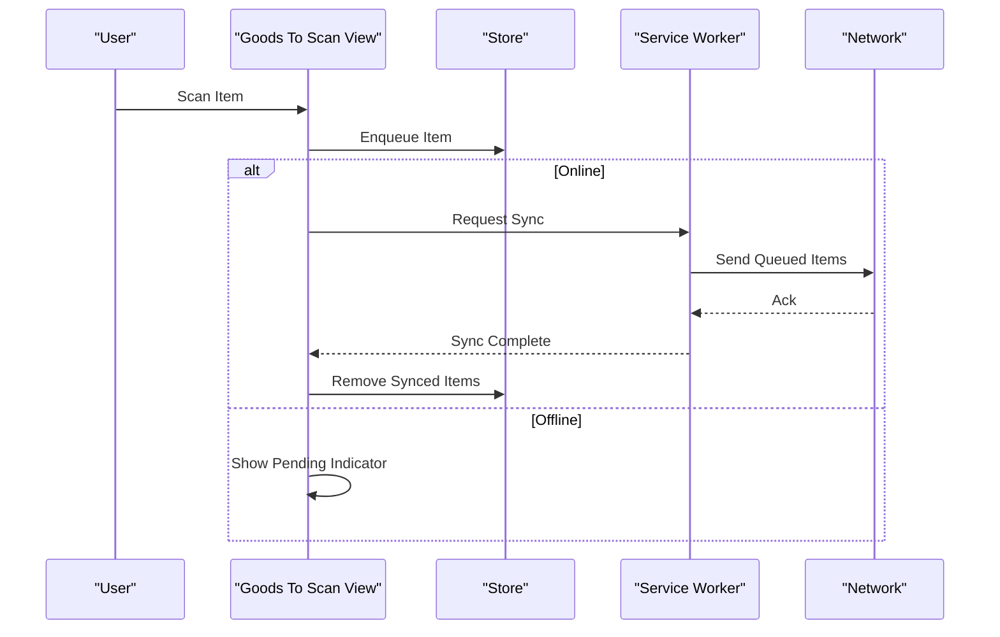
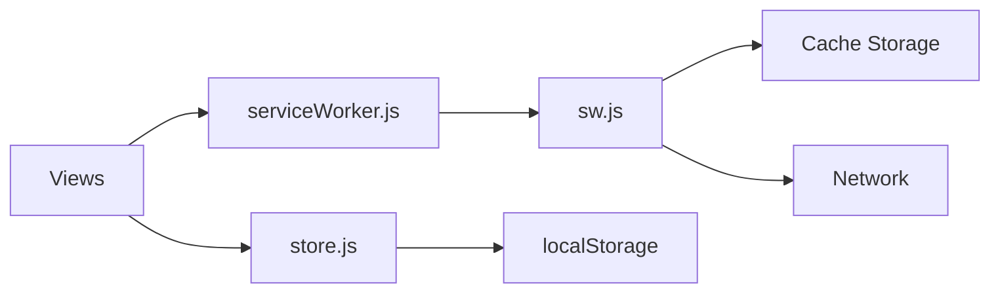

# Offline Capabilities

<cite>
**Referenced Files in This Document**
- [public/sw.js](file://public/sw.js)
- [public/mock-sw.js](file://public/mock-sw.js)
- [src/util/serviceWorker/serviceWorker.js](file://src/util/serviceWorker/serviceWorker.js)
- [src/util/serviceWorker/README.md](file://src/util/serviceWorker/README.md)
- [src/util/store.js](file://src/util/store.js)
- [src/views/config/index.vue](file://src/views/config/index.vue)
- [src/views/home/index.vue](file://src/views/home/index.vue)
- [src/views/outbox_item/index.vue](file://src/views/outbox_item/index.vue)
- [src/views/goods_to_scan/index.vue](file://src/views/goods_to_scan/index.vue)
- [src/router/index.js](file://src/router/index.js)
- [vite.config.js](file://vite.config.js)
</cite>

## Table of Contents
1. [Introduction](#introduction)
2. [Project Structure](#project-structure)
3. [Core Components](#core-components)
4. [Architecture Overview](#architecture-overview)
5. [Detailed Component Analysis](#detailed-component-analysis)
6. [Dependency Analysis](#dependency-analysis)
7. [Performance Considerations](#performance-considerations)
8. [Troubleshooting Guide](#troubleshooting-guide)
9. [Conclusion](#conclusion)
10. [Appendices](#appendices)

## Introduction
This document explains the offline capabilities implemented in ahm-gr-scanner, focusing on the Service Worker architecture, caching strategies, background synchronization, offline data persistence, cache invalidation policies, and data synchronization when connectivity is restored. It also covers configuration options for different caching behaviors, debugging techniques for offline scenarios, testing strategies, performance optimization, storage limits, fallback mechanisms, and examples of implementing offline-first features with graceful network failure handling.

## Project Structure
The offline functionality spans several areas:
- Service Worker files under public/
- Client-side registration and utilities under src/util/serviceWorker/
- Local storage management under src/util/store.js
- UI components that interact with offline state and outbox queues
- Build-time configuration to include assets for caching

**Diagram sources**
- [public/sw.js](file://public/sw.js)
- [public/mock-sw.js](file://public/mock-sw.js)
- [src/util/serviceWorker/serviceWorker.js](file://src/util/serviceWorker/serviceWorker.js)
- [src/util/store.js](file://src/util/store.js)
- [src/views/home/index.vue](file://src/views/home/index.vue)
- [src/views/config/index.vue](file://src/views/config/index.vue)
- [src/views/outbox_item/index.vue](file://src/views/outbox_item/index.vue)
- [src/views/goods_to_scan/index.vue](file://src/views/goods_to_scan/index.vue)
- [vite.config.js](file://vite.config.js)

**Section sources**
- [public/sw.js](file://public/sw.js)
- [public/mock-sw.js](file://public/mock-sw.js)
- [src/util/serviceWorker/serviceWorker.js](file://src/util/serviceWorker/serviceWorker.js)
- [src/util/store.js](file://src/util/store.js)
- [src/views/home/index.vue](file://src/views/home/index.vue)
- [src/views/config/index.vue](file://src/views/config/index.vue)
- [src/views/outbox_item/index.vue](file://src/views/outbox_item/index.vue)
- [src/views/goods_to_scan/index.vue](file://src/views/goods_to_scan/index.vue)
- [vite.config.js](file://vite.config.js)

## Core Components
- Service Worker (public/sw.js): Intercepts fetch events, applies caching strategies, serves cached responses when offline, and manages cache lifecycle.
- Registration and Event Bridge (src/util/serviceWorker/serviceWorker.js): Registers the Service Worker, listens for online/offline events, and posts messages to the worker for actions like cache updates or sync triggers.
- Local Storage Manager (src/util/store.js): Provides a simple key-value store backed by localStorage for persisting queued operations and app state while offline.
- UI Integration:
  - Config view exposes toggles for caching behavior and sync settings.
  - Home view shows connectivity status and allows manual refresh/sync.
  - Outbox item view displays pending items waiting for sync.
  - Goods to scan view demonstrates offline-first scanning and queuing.

**Section sources**
- [public/sw.js](file://public/sw.js)
- [src/util/serviceWorker/serviceWorker.js](file://src/util/serviceWorker/serviceWorker.js)
- [src/util/store.js](file://src/util/store.js)
- [src/views/config/index.vue](file://src/views/config/index.vue)
- [src/views/home/index.vue](file://src/views/home/index.vue)
- [src/views/outbox_item/index.vue](file://src/views/outbox_item/index.vue)
- [src/views/goods_to_scan/index.vue](file://src/views/goods_to_scan/index.vue)

## Architecture Overview
The offline architecture follows an offline-first pattern:
- The client registers a Service Worker during app initialization.
- Fetch requests are intercepted by the Service Worker, which decides whether to serve from cache or fetch from the network based on configured strategies.
- When offline, critical resources and previously fetched data are served from caches; user actions can be queued locally and synchronized later.
- Background Sync (if available) or periodic polling attempts to flush the outbox when connectivity is restored.

**Diagram sources**
- [src/util/serviceWorker/serviceWorker.js](file://src/util/serviceWorker/serviceWorker.js)
- [public/sw.js](file://public/sw.js)
- [src/util/store.js](file://src/util/store.js)

## Detailed Component Analysis

### Service Worker (public/sw.js)
Responsibilities:
- Intercept fetch events and apply caching strategies per resource type.
- Implement cache-first for static assets and network-first for dynamic data.
- Provide fallbacks for missing resources.
- Handle push and background sync events if supported.

Key behaviors:
- Cache keys are normalized to avoid duplication.
- Stale-while-revalidate patterns may be used for frequently accessed data.
- Cache versioning ensures safe invalidation on updates.

**Diagram sources**
- [public/sw.js](file://public/sw.js)

**Section sources**
- [public/sw.js](file://public/sw.js)

### Registration and Event Bridge (src/util/serviceWorker/serviceWorker.js)
Responsibilities:
- Register the Service Worker at app startup.
- Listen for online/offline events and update UI state.
- Post messages to the Service Worker to trigger cache updates or sync.
- Manage feature detection for background sync and notifications.

Integration points:
- Called from main entry points and views that need to react to connectivity changes.
- Exposes methods to enqueue operations and request sync.

**Diagram sources**
- [src/util/serviceWorker/serviceWorker.js](file://src/util/serviceWorker/serviceWorker.js)
- [public/sw.js](file://public/sw.js)

**Section sources**
- [src/util/serviceWorker/serviceWorker.js](file://src/util/serviceWorker/serviceWorker.js)

### Local Storage Manager (src/util/store.js)
Responsibilities:
- Provide a simple API to get/set/remove values in localStorage.
- Support arrays and objects for queueing operations.
- Offer utility functions to clear or migrate stored data.

Usage patterns:
- Persist outbox items when network is unavailable.
- Maintain last-known-good state for quick resume.

**Diagram sources**
- [src/util/store.js](file://src/util/store.js)

**Section sources**
- [src/util/store.js](file://src/util/store.js)

### UI Integration and Offline-First Patterns
- Config view:
  - Allows enabling/disabling specific caching strategies and controlling sync frequency.
  - Persists preferences to local storage.
- Home view:
  - Displays connectivity status and provides manual refresh/sync controls.
- Outbox item view:
  - Lists pending operations and their statuses.
  - Supports retry and delete actions.
- Goods to scan view:
  - Demonstrates offline-first scanning by queuing results locally and syncing when possible.

**Diagram sources**
- [src/views/goods_to_scan/index.vue](file://src/views/goods_to_scan/index.vue)
- [src/util/store.js](file://src/util/store.js)
- [src/util/serviceWorker/serviceWorker.js](file://src/util/serviceWorker/serviceWorker.js)
- [public/sw.js](file://public/sw.js)

**Section sources**
- [src/views/config/index.vue](file://src/views/config/index.vue)
- [src/views/home/index.vue](file://src/views/home/index.vue)
- [src/views/outbox_item/index.vue](file://src/views/outbox_item/index.vue)
- [src/views/goods_to_scan/index.vue](file://src/views/goods_to_scan/index.vue)

### Configuration Options
- Caching strategies:
  - Static assets: cache-first with versioned cache names.
  - Dynamic data: network-first with cache fallback.
- Sync behavior:
  - Immediate sync when online.
  - Periodic background sync if supported.
- Feature flags:
  - Enable/disable background sync.
  - Toggle aggressive caching for low-bandwidth environments.

Configuration is typically managed via:
- Runtime toggles exposed in the config view.
- Build-time constants in vite.config.js for default behaviors.

**Section sources**
- [src/views/config/index.vue](file://src/views/config/index.vue)
- [vite.config.js](file://vite.config.js)

## Dependency Analysis
The offline system has clear boundaries:
- Service Worker depends on browser APIs (CacheStorage, Fetch, Background Sync).
- Client utilities depend on the Service Worker message channel and localStorage.
- Views depend on both utilities and store for UI state and persistence.

**Diagram sources**
- [src/util/serviceWorker/serviceWorker.js](file://src/util/serviceWorker/serviceWorker.js)
- [src/util/store.js](file://src/util/store.js)
- [public/sw.js](file://public/sw.js)

**Section sources**
- [src/util/serviceWorker/serviceWorker.js](file://src/util/serviceWorker/serviceWorker.js)
- [src/util/store.js](file://src/util/store.js)
- [public/sw.js](file://public/sw.js)

## Performance Considerations
- Cache size management:
  - Limit number of entries per cache.
  - Evict least recently used or oldest entries when approaching storage quotas.
- Request coalescing:
  - Avoid duplicate network calls by deduplicating in-flight requests.
- Lazy loading:
  - Defer non-critical asset caching until after initial render.
- Compression:
  - Ensure server responses are compressed to reduce payload sizes.
- Background sync throttling:
  - Batch outbox items to minimize network overhead.

[No sources needed since this section provides general guidance]

## Troubleshooting Guide
Common issues and diagnostics:
- Service Worker not registering:
  - Verify correct path and MIME type.
  - Check console for registration errors.
- Cache not updating:
  - Inspect cache storage in DevTools.
  - Validate cache key normalization and versioning.
- Sync not triggering:
  - Confirm background sync support and permissions.
  - Use mock service worker to simulate network conditions.
- Storage quota exceeded:
  - Monitor usage and implement eviction policies.
  - Clear outdated caches programmatically.

Debugging techniques:
- Use the built-in mock Service Worker to simulate offline/online states.
- Log messages between client and worker using postMessage.
- Inspect localStorage contents for outbox integrity.

**Section sources**
- [public/mock-sw.js](file://public/mock-sw.js)
- [src/util/serviceWorker/serviceWorker.js](file://src/util/serviceWorker/serviceWorker.js)
- [src/util/store.js](file://src/util/store.js)

## Conclusion
The offline implementation in ahm-gr-scanner combines a robust Service Worker strategy with local persistence and UI-driven controls to deliver a resilient offline-first experience. By carefully managing caches, synchronizing outbox items, and providing configuration options, the application maintains usability across varying network conditions. Following the recommended practices for performance, debugging, and testing will ensure reliability and scalability.

[No sources needed since this section summarizes without analyzing specific files]

## Appendices

### Example: Implementing Offline-First Features
- Step-by-step approach:
  - Register the Service Worker early in app bootstrap.
  - Wrap network calls with try/catch and fall back to cached data.
  - Enqueue mutations to local storage when offline.
  - Trigger sync when online or via background sync.
  - Update UI to reflect pending operations and sync status.

[No sources needed since this section provides general guidance]

### Testing Strategies
- Unit tests:
  - Validate store operations and queue management.
- Integration tests:
  - Simulate fetch interception and cache hits/misses.
- E2E tests:
  - Use the mock Service Worker to assert offline flows and sync behavior.

[No sources needed since this section provides general guidance]