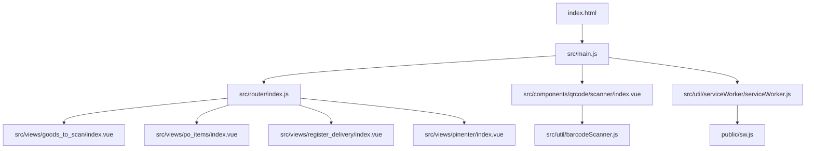
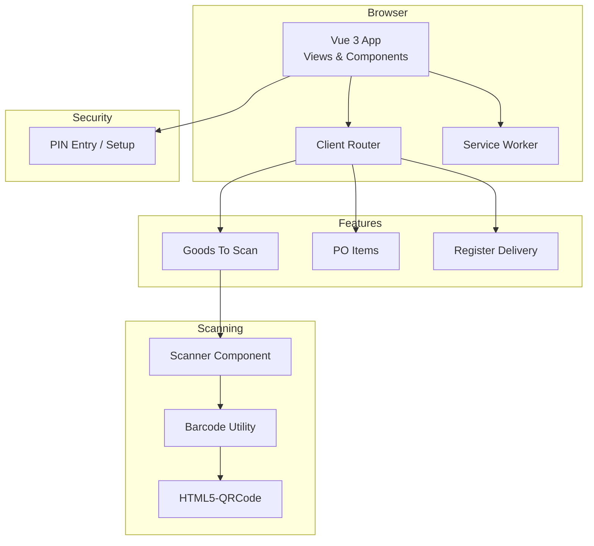
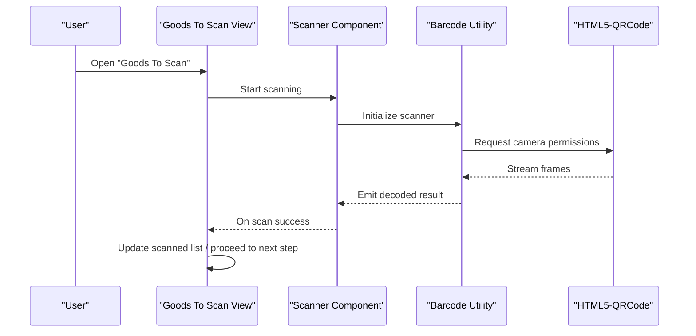
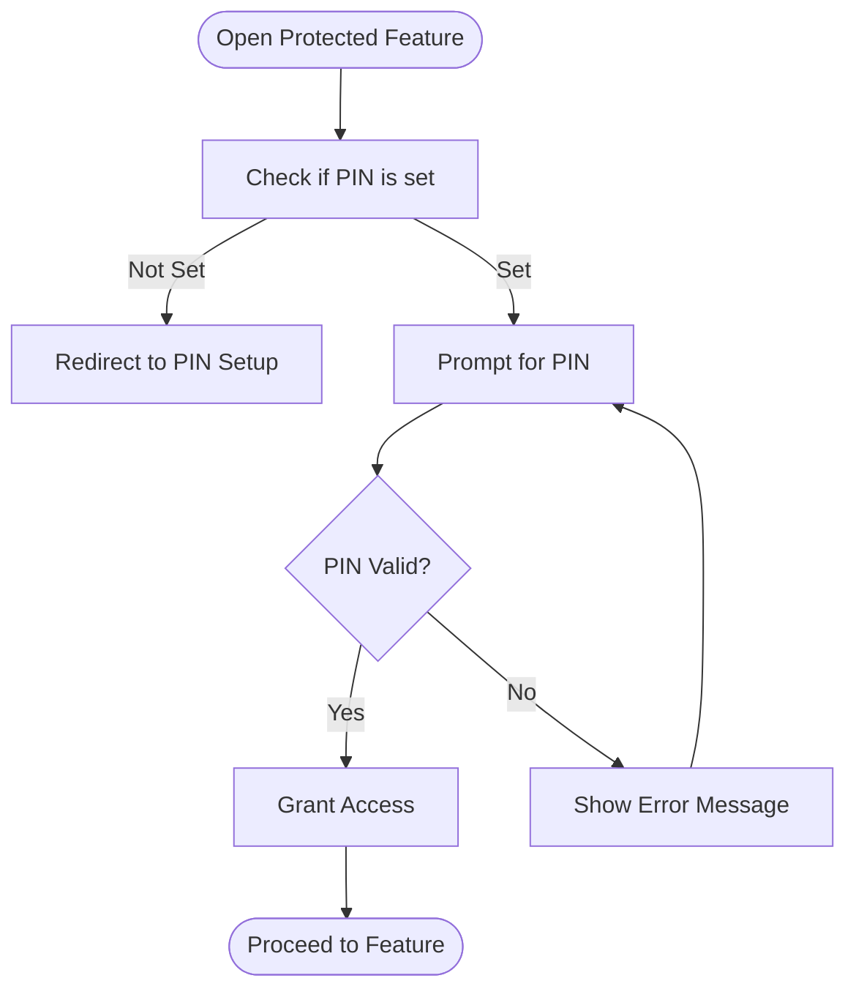
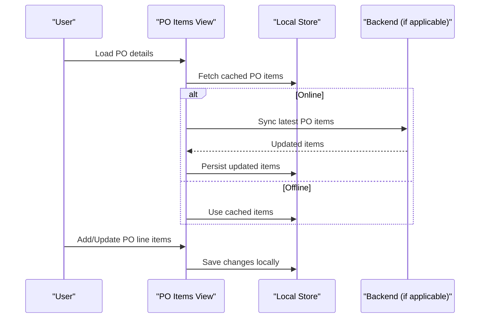
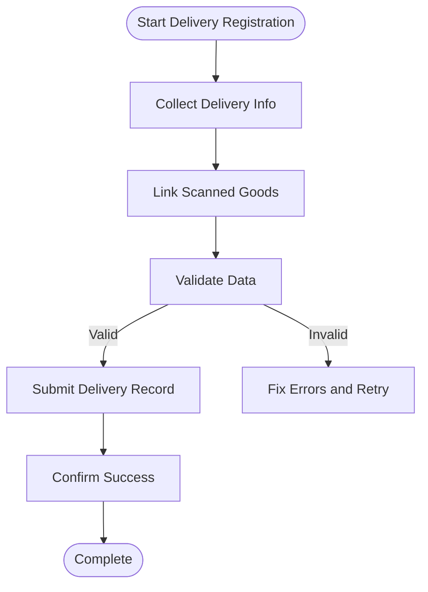
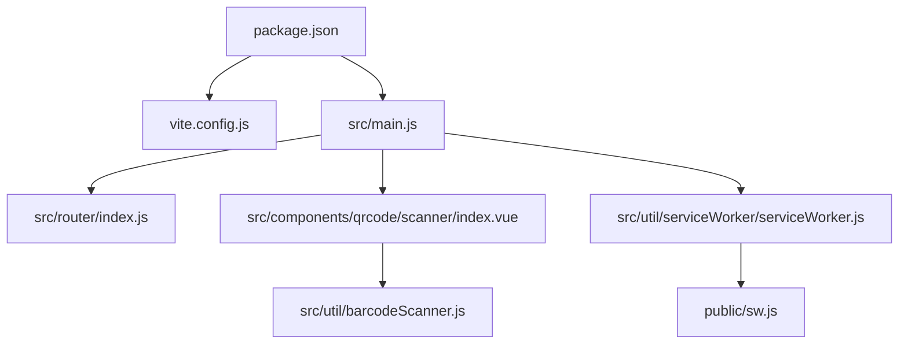

# Project Overview

<cite>
**Referenced Files in This Document**
- [README.md](file://README.md)
- [package.json](file://package.json)
- [vite.config.js](file://vite.config.js)
- [index.html](file://index.html)
- [src/main.js](file://src/main.js)
- [src/router/index.js](file://src/router/index.js)
- [src/components/qrcode/scanner/index.vue](file://src/components/qrcode/scanner/index.vue)
- [src/util/barcodeScanner.js](file://src/util/barcodeScanner.js)
- [src/views/goods_to_scan/index.vue](file://src/views/goods_to_scan/index.vue)
- [src/views/po_items/index.vue](file://src/views/po_items/index.vue)
- [src/views/register_delivery/index.vue](file://src/views/register_delivery/index.vue)
- [src/views/pinenter/index.vue](file://src/views/pinenter/index.vue)
- [src/components/pinmobile/PinMobile.vue](file://src/components/pinmobile/PinMobile.vue)
- [src/util/serviceWorker/serviceWorker.js](file://src/util/serviceWorker/serviceWorker.js)
- [public/sw.js](file://public/sw.js)
</cite>

## Table of Contents
1. [Introduction](#introduction)
2. [Project Structure](#project-structure)
3. [Core Components](#core-components)
4. [Architecture Overview](#architecture-overview)
5. [Detailed Component Analysis](#detailed-component-analysis)
6. [Dependency Analysis](#dependency-analysis)
7. [Performance Considerations](#performance-considerations)
8. [Troubleshooting Guide](#troubleshooting-guide)
9. [Conclusion](#conclusion)
10. [Appendices](#appendices)

## Introduction
ahm-gr-scanner is a mobile-first, web-based application designed for inventory management and goods tracking through barcode and QR code scanning. It provides real-time scanning capabilities, offline support via service workers, PIN-based authentication, and streamlined workflows for purchase order processing and delivery registration. The app targets modern browsers on mobile devices while remaining accessible from desktops for configuration and review tasks.

Key features:
- Real-time barcode/QR scanning using HTML5 camera access
- Offline capability with caching and background sync patterns
- PIN authentication to secure sensitive operations
- Purchase order item processing and delivery registration flows
- Lightweight Vue 3 components and modular utilities

The project leverages Vue 3 with Vite for fast development and optimized builds, and integrates HTML5-QRCode for robust scanning across devices.

[No sources needed since this section summarizes without analyzing specific files]

## Project Structure
The repository follows a feature-oriented layout under src/, with shared components, views, utilities, and router configuration. Build and runtime assets are organized under public/, scripts/, and root-level configuration files.

Highlights:
- src/components: Reusable UI elements (dialog, PIN entry, scanner, generator, refresh button)
- src/views: Feature pages (goods scanning, PO items, delivery registration, PIN setup/entry)
- src/util: Utilities for scanning, store, OData helpers, SFC bootstrap, and service worker integration
- src/router: Client-side routing configuration
- public: Service worker files and static assets
- scripts: Development and deployment helper scripts
- Root config: package.json, vite.config.js, index.html

**Diagram sources**
- [index.html:1-200](file://index.html#L1-L200)
- [src/main.js:1-200](file://src/main.js#L1-L200)
- [src/router/index.js:1-200](file://src/router/index.js#L1-L200)
- [src/views/goods_to_scan/index.vue:1-200](file://src/views/goods_to_scan/index.vue#L1-L200)
- [src/views/po_items/index.vue:1-200](file://src/views/po_items/index.vue#L1-L200)
- [src/views/register_delivery/index.vue:1-200](file://src/views/register_delivery/index.vue#L1-L200)
- [src/views/pinenter/index.vue:1-200](file://src/views/pinenter/index.vue#L1-L200)
- [src/components/qrcode/scanner/index.vue:1-200](file://src/components/qrcode/scanner/index.vue#L1-L200)
- [src/util/barcodeScanner.js:1-200](file://src/util/barcodeScanner.js#L1-L200)
- [src/util/serviceWorker/serviceWorker.js:1-200](file://src/util/serviceWorker/serviceWorker.js#L1-L200)
- [public/sw.js:1-200](file://public/sw.js#L1-L200)

**Section sources**
- [README.md:1-200](file://README.md#L1-L200)
- [package.json:1-200](file://package.json#L1-L200)
- [vite.config.js:1-200](file://vite.config.js#L1-L200)
- [index.html:1-200](file://index.html#L1-L200)
- [src/main.js:1-200](file://src/main.js#L1-L200)
- [src/router/index.js:1-200](file://src/router/index.js#L1-L200)

## Core Components
This section outlines the primary building blocks that enable scanning, navigation, security, and data workflows.

- Scanner component
  - Provides camera-based scanning for barcodes and QR codes
  - Integrates with HTML5-QRCode library for cross-device compatibility
  - Emits scan results to parent views for further processing

- Barcode utility
  - Encapsulates scanning lifecycle and error handling
  - Normalizes scan events and formats results for consistent consumption

- Views
  - Goods-to-scan: orchestrates scanning flow and displays scanned items
  - PO items: manages purchase order line items and related actions
  - Register delivery: guides users through delivery registration steps
  - PIN entry/setup: secures user sessions and enforces PIN policies

- Service Worker integration
  - Enables offline caching and background operations
  - Improves reliability in low-connectivity environments

- Router
  - Defines routes for each view and guards sensitive flows with PIN checks

**Section sources**
- [src/components/qrcode/scanner/index.vue:1-200](file://src/components/qrcode/scanner/index.vue#L1-L200)
- [src/util/barcodeScanner.js:1-200](file://src/util/barcodeScanner.js#L1-L200)
- [src/views/goods_to_scan/index.vue:1-200](file://src/views/goods_to_scan/index.vue#L1-L200)
- [src/views/po_items/index.vue:1-200](file://src/views/po_items/index.vue#L1-L200)
- [src/views/register_delivery/index.vue:1-200](file://src/views/register_delivery/index.vue#L1-L200)
- [src/views/pinenter/index.vue:1-200](file://src/views/pinenter/index.vue#L1-L200)
- [src/components/pinmobile/PinMobile.vue:1-200](file://src/components/pinmobile/PinMobile.vue#L1-L200)
- [src/util/serviceWorker/serviceWorker.js:1-200](file://src/util/serviceWorker/serviceWorker.js#L1-L200)
- [public/sw.js:1-200](file://public/sw.js#L1-L200)
- [src/router/index.js:1-200](file://src/router/index.js#L1-L200)

## Architecture Overview
The application follows a client-side architecture with Vue 3 as the UI framework, Vite for build tooling, and HTML5-QRCode for scanning. Routing directs users to feature-specific views, which compose reusable components and call utilities for scanning and data operations. Service workers provide offline caching and resilience.

**Diagram sources**
- [src/main.js:1-200](file://src/main.js#L1-L200)
- [src/router/index.js:1-200](file://src/router/index.js#L1-L200)
- [src/components/qrcode/scanner/index.vue:1-200](file://src/components/qrcode/scanner/index.vue#L1-L200)
- [src/util/barcodeScanner.js:1-200](file://src/util/barcodeScanner.js#L1-L200)
- [src/views/goods_to_scan/index.vue:1-200](file://src/views/goods_to_scan/index.vue#L1-L200)
- [src/views/po_items/index.vue:1-200](file://src/views/po_items/index.vue#L1-L200)
- [src/views/register_delivery/index.vue:1-200](file://src/views/register_delivery/index.vue#L1-L200)
- [src/views/pinenter/index.vue:1-200](file://src/views/pinenter/index.vue#L1-L200)
- [src/util/serviceWorker/serviceWorker.js:1-200](file://src/util/serviceWorker/serviceWorker.js#L1-L200)
- [public/sw.js:1-200](file://public/sw.js#L1-L200)

## Detailed Component Analysis

### Scanning Flow
The scanning workflow starts when a user navigates to the goods-to-scan view. The scanner component initializes the camera, decodes frames using HTML5-QRCode, and emits results to the view for processing.

**Diagram sources**
- [src/views/goods_to_scan/index.vue:1-200](file://src/views/goods_to_scan/index.vue#L1-L200)
- [src/components/qrcode/scanner/index.vue:1-200](file://src/components/qrcode/scanner/index.vue#L1-L200)
- [src/util/barcodeScanner.js:1-200](file://src/util/barcodeScanner.js#L1-L200)

**Section sources**
- [src/views/goods_to_scan/index.vue:1-200](file://src/views/goods_to_scan/index.vue#L1-L200)
- [src/components/qrcode/scanner/index.vue:1-200](file://src/components/qrcode/scanner/index.vue#L1-L200)
- [src/util/barcodeScanner.js:1-200](file://src/util/barcodeScanner.js#L1-L200)

### PIN Authentication Flow
Sensitive operations require PIN verification. The PIN entry view validates input against stored credentials and grants access to protected routes or actions.

**Diagram sources**
- [src/views/pinenter/index.vue:1-200](file://src/views/pinenter/index.vue#L1-L200)
- [src/components/pinmobile/PinMobile.vue:1-200](file://src/components/pinmobile/PinMobile.vue#L1-L200)

**Section sources**
- [src/views/pinenter/index.vue:1-200](file://src/views/pinenter/index.vue#L1-L200)
- [src/components/pinmobile/PinMobile.vue:1-200](file://src/components/pinmobile/PinMobile.vue#L1-L200)

### Purchase Order Processing
The PO items view allows users to manage purchase order lines, validate entries, and coordinate with scanning results.

**Diagram sources**
- [src/views/po_items/index.vue:1-200](file://src/views/po_items/index.vue#L1-L200)
- [src/util/store.js:1-200](file://src/util/store.js#L1-L200)

**Section sources**
- [src/views/po_items/index.vue:1-200](file://src/views/po_items/index.vue#L1-L200)
- [src/util/store.js:1-200](file://src/util/store.js#L1-L200)

### Delivery Registration
The register delivery view guides users through capturing required information and associating it with scanned goods.

**Diagram sources**
- [src/views/register_delivery/index.vue:1-200](file://src/views/register_delivery/index.vue#L1-L200)

**Section sources**
- [src/views/register_delivery/index.vue:1-200](file://src/views/register_delivery/index.vue#L1-L200)

## Dependency Analysis
The project uses a minimal dependency set focused on performance and mobile usability. Key dependencies include Vue 3 for reactive UI, Vite for fast builds, and HTML5-QRCode for scanning. Service workers are configured for offline support.

**Diagram sources**
- [package.json:1-200](file://package.json#L1-L200)
- [vite.config.js:1-200](file://vite.config.js#L1-L200)
- [src/main.js:1-200](file://src/main.js#L1-L200)
- [src/router/index.js:1-200](file://src/router/index.js#L1-L200)
- [src/components/qrcode/scanner/index.vue:1-200](file://src/components/qrcode/scanner/index.vue#L1-L200)
- [src/util/barcodeScanner.js:1-200](file://src/util/barcodeScanner.js#L1-L200)
- [src/util/serviceWorker/serviceWorker.js:1-200](file://src/util/serviceWorker/serviceWorker.js#L1-L200)
- [public/sw.js:1-200](file://public/sw.js#L1-L200)

**Section sources**
- [package.json:1-200](file://package.json#L1-L200)
- [vite.config.js:1-200](file://vite.config.js#L1-L200)
- [src/main.js:1-200](file://src/main.js#L1-L200)
- [src/router/index.js:1-200](file://src/router/index.js#L1-L200)
- [src/util/serviceWorker/serviceWorker.js:1-200](file://src/util/serviceWorker/serviceWorker.js#L1-L200)
- [public/sw.js:1-200](file://public/sw.js#L1-L200)

## Performance Considerations
- Prefer lazy loading of heavy components and views to reduce initial bundle size
- Optimize camera usage by stopping streams when not in use
- Cache frequently accessed data locally and implement efficient diffing strategies
- Keep service worker cache sizes reasonable and implement cache invalidation policies
- Minimize re-renders by leveraging Vue’s reactivity efficiently and avoiding unnecessary state updates

[No sources needed since this section provides general guidance]

## Troubleshooting Guide
Common issues and resolutions:
- Camera permission denied
  - Ensure HTTPS context and explicit user gesture to start scanning
  - Verify browser permissions and retry after granting access
- No scans detected
  - Improve lighting and focus; ensure scannable content fills the frame
  - Check device compatibility and update browser
- Offline mode not working
  - Confirm service worker registration and cache strategy
  - Clear caches and reinstall if necessary
- PIN errors
  - Reset PIN via setup flow if locked out
  - Validate PIN policy constraints and retry

**Section sources**
- [src/util/barcodeScanner.js:1-200](file://src/util/barcodeScanner.js#L1-L200)
- [src/util/serviceWorker/serviceWorker.js:1-200](file://src/util/serviceWorker/serviceWorker.js#L1-L200)
- [public/sw.js:1-200](file://public/sw.js#L1-L200)
- [src/views/pinenter/index.vue:1-200](file://src/views/pinenter/index.vue#L1-L200)

## Conclusion
ahm-gr-scanner delivers a focused, mobile-first experience for inventory and goods tracking with real-time scanning, offline resilience, and secure workflows. Its lightweight architecture and clear separation of concerns make it easy to extend and maintain. By following the installation and usage guidance below, teams can quickly deploy and operate the application in production environments.

[No sources needed since this section summarizes without analyzing specific files]

## Appendices

### Installation Instructions
- Prerequisites
  - Node.js LTS recommended
  - Modern browser with HTTPS support for camera access
- Steps
  - Clone the repository
  - Install dependencies using the package manager defined in package.json
  - Start the development server using the provided script or Vite command
  - Open the local URL in your browser and grant camera permissions when prompted

**Section sources**
- [README.md:1-200](file://README.md#L1-L200)
- [package.json:1-200](file://package.json#L1-L200)
- [scripts/start.sh:1-200](file://scripts/start.sh#L1-L200)

### Quick Start Guide
- Launch the app and navigate to “Goods To Scan”
- Allow camera access and point the device at a barcode or QR code
- Review scanned items and proceed to purchase order or delivery registration
- If required, set up or enter your PIN to access protected features

**Section sources**
- [src/views/goods_to_scan/index.vue:1-200](file://src/views/goods_to_scan/index.vue#L1-L200)
- [src/views/po_items/index.vue:1-200](file://src/views/po_items/index.vue#L1-L200)
- [src/views/register_delivery/index.vue:1-200](file://src/views/register_delivery/index.vue#L1-L200)
- [src/views/pinenter/index.vue:1-200](file://src/views/pinenter/index.vue#L1-L200)

### Basic Usage Examples
- Scanning a product
  - Open the goods-to-scan view and initiate scanning
  - When a code is detected, the item appears in the scanned list
- Adding a purchase order item
  - Navigate to PO items and add or edit line entries
  - Associate scanned goods where applicable
- Registering a delivery
  - Fill in delivery details and link scanned goods
  - Submit the record and confirm completion

**Section sources**
- [src/views/goods_to_scan/index.vue:1-200](file://src/views/goods_to_scan/index.vue#L1-L200)
- [src/views/po_items/index.vue:1-200](file://src/views/po_items/index.vue#L1-L200)
- [src/views/register_delivery/index.vue:1-200](file://src/views/register_delivery/index.vue#L1-L200)

### System Requirements and Browser Compatibility
- Operating systems
  - iOS Safari (latest stable)
  - Android Chrome (latest stable)
  - Desktop Chrome/Firefox/Edge for configuration and review
- Network
  - HTTPS required for camera access and service worker registration
- Features
  - MediaDevices API for camera access
  - Web Storage and Cache APIs for offline support

**Section sources**
- [src/util/barcodeScanner.js:1-200](file://src/util/barcodeScanner.js#L1-L200)
- [src/util/serviceWorker/serviceWorker.js:1-200](file://src/util/serviceWorker/serviceWorker.js#L1-L200)
- [public/sw.js:1-200](file://public/sw.js#L1-L200)