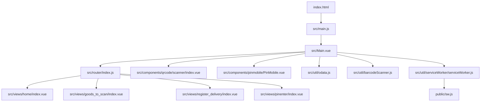
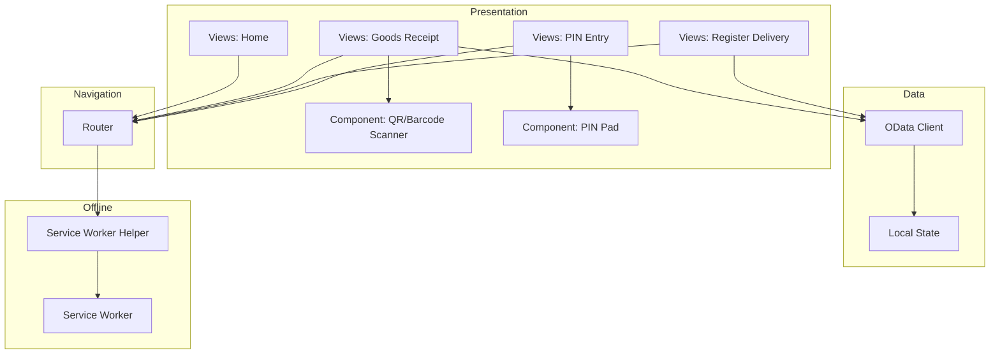
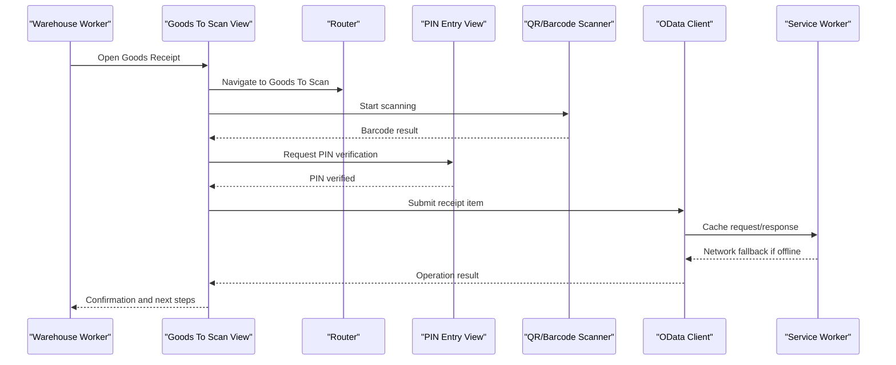
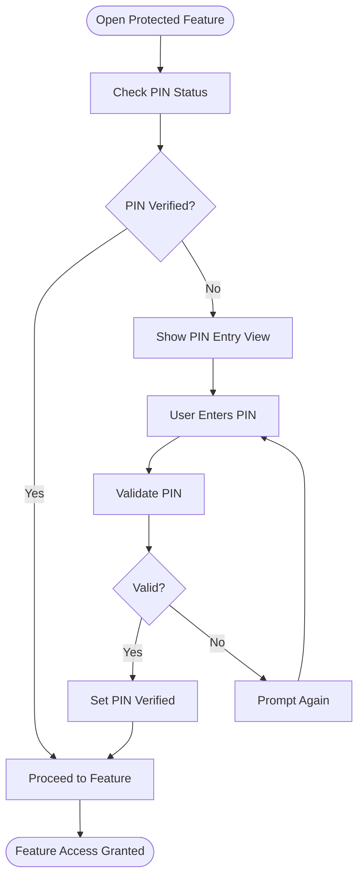
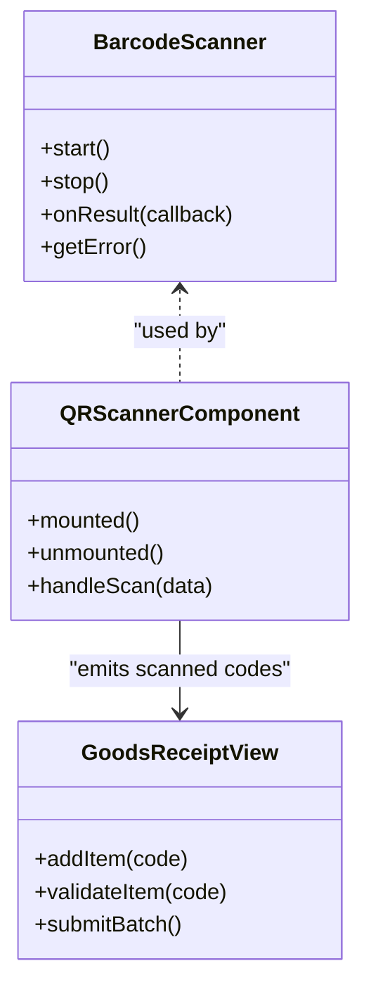
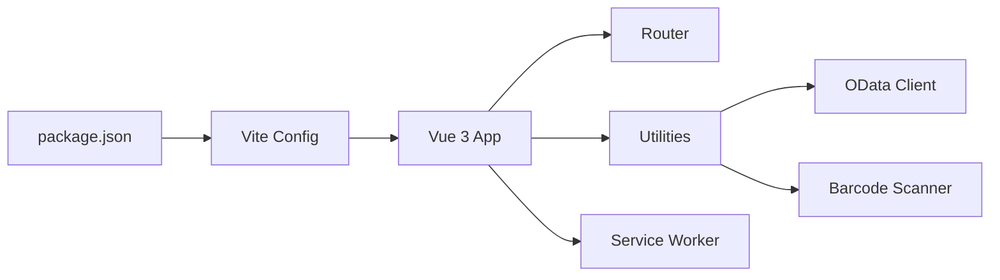

# Project Overview

<cite>
**Referenced Files in This Document**
- [README.md](file://README.md)
- [package.json](file://package.json)
- [vite.config.js](file://vite.config.js)
- [index.html](file://index.html)
- [src/main.js](file://src/main.js)
- [src/Main.vue](file://src/Main.vue)
- [src/router/index.js](file://src/router/index.js)
- [src/util/serviceWorker/serviceWorker.js](file://src/util/serviceWorker/serviceWorker.js)
- [public/sw.js](file://public/sw.js)
- [src/util/odata.js](file://src/util/odata.js)
- [src/util/barcodeScanner.js](file://src/util/barcodeScanner.js)
- [src/components/qrcode/scanner/index.vue](file://src/components/qrcode/scanner/index.vue)
- [src/views/home/index.vue](file://src/views/home/index.vue)
- [src/views/goods_to_scan/index.vue](file://src/views/goods_to_scan/index.vue)
- [src/views/register_delivery/index.vue](file://src/views/register_delivery/index.vue)
- [src/views/pinenter/index.vue](file://src/views/pinenter/index.vue)
- [src/components/pinmobile/PinMobile.vue](file://src/components/pinmobile/PinMobile.vue)
</cite>

## Table of Contents
1. [Introduction](#introduction)
2. [Project Structure](#project-structure)
3. [Core Components](#core-components)
4. [Architecture Overview](#architecture-overview)
5. [Detailed Component Analysis](#detailed-component-analysis)
6. [Dependency Analysis](#dependency-analysis)
7. [Performance Considerations](#performance-considerations)
8. [Troubleshooting Guide](#troubleshooting-guide)
9. [Conclusion](#conclusion)

## Introduction
AHM GR Scanner is a mobile-first progressive web app designed to streamline goods receipt operations in warehouse environments. It enables fast, reliable barcode scanning and end-to-end receipt workflows, including delivery registration and item-level processing, with strong offline support and PIN-based security for safe operation on shared devices.

Target audience:
- Warehouse workers performing receiving and put-away tasks
- Inventory managers overseeing receipts and deliveries
- Operations supervisors requiring auditability and control via PIN access

Key features:
- Real-time barcode scanning using device cameras or integrated scanners
- Goods receipt management with item-level visibility and actions
- Delivery registration workflow to capture inbound shipments
- PIN security system to protect sensitive operations
- Offline capabilities through Service Workers for resilient field use

Technology stack highlights:
- Vue 3 application with Vite build tooling
- Service Worker integration for caching and offline behavior
- OData client integration for backend communication
- Modular components for QR/barcode scanning and UI dialogs

Business context and benefits:
- Reduces manual data entry errors by leveraging barcode capture
- Accelerates receiving throughput with streamlined workflows
- Improves operational resilience with offline-first design
- Enhances security and accountability with PIN-gated access

[No sources needed since this section provides general project overview]

## Project Structure
The repository follows a feature-oriented layout centered around Vue single-file components and utility modules:
- src/views: Application screens (home, goods receipt, delivery registration, PIN entry)
- src/components: Reusable UI elements (dialogs, PIN pad, QR/barcode scanner)
- src/util: Core utilities (OData client, barcode scanner, Service Worker helpers, store)
- public: Static assets including the production Service Worker
- scripts: Build and deployment helpers
- vite.config.js: Vite configuration for development and production builds

**Diagram sources**
- [index.html:1-20](file://index.html#L1-L20)
- [src/main.js:1-40](file://src/main.js#L1-L40)
- [src/Main.vue:1-60](file://src/Main.vue#L1-L60)
- [src/router/index.js:1-40](file://src/router/index.js#L1-L40)
- [src/views/home/index.vue:1-30](file://src/views/home/index.vue#L1-L30)
- [src/views/goods_to_scan/index.vue:1-30](file://src/views/goods_to_scan/index.vue#L1-L30)
- [src/views/register_delivery/index.vue:1-30](file://src/views/register_delivery/index.vue#L1-L30)
- [src/views/pinenter/index.vue:1-30](file://src/views/pinenter/index.vue#L1-L30)
- [src/components/qrcode/scanner/index.vue:1-30](file://src/components/qrcode/scanner/index.vue#L1-L30)
- [src/components/pinmobile/PinMobile.vue:1-30](file://src/components/pinmobile/PinMobile.vue#L1-L30)
- [src/util/odata.js:1-40](file://src/util/odata.js#L1-L40)
- [src/util/barcodeScanner.js:1-40](file://src/util/barcodeScanner.js#L1-L40)
- [src/util/serviceWorker/serviceWorker.js:1-40](file://src/util/serviceWorker/serviceWorker.js#L1-L40)
- [public/sw.js:1-40](file://public/sw.js#L1-L40)

**Section sources**
- [README.md:1-40](file://README.md#L1-L40)
- [package.json:1-40](file://package.json#L1-L40)
- [vite.config.js:1-40](file://vite.config.js#L1-L40)
- [index.html:1-20](file://index.html#L1-L20)
- [src/main.js:1-40](file://src/main.js#L1-L40)
- [src/Main.vue:1-60](file://src/Main.vue#L1-L60)
- [src/router/index.js:1-40](file://src/router/index.js#L1-L40)

## Core Components
- Main application shell: Initializes routing and global state, mounts the root component, and wires up navigation between views.
- Router: Defines routes for home, goods receipt, delivery registration, and PIN entry flows.
- Views:
  - Home: Entry point and quick actions to start scanning or manage receipts.
  - Goods to scan: Item-level receipt operations, list management, and status tracking.
  - Register delivery: Capture delivery metadata and link to subsequent receipt items.
  - PIN entry: Secure access gate for sensitive operations.
- Components:
  - QR/Barcode scanner: Camera-based scanning interface used across receipt flows.
  - PIN pad: Mobile-friendly numeric input for PIN verification.
- Utilities:
  - OData client: Encapsulates HTTP requests and response handling for backend services.
  - Barcode scanner helper: Abstraction over camera and scanner inputs.
  - Service Worker helpers: Registration and lifecycle management for offline caching.

Operational benefits:
- Streamlined receiving process reduces cycle time and errors
- PIN security ensures only authorized personnel can perform critical actions
- Offline-first design supports continuous operations in low-connectivity areas

**Section sources**
- [src/Main.vue:1-60](file://src/Main.vue#L1-L60)
- [src/router/index.js:1-40](file://src/router/index.js#L1-L40)
- [src/views/home/index.vue:1-30](file://src/views/home/index.vue#L1-L30)
- [src/views/goods_to_scan/index.vue:1-30](file://src/views/goods_to_scan/index.vue#L1-L30)
- [src/views/register_delivery/index.vue:1-30](file://src/views/register_delivery/index.vue#L1-L30)
- [src/views/pinenter/index.vue:1-30](file://src/views/pinenter/index.vue#L1-L30)
- [src/components/qrcode/scanner/index.vue:1-30](file://src/components/qrcode/scanner/index.vue#L1-L30)
- [src/components/pinmobile/PinMobile.vue:1-30](file://src/components/pinmobile/PinMobile.vue#L1-L30)
- [src/util/odata.js:1-40](file://src/util/odata.js#L1-L40)
- [src/util/barcodeScanner.js:1-40](file://src/util/barcodeScanner.js#L1-L40)
- [src/util/serviceWorker/serviceWorker.js:1-40](file://src/util/serviceWorker/serviceWorker.js#L1-L40)

## Architecture Overview
High-level architecture shows how the PWA layers interact:
- Presentation layer: Vue components and views render the UI and handle user interactions.
- Navigation layer: Router manages screen transitions and guards for PIN-protected flows.
- Data layer: OData client communicates with backend services; local state persists during sessions.
- Offline layer: Service Worker caches static assets and API responses to enable offline usage.

**Diagram sources**
- [src/router/index.js:1-40](file://src/router/index.js#L1-L40)
- [src/views/home/index.vue:1-30](file://src/views/home/index.vue#L1-L30)
- [src/views/goods_to_scan/index.vue:1-30](file://src/views/goods_to_scan/index.vue#L1-L30)
- [src/views/register_delivery/index.vue:1-30](file://src/views/register_delivery/index.vue#L1-L30)
- [src/views/pinenter/index.vue:1-30](file://src/views/pinenter/index.vue#L1-L30)
- [src/components/qrcode/scanner/index.vue:1-30](file://src/components/qrcode/scanner/index.vue#L1-L30)
- [src/components/pinmobile/PinMobile.vue:1-30](file://src/components/pinmobile/PinMobile.vue#L1-L30)
- [src/util/odata.js:1-40](file://src/util/odata.js#L1-L40)
- [src/util/serviceWorker/serviceWorker.js:1-40](file://src/util/serviceWorker/serviceWorker.js#L1-L40)
- [public/sw.js:1-40](file://public/sw.js#L1-L40)

## Detailed Component Analysis

### Goods Receipt Flow
This sequence illustrates the typical goods receipt interaction from scanning to submission:

**Diagram sources**
- [src/views/goods_to_scan/index.vue:1-30](file://src/views/goods_to_scan/index.vue#L1-L30)
- [src/views/pinenter/index.vue:1-30](file://src/views/pinenter/index.vue#L1-L30)
- [src/components/qrcode/scanner/index.vue:1-30](file://src/components/qrcode/scanner/index.vue#L1-L30)
- [src/util/odata.js:1-40](file://src/util/odata.js#L1-L40)
- [src/util/serviceWorker/serviceWorker.js:1-40](file://src/util/serviceWorker/serviceWorker.js#L1-L40)
- [public/sw.js:1-40](file://public/sw.js#L1-L40)

### PIN Security Gate
The PIN flow protects sensitive operations by gating access until valid credentials are provided:

**Diagram sources**
- [src/views/pinenter/index.vue:1-30](file://src/views/pinenter/index.vue#L1-L30)
- [src/components/pinmobile/PinMobile.vue:1-30](file://src/components/pinmobile/PinMobile.vue#L1-L30)

### Barcode Scanning Integration
Scanning integrates with device cameras and external scanners, feeding results into receipt workflows:

**Diagram sources**
- [src/util/barcodeScanner.js:1-40](file://src/util/barcodeScanner.js#L1-L40)
- [src/components/qrcode/scanner/index.vue:1-30](file://src/components/qrcode/scanner/index.vue#L1-L30)
- [src/views/goods_to_scan/index.vue:1-30](file://src/views/goods_to_scan/index.vue#L1-L30)

**Section sources**
- [src/views/goods_to_scan/index.vue:1-30](file://src/views/goods_to_scan/index.vue#L1-L30)
- [src/views/pinenter/index.vue:1-30](file://src/views/pinenter/index.vue#L1-L30)
- [src/components/qrcode/scanner/index.vue:1-30](file://src/components/qrcode/scanner/index.vue#L1-L30)
- [src/components/pinmobile/PinMobile.vue:1-30](file://src/components/pinmobile/PinMobile.vue#L1-L30)
- [src/util/barcodeScanner.js:1-40](file://src/util/barcodeScanner.js#L1-L40)
- [src/util/odata.js:1-40](file://src/util/odata.js#L1-L40)
- [src/util/serviceWorker/serviceWorker.js:1-40](file://src/util/serviceWorker/serviceWorker.js#L1-L40)
- [public/sw.js:1-40](file://public/sw.js#L1-L40)

## Dependency Analysis
Build and runtime dependencies include Vue 3, Vite, and Service Worker APIs. The router coordinates view dependencies, while utilities encapsulate external integrations (OData, barcode scanning).

**Diagram sources**
- [package.json:1-40](file://package.json#L1-L40)
- [vite.config.js:1-40](file://vite.config.js#L1-L40)
- [src/router/index.js:1-40](file://src/router/index.js#L1-L40)
- [src/util/odata.js:1-40](file://src/util/odata.js#L1-L40)
- [src/util/barcodeScanner.js:1-40](file://src/util/barcodeScanner.js#L1-L40)
- [src/util/serviceWorker/serviceWorker.js:1-40](file://src/util/serviceWorker/serviceWorker.js#L1-L40)

**Section sources**
- [package.json:1-40](file://package.json#L1-L40)
- [vite.config.js:1-40](file://vite.config.js#L1-L40)
- [src/router/index.js:1-40](file://src/router/index.js#L1-L40)

## Performance Considerations
- Prefer lazy loading of heavy components (e.g., scanner) to reduce initial bundle size.
- Cache frequently accessed reference data via Service Worker to minimize network calls.
- Debounce rapid scans to avoid overwhelming the UI thread.
- Batch OData submissions when possible to reduce round trips.
- Monitor memory usage on long-running sessions and reset scanner state appropriately.

[No sources needed since this section provides general guidance]

## Troubleshooting Guide
Common issues and resolutions:
- Service Worker not updating: Clear cache and force reload; verify registration path and versioning.
- Camera permissions denied: Prompt users to allow camera access; provide fallback to manual code entry.
- OData connectivity failures: Implement retry logic and offline queueing; log detailed error contexts.
- PIN validation loops: Ensure PIN state is persisted correctly and cleared on logout.

**Section sources**
- [src/util/serviceWorker/serviceWorker.js:1-40](file://src/util/serviceWorker/serviceWorker.js#L1-L40)
- [public/sw.js:1-40](file://public/sw.js#L1-L40)
- [src/util/odata.js:1-40](file://src/util/odata.js#L1-L40)
- [src/views/pinenter/index.vue:1-30](file://src/views/pinenter/index.vue#L1-L30)

## Conclusion
AHM GR Scanner delivers a robust, mobile-first PWA tailored for warehouse goods receipt operations. Its modular Vue 3 architecture, integrated barcode scanning, secure PIN access, and offline-ready Service Worker foundation provide a resilient platform that improves accuracy, speed, and reliability in receiving workflows.

[No sources needed since this section summarizes without analyzing specific files]