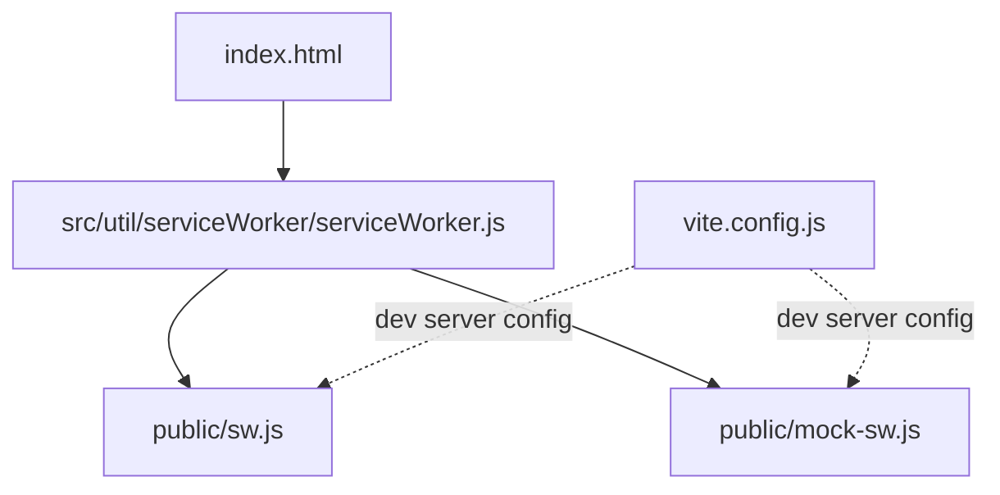
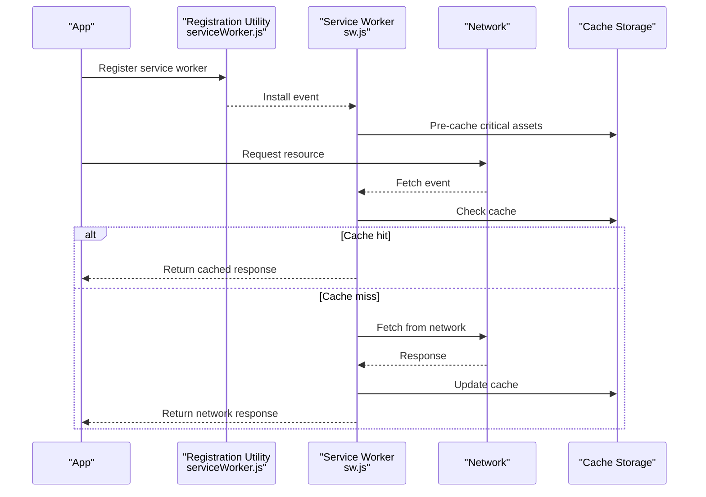
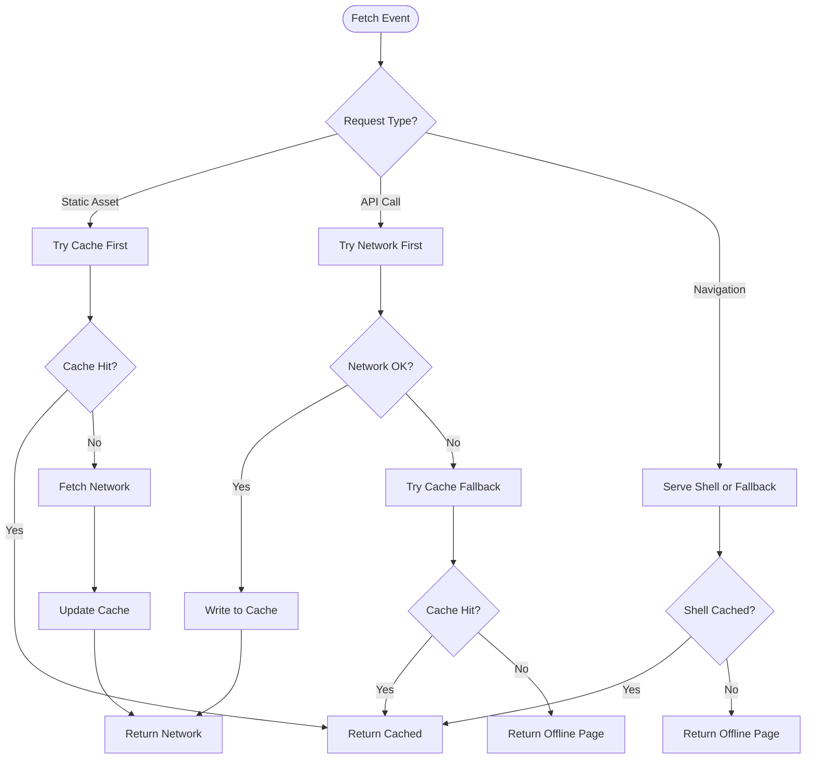
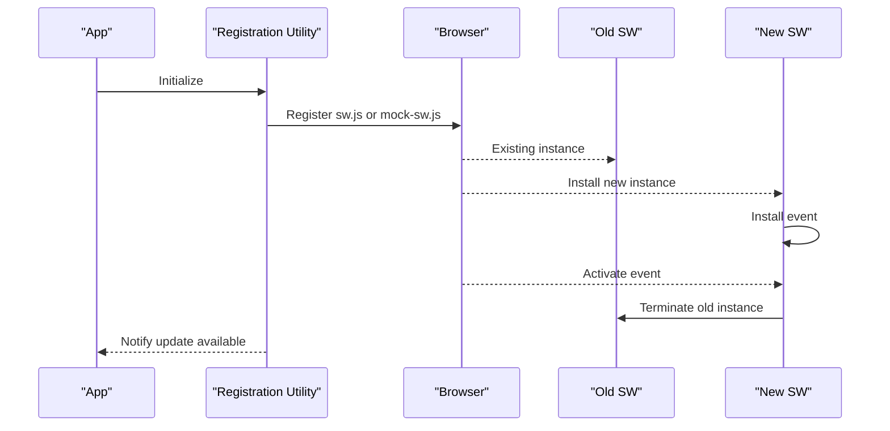
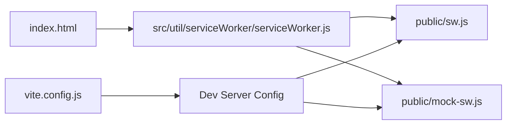

# Service Worker Implementation

<cite>
**Referenced Files in This Document**
- [public/sw.js](file://public/sw.js)
- [public/mock-sw.js](file://public/mock-sw.js)
- [src/util/serviceWorker/serviceWorker.js](file://src/util/serviceWorker/serviceWorker.js)
- [src/util/serviceWorker/README.md](file://src/util/serviceWorker/README.md)
- [src/util/sw.js](file://src/util/sw.js)
- [index.html](file://index.html)
- [vite.config.js](file://vite.config.js)
</cite>

## Table of Contents
1. [Introduction](#introduction)
2. [Project Structure](#project-structure)
3. [Core Components](#core-components)
4. [Architecture Overview](#architecture-overview)
5. [Detailed Component Analysis](#detailed-component-analysis)
6. [Dependency Analysis](#dependency-analysis)
7. [Performance Considerations](#performance-considerations)
8. [Troubleshooting Guide](#troubleshooting-guide)
9. [Conclusion](#conclusion)

## Introduction
This document explains the Service Worker implementation that provides offline capabilities for the application. It covers caching strategies, background synchronization, and network request interception patterns. It also documents differences between development and production service workers, cache invalidation policies, storage management, offline-first patterns, graceful failure handling, data synchronization on connectivity restoration, performance optimization techniques, memory management, debugging approaches, fallback mechanisms, and error recovery strategies.

## Project Structure
The Service Worker assets and utilities are organized as follows:
- public/sw.js: Production-ready service worker script
- public/mock-sw.js: Development-only mock service worker for local testing
- src/util/serviceWorker/serviceWorker.js: Utility module to register and manage the service worker from the app
- src/util/serviceWorker/README.md: Notes about the service worker utility
- src/util/sw.js: Additional service worker helper (if used by the app)
- index.html: Entry page where the service worker is registered
- vite.config.js: Build configuration that may influence service worker behavior during development

**Diagram sources**
- [index.html](file://index.html)
- [src/util/serviceWorker/serviceWorker.js](file://src/util/serviceWorker/serviceWorker.js)
- [public/sw.js](file://public/sw.js)
- [public/mock-sw.js](file://public/mock-sw.js)
- [vite.config.js](file://vite.config.js)

**Section sources**
- [index.html](file://index.html)
- [src/util/serviceWorker/serviceWorker.js](file://src/util/serviceWorker/serviceWorker.js)
- [public/sw.js](file://public/sw.js)
- [public/mock-sw.js](file://public/mock-sw.js)
- [vite.config.js](file://vite.config.js)

## Core Components
- Production Service Worker (public/sw.js): Intercepts fetch events, applies caching strategies, serves cached responses when offline, and manages cache versions and keys.
- Mock Service Worker (public/mock-sw.js): Provides a lightweight, deterministic response layer for development and tests without real network calls.
- Registration Utility (src/util/serviceWorker/serviceWorker.js): Registers the appropriate service worker based on environment, handles updates, and exposes helpers for the app.
- Additional Helper (src/util/sw.js): Optional helper for service worker interactions or shared logic.

Key responsibilities:
- Cache static assets and API responses with versioned caches
- Intercept navigation and resource requests
- Provide offline-first responses with fallbacks
- Manage cache lifecycle and invalidation
- Support background sync for queued operations (when applicable)

**Section sources**
- [public/sw.js](file://public/sw.js)
- [public/mock-sw.js](file://public/mock-sw.js)
- [src/util/serviceWorker/serviceWorker.js](file://src/util/serviceWorker/serviceWorker.js)
- [src/util/sw.js](file://src/util/sw.js)

## Architecture Overview
The runtime architecture centers around the browser’s Service Worker lifecycle and the Fetch API. The registration utility chooses the correct worker file per environment. The production worker intercepts network requests and decides whether to serve from cache or fetch from the network, applying strategies such as cache-first or network-first depending on resource type.

**Diagram sources**
- [src/util/serviceWorker/serviceWorker.js](file://src/util/serviceWorker/serviceWorker.js)
- [public/sw.js](file://public/sw.js)

## Detailed Component Analysis

### Production Service Worker (public/sw.js)
Responsibilities:
- Install phase: pre-cache essential assets and shell files
- Activate phase: clean up old caches using versioned keys
- Fetch phase: apply strategy per request type (static assets vs dynamic API)
- Offline fallback: return cached pages or generic offline responses
- Background sync: queue and retry failed writes when online (if implemented)

Caching strategies:
- Static assets: cache-first with stale-while-revalidate semantics
- API responses: network-first with cache fallback; write successful responses to cache
- Navigation requests: cache-first for shell resources; otherwise network-first

Cache invalidation:
- Use versioned cache names to ensure atomic updates
- On activation, delete previous versions after migration

Storage management:
- Limit cache sizes and prune least recently used entries if needed
- Avoid storing large payloads in cache unless necessary

Error handling and fallbacks:
- Network failures return cached content or a minimal offline page
- Graceful degradation for partial failures

Background synchronization:
- If implemented, enqueue mutations and retry on connectivity via SyncManager

**Diagram sources**
- [public/sw.js](file://public/sw.js)

**Section sources**
- [public/sw.js](file://public/sw.js)

### Mock Service Worker (public/mock-sw.js)
Purpose:
- Provide deterministic responses for development and tests
- Simulate network latency and errors to validate offline behaviors
- Avoid hitting real endpoints while developing locally

Behavior:
- Responds to specific routes with predefined payloads
- Supports toggling success/failure modes
- Does not persist state across reloads

Use cases:
- Unit/integration tests
- Local development without backend dependencies

**Section sources**
- [public/mock-sw.js](file://public/mock-sw.js)

### Registration Utility (src/util/serviceWorker/serviceWorker.js)
Responsibilities:
- Detect environment (development vs production)
- Register the appropriate service worker file
- Handle updates and notify the app
- Expose helpers for app features (e.g., force update, check status)

Development vs Production:
- Development: registers mock-sw.js or a debug-enabled sw
- Production: registers optimized sw.js

Update flow:
- New worker installs in parallel
- Activation occurs after all clients release old worker
- App refreshes or prompts user to reload

**Diagram sources**
- [src/util/serviceWorker/serviceWorker.js](file://src/util/serviceWorker/serviceWorker.js)

**Section sources**
- [src/util/serviceWorker/serviceWorker.js](file://src/util/serviceWorker/serviceWorker.js)
- [src/util/serviceWorker/README.md](file://src/util/serviceWorker/README.md)

### Additional Helper (src/util/sw.js)
If present, this file typically contains shared logic for interacting with the service worker, such as:
- Checking registration status
- Triggering manual updates
- Accessing cache metadata

**Section sources**
- [src/util/sw.js](file://src/util/sw.js)

## Dependency Analysis
The following diagram shows how the app integrates with the service worker and build configuration.

**Diagram sources**
- [index.html](file://index.html)
- [src/util/serviceWorker/serviceWorker.js](file://src/util/serviceWorker/serviceWorker.js)
- [public/sw.js](file://public/sw.js)
- [public/mock-sw.js](file://public/mock-sw.js)
- [vite.config.js](file://vite.config.js)

**Section sources**
- [index.html](file://index.html)
- [src/util/serviceWorker/serviceWorker.js](file://src/util/serviceWorker/serviceWorker.js)
- [public/sw.js](file://public/sw.js)
- [public/mock-sw.js](file://public/mock-sw.js)
- [vite.config.js](file://vite.config.js)

## Performance Considerations
- Prefer cache-first for immutable static assets to reduce latency and bandwidth
- Use network-first for dynamic API data to keep content fresh, with cache fallback
- Implement cache versioning to avoid stale content and simplify rollbacks
- Limit cache size and implement eviction policies for long-running sessions
- Avoid caching sensitive or frequently changing data
- Minimize work in the fetch handler; offload heavy tasks to dedicated threads when possible
- Use efficient serialization for any persisted state
- Debounce frequent cache updates to prevent thrashing

[No sources needed since this section provides general guidance]

## Troubleshooting Guide
Common issues and resolutions:
- Service worker not updating: clear caches, hard-refresh, or force unregister during development
- Stale content served: verify cache versioning and activation cleanup
- Offline page not shown: ensure navigation fallback is configured and shell assets are cached
- Background sync not firing: confirm SyncManager support and permissions
- Memory pressure: monitor cache sizes and prune unused entries
- Debugging: use browser DevTools Application tab to inspect caches, service workers, and logs

Practical steps:
- In DevTools, open the Service Workers panel to view install/activate states
- Inspect Cache Storage and IndexedDB for stored data
- Force update by reloading multiple times or clearing site data
- Log key decisions in the fetch handler to trace routing logic

**Section sources**
- [public/sw.js](file://public/sw.js)
- [public/mock-sw.js](file://public/mock-sw.js)
- [src/util/serviceWorker/serviceWorker.js](file://src/util/serviceWorker/serviceWorker.js)

## Conclusion
The service worker implementation provides robust offline capabilities through strategic caching, resilient fetch handling, and optional background synchronization. By separating development and production workers, employing versioned caches, and implementing thoughtful fallbacks, the application maintains reliability and performance under varying network conditions. Follow the troubleshooting guide and performance recommendations to maintain a smooth user experience.