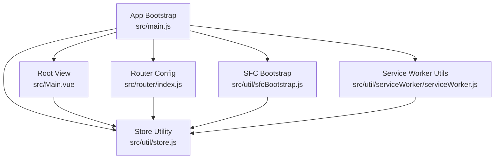
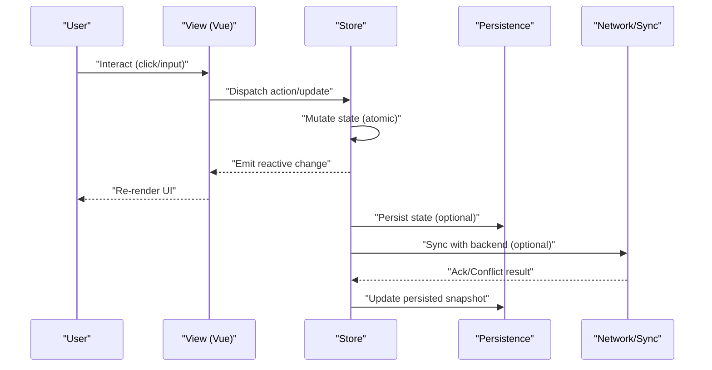
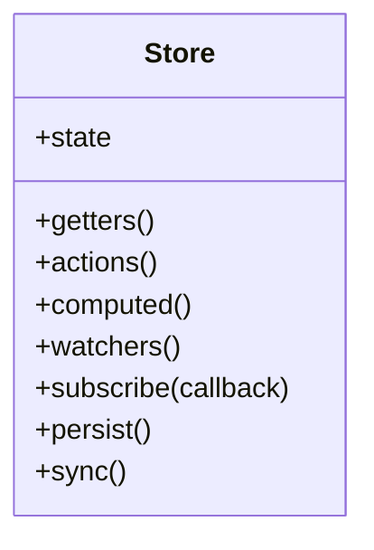
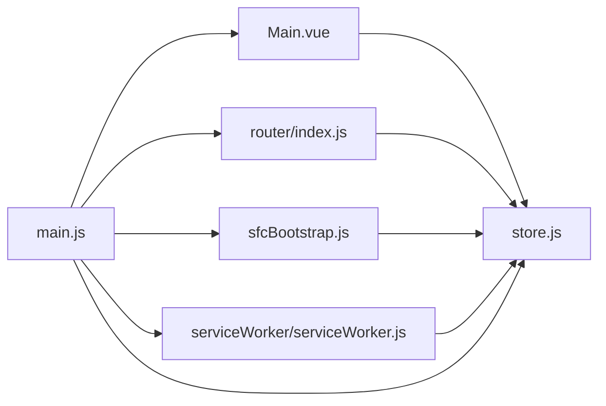
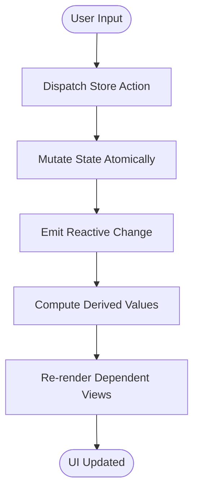

# State Management

<cite>
**Referenced Files in This Document**
- [store.js](file://src/util/store.js)
- [main.js](file://src/main.js)
- [Main.vue](file://src/Main.vue)
- [index.js](file://src/router/index.js)
- [sfcBootstrap.js](file://src/util/sfcBootstrap.js)
- [serviceWorker.js](file://src/util/serviceWorker/serviceWorker.js)
</cite>

## Table of Contents
1. [Introduction](#introduction)
2. [Project Structure](#project-structure)
3. [Core Components](#core-components)
4. [Architecture Overview](#architecture-overview)
5. [Detailed Component Analysis](#detailed-component-analysis)
6. [Dependency Analysis](#dependency-analysis)
7. [Performance Considerations](#performance-considerations)
8. [Troubleshooting Guide](#troubleshooting-guide)
9. [Conclusion](#conclusion)
10. [Appendices](#appendices)

## Introduction
This document explains the state management system used by the application, focusing on:
- Centralized store architecture and how it is initialized and provided to components
- Reactive data patterns and how views respond to state changes
- Cross-component communication via shared state
- Data flow from user interactions through state updates to view reactivity
- Examples of state mutations, computed properties, and watchers
- Persistence strategies for maintaining state across sessions and device restarts
- Synchronization with backend systems and conflict resolution strategies
- Guidelines for organizing state structure and naming conventions

The implementation leverages a lightweight reactive framework and a small custom store utility to keep state centralized and predictable.

## Project Structure
State-related code is primarily located under src/util and integrated into the app bootstrap and routing layers. The key files are:
- Store utility that exposes reactive state and actions
- Application bootstrap that initializes the store and provides it to the UI
- Router configuration that may depend on or update global state
- Service worker utilities that can persist or synchronize state offline

**Diagram sources**
- [main.js](file://src/main.js)
- [store.js](file://src/util/store.js)
- [Main.vue](file://src/Main.vue)
- [index.js](file://src/router/index.js)
- [sfcBootstrap.js](file://src/util/sfcBootstrap.js)
- [serviceWorker.js](file://src/util/serviceWorker/serviceWorker.js)

**Section sources**
- [main.js](file://src/main.js)
- [store.js](file://src/util/store.js)
- [Main.vue](file://src/Main.vue)
- [index.js](file://src/router/index.js)
- [sfcBootstrap.js](file://src/util/sfcBootstrap.js)
- [serviceWorker.js](file://src/util/serviceWorker/serviceWorker.js)

## Core Components
- Centralized Store
  - Provides a single source of truth for application state
  - Exposes reactive getters and setters (or actions) to mutate state safely
  - Emits change notifications so dependent views update automatically
- App Bootstrap
  - Initializes the store once at startup
  - Injects the store into the root component and any feature modules
- Root View
  - Consumes store state reactively and renders derived UI
- Router Integration
  - Reads/writes minimal state needed for navigation context
- SFC Bootstrap
  - Loads and wires up SFC-based features, ensuring they receive the same store instance
- Service Worker Utilities
  - Coordinates persistence and background sync when available

Key responsibilities:
- Keep state shape consistent and documented
- Ensure all mutations go through defined actions
- Provide computed values for derived state
- Watch for specific state changes to trigger side effects

**Section sources**
- [store.js](file://src/util/store.js)
- [main.js](file://src/main.js)
- [Main.vue](file://src/Main.vue)
- [index.js](file://src/router/index.js)
- [sfcBootstrap.js](file://src/util/sfcBootstrap.js)
- [serviceWorker.js](file://src/util/serviceWorker/serviceWorker.js)

## Architecture Overview
The state management follows a unidirectional data flow:
- User interactions trigger actions in the store
- Actions update state atomically and emit change events
- Views subscribe to reactive state and re-render automatically
- Optional persistence layer persists state changes
- Optional sync layer coordinates with backend services

**Diagram sources**
- [store.js](file://src/util/store.js)
- [main.js](file://src/main.js)
- [Main.vue](file://src/Main.vue)
- [serviceWorker.js](file://src/util/serviceWorker/serviceWorker.js)

## Detailed Component Analysis

### Store Utility
Responsibilities:
- Define the initial state shape
- Provide reactive accessors and mutation methods
- Emit change events for subscribers
- Optionally integrate with persistence and sync

Patterns:
- Centralized state object with clear namespaces
- Action functions that encapsulate mutations
- Computed helpers for derived values
- Watchers for side effects triggered by state changes

**Diagram sources**
- [store.js](file://src/util/store.js)

Guidelines:
- Group related fields under logical namespaces (e.g., ui, auth, catalog)
- Use verbs for actions (e.g., setItem, removeItem, fetchItems)
- Keep derived state in computed getters to avoid duplication
- Prefer small, focused actions over large monolithic ones

**Section sources**
- [store.js](file://src/util/store.js)

### App Bootstrap
Responsibilities:
- Initialize the store
- Provide it to the root component and feature loaders
- Start optional background tasks (e.g., service worker integration)

Integration points:
- Creates the store instance
- Wires the store into the Vue app instance
- Ensures SFC modules receive the same store reference

**Section sources**
- [main.js](file://src/main.js)
- [sfcBootstrap.js](file://src/util/sfcBootstrap.js)

### Root View
Responsibilities:
- Bind to store state reactively
- Render derived values using computed properties
- Dispatch actions in response to user input
- Observe specific state changes via watchers for non-UI side effects

Best practices:
- Avoid mutating state directly in templates
- Keep logic out of templates; use computed and methods
- Debounce expensive watchers if necessary

**Section sources**
- [Main.vue](file://src/Main.vue)

### Router Integration
Responsibilities:
- Read/write minimal state required for navigation context
- Trigger store actions based on route changes (e.g., loading resources)

Considerations:
- Keep router state minimal and separate from domain state
- Avoid heavy operations in route guards; delegate to store actions

**Section sources**
- [index.js](file://src/router/index.js)

### Service Worker Utilities
Responsibilities:
- Persist state to durable storage when available
- Coordinate background synchronization with backend
- Handle offline-first scenarios and conflict resolution

Strategies:
- Snapshot-based persistence with versioning
- Queue-and-replay for mutations when offline
- Last-write-wins or server-authoritative merge policies

**Section sources**
- [serviceWorker.js](file://src/util/serviceWorker/serviceWorker.js)

## Dependency Analysis
The following diagram shows how components depend on the store and each other:

**Diagram sources**
- [main.js](file://src/main.js)
- [store.js](file://src/util/store.js)
- [Main.vue](file://src/Main.vue)
- [index.js](file://src/router/index.js)
- [sfcBootstrap.js](file://src/util/sfcBootstrap.js)
- [serviceWorker.js](file://src/util/serviceWorker/serviceWorker.js)

Observations:
- Single source of truth: all modules depend on the same store instance
- Low coupling between views and persistence/sync logic
- Clear separation of concerns: UI, routing, and background tasks interact with the store only

**Section sources**
- [main.js](file://src/main.js)
- [store.js](file://src/util/store.js)
- [Main.vue](file://src/Main.vue)
- [index.js](file://src/router/index.js)
- [sfcBootstrap.js](file://src/util/sfcBootstrap.js)
- [serviceWorker.js](file://src/util/serviceWorker/serviceWorker.js)

## Performance Considerations
- Prefer computed properties for derived state to avoid redundant calculations
- Use targeted watchers instead of broad subscriptions when possible
- Batch multiple state updates within a single action to minimize re-renders
- Debounce frequent inputs (e.g., search) before dispatching actions
- Avoid deep reactivity on large objects; consider normalizing data structures
- Offload heavy work to workers or background tasks where feasible

[No sources needed since this section provides general guidance]

## Troubleshooting Guide
Common issues and resolutions:
- State not updating in views
  - Ensure you are calling store actions rather than mutating state directly
  - Verify that the component subscribes to the correct reactive field
- Unexpected re-renders
  - Check for unnecessary watchers or deeply nested reactive objects
  - Normalize data and memoize derived values
- Persistence failures
  - Validate storage availability and capacity
  - Inspect persisted snapshots for schema mismatches after upgrades
- Sync conflicts
  - Review conflict resolution policy (server-authoritative vs last-write-wins)
  - Log operation timestamps and IDs for debugging

Operational tips:
- Add logging around store actions to trace mutation flows
- Export a simple inspector helper to dump current state during development
- Use versioned snapshots to simplify migration and rollback

**Section sources**
- [store.js](file://src/util/store.js)
- [serviceWorker.js](file://src/util/serviceWorker/serviceWorker.js)

## Conclusion
The state management system centers around a single store that exposes reactive state and well-defined actions. Views consume state reactively, ensuring a clean unidirectional data flow. Persistence and synchronization are layered on top of the store, enabling offline-first behavior and eventual consistency with backend systems. Following the guidelines for organization, naming, and performance will keep the system maintainable and scalable.

[No sources needed since this section summarizes without analyzing specific files]

## Appendices

### Data Flow Example: From Interaction to Reactivity

[No sources needed since this diagram shows conceptual workflow, not actual code structure]

### State Organization and Naming Conventions
- Namespaces
  - Group related fields under logical namespaces (e.g., ui, auth, catalog)
- Field names
  - Use camelCase for fields and kebab-case for UI labels
- Actions
  - Use verb-noun pairs (e.g., setItem, removeItem, fetchItems)
- Derived state
  - Place in computed getters with descriptive names (e.g., filteredList)
- Side effects
  - Encapsulate in watchers or dedicated effect functions

[No sources needed since this section provides general guidance]