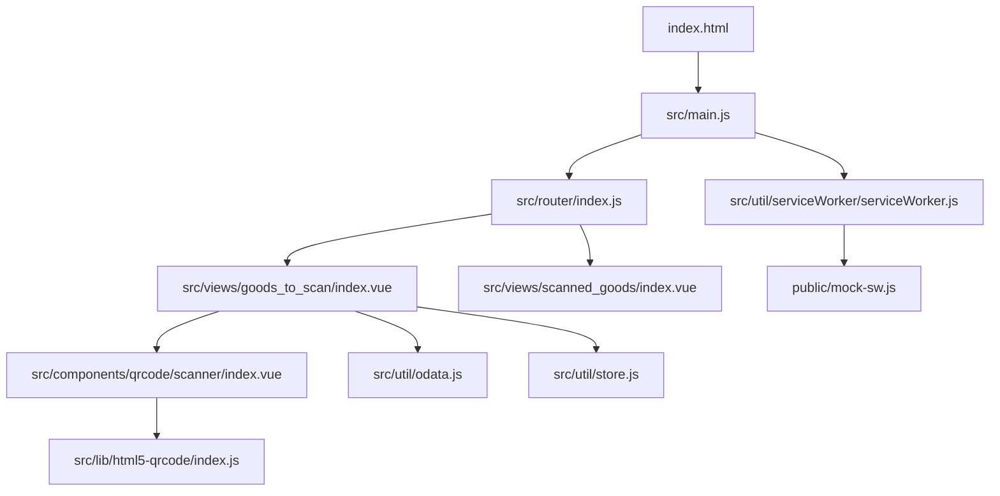
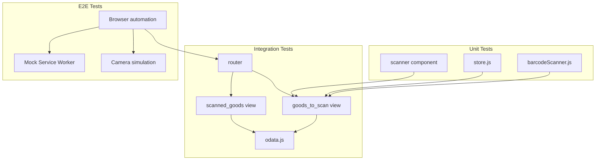
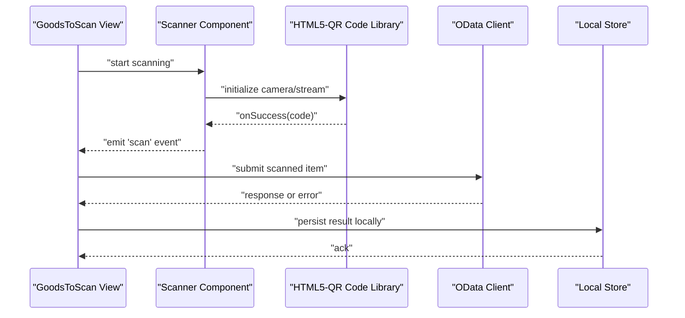
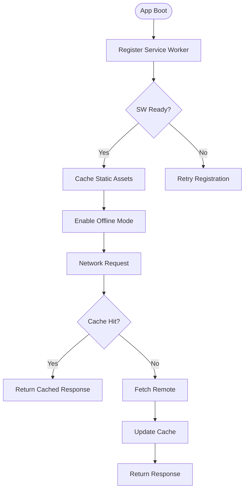
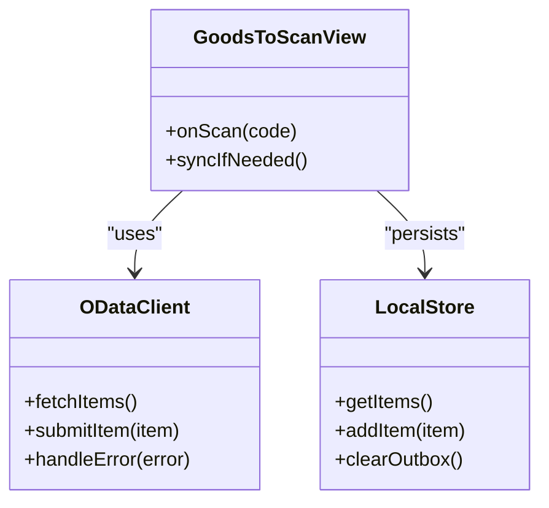
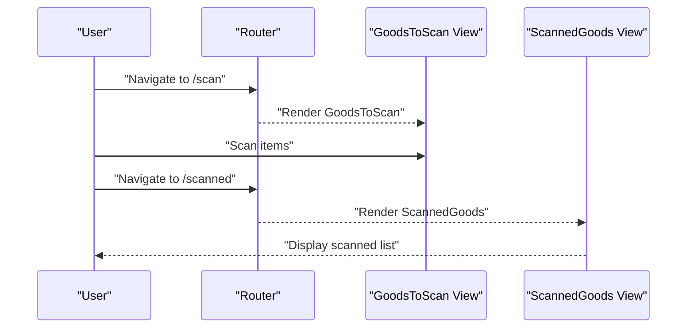
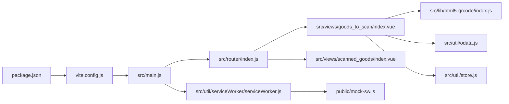

# Testing Strategy

<cite>
**Referenced Files in This Document**
- [package.json](file://package.json)
- [vite.config.js](file://vite.config.js)
- [src/main.js](file://src/main.js)
- [src/lib/html5-qrcode/index.js](file://src/lib/html5-qrcode/index.js)
- [src/util/barcodeScanner.js](file://src/util/barcodeScanner.js)
- [src/components/qrcode/scanner/index.vue](file://src/components/qrcode/scanner/index.vue)
- [src/util/serviceWorker/serviceWorker.js](file://src/util/serviceWorker/serviceWorker.js)
- [public/mock-sw.js](file://public/mock-sw.js)
- [src/views/goods_to_scan/index.vue](file://src/views/goods_to_scan/index.vue)
- [src/views/scanned_goods/index.vue](file://src/views/scanned_goods/index.vue)
- [src/router/index.js](file://src/router/index.js)
- [src/util/odata.js](file://src/util/odata.js)
- [src/util/store.js](file://src/util/store.js)
</cite>

## Table of Contents
1. [Introduction](#introduction)
2. [Project Structure](#project-structure)
3. [Core Components](#core-components)
4. [Architecture Overview](#architecture-overview)
5. [Detailed Component Analysis](#detailed-component-analysis)
6. [Dependency Analysis](#dependency-analysis)
7. [Performance Considerations](#performance-considerations)
8. [Troubleshooting Guide](#troubleshooting-guide)
9. [Conclusion](#conclusion)
10. [Appendices](#appendices)

## Introduction
This document defines the testing strategy for the AHM GR Scanner application. It covers unit, integration, and end-to-end testing approaches; isolated testing using mock data and service worker mocks; examples for barcode scanning, offline scenarios, and error conditions; tools and configuration setup; guidelines for maintainable tests and coverage; and performance and browser compatibility testing practices.

## Project Structure
The project is a Vue-based web app with:
- A main entry point that bootstraps the app and router
- Barcode scanning via an HTML5 QR code library and a custom scanner component
- Service Worker support for caching and offline behavior
- Views for scanning goods and reviewing scanned items
- Utilities for OData interactions and local store management

**Diagram sources**
- [src/main.js](file://src/main.js)
- [src/router/index.js](file://src/router/index.js)
- [src/views/goods_to_scan/index.vue](file://src/views/goods_to_scan/index.vue)
- [src/views/scanned_goods/index.vue](file://src/views/scanned_goods/index.vue)
- [src/components/qrcode/scanner/index.vue](file://src/components/qrcode/scanner/index.vue)
- [src/lib/html5-qrcode/index.js](file://src/lib/html5-qrcode/index.js)
- [src/util/odata.js](file://src/util/odata.js)
- [src/util/store.js](file://src/util/store.js)
- [src/util/serviceWorker/serviceWorker.js](file://src/util/serviceWorker/serviceWorker.js)
- [public/mock-sw.js](file://public/mock-sw.js)

**Section sources**
- [src/main.js](file://src/main.js)
- [src/router/index.js](file://src/router/index.js)
- [src/views/goods_to_scan/index.vue](file://src/views/goods_to_scan/index.vue)
- [src/views/scanned_goods/index.vue](file://src/views/scanned_goods/index.vue)
- [src/components/qrcode/scanner/index.vue](file://src/components/qrcode/scanner/index.vue)
- [src/lib/html5-qrcode/index.js](file://src/lib/html5-qrcode/index.js)
- [src/util/odata.js](file://src/util/odata.js)
- [src/util/store.js](file://src/util/store.js)
- [src/util/serviceWorker/serviceWorker.js](file://src/util/serviceWorker/serviceWorker.js)
- [public/mock-sw.js](file://public/mock-sw.js)

## Core Components
Key areas to test:
- Barcode scanning pipeline (library integration and UI component)
- Data layer (OData client and local store)
- Service Worker lifecycle and offline behavior
- Router-driven user flows across views

Focus on isolating external dependencies (camera, network, service worker) behind test doubles or environment flags.

**Section sources**
- [src/components/qrcode/scanner/index.vue](file://src/components/qrcode/scanner/index.vue)
- [src/lib/html5-qrcode/index.js](file://src/lib/html5-qrcode/index.js)
- [src/util/odata.js](file://src/util/odata.js)
- [src/util/store.js](file://src/util/store.js)
- [src/util/serviceWorker/serviceWorker.js](file://src/util/serviceWorker/serviceWorker.js)
- [public/mock-sw.js](file://public/mock-sw.js)

## Architecture Overview
Testing architecture aligns with runtime architecture:
- Unit tests target pure utilities and components with mocked I/O
- Integration tests exercise view-to-service interactions and routing
- End-to-end tests drive real browser flows with controlled environments (mock SW, stubbed camera/network)

[No sources needed since this diagram shows conceptual workflow, not actual code structure]

## Detailed Component Analysis

### Barcode Scanning Pipeline
Responsibilities:
- Initialize and control the HTML5 QR code library
- Emit scan results to the parent view
- Handle errors and permission issues

**Diagram sources**
- [src/views/goods_to_scan/index.vue](file://src/views/goods_to_scan/index.vue)
- [src/components/qrcode/scanner/index.vue](file://src/components/qrcode/scanner/index.vue)
- [src/lib/html5-qrcode/index.js](file://src/lib/html5-qrcode/index.js)
- [src/util/odata.js](file://src/util/odata.js)
- [src/util/store.js](file://src/util/store.js)

#### Unit Testing Approach
- Mock the HTML5 QR code library’s success callback to simulate scans without a camera
- Assert that the scanner component emits expected events and handles errors gracefully
- Validate barcode parsing logic in utility modules

**Section sources**
- [src/components/qrcode/scanner/index.vue](file://src/components/qrcode/scanner/index.vue)
- [src/lib/html5-qrcode/index.js](file://src/lib/html5-qrcode/index.js)
- [src/util/barcodeScanner.js](file://src/util/barcodeScanner.js)

#### Integration Testing Approach
- Mount the GoodsToScan view and simulate a scan event from the scanner component
- Stub OData calls to return deterministic payloads
- Verify state updates in the local store and UI transitions

**Section sources**
- [src/views/goods_to_scan/index.vue](file://src/views/goods_to_scan/index.vue)
- [src/util/odata.js](file://src/util/odata.js)
- [src/util/store.js](file://src/util/store.js)

#### End-to-End Testing Approach
- Use a headless browser to navigate to the scanning page
- Intercept network requests and serve canned responses
- Simulate camera permissions and stream availability if supported by the automation tool

**Section sources**
- [src/views/goods_to_scan/index.vue](file://src/views/goods_to_scan/index.vue)
- [src/util/odata.js](file://src/util/odata.js)

### Offline and Service Worker Behavior
Responsibilities:
- Register and manage the service worker
- Provide a mock service worker for testing
- Cache assets and API responses for offline use

**Diagram sources**
- [src/util/serviceWorker/serviceWorker.js](file://src/util/serviceWorker/serviceWorker.js)
- [public/mock-sw.js](file://public/mock-sw.js)

#### Unit Testing Approach
- Test service worker registration flow and readiness callbacks
- Validate cache keys and strategies used by the SW module

**Section sources**
- [src/util/serviceWorker/serviceWorker.js](file://src/util/serviceWorker/serviceWorker.js)

#### Integration Testing Approach
- Use the provided mock service worker to intercept fetches and return predefined payloads
- Verify offline retrieval paths and cache invalidation behaviors

**Section sources**
- [public/mock-sw.js](file://public/mock-sw.js)
- [src/util/serviceWorker/serviceWorker.js](file://src/util/serviceWorker/serviceWorker.js)

#### End-to-End Testing Approach
- Launch the app under a controlled environment where the mock service worker is active
- Disconnect network and assert that critical pages and data remain accessible

**Section sources**
- [public/mock-sw.js](file://public/mock-sw.js)
- [src/util/serviceWorker/serviceWorker.js](file://src/util/serviceWorker/serviceWorker.js)

### Data Layer: OData Client and Local Store
Responsibilities:
- Encapsulate HTTP interactions with OData endpoints
- Persist scanned items locally and synchronize when online

**Diagram sources**
- [src/util/odata.js](file://src/util/odata.js)
- [src/util/store.js](file://src/util/store.js)
- [src/views/goods_to_scan/index.vue](file://src/views/goods_to_scan/index.vue)

#### Unit Testing Approach
- Stub fetch/XHR to validate request formatting and response handling
- Assert local store mutations and query results

**Section sources**
- [src/util/odata.js](file://src/util/odata.js)
- [src/util/store.js](file://src/util/store.js)

#### Integration Testing Approach
- Mount the GoodsToScan view and trigger actions that call OData and update the store
- Verify correct error propagation and retry/backoff behavior

**Section sources**
- [src/views/goods_to_scan/index.vue](file://src/views/goods_to_scan/index.vue)
- [src/util/odata.js](file://src/util/odata.js)
- [src/util/store.js](file://src/util/store.js)

### Router and User Flows
Responsibilities:
- Navigate between scanning and review screens
- Preserve state across routes

**Diagram sources**
- [src/router/index.js](file://src/router/index.js)
- [src/views/goods_to_scan/index.vue](file://src/views/goods_to_scan/index.vue)
- [src/views/scanned_goods/index.vue](file://src/views/scanned_goods/index.vue)

#### Unit Testing Approach
- Assert route definitions and navigation guards (if any)
- Verify component props and emitted events during transitions

**Section sources**
- [src/router/index.js](file://src/router/index.js)
- [src/views/goods_to_scan/index.vue](file://src/views/goods_to_scan/index.vue)
- [src/views/scanned_goods/index.vue](file://src/views/scanned_goods/index.vue)

#### Integration Testing Approach
- Drive navigation programmatically and assert rendered content and state changes

**Section sources**
- [src/router/index.js](file://src/router/index.js)
- [src/views/goods_to_scan/index.vue](file://src/views/goods_to_scan/index.vue)
- [src/views/scanned_goods/index.vue](file://src/views/scanned_goods/index.vue)

## Dependency Analysis
External dependencies relevant to testing:
- HTML5 QR code library for camera-based scanning
- OData client for backend communication
- Service Worker for caching and offline behavior
- Build tooling (Vite) for development and test runs

**Diagram sources**
- [package.json](file://package.json)
- [vite.config.js](file://vite.config.js)
- [src/main.js](file://src/main.js)
- [src/router/index.js](file://src/router/index.js)
- [src/views/goods_to_scan/index.vue](file://src/views/goods_to_scan/index.vue)
- [src/views/scanned_goods/index.vue](file://src/views/scanned_goods/index.vue)
- [src/lib/html5-qrcode/index.js](file://src/lib/html5-qrcode/index.js)
- [src/util/odata.js](file://src/util/odata.js)
- [src/util/store.js](file://src/util/store.js)
- [src/util/serviceWorker/serviceWorker.js](file://src/util/serviceWorker/serviceWorker.js)
- [public/mock-sw.js](file://public/mock-sw.js)

**Section sources**
- [package.json](file://package.json)
- [vite.config.js](file://vite.config.js)
- [src/main.js](file://src/main.js)
- [src/router/index.js](file://src/router/index.js)
- [src/views/goods_to_scan/index.vue](file://src/views/goods_to_scan/index.vue)
- [src/views/scanned_goods/index.vue](file://src/views/scanned_goods/index.vue)
- [src/lib/html5-qrcode/index.js](file://src/lib/html5-qrcode/index.js)
- [src/util/odata.js](file://src/util/odata.js)
- [src/util/store.js](file://src/util/store.js)
- [src/util/serviceWorker/serviceWorker.js](file://src/util/serviceWorker/serviceWorker.js)
- [public/mock-sw.js](file://public/mock-sw.js)

## Performance Considerations
- Prefer lightweight unit tests over heavy DOM rendering where possible
- Batch assertions and avoid unnecessary re-renders in component tests
- Use deterministic timers and avoid real network calls in unit tests
- For E2E, limit the number of full-page navigations and reuse sessions
- Profile critical paths (e.g., repeated scans) and add benchmarks if necessary

[No sources needed since this section provides general guidance]

## Troubleshooting Guide
Common issues and resolutions:
- Camera permission denied: Ensure tests run in secure contexts and provide simulated streams or mocks
- Service Worker conflicts: Clear caches and unregister existing workers before tests
- Network flakiness: Always stub fetch/XHR and define clear error cases
- Time-sensitive operations: Use fake timers to control async flows deterministically

**Section sources**
- [src/util/serviceWorker/serviceWorker.js](file://src/util/serviceWorker/serviceWorker.js)
- [public/mock-sw.js](file://public/mock-sw.js)
- [src/util/odata.js](file://src/util/odata.js)

## Conclusion
A robust testing strategy for AHM GR Scanner combines isolated unit tests, focused integration tests, and targeted end-to-end flows. By mocking external systems (camera, network, service worker), the suite remains fast, reliable, and comprehensive across platforms.

[No sources needed since this section summarizes without analyzing specific files]

## Appendices

### Tools and Frameworks Setup
- Package manager and scripts are defined in the project manifest
- Build configuration is managed by Vite

**Section sources**
- [package.json](file://package.json)
- [vite.config.js](file://vite.config.js)

### Writing Maintainable Tests
- Keep tests small and focused on one behavior
- Name tests descriptively and group related cases
- Centralize fixtures and mock factories for reuse
- Avoid brittle selectors; prefer semantic queries and stable IDs
- Regularly review coverage reports and prioritize gaps in critical paths

[No sources needed since this section provides general guidance]

### Browser Compatibility Testing
- Run tests against multiple browsers using CI matrix configurations
- Validate feature detection for camera APIs and service workers
- Document known limitations and fallbacks per platform

[No sources needed since this section provides general guidance]